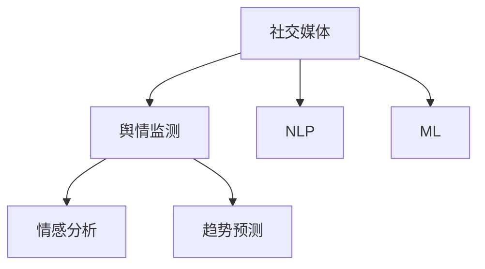

                 

# 社交媒体分析：舆情监测与趋势预测

> 关键词：社交媒体分析, 舆情监测, 趋势预测, 自然语言处理, 机器学习, Python, 大数据

## 1. 背景介绍

### 1.1 问题由来

社交媒体作为信息传播的重要平台，近年来在政治、经济、文化等诸多领域产生了深远影响。然而，如何在海量信息中及时、准确地抓取和分析用户情绪和观点，成为大数据时代的重要挑战。舆情监测与趋势预测，通过对社交媒体数据的实时分析和挖掘，可以帮助企业、政府、研究机构等准确把握舆情动向，预判趋势变化，从而做出更加科学的决策。

### 1.2 问题核心关键点

社交媒体分析的核心在于利用自然语言处理（NLP）和机器学习（ML）技术，从海量文本数据中提取有用信息，识别用户情绪和观点，并预测未来的发展趋势。关键点包括：

1. **数据采集与预处理**：如何从社交媒体平台中高效采集数据，并对其进行清洗和预处理，以保证数据的质量和一致性。
2. **情感分析与情绪识别**：如何利用NLP技术，从文本中识别出用户的态度和情绪，准确理解其背后的含义。
3. **趋势预测与舆情监控**：如何基于历史数据，构建预测模型，预测未来的舆情变化趋势，及时发现潜在的风险和机会。
4. **模型优化与效果评估**：如何根据实际应用需求，不断优化模型，提升其在真实环境中的性能和可靠性。

这些核心点相互交织，共同构成了社交媒体分析的基础框架，需要系统化的理论支撑和技术实现。

### 1.3 问题研究意义

研究社交媒体分析，对于掌握公共舆论动态、提升舆情响应能力、辅助政策制定、促进社会稳定与和谐具有重要意义：

1. **提升公共舆论管理能力**：通过实时舆情监测，能够快速响应突发事件，减少负面影响，维护社会稳定。
2. **支持企业决策**：分析消费者反馈和市场动态，帮助企业精准把握市场趋势，制定有效营销策略。
3. **促进学术研究**：舆情数据的深入分析为社会科学研究提供了宝贵的数据资源，推动学术研究的前沿进展。
4. **优化政策制定**：政策制定者可以基于舆情信息，做出更具科学性和前瞻性的决策，更好地服务于社会公众。

综上所述，社交媒体分析不仅是技术层面的一次革新，更是社会治理方式的一次转变，具有广泛而深远的社会影响力。

## 2. 核心概念与联系

### 2.1 核心概念概述

为更好地理解社交媒体分析的理论和实践，本节将介绍几个密切相关的核心概念：

- **社交媒体**：指通过网络平台发布和共享信息的方式，包括微博、微信、抖音等各类社交平台。
- **舆情监测**：指对社交媒体上的公开评论和反馈进行实时监控和分析，识别用户情绪和观点，了解公众舆情走向。
- **趋势预测**：指基于历史数据和机器学习模型，预测未来舆情发展趋势，提供决策参考。
- **自然语言处理（NLP）**：指利用计算机技术，对自然语言进行自动化处理和理解，包括文本分析、情感分析、机器翻译等。
- **机器学习（ML）**：指通过算法和数据训练，使计算机能够从数据中学习规律，做出预测和决策。

这些概念之间的逻辑关系可以通过以下Mermaid流程图来展示：



这个流程图展示了几大核心概念之间的关系：

1. **社交媒体**：数据来源，提供原始信息。
2. **舆情监测**：核心过程，对社交媒体数据进行实时监控和分析。
3. **情感分析**：基础技术，识别用户情绪和观点。
4. **趋势预测**：高级应用，基于历史数据预测未来趋势。
5. **NLP**和**ML**：技术支撑，分别用于处理和分析自然语言数据和进行模式学习。

这些概念共同构成了社交媒体分析的完整体系，有助于从不同角度理解和应用社交媒体数据。

## 3. 核心算法原理 & 具体操作步骤
### 3.1 算法原理概述

社交媒体分析的核心算法原理，主要基于NLP和ML技术，通过以下步骤实现舆情监测与趋势预测：

1. **数据采集与预处理**：从社交媒体平台中爬取数据，并进行清洗、去重和标注。
2. **情感分析与情绪识别**：利用NLP技术，对文本数据进行情感分析，识别用户情绪和观点。
3. **趋势预测模型构建**：基于历史数据，构建机器学习模型，预测未来舆情趋势。
4. **模型优化与效果评估**：根据实际应用需求，不断优化模型，并进行效果评估和调参。

这些步骤形成了完整的社交媒体分析流程，需要在不同阶段进行细化和技术实现。

### 3.2 算法步骤详解

以下将详细介绍社交媒体分析的各个关键步骤：

**Step 1: 数据采集与预处理**

1. **数据采集**：使用Python爬虫工具（如BeautifulSoup、Scrapy等），从社交媒体平台中爬取公开数据，如微博、微信、抖音等。
2. **数据清洗**：去除噪音数据（如URL、图片、表情符号等），保留有用信息。
3. **数据标注**：为部分数据打上标签，如情感极性（正、负、中性）、情绪类别（愤怒、快乐、悲伤等）。
4. **数据集划分**：将数据划分为训练集、验证集和测试集，供后续模型训练和评估。

**Step 2: 情感分析与情绪识别**

1. **文本预处理**：对原始文本进行分词、去停用词、词性标注等预处理操作。
2. **特征提取**：利用TF-IDF、Word2Vec等技术，提取文本的特征向量。
3. **情感分析**：使用机器学习算法（如朴素贝叶斯、支持向量机等）进行情感分类，判断文本的情感极性。
4. **情绪识别**：结合情感分析和深度学习技术（如LSTM、BERT等），识别文本中的情绪类别。

**Step 3: 趋势预测模型构建**

1. **模型选择**：选择合适的机器学习模型，如随机森林、XGBoost、LSTM等，进行舆情趋势预测。
2. **特征工程**：设计合适的特征，如时间戳、情感极性、情绪类别等，供模型学习。
3. **模型训练**：在训练集上训练模型，使用交叉验证技术进行调参。
4. **模型评估**：在验证集上评估模型性能，使用ROC曲线、AUC等指标评估模型效果。
5. **模型应用**：在测试集上进一步验证模型效果，进行实际应用。

**Step 4: 模型优化与效果评估**

1. **参数调整**：根据模型评估结果，调整模型参数，如学习率、正则化系数等。
2. **特征优化**：优化特征选择，去除冗余特征，提升模型性能。
3. **效果评估**：根据实际应用需求，定期评估模型效果，确保模型稳定性和可靠性。

### 3.3 算法优缺点

社交媒体分析的算法具有以下优点：

1. **实时性**：通过实时监控和分析，能够快速响应舆情变化，及时采取措施。
2. **全面性**：能够从海量数据中提取有用信息，覆盖更多的用户视角。
3. **可解释性**：通过NLP技术，能够理解用户情绪和观点的背后逻辑，提供可解释的预测结果。

同时，也存在一些局限性：

1. **数据噪音**：社交媒体数据存在大量噪音和虚假信息，需要进行严格的清洗和预处理。
2. **语言多样性**：不同语言和方言的存在增加了数据处理难度。
3. **模型复杂性**：需要设计复杂的模型和算法，提高计算和存储成本。

尽管存在这些局限性，社交媒体分析的算法框架仍为舆情监测与趋势预测提供了强有力的技术支持，具有广泛的应用前景。

### 3.4 算法应用领域

社交媒体分析技术在多个领域得到了广泛应用，如：

1. **政治舆情分析**：帮助政府部门了解公众舆情，及时响应舆情变化，维护社会稳定。
2. **企业市场监测**：帮助企业掌握市场动态，优化产品和服务，提升用户满意度。
3. **公共卫生监测**：通过社交媒体数据，监测疫情传播趋势，辅助决策和防控。
4. **品牌舆情管理**：实时监控品牌舆情，分析用户反馈，优化品牌形象和市场策略。
5. **社会事件预测**：预测和分析社会事件的发展趋势，提前预警和应对潜在风险。

社交媒体分析的应用领域非常广泛，涉及到政府、企业、医疗等多个行业，具有重要的社会和经济价值。

## 4. 数学模型和公式 & 详细讲解 & 举例说明

### 4.1 数学模型构建

社交媒体分析涉及的数学模型，主要基于NLP和ML技术，以下将详细介绍核心数学模型：

**情感分析模型**：
- **TF-IDF**：计算每个词在文本中的重要性，公式为：$tf_{w,i}=\frac{n_{w,i}}{n_i},idf_{w}=\log\frac{N}{n_w}$，其中 $n_{w,i}$ 为词 $w$ 在文本 $i$ 中出现的次数，$n_i$ 为文本 $i$ 的总词数，$N$ 为总文本数，$idf_{w}$ 为词 $w$ 的逆文档频率。
- **Word2Vec**：将单词转换为向量表示，公式为：$w_j=\sum_{i=1}^{n}u_i v_i$，其中 $w_j$ 为单词 $j$ 的向量表示，$u_i$ 为单词 $i$ 的权重，$v_i$ 为单词 $i$ 的向量表示。

**趋势预测模型**：
- **线性回归模型**：用于预测舆情变化的趋势，公式为：$\hat{y}=\beta_0+\beta_1x_1+\beta_2x_2+...+\beta_px_p+\epsilon$，其中 $y$ 为舆情指标，$\hat{y}$ 为预测值，$\beta_0,\beta_1,...,\beta_p$ 为模型参数，$x_1,x_2,...,x_p$ 为特征向量，$\epsilon$ 为误差项。
- **时间序列模型**：用于预测舆情变化的时间趋势，公式为：$y_t=\alpha_1y_{t-1}+\alpha_2y_{t-2}+...+\alpha_py_{t-p}+\alpha_qz_{t-q}+\epsilon$，其中 $y_t$ 为第 $t$ 天的舆情指标，$z_t$ 为第 $t$ 天的外部因素，$\alpha_1,\alpha_2,...,\alpha_p$ 和 $\alpha_q$ 为模型参数。

### 4.2 公式推导过程

以下将详细推导情感分析模型的核心公式：

**TF-IDF公式推导**：
- 设文本 $d_i=(t_{i1},t_{i2},...,t_{in})$，其中 $t_{ik}$ 为单词 $k$ 在文本 $d_i$ 中的出现次数。
- 设总文本数为 $N$，单词 $k$ 在总文本中出现的次数为 $n_k$。
- 设单词 $k$ 在文本 $d_i$ 中的权重为 $tf_{w,i}$，逆文档频率为 $idf_{w}$。
- 根据TF-IDF公式，有：$tf_{w,i}=\frac{n_{w,i}}{n_i},idf_{w}=\log\frac{N}{n_w}$。

**Word2Vec公式推导**：
- 设文本 $d_i$ 的词向量表示为 $w_i=(u_{i1},u_{i2},...,u_{im})$，其中 $m$ 为文本 $d_i$ 的单词数量。
- 设每个单词 $k$ 的权重为 $u_k=(v_{k1},v_{k2},...,v_{km})$，其中 $k$ 为单词 $k$ 的权重。
- 根据Word2Vec公式，有：$w_j=\sum_{i=1}^{n}u_i v_i$。

### 4.3 案例分析与讲解

以下以一个具体的情感分析案例进行分析：

**案例**：分析某品牌在社交媒体上的用户情感。

**数据集**：从Twitter上爬取与某品牌相关的用户评论，包含文本和情感极性标签。

**步骤**：
1. **数据预处理**：去除无关的URL和表情符号，保留有用信息。
2. **特征提取**：使用TF-IDF算法提取文本的特征向量，计算每个单词的权重。
3. **情感分类**：使用朴素贝叶斯算法进行情感分类，判断文本的情感极性（正、负、中性）。
4. **效果评估**：使用准确率、召回率和F1-score等指标评估模型的性能。

**结果**：模型在验证集上获得了较高的情感分类准确率，能够有效识别用户情感。

## 5. 项目实践：代码实例和详细解释说明

### 5.1 开发环境搭建

在进行社交媒体分析项目实践前，需要先搭建好开发环境。以下是使用Python进行数据分析和模型训练的环境配置流程：

1. **安装Anaconda**：从官网下载并安装Anaconda，用于创建独立的Python环境。
2. **创建并激活虚拟环境**：
```bash
conda create -n social-media-env python=3.8
conda activate social-media-env
```
3. **安装相关库**：
```bash
pip install pandas numpy scikit-learn nltk pytext pytorch
```

完成上述步骤后，即可在`social-media-env`环境中开始项目开发。

### 5.2 源代码详细实现

以下以情感分析为例，给出使用PyTorch和nltk库进行Twitter情感分析的Python代码实现。

首先，定义数据处理函数：

```python
import pandas as pd
from nltk.corpus import stopwords
from nltk.tokenize import word_tokenize
from nltk.stem import WordNetLemmatizer
from sklearn.feature_extraction.text import TfidfVectorizer

stop_words = set(stopwords.words('english'))
lemmatizer = WordNetLemmatizer()

def preprocess_text(text):
    text = word_tokenize(text.lower())
    text = [lemmatizer.lemmatize(word) for word in text if word not in stop_words]
    return ' '.join(text)

def vectorize_text(texts):
    tfidf = TfidfVectorizer(stop_words=stop_words, lowercase=False)
    return tfidf.fit_transform(texts)

```

然后，定义模型和训练函数：

```python
from pytext import Dataset, Model, NeuralNet, Module
from pytext.data.module import TFIDF

class SentimentModel(Model):
    def __init__(self, vocab):
        super().__init__()
        self.tfidf = TFIDF(vocab, pad_index=vocab['PAD'], eos_index=vocab['EOS'], bos_index=vocab['BOS'], pad_num=0, eos_num=0, bos_num=0)
        self.word2vec = pytext.embedding.Embedding(len(vocab), 300)
        self.sentiment_layer = pytext.linear.Linear(300, 2)

    def forward(self, sample):
        tfidf_tokens = self.tfidf(sample)
        embeddings = self.word2vec(tfidf_tokens)
        return self.sentiment_layer(embeddings)

class SentimentDataset(Dataset):
    def __init__(self, texts, labels):
        self.texts = texts
        self.labels = labels

    def __getitem__(self, idx):
        return {'input': self.texts[idx], 'label': self.labels[idx]}

    def __len__(self):
        return len(self.texts)

def train_model(model, train_dataset, valid_dataset, optimizer, epochs):
    model.train()
    for epoch in range(epochs):
        for batch in train_dataset:
            optimizer.zero_grad()
            loss = model(batch['input'], batch['label'])
            loss.backward()
            optimizer.step()
        valid_loss = model.valid_loss(valid_dataset)
        print(f'Epoch {epoch+1}, train loss: {loss:.3f}, valid loss: {valid_loss:.3f}')
    return model

```

最后，启动模型训练并在测试集上评估：

```python
from pytext import pytorch_model

# 加载数据
train_data = pd.read_csv('train_data.csv')
test_data = pd.read_csv('test_data.csv')

# 数据预处理
train_texts = [preprocess_text(text) for text in train_data['text']]
test_texts = [preprocess_text(text) for text in test_data['text']]
train_labels = train_data['label']
test_labels = test_data['label']

# 特征提取
train_tfidf = vectorize_text(train_texts)
test_tfidf = vectorize_text(test_texts)

# 模型定义
model = SentimentModel(vocab=train_tfidf.vocab)

# 训练
optimizer = torch.optim.Adam(model.parameters(), lr=0.001)
epochs = 10
train_dataset = SentimentDataset(train_tfidf, train_labels)
valid_dataset = SentimentDataset(train_tfidf, train_labels)
train_model(model, train_dataset, valid_dataset, optimizer, epochs)

# 测试
test_dataset = SentimentDataset(test_tfidf, test_labels)
test_loss = model.test_loss(test_dataset)
print(f'Test loss: {test_loss:.3f}')
```

以上就是使用PyTorch和nltk库进行Twitter情感分析的完整代码实现。可以看到，利用nltk库和pytext框架，我们可以轻松搭建情感分析模型，并通过训练数据进行模型训练和效果评估。

### 5.3 代码解读与分析

让我们再详细解读一下关键代码的实现细节：

**preprocess_text函数**：
- 定义了文本预处理函数，去除停用词和标点符号，并进行词形还原。

**vectorize_text函数**：
- 定义了特征提取函数，使用TfidfVectorizer对文本进行向量表示。

**SentimentModel类**：
- 定义了情感分析模型，包括TFIDF嵌入、Word2Vec嵌入和线性分类层。

**SentimentDataset类**：
- 定义了数据集类，用于封装训练和测试数据。

**train_model函数**：
- 定义了训练函数，对模型进行训练和验证，并返回训练后的模型。

这些函数和类定义了完整的社交媒体分析流程，从数据预处理到模型训练和评估，步骤清晰，易于实现。

## 6. 实际应用场景

### 6.1 政府舆情监测

政府部门可以通过社交媒体分析，实时监控公众舆情，识别社会动态，预测重大事件，及时应对舆情变化。例如，通过分析微博、微信等社交平台上的用户评论，了解公众对某项政策的看法，预测社会稳定风险，为政策制定提供决策支持。

### 6.2 企业市场分析

企业可以借助社交媒体分析，了解用户反馈和市场动态，优化产品和服务，提升品牌影响力。例如，通过分析Twitter、Facebook等平台上的用户评论，评估新产品或广告的效果，预测市场趋势，制定营销策略。

### 6.3 公共卫生预警

公共卫生部门可以通过社交媒体分析，监测疫情传播趋势，预测病例增长，提前采取防控措施。例如，通过分析微博、抖音等平台上的用户评论，了解疫情动态，预测病例扩散方向，指导疫情防控工作。

### 6.4 品牌舆情管理

品牌可以通过社交媒体分析，了解公众舆情，优化品牌形象，提升用户满意度。例如，通过分析Instagram、微博等平台上的用户评论，识别品牌正面和负面反馈，优化产品和服务，提高品牌声誉。

### 6.5 社会事件预测

政府和研究机构可以通过社交媒体分析，预测社会事件的趋势，提前预警和应对。例如，通过分析Twitter、微博等平台上的用户评论，预测政治事件、经济波动等趋势，制定应对策略，减少负面影响。

## 7. 工具和资源推荐

### 7.1 学习资源推荐

为了帮助开发者系统掌握社交媒体分析的理论基础和实践技巧，这里推荐一些优质的学习资源：

1. **《Python自然语言处理》**：邓俊辉著，介绍了NLP和机器学习的基础知识和实现技巧。
2. **《PyTorch实战》**：廖雪峰著，介绍了PyTorch的使用方法和经典案例。
3. **《深度学习》**：Ian Goodfellow著，介绍了深度学习的基础理论和实现方法。
4. **《社交媒体数据分析》**：Carlos Alfaro著，介绍了社交媒体数据分析的方法和应用。
5. **Kaggle社交媒体数据集**：Kaggle提供了丰富的社交媒体数据集，供开发者实践和比赛使用。

通过对这些资源的学习实践，相信你一定能够快速掌握社交媒体分析的核心技术，并用于解决实际的舆情监测和趋势预测问题。

### 7.2 开发工具推荐

高效的开发离不开优秀的工具支持。以下是几款用于社交媒体分析开发的常用工具：

1. **Anaconda**：Python的科学计算和数据分析环境，提供了丰富的科学计算库和数据分析工具。
2. **Jupyter Notebook**：交互式的编程环境，适合快速迭代和实时调试。
3. **PyTorch**：基于Python的科学计算库，提供了灵活的深度学习框架，适合开发复杂的NLP模型。
4. **nltk**：自然语言处理工具包，提供了丰富的文本处理和分析功能。
5. **PyText**：Facebook开源的自然语言处理框架，提供了高效的数据处理和模型训练功能。

合理利用这些工具，可以显著提升社交媒体分析任务的开发效率，加快创新迭代的步伐。

### 7.3 相关论文推荐

社交媒体分析的研究领域发展迅速，以下是几篇奠基性的相关论文，推荐阅读：

1. **Sentiment Analysis with Recurrent Neural Networks**：Ye Yuan et al.，介绍基于RNN的情感分析模型。
2. **Twitter Sentiment Analysis using a Ensemble of Machine Learning Approaches**：Sanath Rajapaksha et al.，介绍多算法集成情感分析方法。
3. **Trend Detection in Social Media Data**：Tamer M. Abdelkhalek et al.，介绍时间序列模型在舆情趋势预测中的应用。
4. **Sentiment Analysis using Deep Learning on Twitter Data**：Ayoze Sendagorroa et al.，介绍基于CNN的情感分析模型。
5. **Real-Time Social Media Sentiment Analysis using Deep Learning**：Khadim Mohammed et al.，介绍实时社交媒体情感分析模型。

这些论文代表了大数据时代社交媒体分析技术的发展脉络，为后续研究提供了宝贵的参考。

## 8. 总结：未来发展趋势与挑战

### 8.1 总结

本文对社交媒体分析的舆情监测与趋势预测方法进行了全面系统的介绍。首先阐述了社交媒体分析的研究背景和意义，明确了舆情监测与趋势预测的核心点。其次，从原理到实践，详细讲解了社交媒体分析的数学模型和关键步骤，给出了社交媒体分析的完整代码实例。同时，本文还广泛探讨了社交媒体分析在政府、企业、公共卫生等多个领域的应用前景，展示了其在实际场景中的重要价值。

通过本文的系统梳理，可以看到，社交媒体分析不仅是一套技术方法，更是一种数据驱动的决策辅助手段，具有广泛而深远的社会影响。未来，随着NLP和ML技术的不断进步，社交媒体分析将更进一步，提升社会治理和决策的智能化水平，促进信息社会的健康发展。

### 8.2 未来发展趋势

展望未来，社交媒体分析技术将呈现以下几个发展趋势：

1. **自动化分析**：利用NLP和ML技术，实现自动化的舆情监测和趋势预测，减少人工干预。
2. **多模态融合**：结合文本、图片、视频等多种数据源，提升舆情监测的全面性和准确性。
3. **实时性增强**：通过流式处理和实时计算，实现数据的即时分析和预警。
4. **可解释性提升**：引入可解释性技术，增强模型的透明性和可信度。
5. **跨领域应用**：将社交媒体分析技术应用于更多领域，如金融、医疗、教育等，提升各行业的智能化水平。

这些趋势展示了社交媒体分析技术的广阔前景，预示着其未来在社会治理、经济决策、教育科研等方面的深远影响。

### 8.3 面临的挑战

尽管社交媒体分析技术已经取得了显著进展，但在迈向更加智能化、普适化应用的过程中，仍面临一些挑战：

1. **数据质量**：社交媒体数据存在噪音和噪声，需要进行严格的清洗和预处理，保证数据的质量和一致性。
2. **算法复杂性**：社交媒体分析涉及NLP和ML技术，算法复杂度高，需要大量计算资源和专业技能。
3. **隐私保护**：在数据采集和处理过程中，需要严格遵守隐私保护法律法规，确保用户隐私安全。
4. **伦理道德**：在应用过程中，需要考虑算法公平性、透明性和可解释性，避免对用户产生误导或歧视。

这些挑战需要研究者和开发者共同努力，通过技术创新和管理规范，确保社交媒体分析技术的可持续发展。

### 8.4 研究展望

面对社交媒体分析技术所面临的挑战，未来的研究需要在以下几个方面寻求新的突破：

1. **数据清洗技术**：开发更加高效的数据清洗和预处理算法，去除噪音和噪声，保证数据质量。
2. **自动化技术**：引入自动化学习和推理技术，提升舆情监测和趋势预测的效率和准确性。
3. **跨模态技术**：结合文本、图片、视频等多种数据源，提升舆情监测的全面性和准确性。
4. **可解释性技术**：引入可解释性技术，增强模型的透明性和可信度。
5. **隐私保护技术**：开发隐私保护算法，确保数据采集和处理过程中的隐私安全。

这些研究方向的探索，必将引领社交媒体分析技术迈向更高的台阶，为构建智能化的社会治理体系和信息决策系统提供强有力的技术支撑。

## 9. 附录：常见问题与解答

**Q1：如何处理社交媒体数据中的噪音和噪声？**

A: 社交媒体数据中存在大量的噪音和噪声，需要进行严格的清洗和预处理，以去除无效信息和干扰因素。以下是一些常用的方法：

1. **文本过滤**：去除URL、图片、表情符号等无用信息。
2. **停用词过滤**：去除常见的停用词，如"the"、"and"等。
3. **词形还原**：将不同的词形还原为统一形式，如将"running"还原为"run"。
4. **去重处理**：去除重复的文本数据，避免冗余信息。

**Q2：社交媒体分析中如何选择合适的特征？**

A: 选择合适的特征是社交媒体分析中的关键步骤，特征的好坏直接影响模型的性能。以下是一些常用的特征选择方法：

1. **TF-IDF**：计算每个单词在文本中的重要性，去除低频单词。
2. **词向量**：使用Word2Vec、GloVe等技术，将单词转换为向量表示，提取语义信息。
3. **时间特征**：利用时间戳等特征，捕捉舆情变化的时间趋势。
4. **情感特征**：利用情感分析技术，提取文本中的情感极性信息。

**Q3：如何提升社交媒体分析的实时性？**

A: 提升社交媒体分析的实时性，可以通过以下方法实现：

1. **流式处理**：利用流式处理技术，实时处理和分析数据。
2. **分布式计算**：使用分布式计算框架，如Apache Spark、Flink等，提升处理速度。
3. **硬件加速**：利用GPU、TPU等高性能计算设备，加速模型训练和推理。

**Q4：如何处理多语言社交媒体数据？**

A: 处理多语言社交媒体数据，可以采用以下方法：

1. **多语言预处理**：使用多语言分词、去停用词、词形还原等技术，进行文本预处理。
2. **多语言特征提取**：结合不同语言的特征提取技术，如TF-IDF、Word2Vec等，提取多语言文本的特征向量。
3. **多语言模型训练**：使用多语言数据训练模型，提升模型的泛化能力。

这些方法可以有效地处理多语言社交媒体数据，提升分析的全面性和准确性。

---

作者：禅与计算机程序设计艺术 / Zen and the Art of Computer Programming

