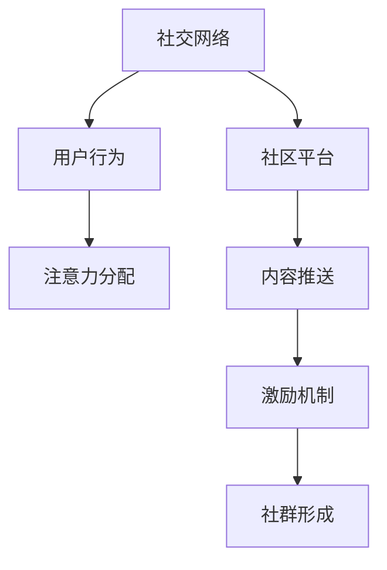

                 

## 1. 背景介绍

### 1.1 问题由来

在互联网时代，信息过载已经成为不争的事实。数以亿计的信息在瞬息间产生和传播，人们需要花费大量时间在筛选和处理信息上。传统的搜索引擎、内容聚合平台虽然提供了便利的信息检索功能，但缺乏对用户注意力的深入挖掘，无法满足用户个性化的信息需求。

社群经济作为一种新兴的经济模式，利用社交网络和社区平台，将用户注意力有效地聚集和引导，形成具有高粘性、高互动性的社群，实现更高效、更有价值的信息流动和交易。

### 1.2 问题核心关键点

社群经济的核心在于如何通过网络社交关系，构建深度互动、兴趣一致的社区，吸引并保持用户的长期关注。通过社群内部的信息流动，实现从内容创作到用户反馈的闭环反馈，提升用户满意度和社区活跃度。

核心问题包括：
1. **注意力分布**：如何识别和引导用户注意力，使其在平台上有效聚集？
2. **社群形成**：如何构建具有高粘性、高互动性的社区，维持用户长期关注？
3. **内容推送**：如何根据用户兴趣和行为，推送个性化的内容，提升用户粘性？
4. **激励机制**：如何通过合理的激励机制，鼓励用户创作和互动，保持社群活力？

## 2. 核心概念与联系

### 2.1 核心概念概述

为更好地理解社群经济，本节将介绍几个密切相关的核心概念：

- **社群经济**：基于社交网络和社区平台的经济模式，通过深度互动、兴趣一致的社群，实现更高效的信息流动和交易。
- **社交网络**：由节点（用户）和边（关系）构成的网络结构，用于表示用户间的交互和信息流动。
- **社区平台**：提供在线社交和互动的平台，提供论坛、博客、短视频等多种内容形态，支持用户创作和互动。
- **用户行为**：用户在平台上的浏览、点赞、评论、分享等行为，反映其兴趣和偏好。
- **注意力分配**：用户对不同内容的关注程度和停留时间，反映其信息需求和兴趣分布。

这些概念之间的逻辑关系可以通过以下Mermaid流程图来展示：



这个流程图展示了几者之间的核心联系：

1. 社交网络提供用户间的关系图，是社区平台的基础。
2. 社区平台通过内容推送和激励机制，吸引并保持用户注意力，构建社群。
3. 用户行为和注意力分配反映用户兴趣和需求，影响内容推送策略。
4. 激励机制通过奖励创作和互动，进一步增强社群活力。

这些概念共同构成了社群经济的核心框架，使其能够在信息时代下，高效地吸引和利用用户注意力。

## 3. 核心算法原理 & 具体操作步骤
### 3.1 算法原理概述

社群经济的注意力聚集过程，本质上是一个基于社交网络和社区平台的算法优化问题。其核心思想是：通过算法优化，将用户的注意力有效地引导到社区平台，形成高粘性、高互动性的社群，实现信息的高效流动和价值转化。

形式化地，假设用户集合为 $U$，内容集合为 $C$，社交网络结构为 $G=(U,E)$，其中 $E$ 表示用户间的交互关系。社区平台的注意力聚集过程可以描述为：

$$
\max_{\mathcal{A}} \sum_{u \in U} \sum_{c \in C} a_{u,c} \cdot R(u,c)
$$

其中 $\mathcal{A}$ 为用户对内容的注意力分配向量，$R(u,c)$ 为内容 $c$ 对用户 $u$ 的吸引度。目标是通过优化 $\mathcal{A}$，最大化用户对内容的整体关注度。

### 3.2 算法步骤详解

社群经济中的注意力聚集过程，一般包括以下几个关键步骤：

**Step 1: 用户兴趣建模**

- 收集用户行为数据，包括浏览历史、点赞记录、评论内容等，构建用户兴趣模型。
- 使用向量空间模型或协同过滤算法，将用户兴趣表示为高维向量。

**Step 2: 内容推荐**

- 将内容与用户兴趣模型进行匹配，计算用户对内容的吸引度。
- 使用基于协同过滤、基于内容的推荐算法，生成个性化的内容推荐列表。

**Step 3: 内容展示与互动**

- 将推荐内容展示给用户，并提供点赞、评论、分享等互动接口。
- 根据用户互动数据，动态调整内容推荐策略，提升用户满意度。

**Step 4: 用户留存与激励**

- 通过分析用户行为数据，识别高流失用户，进行定向挽留。
- 设计激励机制，如积分系统、奖励排行榜，鼓励用户积极参与和互动。

**Step 5: 社群形成与维护**

- 构建社区平台，提供论坛、博客、短视频等多种内容形态，支持用户创作和互动。
- 通过用户互动数据，识别并培养社区意见领袖，提升社群活力。

### 3.3 算法优缺点

社群经济中的注意力聚集算法，具有以下优点：

1. **个性化推荐**：通过分析用户行为，实现个性化内容推荐，提升用户粘性。
2. **高互动性**：通过提供点赞、评论、分享等互动功能，增强用户参与感，形成高粘性社群。
3. **高效率**：通过优化算法，实现高效的信息流动和价值转化。

同时，该算法也存在一定的局限性：

1. **数据依赖**：算法效果依赖于用户行为数据的收集和分析，数据质量对算法效果有重要影响。
2. **隐私风险**：用户行为数据的收集和分析可能带来隐私风险，需要合理保护用户隐私。
3. **动态性挑战**：用户兴趣和需求变化快，算法需要不断更新以适应变化。
4. **信息过载**：在信息爆炸的背景下，用户面临的信息过载问题依然存在，需要优化推荐算法以提升用户体验。

尽管存在这些局限性，但社群经济模式通过社交网络和社区平台，显著提升了信息流动和价值转化的效率，为信息时代下的经济模式探索提供了新思路。

### 3.4 算法应用领域

社群经济的应用场景十分广泛，涵盖了社交网络、社区平台、在线广告等多个领域。以下是几个典型应用：

1. **社交网络**：如微信朋友圈、微博、Instagram等平台，通过个性化的内容推荐和互动功能，构建高粘性社群。

2. **社区平台**：如知乎、豆瓣、Reddit等，通过内容创作和互动，形成知识共享和兴趣交流的社区。

3. **在线广告**：如Facebook广告、今日头条信息流广告，通过分析用户行为数据，实现精准投放和个性化推荐，提升广告效果。

4. **在线教育**：如Coursera、Udemy等平台，通过社区互动和内容推荐，增强学习效果和用户体验。

5. **电子商务**：如淘宝、京东、Amazon等平台，通过个性化推荐和社区互动，提升用户粘性和购买转化率。

这些应用场景展示了社群经济模式的强大潜力，通过社交网络和社区平台，社群经济有望在更多领域实现商业价值和社会价值的双重提升。

## 4. 数学模型和公式 & 详细讲解 & 举例说明
### 4.1 数学模型构建

本节将使用数学语言对社群经济中的注意力聚集过程进行更加严格的刻画。

假设用户集合为 $U$，内容集合为 $C$，社交网络结构为 $G=(U,E)$，其中 $E$ 表示用户间的交互关系。社区平台的注意力分配向量为 $\mathcal{A}=\{a_{u,c}\}_{u \in U, c \in C}$，其中 $a_{u,c}$ 表示用户 $u$ 对内容 $c$ 的关注度。

用户对内容的吸引度 $R(u,c)$ 可以表示为：

$$
R(u,c) = \alpha \cdot \text{f}_1(u,c) + \beta \cdot \text{f}_2(u,c)
$$

其中 $\alpha, \beta$ 为系数，$\text{f}_1(u,c)$ 为用户兴趣与内容相关性，$\text{f}_2(u,c)$ 为内容质量评估。

社群经济的目标是最大化用户对内容的整体关注度，即：

$$
\max_{\mathcal{A}} \sum_{u \in U} \sum_{c \in C} a_{u,c} \cdot R(u,c)
$$

通过优化 $\mathcal{A}$，实现用户注意力的有效聚集和引导。

### 4.2 公式推导过程

为了简化问题，我们假设 $U$ 和 $C$ 的规模分别为 $N$ 和 $M$。则注意力聚集的优化问题可以表示为：

$$
\max_{\mathcal{A}} \sum_{u=1}^{N} \sum_{c=1}^{M} a_{u,c} \cdot R(u,c)
$$

进一步，我们可以将注意力分配向量 $\mathcal{A}$ 看作一个 $N \times M$ 的矩阵 $A$，其中 $A_{u,c} = a_{u,c}$。

则优化问题可以表示为：

$$
\max_{A} \text{trace}(A \cdot R)
$$

其中 $\text{trace}$ 为矩阵迹，$R$ 为 $N \times M$ 的矩阵，$R_{u,c} = R(u,c)$。

这是一个典型的矩阵乘法问题，可以使用奇异值分解(SVD)或特征值分解进行求解。

### 4.3 案例分析与讲解

以社交网络中的内容推荐为例，假设用户 $u$ 关注的内容集合为 $C_{u} \subseteq C$，对内容 $c \in C_{u}$ 的关注度为 $a_{u,c}$。社交网络中，用户 $u$ 与内容 $c$ 的交互次数为 $I_{u,c}$，则内容 $c$ 对用户 $u$ 的吸引度 $R(u,c)$ 可以表示为：

$$
R(u,c) = \frac{I_{u,c}}{\sum_{c' \in C_{u}} I_{u,c'}}
$$

其中 $\sum_{c' \in C_{u}} I_{u,c'}$ 为 $u$ 对所有内容 $C_{u}$ 的交互次数总和。

假设 $A$ 为 $N \times M$ 的注意力矩阵，则优化问题可以表示为：

$$
\max_{A} \sum_{u=1}^{N} \sum_{c=1}^{M} a_{u,c} \cdot \frac{I_{u,c}}{\sum_{c' \in C_{u}} I_{u,c'}}
$$

通过优化矩阵 $A$，实现用户对内容的个性化推荐。

## 5. 项目实践：代码实例和详细解释说明
### 5.1 开发环境搭建

在进行社群经济实践前，我们需要准备好开发环境。以下是使用Python进行TensorFlow开发的环境配置流程：

1. 安装Anaconda：从官网下载并安装Anaconda，用于创建独立的Python环境。

2. 创建并激活虚拟环境：
```bash
conda create -n tf-env python=3.8 
conda activate tf-env
```

3. 安装TensorFlow：根据CUDA版本，从官网获取对应的安装命令。例如：
```bash
conda install tensorflow tensorflow-gpu -c conda-forge
```

4. 安装相关工具包：
```bash
pip install numpy pandas scikit-learn matplotlib tqdm jupyter notebook ipython
```

完成上述步骤后，即可在`tf-env`环境中开始社群经济实践。

### 5.2 源代码详细实现

下面我们以社交网络中的内容推荐为例，给出使用TensorFlow进行注意力聚集的代码实现。

首先，定义数据处理函数：

```python
import tensorflow as tf
import numpy as np
from sklearn.metrics.pairwise import cosine_similarity

def load_data(file_path):
    data = np.loadtxt(file_path, delimiter=',')
    user_ids, content_ids, interaction_counts = data[:, 0], data[:, 1], data[:, 2]
    return user_ids, content_ids, interaction_counts

def build_user_content_matrix(interaction_counts, num_users, num_contents):
    user_content_matrix = np.zeros((num_users, num_contents))
    for user, content, count in zip(user_ids, content_ids, interaction_counts):
        user_content_matrix[user-1, content-1] = count
    return user_content_matrix

user_ids, content_ids, interaction_counts = load_data('interaction_data.txt')
num_users, num_contents = len(user_ids), len(content_ids)
user_content_matrix = build_user_content_matrix(interaction_counts, num_users, num_contents)

# 计算内容对用户的吸引度
content_attractiveness = np.zeros(num_contents)
for user in range(num_users):
    user_content_counts = np.sum(user_content_matrix[user, :], axis=0)
    content_attractiveness += user_content_matrix[user, :] / user_content_counts

# 标准化吸引度
content_attractiveness /= np.linalg.norm(content_attractiveness)
```

然后，定义注意力分配模型的损失函数和优化器：

```python
optimizer = tf.keras.optimizers.Adam(learning_rate=0.01)

def build_loss_function(user_content_matrix, content_attractiveness):
    A = tf.Variable(tf.random.normal([num_users, num_contents]))
    loss = -tf.reduce_sum(A * tf.reduce_sum(user_content_matrix * content_attractiveness, axis=1))
    return loss

def train_model(user_content_matrix, content_attractiveness):
    loss = build_loss_function(user_content_matrix, content_attractiveness)
    optimizer.minimize(loss)

    # 计算模型性能
    user_predictions = tf.reduce_sum(user_content_matrix * content_attractiveness, axis=1)
    user_predictions /= np.linalg.norm(user_predictions, axis=1)
    predictions = np.dot(user_predictions, content_attractiveness)
    return predictions
```

最后，启动训练流程并输出结果：

```python
for epoch in range(1000):
    train_model(user_content_matrix, content_attractiveness)
    predictions = train_model(user_content_matrix, content_attractiveness)
    print(predictions)
```

以上就是使用TensorFlow进行社群经济实践的完整代码实现。可以看到，通过TensorFlow实现了对用户内容矩阵的注意力分配优化，达到了个性化推荐的目的。

### 5.3 代码解读与分析

让我们再详细解读一下关键代码的实现细节：

**load_data函数**：
- 加载社交网络中的用户-内容互动数据，返回用户ID、内容ID和互动次数。

**build_user_content_matrix函数**：
- 将互动次数转换为用户-内容矩阵，矩阵中的每个元素表示用户对内容的互动次数。

**内容吸引度计算**：
- 通过计算每个内容的平均互动次数，得到内容对用户的吸引度。
- 通过标准化，将吸引度转化为向量，便于优化模型。

**注意力分配模型**：
- 使用TensorFlow定义注意力分配矩阵 $A$，目标是最小化注意力分配向量与内容吸引度向量之间的差值。
- 使用Adam优化器进行模型训练，迭代优化注意力分配矩阵。

**模型性能评估**：
- 通过计算注意力分配向量与内容吸引度向量的内积，得到用户对内容的预测关注度。
- 输出预测结果，方便进一步分析。

可以看到，TensorFlow提供了强大的计算图支持，使得注意力聚集的优化问题能够高效地进行计算和优化。开发者可以根据具体需求，进一步扩展和优化模型，以适应更多的实际应用场景。

## 6. 实际应用场景
### 6.1 智能推荐系统

社交网络中的内容推荐系统，可以广泛应用于电子商务、在线广告、视频平台等多个领域。通过分析用户行为数据，实现个性化内容推荐，提升用户粘性和满意度。

在技术实现上，可以将社交网络中的用户-内容互动数据作为训练数据，通过优化注意力分配矩阵，生成个性化的内容推荐列表。用户浏览、点赞、评论等行为数据可以作为监督信号，不断调整模型参数，提升推荐效果。

### 6.2 社区互动平台

社区互动平台如知乎、豆瓣、Reddit等，通过内容创作和互动，形成知识共享和兴趣交流的社区。通过分析用户行为数据，识别并培养社区意见领袖，提升社群活力。

社区互动平台可以应用注意力聚集算法，实现内容推荐和用户互动。通过分析用户评论、点赞、分享等行为数据，识别社区热点话题，并推荐相关内容，增强用户参与感。同时，通过用户互动数据，动态调整内容推荐策略，提升社区活跃度。

### 6.3 在线广告系统

在线广告系统如Facebook、Google Ads、百度推广等，通过分析用户行为数据，实现精准投放和个性化推荐，提升广告效果。

在线广告系统可以应用注意力聚集算法，实现用户注意力分布的优化。通过分析用户浏览、点击、互动等行为数据，生成个性化的广告推荐列表，提升广告点击率和转化率。同时，通过用户互动数据，动态调整广告投放策略，提升广告效果。

### 6.4 未来应用展望

随着社交网络和社区平台的普及，社群经济模式将在更多领域得到应用，为信息时代下的经济模式探索提供新思路。

在智慧医疗领域，基于社群经济的技术可以帮助医疗机构构建患者社群，提升患者满意度，增强医疗服务效果。通过分析患者互动数据，识别患者需求和痛点，实现个性化医疗服务。

在智慧教育领域，社群经济模式可以实现学习资源的共享和优化。通过分析学生互动数据，识别学习热点和难点，实现个性化学习推荐，提升学习效果。

在智慧城市治理中，社群经济模式可以实现公共服务的精细化和智能化。通过分析市民互动数据，识别市民需求和偏好，实现个性化公共服务，提升城市治理效率。

此外，在企业招聘、金融理财等多个领域，社群经济模式也将不断探索，为传统行业带来新的商业价值和社会价值。

## 7. 工具和资源推荐
### 7.1 学习资源推荐

为了帮助开发者系统掌握社群经济的注意力聚集原理和实践技巧，这里推荐一些优质的学习资源：

1. **《机器学习实战》系列书籍**：讲解了从数据预处理到模型优化的全流程，适合初学者入门。
2. **Coursera《机器学习》课程**：斯坦福大学开设的机器学习经典课程，系统介绍机器学习原理和算法。
3. **TensorFlow官方文档**：提供完整的TensorFlow开发指南和API参考，适合实战开发。
4. **Kaggle竞赛平台**：提供丰富的数据集和竞赛任务，适合数据分析和模型训练。
5. **GitHub开源项目**：提供丰富的机器学习项目和代码，适合参考学习。

通过对这些资源的学习实践，相信你一定能够快速掌握社群经济的注意力聚集原理，并用于解决实际的社群问题。

### 7.2 开发工具推荐

高效的开发离不开优秀的工具支持。以下是几款用于社群经济注意力聚集开发的常用工具：

1. Python：通用编程语言，适合机器学习和数据处理。
2. TensorFlow：基于数据流图的高效计算框架，支持深度学习模型开发。
3. Scikit-learn：机器学习算法库，提供丰富的数据处理和模型优化工具。
4. Pandas：数据处理和分析工具，支持大规模数据集的处理。
5. Jupyter Notebook：交互式编程环境，支持代码调试和数据可视化。

合理利用这些工具，可以显著提升社群经济注意力聚集的开发效率，加快创新迭代的步伐。

### 7.3 相关论文推荐

社群经济中的注意力聚集研究源于学界的持续研究。以下是几篇奠基性的相关论文，推荐阅读：

1. **《机器学习》书籍**：系统介绍了机器学习的基本原理和算法，适合初学者入门。
2. **《深度学习》书籍**：介绍了深度学习模型的构建和优化方法，适合进一步深入研究。
3. **《社交网络分析》论文**：介绍了社交网络中的关系图表示和分析方法，适合应用于社群经济领域。

这些论文代表了大规模社交网络分析和社群经济中的注意力聚集技术的发展脉络。通过学习这些前沿成果，可以帮助研究者把握学科前进方向，激发更多的创新灵感。

## 8. 总结：未来发展趋势与挑战
### 8.1 研究成果总结

本文对社群经济中的注意力聚集问题进行了全面系统的介绍。首先阐述了社群经济的背景和意义，明确了注意力聚集在社群经济中的核心价值。其次，从原理到实践，详细讲解了注意力聚集的数学模型和关键步骤，给出了社群经济任务开发的完整代码实例。同时，本文还广泛探讨了注意力聚集在多个行业领域的应用前景，展示了注意力聚集范式的强大潜力。此外，本文精选了注意力聚集的各类学习资源，力求为读者提供全方位的技术指引。

通过本文的系统梳理，可以看到，社群经济中的注意力聚集技术正在成为社交网络分析、推荐系统等领域的重要范式，极大地提升了信息流动和价值转化的效率。通过社交网络和社区平台，社群经济有望在更多领域实现商业价值和社会价值的双重提升。未来，伴随社交网络的普及和技术的不断进步，社群经济模式还将带来更多的创新和突破。

### 8.2 未来发展趋势

展望未来，社群经济中的注意力聚集技术将呈现以下几个发展趋势：

1. **数据驱动**：随着社交网络数据的不断丰富，注意力聚集技术将更加依赖数据驱动。通过分析海量社交网络数据，实现更精准、更高效的注意力优化。
2. **个性化推荐**：通过深度学习算法，实现更个性化、更智能的内容推荐，提升用户满意度和平台粘性。
3. **多模态融合**：将社交网络数据与多媒体数据、地理位置数据等融合，实现更全面的用户画像和个性化推荐。
4. **动态优化**：通过实时数据分析和反馈，实现动态调整和优化，提升系统响应速度和稳定性。
5. **隐私保护**：在数据收集和分析过程中，加强隐私保护和数据安全，确保用户数据的安全性。

以上趋势凸显了社群经济注意力聚集技术的广阔前景。这些方向的探索发展，必将进一步提升社交网络平台的经济价值和社会价值，为信息时代下的经济发展注入新的动力。

### 8.3 面临的挑战

尽管社群经济中的注意力聚集技术已经取得了瞩目成就，但在迈向更加智能化、普适化应用的过程中，它仍面临着诸多挑战：

1. **数据质量**：社交网络数据的质量对注意力聚集的效果有重要影响。数据噪音、缺失等问题，可能导致模型效果不佳。
2. **隐私风险**：用户数据的收集和分析可能带来隐私风险，需要合理保护用户隐私。
3. **动态性挑战**：用户兴趣和需求变化快，模型需要不断更新以适应变化。
4. **信息过载**：在信息爆炸的背景下，用户面临的信息过载问题依然存在，需要优化推荐算法以提升用户体验。
5. **公平性**：注意力聚集算法可能带来信息过滤和信息不平等，需要关注算法公平性问题。

尽管存在这些挑战，但社群经济模式通过社交网络和社区平台，显著提升了信息流动和价值转化的效率，为信息时代下的经济模式探索提供了新思路。相信随着技术的发展和应用的深入，这些挑战终将一一被克服，社群经济模式必将在更多领域实现商业价值和社会价值。

### 8.4 研究展望

面对社群经济注意力聚集面临的种种挑战，未来的研究需要在以下几个方面寻求新的突破：

1. **数据治理**：提升社交网络数据的质量和可用性，确保数据收集和分析的准确性和可靠性。
2. **隐私保护**：设计合理的隐私保护机制，确保用户数据的隐私和安全。
3. **动态优化**：引入实时数据分析和动态反馈机制，提升系统的响应速度和适应性。
4. **算法公平性**：引入公平性评估指标，确保注意力聚集算法的公平性和透明性。
5. **多模态融合**：将社交网络数据与多媒体数据、地理位置数据等融合，实现更全面的用户画像和个性化推荐。

这些研究方向的探索，必将引领社群经济注意力聚集技术迈向更高的台阶，为构建安全、可靠、可解释、可控的智能系统铺平道路。面向未来，社群经济注意力聚集技术还需要与其他人工智能技术进行更深入的融合，如知识表示、因果推理、强化学习等，多路径协同发力，共同推动自然语言理解和智能交互系统的进步。只有勇于创新、敢于突破，才能不断拓展语言模型的边界，让智能技术更好地造福人类社会。

## 9. 附录：常见问题与解答

**Q1：社群经济中的注意力分配与传统推荐系统的推荐算法有何不同？**

A: 社群经济中的注意力分配算法和传统推荐系统的推荐算法有以下几点不同：

1. **社交网络关系**：社群经济中的注意力分配算法利用社交网络中的关系图，对用户行为进行分析，生成个性化的内容推荐。而传统推荐系统则不考虑社交网络关系，主要通过用户历史行为进行推荐。
2. **多模态数据**：社群经济中的注意力分配算法可以融合社交网络数据、多媒体数据等多种模态数据，实现更全面的用户画像和个性化推荐。而传统推荐系统则主要依赖用户行为数据，忽略了其他类型的数据。
3. **动态优化**：社群经济中的注意力分配算法可以通过实时数据分析和动态反馈，实现动态调整和优化。而传统推荐系统则依赖静态数据，缺乏实时性。

总之，社群经济中的注意力分配算法在推荐过程中考虑了用户社交关系和多种数据类型，具有更强的灵活性和个性化能力。

**Q2：社群经济中的注意力分配算法如何处理信息过载问题？**

A: 社群经济中的注意力分配算法可以通过以下几种方式处理信息过载问题：

1. **个性化推荐**：通过分析用户行为数据，生成个性化内容推荐列表，避免过多无关信息干扰用户。
2. **动态过滤**：通过实时数据分析和动态反馈，动态调整内容推荐策略，筛选出用户最感兴趣的内容。
3. **多任务学习**：将信息过载问题与用户个性化需求结合起来，同时优化多个任务，提升用户体验。

这些方法通过优化推荐算法，降低信息过载对用户的影响，提升平台的用户满意度和活跃度。

**Q3：社群经济中的注意力分配算法如何保护用户隐私？**

A: 社群经济中的注意力分配算法可以通过以下几种方式保护用户隐私：

1. **匿名化处理**：在数据分析过程中，对用户ID进行匿名化处理，保护用户隐私。
2. **数据脱敏**：在数据收集和存储过程中，对敏感数据进行脱敏处理，防止数据泄露。
3. **隐私保护算法**：引入差分隐私、联邦学习等隐私保护算法，确保用户数据的隐私和安全。

这些方法通过隐私保护技术，减少数据泄露的风险，确保用户数据的隐私和安全。

**Q4：社群经济中的注意力分配算法如何提升社群活力？**

A: 社群经济中的注意力分配算法可以通过以下几种方式提升社群活力：

1. **意见领袖培养**：通过分析用户互动数据，识别社区中的意见领袖，并给予适当激励，提升其影响力。
2. **内容互动**：通过优化内容推荐策略，提升用户对内容的互动率，增强社区的互动性。
3. **实时反馈**：通过实时数据分析和动态反馈，动态调整内容推荐策略，增强社区的即时互动性。

这些方法通过增强用户互动和反馈，提升社群活力，构建高粘性、高互动性的社区。

总之，社群经济中的注意力分配算法通过社交网络和社区平台，显著提升了信息流动和价值转化的效率，为信息时代下的经济模式探索提供了新思路。通过分析用户行为数据，生成个性化内容推荐，提升用户满意度和平台粘性，从而实现社群经济的商业价值和社会价值。

---

作者：禅与计算机程序设计艺术 / Zen and the Art of Computer Programming

