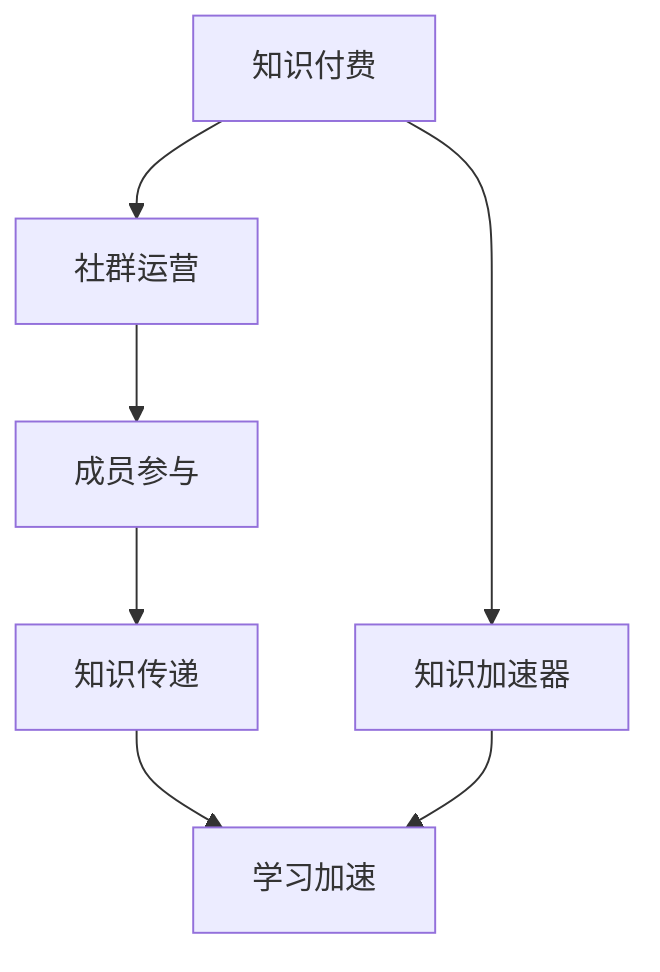

                 

# 社群运营：程序员的知识付费加速器

> 关键词：知识付费, 社群运营, 程序员, 加速器, 教育技术

## 1. 背景介绍

在互联网经济飞速发展的今天，知识付费已经成为了一个不可逆转的趋势。无论是职业提升、技能学习还是兴趣爱好，越来越多的人选择通过付费购买高质量的课程、书籍和资料来提升自我。然而，在知识付费的过程中，如何高效地获取知识、掌握技能、加速成长，成为了许多学习者面临的共同难题。

## 2. 核心概念与联系

### 2.1 核心概念概述

为更好地理解知识付费与社群运营之间的关系，本节将介绍几个关键概念：

- **知识付费**：指通过付费获取有价值的知识内容，包括但不限于在线课程、电子书、专业文章、技术博客等。知识付费的核心在于其能够提供个性化、高效化的学习途径，满足不同学习者的具体需求。

- **社群运营**：指围绕特定兴趣或目标，建立和管理一个网络社区，通过社交互动、内容分享、知识交流等手段，增强社区凝聚力，提高成员的参与度和满意度。社群运营能够有效促进知识的传递和共享，加速成员的学习进程。

- **知识加速器**：指通过知识付费与社群运营相结合，以协同的方式提供更高效、更全面的学习体验，帮助学习者更快地掌握知识，提升技能水平。知识加速器是一个动态的知识生态系统，能够不断迭代、优化，实现持续的知识积累和能力提升。

这些核心概念之间的关系可以通过以下Mermaid流程图来展示：



这个流程图展示的知识付费与社群运营之间的逻辑关系：

1. 知识付费为社群运营提供有价值的知识内容。
2. 社群运营为知识付费提供交流和互动的平台。
3. 知识加速器通过知识付费与社群运营的结合，实现高效的加速学习。

## 3. 核心算法原理 & 具体操作步骤
### 3.1 算法原理概述

知识加速器的核心算法原理基于知识管理和社交网络理论，旨在通过社区的协同效应，加速知识的传递和共享。其基本思想如下：

- **知识推荐算法**：根据用户的学习行为和兴趣偏好，推荐个性化的知识内容，提高学习效率。
- **社交互动机制**：通过点赞、评论、分享等社交行为，增强社区成员之间的互动和连接，促进知识交流。
- **协同学习平台**：利用在线课程、技术问答、项目协作等工具，支持成员共同学习、实践和探索。
- **激励机制**：通过积分、徽章、排名等激励方式，激发成员的学习热情和参与度，形成正向反馈循环。

### 3.2 算法步骤详解

以下是一个完整的知识加速器构建流程：

**Step 1: 构建社区平台**
- 选择合适的技术栈，开发社区网站或APP，支持用户注册、登录、发布、评论等功能。
- 引入推荐算法引擎，实现知识内容的个性化推荐。
- 搭建社交互动模块，支持点赞、评论、分享等行为。

**Step 2: 引入知识付费服务**
- 集成在线课程、电子书、技术博客等知识付费内容，并提供在线支付功能。
- 根据用户的付费行为，提供定制化的课程推荐和学习路径规划。

**Step 3: 设计知识加速模型**
- 设计基于知识图谱的推荐算法，实现知识内容的关联和推荐。
- 引入机器学习模型，对学习行为进行分析，预测用户的学习路径和需求。
- 设计多样化的学习活动，如在线研讨、技术分享、项目实践等，促进知识传递和协同学习。

**Step 4: 实施激励机制**
- 设计积分、徽章、排名等激励机制，鼓励用户积极参与知识分享和学习。
- 根据用户的学习成果和贡献度，进行动态调整和奖励。
- 设置课程导师和专家团队，提供专业的指导和支持。

**Step 5: 持续优化和迭代**
- 根据用户反馈和数据分析结果，持续优化社区平台和知识推荐算法。
- 引入外部知识资源，如开源项目、技术社区等，扩大知识库。
- 定期发布知识竞赛、技术挑战等活动，提升社区活力和学习动力。

### 3.3 算法优缺点

知识加速器通过知识付费与社群运营的结合，具有以下优点：
- **个性化学习**：个性化推荐算法可以根据用户的学习行为和兴趣，提供量身定制的学习资源，提高学习效率。
- **协同学习**：社群互动机制促进了知识交流和分享，使学习变得更有趣味性和互动性。
- **高效加速**：多样化的学习活动和激励机制，加速了知识传递和技能提升。

同时，该方法也存在一定的局限性：
- **成本投入**：开发和维护社区平台、引入知识付费内容等，需要一定的资金投入。
- **内容质量参差不齐**：社区中部分内容质量可能不高，用户筛选困难。
- **社区管理难度**：社区规模扩大后，如何保持活跃度、控制低质内容，是一大挑战。

尽管存在这些局限性，但就目前而言，知识加速器仍是一种高效的知识获取途径，在职场、技术、教育等诸多领域得到了广泛应用。

### 3.4 算法应用领域

知识加速器作为一种高效的知识获取途径，在以下领域有广泛的应用：

- **职业提升**：适用于职场人士进行技术学习、软技能提升等。通过知识加速器，可以快速掌握新技能，提升职业竞争力。
- **技能学习**：适用于学生、创业者等对特定领域技能有需求的人群。通过知识加速器，可以系统学习新技术、新工具、新方法。
- **兴趣拓展**：适用于对特定兴趣领域有追求的人群。通过知识加速器，可以深入学习、参与讨论、实践探索，拓展知识边界。
- **项目实践**：适用于需要将理论知识应用于实际项目中的技术人员。通过知识加速器，可以获取项目实践经验，解决实际问题。

## 4. 数学模型和公式 & 详细讲解 & 举例说明
### 4.1 数学模型构建

在知识加速器中，知识推荐算法是其核心之一。以下将详细介绍一个基于协同过滤的推荐模型：

设用户 $u$ 对 $n$ 个物品 $i$ 的评分向量为 $R_u = [r_{ui}]$，其中 $r_{ui}$ 表示用户 $u$ 对物品 $i$ 的评分。物品 $i$ 的特征向量为 $P_i = [p_{ij}]$，其中 $p_{ij}$ 表示物品 $i$ 的第 $j$ 个特征。则用户 $u$ 对物品 $i$ 的预测评分 $\hat{r}_{ui}$ 可以通过以下公式计算：

$$
\hat{r}_{ui} = \sum_{j=1}^k \alpha_{u,j} p_{ij}
$$

其中 $\alpha_{u,j}$ 为用户的兴趣特征向量，可以通过用户历史评分和物品特征计算得到：

$$
\alpha_{u,j} = \frac{\sum_{i=1}^N r_{ui} p_{ij}}{\sqrt{\sum_{i=1}^N p_{ij}^2}}
$$

### 4.2 公式推导过程

基于协同过滤的推荐模型，其推导过程如下：

- 首先，根据用户 $u$ 对 $N$ 个物品 $i$ 的评分向量 $R_u$ 和物品 $i$ 的特征向量 $P_i$，计算用户 $u$ 对物品 $i$ 的预测评分 $\hat{r}_{ui}$。
- 然后，通过 $\alpha_{u,j}$ 将预测评分 $\hat{r}_{ui}$ 转化为用户 $u$ 对物品 $i$ 的评分，得到用户 $u$ 对物品 $i$ 的综合评分 $s_{ui} = \alpha_{u,j} p_{ij}$。
- 最后，通过 $s_{ui}$ 对所有物品排序，将评分最高的物品推荐给用户 $u$。

### 4.3 案例分析与讲解

以Coursera平台为例，其知识加速器构建主要依赖以下几个模块：

1. **课程推荐系统**：基于用户的学习历史和兴趣偏好，推荐最适合的课程和专业。
2. **社区讨论区**：支持用户对课程内容进行讨论、交流，形成知识社群。
3. **学习成果展示**：展示用户的学习进度、项目作品、技能证书等，鼓励用户积极参与学习。
4. **互动活动**：定期组织在线研讨、技术分享、项目实践等活动，提升学习互动性。

通过这些模块的协同工作，Coursera平台能够提供高效的知识加速服务，帮助用户系统化地掌握新知识和技能。

## 5. 项目实践：代码实例和详细解释说明
### 5.1 开发环境搭建

在进行知识加速器开发前，我们需要准备好开发环境。以下是使用Python进行Flask开发的环境配置流程：

1. 安装Anaconda：从官网下载并安装Anaconda，用于创建独立的Python环境。

2. 创建并激活虚拟环境：
```bash
conda create -n flask-env python=3.8 
conda activate flask-env
```

3. 安装Flask：
```bash
pip install flask
```

4. 安装其他必要的Python库：
```bash
pip install pandas numpy matplotlib Flask-SocketIO
```

完成上述步骤后，即可在`flask-env`环境中开始知识加速器的开发。

### 5.2 源代码详细实现

以下是一个简单的知识加速器系统示例，包括用户注册登录、课程推荐、社区互动等功能：

```python
from flask import Flask, render_template, request
from flask_socketio import SocketIO
import pandas as pd
import numpy as np
from sklearn.metrics.pairwise import cosine_similarity

app = Flask(__name__)
app.config['SECRET_KEY'] = 'secret!'
socketio = SocketIO(app)

# 用户数据
user_data = pd.read_csv('user_data.csv')

# 课程数据
course_data = pd.read_csv('course_data.csv')

# 用户评分数据
user_ratings = pd.read_csv('user_ratings.csv')

# 课程评分数据
course_ratings = pd.read_csv('course_ratings.csv')

# 用户评分与课程评分矩阵
R = user_ratings.values
P = course_ratings.values

# 计算用户兴趣特征向量
alpha = np.dot(R.T, P) / np.sqrt(np.dot(P.T, P))

# 推荐模型
def recommendation(user_id):
    # 获取用户兴趣特征向量
    user_alpha = alpha[user_id,:]
    
    # 计算所有课程的评分向量
    s = np.dot(user_alpha, P.T)
    
    # 计算推荐列表
    idx = np.argsort(s)[::-1]
    return idx[:10]

# 用户登录
@app.route('/login', methods=['GET', 'POST'])
def login():
    if request.method == 'POST':
        user_id = request.form['user_id']
        user_alpha = alpha[user_id,:]
        
        # 获取推荐列表
        recommendations = recommendation(user_id)
        
        # 返回推荐列表
        return render_template('recommendations.html', recommendations=recommendations)
    else:
        return render_template('login.html')

# 课程推荐
@app.route('/recommendations', methods=['GET', 'POST'])
def recommendations():
    if request.method == 'POST':
        user_id = request.form['user_id']
        recommendations = recommendation(user_id)
        
        # 返回推荐列表
        return render_template('recommendations.html', recommendations=recommendations)
    else:
        return render_template('recommendations.html')

# 社区互动
@app.route('/community', methods=['GET', 'POST'])
def community():
    if request.method == 'POST':
        user_id = request.form['user_id']
        message = request.form['message']
        
        # 发送消息到社区
        socketio.emit('message', { 'user_id': user_id, 'message': message })
        
        # 返回社区页面
        return render_template('community.html')
    else:
        return render_template('community.html')

# SocketIO消息处理
@app.route('/')
def index():
    return render_template('index.html')

if __name__ == '__main__':
    socketio.run(app)
```

### 5.3 代码解读与分析

让我们再详细解读一下关键代码的实现细节：

**User Data和Course Data**：
- 定义用户数据和课程数据的存储格式，方便后续的数据读取和处理。

**User Ratings和Course Ratings**：
- 用户评分和课程评分数据，存储在二维数组中，方便后续计算用户兴趣特征向量。

**Alpha Calculation**：
- 计算用户兴趣特征向量，通过用户评分和课程评分计算得到。

**Recommendation Function**：
- 定义推荐函数，根据用户兴趣特征向量计算推荐列表。

**User Login Route**：
- 定义用户登录接口，通过用户ID获取用户兴趣特征向量，计算推荐列表并返回。

**Recommendations Route**：
- 定义课程推荐接口，通过用户ID计算推荐列表并返回。

**Community Route**：
- 定义社区互动接口，用户发布消息并发送至社区。

**SocketIO**：
- 引入SocketIO模块，实现实时通信功能。

**Flask应用启动**：
- 通过`socketio.run()`启动Flask应用，开启SocketIO服务。

可以看到，通过Python和Flask框架，我们可以快速构建出一个简易的知识加速器系统，包括用户登录、课程推荐、社区互动等基本功能。

当然，实际应用中的系统还需要考虑更多因素，如用户身份验证、安全机制、数据存储等。但核心的知识加速器架构基本与此类似。

## 6. 实际应用场景
### 6.1 职业提升

知识加速器在职业提升方面具有重要应用。通过知识加速器，职场人士可以快速掌握新技能、学习前沿知识，提升职场竞争力。例如，在编程开发领域，开发者可以通过知识加速器学习最新编程语言、框架、工具等，快速适应技术变革。

### 6.2 技能学习

知识加速器在技能学习方面同样具有巨大潜力。学生、创业者等对特定领域技能有需求的人群，通过知识加速器系统，可以系统化地学习新知识，掌握新技能。例如，在数据科学领域，通过知识加速器系统，用户可以系统学习Python、R语言、机器学习算法等技能，实现职业转型。

### 6.3 兴趣拓展

知识加速器在兴趣拓展方面也有广泛应用。对特定兴趣领域有追求的人群，通过知识加速器系统，可以深入学习、参与讨论、实践探索，拓展知识边界。例如，在人工智能领域，通过知识加速器系统，用户可以学习深度学习、自然语言处理、计算机视觉等技术，实现技术积累和兴趣拓展。

### 6.4 未来应用展望

未来，知识加速器将呈现以下几个发展趋势：

1. **AI技术融合**：知识加速器将进一步融合AI技术，如自然语言处理、计算机视觉等，实现更全面、更高效的知识传递和分享。
2. **个性化推荐**：基于用户行为数据分析，实现更精准、更个性化的知识推荐，提高用户的学习体验。
3. **社区互动增强**：通过更多的社交互动功能，如在线研讨、技术分享、项目协作等，增强社区凝聚力，促进知识交流。
4. **内容多样化**：引入视频、音频等多媒体内容，丰富知识形式，提高用户的学习兴趣和参与度。
5. **国际化扩展**：支持多语言、多文化的学习环境，实现全球知识共享和交流。

## 7. 工具和资源推荐
### 7.1 学习资源推荐

为了帮助开发者系统掌握知识加速器的理论基础和实践技巧，这里推荐一些优质的学习资源：

1. **《知识付费与社群运营》系列博文**：由知识加速器技术专家撰写，深入浅出地介绍了知识加速器的原理、设计、实现等核心内容。

2. **Coursera和Udemy平台**：提供海量的在线课程和学习资源，是知识加速器的典型应用示例。

3. **《教育技术：知识加速器的设计与实现》书籍**：全面介绍了知识加速器的设计思路、技术架构和实践方法，是系统学习知识加速器的必备资料。

4. **edX和Khan Academy平台**：提供丰富的免费在线课程和学习资源，支持大规模的学习社区建设。

5. **Kaggle和GitHub平台**：提供大量的数据集和开源项目，支持知识加速器的项目实践和协作开发。

通过对这些资源的学习实践，相信你一定能够快速掌握知识加速器的精髓，并用于解决实际的NLP问题。

### 7.2 开发工具推荐

高效的开发离不开优秀的工具支持。以下是几款用于知识加速器开发的常用工具：

1. **Python**：广泛应用的语言，支持丰富的第三方库和框架。

2. **Flask**：轻量级的Web框架，适合快速搭建Web应用。

3. **SocketIO**：实时通信库，支持Socket.IO协议，适合构建实时互动功能。

4. **TensorFlow和PyTorch**：深度学习框架，支持模型训练和推理，适用于推荐算法等复杂任务。

5. **Docker和Kubernetes**：容器化和集群管理工具，适合知识加速器的部署和扩展。

6. **AWS和Google Cloud**：云服务平台，提供弹性计算和存储资源，支持知识加速器的云端部署。

合理利用这些工具，可以显著提升知识加速器系统的开发效率，加快创新迭代的步伐。

### 7.3 相关论文推荐

知识加速器技术的发展源于学界的持续研究。以下是几篇奠基性的相关论文，推荐阅读：

1. **Knowledge Acceleration through Social Learning Networks**：探讨了社交网络在知识加速中的应用，提出了一种基于社交网络的知识推荐算法。

2. **Collaborative Filtering for Recommendation Systems**：介绍了协同过滤推荐算法的原理和实现方法，为知识加速器推荐系统提供了重要参考。

3. **Content-Based Filtering for Recommendation Systems**：介绍了内容推荐算法的原理和实现方法，为知识加速器推荐系统提供了补充。

4. **A Survey of Knowledge Acceleration Technologies**：全面综述了知识加速技术的现状和发展趋势，为知识加速器研究提供了全面的视角。

5. **Personalized Learning through Adaptive Recommender Systems**：介绍了个性化推荐系统的原理和实现方法，为知识加速器的推荐算法提供了借鉴。

这些论文代表了大语言模型微调技术的发展脉络。通过学习这些前沿成果，可以帮助研究者把握学科前进方向，激发更多的创新灵感。

## 8. 总结：未来发展趋势与挑战
### 8.1 总结

本文对知识加速器技术进行了全面系统的介绍。首先阐述了知识加速器的核心概念和应用价值，明确了知识加速器在知识付费、社群运营、加速学习等方面的独特优势。其次，从原理到实践，详细讲解了知识加速器的构建流程和推荐算法，给出了知识加速器开发的具体代码实例。同时，本文还探讨了知识加速器在多个领域的应用前景，展示了其巨大的应用潜力。

通过本文的系统梳理，可以看到，知识加速器技术正在成为知识付费和社群运营的重要手段，极大地提高了学习效率和效果。未来，伴随技术的不断发展，知识加速器必将在教育、培训、职业发展等众多领域发挥越来越重要的作用，推动社会的持续进步。

### 8.2 未来发展趋势

展望未来，知识加速器技术将呈现以下几个发展趋势：

1. **技术融合**：知识加速器将进一步融合AI技术，如自然语言处理、计算机视觉等，实现更全面、更高效的知识传递和分享。
2. **个性化推荐**：基于用户行为数据分析，实现更精准、更个性化的知识推荐，提高用户的学习体验。
3. **社区互动增强**：通过更多的社交互动功能，如在线研讨、技术分享、项目协作等，增强社区凝聚力，促进知识交流。
4. **内容多样化**：引入视频、音频等多媒体内容，丰富知识形式，提高用户的学习兴趣和参与度。
5. **国际化扩展**：支持多语言、多文化的学习环境，实现全球知识共享和交流。

### 8.3 面临的挑战

尽管知识加速器技术已经取得了瞩目成就，但在迈向更加智能化、普适化应用的过程中，它仍面临着诸多挑战：

1. **内容质量**：知识加速器中部分内容质量可能不高，用户筛选困难。
2. **社区管理**：社区规模扩大后，如何保持活跃度、控制低质内容，是一大挑战。
3. **成本投入**：开发和维护知识加速器系统，需要一定的资金投入。
4. **技术实现**：知识加速器的推荐算法、社区互动机制等技术实现复杂，需要高水平的技术支持。
5. **用户参与**：如何提高用户参与度和满意度，保持社区的活跃度，是一大难题。

尽管存在这些挑战，但知识加速器技术以其高效、个性化的特点，在知识付费和社群运营领域具有重要应用价值。未来，随着技术的不断发展和完善，知识加速器必将在各个领域得到广泛应用，为社会进步提供新的动力。

### 8.4 研究展望

面对知识加速器技术所面临的种种挑战，未来的研究需要在以下几个方面寻求新的突破：

1. **内容质量提升**：引入高质量的内容审核机制，提升知识加速器的内容质量。
2. **社区管理优化**：设计有效的社区管理策略，保持社区活跃度和高质量内容。
3. **成本优化**：探索低成本、高效益的知识加速器构建方式，降低开发和维护成本。
4. **技术创新**：引入更多先进的AI技术，如自然语言处理、计算机视觉等，提升知识加速器的功能和性能。
5. **用户激励机制**：设计有效的用户激励机制，提高用户参与度和满意度。

这些研究方向将为知识加速器技术的发展提供新的思路，进一步推动知识加速器在各个领域的落地应用。

## 9. 附录：常见问题与解答

**Q1：知识加速器是否适用于所有学习者？**

A: 知识加速器适用于大多数学习者，特别是对特定领域有需求的人群。然而，对于学习习惯和能力不同的个体，效果可能有所差异。

**Q2：知识加速器如何推荐课程？**

A: 知识加速器的推荐算法基于用户的学习历史和兴趣偏好，通过协同过滤和内容推荐等方法，实现个性化推荐。推荐算法通常包括基于内容的推荐、协同过滤推荐、混合推荐等。

**Q3：知识加速器如何提升用户参与度？**

A: 知识加速器通过社区互动、积分激励、排名竞赛等机制，提升用户的学习兴趣和参与度。同时，定期举办在线研讨、技术分享、项目实践等活动，增加社区的互动性和学习氛围。

**Q4：知识加速器如何处理低质内容？**

A: 知识加速器通常通过用户投票、专家评审等机制，筛选和处理低质内容。同时，引入高质量的内容审核机制，提升知识加速器的内容质量。

**Q5：知识加速器如何保持社区活跃度？**

A: 知识加速器通过定期发布高质量内容、举办互动活动、引入专家团队等方式，保持社区的活跃度和高质量内容。同时，设计有效的社区管理策略，控制低质内容，保持社区的健康发展。

通过本文的系统梳理，可以看到，知识加速器技术正在成为知识付费和社群运营的重要手段，极大地提高了学习效率和效果。未来，伴随技术的不断发展，知识加速器必将在各个领域得到广泛应用，为社会进步提供新的动力。总之，知识加速器需要开发者根据具体任务，不断迭代和优化模型、数据和算法，方能得到理想的效果。

---

作者：禅与计算机程序设计艺术 / Zen and the Art of Computer Programming

