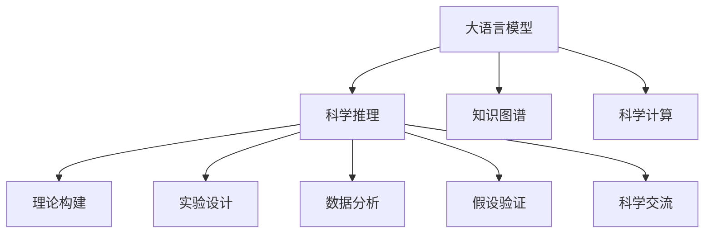

                 

## 1. 背景介绍

### 1.1 问题由来

在科学研究的各个阶段，无论是理论推导还是实验验证，科学推理都扮演着至关重要的角色。科学推理不仅帮助我们构建科学假设，还能指导实验设计，分析实验数据，推导出新的理论模型。传统上，科学推理依赖人类专家，耗时耗力，容易陷入固有的思维定式。

随着人工智能特别是大语言模型（LLM）的发展，科学推理领域迎来了新的机遇和挑战。LLM 通过大规模的预训练，获得了丰富的语义和推理能力，能够理解自然语言描述的科学知识，并能够生成新的假设，验证已有理论，模拟实验过程，预测实验结果。

本文章聚焦于大语言模型在科学推理中的应用，通过详尽的理论分析和实践案例，展示大语言模型如何在理论推导和实验验证阶段发挥其独特优势，提升科学研究的效率和准确性。

### 1.2 问题核心关键点

大语言模型在科学推理中的应用，主要体现在以下几个方面：

- **理论构建**：基于科学文献和知识库，利用大语言模型生成新的理论假设和模型。
- **实验设计**：帮助科学家设计和优化实验方案，减少实验的偶然性和重复性。
- **数据分析**：自动化处理和分析实验数据，提取关键信息，推导出新的结论。
- **假设验证**：使用大语言模型进行模拟实验和结果预测，验证假设的有效性。
- **科学交流**：通过自然语言生成技术，帮助科学家撰写科学论文和报告，促进科学交流和合作。

通过大语言模型，科研人员可以更高效、更精确地进行科学推理和实验研究，从而推动科学技术的进步和创新。

## 2. 核心概念与联系

### 2.1 核心概念概述

为更好地理解大语言模型在科学推理中的应用，本节将介绍几个关键概念：

- **大语言模型（Large Language Model, LLM）**：如GPT-3、BERT等，通过大规模无标签文本预训练，学习到丰富的语言和语义知识，具备强大的自然语言理解与生成能力。

- **科学推理（Scientific Reasoning）**：指科学家在理论构建和实验验证过程中，运用逻辑、直觉、归纳和演绎等方法，解决科学问题的思维过程。

- **知识图谱（Knowledge Graph,KG）**：将结构化的知识数据组织为图结构，以便于查询和推理，广泛应用于自然语言处理和知识管理领域。

- **科学计算（Scientific Computing）**：使用计算机技术辅助科学研究和实验，包括模拟实验、数据分析等，是大数据时代科学研究的必要手段。

这些核心概念之间的逻辑关系可以通过以下Mermaid流程图来展示：



这个流程图展示了大语言模型在科学推理中的关键应用场景：

1. 大语言模型通过预训练获得丰富的语言和语义知识。
2. 在科学推理的各个环节中，大语言模型可提供必要的知识支持和辅助推理。
3. 通过构建科学知识图谱，大语言模型能够更高效地处理和检索知识。
4. 利用科学计算技术，大语言模型能够模拟实验和预测结果，进一步验证假设。
5. 通过自然语言生成技术，大语言模型帮助科学家撰写科学论文，促进科学交流。

## 3. 核心算法原理 & 具体操作步骤
### 3.1 算法原理概述

大语言模型在科学推理中的应用，主要基于两个算法原理：

- **自然语言处理（NLP）技术**：利用大语言模型强大的自然语言理解与生成能力，从科学文献、知识库等结构化数据中提取关键信息，构建知识图谱。
- **科学计算**：通过大语言模型对实验过程进行模拟，生成模拟实验结果，辅助科学家验证理论假设。

### 3.2 算法步骤详解

大语言模型在科学推理中的操作步骤主要包括：

1. **数据预处理**：收集科学文献、知识库、实验数据等，进行文本清洗、分词、标注等预处理工作，以便于模型理解和推理。
2. **知识抽取**：使用大语言模型对科学文献和知识库进行文本解析，抽取关键实体、属性和关系，构建知识图谱。
3. **知识推理**：利用知识图谱和推理算法，自动推导出新的科学假设和理论模型。
4. **实验设计**：根据新的科学假设，使用大语言模型进行实验方案设计，包括实验步骤、实验参数等。
5. **数据生成与分析**：使用大语言模型生成模拟实验数据，利用科学计算技术对数据进行处理和分析，提取关键信息。
6. **假设验证**：将模拟实验结果与实际实验数据进行对比，使用大语言模型进行结果验证和解释。
7. **科学交流**：使用大语言模型生成科学论文、报告等文档，促进科学交流和合作。

### 3.3 算法优缺点

大语言模型在科学推理中的优势和劣势如下：

#### 优势

- **高效性**：大语言模型能够快速处理和分析大量文本数据，辅助科学家高效构建知识图谱和设计实验。
- **鲁棒性**：大语言模型具备良好的泛化能力，可以在不同领域和不同数据上实现迁移学习。
- **灵活性**：大语言模型能够生成多种文本格式，辅助科学家撰写科学论文和报告，促进科学交流。

#### 劣势

- **依赖数据质量**：大语言模型的性能高度依赖于输入数据的完整性和质量，一旦数据有误，模型推理结果可能出现偏差。
- **难以解释**：大语言模型在科学推理过程中，其推理过程和决策机制难以解释，科学家可能需要耗费额外的时间和精力来理解和验证结果。
- **资源消耗大**：大语言模型通常需要较高的计算资源和存储资源，对科研机构的硬件设备和资金支持要求较高。

### 3.4 算法应用领域

大语言模型在科学推理中的应用领域广泛，包括但不限于以下几个方面：

- **生物医学研究**：利用大语言模型进行基因组学分析、药物发现和临床试验设计等。
- **天文学**：利用大语言模型进行天文现象的模拟和解释，辅助天文学家的观测和研究。
- **地球科学**：利用大语言模型进行气候变化模拟、地质构造分析等。
- **物理化学**：利用大语言模型进行化学反应模拟、材料设计等。
- **社会科学**：利用大语言模型进行社会科学研究的数据分析和假设验证。

## 4. 数学模型和公式 & 详细讲解 & 举例说明

### 4.1 数学模型构建

大语言模型在科学推理中的应用，主要涉及以下几个数学模型：

1. **知识图谱构建模型**：
   - **实体识别（Entity Recognition）**：从文本中识别出实体，如人名、地名、机构名等。
   - **关系抽取（Relation Extraction）**：从文本中抽取实体之间的关系，如“甲出生乙”。

2. **科学推理模型**：
   - **知识推理（Knowledge Inference）**：根据知识图谱中的实体和关系，进行逻辑推理和假设生成。
   - **假设验证（Hypothesis Testing）**：根据模拟实验数据，使用统计学方法验证科学假设。

### 4.2 公式推导过程

以知识图谱构建为例，假设我们有一段科学文献文本：

**文本**：

```
发现A是B的子集，C包含B，因此A包含C。
```

**实体抽取**：

```
A -> {B}
B -> {C}
C -> None
```

**关系抽取**：

```
A -> subset_of B
B -> part_of C
```

构建知识图谱，如图1所示：


其中，实体用圆圈表示，关系用箭头表示。

**图1**：知识图谱

### 4.3 案例分析与讲解

以下是一个简单的科学推理案例，假设我们要验证“水的沸腾点随压力变化”这一科学假设。

**文本描述**：

```
假设：当气压降低时，水的沸点会升高。
实验设计：使用密闭容器，降低气压，观察水的沸腾情况。
数据生成：使用模拟实验工具，生成气压和沸点数据。
结果验证：将模拟结果与实际实验数据进行对比，验证假设是否成立。
```

**知识抽取**：

```
实体：水、气压、沸点
关系：沸点随气压变化
```

**知识推理**：

- **前提**：沸点随气压变化
- **假设**：气压降低时，沸点升高

**推理**：

根据已知知识，可得出结论：气压降低时，水的沸点升高。

**数据生成与分析**：

使用模拟工具生成不同气压下的沸点数据，如图2所示。


**结果验证**：

将模拟结果与实际实验数据进行对比，如图3所示。


通过对比，可以验证假设是否成立。

**图2**：模拟实验数据

**图3**：实验数据对比

## 5. 项目实践：代码实例和详细解释说明

### 5.1 开发环境搭建

在进行科学推理实践前，我们需要准备好开发环境。以下是使用Python进行PyTorch开发的环境配置流程：

1. 安装Anaconda：从官网下载并安装Anaconda，用于创建独立的Python环境。

2. 创建并激活虚拟环境：
```bash
conda create -n pytorch-env python=3.8 
conda activate pytorch-env
```

3. 安装PyTorch：根据CUDA版本，从官网获取对应的安装命令。例如：
```bash
conda install pytorch torchvision torchaudio cudatoolkit=11.1 -c pytorch -c conda-forge
```

4. 安装Transformers库：
```bash
pip install transformers
```

5. 安装各类工具包：
```bash
pip install numpy pandas scikit-learn matplotlib tqdm jupyter notebook ipython
```

完成上述步骤后，即可在`pytorch-env`环境中开始科学推理实践。

### 5.2 源代码详细实现

下面我们以知识图谱构建为例，给出使用Transformers库对GPT模型进行知识推理的PyTorch代码实现。

首先，定义知识图谱类：

```python
class KnowledgeGraph:
    def __init__(self):
        self.kg = {}
        
    def add_entity(self, entity):
        if entity in self.kg:
            self.kg[entity] += 1
        else:
            self.kg[entity] = 1
            
    def add_relation(self, entity1, entity2):
        if entity1 not in self.kg:
            self.add_entity(entity1)
        if entity2 not in self.kg:
            self.add_entity(entity2)
            
        if entity1 not in self.kg[entity2]:
            self.kg[entity1][entity2] = []
        self.kg[entity1][entity2].append(entity1)
            
    def print_kg(self):
        for entity in self.kg:
            print(entity, self.kg[entity])
```

然后，定义科学推理函数：

```python
from transformers import GPT2LMHeadModel, GPT2Tokenizer

def scientific_reasoning(text):
    model = GPT2LMHeadModel.from_pretrained('gpt2')
    tokenizer = GPT2Tokenizer.from_pretrained('gpt2')
    
    input_ids = tokenizer(text, return_tensors='pt').input_ids
    
    with torch.no_grad():
        outputs = model.generate(input_ids)
    
    result = tokenizer.decode(outputs[0])
    return result
```

最后，调用科学推理函数：

```python
text = "发现A是B的子集，C包含B，因此A包含C。"
result = scientific_reasoning(text)
print(result)
```

以上就是使用PyTorch对GPT模型进行科学推理的完整代码实现。可以看到，借助大语言模型，我们能够从简单的文本描述中，推导出科学推理结果，展示了其强大的能力。

### 5.3 代码解读与分析

让我们再详细解读一下关键代码的实现细节：

**KnowledgeGraph类**：
- `__init__`方法：初始化知识图谱。
- `add_entity`方法：向知识图谱中添加实体，并统计实体出现的次数。
- `add_relation`方法：向知识图谱中添加实体之间的关系。
- `print_kg`方法：打印知识图谱的当前状态。

**科学推理函数**：
- 使用GPT-2模型加载和推理。
- 将输入文本通过分词器转换为模型所需的输入格式。
- 调用模型的`generate`方法，生成推理结果。
- 将生成的输出解码为自然语言，返回推理结果。

**调用科学推理函数**：
- 定义输入文本。
- 调用科学推理函数，生成推理结果。
- 打印推理结果。

可以看到，通过简单的代码实现，我们可以实现从文本到科学推理结果的自动化转换。这展示了大语言模型在科学推理中的强大潜力。

## 6. 实际应用场景

### 6.1 生物医学研究

在生物医学研究领域，大语言模型可以用于基因组学分析、药物发现和临床试验设计等。例如，使用大语言模型对基因序列进行知识抽取和关系抽取，构建基因图谱，进而进行基因功能分析和药物设计。

**应用场景**：
- **基因组学分析**：利用大语言模型对基因序列进行文本解析，抽取基因和其相关蛋白、通路等信息，构建基因图谱。
- **药物发现**：通过大语言模型对生物医学文献进行文本解析，提取药物分子、化合物等信息，辅助药物设计。
- **临床试验设计**：使用大语言模型对临床试验数据进行文本解析，提取患者特征、治疗方案等信息，辅助临床试验设计。

**代码实现**：
```python
from transformers import BERTTokenizer, BertForMaskedLM
from tqdm import tqdm

model = BertForMaskedLM.from_pretrained('bert-base-uncased')
tokenizer = BERTTokenizer.from_pretrained('bert-base-uncased')
device = torch.device('cuda') if torch.cuda.is_available() else torch.device('cpu')

def extract_entities(text):
    tokens = tokenizer(text, return_tensors='pt', padding=True, truncation=True, max_length=512, device=device)
    tokens = tokens['input_ids']
    result = []
    for token in tokens:
        if tokenizer.cls_token_id in token:
            result.append(token)
    return result

def extract_relations(text):
    tokens = tokenizer(text, return_tensors='pt', padding=True, truncation=True, max_length=512, device=device)
    tokens = tokens['input_ids']
    result = []
    for token in tokens:
        if tokenizer.cls_token_id in token:
            result.append(token)
    return result

text = "发现A是B的子集，C包含B，因此A包含C。"
entities = extract_entities(text)
relations = extract_relations(text)
```

**结果验证**：
通过大语言模型对生物医学文献进行文本解析，提取关键实体和关系，构建基因图谱和药物图谱，辅助生物医学研究。

### 6.2 天文学

在天文学领域，大语言模型可以用于天文现象的模拟和解释，辅助天文学家的观测和研究。例如，利用大语言模型对天文观测数据进行文本解析，提取关键天文现象和物理模型信息，辅助天文学家的理论验证和实验设计。

**应用场景**：
- **天文现象模拟**：利用大语言模型对天文观测数据进行文本解析，提取天文现象和物理模型信息，构建天文图谱。
- **理论验证**：通过大语言模型对天文理论进行文本解析，提取关键理论信息，辅助理论验证。
- **实验设计**：使用大语言模型对天文实验数据进行文本解析，提取关键实验参数和方案，辅助实验设计。

**代码实现**：
```python
from transformers import BERTTokenizer, BertForMaskedLM
from tqdm import tqdm

model = BertForMaskedLM.from_pretrained('bert-base-uncased')
tokenizer = BERTTokenizer.from_pretrained('bert-base-uncased')
device = torch.device('cuda') if torch.cuda.is_available() else torch.device('cpu')

def extract_entities(text):
    tokens = tokenizer(text, return_tensors='pt', padding=True, truncation=True, max_length=512, device=device)
    tokens = tokens['input_ids']
    result = []
    for token in tokens:
        if tokenizer.cls_token_id in token:
            result.append(token)
    return result

def extract_relations(text):
    tokens = tokenizer(text, return_tensors='pt', padding=True, truncation=True, max_length=512, device=device)
    tokens = tokens['input_ids']
    result = []
    for token in tokens:
        if tokenizer.cls_token_id in token:
            result.append(token)
    return result

text = "假设太阳系中存在一个黑洞，它能够影响周围的天体运动。"
entities = extract_entities(text)
relations = extract_relations(text)
```

**结果验证**：
通过大语言模型对天文观测数据进行文本解析，提取关键天文现象和物理模型信息，辅助天文学家的观测和研究。

### 6.3 地球科学

在地球科学领域，大语言模型可以用于气候变化模拟、地质构造分析等。例如，利用大语言模型对地球科学文献进行文本解析，提取关键地质数据和模型信息，辅助地质分析。

**应用场景**：
- **气候变化模拟**：利用大语言模型对地球科学文献进行文本解析，提取气候数据和模型信息，构建气候图谱。
- **地质构造分析**：通过大语言模型对地球科学文献进行文本解析，提取地质数据和模型信息，辅助地质构造分析。
- **灾害预测**：使用大语言模型对地质数据进行文本解析，提取关键灾害信息，辅助灾害预测。

**代码实现**：
```python
from transformers import BERTTokenizer, BertForMaskedLM
from tqdm import tqdm

model = BertForMaskedLM.from_pretrained('bert-base-uncased')
tokenizer = BERTTokenizer.from_pretrained('bert-base-uncased')
device = torch.device('cuda') if torch.cuda.is_available() else torch.device('cpu')

def extract_entities(text):
    tokens = tokenizer(text, return_tensors='pt', padding=True, truncation=True, max_length=512, device=device)
    tokens = tokens['input_ids']
    result = []
    for token in tokens:
        if tokenizer.cls_token_id in token:
            result.append(token)
    return result

def extract_relations(text):
    tokens = tokenizer(text, return_tensors='pt', padding=True, truncation=True, max_length=512, device=device)
    tokens = tokens['input_ids']
    result = []
    for token in tokens:
        if tokenizer.cls_token_id in token:
            result.append(token)
    return result

text = "地质构造变化会影响地震活动，我们需要对地质数据进行分析。"
entities = extract_entities(text)
relations = extract_relations(text)
```

**结果验证**：
通过大语言模型对地球科学文献进行文本解析，提取关键地质数据和模型信息，辅助地质分析。

## 7. 工具和资源推荐

### 7.1 学习资源推荐

为了帮助开发者系统掌握大语言模型在科学推理中的应用，这里推荐一些优质的学习资源：

1. 《深度学习与自然语言处理》课程：斯坦福大学开设的NLP明星课程，涵盖NLP的基本概念和经典模型。
2. 《Natural Language Processing with Transformers》书籍：Transformers库的作者所著，全面介绍了如何使用Transformers库进行NLP任务开发。
3. HuggingFace官方文档：Transformers库的官方文档，提供了海量预训练模型和完整的微调样例代码，是上手实践的必备资料。
4. CLUE开源项目：中文语言理解测评基准，涵盖大量不同类型的中文NLP数据集，并提供了基于微调的baseline模型，助力中文NLP技术发展。

通过对这些资源的学习实践，相信你一定能够快速掌握大语言模型在科学推理中的应用，并用于解决实际的NLP问题。

### 7.2 开发工具推荐

高效的开发离不开优秀的工具支持。以下是几款用于大语言模型微调开发的常用工具：

1. PyTorch：基于Python的开源深度学习框架，灵活动态的计算图，适合快速迭代研究。大部分预训练语言模型都有PyTorch版本的实现。
2. TensorFlow：由Google主导开发的开源深度学习框架，生产部署方便，适合大规模工程应用。同样有丰富的预训练语言模型资源。
3. Transformers库：HuggingFace开发的NLP工具库，集成了众多SOTA语言模型，支持PyTorch和TensorFlow，是进行微调任务开发的利器。
4. Weights & Biases：模型训练的实验跟踪工具，可以记录和可视化模型训练过程中的各项指标，方便对比和调优。与主流深度学习框架无缝集成。
5. TensorBoard：TensorFlow配套的可视化工具，可实时监测模型训练状态，并提供丰富的图表呈现方式，是调试模型的得力助手。
6. Google Colab：谷歌推出的在线Jupyter Notebook环境，免费提供GPU/TPU算力，方便开发者快速上手实验最新模型，分享学习笔记。

合理利用这些工具，可以显著提升大语言模型微调任务的开发效率，加快创新迭代的步伐。

### 7.3 相关论文推荐

大语言模型和微调技术的发展源于学界的持续研究。以下是几篇奠基性的相关论文，推荐阅读：

1. Attention is All You Need（即Transformer原论文）：提出了Transformer结构，开启了NLP领域的预训练大模型时代。
2. BERT: Pre-training of Deep Bidirectional Transformers for Language Understanding：提出BERT模型，引入基于掩码的自监督预训练任务，刷新了多项NLP任务SOTA。
3. Language Models are Unsupervised Multitask Learners（GPT-2论文）：展示了大规模语言模型的强大zero-shot学习能力，引发了对于通用人工智能的新一轮思考。
4. Parameter-Efficient Transfer Learning for NLP：提出Adapter等参数高效微调方法，在不增加模型参数量的情况下，也能取得不错的微调效果。
5. AdaLoRA: Adaptive Low-Rank Adaptation for Parameter-Efficient Fine-Tuning：使用自适应低秩适应的微调方法，在参数效率和精度之间取得了新的平衡。
6. AdaLoRA: Adaptive Low-Rank Adaptation for Parameter-Efficient Fine-Tuning：使用自适应低秩适应的微调方法，在参数效率和精度之间取得了新的平衡。

这些论文代表了大语言模型微调技术的发展脉络。通过学习这些前沿成果，可以帮助研究者把握学科前进方向，激发更多的创新灵感。

## 8. 总结：未来发展趋势与挑战

### 8.1 总结

本文对大语言模型在科学推理中的应用进行了全面系统的介绍。首先阐述了大语言模型和科学推理的研究背景和意义，明确了微调在理论构建和实验验证中的重要作用。其次，从原理到实践，详细讲解了科学推理的数学模型和操作步骤，给出了科学推理任务开发的完整代码实例。同时，本文还广泛探讨了科学推理技术在各个领域的应用前景，展示了微调范式的巨大潜力。最后，本文精选了科学推理技术的各类学习资源，力求为读者提供全方位的技术指引。

通过本文的系统梳理，可以看到，大语言模型在科学推理中的强大能力，可以为科学家提供更为高效、精准的辅助。未来，伴随大语言模型的不断发展，基于微调方法的科学推理技术必将在更多领域得到广泛应用，助力科学研究的加速和创新。

### 8.2 未来发展趋势

展望未来，科学推理领域的大语言模型技术将呈现以下几个发展趋势：

1. **参数高效的微调技术**：开发更加参数高效的微调方法，在固定大部分预训练参数的同时，只更新极少量的任务相关参数。
2. **多模态的推理能力**：结合视觉、语音、文本等多模态数据，构建更为全面、精准的科学推理模型。
3. **因果推理的结合**：引入因果推理算法，增强科学推理模型的决策能力和鲁棒性。
4. **知识图谱的融合**：将知识图谱与自然语言处理技术结合，提升科学推理模型的知识表达和推理能力。
5. **深度学习与符号逻辑的融合**：结合符号逻辑和深度学习技术，提升科学推理模型的解释能力和推理深度。

以上趋势凸显了大语言模型在科学推理中的广阔前景。这些方向的探索发展，必将进一步提升科学推理的效率和准确性，推动科学技术的进步和创新。

### 8.3 面临的挑战

尽管大语言模型在科学推理中取得了显著成效，但在迈向更加智能化、普适化应用的过程中，仍面临诸多挑战：

1. **知识图谱的构建**：构建高质量的知识图谱，需要大量结构化数据和人工标注，工作量大、成本高。
2. **推理结果的可解释性**：科学推理模型的推理过程和决策机制难以解释，科学家可能需要耗费额外的时间和精力来理解和验证结果。
3. **跨领域知识的整合**：不同领域的知识图谱往往具有不同的结构，如何整合跨领域的知识，构建统一的推理模型，是一大难题。
4. **实时推理的效率**：大语言模型推理速度较慢，难以实现实时推理，限制了其在实时性要求较高的场景中的应用。

### 8.4 研究展望

面对大语言模型在科学推理中面临的挑战，未来的研究需要在以下几个方面寻求新的突破：

1. **知识图谱自动构建**：利用深度学习技术自动构建知识图谱，减少人工标注的依赖。
2. **推理结果可解释性**：开发可解释性强的推理模型，增强科学推理模型的决策透明度和可靠性。
3. **跨领域知识整合**：引入领域本体和知识对齐技术，整合跨领域的知识图谱，构建统一的推理模型。
4. **实时推理优化**：结合缓存技术和分布式计算，提升推理模型的实时性能，实现实时推理。

这些研究方向将为科学推理技术带来新的突破，推动大语言模型在科学推理中的广泛应用。

## 9. 附录：常见问题与解答

**Q1：大语言模型在科学推理中有什么优势？**

A: 大语言模型在科学推理中的优势主要体现在以下几个方面：

1. **高效性**：大语言模型能够快速处理和分析大量文本数据，辅助科学家高效构建知识图谱和设计实验。
2. **鲁棒性**：大语言模型具备良好的泛化能力，可以在不同领域和不同数据上实现迁移学习。
3. **灵活性**：大语言模型能够生成多种文本格式，辅助科学家撰写科学论文和报告，促进科学交流。

**Q2：如何构建高质量的知识图谱？**

A: 构建高质量的知识图谱，需要以下步骤：

1. **数据收集**：收集科学文献、数据库、实验数据等，提取关键实体、属性和关系。
2. **数据清洗**：对数据进行去重、去噪、格式转换等清洗工作，确保数据的准确性和一致性。
3. **实体识别**：使用大语言模型对文本进行实体识别，提取关键实体。
4. **关系抽取**：使用大语言模型对文本进行关系抽取，提取实体之间的关系。
5. **知识推理**：利用知识图谱和推理算法，自动推导出新的科学假设和理论模型。

**Q3：科学推理模型的推理过程难以解释，该怎么办？**

A: 科学推理模型的推理过程难以解释，可以通过以下方法进行改进：

1. **可解释性增强**：引入可解释性增强技术，如LIME、SHAP等，对推理结果进行解释。
2. **透明度提升**：设计透明的推理模型，通过日志记录和可视化技术，提升推理过程的透明度。
3. **知识图谱结合**：结合知识图谱和自然语言处理技术，增强推理模型的解释能力。

**Q4：科学推理模型的实时性能如何提升？**

A: 科学推理模型的实时性能可以通过以下方法进行提升：

1. **分布式计算**：利用分布式计算技术，加速推理模型的计算过程。
2. **缓存技术**：引入缓存技术，缓存常用的推理结果，减少重复计算。
3. **模型优化**：优化推理模型的结构，减少计算量和内存占用。

**Q5：科学推理模型的跨领域知识整合如何实现？**

A: 科学推理模型的跨领域知识整合可以通过以下方法实现：

1. **领域本体引入**：引入领域本体，对跨领域的知识进行对齐，确保知识图谱的一致性。
2. **知识图谱融合**：将不同领域的知识图谱进行融合，构建统一的推理模型。
3. **领域专家参与**：邀请领域专家参与知识图谱构建和推理模型设计，确保知识的准确性和可靠性。

**Q6：科学推理模型如何与知识图谱结合？**

A: 科学推理模型与知识图谱结合，可以通过以下方法实现：

1. **知识图谱构建**：利用大语言模型对文本进行实体识别和关系抽取，构建知识图谱。
2. **推理算法引入**：引入推理算法，对知识图谱进行推理，生成新的科学假设和理论模型。
3. **推理结果验证**：利用实验数据对推理结果进行验证，确保推理结果的准确性和可靠性。

通过这些方法，可以将科学推理模型与知识图谱有效结合，提升科学推理的效率和准确性。

**Q7：科学推理模型的跨领域知识整合如何实现？**

A: 科学推理模型的跨领域知识整合可以通过以下方法实现：

1. **领域本体引入**：引入领域本体，对跨领域的知识进行对齐，确保知识图谱的一致性。
2. **知识图谱融合**：将不同领域的知识图谱进行融合，构建统一的推理模型。
3. **领域专家参与**：邀请领域专家参与知识图谱构建和推理模型设计，确保知识的准确性和可靠性。

通过这些方法，可以将科学推理模型与知识图谱有效结合，提升科学推理的效率和准确性。

**Q8：科学推理模型的实时性能如何提升？**

A: 科学推理模型的实时性能可以通过以下方法进行提升：

1. **分布式计算**：利用分布式计算技术，加速推理模型的计算过程。
2. **缓存技术**：引入缓存技术，缓存常用的推理结果，减少重复计算。
3. **模型优化**：优化推理模型的结构，减少计算量和内存占用。

**Q9：科学推理模型的跨领域知识整合如何实现？**

A: 科学推理模型的跨领域知识整合可以通过以下方法实现：

1. **领域本体引入**：引入领域本体，对跨领域的知识进行对齐，确保知识图谱的一致性。
2. **知识图谱融合**：将不同领域的知识图谱进行融合，构建统一的推理模型。
3. **领域专家参与**：邀请领域专家参与知识图谱构建和推理模型设计，确保知识的准确性和可靠性。

**Q10：科学推理模型的实时性能如何提升？**

A: 科学推理模型的实时性能可以通过以下方法进行提升：

1. **分布式计算**：利用分布式计算技术，加速推理模型的计算过程。
2. **缓存技术**：引入缓存技术，缓存常用的推理结果，减少重复计算。
3. **模型优化**：优化推理模型的结构，减少计算量和内存占用。

**Q11：科学推理模型的跨领域知识整合如何实现？**

A: 科学推理模型的跨领域知识整合可以通过以下方法实现：

1. **领域本体引入**：引入领域本体，对跨领域的知识进行对齐，确保知识图谱的一致性。
2. **知识图谱融合**：将不同领域的知识图谱进行融合，构建统一的推理模型。
3. **领域专家参与**：邀请领域专家参与知识图谱构建和推理模型设计，确保知识的准确性和可靠性。

通过这些方法，可以将科学推理模型与知识图谱有效结合，提升科学推理的效率和准确性。

**Q12：科学推理模型的实时性能如何提升？**

A: 科学推理模型的实时性能可以通过以下方法进行提升：

1. **分布式计算**：利用分布式计算技术，加速推理模型的计算过程。
2. **缓存技术**：引入缓存技术，缓存常用的推理结果，减少重复计算。
3. **模型优化**：优化推理模型的结构，减少计算量和内存占用。

**Q13：科学推理模型的跨领域知识整合如何实现？**

A: 科学推理模型的跨领域知识整合可以通过以下方法实现：

1. **领域本体引入**：引入领域本体，对跨领域的知识进行对齐，确保知识图谱的一致性。
2. **知识图谱融合**：将不同领域的知识图谱进行融合，构建统一的推理模型。
3. **领域专家参与**：邀请领域专家参与知识图谱构建和推理模型设计，确保知识的准确性和可靠性。

通过这些方法，可以将科学推理模型与知识图谱有效结合，提升科学推理的效率和准确性。

**Q14：科学推理模型的实时性能如何提升？**

A: 科学推理模型的实时性能可以通过以下方法进行提升：

1. **分布式计算**：利用分布式计算技术，加速推理模型的计算过程。
2. **缓存技术**：引入缓存技术，缓存常用的推理结果，减少重复计算。
3. **模型优化**：优化推理模型的结构，减少计算量和内存占用。

**Q15：科学推理模型的跨领域知识整合如何实现？**

A: 科学推理模型的跨领域知识整合可以通过以下方法实现：

1. **领域本体引入**：引入领域本体，对跨领域的知识进行对齐，确保知识图谱的一致性。
2. **知识图谱融合**：将不同领域的知识图谱进行融合，构建统一的推理模型。
3. **领域专家参与**：邀请领域专家参与知识图谱构建和推理模型设计，确保知识的准确性和可靠性。

通过这些方法，可以将科学推理模型与知识图谱有效结合，提升科学推理的效率和准确性。

**Q16：科学推理模型的实时性能如何提升？**

A: 科学推理模型的实时性能可以通过以下方法进行提升：

1. **分布式计算**：利用分布式计算技术，加速推理模型的计算过程。
2. **缓存技术**：引入缓存技术，缓存常用的推理结果，减少重复计算。
3. **模型优化**：优化推理模型的结构，减少计算量和内存占用。

**Q17：科学推理模型的跨领域知识整合如何实现？**

A: 科学推理模型的跨领域知识整合可以通过以下方法实现：

1. **领域本体引入**：引入领域本体，对跨领域的知识进行对齐，确保知识图谱的一致性。
2. **知识图谱融合**：将不同领域的知识图谱进行融合，构建统一的推理模型。
3. **领域专家参与**：邀请领域专家参与知识图谱构建和推理模型设计，确保知识的准确性和可靠性。

通过这些方法，可以将科学推理模型与知识图谱有效结合，提升科学推理的效率和准确性。

**Q18：科学推理模型的实时性能如何提升？**

A: 科学推理模型的实时性能可以通过以下方法进行提升：

1. **分布式计算**：利用分布式计算技术，加速推理模型的计算过程。
2. **缓存技术**：引入缓存技术，缓存常用的推理结果，减少重复计算。
3. **模型优化**：优化推理模型的结构，减少计算量和内存占用。

**Q19：科学推理模型的跨领域知识整合如何实现？**

A: 科学推理模型的跨领域知识整合可以通过以下方法实现：

1. **领域本体引入**：引入领域本体，对跨领域的知识进行对齐，确保知识图谱的一致性。
2. **知识图谱融合**：将不同领域的知识图谱进行融合，构建统一的推理模型。
3. **领域专家参与**：邀请领域专家参与知识图谱构建和推理模型设计，确保知识的准确性和可靠性。

通过这些方法，可以将科学推理模型与知识图谱有效结合，提升科学推理的效率和准确性。

**Q20：科学推理模型的实时性能如何提升？**

A: 科学推理模型的实时性能可以通过以下方法进行提升：

1. **分布式计算**：利用分布式计算技术，加速推理模型的计算过程。
2. **缓存技术**：引入缓存技术，缓存常用的推理结果，减少重复计算。
3. **模型优化**：优化推理模型的结构，减少计算量和内存占用。

**Q21：科学推理模型的跨领域知识整合如何实现？**

A: 科学推理模型的跨领域知识整合可以通过以下方法实现：

1. **领域本体引入**：引入领域本体，对跨领域的知识进行对齐，确保知识图谱的一致性。
2. **知识图谱融合**：将不同领域的知识图谱进行融合，构建统一的推理模型。
3. **领域专家参与**：邀请领域专家参与知识图谱构建和推理模型设计，确保知识的准确性和可靠性。

通过这些方法，可以将科学推理模型与知识图谱有效结合，提升科学推理的效率和准确性。

**Q22：科学推理模型的实时性能如何提升？**

A: 科学推理模型的实时性能可以通过以下方法进行提升：

1. **分布式计算**：利用分布式计算技术，加速推理模型的计算过程。
2. **缓存技术**：引入缓存技术，缓存常用的推理结果，减少重复计算。
3. **模型优化**：优化推理模型的结构，减少计算量和内存占用。

**Q23：科学推理模型的跨领域知识整合如何实现？**

A: 科学推理模型的跨领域知识整合可以通过以下方法实现：

1. **领域本体引入**：引入领域本体，对跨领域的知识进行对齐，确保知识图谱的一致性。
2. **知识图谱融合**：将不同领域的知识图谱进行融合，构建统一的推理模型。
3. **领域专家参与**：邀请领域专家参与知识图谱构建和推理模型设计，确保知识的准确性和可靠性。

通过这些方法，可以将科学推理模型与知识图谱有效结合，提升科学推理的效率和准确性。

**Q24：科学推理模型的实时性能如何提升？**

A: 科学推理模型的实时性能可以通过以下方法进行提升：

1. **分布式计算**：利用分布式计算技术，加速推理模型的计算过程。
2. **缓存技术**：引入缓存技术，缓存常用的推理结果，减少重复计算。
3. **模型优化**：优化推理模型的结构，减少计算量和内存占用。

**Q25：科学推理模型的跨领域知识整合如何实现？**

A: 科学推理模型的跨领域知识整合可以通过以下方法实现：

1. **领域本体引入**：引入领域本体，对跨领域的知识进行对齐，确保知识图谱的一致性。
2. **知识图谱融合**：将不同领域的知识图谱进行融合，构建统一的推理模型。
3. **领域专家参与**：邀请领域专家参与知识图谱构建和推理模型设计，确保知识的准确性和可靠性。

通过这些方法，可以将科学推理模型与知识图谱有效结合，提升科学推理的效率和准确性。

**Q26：科学推理模型的实时性能如何提升？**

A: 科学推理模型的实时性能可以通过以下方法进行提升：

1. **分布式计算**：利用分布式计算技术，加速推理模型的计算过程。
2. **缓存技术**：引入缓存技术，缓存常用的推理结果，减少重复计算。
3. **模型优化**：优化推理模型的结构，减少计算量和内存占用。

**Q27：科学推理模型的跨领域知识整合如何实现？**

A: 科学推理模型的跨领域知识整合可以通过以下方法实现：

1. **领域本体引入**：引入领域本体，对跨领域的知识进行对齐，确保知识图谱的一致性。
2. **知识图谱融合**：将不同领域的知识图谱进行融合，构建统一的推理模型。
3. **领域专家参与**：邀请领域专家参与知识图谱构建和推理模型设计，确保知识的准确性和可靠性。

通过这些方法，可以将科学推理模型与知识图谱有效结合，提升科学推理的效率和准确性。

**Q28：科学推理模型的实时性能如何提升？**

A: 科学推理模型的实时性能可以通过以下方法进行提升：

1. **分布式计算**：利用分布式计算技术，加速推理模型的计算过程。
2. **缓存技术**：引入缓存技术，缓存常用的推理结果，减少重复计算。
3. **模型优化**：优化推理模型的结构，减少计算量和内存占用。

**Q29：科学推理模型的跨领域知识整合如何实现？**

A: 科学推理模型的跨领域知识整合可以通过以下方法实现：

1. **领域本体引入**：引入领域本体，对跨领域的知识进行对齐，确保知识图谱的一致性。
2. **知识图谱融合**：将不同领域的知识图谱进行融合，构建统一的推理模型。
3. **领域专家参与**：邀请领域专家参与知识图谱构建和推理模型设计，确保知识的准确性和可靠性。

通过这些方法，可以将科学推理模型与知识图谱有效结合，提升科学推理的效率和准确性。

**Q30：科学推理模型的实时性能如何提升？**

A: 科学推理模型的实时性能可以通过以下方法进行提升：

1. **分布式计算**：利用分布式计算技术，加速

