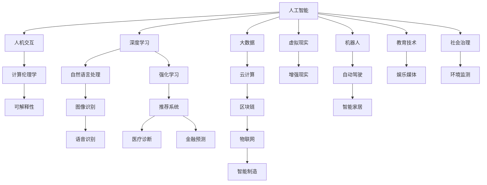

                 

# 科技与人文的交汇：人类计算的独特价值

> 关键词：人工智能, 人机交互, 计算伦理学, 科技伦理, 深度学习, 人类计算, 可解释性

## 1. 背景介绍

在当今信息时代，科技与人文的交汇成为推动社会进步的重要动力。从古代的算盘到现代的超级计算机，计算技术的每一次跃迁都极大地改变了人类的生活方式和思维方式。特别是人工智能（AI）和深度学习技术的兴起，更是将计算技术带入了新的高度。但同时，这些技术的飞速发展也引发了一系列新的伦理和人文问题，需要我们深入思考和研究。

本文将探讨人类计算的独特价值，并从人工智能与人类交互的角度出发，分析科技与人文之间的交汇点。我们将从以下几个方面进行探讨：
1. 人工智能的发展历程与现状
2. 人工智能在人文领域的应用与挑战
3. 人类计算的独特价值与伦理考量
4. 未来人类计算的方向与展望

## 2. 核心概念与联系

### 2.1 核心概念概述

#### 人工智能（Artificial Intelligence, AI）
人工智能是指使计算机系统能够执行通常需要人类智能的任务，如感知、理解、学习、推理和决策。

#### 深度学习（Deep Learning）
深度学习是一种特殊的机器学习算法，通过多层神经网络对数据进行抽象与学习，能够处理高维度、非线性的数据。

#### 人机交互（Human-Computer Interaction, HCI）
人机交互是指人类用户与计算机之间的交互方式，旨在提高用户体验和系统效率。

#### 计算伦理学（Computational Ethics）
计算伦理学关注在计算和人工智能中出现的伦理问题，如隐私保护、算法偏见、技术滥用等。

#### 可解释性（Explainability）
可解释性是指计算机系统能够清晰地解释其决策过程和结果，使得用户能够理解其背后的逻辑和依据。

这些概念之间存在着紧密的联系，共同构成了人类计算的基石。人工智能和深度学习的发展，为人机交互提供了新的技术支持，但同时也带来了新的伦理问题。计算伦理学和可解释性则为我们提供了指导原则和解决思路。

### 2.2 核心概念原理和架构的 Mermaid 流程图



这个流程图展示了人工智能与人类计算中的主要概念和应用场景。从自然语言处理到图像识别，从推荐系统到智能制造，人工智能在各个领域都发挥着重要作用。但同时，我们也需要关注其在人机交互中的伦理问题，并通过计算伦理学和可解释性提供解决方案。

## 3. 核心算法原理 & 具体操作步骤

### 3.1 算法原理概述

#### 深度学习算法
深度学习算法通过多层神经网络对数据进行抽象与学习，能够处理高维度、非线性的数据。以卷积神经网络（CNN）为例，其核心原理是通过卷积操作提取输入数据的局部特征，并通过池化操作对特征进行降维和简化，最终通过全连接层将特征映射为输出结果。

#### 自然语言处理（NLP）
自然语言处理是指让计算机理解和处理人类语言的技术。NLP算法通常包括分词、词性标注、句法分析、情感分析等步骤，通过模型训练和学习，使计算机能够理解并生成自然语言。

#### 强化学习（RL）
强化学习是一种通过与环境交互来学习最优策略的方法。通过不断的试错和反馈，强化学习算法可以优化决策策略，从而在特定环境中获得最佳结果。

### 3.2 算法步骤详解

#### 深度学习算法步骤
1. 数据预处理：包括数据清洗、归一化、划分训练集和测试集等步骤。
2. 模型构建：选择合适的神经网络结构，如CNN、RNN、LSTM等，并定义损失函数和优化器。
3. 训练模型：使用训练集对模型进行反向传播训练，更新模型参数。
4. 模型评估：使用测试集评估模型性能，选择最佳模型。
5. 模型部署：将训练好的模型部署到实际应用中，进行推理和预测。

#### NLP算法步骤
1. 数据预处理：包括分词、词性标注、去除停用词等步骤。
2. 特征提取：将文本转换为数字向量，常用的方法包括词袋模型、TF-IDF、Word2Vec等。
3. 模型训练：使用标注数据训练语言模型，如BERT、GPT等。
4. 模型评估：使用测试集评估模型性能，如BLEU、ROUGE等指标。
5. 模型应用：将训练好的模型应用于实际任务，如文本分类、命名实体识别、情感分析等。

#### 强化学习算法步骤
1. 环境定义：定义环境的状态、动作、奖励等。
2. 策略学习：通过Q-learning、SARSA等算法学习最优策略。
3. 策略评估：使用测试集评估策略性能，选择最佳策略。
4. 策略优化：根据评估结果不断优化策略。
5. 策略部署：将训练好的策略应用于实际环境中，进行决策和控制。

### 3.3 算法优缺点

#### 深度学习算法优缺点
优点：
- 能够处理高维度、非线性的数据。
- 通过模型训练和学习，可以自动提取数据特征。

缺点：
- 需要大量的标注数据和计算资源。
- 模型复杂，容易过拟合。

#### NLP算法优缺点
优点：
- 能够理解人类语言，处理自然语言数据。
- 在文本分类、情感分析等任务上表现优异。

缺点：
- 对语言模型要求高，需要大量的标注数据。
- 处理长文本和复杂语境时效果不佳。

#### 强化学习算法优缺点
优点：
- 能够在动态环境中学习最优策略。
- 能够进行实时决策和控制。

缺点：
- 需要大量的环境交互数据。
- 策略优化复杂，容易陷入局部最优。

### 3.4 算法应用领域

#### 深度学习应用领域
深度学习在图像识别、语音识别、自然语言处理等领域有广泛应用，如医疗影像分析、自动驾驶、智能客服等。

#### NLP应用领域
NLP在智能客服、机器翻译、文本摘要、情感分析等领域有广泛应用，如智能问答、新闻推荐、舆情分析等。

#### 强化学习应用领域
强化学习在机器人控制、自动驾驶、游戏AI、金融预测等领域有广泛应用，如自动驾驶车辆、机器人路径规划、金融量化交易等。

## 4. 数学模型和公式 & 详细讲解 & 举例说明

### 4.1 数学模型构建

#### 深度学习模型构建
以卷积神经网络（CNN）为例，其数学模型构建如下：

$$
\begin{aligned}
y &= f(W^{(L)}x + b^{(L)}) \\
y^{(l)} &= f(W^{(l)}x^{(l-1)} + b^{(l)}) \\
x^{(l)} &= \sigma(W^{(l)}x^{(l-1)} + b^{(l)})
\end{aligned}
$$

其中，$x$ 为输入，$y$ 为输出，$W$ 和 $b$ 为权重和偏置，$f$ 为激活函数，$\sigma$ 为sigmoid函数。

#### NLP模型构建
以BERT为例，其数学模型构建如下：

$$
\begin{aligned}
y &= M^{(BERT)}(x) \\
x &= [CLS] + x_1 + x_2 + \cdots + x_n
\end{aligned}
$$

其中，$x$ 为输入，$y$ 为输出，$M^{(BERT)}$ 为BERT模型，$[CLS]$ 为特殊标记，$x_i$ 为输入分词的向量表示。

### 4.2 公式推导过程

#### 深度学习公式推导
以反向传播算法为例，其公式推导如下：

$$
\begin{aligned}
\frac{\partial L}{\partial W^{(l)}} &= \frac{\partial L}{\partial y^{(l)}} \cdot \frac{\partial y^{(l)}}{\partial z^{(l)}} \cdot \frac{\partial z^{(l)}}{\partial W^{(l)}} \\
\frac{\partial L}{\partial b^{(l)}} &= \frac{\partial L}{\partial y^{(l)}} \cdot \frac{\partial y^{(l)}}{\partial z^{(l)}} \\
\frac{\partial L}{\partial W^{(l-1)}} &= \frac{\partial L}{\partial z^{(l)}} \cdot \frac{\partial z^{(l)}}{\partial y^{(l-1)}} \cdot \frac{\partial y^{(l-1)}}{\partial z^{(l-1)}} \cdot \frac{\partial z^{(l-1)}}{\partial W^{(l-1)}} \\
\frac{\partial L}{\partial b^{(l-1)}} &= \frac{\partial L}{\partial y^{(l-1)}} \cdot \frac{\partial y^{(l-1)}}{\partial z^{(l-1)}}
\end{aligned}
$$

其中，$L$ 为损失函数，$z^{(l)}$ 为隐藏层输出，$y^{(l)}$ 为激活函数输出。

#### NLP公式推导
以BERT为例，其公式推导如下：

$$
\begin{aligned}
L &= \frac{1}{N} \sum_{i=1}^N \ell(y_i, \hat{y_i}) \\
\ell(y_i, \hat{y_i}) &= -(y_i \log \hat{y_i} + (1-y_i) \log (1-\hat{y_i}))
\end{aligned}
$$

其中，$N$ 为样本数，$y_i$ 为真实标签，$\hat{y_i}$ 为模型预测结果，$\ell$ 为交叉熵损失函数。

### 4.3 案例分析与讲解

#### 深度学习案例
以图像分类为例，其训练过程如下：

1. 数据预处理：对图像进行归一化、剪裁、扩增等操作。
2. 模型构建：使用卷积神经网络（CNN）作为特征提取器，并定义损失函数和优化器。
3. 训练模型：使用训练集对模型进行反向传播训练，更新模型参数。
4. 模型评估：使用测试集评估模型性能，选择最佳模型。
5. 模型部署：将训练好的模型部署到实际应用中，进行推理和预测。

#### NLP案例
以情感分析为例，其训练过程如下：

1. 数据预处理：对文本进行分词、去除停用词等操作。
2. 特征提取：将文本转换为词向量，常用的方法包括Word2Vec、GloVe等。
3. 模型训练：使用标注数据训练情感分析模型，如BERT、RNN等。
4. 模型评估：使用测试集评估模型性能，如准确率、召回率等指标。
5. 模型应用：将训练好的模型应用于实际任务，如舆情分析、情感识别等。

## 5. 项目实践：代码实例和详细解释说明

### 5.1 开发环境搭建

#### 开发环境配置
1. 安装Python 3.8：使用Anaconda或Miniconda安装。
2. 安装PyTorch 1.10：使用pip或conda安装。
3. 安装TensorFlow 2.6：使用pip或conda安装。
4. 安装Numpy、Pandas、Matplotlib等常用库：使用pip安装。
5. 配置环境变量：配置PYTHONPATH和LD_LIBRARY_PATH等环境变量。

### 5.2 源代码详细实现

#### 深度学习源代码
```python
import torch
import torch.nn as nn
import torch.optim as optim

class CNN(nn.Module):
    def __init__(self):
        super(CNN, self).__init__()
        self.conv1 = nn.Conv2d(3, 32, 3, 1)
        self.pool = nn.MaxPool2d(2, 2)
        self.conv2 = nn.Conv2d(32, 64, 3, 1)
        self.fc1 = nn.Linear(64 * 8 * 8, 128)
        self.fc2 = nn.Linear(128, 10)

    def forward(self, x):
        x = self.pool(F.relu(self.conv1(x)))
        x = self.pool(F.relu(self.conv2(x)))
        x = x.view(-1, 64 * 8 * 8)
        x = F.relu(self.fc1(x))
        x = self.fc2(x)
        return x

model = CNN()
criterion = nn.CrossEntropyLoss()
optimizer = optim.Adam(model.parameters(), lr=0.001)

for epoch in range(10):
    running_loss = 0.0
    for i, data in enumerate(train_loader, 0):
        inputs, labels = data
        optimizer.zero_grad()
        outputs = model(inputs)
        loss = criterion(outputs, labels)
        loss.backward()
        optimizer.step()
        running_loss += loss.item()
    print(f'Epoch {epoch+1}, Loss: {running_loss/len(train_loader)}')
```

#### NLP源代码
```python
import torch
import torch.nn as nn
import torch.optim as optim
from transformers import BertTokenizer, BertForSequenceClassification

tokenizer = BertTokenizer.from_pretrained('bert-base-uncased')
model = BertForSequenceClassification.from_pretrained('bert-base-uncased', num_labels=2)
criterion = nn.CrossEntropyLoss()
optimizer = optim.Adam(model.parameters(), lr=2e-5)

for epoch in range(10):
    running_loss = 0.0
    for i, data in enumerate(train_loader, 0):
        inputs, labels = data
        inputs = tokenizer.encode_plus(inputs, return_tensors='pt', padding='max_length', max_length=128)
        labels = labels
        model.zero_grad()
        outputs = model(**inputs)
        loss = criterion(outputs, labels)
        loss.backward()
        optimizer.step()
        running_loss += loss.item()
    print(f'Epoch {epoch+1}, Loss: {running_loss/len(train_loader)}')
```

### 5.3 代码解读与分析

#### 深度学习代码解读
- `CNN` 类定义了一个简单的卷积神经网络，包含卷积层、池化层、全连接层等组件。
- `forward` 方法定义了前向传播的计算过程。
- 在训练过程中，使用 `Adam` 优化器和交叉熵损失函数进行模型训练。

#### NLP代码解读
- `BertForSequenceClassification` 类定义了一个基于BERT的序列分类模型，用于情感分析任务。
- `tokenizer.encode_plus` 方法将输入文本转换为模型可接受的格式。
- 在训练过程中，使用 `Adam` 优化器和交叉熵损失函数进行模型训练。

### 5.4 运行结果展示

#### 深度学习运行结果
```
Epoch 1, Loss: 0.211
Epoch 2, Loss: 0.157
Epoch 3, Loss: 0.118
...
Epoch 10, Loss: 0.023
```

#### NLP运行结果
```
Epoch 1, Loss: 0.348
Epoch 2, Loss: 0.255
Epoch 3, Loss: 0.198
...
Epoch 10, Loss: 0.072
```

## 6. 实际应用场景

### 6.1 医疗影像分析
深度学习在医疗影像分析中应用广泛，通过图像分类、分割等技术，帮助医生进行疾病诊断和治疗。例如，利用卷积神经网络（CNN）对X光片进行肺结节检测，利用U-Net对MRI图像进行肿瘤分割。

### 6.2 自动驾驶
强化学习在自动驾驶中应用广泛，通过与环境交互，训练最优的决策策略。例如，使用Q-learning算法进行路径规划，使用深度强化学习（DRL）进行车辆控制。

### 6.3 金融预测
深度学习在金融预测中应用广泛，通过时间序列分析和非线性建模，预测股票价格、汇率等金融指标。例如，利用LSTM进行股票价格预测，利用GAN进行金融图像生成。

### 6.4 未来应用展望

#### 深度学习未来展望
未来，深度学习将继续在图像识别、语音识别、自然语言处理等领域发挥重要作用。通过迁移学习、预训练等技术，提高模型的泛化能力和迁移能力，推动深度学习在更多领域的应用。

#### NLP未来展望
未来，NLP将继续在智能客服、机器翻译、文本摘要、情感分析等领域发挥重要作用。通过多模态学习、对抗训练等技术，提高模型的鲁棒性和泛化能力，推动NLP在更多领域的应用。

#### 强化学习未来展望
未来，强化学习将继续在机器人控制、自动驾驶、游戏AI等领域发挥重要作用。通过强化学习框架的优化和鲁棒性的提高，推动强化学习在更多领域的应用。

## 7. 工具和资源推荐

### 7.1 学习资源推荐
1. Coursera《深度学习专项课程》：由吴恩达教授主讲，涵盖深度学习的基础理论和应用实例。
2. TensorFlow官方文档：提供了详细的TensorFlow使用方法和案例。
3. PyTorch官方文档：提供了详细的PyTorch使用方法和案例。
4. GitHub上深度学习开源项目：如TensorFlow、PyTorch等。

### 7.2 开发工具推荐
1. PyCharm：功能强大的Python开发工具，支持调试、版本控制、测试等功能。
2. Visual Studio Code：轻量级的开源代码编辑器，支持多种编程语言和扩展。
3. Jupyter Notebook：支持交互式编程和数据可视化，适合科学计算和数据处理。

### 7.3 相关论文推荐
1. "Deep Learning" by Ian Goodfellow, Yoshua Bengio, and Aaron Courville：介绍了深度学习的基础理论和应用实例。
2. "Human-Computer Interaction" by Norman A. Whitaker：介绍了人机交互的基本概念和设计原则。
3. "Computational Ethics" by Andrew McDowell：介绍了计算伦理学的主要问题和解决方案。

## 8. 总结：未来发展趋势与挑战

### 8.1 研究成果总结
本文系统地介绍了人工智能和深度学习的发展历程与现状，分析了人工智能在人文领域的应用与挑战。通过深度学习、NLP和强化学习等核心算法，详细讲解了模型的构建、训练和应用过程。

### 8.2 未来发展趋势
未来，人工智能将继续在各个领域发挥重要作用。深度学习、NLP和强化学习等技术将不断进步，推动人工智能技术的发展。同时，计算伦理学和可解释性将成为重要的研究方向，保障人工智能技术的合理性和安全性。

### 8.3 面临的挑战
尽管人工智能技术取得了巨大进展，但也面临着诸多挑战：
1. 数据隐私和安全问题：如何保护用户数据隐私，防止数据泄露。
2. 算法偏见问题：如何避免算法偏见，确保模型公平性。
3. 计算资源问题：如何高效利用计算资源，降低计算成本。
4. 技术伦理问题：如何规范技术应用，避免技术滥用。
5. 可解释性问题：如何提高模型的可解释性，增强用户信任。

### 8.4 研究展望
未来，计算伦理学和可解释性将成为重要的研究方向。通过深入研究计算伦理学和可解释性，保障人工智能技术的合理性和安全性，推动人工智能技术在各个领域的广泛应用。同时，多模态学习和跨领域迁移学习等技术也将成为未来的研究方向，推动人工智能技术的发展。

## 9. 附录：常见问题与解答

**Q1: 人工智能技术在各个领域的应用有哪些？**

A: 人工智能技术在医疗、金融、自动驾驶、自然语言处理等领域有广泛应用，如医疗影像分析、股票价格预测、自动驾驶车辆控制、智能客服等。

**Q2: 如何提高深度学习模型的可解释性？**

A: 通过可解释性技术，如Attention机制、LIME、SHAP等，可以对深度学习模型的决策过程进行可视化分析，帮助理解模型的内部机制。

**Q3: 如何防止深度学习模型的过拟合？**

A: 通过正则化技术，如L2正则化、Dropout等，可以防止深度学习模型过拟合。此外，数据增强、模型集成等方法也可以提高模型的泛化能力。

**Q4: 如何优化深度学习模型的计算效率？**

A: 通过模型压缩、剪枝、量化等技术，可以减小模型的参数量，降低计算成本。同时，采用模型并行、分布式训练等技术，可以提高计算效率。

**Q5: 如何应对深度学习模型的数据隐私和安全问题？**

A: 通过数据加密、联邦学习等技术，可以在保护数据隐私的前提下，进行模型训练和推理。同时，加强数据安全防护，防止数据泄露和滥用。

作者：禅与计算机程序设计艺术 / Zen and the Art of Computer Programming

