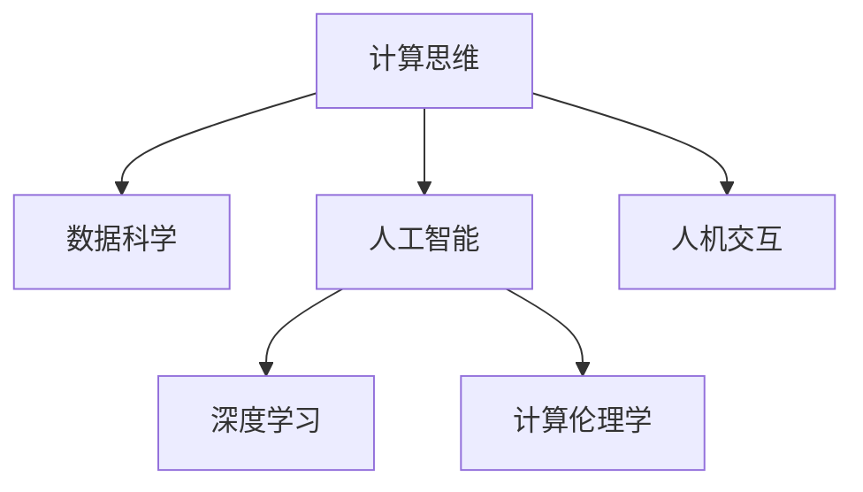

                 

# 科技与人文的交汇：人类计算的独特价值

> 关键词：计算思维, 数据科学, 人工智能, 深度学习, 人机交互, 计算伦理学

## 1. 背景介绍

### 1.1 问题由来
科技与人文的交汇是人类社会发展的重要议题。科技，特别是计算科技，为人类提供了强大的工具和手段，极大地提升了生产力和生活质量。然而，科技的发展并非一帆风顺，它也带来了许多挑战和伦理问题。计算科技，特别是人工智能和深度学习，在改变我们生活和工作方式的同时，也引发了对算法的透明性、公平性、安全性等伦理问题的关注。如何平衡科技发展与人文价值，成为当前社会面临的重要课题。

### 1.2 问题核心关键点
科技与人文的交汇涉及多个关键点：
- 计算思维与人的思维方式如何融合？
- 人工智能如何体现人类智慧？
- 算法透明性与公平性如何保障？
- 科技发展如何造福全人类？

这些问题不仅关乎技术本身，更涉及社会伦理、法律、教育等多个方面，需要跨学科的共同努力。

### 1.3 问题研究意义
研究科技与人文的交汇，对于构建负责任的科技发展路径，促进社会公平和谐，具有重要意义：
- 推动计算思维与人类思维的结合，促进人与科技的深度融合。
- 提升人工智能的伦理安全性，确保技术进步符合人类价值观。
- 实现科技与人文的双赢，推动人类社会的整体进步。

## 2. 核心概念与联系

### 2.1 核心概念概述

为更好地理解科技与人文交汇的概念，本节将介绍几个密切相关的核心概念：

- 计算思维(Computational Thinking)：指用计算的概念和逻辑来解决问题的方法和思维方式，包括抽象、自动化、算法设计等。
- 数据科学(Data Science)：涉及数据的获取、处理、分析、可视化，以及从数据中提取知识和发现模式的过程。
- 人工智能(Artificial Intelligence)：指模拟人类智能行为，使机器具备学习、推理、规划等能力的系统。
- 深度学习(Deep Learning)：指利用多层神经网络进行复杂模式识别和抽象学习的方法，是实现人工智能的核心技术之一。
- 人机交互(Human-Computer Interaction, HCI)：关注如何设计有效的交互方式，使计算机系统能够更好地理解用户需求，提供自然、高效的用户体验。
- 计算伦理学(Computational Ethics)：研究如何在计算科技发展过程中，保护人权、促进公平、避免偏见等伦理问题。

这些概念之间的逻辑关系可以通过以下Mermaid流程图来展示：



这个流程图展示了几大核心概念之间的相互关系：

1. 计算思维是数据科学、人工智能和深度学习的基础。
2. 人工智能和深度学习是人机交互的重要手段。
3. 计算伦理学是确保这些技术应用的伦理性和公平性的关键。

## 3. 核心算法原理 & 具体操作步骤
### 3.1 算法原理概述

计算科技与人文交汇的本质，在于如何将科技的逻辑和方法与人类的价值观、伦理道德相结合。这一过程涉及多方面的算法原理和操作步骤：

1. **计算思维与人类思维方式融合**：
   - 利用计算思维的抽象、归纳、模型化等方法，将复杂问题简化，构建可计算模型。
   - 通过跨学科的合作，结合人类哲学、伦理学、社会学等知识，设计更加合理、人性化的算法。

2. **数据科学在人文研究中的应用**：
   - 利用大数据和分析技术，挖掘人文历史、社会行为等数据中的知识模式，辅助人文社会科学研究。
   - 开发智能推荐系统，根据用户的阅读兴趣和行为数据，提供个性化的文学、历史、艺术等内容。

3. **人工智能在人文领域的应用**：
   - 利用自然语言处理技术，构建智能问答系统、文学创作辅助工具等，提升人文内容的传播和创作效率。
   - 开发情感计算系统，分析用户对文化艺术作品的情感反应，优化内容推荐和创作策略。

4. **人机交互的伦理设计**：
   - 设计可解释、透明的算法，使用户能够理解和信任人工智能系统的决策过程。
   - 采用用户隐私保护技术，确保数据安全和用户隐私不受侵犯。

### 3.2 算法步骤详解

科技与人文交汇的具体操作步骤包括以下几个关键步骤：

**Step 1: 定义问题和目标**
- 明确科技与人文交汇的具体问题，如教育、健康、环境等领域的算法应用。
- 设定具体目标，如提升教学效果、改善医疗诊断、优化环境治理等。

**Step 2: 数据准备和预处理**
- 收集相关的数据，包括文本、图像、语音等。
- 清洗数据，去除噪声，进行归一化和特征工程。

**Step 3: 模型设计**
- 根据问题特点，选择合适的算法模型，如决策树、神经网络、支持向量机等。
- 结合人类思维方式，优化模型结构，使其更符合人类认知。

**Step 4: 训练和优化**
- 使用标注数据训练模型，优化模型参数，提高模型精度。
- 应用正则化、Dropout等技术，防止过拟合。

**Step 5: 评估与验证**
- 在验证集上评估模型性能，使用误差指标如准确率、召回率等。
- 进行用户反馈和实地测试，调整算法和参数。

**Step 6: 部署与应用**
- 将训练好的模型部署到实际应用中，如智能推荐系统、情感分析工具等。
- 持续监控模型表现，及时更新和维护。

**Step 7: 伦理评估与优化**
- 评估模型在隐私、公平、透明等方面的表现，进行伦理审核。
- 优化算法，消除偏见，确保模型符合社会伦理和法律法规。

### 3.3 算法优缺点

科技与人文交汇的算法设计存在以下优点：
1. 多学科协同：结合多学科知识，设计更加合理、人性化的算法。
2. 数据驱动：利用大数据分析，发现复杂人文问题的内在规律。
3. 自动化与智能：通过算法自动化，提高处理效率和决策质量。

同时，也存在以下局限性：
1. 伦理风险：算法可能存在偏见、歧视等伦理问题，需持续关注和改进。
2. 数据隐私：大量个人数据的收集和使用可能侵犯隐私，需严格保护。
3. 技术壁垒：高级算法需要跨学科知识，开发和应用难度大。

尽管存在这些局限性，但科技与人文交汇的大数据和算法方法，已在多个领域展示了其巨大的潜力和价值。

### 3.4 算法应用领域

科技与人文交汇的算法方法，在多个领域得到了广泛应用，包括：

- **教育领域**：利用大数据和智能推荐，个性化教育内容，提升学习效果。
- **医疗领域**：开发智能诊断系统，结合医疗知识库，辅助医生诊断和治疗决策。
- **环境保护**：利用机器学习分析环境数据，预测和应对环境变化。
- **文化艺术**：构建情感计算系统，分析用户对文化艺术作品的情感反应，优化创作和推荐。
- **城市管理**：开发智能交通系统，优化城市交通流量，提升市民生活质量。

这些应用展示了计算科技与人文交汇的强大能力，预示着未来将有更多的领域受益于科技与人文的深度融合。

## 4. 数学模型和公式 & 详细讲解  
### 4.1 数学模型构建

本节将使用数学语言对科技与人文交汇的算法过程进行更加严格的刻画。

假设我们有一个数据集 $D=\{(x_i,y_i)\}_{i=1}^N$，其中 $x_i$ 为输入特征，$y_i$ 为对应的标签或输出。利用机器学习算法 $f$ 训练模型，最小化经验风险：

$$
\mathcal{L}(f) = \frac{1}{N}\sum_{i=1}^N \ell(f(x_i),y_i)
$$

其中 $\ell$ 为损失函数，如均方误差、交叉熵等。

### 4.2 公式推导过程

以情感分析任务为例，假设我们的输入 $x_i$ 为一句话，输出 $y_i$ 为情感标签（如正面、负面、中性），我们利用深度学习算法 $f$ 进行训练，最小化交叉熵损失：

$$
\mathcal{L}(f) = -\frac{1}{N}\sum_{i=1}^N y_i \log f(x_i)
$$

将数据集划分为训练集和验证集，使用验证集对模型进行评估：

$$
\mathcal{L}_{val}(f) = \frac{1}{N_{val}}\sum_{i=1}^{N_{val}} y_i \log f(x_i)
$$

在评估过程中，我们关注模型的准确率、召回率等指标，并结合人类情感判断，不断调整模型参数和算法结构，以提高模型的性能和伦理安全性。

### 4.3 案例分析与讲解

以下是一个情感分析模型的实际案例分析：

**案例背景**：
某电商平台希望通过情感分析提升用户满意度，优化产品推荐。

**数据准备**：
收集用户对商品的评论，标注情感标签。数据集分为训练集和测试集。

**模型设计**：
选择基于Transformer的深度学习模型，如BERT、GPT等，构建情感分类器。

**训练与优化**：
使用训练集训练模型，设置合适的学习率、批大小等超参数。在验证集上不断调整模型结构，防止过拟合。

**评估与部署**：
在测试集上评估模型性能，部署到实际应用中，实时分析用户评论情感，优化推荐策略。

**伦理审查**：
定期对模型进行伦理审查，确保模型输出符合伦理标准，不产生歧视、偏见等伦理问题。

**后续优化**：
根据用户反馈，持续优化模型算法，确保模型与用户需求保持一致。

## 5. 项目实践：代码实例和详细解释说明
### 5.1 开发环境搭建

在进行项目实践前，我们需要准备好开发环境。以下是使用Python进行PyTorch开发的环境配置流程：

1. 安装Anaconda：从官网下载并安装Anaconda，用于创建独立的Python环境。

2. 创建并激活虚拟环境：
```bash
conda create -n pytorch-env python=3.8 
conda activate pytorch-env
```

3. 安装PyTorch：根据CUDA版本，从官网获取对应的安装命令。例如：
```bash
conda install pytorch torchvision torchaudio cudatoolkit=11.1 -c pytorch -c conda-forge
```

4. 安装Transformers库：
```bash
pip install transformers
```

5. 安装各类工具包：
```bash
pip install numpy pandas scikit-learn matplotlib tqdm jupyter notebook ipython
```

完成上述步骤后，即可在`pytorch-env`环境中开始项目实践。

### 5.2 源代码详细实现

这里我们以情感分析任务为例，给出使用Transformers库对BERT模型进行训练的PyTorch代码实现。

首先，定义情感分析任务的数据处理函数：

```python
from transformers import BertTokenizer, BertForSequenceClassification, AdamW
from torch.utils.data import Dataset, DataLoader
import torch
from tqdm import tqdm
from sklearn.metrics import accuracy_score, precision_recall_fscore_support

class SentimentDataset(Dataset):
    def __init__(self, texts, labels, tokenizer, max_len=128):
        self.texts = texts
        self.labels = labels
        self.tokenizer = tokenizer
        self.max_len = max_len
        
    def __len__(self):
        return len(self.texts)
    
    def __getitem__(self, item):
        text = self.texts[item]
        label = self.labels[item]
        
        encoding = self.tokenizer(text, return_tensors='pt', max_length=self.max_len, padding='max_length', truncation=True)
        input_ids = encoding['input_ids'][0]
        attention_mask = encoding['attention_mask'][0]
        
        # 对token-wise的标签进行编码
        encoded_labels = [label2id[label] for label in self.labels] 
        encoded_labels.extend([label2id['O']] * (self.max_len - len(encoded_labels)))
        labels = torch.tensor(encoded_labels, dtype=torch.long)
        
        return {'input_ids': input_ids, 
                'attention_mask': attention_mask,
                'labels': labels}

# 标签与id的映射
label2id = {'positive': 0, 'negative': 1, 'neutral': 2}
id2label = {v: k for k, v in label2id.items()}

# 创建dataset
tokenizer = BertTokenizer.from_pretrained('bert-base-cased')

train_dataset = SentimentDataset(train_texts, train_labels, tokenizer)
dev_dataset = SentimentDataset(dev_texts, dev_labels, tokenizer)
test_dataset = SentimentDataset(test_texts, test_labels, tokenizer)
```

然后，定义模型和优化器：

```python
model = BertForSequenceClassification.from_pretrained('bert-base-cased', num_labels=len(label2id))

optimizer = AdamW(model.parameters(), lr=2e-5)
```

接着，定义训练和评估函数：

```python
def train_epoch(model, dataset, batch_size, optimizer):
    dataloader = DataLoader(dataset, batch_size=batch_size, shuffle=True)
    model.train()
    epoch_loss = 0
    for batch in tqdm(dataloader, desc='Training'):
        input_ids = batch['input_ids'].to(device)
        attention_mask = batch['attention_mask'].to(device)
        labels = batch['labels'].to(device)
        model.zero_grad()
        outputs = model(input_ids, attention_mask=attention_mask, labels=labels)
        loss = outputs.loss
        epoch_loss += loss.item()
        loss.backward()
        optimizer.step()
    return epoch_loss / len(dataloader)

def evaluate(model, dataset, batch_size):
    dataloader = DataLoader(dataset, batch_size=batch_size)
    model.eval()
    preds, labels = [], []
    with torch.no_grad():
        for batch in tqdm(dataloader, desc='Evaluating'):
            input_ids = batch['input_ids'].to(device)
            attention_mask = batch['attention_mask'].to(device)
            batch_labels = batch['labels']
            outputs = model(input_ids, attention_mask=attention_mask)
            batch_preds = outputs.logits.argmax(dim=2).to('cpu').tolist()
            batch_labels = batch_labels.to('cpu').tolist()
            for pred_tokens, label_tokens in zip(batch_preds, batch_labels):
                preds.append(pred_tokens[:len(label_tokens)])
                labels.append(label_tokens)
                
    acc = accuracy_score(labels, preds)
    return acc
```

最后，启动训练流程并在测试集上评估：

```python
epochs = 5
batch_size = 16

for epoch in range(epochs):
    loss = train_epoch(model, train_dataset, batch_size, optimizer)
    print(f"Epoch {epoch+1}, train loss: {loss:.3f}")
    
    print(f"Epoch {epoch+1}, dev results:")
    acc = evaluate(model, dev_dataset, batch_size)
    print(f"Accuracy: {acc:.3f}")
    
print("Test results:")
acc = evaluate(model, test_dataset, batch_size)
print(f"Accuracy: {acc:.3f}")
```

以上就是使用PyTorch对BERT进行情感分析任务训练的完整代码实现。可以看到，得益于Transformers库的强大封装，我们可以用相对简洁的代码完成BERT模型的加载和训练。

### 5.3 代码解读与分析

让我们再详细解读一下关键代码的实现细节：

**SentimentDataset类**：
- `__init__`方法：初始化文本、标签、分词器等关键组件。
- `__len__`方法：返回数据集的样本数量。
- `__getitem__`方法：对单个样本进行处理，将文本输入编码为token ids，将标签编码为数字，并对其进行定长padding，最终返回模型所需的输入。

**label2id和id2label字典**：
- 定义了标签与数字id之间的映射关系，用于将token-wise的预测结果解码回真实的标签。

**训练和评估函数**：
- 使用PyTorch的DataLoader对数据集进行批次化加载，供模型训练和推理使用。
- 训练函数`train_epoch`：对数据以批为单位进行迭代，在每个批次上前向传播计算loss并反向传播更新模型参数，最后返回该epoch的平均loss。
- 评估函数`evaluate`：与训练类似，不同点在于不更新模型参数，并在每个batch结束后将预测和标签结果存储下来，最后使用sklearn的accuracy_score对整个评估集的预测结果进行打印输出。

**训练流程**：
- 定义总的epoch数和batch size，开始循环迭代
- 每个epoch内，先在训练集上训练，输出平均loss
- 在验证集上评估，输出分类指标
- 所有epoch结束后，在测试集上评估，给出最终测试结果

可以看到，PyTorch配合Transformers库使得BERT训练的代码实现变得简洁高效。开发者可以将更多精力放在数据处理、模型改进等高层逻辑上，而不必过多关注底层的实现细节。

当然，工业级的系统实现还需考虑更多因素，如模型的保存和部署、超参数的自动搜索、更灵活的任务适配层等。但核心的训练范式基本与此类似。

## 6. 实际应用场景
### 6.1 智能推荐系统

基于情感分析的智能推荐系统，可以帮助电商平台更好地理解用户需求，提供个性化推荐。在技术实现上，可以收集用户的浏览、点击、评分等行为数据，通过情感分析模型分析用户对商品的情感倾向，并结合商品特征进行推荐。

具体步骤如下：
1. 收集用户历史行为数据，标注情感标签。
2. 使用情感分析模型训练情感分类器，标注新商品情感标签。
3. 根据用户行为和商品情感标签，使用协同过滤、矩阵分解等推荐算法进行推荐。
4. 实时更新推荐模型，优化推荐效果。

### 6.2 情感计算

情感计算系统可以分析用户对文化艺术作品的情感反应，优化内容推荐和创作策略。例如，某文艺作品在社交媒体上的情感反应被用来评估其受欢迎程度，并指导内容的创作和推广策略。

具体步骤如下：
1. 收集用户对文化艺术作品的评论，标注情感标签。
2. 使用情感分析模型训练情感分类器，分析用户情感倾向。
3. 结合用户情感反馈和作品属性，优化推荐和创作策略。
4. 定期更新模型，确保情感分析的准确性和时效性。

### 6.3 医疗诊断

情感分析技术可以用于医疗领域，辅助医生诊断和治疗决策。例如，通过分析患者对治疗效果的情感反馈，可以评估治疗方案的效果，并进行优化。

具体步骤如下：
1. 收集患者对治疗效果的评论，标注情感标签。
2. 使用情感分析模型训练情感分类器，分析情感倾向。
3. 结合情感分析结果和医疗知识库，优化治疗方案。
4. 定期更新模型，确保情感分析的准确性和时效性。

### 6.4 未来应用展望

随着情感分析技术的不断发展，其在更多领域的应用前景将更加广阔。未来，情感分析技术将在以下方向取得新的突破：

1. **多模态情感分析**：结合文本、语音、图像等多种数据模态，全面理解用户情感，提升情感分析的准确性。
2. **情感计算与AI伦理结合**：通过情感计算，发现算法偏见和伦理问题，并进行优化和改进。
3. **情感分析与知识图谱结合**：结合知识图谱，提升情感分析的深度和广度，提供更全面的情感理解。
4. **实时情感监测**：通过实时情感分析，及时发现和应对突发事件，提升社会治理的效率和精度。

## 7. 工具和资源推荐
### 7.1 学习资源推荐

为了帮助开发者系统掌握情感分析的算法基础和应用技巧，这里推荐一些优质的学习资源：

1. 《深度学习》系列课程：吴恩达的深度学习课程，涵盖深度学习的基本概念和算法。
2. 《Python机器学习》书籍：Scikit-Learn的官方教程，详细介绍机器学习算法及其应用。
3. 《自然语言处理综论》课程：斯坦福大学的自然语言处理课程，涵盖NLP的基础和前沿。
4. 《情感分析理论与实践》书籍：介绍情感分析的理论和实践，提供丰富的案例分析。
5. HuggingFace官方文档：提供详细的情感分析模型及其使用方法。

通过对这些资源的学习实践，相信你一定能够快速掌握情感分析的算法原理和应用技巧，并用于解决实际的情感分析问题。

### 7.2 开发工具推荐

高效的开发离不开优秀的工具支持。以下是几款用于情感分析开发的常用工具：

1. PyTorch：基于Python的开源深度学习框架，灵活动态的计算图，适合快速迭代研究。
2. TensorFlow：由Google主导开发的开源深度学习框架，生产部署方便，适合大规模工程应用。
3. Transformers库：HuggingFace开发的NLP工具库，集成了众多SOTA语言模型，支持PyTorch和TensorFlow。
4. Weights & Biases：模型训练的实验跟踪工具，可以记录和可视化模型训练过程中的各项指标，方便对比和调优。
5. TensorBoard：TensorFlow配套的可视化工具，可实时监测模型训练状态，并提供丰富的图表呈现方式。

合理利用这些工具，可以显著提升情感分析任务的开发效率，加快创新迭代的步伐。

### 7.3 相关论文推荐

情感分析技术的发展源于学界的持续研究。以下是几篇奠基性的相关论文，推荐阅读：

1. Sentiment Analysis with Deep Learning: A Survey: 综述了情感分析的最新进展和应用场景。
2. Emotion Analysis with Recurrent Neural Networks: 利用RNN进行情感分析，引入上下文信息，提高准确率。
3. A Survey on Deep Learning for Sentiment Analysis: 综述了使用深度学习进行情感分析的研究和应用。
4. Efficient Text Classification via Regularization: 通过正则化技术，提高文本分类（包括情感分析）的准确率。
5. Contextual Emotion Recognition: 通过上下文信息，提升情感分析的准确性。

这些论文代表了大情感分析技术的发展脉络。通过学习这些前沿成果，可以帮助研究者把握学科前进方向，激发更多的创新灵感。

## 8. 总结：未来发展趋势与挑战
### 8.1 总结

本文对基于情感分析的科技与人文交汇方法进行了全面系统的介绍。首先阐述了情感分析在计算科技与人文交汇中的独特价值，明确了其在个性化推荐、情感计算、医疗诊断等领域的巨大潜力。其次，从原理到实践，详细讲解了情感分析的数学模型和操作步骤，给出了情感分析任务开发的完整代码实例。同时，本文还广泛探讨了情感分析在实际应用场景中的广阔前景，展示了情感分析范式的强大能力。

通过本文的系统梳理，可以看到，情感分析在计算科技与人文交汇中具有不可替代的价值。情感分析不仅能够提升数据驱动决策的质量，还能在伦理、公平等方面提供有力保障，从而推动科技与人文的深度融合，为构建更加智能、公平、人本化的社会奠定基础。

### 8.2 未来发展趋势

展望未来，情感分析技术将呈现以下几个发展趋势：

1. **多模态融合**：结合文本、语音、图像等多种数据模态，全面理解用户情感，提升情感分析的准确性。
2. **情感计算与伦理结合**：通过情感计算，发现算法偏见和伦理问题，并进行优化和改进。
3. **实时情感监测**：通过实时情感分析，及时发现和应对突发事件，提升社会治理的效率和精度。
4. **情感分析与知识图谱结合**：结合知识图谱，提升情感分析的深度和广度，提供更全面的情感理解。

这些趋势凸显了情感分析技术在计算科技与人文交汇中的巨大潜力和应用前景。情感分析技术的发展，必将为构建更加智能、公平、人本化的社会带来深远影响。

### 8.3 面临的挑战

尽管情感分析技术已经取得了瞩目成就，但在迈向更加智能化、普适化应用的过程中，仍面临诸多挑战：

1. **数据质量与标注成本**：高质量标注数据的获取成本较高，数据质量也会影响情感分析的准确性。
2. **算法复杂性与可解释性**：情感分析模型复杂度高，模型的决策过程难以解释，可能导致用户信任度降低。
3. **情感分析的跨文化适用性**：不同文化背景下的情感表达存在差异，情感分析模型需要具备跨文化适应能力。
4. **情感计算的伦理问题**：情感计算可能侵犯用户隐私，引发伦理问题，需加强监管。

尽管存在这些挑战，但随着情感分析技术的不断进步，以及跨学科合作的加强，这些挑战终将一一被克服，情感分析技术必将在构建人机协同的智能社会中扮演越来越重要的角色。

### 8.4 研究展望

面向未来，情感分析技术需要在以下几个方向取得新的突破：

1. **跨文化情感分析**：开发适用于不同文化背景下的情感分析模型，提升跨文化适应能力。
2. **情感计算与隐私保护结合**：在保护用户隐私的前提下，进行情感计算和分析。
3. **情感分析的伦理审查机制**：建立情感分析的伦理审查机制，确保模型决策符合伦理标准。
4. **多模态情感分析的深度融合**：结合多种数据模态，提升情感分析的深度和广度。

这些方向的探索发展，必将引领情感分析技术迈向更高的台阶，为构建安全、可靠、可解释、可控的智能系统铺平道路。面向未来，情感分析技术还需要与其他人工智能技术进行更深入的融合，如知识表示、因果推理、强化学习等，多路径协同发力，共同推动自然语言理解和智能交互系统的进步。只有勇于创新、敢于突破，才能不断拓展情感分析的边界，让智能技术更好地造福人类社会。

## 9. 附录：常见问题与解答

**Q1：情感分析是否适用于所有NLP任务？**

A: 情感分析在大多数NLP任务上都能取得不错的效果，特别是对于文本分析、评论分析等任务。但对于一些特定领域的任务，如法律、医学等，仅仅依靠情感分析可能无法完全解决问题。此时需要在特定领域语料上进一步预训练，再进行微调，才能获得理想效果。此外，对于一些需要时效性、个性化很强的任务，如对话、推荐等，情感分析方法也需要针对性的改进优化。

**Q2：如何缓解情感分析过程中的过拟合问题？**

A: 过拟合是情感分析面临的主要挑战，尤其是在标注数据不足的情况下。常见的缓解策略包括：
1. 数据增强：通过回译、近义替换等方式扩充训练集
2. 正则化：使用L2正则、Dropout、Early Stopping等防止过拟合
3. 对抗训练：引入对抗样本，提高模型鲁棒性
4. 参数高效微调：只调整少量参数，减小过拟合风险
5. 多模型集成：训练多个情感分析模型，取平均输出，抑制过拟合

这些策略往往需要根据具体任务和数据特点进行灵活组合。只有在数据、模型、训练、推理等各环节进行全面优化，才能最大限度地发挥情感分析的威力。

**Q3：情感分析模型在落地部署时需要注意哪些问题？**

A: 将情感分析模型转化为实际应用，还需要考虑以下因素：
1. 模型裁剪：去除不必要的层和参数，减小模型尺寸，加快推理速度
2. 量化加速：将浮点模型转为定点模型，压缩存储空间，提高计算效率
3. 服务化封装：将模型封装为标准化服务接口，便于集成调用
4. 弹性伸缩：根据请求流量动态调整资源配置，平衡服务质量和成本
5. 监控告警：实时采集系统指标，设置异常告警阈值，确保服务稳定性
6. 安全防护：采用访问鉴权、数据脱敏等措施，保障数据和模型安全

情感分析技术在落地应用中需要综合考虑技术、业务、伦理等多方面因素，确保模型的正确性和公平性，提升用户体验。

---

作者：禅与计算机程序设计艺术 / Zen and the Art of Computer Programming

