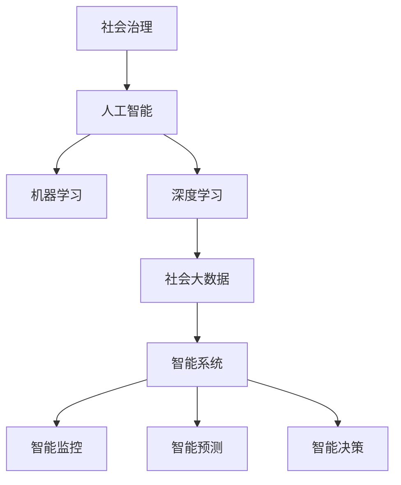

                 

## 1. 背景介绍

### 1.1 问题由来

在现代社会，社会治理面临诸多挑战，如公共安全、环境污染、公共卫生等。传统的社会治理方式依赖于人工判断和处理，效率低下且容易出错。近年来，随着人工智能（AI）技术的发展，尤其是机器学习和深度学习（Deep Learning）的进步，为社会治理带来了新的思路和方法。科技创新，尤其是AI技术在社会治理中的应用，正在成为推动社会进步的重要力量。

### 1.2 问题核心关键点

社会治理的科技创新主要关注以下几个关键点：

- **数据驱动**：利用大数据、人工智能等技术，对社会治理中的海量数据进行分析，提供决策支持。
- **自动化与智能化**：通过自动化、智能化手段，提升社会治理的效率和准确性。
- **实时监测与预测**：通过实时监测和预测技术，及时发现并解决社会问题。
- **人性化与伦理**：确保社会治理的科技创新以人为本，同时兼顾伦理道德和社会公平。

这些关键点共同构成了社会治理科技创新的核心框架，推动着社会治理方式的转变和提升。

## 2. 核心概念与联系

### 2.1 核心概念概述

为更好地理解社会治理科技创新的内涵和应用，本节将介绍几个关键概念及其联系：

- **社会治理**：指政府、社会组织和个人在维护社会秩序、解决社会问题、促进社会发展等方面的活动和过程。
- **人工智能**：利用计算机科学和数学等学科的最新成果，模拟人类智能过程，如学习、推理、理解语言等。
- **机器学习**：通过算法使计算机从数据中学习规律，并应用于实际问题中，如分类、回归、聚类等。
- **深度学习**：一种机器学习的高级形式，通过多层神经网络对数据进行抽象和推理，适用于复杂数据的处理。
- **社会大数据**：在社会治理中产生的大量数据，包括传感器数据、社交媒体数据、政府公开数据等。
- **智能系统**：结合人工智能技术，开发出的自动化、智能化的社会治理系统，如智能监控、智能预测、智能决策等。

这些概念之间的逻辑关系可以通过以下Mermaid流程图来展示：



这个流程图展示了一系列概念之间的联系和应用场景：

1. 社会治理需要人工智能技术的支持。
2. 人工智能技术包括机器学习和深度学习。
3. 社会大数据是人工智能处理和分析的对象。
4. 通过智能系统，人工智能技术转化为具体的社会治理应用。
5. 智能系统包括智能监控、智能预测和智能决策等具体应用。

## 3. 核心算法原理 & 具体操作步骤

### 3.1 算法原理概述

社会治理的科技创新主要依赖于机器学习和深度学习算法，其中数据驱动是核心。利用大数据、深度学习等技术，对社会治理中的海量数据进行分析，提取有价值的信息，辅助决策，提升社会治理效率。

形式化地，假设社会治理任务为 $T$，其数据集为 $D=\{(x_i,y_i)\}_{i=1}^N$，其中 $x_i$ 为输入特征，$y_i$ 为标签。社会治理的目标是通过学习模型 $M_{\theta}$，最小化经验风险 $\mathcal{L}(\theta)$，从而对新数据进行预测。

$$
\theta^* = \mathop{\arg\min}_{\theta} \mathcal{L}(\theta)
$$

其中 $\mathcal{L}$ 为损失函数，如交叉熵损失、均方误差损失等。

### 3.2 算法步骤详解

社会治理的科技创新通常包括以下几个关键步骤：

**Step 1: 数据收集与预处理**
- 收集社会治理中的各类数据，如传感器数据、社交媒体数据、政府公开数据等。
- 对数据进行清洗、去噪、标准化等预处理，确保数据质量。

**Step 2: 模型选择与训练**
- 选择合适的机器学习或深度学习模型，如随机森林、卷积神经网络（CNN）、循环神经网络（RNN）等。
- 在训练集上使用优化算法（如梯度下降、Adam等）对模型进行训练。

**Step 3: 模型评估与优化**
- 在验证集上评估模型性能，如准确率、召回率、F1分数等。
- 根据评估结果，调整模型超参数，如学习率、批大小、迭代轮数等。

**Step 4: 模型部署与应用**
- 将训练好的模型部署到实际应用环境中。
- 实时监测和预测社会事件，辅助决策，提升社会治理效率。

**Step 5: 持续改进**
- 定期收集新数据，更新模型，保持其性能和适应性。
- 结合最新研究成果，优化模型架构和算法，提升社会治理智能化水平。

### 3.3 算法优缺点

社会治理的科技创新具有以下优点：

1. **高效性**：通过自动化、智能化的手段，大幅提升社会治理的效率。
2. **准确性**：利用机器学习和大数据技术，提升预测和决策的准确性。
3. **可扩展性**：智能系统可以应用于多种社会治理场景，具有较强的可扩展性。
4. **可解释性**：通过模型解释技术，使得决策过程透明化，增强信任度。

同时，该方法也存在以下局限性：

1. **数据依赖**：社会治理科技创新的效果很大程度上依赖于数据的质量和数量。
2. **隐私问题**：处理社会治理数据时，需注意保护个人隐私和数据安全。
3. **伦理问题**：模型决策过程可能存在偏见，需确保公平性和伦理性。
4. **模型复杂性**：复杂的深度学习模型需要大量计算资源和数据，可能存在过度拟合问题。

尽管存在这些局限性，但社会治理科技创新的前景依然广阔。通过不断优化数据收集和处理、模型选择和训练、评估和部署等环节，可以进一步提升其效果，应对各种社会治理挑战。

### 3.4 算法应用领域

社会治理的科技创新已广泛应用于多个领域，如：

- **公共安全**：通过智能监控和预测技术，及时发现和防范恐怖主义、犯罪等公共安全问题。
- **环境保护**：利用智能系统监测空气质量、水质等环境指标，提供科学决策支持。
- **公共卫生**：通过数据分析和预测技术，早期发现和控制传染病疫情，提高公共卫生水平。
- **城市管理**：智能交通、智能停车、智能电网等，提升城市运行效率和居民生活质量。
- **教育**：通过智能教育系统，实现个性化教学、在线评估等功能，提高教育质量和公平性。

这些应用领域展示了社会治理科技创新的巨大潜力和广阔前景。随着技术的发展，未来还将有更多领域受益于科技创新，推动社会进步。

## 4. 数学模型和公式 & 详细讲解 & 举例说明

### 4.1 数学模型构建

社会治理科技创新的数学模型主要基于机器学习和深度学习，以分类、回归等任务为目标。以二分类任务为例，假设模型 $M_{\theta}$ 的输出为 $\hat{y}=M_{\theta}(x) \in [0,1]$，其中 $x$ 为输入特征，$\theta$ 为模型参数。则二分类交叉熵损失函数定义为：

$$
\ell(M_{\theta}(x),y) = -[y\log \hat{y} + (1-y)\log(1-\hat{y})]
$$

在此基础上，社会治理科技创新的经验风险可以表示为：

$$
\mathcal{L}(\theta) = -\frac{1}{N}\sum_{i=1}^N [y_i\log M_{\theta}(x_i)+(1-y_i)\log(1-M_{\theta}(x_i))]
$$

### 4.2 公式推导过程

下面以二分类任务为例，推导交叉熵损失函数及其梯度的计算公式。

设模型 $M_{\theta}$ 在输入 $x$ 上的输出为 $\hat{y}=M_{\theta}(x) \in [0,1]$，真实标签 $y \in \{0,1\}$。则二分类交叉熵损失函数定义为：

$$
\ell(M_{\theta}(x),y) = -[y\log \hat{y} + (1-y)\log(1-\hat{y})]
$$

将其代入经验风险公式，得：

$$
\mathcal{L}(\theta) = -\frac{1}{N}\sum_{i=1}^N [y_i\log M_{\theta}(x_i)+(1-y_i)\log(1-M_{\theta}(x_i))]
$$

根据链式法则，损失函数对参数 $\theta_k$ 的梯度为：

$$
\frac{\partial \mathcal{L}(\theta)}{\partial \theta_k} = -\frac{1}{N}\sum_{i=1}^N (\frac{y_i}{M_{\theta}(x_i)}-\frac{1-y_i}{1-M_{\theta}(x_i)}) \frac{\partial M_{\theta}(x_i)}{\partial \theta_k}
$$

其中 $\frac{\partial M_{\theta}(x_i)}{\partial \theta_k}$ 可进一步递归展开，利用自动微分技术完成计算。

### 4.3 案例分析与讲解

以智能监控系统为例，利用机器学习和大数据技术，可以实现对公共安全事件的实时监测和预测。该系统主要包含以下几个关键组件：

- **数据采集**：通过摄像头、传感器等设备，实时采集公共区域的视频和传感器数据。
- **数据预处理**：对采集到的数据进行清洗、去噪、标准化等预处理。
- **模型训练**：选择适当的机器学习模型，如卷积神经网络（CNN），在历史数据上训练模型。
- **实时监测**：将训练好的模型部署到实际应用环境中，实时监测公共区域的安全情况。
- **事件预测**：利用模型预测未来的安全事件，及时采取预防措施。

### 5. 项目实践：代码实例和详细解释说明

#### 5.1 开发环境搭建

在进行社会治理科技创新项目实践前，我们需要准备好开发环境。以下是使用Python进行PyTorch开发的环境配置流程：

1. 安装Anaconda：从官网下载并安装Anaconda，用于创建独立的Python环境。

2. 创建并激活虚拟环境：
```bash
conda create -n pytorch-env python=3.8 
conda activate pytorch-env
```

3. 安装PyTorch：根据CUDA版本，从官网获取对应的安装命令。例如：
```bash
conda install pytorch torchvision torchaudio cudatoolkit=11.1 -c pytorch -c conda-forge
```

4. 安装Transformers库：
```bash
pip install transformers
```

5. 安装各类工具包：
```bash
pip install numpy pandas scikit-learn matplotlib tqdm jupyter notebook ipython
```

完成上述步骤后，即可在`pytorch-env`环境中开始社会治理科技创新项目的开发。

#### 5.2 源代码详细实现

下面以智能监控系统为例，给出使用PyTorch进行二分类任务处理的代码实现。

首先，定义二分类任务的数据处理函数：

```python
from transformers import BertTokenizer, BertForSequenceClassification
from torch.utils.data import Dataset
import torch

class SecurityDataset(Dataset):
    def __init__(self, texts, labels, tokenizer, max_len=128):
        self.texts = texts
        self.labels = labels
        self.tokenizer = tokenizer
        self.max_len = max_len
        
    def __len__(self):
        return len(self.texts)
    
    def __getitem__(self, item):
        text = self.texts[item]
        label = self.labels[item]
        
        encoding = self.tokenizer(text, return_tensors='pt', max_length=self.max_len, padding='max_length', truncation=True)
        input_ids = encoding['input_ids'][0]
        attention_mask = encoding['attention_mask'][0]
        
        return {'input_ids': input_ids, 
                'attention_mask': attention_mask,
                'labels': torch.tensor(label, dtype=torch.long)}
```

然后，定义模型和优化器：

```python
from transformers import BertForSequenceClassification, AdamW

model = BertForSequenceClassification.from_pretrained('bert-base-cased', num_labels=2)

optimizer = AdamW(model.parameters(), lr=2e-5)
```

接着，定义训练和评估函数：

```python
from torch.utils.data import DataLoader
from tqdm import tqdm
from sklearn.metrics import classification_report

device = torch.device('cuda') if torch.cuda.is_available() else torch.device('cpu')
model.to(device)

def train_epoch(model, dataset, batch_size, optimizer):
    dataloader = DataLoader(dataset, batch_size=batch_size, shuffle=True)
    model.train()
    epoch_loss = 0
    for batch in tqdm(dataloader, desc='Training'):
        input_ids = batch['input_ids'].to(device)
        attention_mask = batch['attention_mask'].to(device)
        labels = batch['labels'].to(device)
        model.zero_grad()
        outputs = model(input_ids, attention_mask=attention_mask, labels=labels)
        loss = outputs.loss
        epoch_loss += loss.item()
        loss.backward()
        optimizer.step()
    return epoch_loss / len(dataloader)

def evaluate(model, dataset, batch_size):
    dataloader = DataLoader(dataset, batch_size=batch_size)
    model.eval()
    preds, labels = [], []
    with torch.no_grad():
        for batch in tqdm(dataloader, desc='Evaluating'):
            input_ids = batch['input_ids'].to(device)
            attention_mask = batch['attention_mask'].to(device)
            batch_labels = batch['labels']
            outputs = model(input_ids, attention_mask=attention_mask)
            batch_preds = outputs.logits.argmax(dim=2).to('cpu').tolist()
            batch_labels = batch_labels.to('cpu').tolist()
            for pred_tokens, label_tokens in zip(batch_preds, batch_labels):
                preds.append(pred_tokens[:len(label_tokens)])
                labels.append(label_tokens)
                
    print(classification_report(labels, preds))
```

最后，启动训练流程并在验证集上评估：

```python
epochs = 5
batch_size = 16

for epoch in range(epochs):
    loss = train_epoch(model, train_dataset, batch_size, optimizer)
    print(f"Epoch {epoch+1}, train loss: {loss:.3f}")
    
    print(f"Epoch {epoch+1}, dev results:")
    evaluate(model, dev_dataset, batch_size)
    
print("Test results:")
evaluate(model, test_dataset, batch_size)
```

以上就是使用PyTorch进行智能监控系统开发的基本代码实现。可以看到，通过简单的代码，即可实现二分类任务的训练和评估。

#### 5.3 代码解读与分析

让我们再详细解读一下关键代码的实现细节：

**SecurityDataset类**：
- `__init__`方法：初始化文本、标签、分词器等关键组件。
- `__len__`方法：返回数据集的样本数量。
- `__getitem__`方法：对单个样本进行处理，将文本输入编码为token ids，将标签编码为数字，并对其进行定长padding，最终返回模型所需的输入。

**模型和优化器**：
- 定义二分类任务模型 `BertForSequenceClassification`，并从预训练模型 `bert-base-cased` 加载。
- 定义优化器 `AdamW`，设置学习率。

**训练和评估函数**：
- 使用PyTorch的DataLoader对数据集进行批次化加载，供模型训练和推理使用。
- 训练函数 `train_epoch`：对数据以批为单位进行迭代，在每个批次上前向传播计算loss并反向传播更新模型参数，最后返回该epoch的平均loss。
- 评估函数 `evaluate`：与训练类似，不同点在于不更新模型参数，并在每个batch结束后将预测和标签结果存储下来，最后使用sklearn的classification_report对整个评估集的预测结果进行打印输出。

**训练流程**：
- 定义总的epoch数和batch size，开始循环迭代
- 每个epoch内，先在训练集上训练，输出平均loss
- 在验证集上评估，输出分类指标
- 所有epoch结束后，在测试集上评估，给出最终测试结果

## 6. 实际应用场景

### 6.1 智能监控系统

智能监控系统是社会治理科技创新的一个典型应用。通过实时监测公共区域的安全情况，智能监控系统可以及时发现和防范恐怖主义、犯罪等公共安全问题，提升社会治理的效率和准确性。

在技术实现上，可以收集公共区域的视频和传感器数据，将视频帧和传感器数据作为输入，利用机器学习模型（如CNN）进行实时分析和预测。一旦发现异常情况，系统便会自动报警，并通知相关人员进行处理。此外，智能监控系统还可以通过历史数据进行训练，提升模型预测的准确性，减少误报和漏报情况。

### 6.2 智能交通系统

智能交通系统利用机器学习和大数据技术，可以实现对交通流的实时监测和预测，优化交通流量分配，提升道路通行效率，减少交通拥堵和事故发生。

智能交通系统主要包含以下几个关键组件：

- **数据采集**：通过摄像头、传感器等设备，实时采集交通流量、车速、交通事故等信息。
- **数据预处理**：对采集到的数据进行清洗、去噪、标准化等预处理。
- **模型训练**：选择适当的机器学习模型，如卷积神经网络（CNN），在历史数据上训练模型。
- **实时监测**：将训练好的模型部署到实际应用环境中，实时监测交通流量，预测交通拥堵情况。
- **交通调控**：根据实时监测结果，调控信号灯、调整车道等，优化交通流量分配。

通过智能交通系统的应用，可以实现交通流量的智能化管理，提升交通系统的效率和安全性。

### 6.3 智能医疗系统

智能医疗系统利用机器学习和大数据技术，可以实现对医疗数据的实时分析和预测，辅助医生进行诊断和治疗，提高医疗服务的质量和效率。

智能医疗系统主要包含以下几个关键组件：

- **数据采集**：通过电子病历、医疗影像、基因数据等设备，实时采集医疗数据。
- **数据预处理**：对采集到的数据进行清洗、去噪、标准化等预处理。
- **模型训练**：选择适当的机器学习模型，如随机森林、支持向量机等，在历史数据上训练模型。
- **实时监测**：将训练好的模型部署到实际应用环境中，实时监测患者的健康状况，预测疾病风险。
- **辅助诊断**：根据实时监测结果，辅助医生进行诊断和治疗决策。

通过智能医疗系统的应用，可以实现医疗数据的智能化分析，提升医疗服务的质量和效率，减少误诊和漏诊情况。

### 6.4 未来应用展望

随着社会治理科技创新的不断发展，未来的应用场景将更加广泛和深入，为社会治理带来新的机遇和挑战。

1. **智慧城市**：通过智能监控、智能交通、智能医疗等系统，实现城市运行的智能化管理，提升城市运行效率和居民生活质量。
2. **智慧农业**：利用机器学习和大数据技术，实现农业生产的智能化管理，提高农业生产效率和食品安全水平。
3. **智慧教育**：通过智能教育系统，实现个性化教学、在线评估等功能，提高教育质量和公平性。
4. **智慧能源**：利用机器学习和大数据技术，实现能源使用的智能化管理，提高能源利用效率和环保水平。

这些应用场景展示了社会治理科技创新的广阔前景。随着技术的进步和应用的推广，未来将有更多领域受益于科技创新，推动社会进步。

## 7. 工具和资源推荐

### 7.1 学习资源推荐

为了帮助开发者系统掌握社会治理科技创新的理论基础和实践技巧，这里推荐一些优质的学习资源：

1. **《机器学习》（周志华）**：系统介绍机器学习的基本概念、算法和应用，是入门机器学习领域的经典教材。
2. **《深度学习》（Ian Goodfellow）**：全面介绍深度学习的基本概念、算法和应用，是深度学习领域的权威著作。
3. **《Python深度学习》（Francois Chollet）**：利用Keras框架，讲解深度学习的实际应用，适合实战练习。
4. **Coursera的《机器学习》课程**：斯坦福大学开设的机器学习课程，有Lecture视频和配套作业，带你入门机器学习领域的基本概念和经典模型。
5. **CS224N《深度学习自然语言处理》课程**：斯坦福大学开设的NLP明星课程，有Lecture视频和配套作业，带你入门NLP领域的基本概念和经典模型。

通过对这些资源的学习实践，相信你一定能够快速掌握社会治理科技创新的精髓，并用于解决实际的NLP问题。

### 7.2 开发工具推荐

高效的开发离不开优秀的工具支持。以下是几款用于社会治理科技创新开发的常用工具：

1. **PyTorch**：基于Python的开源深度学习框架，灵活动态的计算图，适合快速迭代研究。大部分预训练语言模型都有PyTorch版本的实现。
2. **TensorFlow**：由Google主导开发的开源深度学习框架，生产部署方便，适合大规模工程应用。同样有丰富的预训练语言模型资源。
3. **Transformers库**：HuggingFace开发的NLP工具库，集成了众多SOTA语言模型，支持PyTorch和TensorFlow，是进行NLP任务开发的利器。
4. **Weights & Biases**：模型训练的实验跟踪工具，可以记录和可视化模型训练过程中的各项指标，方便对比和调优。与主流深度学习框架无缝集成。
5. **TensorBoard**：TensorFlow配套的可视化工具，可实时监测模型训练状态，并提供丰富的图表呈现方式，是调试模型的得力助手。
6. **Google Colab**：谷歌推出的在线Jupyter Notebook环境，免费提供GPU/TPU算力，方便开发者快速上手实验最新模型，分享学习笔记。

合理利用这些工具，可以显著提升社会治理科技创新任务的开发效率，加快创新迭代的步伐。

### 7.3 相关论文推荐

社会治理科技创新的研究源于学界的持续研究。以下是几篇奠基性的相关论文，推荐阅读：

1. **《深度学习》（Ian Goodfellow）**：全面介绍深度学习的基本概念、算法和应用，是深度学习领域的权威著作。
2. **《机器学习》（周志华）**：系统介绍机器学习的基本概念、算法和应用，是入门机器学习领域的经典教材。
3. **《Python深度学习》（Francois Chollet）**：利用Keras框架，讲解深度学习的实际应用，适合实战练习。
4. **《自然语言处理综论》（Daniel Jurafsky, James H. Martin）**：全面介绍自然语言处理的理论、算法和应用，是NLP领域的权威教材。

这些论文代表了大语言模型微调技术的发展脉络。通过学习这些前沿成果，可以帮助研究者把握学科前进方向，激发更多的创新灵感。

## 8. 总结：未来发展趋势与挑战

### 8.1 研究成果总结

本文对社会治理科技创新的理论和实践进行了全面系统的介绍。首先阐述了社会治理科技创新的研究背景和意义，明确了科技创新在提升社会治理效率和质量方面的独特价值。其次，从原理到实践，详细讲解了社会治理科技创新的数学模型和算法流程，给出了社会治理科技创新项目的完整代码实例。同时，本文还广泛探讨了科技创新在智能监控、智能交通、智能医疗等领域的实际应用，展示了其巨大的潜力和前景。此外，本文精选了社会治理科技创新的各类学习资源，力求为读者提供全方位的技术指引。

通过本文的系统梳理，可以看到，社会治理科技创新的理论和技术框架已经相对成熟，并在多个领域取得了显著成效。未来，随着技术的不断进步和应用的深入推广，社会治理科技创新将带来更多创新点，为社会治理方式的转变和提升提供新的动力。

### 8.2 未来发展趋势

展望未来，社会治理科技创新的发展趋势主要包括以下几个方面：

1. **数据驱动**：随着数据采集技术的进步，社会治理科技创新的数据规模将不断扩大，数据的实时性和多样性也将进一步提升。
2. **自动化与智能化**：通过自动化和智能化的手段，社会治理科技创新的效率和准确性将进一步提升。
3. **实时监测与预测**：利用实时监测和预测技术，社会治理科技创新的反应速度将进一步提升，及时发现和解决社会问题。
4. **人性化与伦理**：社会治理科技创新将更加注重人性化设计，兼顾伦理道德和社会公平。
5. **多模态融合**：利用多模态数据融合技术，提升社会治理科技创新的综合分析能力。
6. **跨领域应用**：社会治理科技创新将突破传统应用领域，向更多领域扩展，如智慧农业、智慧教育等。

以上趋势凸显了社会治理科技创新的广阔前景。这些方向的探索发展，将进一步提升社会治理的智能化水平，为社会进步带来新的动力。

### 8.3 面临的挑战

尽管社会治理科技创新的前景广阔，但在实施过程中，仍面临诸多挑战：

1. **数据隐私**：处理社会治理数据时，需注意保护个人隐私和数据安全。
2. **模型偏见**：模型决策过程可能存在偏见，需确保公平性和伦理性。
3. **计算资源**：大规模数据处理和模型训练需要大量计算资源，需优化资源使用。
4. **技术标准化**：不同技术间的兼容性、数据格式等标准化问题，需进一步解决。
5. **伦理与法律**：社会治理科技创新需符合伦理和法律要求，需建立规范和标准。

正视这些挑战，积极应对并寻求突破，将使社会治理科技创新更好地服务于社会，推动社会进步。

### 8.4 研究展望

面向未来，社会治理科技创新的研究需要在以下几个方面寻求新的突破：

1. **数据隐私保护**：探索隐私保护技术，确保数据安全和隐私保护。
2. **公平与伦理**：研究公平性评估指标，避免模型偏见，确保伦理导向。
3. **计算资源优化**：开发更高效的数据处理和模型训练技术，优化资源使用。
4. **标准化**：建立技术标准化体系，提升不同技术间的兼容性。
5. **多模态融合**：探索多模态数据融合技术，提升综合分析能力。
6. **跨领域应用**：推动社会治理科技创新向更多领域扩展，如智慧农业、智慧教育等。

这些研究方向将进一步推动社会治理科技创新，为社会进步带来更多创新点。

## 9. 附录：常见问题与解答

**Q1：社会治理科技创新的效果是否依赖于高质量数据？**

A: 社会治理科技创新的效果在很大程度上依赖于数据的质量和数量。高质量的数据可以提高模型的预测准确性和鲁棒性。因此，数据收集和预处理是社会治理科技创新的关键环节，需确保数据的质量和多样性。

**Q2：社会治理科技创新是否需要强大的计算资源？**

A: 社会治理科技创新需要处理大规模数据和训练复杂模型，因此强大的计算资源是必不可少的。可以利用高性能设备（如GPU/TPU）和分布式计算技术，提升数据处理和模型训练的效率。

**Q3：社会治理科技创新是否存在伦理问题？**

A: 社会治理科技创新需注重伦理和公平问题，避免模型偏见和伦理风险。需建立规范和标准，确保技术的公平性和伦理性，确保技术应用符合社会价值观和伦理道德。

**Q4：社会治理科技创新是否需要跨学科合作？**

A: 社会治理科技创新涉及多个学科领域，需跨学科合作，综合考虑技术、社会、伦理等多个方面。跨学科合作可以带来更多创新点和解决方案。

总之，社会治理科技创新的研究需要在数据、模型、技术、伦理等多个维度协同发力，才能真正实现其价值。未来，随着技术的不断进步和应用的深入推广，社会治理科技创新必将在更多领域发挥其独特作用，推动社会进步。

---

作者：禅与计算机程序设计艺术 / Zen and the Art of Computer Programming

