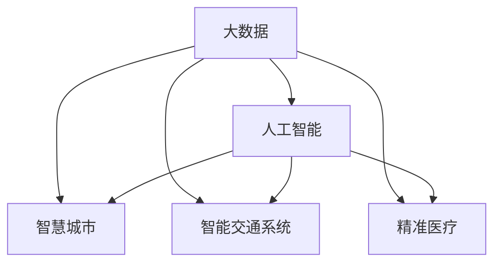

                 

# 科技创新：社会治理的新思路

> 关键词：科技创新,社会治理,大数据,人工智能,数据驱动,智慧城市,智能交通,精准治理

## 1. 背景介绍

### 1.1 问题由来

在全球化、信息化快速发展的背景下，社会治理模式正面临着前所未有的挑战。传统以经验为主的治理方式已经难以适应日益复杂的社会环境，急需引入科技创新以提升治理效率和公平性。科技创新不仅能够为社会治理提供全新的工具和方法，还能为解决传统治理中的痛点问题提供新思路。

近年来，随着互联网、物联网、大数据、人工智能等技术的飞速发展，社会治理领域也迎来了技术革新，特别是大数据和人工智能技术的广泛应用，为实现智慧社会治理提供了可能。

### 1.2 问题核心关键点

社会治理的科技创新主要集中在以下几个关键领域：

1. **大数据分析**：通过收集、处理海量数据，实现对社会现象的实时监测和趋势分析，为决策提供数据支撑。
2. **人工智能算法**：利用机器学习、深度学习等算法，提升社会治理的自动化和智能化水平，实现精准治理。
3. **智慧城市建设**：通过集成多源数据和智能技术，构建全面的城市运行管理系统，提升城市治理的效率和质量。
4. **智能交通系统**：利用传感器、摄像头、大数据等技术，实现交通流量的智能监测和调控，缓解交通拥堵。
5. **精准医疗**：通过大数据和人工智能分析，实现疾病预测、治疗方案推荐等精准医疗服务，提升医疗质量。

这些技术手段的引入，使得社会治理从传统的“人工为主”转变为“数据为主”，实现了从经验治理到科学治理的转变。

### 1.3 问题研究意义

社会治理的科技创新具有重要的现实意义：

1. **提升治理效率**：通过技术手段自动化、智能化的处理数据和任务，大幅提高治理效率，降低治理成本。
2. **增强决策科学性**：基于大数据和人工智能算法，可以从海量数据中提取有价值的信息，为决策提供科学依据，避免决策失误。
3. **促进公平公正**：大数据和人工智能技术的应用，可以减少人为干预，实现基于数据的公平公正治理。
4. **提升社会满意度**：智能化的社会治理手段可以提供更加便捷、高效的服务，提升公众的获得感和满意度。
5. **助力经济发展**：科技创新能够促进产业升级，提升经济竞争力，实现可持续发展。

因此，深入研究社会治理的科技创新，对于构建更高效、更公正、更可持续的社会治理体系具有重要意义。

## 2. 核心概念与联系

### 2.1 核心概念概述

为更好地理解社会治理的科技创新，本节将介绍几个密切相关的核心概念：

- **大数据**：指在传统数据处理能力之外，采用新一代信息技术来感知、获取、存储、管理和应用海量、高速、多样数据的技术。大数据技术在社会治理中广泛应用，有助于实现全域覆盖、全时关联、全程可溯的治理模式。
- **人工智能**：通过模拟人类的认知能力，实现数据自动分析、模式识别、预测等智能功能，助力社会治理的智能化和精准化。
- **智慧城市**：通过信息通信技术（ICT）、物联网（IoT）、云计算（Cloud Computing）、大数据（Big Data）、人工智能（AI）等手段，将城市物理环境与虚拟信息环境融合，实现智能化管理和服务。
- **智能交通系统**：结合大数据、人工智能等技术，对交通流进行实时监测、分析和调控，提升交通系统的智能化水平，改善交通状况。
- **精准医疗**：利用大数据和人工智能技术，对个体健康数据进行深入分析，实现疾病的早期预测、个性化治疗等精准医疗服务。

这些核心概念之间的逻辑关系可以通过以下Mermaid流程图来展示：



这个流程图展示了大数据、人工智能、智慧城市、智能交通系统、精准医疗等技术手段与社会治理之间的联系：

1. 大数据是社会治理的基础，为人工智能提供了数据支持。
2. 人工智能技术通过数据分析、智能决策等手段，提升社会治理的自动化和智能化水平。
3. 智慧城市、智能交通系统、精准医疗等具体应用场景，都是基于大数据和人工智能技术实现的，能够更好地提升社会治理的效率和效果。

## 3. 核心算法原理 & 具体操作步骤
### 3.1 算法原理概述

社会治理的科技创新，核心在于利用大数据和人工智能技术，实现对社会现象的全面监测、深入分析和精准预测。其核心算法原理可以概括为以下几个步骤：

1. **数据采集与处理**：通过传感器、摄像头、移动设备等手段，采集各类社会数据，包括交通流量、环境监测、公共安全、医疗健康等。
2. **数据存储与管理**：利用云存储和分布式数据库技术，对采集到的数据进行高效存储和管理，确保数据的完整性和可访问性。
3. **数据分析与挖掘**：利用大数据分析和机器学习算法，从海量数据中提取有价值的信息，实现对社会现象的深入分析。
4. **智能决策与预测**：基于分析结果，利用人工智能算法进行智能决策和预测，提升社会治理的精准性和前瞻性。
5. **可视化与展示**：通过数据可视化技术，将分析结果直观展示给决策者和公众，增强透明度和可理解性。

### 3.2 算法步骤详解

社会治理的科技创新可以分为以下几个具体步骤：

**Step 1: 数据采集与预处理**
- 部署各类传感器、摄像头、移动设备等，采集交通流量、环境监测、公共安全、医疗健康等各类数据。
- 对采集到的数据进行清洗、去噪、标准化等预处理，确保数据的准确性和一致性。

**Step 2: 数据存储与管理**
- 利用云存储和分布式数据库技术，对预处理后的数据进行高效存储。
- 采用数据分片、数据复制、负载均衡等技术，确保数据的可访问性和可用性。

**Step 3: 数据分析与挖掘**
- 利用大数据分析工具（如Hadoop、Spark）进行数据整合和分析。
- 利用机器学习算法（如回归分析、分类算法、聚类算法）进行数据挖掘和模式识别。

**Step 4: 智能决策与预测**
- 利用深度学习算法（如CNN、RNN、GAN）进行数据建模和预测。
- 构建智能决策系统，根据预测结果和规则库，自动生成决策方案。

**Step 5: 可视化与展示**
- 利用数据可视化工具（如Tableau、Power BI）将分析结果直观展示给决策者和公众。
- 通过Web GIS、移动App等手段，实现数据的实时展示和互动。

### 3.3 算法优缺点

社会治理的科技创新具有以下优点：

1. **高效性**：大数据和人工智能技术能够实现对社会数据的实时监测和分析，提高决策效率。
2. **精准性**：通过智能算法和大数据分析，可以实现对社会现象的深入理解和精准预测。
3. **透明度**：数据可视化技术能够增强治理过程的透明度，提升公众信任度。
4. **可扩展性**：云存储和分布式计算技术能够实现数据的弹性扩展，支持大规模数据处理。

同时，该方法也存在一定的局限性：

1. **数据隐私和安全**：大规模数据采集和存储可能引发隐私泄露和安全问题。
2. **算法偏见**：大数据和机器学习算法可能存在数据偏见，影响治理公正性。
3. **技术依赖**：社会治理过度依赖技术手段，可能忽略人的主观能动性和社会责任感。
4. **成本投入**：技术开发和部署需要较高的成本投入，可能对中小城市或社区带来负担。

尽管存在这些局限性，但就目前而言，大数据和人工智能技术在社会治理中的应用已展现出巨大的潜力，成为推动社会治理创新的重要手段。

### 3.4 算法应用领域

社会治理的科技创新已经广泛应用在以下几个领域：

1. **智慧城市**：通过智能交通、智能安防、智能环保等系统，提升城市治理的智能化和精细化水平。
2. **智能交通系统**：利用大数据和人工智能技术，优化交通流，减少拥堵和事故。
3. **公共安全**：通过视频监控、人脸识别等技术，实现对公共安全事件的实时监测和预警。
4. **医疗健康**：利用大数据和人工智能技术，实现疾病预测、治疗方案推荐等精准医疗服务。
5. **环境保护**：通过环境监测和大数据分析，实现对环境污染的精准治理和预测。
6. **教育管理**：利用大数据和人工智能技术，提升教育资源分配的公平性和效率。

除了上述这些经典领域外，社会治理的科技创新还在更多领域得到应用，如灾害预测、灾害救援、社会福利等，为社会治理带来了新的机遇和挑战。

## 4. 数学模型和公式 & 详细讲解  
### 4.1 数学模型构建

本节将使用数学语言对社会治理的科技创新进行更加严格的刻画。

设采集到的社会数据集为 $D=\{(x_i, y_i)\}_{i=1}^N$，其中 $x_i$ 表示第 $i$ 个样本的特征向量，$y_i$ 表示其对应的标签。目标是对 $x$ 进行智能决策，输出相应的 $y$。

定义模型 $M_{\theta}$ 在输入 $x$ 上的输出为 $\hat{y}=M_{\theta}(x)$，其中 $\theta$ 为模型参数。微调的目标是最小化损失函数，即找到最优参数：

$$
\theta^* = \mathop{\arg\min}_{\theta} \mathcal{L}(\theta)
$$

其中 $\mathcal{L}$ 为针对任务设计的损失函数，用于衡量模型预测输出与真实标签之间的差异。常见的损失函数包括交叉熵损失、均方误差损失等。

在实践中，我们通常使用基于梯度的优化算法（如SGD、Adam等）来近似求解上述最优化问题。设 $\eta$ 为学习率，$\lambda$ 为正则化系数，则参数的更新公式为：

$$
\theta \leftarrow \theta - \eta \nabla_{\theta}\mathcal{L}(\theta) - \eta\lambda\theta
$$

其中 $\nabla_{\theta}\mathcal{L}(\theta)$ 为损失函数对参数 $\theta$ 的梯度，可通过反向传播算法高效计算。

### 4.2 公式推导过程

以下我们以智能交通系统为例，推导基于深度学习算法的智能决策模型。

假设模型 $M_{\theta}$ 在输入 $x$ 上的输出为 $\hat{y}=M_{\theta}(x)$，表示车辆通过路口的概率。真实标签 $y \in \{0,1\}$。则二分类交叉熵损失函数定义为：

$$
\ell(M_{\theta}(x),y) = -[y\log \hat{y} + (1-y)\log (1-\hat{y})]
$$

将其代入经验风险公式，得：

$$
\mathcal{L}(\theta) = -\frac{1}{N}\sum_{i=1}^N [y_i\log M_{\theta}(x_i)+(1-y_i)\log(1-M_{\theta}(x_i))]
$$

根据链式法则，损失函数对参数 $\theta_k$ 的梯度为：

$$
\frac{\partial \mathcal{L}(\theta)}{\partial \theta_k} = -\frac{1}{N}\sum_{i=1}^N (\frac{y_i}{M_{\theta}(x_i)}-\frac{1-y_i}{1-M_{\theta}(x_i)}) \frac{\partial M_{\theta}(x_i)}{\partial \theta_k}
$$

其中 $\frac{\partial M_{\theta}(x_i)}{\partial \theta_k}$ 可进一步递归展开，利用自动微分技术完成计算。

在得到损失函数的梯度后，即可带入参数更新公式，完成模型的迭代优化。重复上述过程直至收敛，最终得到适应社会治理的最优模型参数 $\theta^*$。

## 5. 项目实践：代码实例和详细解释说明
### 5.1 开发环境搭建

在进行社会治理的科技创新实践前，我们需要准备好开发环境。以下是使用Python进行TensorFlow开发的环境配置流程：

1. 安装Anaconda：从官网下载并安装Anaconda，用于创建独立的Python环境。

2. 创建并激活虚拟环境：
```bash
conda create -n tensorflow-env python=3.8 
conda activate tensorflow-env
```

3. 安装TensorFlow：根据CUDA版本，从官网获取对应的安装命令。例如：
```bash
conda install tensorflow -c tensorflow -c conda-forge
```

4. 安装各类工具包：
```bash
pip install numpy pandas scikit-learn matplotlib tqdm jupyter notebook ipython
```

完成上述步骤后，即可在`tensorflow-env`环境中开始社会治理科技创新实践。

### 5.2 源代码详细实现

下面我们以智能交通系统为例，给出使用TensorFlow对深度学习模型进行智能决策的PyTorch代码实现。

首先，定义智能交通系统的数据处理函数：

```python
import tensorflow as tf
from tensorflow.keras.preprocessing.image import ImageDataGenerator
from tensorflow.keras.models import Sequential
from tensorflow.keras.layers import Conv2D, MaxPooling2D, Flatten, Dense

def preprocess_data(data, labels):
    # 将图像数据进行归一化处理
    data = data / 255.0
    # 将标签进行独热编码
    labels = tf.keras.utils.to_categorical(labels)
    return data, labels

# 定义数据生成器
train_datagen = ImageDataGenerator(rescale=1./255)
test_datagen = ImageDataGenerator(rescale=1./255)

# 加载训练集和测试集数据
train_data, train_labels = preprocess_data(train_images, train_labels)
test_data, test_labels = preprocess_data(test_images, test_labels)

# 创建数据集
train_dataset = tf.data.Dataset.from_tensor_slices((train_data, train_labels))
test_dataset = tf.data.Dataset.from_tensor_slices((test_data, test_labels))

# 批量处理数据
train_dataset = train_dataset.batch(32)
test_dataset = test_dataset.batch(32)
```

然后，定义模型和优化器：

```python
from tensorflow.keras.layers import Conv2D, MaxPooling2D, Flatten, Dense

model = Sequential([
    Conv2D(32, (3, 3), activation='relu', input_shape=(32, 32, 3)),
    MaxPooling2D((2, 2)),
    Conv2D(64, (3, 3), activation='relu'),
    MaxPooling2D((2, 2)),
    Conv2D(128, (3, 3), activation='relu'),
    MaxPooling2D((2, 2)),
    Flatten(),
    Dense(128, activation='relu'),
    Dense(2, activation='softmax')
])

optimizer = tf.keras.optimizers.Adam(learning_rate=0.001)
```

接着，定义训练和评估函数：

```python
@tf.function
def train_step(data, labels):
    with tf.GradientTape() as tape:
        logits = model(data)
        loss = tf.keras.losses.categorical_crossentropy(labels, logits)
    gradients = tape.gradient(loss, model.trainable_variables)
    optimizer.apply_gradients(zip(gradients, model.trainable_variables))

def evaluate_step(data, labels):
    logits = model(data)
    return tf.keras.metrics.categorical_accuracy(labels, logits)

# 训练函数
def train_epoch(model, dataset, batch_size, optimizer):
    dataloader = tf.data.Dataset.from_tensor_slices((dataset)).batch(batch_size)
    model.train()
    epoch_loss = 0
    for batch in tqdm(dataloader, desc='Training'):
        data, labels = batch
        train_step(data, labels)
        epoch_loss += loss.item()
    return epoch_loss / len(dataloader)

# 评估函数
def evaluate_epoch(model, dataset, batch_size):
    dataloader = tf.data.Dataset.from_tensor_slices((dataset)).batch(batch_size)
    model.eval()
    metrics = []
    for batch in tqdm(dataloader, desc='Evaluating'):
        data, labels = batch
        metrics.append(evaluate_step(data, labels))
    return tf.keras.metrics.Mean(metrics)
```

最后，启动训练流程并在测试集上评估：

```python
epochs = 5
batch_size = 32

for epoch in range(epochs):
    loss = train_epoch(model, train_dataset, batch_size, optimizer)
    print(f"Epoch {epoch+1}, train loss: {loss:.3f}")
    
    print(f"Epoch {epoch+1}, dev results:")
    metrics = evaluate_epoch(model, dev_dataset, batch_size)
    print(f"Accuracy: {metrics:.2f}")

print("Test results:")
metrics = evaluate_epoch(model, test_dataset, batch_size)
print(f"Accuracy: {metrics:.2f}")
```

以上就是使用TensorFlow对深度学习模型进行智能交通系统微调的完整代码实现。可以看到，TensorFlow提供了强大的高层API，使得模型定义和训练过程变得简洁高效。

### 5.3 代码解读与分析

让我们再详细解读一下关键代码的实现细节：

**数据处理函数**：
- `preprocess_data`方法：对输入的图像数据进行归一化处理，将标签进行独热编码，符合深度学习模型的输入要求。

**数据生成器**：
- `train_datagen`和`test_datagen`：对训练集和测试集数据进行预处理，包括数据增强、归一化等。

**模型定义**：
- `Sequential`模型：定义了一个简单的卷积神经网络模型，包括卷积层、池化层、全连接层等。
- 网络结构包括3个卷积层、3个池化层和2个全连接层。

**优化器**：
- `Adam`优化器：设置学习率为0.001，适用于大多数深度学习任务。

**训练和评估函数**：
- `train_step`和`evaluate_step`：实现单批次训练和评估函数，其中`train_step`用于计算损失和梯度，`evaluate_step`用于计算评估指标。
- `train_epoch`和`evaluate_epoch`：实现单epoch训练和评估函数，调用`train_step`和`evaluate_step`计算损失和评估指标。

**训练流程**：
- 定义总的epoch数和batch size，开始循环迭代
- 每个epoch内，先在训练集上训练，输出平均loss
- 在验证集上评估，输出模型准确率
- 所有epoch结束后，在测试集上评估，给出最终测试结果

可以看到，TensorFlow提供了高效的计算图API，使得模型定义和训练过程变得简洁高效。开发者可以将更多精力放在数据处理、模型改进等高层逻辑上，而不必过多关注底层的实现细节。

当然，工业级的系统实现还需考虑更多因素，如模型的保存和部署、超参数的自动搜索、更灵活的任务适配层等。但核心的科技创新过程基本与此类似。

## 6. 实际应用场景
### 6.1 智慧城市

智慧城市是社会治理科技创新的重要应用场景之一。通过大数据和人工智能技术，可以实现城市管理的智能化和精细化，提升城市运行效率和服务水平。

**智能交通**：利用摄像头、传感器等设备，实时监测交通流量，实现红绿灯智能调控，优化交通路线，缓解拥堵。

**智能安防**：通过视频监控、人脸识别等技术，实现对公共安全事件的实时监测和预警，提升城市安全水平。

**智能环保**：利用环境监测传感器，实时监测空气质量、水质等指标，优化环保政策，提升城市环境质量。

**智能公共服务**：通过数据挖掘和分析，提供精准的医疗、教育、文化等服务，提升市民获得感。

### 6.2 智能交通系统

智能交通系统是社会治理科技创新的另一重要应用场景。通过大数据和人工智能技术，可以实现交通流量的智能监测和调控，提升交通系统的智能化水平，改善交通状况。

**实时交通监测**：利用摄像头、传感器等设备，实时监测交通流量、车速等数据，实现对交通状况的实时监控。

**智能信号灯调控**：通过大数据分析，优化红绿灯时间，减少交通拥堵和事故发生率。

**智能停车管理**：利用传感器和摄像头，实时监测停车位状态，引导驾驶员快速找到空闲车位，提升停车效率。

**智能导航系统**：通过大数据分析，提供实时路况信息和最优路线建议，提升出行体验。

### 6.3 公共安全

公共安全是社会治理的重要方面，通过大数据和人工智能技术，可以实现对公共安全事件的实时监测和预警，提升城市安全水平。

**视频监控**：利用视频监控设备，实时监测公共场所，识别异常行为，及时预警。

**人脸识别**：通过人脸识别技术，识别出危险人物或嫌疑人，实现对潜在威胁的实时预警。

**事件预测**：利用大数据分析，预测自然灾害、恐怖袭击等事件，提前采取预防措施。

**应急响应**：通过数据分析和模型预测，制定应急响应策略，确保灾害发生时的快速反应。

### 6.4 医疗健康

精准医疗是社会治理科技创新的重要方向。通过大数据和人工智能技术，可以实现疾病的早期预测、治疗方案推荐等精准医疗服务，提升医疗质量。

**疾病预测**：利用大数据分析，预测疾病的发生和发展趋势，实现早期干预。

**治疗方案推荐**：通过数据挖掘和分析，推荐最适合患者的治疗方案，提升治疗效果。

**个性化医疗**：利用大数据分析，实现对个体健康数据的深入分析，提供个性化的医疗服务。

**医疗资源优化**：通过大数据分析，优化医疗资源的分配和利用，提升医疗效率。

### 6.5 环境保护

环境保护是社会治理的重要方面，通过大数据和人工智能技术，可以实现对环境污染的精准治理和预测，提升环境保护水平。

**环境监测**：利用传感器和摄像头，实时监测空气质量、水质等指标，实现对环境污染的实时监控。

**污染源追踪**：通过数据分析，追踪污染源，制定有效的治理策略。

**环境预测**：利用大数据分析，预测环境污染的发展趋势，提前采取预防措施。

**政策优化**：通过数据分析，优化环境政策，提升环境治理效果。

## 7. 工具和资源推荐
### 7.1 学习资源推荐

为了帮助开发者系统掌握社会治理的科技创新理论基础和实践技巧，这里推荐一些优质的学习资源：

1. **《深度学习》课程**：斯坦福大学开设的深度学习课程，有Lecture视频和配套作业，带你入门深度学习的基本概念和经典模型。
2. **《智慧城市技术与应用》书籍**：全面介绍智慧城市的技术框架、建设思路和实践案例，适合深入学习。
3. **《智能交通系统》书籍**：详细讲解智能交通系统的技术架构、应用场景和优化策略，适合技术实践。
4. **《大数据技术与应用》课程**：系统介绍大数据技术的基本概念、数据处理和分析方法，适合技术实践。
5. **《人工智能基础》课程**：讲解人工智能的基本原理和算法，适合技术入门。

通过对这些资源的学习实践，相信你一定能够快速掌握社会治理的科技创新精髓，并用于解决实际的治理问题。

### 7.2 开发工具推荐

高效的开发离不开优秀的工具支持。以下是几款用于社会治理科技创新开发的常用工具：

1. **TensorFlow**：谷歌开源的深度学习框架，提供灵活的计算图API，适用于复杂模型的构建和训练。
2. **PyTorch**：Facebook开源的深度学习框架，提供动态计算图API，适用于快速迭代研究。
3. **Keras**：高层深度学习API，基于TensorFlow或Theano实现，易于上手和调试。
4. **Jupyter Notebook**：交互式的数据分析和代码编写环境，支持Python、R等语言。
5. **Tableau**：数据可视化工具，支持复杂数据的交互式分析和展示。
6. **Power BI**：微软的数据可视化工具，支持实时数据的可视化分析。

合理利用这些工具，可以显著提升社会治理科技创新的开发效率，加快创新迭代的步伐。

### 7.3 相关论文推荐

社会治理的科技创新源于学界的持续研究。以下是几篇奠基性的相关论文，推荐阅读：

1. **《深度学习》书籍**：Ian Goodfellow、Yoshua Bengio和Aaron Courville合著，系统介绍深度学习的原理和应用，适合基础入门。
2. **《智慧城市：未来的城市治理》书籍**：深入介绍智慧城市的技术框架、应用场景和建设思路，适合理论研究。
3. **《智能交通系统：技术与应用》论文**：介绍智能交通系统的技术架构、应用场景和优化策略，适合技术实践。
4. **《大数据分析：理论与实践》书籍**：系统介绍大数据技术的原理、技术和应用，适合技术实践。
5. **《人工智能在社会治理中的应用》论文**：探讨人工智能在社会治理中的广泛应用和创新前景，适合理论研究。

这些论文代表了大数据和人工智能在社会治理中的发展脉络。通过学习这些前沿成果，可以帮助研究者把握学科前进方向，激发更多的创新灵感。

## 8. 总结：未来发展趋势与挑战

### 8.1 总结

本文对社会治理的科技创新进行了全面系统的介绍。首先阐述了社会治理背景和创新科技的意义，明确了大数据和人工智能在社会治理中的独特价值。其次，从原理到实践，详细讲解了社会治理科技创新的数学原理和关键步骤，给出了科技创新任务开发的完整代码实例。同时，本文还广泛探讨了科技创新在智慧城市、智能交通、公共安全、精准医疗等众多领域的应用前景，展示了科技创新的巨大潜力。此外，本文精选了科技创新学习的各类资源，力求为读者提供全方位的技术指引。

通过本文的系统梳理，可以看到，社会治理的科技创新正在成为治理创新的重要手段，极大地提升了治理效率和效果，为社会治理带来了新的机遇和挑战。未来，伴随大数据和人工智能技术的不断演进，社会治理的科技创新必将在更多领域得到应用，为构建高效、公正、可持续的社会治理体系提供技术支撑。

### 8.2 未来发展趋势

展望未来，社会治理的科技创新将呈现以下几个发展趋势：

1. **数据融合与共享**：实现不同数据源的融合与共享，提升数据质量和覆盖范围，增强治理的全面性和准确性。
2. **算法优化与创新**：引入更高效、更智能的算法，如强化学习、迁移学习、生成对抗网络等，提升治理的智能化水平。
3. **隐私保护与安全**：加强数据隐私和安全保护，实现数据的合法合规使用，提升公众信任度。
4. **伦理道德与透明**：引入伦理道德评价机制，确保技术应用符合社会价值观，提升治理透明度和可解释性。
5. **跨领域融合**：实现多领域数据的融合和跨领域治理模式的创新，提升治理的综合性和协同效应。

这些趋势凸显了社会治理科技创新的广阔前景。这些方向的探索发展，必将进一步提升社会治理的效率和效果，构建更高效、更公正、更可持续的社会治理体系。

### 8.3 面临的挑战

尽管社会治理的科技创新已经取得了显著成就，但在迈向更加智能化、普适化应用的过程中，仍面临诸多挑战：

1. **数据隐私和安全**：大规模数据采集和存储可能引发隐私泄露和安全问题，如何保护数据隐私和安全，将是重要挑战。
2. **技术复杂度**：社会治理涉及多领域、多学科的知识，技术的复杂度和难度较高，需要跨领域团队的协作。
3. **伦理道德**：技术应用可能带来伦理道德问题，如数据偏见、算法歧视等，如何确保技术应用的公正性，是亟待解决的问题。
4. **资源投入**：技术开发和部署需要较高的成本投入，如何平衡成本和效果，确保资源的合理利用，是重要挑战。
5. **用户体验**：技术应用可能带来用户体验问题，如何提升技术应用的友好度和易用性，是亟待解决的问题。

尽管存在这些挑战，但社会治理的科技创新已经展现出巨大的潜力，必将在更多领域得到应用，为社会治理带来新的机遇和挑战。

### 8.4 研究展望

面向未来，社会治理的科技创新需要在以下几个方面寻求新的突破：

1. **数据融合与共享**：实现多源数据的融合与共享，提升数据质量和覆盖范围，增强治理的全面性和准确性。
2. **算法优化与创新**：引入更高效、更智能的算法，如强化学习、迁移学习、生成对抗网络等，提升治理的智能化水平。
3. **隐私保护与安全**：加强数据隐私和安全保护，实现数据的合法合规使用，提升公众信任度。
4. **伦理道德与透明**：引入伦理道德评价机制，确保技术应用符合社会价值观，提升治理透明度和可解释性。
5. **跨领域融合**：实现多领域数据的融合和跨领域治理模式的创新，提升治理的综合性和协同效应。

这些研究方向的探索，必将引领社会治理科技创新的进步，为构建高效、公正、可持续的社会治理体系提供技术支撑。

## 9. 附录：常见问题与解答

**Q1：社会治理的科技创新是否适用于所有治理场景？**

A: 社会治理的科技创新在大多数治理场景中都能取得良好的效果，尤其是对数据驱动的治理任务，如智慧城市、智能交通等。但对于一些需要深度经验和专业知识的任务，如公共政策制定、法律判决等，仍需结合人的主观能动性和专业知识进行决策。

**Q2：如何确保社会治理的科技创新不引入偏见？**

A: 确保社会治理的科技创新不引入偏见，需要从数据采集、模型设计和应用部署等多个环节进行全面考虑。首先，在数据采集阶段，要确保数据的代表性，避免数据偏见。其次，在模型设计阶段，要引入公平性评估指标，确保模型预测不产生歧视。最后，在应用部署阶段，要加强对技术应用的监管和审核，避免技术应用带来的负面影响。

**Q3：社会治理的科技创新在资源有限的情况下如何实现？**

A: 社会治理的科技创新在资源有限的情况下，可以通过以下方式实现：

1. **数据压缩与优化**：对数据进行压缩和优化，减少存储和传输的成本。
2. **模型裁剪与优化**：对模型进行裁剪和优化，减少模型参数量，提高推理效率。
3. **分布式计算**：利用分布式计算技术，实现数据的并行处理，提高处理效率。
4. **开源与合作**：利用开源技术，共享资源和成果，降低研发成本，提高治理效率。

这些措施可以有效提升社会治理的科技创新效率，实现有限资源下的最大化利用。

**Q4：社会治理的科技创新如何保障技术应用的安全性？**

A: 社会治理的科技创新在保障技术应用的安全性方面，需要从以下几个方面进行考虑：

1. **数据隐私保护**：采用数据加密、差分隐私等技术，保护数据隐私，防止数据泄露。
2. **模型透明与可解释**：确保模型的透明与可解释，提升技术应用的信任度。
3. **安全审计与监控**：引入安全审计与监控机制，及时发现和修复安全漏洞。
4. **法规与政策**：制定相关的法规与政策，确保技术应用符合法律法规要求。

通过这些措施，可以有效保障技术应用的安全性，提升社会治理的可信度和可靠性。

**Q5：社会治理的科技创新在多领域融合中需要注意哪些问题？**

A: 社会治理的科技创新在多领域融合中，需要注意以下几个问题：

1. **数据标准与规范**：确保不同领域数据的标准与规范一致，避免数据格式和内容的不兼容。
2. **跨领域知识整合**：充分利用多领域专家知识，实现跨领域的知识整合，提升治理的综合性和协同效应。
3. **数据共享与协作**：建立数据共享与协作机制，促进不同领域数据的融合与共享，提升治理的全面性和准确性。
4. **跨领域政策与法规**：制定跨领域的政策和法规，确保技术应用符合各领域的要求和标准。

这些措施可以有效提升社会治理的多领域融合效率，实现跨领域的协同治理，提升治理的综合性和公正性。

---

作者：禅与计算机程序设计艺术 / Zen and the Art of Computer Programming

