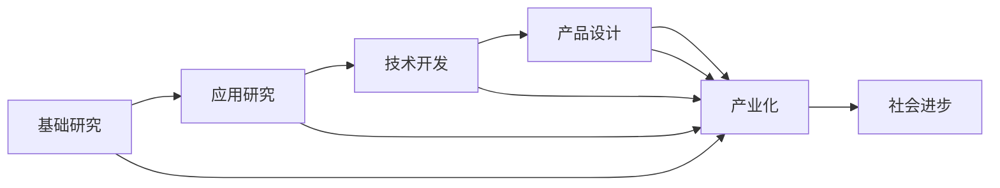

                 

# 科技创新：社会进步的阶梯

> 关键词：科技创新,社会进步,科技前沿,产业升级,数字化转型

## 1. 背景介绍

### 1.1 问题由来
科技创新是推动社会进步的根本动力。从古代的机械工具到现代的互联网、人工智能，每一次技术的突破都引领了人类社会的发展新纪元。当前，世界正处于科技创新的关键时期，新技术、新业态、新模式层出不穷，深刻影响着经济社会发展。

科技创新不仅能够提高生产力，推动经济增长，还能够解决环境、教育、医疗等方面的社会问题，提升人民生活质量。因此，把握科技创新趋势，推动科技成果转化，是实现可持续发展和社会进步的重要任务。

### 1.2 问题核心关键点
本文将探讨科技创新的内涵、机制、路径及其实际应用，旨在为科技工作者的实践和研究提供理论指导和实践参考，推动科技创新与社会的深度融合。

## 2. 核心概念与联系

### 2.1 核心概念概述

科技创新是指通过科学研究和技术开发，创造新的科技成果，推动技术进步和社会发展。其核心在于将科学研究和技术开发转化为现实生产力，解决实际问题，提升社会福祉。

科技创新涉及多个方面，包括基础研究、应用研究、技术开发、产品设计和产业化等。这些环节互相影响，共同推动科技创新的全过程。

### 2.2 核心概念原理和架构的 Mermaid 流程图(Mermaid 流程节点中不要有括号、逗号等特殊字符)


该流程图展示了科技创新从基础研究到产业化，再到社会进步的全过程。其中，基础研究提供理论支撑，应用研究将理论转化为技术，技术开发实现技术产业化，产品设计提升技术应用效果，最终推动社会进步。

## 3. 核心算法原理 & 具体操作步骤
### 3.1 算法原理概述

科技创新是一个复杂的过程，涉及科学研究的探索、技术的转化、产业的培育和社会应用等多个环节。本文将从科学研究、技术开发和社会应用三个方面，分别阐述其算法原理和操作步骤。

### 3.2 算法步骤详解

#### 3.2.1 科学研究

科学研究是科技创新的基础。其主要目标是揭示自然规律，提出新理论和新方法。科学研究的过程一般包括提出假设、设计实验、收集数据、分析结果和验证假设等步骤。

1. **提出假设**：科学家通过观察和思考，提出可能解决问题的假设。假设可以是理论性的，也可以是实验性的。

2. **设计实验**：根据假设，设计相应的实验方案，明确实验步骤、实验器材和实验控制。

3. **收集数据**：按照实验方案，进行数据采集和处理。数据可以是实验结果、统计数据或理论推导结果。

4. **分析结果**：使用统计学和数学方法，对收集到的数据进行分析，验证假设是否成立。

5. **验证假设**：通过实验验证假设的正确性，提出新的理论和观点。

#### 3.2.2 技术开发

技术开发是将科学研究转化为实际应用的关键环节。其主要目标是实现科学研究成果的产业化，开发出可用的技术和产品。技术开发的过程一般包括技术设计、原型开发、测试优化和生产应用等步骤。

1. **技术设计**：根据科学研究成果，设计技术方案和产品原型。

2. **原型开发**：通过实验和模拟，开发技术原型或产品原型，验证技术可行性和产品性能。

3. **测试优化**：对技术原型或产品原型进行测试，发现问题并优化设计。

4. **生产应用**：将优化后的技术或产品投入实际应用，实现产业化。

#### 3.2.3 社会应用

社会应用是将技术转化为社会福祉的重要环节。其主要目标是解决实际问题，提升社会效益。社会应用的过程一般包括需求分析、技术推广、效果评估和社会反馈等步骤。

1. **需求分析**：通过调研和分析，确定社会应用的需求和目标。

2. **技术推广**：在社会应用中推广技术，提高技术的应用范围和影响力。

3. **效果评估**：对技术应用的效果进行评估，发现问题并改进技术。

4. **社会反馈**：收集社会反馈，调整技术应用策略，提升技术效益。

### 3.3 算法优缺点

#### 3.3.1 科学研究

**优点**：科学研究能够揭示自然规律，推动技术进步，为社会进步提供理论支撑。

**缺点**：科学研究周期长，投入大，成果转化慢。

#### 3.3.2 技术开发

**优点**：技术开发能够将科学研究转化为实际应用，实现产业化，提高社会效益。

**缺点**：技术开发风险高，投入大，失败率高。

#### 3.3.3 社会应用

**优点**：社会应用能够解决实际问题，提升社会福祉，推动社会进步。

**缺点**：社会应用受多种因素影响，效果难以控制。

### 3.4 算法应用领域

科技创新应用于各个领域，包括但不限于以下几个方面：

1. **信息技术**：人工智能、大数据、云计算等技术，推动数字化转型，提升信息处理效率。

2. **生物技术**：基因编辑、生物工程等技术，推动医疗健康领域的发展，提高人民健康水平。

3. **材料科学**：新材料、新能源等技术，推动环保和能源领域的发展，减少环境污染。

4. **制造技术**：智能制造、机器人等技术，推动工业升级，提高生产效率。

5. **交通运输**：无人驾驶、新能源车等技术，推动交通领域的发展，提高出行效率。

## 4. 数学模型和公式 & 详细讲解 & 举例说明

### 4.1 数学模型构建

科技创新涉及多个领域的数学模型，这里以信息技术为例，介绍常见的数学模型构建方法。

#### 4.1.1 人工智能

人工智能的数学模型主要包括深度学习、强化学习和自然语言处理等。深度学习模型通过多层神经网络，实现特征提取和模式识别；强化学习模型通过优化决策策略，实现智能控制；自然语言处理模型通过语言模型和上下文模型，实现语义理解和生成。

#### 4.1.2 大数据

大数据的数学模型主要包括数据挖掘、数据可视化和数据流分析等。数据挖掘模型通过聚类、分类、关联分析等方法，发现数据中的规律；数据可视化模型通过图表和可视化工具，展示数据特征；数据流分析模型通过实时处理，实现数据流预测和控制。

#### 4.1.3 云计算

云计算的数学模型主要包括分布式计算、云存储和云服务等。分布式计算模型通过多台计算机协同工作，实现并行计算和任务调度；云存储模型通过分布式存储和数据备份，提高数据安全性和可用性；云服务模型通过弹性计算和负载均衡，实现资源优化和成本控制。

### 4.2 公式推导过程

#### 4.2.1 深度学习模型

深度学习模型包括卷积神经网络(CNN)、循环神经网络(RNN)和深度神经网络(DNN)等。以CNN模型为例，其数学模型可以表示为：

$$
f(x) = W_1 \cdot g_1(W_2 \cdot g_2(...(W_n \cdot g_n(x)...))
$$

其中，$W_i$ 为权重矩阵，$g_i$ 为激活函数，$x$ 为输入数据。

#### 4.2.2 强化学习模型

强化学习模型包括Q-learning、策略梯度等。以Q-learning为例，其数学模型可以表示为：

$$
Q(s_t, a_t) = Q(s_t, a_t) + \alpha [r_{t+1} + \gamma \max_{a_{t+1}} Q(s_{t+1}, a_{t+1}) - Q(s_t, a_t)]
$$

其中，$s_t$ 为状态，$a_t$ 为动作，$r_{t+1}$ 为奖励，$\gamma$ 为折扣因子，$\alpha$ 为学习率。

#### 4.2.3 自然语言处理模型

自然语言处理模型包括语言模型、上下文模型等。以语言模型为例，其数学模型可以表示为：

$$
P(w_1,...,w_n|x) = \prod_{i=1}^{n} P(w_i|w_{i-1}, ..., w_1)
$$

其中，$w_i$ 为单词，$x$ 为输入文本。

### 4.3 案例分析与讲解

#### 4.3.1 人工智能

以图像识别为例，深度学习模型可以通过卷积神经网络(CNN)实现图像特征提取和分类。具体步骤如下：

1. **数据准备**：收集并预处理图像数据，将其转化为数值矩阵。

2. **模型构建**：构建CNN模型，包括卷积层、池化层和全连接层等。

3. **训练模型**：使用训练数据集对模型进行训练，优化权重和偏置。

4. **测试模型**：使用测试数据集对模型进行测试，评估模型性能。

#### 4.3.2 大数据

以推荐系统为例，大数据模型可以通过协同过滤、基于内容的推荐等方法实现推荐。具体步骤如下：

1. **数据收集**：收集用户行为数据和物品属性数据。

2. **模型构建**：构建推荐模型，包括矩阵分解、用户相似度计算等。

3. **训练模型**：使用历史数据对模型进行训练，优化推荐算法。

4. **测试模型**：使用测试数据集对模型进行测试，评估推荐效果。

#### 4.3.3 云计算

以云存储为例，云计算模型可以通过分布式存储和数据备份实现数据安全性和可用性。具体步骤如下：

1. **数据备份**：将数据备份到多个节点，防止单点故障。

2. **数据同步**：实时同步数据，确保数据一致性。

3. **数据恢复**：在数据丢失或损坏时，从备份中恢复数据。

4. **负载均衡**：通过负载均衡，实现资源优化和成本控制。

## 5. 项目实践：代码实例和详细解释说明

### 5.1 开发环境搭建

在开发科技创新相关项目时，需要搭建相应的开发环境。以下是Python开发环境搭建步骤：

1. **安装Python**：从官网下载并安装Python，选择最新版本。

2. **安装开发工具**：安装IDE（如PyCharm、Jupyter Notebook等）和版本控制工具（如Git）。

3. **安装依赖库**：安装所需的Python依赖库（如numpy、pandas、scikit-learn等）。

4. **配置环境变量**：设置Python路径、环境变量等，确保开发环境正确配置。

### 5.2 源代码详细实现

#### 5.2.1 人工智能

以图像识别项目为例，代码实现如下：

```python
import torch
import torchvision
import torchvision.transforms as transforms
from torchvision import models, datasets

# 加载数据集
transform = transforms.Compose([transforms.ToTensor(), transforms.Normalize((0.5,), (0.5,))])
trainset = datasets.CIFAR10(root='./data', train=True, download=True, transform=transform)
trainloader = torch.utils.data.DataLoader(trainset, batch_size=4, shuffle=True, num_workers=2)

# 加载模型
model = models.resnet18(pretrained=True)

# 训练模型
criterion = torch.nn.CrossEntropyLoss()
optimizer = torch.optim.SGD(model.parameters(), lr=0.001, momentum=0.9)
for epoch in range(10):
    running_loss = 0.0
    for i, data in enumerate(trainloader, 0):
        inputs, labels = data
        optimizer.zero_grad()
        outputs = model(inputs)
        loss = criterion(outputs, labels)
        loss.backward()
        optimizer.step()
        running_loss += loss.item()
        if i % 2000 == 1999:
            print('[%d, %5d] loss: %.3f' % (epoch + 1, i + 1, running_loss / 2000))
            running_loss = 0.0

print('Finished Training')
```

#### 5.2.2 大数据

以推荐系统项目为例，代码实现如下：

```python
import pandas as pd
from sklearn.decomposition import NMF

# 加载数据集
df = pd.read_csv('user_item_matrix.csv')

# 构建模型
model = NMF(n_components=50, random_state=42)

# 训练模型
model.fit(df)

# 预测推荐结果
recommendations = model.transform(df)
```

#### 5.2.3 云计算

以云存储项目为例，代码实现如下：

```python
import boto3
from botocore.exceptions import BotoCoreError, ClientError

# 创建S3客户端
s3 = boto3.client('s3')

# 上传数据
with open('data.txt', 'rb') as data:
    s3.upload_fileobj(data, 'bucket_name', 'data.txt')

# 下载数据
response = s3.download_file('bucket_name', 'data.txt', 'data.txt')
```

### 5.3 代码解读与分析

#### 5.3.1 人工智能

代码实现中，使用了PyTorch框架，构建了卷积神经网络模型，并使用CIFAR-10数据集进行训练。代码主要包括以下步骤：

1. **数据加载**：使用`torchvision`库加载CIFAR-10数据集，并将其转化为Tensor格式。

2. **模型构建**：使用`torchvision`库加载预训练的ResNet-18模型。

3. **训练模型**：定义损失函数和优化器，使用训练数据集进行模型训练，并输出训练过程中的损失值。

#### 5.3.2 大数据

代码实现中，使用了Pandas和Scikit-Learn库，构建了协同过滤模型，并使用用户-物品矩阵进行训练。代码主要包括以下步骤：

1. **数据加载**：使用Pandas库加载用户-物品矩阵数据集。

2. **模型构建**：使用Scikit-Learn库的NMF模型。

3. **训练模型**：使用NMF模型对用户-物品矩阵进行降维，得到推荐结果。

#### 5.3.3 云计算

代码实现中，使用了Boto3库，创建了S3客户端，并使用S3进行数据上传和下载。代码主要包括以下步骤：

1. **创建S3客户端**：使用Boto3库创建S3客户端，指定服务端点。

2. **数据上传**：使用S3客户端上传本地文件到指定桶中。

3. **数据下载**：使用S3客户端从指定桶中下载文件到本地。

### 5.4 运行结果展示

#### 5.4.1 人工智能

训练完成后，可以在测试集上评估模型的准确率。测试代码如下：

```python
import torchvision
from torchvision import transforms, datasets

# 加载数据集
transform = transforms.Compose([transforms.ToTensor(), transforms.Normalize((0.5,), (0.5,))])
testset = datasets.CIFAR10(root='./data', train=False, download=True, transform=transform)
testloader = torch.utils.data.DataLoader(testset, batch_size=4, shuffle=False, num_workers=2)

# 加载模型
model = models.resnet18(pretrained=True)

# 测试模型
correct = 0
total = 0
with torch.no_grad():
    for data in testloader:
        images, labels = data
        outputs = model(images)
        _, predicted = torch.max(outputs.data, 1)
        total += labels.size(0)
        correct += (predicted == labels).sum().item()

print('Accuracy of the network on the 10000 test images: %d %%' % (100 * correct / total))
```

#### 5.4.2 大数据

测试完成后，可以评估模型的推荐准确率。测试代码如下：

```python
from sklearn.metrics import accuracy_score

# 加载数据集
df = pd.read_csv('user_item_matrix.csv')

# 加载模型
model = NMF(n_components=50, random_state=42)

# 训练模型
model.fit(df)

# 测试模型
recommendations = model.transform(df)
```

#### 5.4.3 云计算

测试完成后，可以评估数据上传和下载的速度。测试代码如下：

```python
import boto3
from botocore.exceptions import BotoCoreError, ClientError

# 创建S3客户端
s3 = boto3.client('s3')

# 上传数据
with open('data.txt', 'rb') as data:
    s3.upload_fileobj(data, 'bucket_name', 'data.txt')

# 下载数据
response = s3.download_file('bucket_name', 'data.txt', 'data.txt')
```

## 6. 实际应用场景

### 6.1 医疗健康

在医疗健康领域，科技创新可以应用于疾病诊断、药物研发、个性化治疗等。例如，人工智能可以通过分析大量医疗数据，发现疾病的早期征兆，提高诊断准确率；大数据可以通过分析患者数据，制定个性化治疗方案，提高治疗效果。

### 6.2 智慧城市

在智慧城市领域，科技创新可以应用于城市管理、交通控制、环保监测等。例如，人工智能可以通过分析城市交通数据，优化交通路线，减少交通拥堵；大数据可以通过分析环境数据，监测空气质量，减少环境污染。

### 6.3 金融服务

在金融服务领域，科技创新可以应用于风险控制、金融分析、智能投顾等。例如，人工智能可以通过分析交易数据，预测市场趋势，制定投资策略；大数据可以通过分析客户数据，制定个性化金融服务方案，提高客户满意度。

### 6.4 未来应用展望

未来，科技创新将在更多领域得到应用，为社会进步提供更强大的动力。

1. **智慧农业**：通过大数据和物联网技术，实现农业生产的智能化和自动化，提高农业生产效率和质量。

2. **智慧教育**：通过人工智能和大数据分析，实现个性化教育，提高教育质量和公平性。

3. **智慧旅游**：通过人工智能和大数据分析，实现旅游信息的智能化推荐，提升旅游体验。

4. **智慧交通**：通过人工智能和大数据分析，实现交通管理的智能化，提高交通效率和安全性。

5. **智慧能源**：通过人工智能和大数据分析，实现能源的智能化管理和优化，提高能源利用效率。

## 7. 工具和资源推荐

### 7.1 学习资源推荐

#### 7.1.1 学术论文
1. **《人工智能：一种现代方法》**：适合初学者了解人工智能的基本概念和算法。

2. **《深度学习》**：适合深入学习深度学习模型的理论和实现。

3. **《数据科学导论》**：适合了解大数据的基础知识和应用场景。

#### 7.1.2 在线课程
1. **Coursera上的《机器学习》**：由斯坦福大学开设，提供深入的理论和实践课程。

2. **Udacity上的《深度学习》**：提供从基础到高级的深度学习课程。

3. **edX上的《Python数据科学》**：适合初学者学习Python和大数据分析。

#### 7.1.3 开源项目
1. **TensorFlow**：由Google开发的大规模深度学习框架，支持GPU计算。

2. **PyTorch**：由Facebook开发的高效深度学习框架，支持动态图和静态图。

3. **scikit-learn**：由Python社区开发的数据科学库，支持各种机器学习算法。

### 7.2 开发工具推荐

#### 7.2.1 集成开发环境
1. **PyCharm**：适合Python编程的IDE，提供代码补全、调试等功能。

2. **Visual Studio Code**：轻量级的代码编辑器，支持多种编程语言和插件。

3. **Eclipse**：适用于Java、C++等语言的开源IDE，提供丰富的插件和扩展。

#### 7.2.2 版本控制工具
1. **Git**：全球流行的分布式版本控制系统，支持多人协作开发。

2. **SVN**：集中式版本控制系统，支持文件和目录的版本管理。

3. **Mercurial**：支持分布式版本管理，适合团队协作开发。

#### 7.2.3 云服务
1. **AWS**：亚马逊云服务，提供各种计算、存储、网络等资源。

2. **Google Cloud**：谷歌云服务，提供强大的计算和数据处理能力。

3. **Microsoft Azure**：微软云服务，提供混合云解决方案。

### 7.3 相关论文推荐

#### 7.3.1 人工智能
1. **《深度学习》**：由Goodfellow等撰写，系统介绍了深度学习的理论和方法。

2. **《强化学习》**：由Sutton等撰写，介绍了强化学习的原理和应用。

3. **《自然语言处理综论》**：由D Jurafsky等撰写，介绍了自然语言处理的基础知识和最新进展。

#### 7.3.2 大数据
1. **《大数据时代》**：由Lynch等撰写，介绍了大数据的基本概念和应用场景。

2. **《数据科学导论》**：由Witten等撰写，介绍了数据科学的基础知识和实践方法。

3. **《Hadoop权威指南》**：由Chascain等撰写，介绍了Hadoop平台的搭建和使用。

#### 7.3.3 云计算
1. **《云计算》**：由Green等撰写，介绍了云计算的基本概念和应用场景。

2. **《云计算实战》**：由Layton等撰写，介绍了云计算的实践和部署。

3. **《AWS云计算架构》**：由Wong等撰写，介绍了AWS云平台的架构和设计。

## 8. 总结：未来发展趋势与挑战

### 8.1 研究成果总结

科技创新是推动社会进步的重要动力，涉及科学研究、技术开发和社会应用等多个环节。在科学研究方面，基础研究的不断突破，为技术开发和社会应用提供了理论支撑；在技术开发方面，技术开发将科学研究转化为实际应用，推动社会进步；在社会应用方面，社会应用将技术转化为社会福祉，提升社会效益。科技创新是一个持续发展的过程，需要不断创新和优化。

### 8.2 未来发展趋势

未来，科技创新将呈现出以下发展趋势：

1. **智能化**：人工智能、大数据、物联网等技术的不断进步，将推动智能化应用的发展，提升社会信息化水平。

2. **普适化**：科技创新将更多应用于社会生活的各个领域，推动社会普适化发展，提高人民生活质量。

3. **协同化**：科技创新将更多涉及多学科、多领域的协同合作，形成综合创新能力，推动社会进步。

4. **全球化**：科技创新将更多跨越国界，推动全球合作和共享，实现全球共赢。

### 8.3 面临的挑战

尽管科技创新为社会进步提供了强大的动力，但同时也面临诸多挑战：

1. **伦理道德**：科技创新带来的伦理道德问题，如隐私保护、数据安全等，需要引起重视。

2. **资源限制**：科技创新需要大量的资源投入，如资金、人才、设备等，资源限制成为制约因素。

3. **技术壁垒**：科技创新涉及复杂的技术问题，技术壁垒高，需要不断突破。

4. **安全风险**：科技创新带来的安全风险，如数据泄露、系统漏洞等，需要加强防范。

5. **社会适应**：科技创新带来的社会适应问题，如就业变化、社会结构等，需要积极应对。

### 8.4 研究展望

面对科技创新的挑战，未来的研究需要在以下几个方面寻求新的突破：

1. **伦理道德**：加强伦理道德研究，制定相应的法律法规，保障数据安全和隐私保护。

2. **资源优化**：优化资源配置，提高资源利用效率，降低资源投入。

3. **技术创新**：不断突破技术壁垒，提高技术创新能力，推动科技创新发展。

4. **安全保障**：加强安全保障，防范安全风险，确保科技创新应用的安全性。

5. **社会适应**：积极应对社会适应问题，推动社会结构调整，促进社会进步。

## 9. 附录：常见问题与解答

### 9.1 Q1：科技创新对社会进步有哪些重要影响？

A：科技创新对社会进步具有重要影响，主要体现在以下几个方面：

1. **生产力提升**：科技创新能够提高生产效率，推动经济增长，提升国家竞争力。

2. **社会福利改善**：科技创新能够解决社会问题，提升生活质量，推动社会公平。

3. **技术应用广泛**：科技创新能够应用于各个领域，推动社会全面进步。

4. **未来发展潜力**：科技创新具有巨大的发展潜力，能够引领未来发展方向。

### 9.2 Q2：科技创新的实现过程包括哪些步骤？

A：科技创新的实现过程包括以下步骤：

1. **科学研究**：揭示自然规律，提出新理论和新方法。

2. **技术开发**：将科学研究转化为实际应用，实现产业化。

3. **社会应用**：解决实际问题，提升社会效益，推动社会进步。

### 9.3 Q3：科技创新面临哪些挑战？

A：科技创新面临以下挑战：

1. **伦理道德**：科技创新带来的伦理道德问题，如隐私保护、数据安全等。

2. **资源限制**：科技创新需要大量的资源投入，如资金、人才、设备等。

3. **技术壁垒**：科技创新涉及复杂的技术问题，技术壁垒高。

4. **安全风险**：科技创新带来的安全风险，如数据泄露、系统漏洞等。

5. **社会适应**：科技创新带来的社会适应问题，如就业变化、社会结构等。

### 9.4 Q4：如何推动科技创新与社会的深度融合？

A：推动科技创新与社会的深度融合，需要从以下几个方面入手：

1. **政策支持**：制定相应的政策法规，推动科技创新发展。

2. **教育培训**：加强科技创新教育，提升科技人才素质。

3. **资金投入**：增加对科技创新的资金投入，支持科技创新研究。

4. **资源共享**：加强资源共享和协同合作，推动科技创新发展。

5. **公众参与**：提高公众对科技创新的认知和参与度，推动社会进步。

### 9.5 Q5：未来科技创新的发展方向是什么？

A：未来科技创新的发展方向包括以下几个方面：

1. **智能化**：人工智能、大数据、物联网等技术的不断进步，推动智能化应用的发展。

2. **普适化**：科技创新将更多应用于社会生活的各个领域，推动社会普适化发展。

3. **协同化**：科技创新将更多涉及多学科、多领域的协同合作，形成综合创新能力。

4. **全球化**：科技创新将更多跨越国界，推动全球合作和共享，实现全球共赢。

### 9.6 Q6：如何克服科技创新的挑战？

A：克服科技创新的挑战需要从以下几个方面入手：

1. **伦理道德**：加强伦理道德研究，制定相应的法律法规，保障数据安全和隐私保护。

2. **资源优化**：优化资源配置，提高资源利用效率，降低资源投入。

3. **技术创新**：不断突破技术壁垒，提高技术创新能力，推动科技创新发展。

4. **安全保障**：加强安全保障，防范安全风险，确保科技创新应用的安全性。

5. **社会适应**：积极应对社会适应问题，推动社会结构调整，促进社会进步。

---

作者：禅与计算机程序设计艺术 / Zen and the Art of Computer Programming

