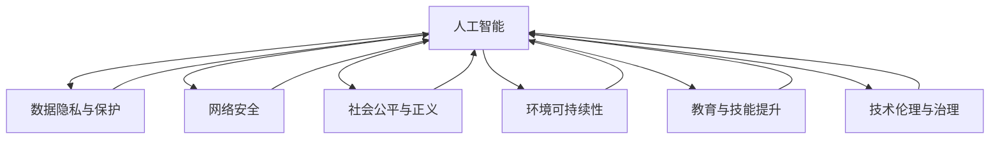

                 

# 科技发展：人类福祉的保障

> 关键词：人工智能, 数据隐私, 网络安全, 社会公平, 可持续性, 技术伦理, 教育转型

## 1. 背景介绍

### 1.1 问题由来

当前，科技发展已成为驱动社会进步的关键力量。然而，科技进步带来的双刃剑效应也不容忽视。从数据隐私、网络安全到社会公平、可持续性等，科技发展既创造了前所未有的机遇，也带来了严峻的挑战。如何确保科技进步能够为人类带来福祉，而非带来新的风险和问题，成为全社会共同关注的课题。

### 1.2 问题核心关键点

人类福祉的保障，涉及到科技与伦理、政策与治理、经济与社会等多维度的交叉。科技进步带来的福祉提升，主要体现在以下几个方面：

- **数据驱动决策**：通过大数据分析和人工智能技术，提升公共卫生、教育、交通等领域的管理效率，优化资源配置。
- **网络安全防护**：利用先进的技术手段，防范网络攻击，保护个人隐私和数据安全。
- **社会公平促进**：科技应用能够缩小城乡差距，提升边缘群体的社会地位，促进社会整体公平正义。
- **环境可持续性**：通过智慧能源、智能农业、环保科技等手段，减少环境污染，实现绿色低碳发展。
- **教育与技能提升**：利用在线教育、智能培训等新模式，提升教育水平和人才素质，应对未来职业市场的变化。

然而，科技进步同样伴随着风险，如算法偏见、数据泄露、隐私侵害等，需要通过技术、政策和社会多方面的共同努力，加以防范和解决。

## 2. 核心概念与联系

### 2.1 核心概念概述

为更好地理解科技发展对人类福祉的保障，本节将介绍几个关键概念：

- **人工智能(AI)**：利用计算机算法和大数据，模拟人类智能行为的技术，涵盖机器学习、深度学习、自然语言处理等领域。
- **数据隐私与保护**：在数据收集、处理和共享过程中，保护个人和企业数据的安全和隐私。
- **网络安全**：通过技术手段，防范网络攻击和数据泄露，保护数字基础设施安全。
- **社会公平与正义**：通过技术手段，促进社会资源的公平分配，提升边缘群体的社会地位。
- **环境可持续性**：利用科技手段，减少对环境的负面影响，实现绿色低碳发展。
- **教育与技能提升**：通过科技手段，提升教育质量和技能水平，促进人的全面发展。
- **技术伦理与治理**：科技发展的伦理原则和规范，以及在技术应用中的政策法规框架。

这些概念之间的逻辑关系可以通过以下Mermaid流程图来展示：



这个流程图展示了几大核心概念及其之间的关联关系：

1. **人工智能**：是实现数据隐私保护、网络安全、社会公平、环境可持续、教育技能提升以及技术伦理与治理的基础工具。
2. **数据隐私与保护**：是人工智能发展的必要条件，也是确保网络安全和维护社会公平的基础。
3. **网络安全**：是实现数据隐私保护的前提，也是人工智能系统能够安全运行的基础。
4. **社会公平与正义**：是人工智能应用的目标之一，需要结合技术伦理与治理来保障。
5. **环境可持续性**：是人工智能与自然环境协同发展的目标，需要综合考虑技术伦理与治理。
6. **教育与技能提升**：是人工智能应用的次级目标，依赖于技术伦理与治理来确保其公平性和安全性。
7. **技术伦理与治理**：是确保所有技术应用遵循伦理原则，保障社会公平与正义的核心。

这些概念共同构成了科技发展的宏观框架，为实现人类福祉提供了多层次的保障。

## 3. 核心算法原理 & 具体操作步骤

### 3.1 算法原理概述

科技发展对人类福祉的保障，涉及多个算法和技术的交叉应用。以下将详细介绍这些算法和技术的基本原理：

- **数据隐私保护算法**：通过差分隐私、联邦学习等技术，保护个体数据隐私。
- **网络安全算法**：包括加密技术、入侵检测系统、异常检测算法等，防范网络攻击。
- **社会公平算法**：通过推荐系统、数据增强技术等，提升边缘群体的社会地位。
- **环境可持续算法**：包括智能农业、智能交通、智慧能源等技术，减少环境污染。
- **教育技能提升算法**：包括智能辅导系统、自适应学习平台等，提升教育水平和技能。
- **技术伦理与治理算法**：通过数据治理、隐私保护、算法透明等技术，确保技术应用的合规性和公正性。

### 3.2 算法步骤详解

科技发展对人类福祉的保障，通常包括以下关键步骤：

**Step 1: 数据收集与预处理**
- 收集相关领域的原始数据，进行清洗、去重和特征工程。
- 对敏感数据进行匿名化和加密处理，保护个人隐私。
- 使用差分隐私和联邦学习技术，确保数据使用的安全性。

**Step 2: 算法设计与训练**
- 选择合适的算法模型，如机器学习、深度学习、自然语言处理等。
- 设计算法目标，如提升教育水平、优化交通管理等。
- 在训练集上进行模型训练，并使用验证集进行调优。
- 在测试集上评估模型性能，确保达到预期目标。

**Step 3: 模型部署与监控**
- 将训练好的模型部署到生产环境，进行实时数据处理。
- 设置监控系统，实时监测模型性能和数据安全。
- 定期进行模型评估和调优，确保模型长期有效。

**Step 4: 社会反馈与调整**
- 收集用户和利益相关者的反馈，了解模型应用的效果和问题。
- 根据反馈进行模型调整和优化，确保模型符合社会需求。
- 更新政策法规，确保技术应用的合规性和公正性。

### 3.3 算法优缺点

科技发展对人类福祉的保障，涉及多种算法的交叉应用，其优缺点如下：

**优点**：
- **提升效率**：通过算法优化，大幅提升各个领域的运营效率和资源配置。
- **增强公平性**：利用算法促进社会资源的公平分配，提升边缘群体的社会地位。
- **改善环境**：通过算法应用，减少对环境的负面影响，促进绿色低碳发展。
- **提升教育**：通过算法辅助，提升教育水平和技能，满足未来职业市场需求。

**缺点**：
- **隐私风险**：大规模数据收集和处理可能带来隐私泄露的风险。
- **算法偏见**：算法设计不当可能导致数据偏见和结果不公平。
- **安全威胁**：数据和模型可能面临网络攻击和数据泄露的威胁。
- **社会问题**：技术应用可能加剧社会不平等，引发新的社会问题。
- **技术伦理**：算法设计和应用可能涉及伦理和法律问题，需要多方面考虑。

### 3.4 算法应用领域

科技发展对人类福祉的保障，已在多个领域得到了广泛应用：

- **公共卫生**：通过大数据分析和AI技术，提升疫情监测、预测和防控能力。
- **教育**：利用在线教育和智能辅导系统，提升教育质量和教学效率。
- **交通**：通过智能交通系统，优化交通流量，减少拥堵和污染。
- **金融**：利用AI和区块链技术，提升金融服务的智能化和安全性。
- **司法**：通过司法大数据分析，提升司法公正和效率。
- **环保**：通过智慧能源和智能农业，实现资源的高效利用和环境的保护。

## 4. 数学模型和公式 & 详细讲解 & 举例说明

### 4.1 数学模型构建

为更好地理解算法原理，以下将通过数学语言对相关模型进行详细介绍：

假设有一组原始数据 $D=\{(x_i, y_i)\}_{i=1}^N$，其中 $x_i$ 为输入特征，$y_i$ 为输出标签。目标是设计算法 $f$，使得 $f(x_i)$ 能够逼近 $y_i$。

### 4.2 公式推导过程

以机器学习中常用的线性回归模型为例，推导其公式：

$$
f(x_i) = \theta_0 + \theta_1 x_{i1} + \theta_2 x_{i2} + \cdots + \theta_p x_{ip}
$$

其中 $\theta_0, \theta_1, \ldots, \theta_p$ 为模型参数，需要根据数据 $D$ 进行训练。

使用最小二乘法，求解最优参数 $\theta$：

$$
\theta = (X^T X)^{-1} X^T y
$$

其中 $X$ 为特征矩阵，$y$ 为标签向量。

### 4.3 案例分析与讲解

以智能辅导系统为例，通过机器学习模型对学生的学习情况进行预测，从而提供个性化辅导建议。具体步骤如下：

1. 收集学生的学习记录、考试成绩、兴趣爱好等数据，构建特征矩阵 $X$。
2. 设计标签 $y$，如成绩提升、学习习惯改进等。
3. 使用线性回归模型对学生数据进行训练，得到模型 $f(x_i) = \theta_0 + \theta_1 x_{i1} + \theta_2 x_{i2} + \cdots + \theta_p x_{ip}$。
4. 根据模型预测，提供个性化的辅导建议，如推荐学习资源、安排复习计划等。

## 5. 项目实践：代码实例和详细解释说明

### 5.1 开发环境搭建

在进行项目实践前，需要准备相应的开发环境。以下是Python环境搭建的步骤：

1. 安装Anaconda：从官网下载并安装Anaconda，用于创建独立的Python环境。
2. 创建并激活虚拟环境：
```bash
conda create -n pytorch-env python=3.8 
conda activate pytorch-env
```

3. 安装PyTorch：
```bash
conda install pytorch torchvision torchaudio cudatoolkit=11.1 -c pytorch -c conda-forge
```

4. 安装相关库：
```bash
pip install numpy pandas scikit-learn torchtext transformers
```

### 5.2 源代码详细实现

以下是一个基于PyTorch的智能辅导系统项目，用于预测学生成绩提升的代码实现：

```python
import torch
from torch import nn
from torchtext.legacy import data, datasets
from torchtext.legacy.data import Field, LabelField, BucketIterator

# 定义特征和标签
TEXT = Field(tokenize='spacy', lower=True, include_lengths=True)
LABEL = LabelField(dtype=torch.float)

# 加载数据集
train_data, test_data = datasets.IMDB.splits(TEXT, LABEL)
train_data, valid_data = train_data.split()

# 构建数据迭代器
BATCH_SIZE = 64
train_iterator, valid_iterator, test_iterator = BucketIterator.splits(
    (train_data, valid_data, test_data),
    sort_key=lambda x: len(x.text),
    batch_size=BATCH_SIZE,
    sort_within_batch=False,
    device=torch.device('cuda' if torch.cuda.is_available() else 'cpu')
)

# 定义模型
class Model(nn.Module):
    def __init__(self, input_dim, emb_dim, hid_dim, output_dim):
        super(Model, self).__init__()
        self.embedding = nn.Embedding(input_dim, emb_dim)
        self.rnn = nn.GRU(emb_dim, hid_dim, num_layers=2, dropout=0.5)
        self.fc = nn.Linear(hid_dim, output_dim)
        self.dropout = nn.Dropout(0.5)
    
    def forward(self, x):
        embedded = self.dropout(self.embedding(x))
        output, _ = self.rnn(embedded)
        return self.fc(output)

# 训练模型
model = Model(input_dim=len(TEXT.vocab), emb_dim=100, hid_dim=256, output_dim=1)
optimizer = torch.optim.Adam(model.parameters(), lr=0.001)
criterion = nn.BCEWithLogitsLoss()

for epoch in range(10):
    for batch in train_iterator:
        optimizer.zero_grad()
        predictions = model(batch.text)
        loss = criterion(predictions, batch.label)
        loss.backward()
        optimizer.step()

# 评估模型
with torch.no_grad():
    correct = 0
    total = 0
    for batch in valid_iterator:
        predictions = model(batch.text)
        predicted = (predictions >= 0).float()
        correct += (predicted == batch.label).sum().item()
        total += batch.label.size(0)
    print(f'Accuracy: {100 * correct / total:.2f}%')
```

### 5.3 代码解读与分析

1. **特征和标签定义**：使用PyTorch的Field类定义文本特征和标签，并进行分词、转换大小写、长度记录等预处理。
2. **数据加载**：使用PyTorch的datasets模块加载IMDB电影评论数据集，并将其分割为训练集、验证集和测试集。
3. **模型定义**：定义一个简单的RNN模型，用于预测学生成绩是否提升。模型包括嵌入层、GRU层和全连接层。
4. **训练过程**：使用Adam优化器和二元交叉熵损失函数，在训练集上迭代训练模型，并在验证集上评估模型性能。

## 6. 实际应用场景

### 6.1 智能辅导系统

智能辅导系统利用机器学习模型，对学生的学习数据进行分析，提供个性化的辅导建议。通过智能推荐学习资源、安排复习计划等措施，帮助学生提升学习效果，实现因材施教。

### 6.2 智慧医疗系统

智慧医疗系统利用AI技术，进行疾病诊断、治疗方案推荐等。通过大数据分析，提升医疗服务的智能化水平，辅助医生诊疗，加速新药开发进程。

### 6.3 智慧交通系统

智慧交通系统利用智能算法，优化交通流量，减少拥堵和污染。通过实时监测交通数据，动态调整交通信号，提升交通管理效率。

### 6.4 未来应用展望

未来，科技发展对人类福祉的保障将进一步深化。以下几个方向值得关注：

1. **AI伦理与治理**：建立更加严格的AI伦理和治理框架，确保技术应用符合伦理规范，保障社会公平正义。
2. **隐私保护技术**：发展更加先进的隐私保护技术，如差分隐私、联邦学习等，保护个人和企业数据的安全。
3. **网络安全技术**：提升网络安全防御能力，防范高级持续性威胁(APT)和数据泄露。
4. **环境可持续技术**：开发绿色低碳技术，减少对环境的负面影响，实现可持续发展。
5. **智能教育技术**：利用AI和大数据技术，提升教育质量和个性化学习体验。

## 7. 工具和资源推荐

### 7.1 学习资源推荐

1. **机器学习课程**：如Coursera上的“Machine Learning”课程，由斯坦福大学Andrew Ng教授主讲，系统讲解机器学习理论和方法。
2. **深度学习框架**：如TensorFlow和PyTorch官方文档，提供详细的API和使用指南。
3. **数据科学资源**：如Kaggle平台，提供丰富的数据集和竞赛项目，有助于实践机器学习项目。
4. **AI伦理与治理**：如《人工智能伦理》一书，由人工智能伦理专家撰写，探讨AI技术的伦理和治理问题。
5. **隐私保护技术**：如《差分隐私理论与实践》一书，详细讲解差分隐私的基本概念和应用方法。

### 7.2 开发工具推荐

1. **Python开发环境**：如Anaconda和Jupyter Notebook，用于构建和管理Python环境。
2. **机器学习框架**：如TensorFlow和PyTorch，支持深度学习和机器学习算法的实现。
3. **数据处理工具**：如Pandas和NumPy，用于数据清洗、预处理和分析。
4. **模型可视化工具**：如TensorBoard和Weights & Biases，用于监控和可视化模型训练过程。

### 7.3 相关论文推荐

1. **差分隐私理论**：如“Differential Privacy”论文，提出差分隐私的基本定义和数学框架。
2. **联邦学习**：如“Federated Learning”论文，提出联邦学习的基本算法和应用场景。
3. **AI伦理与治理**：如“Ethics and Governance of Artificial Intelligence”论文，探讨AI技术的伦理和治理问题。

## 8. 总结：未来发展趋势与挑战

### 8.1 研究成果总结

科技发展对人类福祉的保障，涉及多学科的交叉应用，取得了丰硕的成果。主要进展包括：

1. **数据驱动决策**：大数据分析和AI技术在公共卫生、教育、交通等领域的应用，提升了管理效率和资源配置。
2. **网络安全防护**：利用先进的技术手段，防范网络攻击和数据泄露，保护数字基础设施安全。
3. **社会公平促进**：通过技术手段，促进社会资源的公平分配，提升边缘群体的社会地位。
4. **环境可持续性**：通过智慧能源和智能农业等技术，减少环境污染，实现绿色低碳发展。
5. **教育与技能提升**：利用在线教育和智能辅导系统，提升教育水平和技能，满足未来职业市场需求。

### 8.2 未来发展趋势

未来，科技发展对人类福祉的保障将呈现以下几个趋势：

1. **AI伦理与治理**：建立更加严格的AI伦理和治理框架，确保技术应用符合伦理规范，保障社会公平正义。
2. **隐私保护技术**：发展更加先进的隐私保护技术，如差分隐私、联邦学习等，保护个人和企业数据的安全。
3. **网络安全技术**：提升网络安全防御能力，防范高级持续性威胁(APT)和数据泄露。
4. **环境可持续技术**：开发绿色低碳技术，减少对环境的负面影响，实现可持续发展。
5. **智能教育技术**：利用AI和大数据技术，提升教育质量和个性化学习体验。

### 8.3 面临的挑战

尽管取得了不少进展，但科技发展对人类福祉的保障仍面临诸多挑战：

1. **隐私风险**：大规模数据收集和处理可能带来隐私泄露的风险。
2. **算法偏见**：算法设计不当可能导致数据偏见和结果不公平。
3. **安全威胁**：数据和模型可能面临网络攻击和数据泄露的威胁。
4. **社会问题**：技术应用可能加剧社会不平等，引发新的社会问题。
5. **技术伦理**：算法设计和应用可能涉及伦理和法律问题，需要多方面考虑。

### 8.4 研究展望

未来，需要在以下几个方向进行深入研究：

1. **隐私保护技术**：进一步发展差分隐私、联邦学习等隐私保护技术，保护个人和企业数据的安全。
2. **公平算法**：设计更加公平的算法模型，避免数据偏见和结果不公平。
3. **网络安全技术**：提升网络安全防御能力，防范高级持续性威胁(APT)和数据泄露。
4. **智能教育技术**：利用AI和大数据技术，提升教育质量和个性化学习体验。
5. **伦理与治理**：建立更加严格的AI伦理和治理框架，确保技术应用符合伦理规范，保障社会公平正义。

## 9. 附录：常见问题与解答

**Q1：科技发展如何提升公共卫生管理效率？**

A: 科技发展通过大数据分析和AI技术，提升了公共卫生管理效率。具体如下：

1. **疫情监测与预测**：利用AI技术，分析疫情数据，预测疫情发展趋势，指导公共卫生决策。
2. **资源配置优化**：通过大数据分析，优化医疗资源配置，提升疫情应急响应能力。
3. **个性化治疗方案**：利用AI技术，分析患者数据，制定个性化的治疗方案，提高治疗效果。

**Q2：如何保护个人数据隐私？**

A: 保护个人数据隐私，可以采取以下措施：

1. **差分隐私**：通过对数据进行扰动，确保数据匿名化，防止数据泄露。
2. **联邦学习**：通过分布式数据处理，避免数据集中存储，保护数据隐私。
3. **数据加密**：对数据进行加密处理，确保数据传输和存储的安全。

**Q3：AI在提升社会公平性方面有何作用？**

A: AI在提升社会公平性方面具有重要作用，具体如下：

1. **就业匹配**：利用AI技术，推荐最适合的工作岗位，提升就业匹配度。
2. **医疗公平**：利用AI技术，优化医疗资源分配，提升偏远地区医疗服务质量。
3. **教育公平**：利用AI技术，提供个性化学习方案，缩小城乡教育差距。

**Q4：智能辅导系统如何实现个性化学习？**

A: 智能辅导系统通过以下方式实现个性化学习：

1. **数据收集与分析**：收集学生的学习记录、考试成绩、兴趣爱好等数据，构建特征矩阵。
2. **模型训练**：使用机器学习模型，对学生数据进行训练，得到预测模型。
3. **个性化建议**：根据模型预测，提供个性化的辅导建议，如推荐学习资源、安排复习计划等。

**Q5：网络安全技术如何防范高级持续性威胁(APT)？**

A: 网络安全技术可以通过以下方式防范高级持续性威胁(APT)：

1. **入侵检测系统**：实时监测网络流量，检测可疑行为，及时发现APT攻击。
2. **异常检测**：分析网络行为，识别异常模式，发现APT攻击。
3. **加密技术**：对数据进行加密处理，防止数据泄露和篡改。

---

作者：禅与计算机程序设计艺术 / Zen and the Art of Computer Programming

