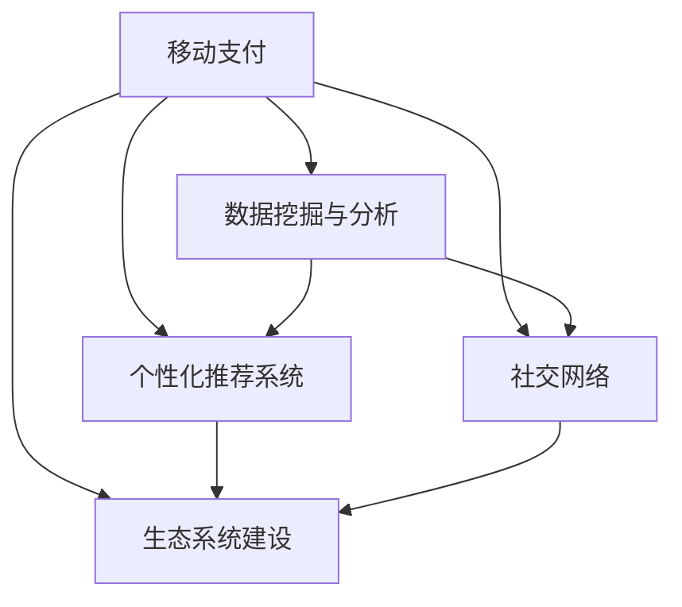

                 

## 1. 背景介绍

### 1.1 问题由来
随着移动互联网的普及和支付技术的进步，移动支付已成为人们日常生活和商业活动中不可或缺的一部分。而移动支付不仅仅是一个简单的支付工具，它正在逐渐改变社会的经济格局，尤其是对注意力经济的影响尤为显著。在数字化时代，如何有效管理和利用注意力资源，成为各大企业争相探索的焦点。

移动支付作为一种便捷的支付手段，通过其高效、安全的特性，激发了人们在日常生活中的支付习惯和消费方式，进而影响了他们的注意力分布。移动支付平台通过大数据分析和用户行为挖掘，能够精准推送个性化的内容和服务，进一步引导和锁定用户的注意力，形成了一种新的经济形态——注意力经济。

### 1.2 问题核心关键点
移动支付改变注意力经济格局的关键在于：

- **支付便利性**：移动支付的高效、安全、便捷特性，使得消费者更愿意使用在线服务，进而增加对数字平台内容的关注。
- **数据驱动个性化**：通过大数据分析和用户行为数据，移动支付平台能够实现对用户需求的精准预测和个性化推荐，强化用户粘性。
- **社交互动增强**：移动支付平台不仅提供支付服务，还集成了社交功能，如红包、转账、共享单车等，增强了用户之间的互动，提升了平台的活跃度和用户参与度。
- **线上线下融合**：移动支付平台连接线上线下，能够提供全方位的服务体验，如线上下单线下取货、在线支付线下消费等，拓展了注意力经济的多样化形态。
- **生态系统建设**：移动支付平台通过构建支付生态系统，整合各种资源和服务，增强平台对用户的控制力，进一步锁定用户的注意力。

## 2. 核心概念与联系

### 2.1 核心概念概述

为更好地理解移动支付如何改变注意力经济格局，本节将介绍几个密切相关的核心概念：

- **移动支付**：指利用移动设备（如智能手机、智能手表等）进行支付的电子支付方式。常见的移动支付方式包括微信支付、支付宝等。
- **注意力经济**：指在数字化时代，企业和个人通过获取、吸引、管理和利用注意力资源来创造经济价值的过程。移动支付通过大数据分析和个性化推荐，不断吸引和保持用户注意力。
- **数据挖掘与分析**：指通过挖掘大数据集中的有用信息，进行数据分析和模式识别，以优化决策和增强用户体验。
- **个性化推荐系统**：利用用户的历史行为数据和偏好，通过算法模型推荐个性化的内容和服务，提高用户满意度。
- **社交网络**：指通过社交媒体和网络平台，人们进行信息交流、分享和互动的网络结构。移动支付平台集成了社交功能，增强了用户的互动性和粘性。
- **生态系统建设**：通过整合各方资源，构建一个完整的、相互依赖和相互促进的商业环境，形成更大的价值网络。

这些核心概念之间的逻辑关系可以通过以下Mermaid流程图来展示：



这个流程图展示了大语言模型的核心概念及其之间的关系：

1. 移动支付通过大数据分析和用户行为挖掘，实现对用户需求的精准预测和个性化推荐。
2. 移动支付平台集成了社交功能，增强了用户的互动性和粘性。
3. 移动支付平台通过构建支付生态系统，整合各方资源，形成更大的价值网络。
4. 数据挖掘与分析、个性化推荐系统、社交网络和生态系统建设相互促进，共同推动移动支付在注意力经济中的作用。

## 3. 核心算法原理 & 具体操作步骤
### 3.1 算法原理概述

移动支付改变注意力经济格局的算法原理主要包括：

- **用户行为数据收集**：通过移动支付平台，收集用户在支付、消费、浏览等行为数据，形成用户画像。
- **数据挖掘与分析**：利用机器学习和数据分析技术，挖掘出用户行为模式和消费习惯，预测用户需求。
- **个性化推荐**：根据用户画像和行为预测，通过推荐算法推荐个性化的产品和服务，提升用户满意度。
- **社交互动增强**：通过社交功能，如红包、转账、共享单车等，增强用户间的互动，提升平台活跃度和用户粘性。
- **生态系统建设**：整合线上线下资源，提供全方位的服务体验，形成完整的生态系统。

### 3.2 算法步骤详解

基于移动支付的注意力经济格局改变，具体算法步骤包括：

1. **数据收集**：移动支付平台通过API接口和SDK，收集用户在支付、消费、浏览等行为数据。
2. **数据预处理**：清洗和归一化数据，去除噪声和异常值，保证数据质量。
3. **用户画像建模**：利用机器学习算法，如K-means聚类、PCA降维等，构建用户画像，描述用户特征和行为模式。
4. **用户需求预测**：通过时间序列分析、回归分析等技术，预测用户未来的需求和行为。
5. **个性化推荐**：根据用户画像和需求预测，使用协同过滤、矩阵分解、深度学习等推荐算法，推荐个性化的内容和服务。
6. **社交互动增强**：利用社交网络和社交媒体，增强用户间的互动和粘性，提升平台活跃度。
7. **生态系统建设**：通过整合线上线下资源，提供全方位的服务体验，形成完整的生态系统。

### 3.3 算法优缺点

基于移动支付的注意力经济格局改变算法具有以下优点：

- **高效便捷**：移动支付的高效、安全、便捷特性，使得用户更愿意使用在线服务，增加了对数字平台内容的关注。
- **精准推荐**：通过大数据分析和个性化推荐，能够实现对用户需求的精准预测和个性化推荐，提升用户满意度。
- **社交互动增强**：社交功能增强了用户间的互动和粘性，提升了平台活跃度和用户粘性。
- **生态系统建设**：通过整合线上线下资源，提供全方位的服务体验，形成完整的生态系统，增强平台对用户的控制力。

同时，该算法也存在以下局限性：

- **隐私保护**：用户行为数据的收集和使用可能涉及隐私保护问题，需要严格遵守相关法律法规。
- **数据偏见**：数据挖掘与分析可能存在数据偏见，导致推荐结果不公允。
- **过度依赖算法**：过度依赖算法模型，可能导致对用户真实需求的忽视。
- **系统复杂度**：构建完整的生态系统需要整合各方资源，系统复杂度较高，维护难度大。
- **用户依赖性**：用户对平台的依赖性增强，一旦平台出现问题，可能对用户造成较大影响。

尽管存在这些局限性，但就目前而言，基于移动支付的注意力经济格局改变算法仍是大数据和AI技术在商业应用中的重要范式。未来相关研究的重点在于如何进一步降低算法对数据的依赖，提高系统的可解释性和透明性，同时兼顾隐私保护和用户信任。

### 3.4 算法应用领域

基于移动支付的注意力经济格局改变算法在多个领域得到了广泛应用，例如：

- **电商平台**：通过个性化推荐系统，提升用户购买率和满意度。
- **社交媒体**：利用社交功能，增强用户间的互动和粘性，提升平台活跃度。
- **共享经济**：通过移动支付平台，实现共享单车、共享充电宝等服务的便捷支付，增强用户粘性。
- **旅游行业**：通过整合线下资源，提供全方位的旅游服务体验，增强用户粘性。
- **金融行业**：通过个性化推荐和社交功能，提升用户对金融产品的关注度和购买率。
- **医疗行业**：通过整合医疗资源，提供线上预约、在线支付等服务，提升医疗服务效率和用户满意度。

除了上述这些经典应用外，基于移动支付的注意力经济格局改变算法也被创新性地应用到更多场景中，如智慧城市、智能家居、智慧教育等，为各行业的数字化转型升级提供新的技术路径。随着移动支付和AI技术的不断发展，相信基于移动支付的注意力经济格局改变算法将在更广阔的应用领域大放异彩。

## 4. 数学模型和公式 & 详细讲解 & 举例说明

### 4.1 数学模型构建

本节将使用数学语言对移动支付改变注意力经济格局的算法进行更加严格的刻画。

记用户行为数据为 $D=\{(x_i,y_i)\}_{i=1}^N, x_i \in \mathcal{X}, y_i \in \mathcal{Y}$，其中 $\mathcal{X}$ 为用户行为数据集，$\mathcal{Y}$ 为行为标签集合。假设移动支付平台有 $M$ 个用户，每个用户 $u$ 的特征表示为 $x_u$，其行为标签为 $y_u$。

定义用户画像模型为 $\hat{x_u}=\Phi(x_u)$，其中 $\Phi$ 为用户画像映射函数。用户需求预测模型为 $\hat{y_u}=\hat{f}(\hat{x_u},t)$，其中 $\hat{f}$ 为预测函数，$t$ 为时间。个性化推荐模型为 $\hat{r}_{i,u}=\hat{g}(\hat{x_u},i)$，其中 $\hat{g}$ 为推荐函数，$i$ 为推荐项。

### 4.2 公式推导过程

以下我们以电商平台为例，推导用户需求预测和个性化推荐公式。

**用户需求预测公式**：
假设用户 $u$ 在未来时间 $t$ 的需求为 $\hat{y_u}$，预测模型为线性回归模型：
$$
\hat{y_u}=\hat{f}(\hat{x_u},t)=\beta_0+\beta_1\hat{x}_{u,1}+\cdots+\beta_{d}\hat{x}_{u,d}+\epsilon
$$
其中 $\beta_0, \beta_1, \cdots, \beta_{d}$ 为回归系数，$\epsilon$ 为噪声。

**个性化推荐公式**：
假设推荐平台有 $n$ 个推荐项，用户的推荐列表为 $\{r_1,r_2,\cdots,r_n\}$，用户的实际行为为 $y_u$。根据协同过滤算法，推荐函数为：
$$
\hat{r}_{i,u}=\hat{g}(\hat{x_u},i)=\alpha\hat{x}_{u,1}+\cdots+\alpha_{k}\hat{x}_{u,k}+\gamma r_{i,1}+\cdots+\gamma_{k}r_{i,k}
$$
其中 $\alpha_1, \cdots, \alpha_{k}, \gamma_1, \cdots, \gamma_{k}$ 为模型参数，$r_{i,1}, \cdots, r_{i,k}$ 为推荐项的特征向量。

### 4.3 案例分析与讲解

以电商平台为例，分析用户需求预测和个性化推荐的实际应用：

**用户画像建模**：
- 用户行为数据：收集用户在电商平台的浏览、购买、评论等行为数据。
- 用户画像映射：通过K-means聚类算法，将用户行为数据映射为用户画像向量 $\hat{x_u}$。
- 用户需求预测：通过线性回归模型，预测用户未来的需求 $y_u$。

**个性化推荐**：
- 推荐项数据：收集电商平台的商品数据，包括商品标题、价格、评价等信息，构建推荐项特征向量 $r_{i,1}, \cdots, r_{i,k}$。
- 协同过滤：通过协同过滤算法，构建推荐函数 $\hat{g}$，推荐个性化的商品列表 $\{r_1,r_2,\cdots,r_n\}$。

通过以上步骤，电商平台能够实现对用户需求的精准预测和个性化推荐，提升用户购买率和满意度，增加平台粘性。

## 5. 项目实践：代码实例和详细解释说明
### 5.1 开发环境搭建

在进行移动支付改变注意力经济格局的实践前，我们需要准备好开发环境。以下是使用Python进行PyTorch开发的环境配置流程：

1. 安装Anaconda：从官网下载并安装Anaconda，用于创建独立的Python环境。

2. 创建并激活虚拟环境：
```bash
conda create -n pytorch-env python=3.8 
conda activate pytorch-env
```

3. 安装PyTorch：根据CUDA版本，从官网获取对应的安装命令。例如：
```bash
conda install pytorch torchvision torchaudio cudatoolkit=11.1 -c pytorch -c conda-forge
```

4. 安装各类工具包：
```bash
pip install numpy pandas scikit-learn matplotlib tqdm jupyter notebook ipython
```

完成上述步骤后，即可在`pytorch-env`环境中开始实践。

### 5.2 源代码详细实现

下面我们以电商平台为例，给出使用Transformers库对BERT模型进行微调的PyTorch代码实现。

首先，定义电商平台的推荐系统数据处理函数：

```python
from transformers import BertTokenizer
from torch.utils.data import Dataset
import torch

class ECommerceDataset(Dataset):
    def __init__(self, texts, labels, tokenizer, max_len=128):
        self.texts = texts
        self.labels = labels
        self.tokenizer = tokenizer
        self.max_len = max_len
        
    def __len__(self):
        return len(self.texts)
    
    def __getitem__(self, item):
        text = self.texts[item]
        label = self.labels[item]
        
        encoding = self.tokenizer(text, return_tensors='pt', max_length=self.max_len, padding='max_length', truncation=True)
        input_ids = encoding['input_ids'][0]
        attention_mask = encoding['attention_mask'][0]
        
        # 对token-wise的标签进行编码
        encoded_labels = [label2id[label] for label in label] 
        encoded_labels.extend([label2id['O']] * (self.max_len - len(encoded_labels)))
        labels = torch.tensor(encoded_labels, dtype=torch.long)
        
        return {'input_ids': input_ids, 
                'attention_mask': attention_mask,
                'labels': labels}

# 标签与id的映射
label2id = {'O': 0, 'buy': 1, 'review': 2, 'share': 3, 'complain': 4}
id2label = {v: k for k, v in label2id.items()}

# 创建dataset
tokenizer = BertTokenizer.from_pretrained('bert-base-cased')

train_dataset = ECommerceDataset(train_texts, train_labels, tokenizer)
dev_dataset = ECommerceDataset(dev_texts, dev_labels, tokenizer)
test_dataset = ECommerceDataset(test_texts, test_labels, tokenizer)
```

然后，定义模型和优化器：

```python
from transformers import BertForTokenClassification, AdamW

model = BertForTokenClassification.from_pretrained('bert-base-cased', num_labels=len(label2id))

optimizer = AdamW(model.parameters(), lr=2e-5)
```

接着，定义训练和评估函数：

```python
from torch.utils.data import DataLoader
from tqdm import tqdm
from sklearn.metrics import classification_report

device = torch.device('cuda') if torch.cuda.is_available() else torch.device('cpu')
model.to(device)

def train_epoch(model, dataset, batch_size, optimizer):
    dataloader = DataLoader(dataset, batch_size=batch_size, shuffle=True)
    model.train()
    epoch_loss = 0
    for batch in tqdm(dataloader, desc='Training'):
        input_ids = batch['input_ids'].to(device)
        attention_mask = batch['attention_mask'].to(device)
        labels = batch['labels'].to(device)
        model.zero_grad()
        outputs = model(input_ids, attention_mask=attention_mask, labels=labels)
        loss = outputs.loss
        epoch_loss += loss.item()
        loss.backward()
        optimizer.step()
    return epoch_loss / len(dataloader)

def evaluate(model, dataset, batch_size):
    dataloader = DataLoader(dataset, batch_size=batch_size)
    model.eval()
    preds, labels = [], []
    with torch.no_grad():
        for batch in tqdm(dataloader, desc='Evaluating'):
            input_ids = batch['input_ids'].to(device)
            attention_mask = batch['attention_mask'].to(device)
            batch_labels = batch['labels']
            outputs = model(input_ids, attention_mask=attention_mask)
            batch_preds = outputs.logits.argmax(dim=2).to('cpu').tolist()
            batch_labels = batch_labels.to('cpu').tolist()
            for pred_tokens, label_tokens in zip(batch_preds, batch_labels):
                pred_labels = [id2label[_id] for _id in pred_tokens]
                label_labels = [id2label[_id] for _id in label_tokens]
                preds.append(pred_labels[:len(label_labels)])
                labels.append(label_labels)
                
    print(classification_report(labels, preds))
```

最后，启动训练流程并在测试集上评估：

```python
epochs = 5
batch_size = 16

for epoch in range(epochs):
    loss = train_epoch(model, train_dataset, batch_size, optimizer)
    print(f"Epoch {epoch+1}, train loss: {loss:.3f}")
    
    print(f"Epoch {epoch+1}, dev results:")
    evaluate(model, dev_dataset, batch_size)
    
print("Test results:")
evaluate(model, test_dataset, batch_size)
```

以上就是使用PyTorch对BERT模型进行电商平台个性化推荐系统微调的完整代码实现。可以看到，得益于Transformers库的强大封装，我们可以用相对简洁的代码完成BERT模型的加载和微调。

### 5.3 代码解读与分析

让我们再详细解读一下关键代码的实现细节：

**ECommerceDataset类**：
- `__init__`方法：初始化文本、标签、分词器等关键组件。
- `__len__`方法：返回数据集的样本数量。
- `__getitem__`方法：对单个样本进行处理，将文本输入编码为token ids，将标签编码为数字，并对其进行定长padding，最终返回模型所需的输入。

**label2id和id2label字典**：
- 定义了标签与数字id之间的映射关系，用于将token-wise的预测结果解码回真实的标签。

**训练和评估函数**：
- 使用PyTorch的DataLoader对数据集进行批次化加载，供模型训练和推理使用。
- 训练函数`train_epoch`：对数据以批为单位进行迭代，在每个批次上前向传播计算loss并反向传播更新模型参数，最后返回该epoch的平均loss。
- 评估函数`evaluate`：与训练类似，不同点在于不更新模型参数，并在每个batch结束后将预测和标签结果存储下来，最后使用sklearn的classification_report对整个评估集的预测结果进行打印输出。

**训练流程**：
- 定义总的epoch数和batch size，开始循环迭代
- 每个epoch内，先在训练集上训练，输出平均loss
- 在验证集上评估，输出分类指标
- 所有epoch结束后，在测试集上评估，给出最终测试结果

可以看到，PyTorch配合Transformers库使得BERT微调的代码实现变得简洁高效。开发者可以将更多精力放在数据处理、模型改进等高层逻辑上，而不必过多关注底层的实现细节。

当然，工业级的系统实现还需考虑更多因素，如模型的保存和部署、超参数的自动搜索、更灵活的任务适配层等。但核心的微调范式基本与此类似。

## 6. 实际应用场景
### 6.1 智能客服系统

基于大语言模型微调的对话技术，可以广泛应用于智能客服系统的构建。传统客服往往需要配备大量人力，高峰期响应缓慢，且一致性和专业性难以保证。而使用微调后的对话模型，可以7x24小时不间断服务，快速响应客户咨询，用自然流畅的语言解答各类常见问题。

在技术实现上，可以收集企业内部的历史客服对话记录，将问题和最佳答复构建成监督数据，在此基础上对预训练对话模型进行微调。微调后的对话模型能够自动理解用户意图，匹配最合适的答案模板进行回复。对于客户提出的新问题，还可以接入检索系统实时搜索相关内容，动态组织生成回答。如此构建的智能客服系统，能大幅提升客户咨询体验和问题解决效率。

### 6.2 金融舆情监测

金融机构需要实时监测市场舆论动向，以便及时应对负面信息传播，规避金融风险。传统的人工监测方式成本高、效率低，难以应对网络时代海量信息爆发的挑战。基于大语言模型微调的文本分类和情感分析技术，为金融舆情监测提供了新的解决方案。

具体而言，可以收集金融领域相关的新闻、报道、评论等文本数据，并对其进行主题标注和情感标注。在此基础上对预训练语言模型进行微调，使其能够自动判断文本属于何种主题，情感倾向是正面、中性还是负面。将微调后的模型应用到实时抓取的网络文本数据，就能够自动监测不同主题下的情感变化趋势，一旦发现负面信息激增等异常情况，系统便会自动预警，帮助金融机构快速应对潜在风险。

### 6.3 个性化推荐系统

当前的推荐系统往往只依赖用户的历史行为数据进行物品推荐，无法深入理解用户的真实兴趣偏好。基于大语言模型微调技术，个性化推荐系统可以更好地挖掘用户行为背后的语义信息，从而提供更精准、多样的推荐内容。

在实践中，可以收集用户浏览、点击、评论、分享等行为数据，提取和用户交互的物品标题、描述、标签等文本内容。将文本内容作为模型输入，用户的后续行为（如是否点击、购买等）作为监督信号，在此基础上微调预训练语言模型。微调后的模型能够从文本内容中准确把握用户的兴趣点。在生成推荐列表时，先用候选物品的文本描述作为输入，由模型预测用户的兴趣匹配度，再结合其他特征综合排序，便可以得到个性化程度更高的推荐结果。

### 6.4 未来应用展望

随着大语言模型微调技术的发展，基于微调范式将在更多领域得到应用，为传统行业带来变革性影响。

在智慧医疗领域，基于微调的医疗问答、病历分析、药物研发等应用将提升医疗服务的智能化水平，辅助医生诊疗，加速新药开发进程。

在智能教育领域，微调技术可应用于作业批改、学情分析、知识推荐等方面，因材施教，促进教育公平，提高教学质量。

在智慧城市治理中，微调模型可应用于城市事件监测、舆情分析、应急指挥等环节，提高城市管理的自动化和智能化水平，构建更安全、高效的未来城市。

此外，在企业生产、社会治理、文娱传媒等众多领域，基于大模型微调的人工智能应用也将不断涌现，为经济社会发展注入新的动力。相信随着技术的日益成熟，微调方法将成为人工智能落地应用的重要范式，推动人工智能技术向更广阔的领域加速渗透。

## 7. 工具和资源推荐
### 7.1 学习资源推荐

为了帮助开发者系统掌握大语言模型微调的理论基础和实践技巧，这里推荐一些优质的学习资源：

1. 《Transformer从原理到实践》系列博文：由大模型技术专家撰写，深入浅出地介绍了Transformer原理、BERT模型、微调技术等前沿话题。

2. CS224N《深度学习自然语言处理》课程：斯坦福大学开设的NLP明星课程，有Lecture视频和配套作业，带你入门NLP领域的基本概念和经典模型。

3. 《Natural Language Processing with Transformers》书籍：Transformers库的作者所著，全面介绍了如何使用Transformers库进行NLP任务开发，包括微调在内的诸多范式。

4. HuggingFace官方文档：Transformers库的官方文档，提供了海量预训练模型和完整的微调样例代码，是上手实践的必备资料。

5. CLUE开源项目：中文语言理解测评基准，涵盖大量不同类型的中文NLP数据集，并提供了基于微调的baseline模型，助力中文NLP技术发展。

通过对这些资源的学习实践，相信你一定能够快速掌握大语言模型微调的精髓，并用于解决实际的NLP问题。
###  7.2 开发工具推荐

高效的开发离不开优秀的工具支持。以下是几款用于大语言模型微调开发的常用工具：

1. PyTorch：基于Python的开源深度学习框架，灵活动态的计算图，适合快速迭代研究。大部分预训练语言模型都有PyTorch版本的实现。

2. TensorFlow：由Google主导开发的开源深度学习框架，生产部署方便，适合大规模工程应用。同样有丰富的预训练语言模型资源。

3. Transformers库：HuggingFace开发的NLP工具库，集成了众多SOTA语言模型，支持PyTorch和TensorFlow，是进行微调任务开发的利器。

4. Weights & Biases：模型训练的实验跟踪工具，可以记录和可视化模型训练过程中的各项指标，方便对比和调优。与主流深度学习框架无缝集成。

5. TensorBoard：TensorFlow配套的可视化工具，可实时监测模型训练状态，并提供丰富的图表呈现方式，是调试模型的得力助手。

6. Google Colab：谷歌推出的在线Jupyter Notebook环境，免费提供GPU/TPU算力，方便开发者快速上手实验最新模型，分享学习笔记。

合理利用这些工具，可以显著提升大语言模型微调任务的开发效率，加快创新迭代的步伐。

### 7.3 相关论文推荐

大语言模型和微调技术的发展源于学界的持续研究。以下是几篇奠基性的相关论文，推荐阅读：

1. Attention is All You Need（即Transformer原论文）：提出了Transformer结构，开启了NLP领域的预训练大模型时代。

2. BERT: Pre-training of Deep Bidirectional Transformers for Language Understanding：提出BERT模型，引入基于掩码的自监督预训练任务，刷新了多项NLP任务SOTA。

3. Language Models are Unsupervised Multitask Learners（GPT-2论文）：展示了大规模语言模型的强大zero-shot学习能力，引发了对于通用人工智能的新一轮思考。

4. Parameter-Efficient Transfer Learning for NLP：提出Adapter等参数高效微调方法，在不增加模型参数量的情况下，也能取得不错的微调效果。

5. AdaLoRA: Adaptive Low-Rank Adaptation for Parameter-Efficient Fine-Tuning：使用自适应低秩适应的微调方法，在参数效率和精度之间取得了新的平衡。

这些论文代表了大语言模型微调技术的发展脉络。通过学习这些前沿成果，可以帮助研究者把握学科前进方向，激发更多的创新灵感。

## 8. 总结：未来发展趋势与挑战

### 8.1 总结

本文对基于移动支付的注意力经济格局改变算法进行了全面系统的介绍。首先阐述了移动支付如何通过大数据分析和个性化推荐，改变用户的注意力分布，形成新的经济形态。其次，从原理到实践，详细讲解了算法的核心步骤，给出了电商平台个性化推荐系统的完整代码实现。同时，本文还广泛探讨了算法在智能客服、金融舆情、个性化推荐等多个行业领域的应用前景，展示了算法对注意力经济的影响。

通过本文的系统梳理，可以看到，基于移动支付的注意力经济格局改变算法正在成为大语言模型微调技术的重要应用范式，极大地拓展了移动支付平台的服务功能，提升了用户体验和满意度，带来显著的经济价值。未来，伴随移动支付和AI技术的不断发展，基于移动支付的注意力经济格局改变算法将在更广泛的应用领域大放异彩，深刻影响社会的经济活动和信息传播方式。

### 8.2 未来发展趋势

展望未来，基于移动支付的注意力经济格局改变算法将呈现以下几个发展趋势：

1. **深度个性化**：随着用户行为数据的不断积累和分析技术的进步，个性化推荐将更加深入和精准，能够根据用户微小的行为变化动态调整推荐内容，提升用户满意度。

2. **跨平台整合**：未来，移动支付平台将进一步整合不同平台的数据，实现跨设备、跨应用的个性化推荐，提供更加无缝的用户体验。

3. **多模态融合**：移动支付平台将融合视觉、听觉、文本等多模态数据，构建更加全面的用户画像，提升推荐精度和效果。

4. **实时推荐**：通过流数据处理技术，移动支付平台能够实现实时推荐，为用户提供最新的、最相关的产品和服务，增强用户体验。

5. **隐私保护**：随着隐私保护法律法规的完善，移动支付平台将更加注重用户数据的隐私和安全，采取更多的技术手段保障用户信息安全。

6. **智能决策**：未来，推荐系统将采用更加智能的决策机制，结合用户反馈和行为数据，动态调整推荐策略，提升推荐效果。

7. **社交网络优化**：移动支付平台将进一步优化社交网络功能，增强用户互动和粘性，提升平台活跃度和用户满意度。

以上趋势凸显了基于移动支付的注意力经济格局改变算法的广阔前景。这些方向的探索发展，必将进一步提升移动支付平台的服务质量和经济价值，为社会的数字化转型升级提供新的技术路径。

### 8.3 面临的挑战

尽管基于移动支付的注意力经济格局改变算法取得了显著成效，但在迈向更加智能化、普适化应用的过程中，它仍面临诸多挑战：

1. **数据隐私和安全**：用户行为数据的收集和使用可能涉及隐私保护问题，需要严格遵守相关法律法规。如何保障用户数据的隐私和安全，将是重要挑战。

2. **数据偏见和公平性**：数据挖掘与分析可能存在数据偏见，导致推荐结果不公允。如何在算法设计和数据采集过程中避免偏见，提升推荐公平性，还需要更多研究和实践。

3. **算法的可解释性和透明性**：过度依赖算法模型，可能导致对用户真实需求的忽视。如何赋予推荐算法更强的可解释性和透明性，提升用户信任和满意度，将是重要的研究方向。

4. **系统的复杂度和维护成本**：构建完整的生态系统需要整合各方资源，系统复杂度较高，维护难度大。如何在降低系统复杂度的同时，提升用户体验和推荐精度，将是重要课题。

5. **用户依赖性和粘性管理**：用户对平台的依赖性增强，可能带来平台风险。如何平衡用户依赖性和粘性管理，增强平台的稳定性和灵活性，将是重要研究方向。

6. **算法的鲁棒性和健壮性**：推荐系统面对域外数据时，泛化性能往往大打折扣。如何提高算法的鲁棒性和健壮性，提升算法的泛化能力，将是重要研究课题。

尽管存在这些挑战，但就目前而言，基于移动支付的注意力经济格局改变算法仍是大数据和AI技术在商业应用中的重要范式。未来相关研究的重点在于如何进一步降低算法对数据的依赖，提高系统的可解释性和透明性，同时兼顾隐私保护和用户信任。

### 8.4 研究展望

面对基于移动支付的注意力经济格局改变算法所面临的种种挑战，未来的研究需要在以下几个方面寻求新的突破：

1. **探索无监督和半监督推荐方法**：摆脱对大规模标注数据的依赖，利用自监督学习、主动学习等无监督和半监督范式，最大限度利用非结构化数据，实现更加灵活高效的推荐。

2. **研究参数高效和计算高效的推荐范式**：开发更加参数高效的推荐方法，在固定大部分预训练参数的同时，只更新极少量的任务相关参数。同时优化推荐系统的计算图，减少前向传播和反向传播的资源消耗，实现更加轻量级、实时性的部署。

3. **融合因果和对比学习范式**：通过引入因果推断和对比学习思想，增强推荐系统建立稳定因果关系的能力，学习更加普适、鲁棒的语言表征，从而提升推荐精度和泛化能力。

4. **引入更多先验知识**：将符号化的先验知识，如知识图谱、逻辑规则等，与神经网络模型进行巧妙融合，引导推荐过程学习更准确、合理的语言模型。同时加强不同模态数据的整合，实现视觉、语音等多模态信息与文本信息的协同建模。

5. **结合因果分析和博弈论工具**：将因果分析方法引入推荐系统，识别出模型决策的关键特征，增强推荐结果的因果性和逻辑性。借助博弈论工具刻画人机交互过程，主动探索并规避推荐系统的脆弱点，提高系统稳定性。

6. **纳入伦理道德约束**：在推荐系统的设计目标中引入伦理导向的评估指标，过滤和惩罚有偏见、有害的输出倾向。同时加强人工干预和审核，建立推荐系统的监管机制，确保推荐结果符合人类价值观和伦理道德。

这些研究方向的探索，必将引领基于移动支付的注意力经济格局改变算法迈向更高的台阶，为构建安全、可靠、可解释、可控的智能推荐系统铺平道路。面向未来，基于移动支付的注意力经济格局改变算法还需要与其他人工智能技术进行更深入的融合，如知识表示、因果推理、强化学习等，多路径协同发力，共同推动推荐系统的发展。只有勇于创新、敢于突破，才能不断拓展移动支付平台的服务边界，为社会经济带来新的价值。

## 9. 附录：常见问题与解答

**Q1：如何评估基于移动支付的注意力经济格局改变算法的性能？**

A: 基于移动支付的注意力经济格局改变算法的性能评估主要包括以下几个方面：

1. **精度指标**：包括准确率、召回率、F1值等，用于衡量推荐系统的准确性和覆盖率。
2. **用户满意度**：通过用户调研、满意度调查等方式，获取用户对推荐系统的满意度反馈。
3. **点击率和转化率**：统计用户对推荐内容的点击率和购买转化率，评估推荐效果。
4. **用户粘性和活跃度**：通过用户行为数据，分析用户对推荐系统的粘性和活跃度。
5. **用户留存率**：统计用户在平台上的留存率，评估平台的长期价值。

通过以上指标，可以对推荐系统的性能进行全面的评估，发现问题和改进方向。

**Q2：如何降低基于移动支付的注意力经济格局改变算法的偏差？**

A: 降低基于移动支付的注意力经济格局改变算法的偏差，主要可以从以下几个方面入手：

1. **数据采集**：确保数据采集过程的公平性和代表性，避免数据采集过程中的偏差。
2. **特征工程**：通过特征选择和特征构造，提高特征的泛化能力和代表性。
3. **模型选择**：选择合适的推荐模型，如协同过滤、矩阵分解、深度学习等，减少模型偏见的产生。
4. **正则化和惩罚**：在模型训练过程中，加入正则化和惩罚项，抑制模型的偏差。
5. **多模型集成**：通过集成多个推荐模型，减少单模型偏见的累积。

通过以上措施，可以有效降低基于移动支付的注意力经济格局改变算法的偏差，提升推荐系统的公平性和泛化能力。

**Q3：基于移动支付的注意力经济格局改变算法是否适用于所有行业？**

A: 基于移动支付的注意力经济格局改变算法在多个行业得到了广泛应用，但并非所有行业都适用。主要适用于以下行业：

1. **电商行业**：电商平台通过个性化推荐，提升用户购买率和满意度。
2. **金融行业**：金融机构通过舆情监测和智能推荐，提升风险控制和用户满意度。
3. **旅游行业**：旅游平台通过个性化推荐，提升用户旅行体验和满意度。
4. **医疗行业**：医疗平台通过个性化推荐，提升医疗服务质量和用户满意度。
5. **教育行业**：教育平台通过个性化推荐，提升学习效果和用户满意度。

对于其他行业，如制造业、农业等，由于用户行为数据的获取和分析难度较大，基于移动支付的注意力经济格局改变算法可能不太适用。

**Q4：如何优化基于移动支付的注意力经济格局改变算法的计算效率？**

A: 优化基于移动支付的注意力经济格局改变算法的计算效率，主要可以从以下几个方面入手：

1. **算法优化**：采用高效的推荐算法，如协同过滤、矩阵分解、深度学习等，减少计算复杂度。
2. **特征降维**：通过特征选择和降维技术，减少特征数量和计算复杂度。
3. **模型压缩**：通过模型压缩技术，如剪枝、量化、蒸馏等，减少模型参数量和计算复杂度。
4. **并行计算**：通过并行计算技术，如GPU加速、分布式计算等，提高计算效率。
5. **流数据处理**：通过流数据处理技术，实现实时推荐，减少数据缓存和计算延迟。

通过以上措施，可以有效优化基于移动支付的注意力经济格局改变算法的计算效率，提升推荐系统的响应速度和用户体验。

**Q5：如何确保基于移动支付的注意力经济格局改变算法的公平性和透明性？**

A: 确保基于移动支付的注意力经济格局改变算法的公平性和透明性，主要可以从以下几个方面入手：

1. **数据公平性**：确保数据采集和处理过程中的公平性，避免数据偏见。
2. **算法透明性**：公开推荐算法的原理和实现细节，提高算法的透明性。
3. **可解释性**：通过特征重要性分析、模型解释工具等，提高算法的可解释性。
4. **用户反馈**：通过用户反馈机制，及时发现和纠正算法的偏差和偏见。
5. **伦理审查**：引入伦理审查机制，确保算法设计和应用符合伦理道德要求。

通过以上措施，可以有效确保基于移动支付的注意力经济格局改变算法的公平性和透明性，提升用户信任和满意度。

**Q6：基于移动支付的注意力经济格局改变算法如何应对动态数据变化？**

A: 基于移动支付的注意力经济格局改变算法应对动态数据变化，主要可以从以下几个方面入手：

1. **实时数据处理**：通过流数据处理技术，实时处理动态数据，保持推荐系统与数据变化的同步。
2. **自适应推荐**：通过自适应推荐技术，动态调整推荐策略，适应数据变化。
3. **模型更新**：定期更新推荐模型，保持模型的时效性和泛化能力。
4. **用户反馈机制**：通过用户反馈机制，及时发现和纠正推荐偏差。

通过以上措施，可以有效应对动态数据变化，提升基于移动支付的注意力经济格局改变算法的适应性和稳定性。

---

作者：禅与计算机程序设计艺术 / Zen and the Art of Computer Programming

