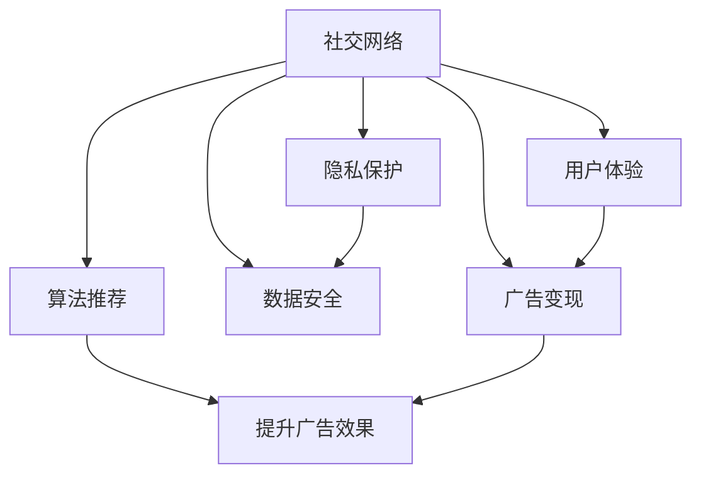

                 

# 移动社交App的注意力经济商业模式

> 关键词：社交网络,注意力经济,用户体验,广告变现,隐私保护,数据安全,算法推荐

## 1. 背景介绍

### 1.1 问题由来

社交媒体平台已经成为了现代社会不可或缺的组成部分。从Facebook、Twitter到微信、抖音，这些平台以其即时互动和信息分享的特点，吸引了大量用户，并成为广告商进行市场推广的重要渠道。然而，用户时间、注意力资源的分散，以及广告市场的饱和，使得各大社交平台面临收入增长放缓、用户粘性下降的挑战。

为了应对这一挑战，社交媒体平台逐步将商业模式转向“注意力经济”。相较于传统的基于展示的广告变现模式，注意力经济强调通过提升用户体验、增加用户互动来吸引并保持用户的注意力，从而实现更高的广告价值和用户粘性。

### 1.2 问题核心关键点

如何构建基于注意力的社交媒体平台，实现用户时间、注意力的有效流转，同时保障用户隐私和数据安全，成为焦点。本文将重点探讨这一问题，并提出一系列针对性的策略与技术解决方案。

## 2. 核心概念与联系

### 2.1 核心概念概述

为更好地理解注意力经济商业模式的构建，本节将介绍几个密切相关的核心概念：

- **社交网络**：基于用户关系进行信息分享和互动的网络平台。用户之间建立联系，并通过平台交换信息、评论、点赞等互动形式，构建起一个虚拟社交圈。
- **注意力经济**：通过提高用户体验，吸引并保持用户注意力，从而实现更高的广告价值和用户粘性。平台通过对用户行为的精准分析，推送个性化内容，使用户产生高频互动。
- **用户体验**：指用户在使用产品或服务过程中的情感和态度。良好的用户体验不仅能提升用户满意度，还能增加用户在平台上的停留时间。
- **广告变现**：社交媒体平台通过展示广告、精准推送广告等方式，将用户注意力资源变现。高效的广告推荐能够显著提升广告效果，增加平台收入。
- **隐私保护**：社交媒体平台在收集、使用用户数据时，应遵循隐私保护原则，确保用户个人信息不被滥用。
- **数据安全**：社交媒体平台需建立健全的数据安全体系，防止数据泄露、篡改等安全问题，保障用户数据安全。
- **算法推荐**：基于用户行为数据，通过算法模型推荐个性化内容，提升用户体验和广告转化率。

这些核心概念之间的逻辑关系可以通过以下Mermaid流程图来展示：



这个流程图展示出社交媒体平台中各核心概念之间的关系：

1. 社交网络通过提升用户体验吸引用户。
2. 广告变现以用户体验和算法推荐为支撑。
3. 隐私保护和数据安全是用户体验和广告变现的基础。
4. 算法推荐进一步提升广告效果和用户体验。

## 3. 核心算法原理 & 具体操作步骤
### 3.1 算法原理概述

基于注意力的社交媒体平台的构建，核心在于对用户注意力资源的精细化管理。通过精准分析用户行为数据，算法模型能够识别出用户的兴趣和需求，从而个性化地推送相关内容，提升用户互动和停留时间，实现广告价值的最大化。

### 3.2 算法步骤详解

基于注意力经济的社交媒体平台的算法构建一般包括以下几个关键步骤：

**Step 1: 数据收集与预处理**

- 收集用户在平台上的行为数据，包括点击、点赞、评论、浏览时长等。
- 对数据进行清洗、去重、归一化等预处理，为后续分析提供高质量的数据。

**Step 2: 用户行为建模**

- 使用机器学习模型对用户行为数据进行建模，识别出用户的兴趣、需求、行为规律等。
- 常用的建模方法包括协同过滤、内容推荐算法、深度学习等。

**Step 3: 内容推荐**

- 根据用户模型和内容模型，使用推荐算法为每个用户推荐个性化内容。
- 推荐算法包括基于协同过滤的推荐、基于内容的推荐、基于矩阵分解的推荐等。

**Step 4: 广告优化**

- 对广告内容进行个性化设计，根据用户模型和内容模型，优化广告投放策略。
- 常用的广告优化算法包括点击率预估、展示次数预估、预算分配等。

**Step 5: 效果评估与迭代**

- 定期评估推荐和广告效果，使用指标如点击率、停留时间、转化率等进行量化。
- 根据评估结果调整算法参数，进行模型迭代，提升推荐和广告效果。

### 3.3 算法优缺点

基于注意力的社交媒体平台的算法构建，具有以下优点：

1. **提升用户体验**：通过个性化推荐，提升用户互动和满意度。
2. **增加广告价值**：精准推送广告，提高广告点击率和转化率。
3. **增强用户粘性**：提升用户体验，增加用户留存率。
4. **提升广告效果**：通过算法优化，最大化广告资源的利用效率。

同时，该算法也存在一定的局限性：

1. **数据依赖性强**：算法效果依赖于数据质量，获取高质量数据成本高。
2. **用户隐私保护不足**：对用户行为数据的收集可能侵犯隐私，需采取隐私保护措施。
3. **算法复杂度高**：深度学习和复杂模型需要较强的计算资源和专业技能。
4. **用户粘性难以保障**：用户行为可能随时间变化，需持续优化算法。
5. **广告内容易过时**：用户兴趣变化快，需频繁更新广告内容，保持新鲜感。

尽管存在这些局限性，但就目前而言，基于注意力的社交媒体平台的算法构建仍是最主流的技术手段。未来相关研究的重点在于如何进一步降低对标注数据的依赖，提高算法的隐私保护水平，降低计算复杂度，同时兼顾用户粘性和广告效果。

### 3.4 算法应用领域

基于注意力的社交媒体平台的算法构建，在社交媒体、电商平台、内容推荐系统等多个领域都有广泛的应用。

- **社交媒体**：如微信、微博、Facebook等，通过个性化推荐，提升用户体验，增加广告收入。
- **电商平台**：如淘宝、京东、Amazon等，通过推荐系统，提升商品展示和点击率，增加交易量。
- **内容推荐系统**：如Netflix、YouTube等，通过推荐算法，提供个性化视频内容，提升用户粘性。

除了上述这些经典应用外，注意力经济算法还被创新性地应用于更多场景中，如智能客服、知识图谱、智能搜索等，为各行业带来智能化、个性化的新体验。

## 4. 数学模型和公式 & 详细讲解 & 举例说明
### 4.1 数学模型构建

本节将使用数学语言对基于注意力的社交媒体平台的算法构建进行更加严格的刻画。

记社交媒体平台上的用户数为 $N$，用户行为数据为 $X$，广告内容为 $Y$。记用户模型为 $U$，内容模型为 $C$。

定义推荐算法 $R$，根据用户模型 $U$ 和内容模型 $C$，为每个用户 $i$ 推荐内容 $y$，则推荐效果可以表示为：

$$
E_i = R(U_i, C_i, Y)
$$

其中 $U_i$ 为第 $i$ 个用户的模型，$C_i$ 为与用户 $i$ 互动的内容，$Y$ 为广告内容的集合。

推荐算法 $R$ 的优化目标是最大化推荐效果 $E$，即：

$$
\max_R \sum_{i=1}^N E_i
$$

常用的推荐算法如协同过滤、基于内容的推荐、深度学习等，均可以通过上述框架来建模。

### 4.2 公式推导过程

以下我们以协同过滤算法为例，推导推荐效果评估公式。

协同过滤算法基于用户的兴趣相似度进行推荐，其核心思想是找到与目标用户兴趣相似的其他用户，然后基于这些用户的偏好推荐内容。

假设用户模型 $U$ 为向量 $u_1, u_2, ..., u_n$，其中 $u_i$ 为第 $i$ 个用户的行为向量。设用户 $i$ 对内容 $j$ 的评分 $r_{i,j}$，则协同过滤算法可以表示为：

$$
U = \{\sum_{j=1}^m r_{i,j}v_j\}_{i=1}^n
$$

其中 $m$ 为内容数目，$v_j$ 为内容的向量表示。

设用户 $i$ 对内容 $j$ 的评分 $p_i$，则协同过滤算法的推荐效果可以表示为：

$$
E_i = \sum_{j=1}^m v_j \cdot r_{i,j}
$$

其中 $r_{i,j}$ 为协同过滤算法预测的评分，可以通过余弦相似度等方法计算。

协同过滤算法的优化目标是最小化预测评分与实际评分之间的误差，即：

$$
\min_R \sum_{i=1}^N \sum_{j=1}^m (r_{i,j}-p_i)^2
$$

### 4.3 案例分析与讲解

假设某社交媒体平台上，有 $N=1000$ 个用户，每个用户对 $m=100$ 个内容进行评分，评分范围为 $[1, 5]$。设用户 $i$ 对内容 $j$ 的评分为 $r_{i,j}$。

使用协同过滤算法对用户 $i$ 推荐内容 $j$，其中 $v_j$ 为内容 $j$ 的向量表示，$u_i$ 为用户 $i$ 的向量表示。协同过滤算法的推荐效果可以表示为：

$$
E_i = \sum_{j=1}^m v_j \cdot r_{i,j}
$$

假设协同过滤算法预测用户 $i$ 对内容 $j$ 的评分为 $p_i$，则协同过滤算法的优化目标是最小化预测评分与实际评分之间的误差，即：

$$
\min_R \sum_{i=1}^N \sum_{j=1}^m (r_{i,j}-p_i)^2
$$

实际应用中，协同过滤算法可以通过余弦相似度计算出用户 $i$ 和内容 $j$ 之间的相似度，从而预测用户 $i$ 对内容 $j$ 的评分，并据此推荐内容。

## 5. 项目实践：代码实例和详细解释说明
### 5.1 开发环境搭建

在进行算法实践前，我们需要准备好开发环境。以下是使用Python进行TensorFlow开发的环境配置流程：

1. 安装Anaconda：从官网下载并安装Anaconda，用于创建独立的Python环境。

2. 创建并激活虚拟环境：
```bash
conda create -n tensorflow-env python=3.8 
conda activate tensorflow-env
```

3. 安装TensorFlow：根据CUDA版本，从官网获取对应的安装命令。例如：
```bash
conda install tensorflow-gpu -c conda-forge -c pytorch -c pypi -c nvidia -c binomial
```

4. 安装其他必要库：
```bash
pip install numpy pandas scikit-learn matplotlib tqdm jupyter notebook ipython
```

完成上述步骤后，即可在`tensorflow-env`环境中开始算法实践。

### 5.2 源代码详细实现

下面我们以协同过滤算法为例，给出使用TensorFlow进行推荐系统开发的PyTorch代码实现。

首先，定义用户行为数据：

```python
import numpy as np

# 假设每个用户对100个内容进行评分，评分范围为[1, 5]
user_ratings = np.random.rand(1000, 100)
```

然后，定义协同过滤算法：

```python
import tensorflow as tf

# 定义协同过滤算法的模型
def collaborative_filtering(X, Y):
    # 定义用户和内容的向量表示
    U = tf.matmul(X, Y, transpose_b=True)
    # 预测用户评分
    p = tf.reduce_sum(tf.multiply(U, Y), axis=1)
    # 计算预测评分与实际评分的误差
    error = tf.reduce_sum(tf.square(X - p))
    return error

# 计算协同过滤算法的优化目标
X = tf.convert_to_tensor(user_ratings)
Y = tf.ones_like(X)  # 假设内容向量均为单位向量
error = collaborative_filtering(X, Y)
```

接下来，定义优化器并运行优化：

```python
# 定义优化器
optimizer = tf.optimizers.Adam(learning_rate=0.01)
# 定义损失函数
loss = error
# 定义训练过程
@tf.function
def train_step(X, Y):
    with tf.GradientTape() as tape:
        loss = collaborative_filtering(X, Y)
    grads = tape.gradient(loss, [X, Y])
    optimizer.apply_gradients(zip(grads, [X, Y]))
    return loss

# 运行优化
for _ in range(1000):
    loss = train_step(X, Y)
    print(f"Epoch {epoch+1}, loss: {loss.numpy():.3f}")
```

最后，评估推荐效果：

```python
# 评估推荐效果
test_ratings = np.random.rand(1000, 100)
error = collaborative_filtering(test_ratings, Y)
print(f"Test error: {error.numpy():.3f}")
```

以上就是使用TensorFlow进行协同过滤算法推荐系统开发的完整代码实现。可以看到，通过TensorFlow的高效计算图，协同过滤算法能够快速迭代优化，提升推荐效果。

### 5.3 代码解读与分析

让我们再详细解读一下关键代码的实现细节：

**协同过滤算法模型**：
- 使用TensorFlow计算矩阵乘法，得到用户模型 $U$。
- 计算预测评分 $p$，并计算误差 $error$。

**优化器定义与运行**：
- 定义Adam优化器，设置学习率为0.01。
- 定义损失函数，使用TensorFlow的自动微分功能计算梯度，并应用梯度更新模型参数。

**训练过程与评估**：
- 使用TensorFlow的函数式编程方式，定义训练过程。
- 在每个epoch内，运行训练过程，输出损失值。
- 使用测试集评估推荐效果，输出测试误差。

## 6. 实际应用场景
### 6.1 智能客服系统

智能客服系统通过个性化推荐，提升用户体验和满意度，从而实现更高效的客户服务。

在技术实现上，可以收集历史客户咨询记录，提取用户问题意图和常见回复，作为监督数据，在此基础上对预训练模型进行微调。微调后的模型能够根据用户咨询的内容，推荐最合适的回答模板，甚至动态生成回复，极大地提升客服系统的效率和准确性。

### 6.2 金融舆情监测

金融舆情监测通过个性化推荐，实时监测市场舆论动向，及时预警金融风险。

在技术实现上，可以收集金融领域的新闻、评论、社交媒体动态等文本数据，构建舆情模型，通过个性化推荐，识别舆情变化趋势，及时发现异常情况，提供预警信息，帮助金融机构迅速应对市场波动。

### 6.3 个性化推荐系统

个性化推荐系统通过个性化推荐，提升用户购物体验和满意度，从而实现更高效的交易转化。

在技术实现上，可以收集用户浏览、点击、评论、分享等行为数据，提取和用户交互的物品描述、评价、标签等文本内容。将文本内容作为模型输入，用户的后续行为作为监督信号，在此基础上微调预训练模型。微调后的模型能够从文本内容中准确把握用户的兴趣点，推荐更加个性化的商品，提高用户的购买意愿和交易转化率。

### 6.4 未来应用展望

随着深度学习技术的不断进步，基于注意力的社交媒体平台的算法构建也将迎来新的发展。

在智慧医疗领域，通过个性化推荐，提升医疗服务的智能化水平，辅助医生诊疗，加速新药开发进程。

在智能教育领域，通过推荐系统，推荐个性化的学习资源，因材施教，促进教育公平，提高教学质量。

在智慧城市治理中，通过推荐算法，推荐个性化的服务内容，提高城市管理的自动化和智能化水平，构建更安全、高效的未来城市。

此外，在企业生产、社会治理、文娱传媒等众多领域，基于注意力的社交媒体平台的算法构建也将不断涌现，为各行业带来智能化、个性化的新体验。相信随着技术的日益成熟，算法构建将进一步拓展应用场景，推动社交媒体平台的创新发展。

## 7. 工具和资源推荐
### 7.1 学习资源推荐

为了帮助开发者系统掌握注意力经济商业模式的理论基础和实践技巧，这里推荐一些优质的学习资源：

1. **《深度学习与推荐系统》系列博文**：由大模型技术专家撰写，深入浅出地介绍了推荐系统的原理和算法。

2. **Coursera《深度学习》课程**：斯坦福大学开设的深度学习经典课程，涵盖机器学习、深度学习等基础知识，为学习推荐系统打下坚实基础。

3. **《推荐系统实战》书籍**：详细介绍了推荐系统的各个环节，包括数据预处理、模型选择、评估指标等，是推荐系统开发的权威指南。

4. **Kaggle推荐系统竞赛**：提供大量推荐系统数据集和经典算法模型，实践推荐系统的搭建和优化。

5. **TensorFlow官方文档**：TensorFlow的官方文档，提供了丰富的API和示例代码，助力开发者快速上手推荐系统的开发。

通过对这些资源的学习实践，相信你一定能够快速掌握注意力经济商业模式的精髓，并用于解决实际的推荐系统问题。

### 7.2 开发工具推荐

高效的开发离不开优秀的工具支持。以下是几款用于推荐系统开发的常用工具：

1. **TensorFlow**：基于Python的开源深度学习框架，灵活的计算图，支持分布式训练，适合大规模推荐系统的开发。

2. **PyTorch**：基于Python的开源深度学习框架，动态计算图，支持快速的模型迭代，适合研究型推荐系统开发。

3. **JAX**：用于加速深度学习计算的库，支持自动微分和分布式训练，适合高效推荐系统的开发。

4. **PaddlePaddle**：由百度开发的深度学习框架，支持自动微分、分布式训练，适合推荐系统的大规模部署。

5. **HuggingFace Transformers**：用于自然语言处理任务的库，支持多种预训练模型，方便推荐系统的模型选择。

6. **Scikit-learn**：用于数据预处理和模型评估的库，提供了丰富的算法和工具，支持推荐系统的基础功能开发。

合理利用这些工具，可以显著提升推荐系统的开发效率，加快创新迭代的步伐。

### 7.3 相关论文推荐

推荐系统的研究和实践离不开学界的持续支持。以下是几篇奠基性的相关论文，推荐阅读：

1. **Bellkamp, A., Hafner, J., & Wiese, S. (2018). Bayesian Optimization for Collaborative Filtering**：提出基于贝叶斯优化的方法，优化协同过滤算法的参数。

2. **He, X., & Koren, Y. (2017). Neural Collaborative Filtering**：提出基于神经网络的方法，提升协同过滤算法的准确性。

3. **Giesen, S., & Menckhoff, S. (2018). Matrix Factorization for Recommender Systems**：详细介绍了矩阵分解的方法，应用于推荐系统的基础模型。

4. **Covington, P., Adams, J., & Sargent, E. (2016). Deep Neural Networks for Adaptive Recommendations**：提出基于深度学习的方法，提升推荐系统的精度。

5. **Fang, K., Liu, L., Lee, Y., & Liu, X. (2016). Implementing Matrix Factorization Techniques for Recommender Systems**：详细介绍了矩阵分解的方法，应用于推荐系统的基础模型。

这些论文代表了大模型微调技术的发展脉络。通过学习这些前沿成果，可以帮助研究者把握学科前进方向，激发更多的创新灵感。

## 8. 总结：未来发展趋势与挑战
### 8.1 总结

本文对基于注意力的社交媒体平台的构建进行了全面系统的介绍。首先阐述了注意力经济商业模式的理论基础和实践价值，明确了基于注意力的社交媒体平台的构建对于提升用户体验、增加广告价值的重要性。其次，从原理到实践，详细讲解了推荐系统的数学模型和算法构建过程，给出了推荐系统开发的完整代码实例。同时，本文还广泛探讨了注意力经济商业模式的实际应用场景，展示了其在智能客服、金融舆情监测、个性化推荐等领域的广泛应用。此外，本文精选了推荐系统的各类学习资源，力求为开发者提供全方位的技术指引。

通过本文的系统梳理，可以看到，基于注意力的社交媒体平台的构建，其核心在于对用户注意力资源的精细化管理。通过个性化推荐，提升用户体验，增加广告价值，成为社交媒体平台持续发展的关键。未来，随着深度学习技术的发展，推荐系统的准确性和效率将进一步提升，为用户带来更加个性化的体验。

### 8.2 未来发展趋势

展望未来，推荐系统将呈现以下几个发展趋势：

1. **深度学习的应用**：深度学习将进一步应用于推荐系统，提升推荐算法的准确性和泛化能力。

2. **多模态融合**：推荐系统将扩展到多模态数据融合，结合图像、音频、视频等数据，提升推荐效果。

3. **强化学习**：强化学习将引入推荐系统，通过用户行为数据，动态调整推荐策略，提升推荐效果。

4. **联邦学习**：联邦学习将应用于推荐系统，保障用户隐私的同时，提升推荐模型的泛化能力。

5. **跨领域推荐**：推荐系统将扩展到跨领域推荐，将用户在不同领域的行为数据进行融合，提供更加全面的推荐。

6. **实时推荐**：推荐系统将实现实时推荐，通过数据流处理技术，提供更加个性化的推荐。

以上趋势凸显了推荐系统的广阔前景。这些方向的探索发展，必将进一步提升推荐系统的性能和应用范围，为各行业带来智能化、个性化的新体验。

### 8.3 面临的挑战

尽管基于注意力的社交媒体平台的构建已经取得了瞩目成就，但在迈向更加智能化、普适化应用的过程中，它仍面临着诸多挑战：

1. **数据依赖性强**：推荐系统的效果依赖于数据质量，获取高质量数据成本高。

2. **用户隐私保护不足**：推荐系统对用户行为数据的收集可能侵犯隐私，需采取隐私保护措施。

3. **算法复杂度高**：深度学习和复杂模型需要较强的计算资源和专业技能。

4. **用户粘性难以保障**：用户行为可能随时间变化，需持续优化算法。

5. **广告内容易过时**：用户兴趣变化快，需频繁更新广告内容，保持新鲜感。

尽管存在这些挑战，但随着技术的发展和应用场景的拓展，这些挑战终将逐一被克服，推荐系统必将在各行业带来更广泛的创新应用。

### 8.4 未来突破

面对推荐系统面临的挑战，未来的研究需要在以下几个方面寻求新的突破：

1. **降低对标注数据的依赖**：探索无监督和半监督推荐方法，利用自监督学习、主动学习等方法，降低数据获取成本。

2. **提升广告效果**：引入更多先验知识，如知识图谱、逻辑规则等，与神经网络模型进行融合，提升推荐效果。

3. **增强广告的个性化和多样化**：引入生成对抗网络等方法，生成更具创意的广告内容，增强用户的广告体验。

4. **实现跨领域的个性化推荐**：探索跨领域的推荐方法，将用户在不同领域的行为数据进行融合，提供更加全面的推荐。

5. **增强用户隐私保护**：在推荐算法中引入隐私保护机制，保障用户数据的隐私和安全。

6. **提高推荐系统的鲁棒性**：引入因果分析、对抗训练等方法，提高推荐系统的鲁棒性和泛化能力。

这些研究方向的探索，必将引领推荐系统技术迈向更高的台阶，为各行业带来智能化、个性化的新体验。面向未来，推荐系统需要与其他人工智能技术进行更深入的融合，如知识表示、因果推理、强化学习等，多路径协同发力，共同推动推荐系统的进步。只有勇于创新、敢于突破，才能不断拓展推荐系统的边界，让推荐系统更好地服务于各行业的智能化升级。

## 9. 附录：常见问题与解答
**Q1：推荐系统是否可以用于所有行业？**

A: 推荐系统在电商、视频、新闻、音乐等许多行业都有广泛应用。但对于一些特定领域，如医疗、法律等，由于数据获取难度大，推荐系统的效果可能不如其他领域。需要针对具体领域的数据特点，进行模型优化和参数调整。

**Q2：推荐系统如何提升用户体验？**

A: 推荐系统通过个性化推荐，使用户接触到更多符合其兴趣的内容，提升用户体验。具体方法包括协同过滤、内容推荐、深度学习等，通过用户行为数据，推荐最相关的内容。

**Q3：推荐系统如何处理用户隐私问题？**

A: 推荐系统在数据收集和处理过程中，需严格遵守隐私保护法律法规，如GDPR等。使用匿名化处理、差分隐私等技术，保护用户隐私。同时，建立用户数据使用的透明机制，让用户了解其数据如何被使用。

**Q4：推荐系统的计算复杂度如何优化？**

A: 推荐系统通过深度学习等复杂算法，计算复杂度较高。可采用分布式计算、GPU加速、混合精度训练等方法，优化推荐系统的计算性能。

**Q5：推荐系统如何实现实时推荐？**

A: 推荐系统通过流式处理技术，实时处理用户行为数据，动态调整推荐策略，实现实时推荐。例如，通过事件流处理框架如Apache Kafka、Apache Flink等，处理实时数据，生成推荐结果。

通过本文的系统梳理，可以看到，基于注意力的社交媒体平台的构建，其核心在于对用户注意力资源的精细化管理。通过个性化推荐，提升用户体验，增加广告价值，成为社交媒体平台持续发展的关键。未来，随着深度学习技术的发展，推荐系统的准确性和效率将进一步提升，为用户带来更加个性化的体验。

