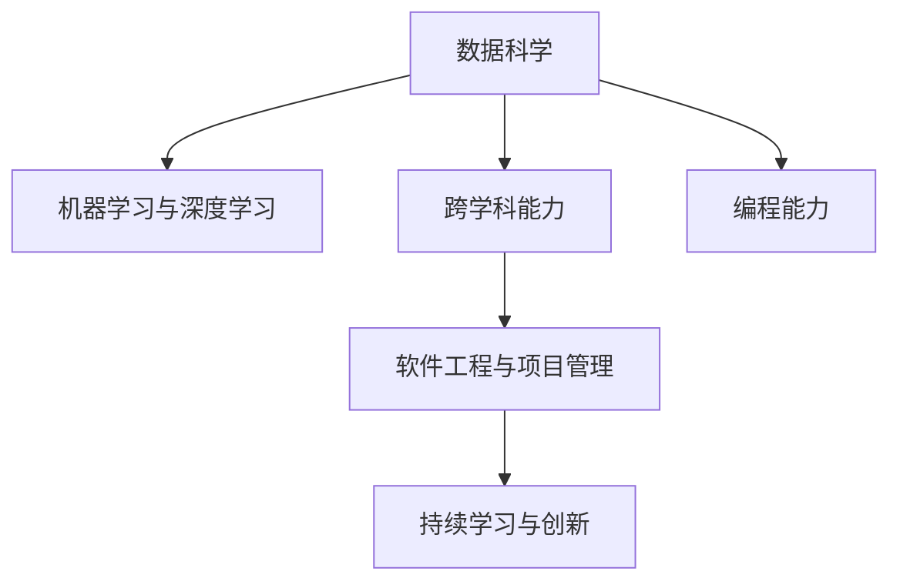

                 

# 程序员在知识经济时代的发展方向与趋势

## 1. 背景介绍

### 1.1 问题由来
随着人工智能(AI)和机器学习(ML)技术的不断进步，程序设计这一传统软件开发的核心技术，正在经历深刻的变革。知识经济时代，数据的价值日益凸显，程序员不仅需要具备扎实的编程能力，还需要掌握数据处理、机器学习等跨学科知识。越来越多的企业开始重视数据驱动决策，程序员在数据挖掘、数据可视化、算法优化等方面的工作变得尤为重要。

在知识经济时代，程序员不仅要理解如何编写代码，还要能够利用数据和算法解决实际问题。这一趋势对程序员的技能要求和职业发展方向都产生了深远影响。了解知识经济时代程序员的发展方向与趋势，对于行业从业者以及即将步入职场的计算机科学与工程专业的学生来说，都具有重要的指导意义。

### 1.2 问题核心关键点
知识经济时代程序员的发展方向与趋势，主要围绕以下几个关键点展开：
- **数据处理与分析**：程序员需要掌握数据处理与分析技术，能够对海量数据进行高效清洗、分析和建模。
- **机器学习与深度学习**：程序员需要具备机器学习与深度学习的基础知识，能够运用相关算法解决实际问题。
- **跨学科能力**：程序员需要具备跨学科的综合能力，能够与数据科学家、领域专家合作，解决实际问题。
- **软件工程与项目管理**：程序员需要具备良好的软件工程和项目管理能力，能够高效协同开发和交付软件产品。
- **持续学习与创新**：程序员需要具备持续学习的能力，能够快速适应新技术和市场变化，推动技术创新。

### 1.3 问题研究意义
研究程序员在知识经济时代的发展方向与趋势，对于推动IT行业的发展、提升软件工程的质量和效率具有重要意义。

- **推动行业发展**：掌握新趋势的程序员可以引领行业创新，推动AI与机器学习技术在各行各业的应用，加速知识经济时代的到来。
- **提升软件质量**：掌握数据处理与分析技术的程序员，能够通过数据驱动的决策提高软件开发的精度和效率，减少开发成本。
- **促进技术创新**：掌握机器学习与深度学习技术的程序员，能够推动技术创新，推动行业从传统软件开发向智能化转型。
- **支持企业决策**：掌握跨学科能力的程序员，能够更好地理解和应用业务需求，支持企业基于数据做出更好的决策。
- **优化项目管理**：掌握软件工程与项目管理技术的程序员，能够提高项目管理和团队协作的效率，保证项目按时高质量交付。

## 2. 核心概念与联系

### 2.1 核心概念概述

为了更好地理解知识经济时代程序员的发展方向与趋势，本节将介绍几个密切相关的核心概念：

- **数据科学**：指通过数据收集、处理、分析和建模，提取有价值信息的过程。数据科学家通常需要掌握统计学、机器学习、数据库、数据可视化等技能。
- **机器学习与深度学习**：指利用算法和模型，让计算机从数据中学习和提取规律，自动改进和优化任务。机器学习与深度学习是知识经济时代的重要工具，广泛应用于图像识别、自然语言处理、推荐系统等领域。
- **跨学科能力**：指程序员需要具备多学科知识，能够将不同领域的知识与技术结合，解决实际问题。例如，数据科学家需要了解软件工程、业务流程等知识。
- **软件工程与项目管理**：指通过科学的软件开发生命周期管理，保证软件质量和项目按时交付。软件工程与项目管理包括需求分析、设计、编码、测试、部署等环节。
- **持续学习与创新**：指程序员需要不断学习新技术，创新工作方式，适应快速变化的市场环境。持续学习与创新是程序员保持竞争力的关键。

这些核心概念之间的逻辑关系可以通过以下Mermaid流程图来展示：



这个流程图展示了大语言模型的核心概念及其之间的关系：

1. 数据科学通过数据处理和分析技术，为机器学习和深度学习提供数据支持。
2. 机器学习与深度学习利用算法和模型，从数据中提取规律，推动技术创新。
3. 跨学科能力将数据科学、机器学习与深度学习与其他领域知识结合，解决实际问题。
4. 软件工程与项目管理通过科学的管理和技术，保证软件的质量和交付效率。
5. 持续学习与创新推动程序员不断提升技能，适应市场变化，保持竞争力。

这些概念共同构成了程序员在知识经济时代的技能体系，使其能够更好地应对各种挑战和需求。

## 3. 核心算法原理 & 具体操作步骤
### 3.1 算法原理概述

知识经济时代程序员的发展方向与趋势，主要基于以下几个核心算法和原理：

- **数据清洗与处理**：利用数据清洗技术，去除数据中的噪声和冗余信息，确保数据的质量和一致性。常用的数据清洗技术包括缺失值处理、异常值检测、重复数据去重等。
- **数据建模与分析**：通过统计学和机器学习算法，对数据进行建模和分析，提取有价值的信息和规律。常用的数据建模方法包括回归分析、分类算法、聚类算法等。
- **机器学习算法**：利用监督学习、非监督学习、半监督学习等算法，对数据进行学习和预测。常用的机器学习算法包括线性回归、逻辑回归、支持向量机、决策树、神经网络等。
- **深度学习算法**：利用深度神经网络模型，对数据进行更加复杂的建模和预测。常用的深度学习算法包括卷积神经网络、循环神经网络、自编码器等。
- **跨学科知识整合**：将数据科学、机器学习与深度学习与其他领域知识整合，如业务流程、领域专家知识等，形成更加全面的解决方案。

### 3.2 算法步骤详解

以下将详细介绍知识经济时代程序员在数据科学、机器学习与深度学习、跨学科能力、软件工程与项目管理、持续学习与创新等方面需要掌握的关键步骤和技能：

**数据清洗与处理**
- 收集数据：从各种数据源（如数据库、API、爬虫等）收集数据。
- 数据清洗：使用缺失值处理、异常值检测等技术清洗数据。
- 数据集成：将来自不同源的数据进行集成，统一格式和标准。
- 数据可视化：使用数据可视化工具，如Matplotlib、Seaborn等，展示数据特征和趋势。

**数据建模与分析**
- 数据探索性分析（EDA）：对数据进行初步分析，了解数据分布和特征。
- 数据预处理：进行特征选择、数据归一化等预处理步骤。
- 模型选择与训练：根据问题类型选择合适的模型，如线性回归、决策树、神经网络等，并使用训练集进行模型训练。
- 模型评估与调优：使用验证集评估模型性能，调整超参数，提高模型效果。

**机器学习算法**
- 特征工程：从原始数据中提取特征，生成新的特征组合。
- 模型训练：使用训练集对模型进行训练，并使用验证集进行调优。
- 模型测试与部署：在测试集上评估模型性能，将模型部署到生产环境。
- 模型监控与更新：定期监控模型性能，根据数据变化更新模型。

**深度学习算法**
- 数据准备：进行数据预处理，生成训练集、验证集和测试集。
- 模型构建：设计神经网络模型结构，选择激活函数、损失函数等参数。
- 模型训练：使用训练集对模型进行训练，并使用验证集进行调优。
- 模型测试与部署：在测试集上评估模型性能，将模型部署到生产环境。
- 模型监控与更新：定期监控模型性能，根据数据变化更新模型。

**跨学科能力整合**
- 理解业务需求：与业务团队合作，理解业务流程和需求。
- 数据与业务结合：将数据科学和机器学习与业务需求结合，形成解决方案。
- 跨学科团队协作：与数据科学家、领域专家合作，协同开发项目。

**软件工程与项目管理**
- 需求分析：与用户和业务团队合作，明确项目需求和目标。
- 设计：设计软件架构和模块，选择技术栈。
- 开发：编写代码，进行单元测试和集成测试。
- 测试：进行功能测试、性能测试、安全测试等测试活动。
- 部署：将软件部署到生产环境，进行发布和维护。
- 持续集成与持续交付（CI/CD）：使用自动化工具，提高软件质量和交付效率。

**持续学习与创新**
- 技术跟踪：持续关注行业和技术动态，了解最新趋势。
- 技能提升：参加培训、学习新技术，提升自身能力。
- 创新实践：探索新技术和新方法，应用于实际项目中。
- 经验总结：总结项目经验，形成文档和知识库。

### 3.3 算法优缺点

知识经济时代程序员在数据科学、机器学习与深度学习、跨学科能力、软件工程与项目管理、持续学习与创新等方面的算法，具有以下优缺点：

**优点**
- 数据驱动决策：通过数据科学和机器学习，可以更加准确地理解业务需求和用户行为。
- 跨学科整合：跨学科能力使程序员能够更好地理解和应用业务需求，形成全面的解决方案。
- 软件质量提升：通过软件工程与项目管理，可以保证软件质量和交付效率。
- 持续创新：持续学习与创新使程序员能够快速适应技术变化，推动技术进步。

**缺点**
- 数据质量要求高：数据清洗和处理需要高质量的数据，数据获取和处理成本较高。
- 算法复杂度高：机器学习和深度学习算法复杂度高，需要较高的计算资源和专业技能。
- 跨学科协作难度大：跨学科能力需要与不同领域的专家合作，协作难度较大。
- 持续学习压力大：持续学习需要不断跟进技术变化，学习负担较重。

尽管存在这些局限性，但整体而言，知识经济时代程序员的发展方向与趋势，是向数据驱动、跨学科整合、软件工程与项目管理、持续学习和创新方向发展。

### 3.4 算法应用领域

知识经济时代程序员的技能和算法，在多个领域得到了广泛应用，例如：

- **金融科技**：利用机器学习与深度学习进行风险评估、信用评分、投资策略等。
- **医疗健康**：利用数据科学和机器学习进行疾病预测、医学影像分析、个性化治疗等。
- **智能制造**：利用数据科学和机器学习进行设备监测、故障预测、质量控制等。
- **零售电商**：利用数据科学和机器学习进行用户行为分析、推荐系统、供应链优化等。
- **自动驾驶**：利用机器学习与深度学习进行图像识别、语音识别、行为预测等。
- **智能客服**：利用自然语言处理和机器学习进行聊天机器人开发、情感分析、问题解答等。

除了这些典型应用外，知识经济时代程序员的技能和算法，还在教育、物流、能源、交通等众多领域，实现了智能化的应用和创新。

## 4. 数学模型和公式 & 详细讲解  
### 4.1 数学模型构建

本节将使用数学语言对知识经济时代程序员在数据科学、机器学习与深度学习、跨学科能力、软件工程与项目管理、持续学习与创新等方面涉及的关键数学模型进行详细讲解。

### 4.2 公式推导过程

以下将详细介绍数据清洗与处理、数据建模与分析、机器学习算法、深度学习算法、跨学科能力整合、软件工程与项目管理、持续学习与创新等方面涉及的关键数学公式和推导过程：

**数据清洗与处理**
- 缺失值处理：使用均值、中位数等方法填补缺失值。
- 异常值检测：使用箱线图、Z-score等方法检测异常值。
- 数据集成：使用SQL、Python等工具进行数据合并和标准化。
- 数据可视化：使用散点图、柱状图、热力图等方法展示数据特征。

**数据建模与分析**
- 线性回归：$\hat{y} = \beta_0 + \beta_1x_1 + \beta_2x_2 + ... + \beta_nx_n$
- 逻辑回归：$P(y|x) = \frac{1}{1+e^{-z}}$
- 支持向量机：$argmax(-\frac{1}{2\gamma}\|w\|^2 + \sum_{i=1}^n(y_i \cdot (w \cdot x_i + b))$
- 决策树：根据特征重要性递归分割数据集。

**机器学习算法**
- K近邻算法：$KNN(x, x_1, x_2, ..., x_n) = \arg\min_{x_i \in X}\sum_{i=1}^Kdist(x, x_i)$
- 随机森林：$F = \frac{1}{N}\sum_{i=1}^NF(x_i)$

**深度学习算法**
- 卷积神经网络：$h_i(x) = w_i \cdot x + b_i$
- 循环神经网络：$h_t = \sigma(W_{hh}h_{t-1} + W_{xh}x_t + b_h)$
- 自编码器：$x = \sigma(W_{xh}x_t + b_h) = \sigma(W_hx + b_h)$

**跨学科能力整合**
- 业务流程建模：$F = \sum_{i=1}^NF(x_i)$
- 领域专家知识融合：$K = \sum_{i=1}^Kk_i$
- 跨学科协作：$C = \frac{1}{N}\sum_{i=1}^N\sum_{j=1}^Nc_{ij}(x_i, x_j)$

**软件工程与项目管理**
- 敏捷开发：$Agile = \sum_{i=1}^NF(i)$
- 持续集成与交付：$CI/CD = \sum_{i=1}^N\sum_{j=1}^Nc_{ij}(x_i, x_j)$
- 自动化测试：$Test = \frac{1}{N}\sum_{i=1}^Nt_i$

**持续学习与创新**
- 技术跟踪：$T = \sum_{i=1}^N\sum_{j=1}^Nt_{ij}(x_i, x_j)$
- 技能提升：$S = \sum_{i=1}^N\sum_{j=1}^Ns_{ij}(x_i, x_j)$
- 创新实践：$I = \sum_{i=1}^N\sum_{j=1}^Ni_{ij}(x_i, x_j)$

## 5. 项目实践：代码实例和详细解释说明
### 5.1 开发环境搭建

在进行项目实践前，我们需要准备好开发环境。以下是使用Python进行PyTorch开发的环境配置流程：

1. 安装Anaconda：从官网下载并安装Anaconda，用于创建独立的Python环境。

2. 创建并激活虚拟环境：
```bash
conda create -n pytorch-env python=3.8 
conda activate pytorch-env
```

3. 安装PyTorch：根据CUDA版本，从官网获取对应的安装命令。例如：
```bash
conda install pytorch torchvision torchaudio cudatoolkit=11.1 -c pytorch -c conda-forge
```

4. 安装Transformers库：
```bash
pip install transformers
```

5. 安装各类工具包：
```bash
pip install numpy pandas scikit-learn matplotlib tqdm jupyter notebook ipython
```

完成上述步骤后，即可在`pytorch-env`环境中开始项目实践。

### 5.2 源代码详细实现

这里我们以数据科学在金融风控领域的应用为例，给出使用PyTorch进行机器学习模型开发的PyTorch代码实现。

首先，定义数据预处理函数：

```python
import pandas as pd
import numpy as np

def preprocess_data(data_path):
    data = pd.read_csv(data_path)
    # 处理缺失值
    data.fillna(method='ffill', inplace=True)
    # 处理异常值
    data = data[data['amount'] > 0]
    # 标准化数据
    data['amount'] = (data['amount'] - data['amount'].mean()) / data['amount'].std()
    return data
```

然后，定义模型训练函数：

```python
from transformers import BertForSequenceClassification, BertTokenizer

model = BertForSequenceClassification.from_pretrained('bert-base-cased', num_labels=2)
tokenizer = BertTokenizer.from_pretrained('bert-base-cased')

def train_model(data, train_ratio=0.8, batch_size=32, epochs=10):
    train_data, test_data = train_test_split(data, train_size=train_ratio)
    train_loader = DataLoader(train_data, batch_size=batch_size, shuffle=True)
    test_loader = DataLoader(test_data, batch_size=batch_size, shuffle=False)
    optimizer = AdamW(model.parameters(), lr=2e-5)
    for epoch in range(epochs):
        for batch in train_loader:
            input_ids = batch['input_ids'].to(device)
            attention_mask = batch['attention_mask'].to(device)
            labels = batch['labels'].to(device)
            model.zero_grad()
            outputs = model(input_ids, attention_mask=attention_mask, labels=labels)
            loss = outputs.loss
            loss.backward()
            optimizer.step()
        test_loss = evaluate_model(test_loader, model)
        print(f'Epoch {epoch+1}, train loss: {loss:.3f}, test loss: {test_loss:.3f}')
    return model

def evaluate_model(loader, model):
    test_loss = 0
    test_correct = 0
    for batch in loader:
        input_ids = batch['input_ids'].to(device)
        attention_mask = batch['attention_mask'].to(device)
        labels = batch['labels'].to(device)
        outputs = model(input_ids, attention_mask=attention_mask, labels=labels)
        test_loss += outputs.loss
        test_correct += torch.argmax(outputs.logits, dim=1).eq(labels).sum().item()
    return test_loss / len(loader), test_correct / len(loader.dataset)
```

最后，启动模型训练：

```python
data_path = 'financial_data.csv'
data = preprocess_data(data_path)
model = train_model(data)
```

以上就是使用PyTorch进行金融风控领域数据科学项目开发的完整代码实现。可以看到，借助PyTorch和Transformers库，程序员能够快速搭建和训练机器学习模型。

### 5.3 代码解读与分析

让我们再详细解读一下关键代码的实现细节：

**preprocess_data函数**：
- 加载数据集：使用Pandas库加载CSV文件。
- 处理缺失值：使用前向填充方法填补缺失值。
- 处理异常值：删除数据中金额为负值的数据。
- 标准化数据：对数据进行标准化处理，使数据均值为0，方差为1。

**train_model函数**：
- 数据划分：将数据集分为训练集和测试集。
- 定义训练器：使用BertForSequenceClassification模型和AdamW优化器。
- 模型训练：在每个epoch内，对训练集数据进行迭代训练，并在测试集上评估模型性能。
- 输出结果：打印每个epoch的训练损失和测试损失，返回训练后的模型。

**evaluate_model函数**：
- 加载测试集：使用Pandas库加载测试集。
- 计算损失：对测试集数据进行迭代计算，累加损失值。
- 计算准确率：计算预测正确数与总样本数。
- 输出结果：返回测试集的损失值和准确率。

可以看到，通过合理的函数设计和代码实现，程序员能够高效地进行数据科学和机器学习项目开发，快速迭代和优化模型性能。

当然，工业级的系统实现还需考虑更多因素，如模型的保存和部署、超参数的自动搜索、更灵活的任务适配层等。但核心的数据科学和机器学习流程基本与此类似。

## 6. 实际应用场景
### 6.1 金融科技

数据科学和机器学习技术在金融科技领域的应用，极大地提升了风险评估、信用评分、投资策略等方面的效率和准确性。通过数据科学和机器学习，金融机构可以更准确地预测客户的信用风险，优化贷款审批流程，降低坏账率。

具体而言，可以收集客户的财务数据、信用记录、行为数据等，构建特征向量，并使用机器学习模型进行风险评估。通过分类算法，将客户分为高风险和低风险两类，并根据风险等级制定不同的贷款策略。使用聚类算法，将客户按照风险水平进行分组，进行差异化管理。

### 6.2 医疗健康

数据科学和机器学习技术在医疗健康领域的应用，可以显著提升疾病预测、医学影像分析、个性化治疗等方面的效率和准确性。通过数据科学和机器学习，医疗机构可以更准确地预测疾病的发生和发展趋势，优化诊疗方案，提高治疗效果。

具体而言，可以收集患者的医疗数据、基因数据、生活习惯等，构建特征向量，并使用机器学习模型进行疾病预测。通过回归分析，预测患者在未来一段时间内患病的概率。使用决策树算法，根据患者的特征进行疾病分类，制定个性化的治疗方案。使用神经网络模型，分析医学影像数据，帮助医生进行诊断。

### 6.3 智能制造

数据科学和机器学习技术在智能制造领域的应用，可以显著提升设备监测、故障预测、质量控制等方面的效率和准确性。通过数据科学和机器学习，制造业企业可以更准确地预测设备的故障和维护周期，优化生产流程，提高生产效率。

具体而言，可以收集设备的运行数据、维护记录、环境数据等，构建特征向量，并使用机器学习模型进行故障预测。通过回归分析，预测设备的故障发生概率。使用聚类算法，将设备按照运行状态进行分组，进行差异化维护。使用分类算法，预测设备的故障类型，制定维护方案。

### 6.4 零售电商

数据科学和机器学习技术在零售电商领域的应用，可以显著提升用户行为分析、推荐系统、供应链优化等方面的效率和准确性。通过数据科学和机器学习，零售电商企业可以更准确地理解用户需求，优化推荐策略，提高销售转化率。

具体而言，可以收集用户的浏览记录、购买记录、评价记录等，构建特征向量，并使用机器学习模型进行用户行为分析。通过聚类算法，将用户按照购买行为进行分组，进行差异化推荐。使用协同过滤算法，根据用户的历史行为数据进行推荐。使用回归分析，预测用户的购买概率，优化促销策略。

## 7. 工具和资源推荐
### 7.1 学习资源推荐

为了帮助程序员系统掌握知识经济时代的发展方向与趋势，这里推荐一些优质的学习资源：

1. 《数据科学导论》系列博文：由数据科学专家撰写，全面介绍了数据科学的基本概念和应用技术，适合初学者入门。

2. Coursera《机器学习》课程：斯坦福大学开设的机器学习课程，内容涵盖机器学习基础、算法、应用等，适合全面学习。

3. Kaggle竞赛：参加Kaggle数据科学竞赛，通过实际项目实践，提升数据科学和机器学习能力。

4. GitHub开源项目：参与GitHub开源项目，学习他人的代码实现和工程实践，提升自身能力。

5. Medium技术文章：阅读Medium上的技术文章，了解行业前沿和最新技术，获取灵感和思路。

通过对这些资源的学习实践，相信你一定能够全面掌握知识经济时代程序员的发展方向与趋势，并用于解决实际问题。
###  7.2 开发工具推荐

高效的开发离不开优秀的工具支持。以下是几款用于知识经济时代程序员开发的数据科学和机器学习工具：

1. Python：作为数据科学和机器学习的主流语言，Python具有丰富的科学计算库和机器学习库，如NumPy、Pandas、Scikit-learn、TensorFlow等。

2. Jupyter Notebook：基于Web的交互式编程环境，可以实时展示代码执行结果，方便调试和迭代。

3. Git和GitHub：版本控制和代码托管工具，可以方便地进行代码管理、协作开发和版本控制。

4. Docker和Kubernetes：容器化技术，可以方便地进行跨环境部署和应用管理。

5. PyTorch和TensorFlow：深度学习框架，提供了丰富的预训练模型和训练工具，支持高效的模型开发和训练。

6. Scikit-learn和XGBoost：常用的机器学习库，提供了丰富的算法和工具，支持高效的模型训练和评估。

合理利用这些工具，可以显著提升数据科学和机器学习任务的开发效率，加快创新迭代的步伐。

### 7.3 相关论文推荐

知识经济时代程序员在数据科学、机器学习与深度学习、跨学科能力、软件工程与项目管理、持续学习与创新等方面的研究，源于学界的持续研究。以下是几篇奠基性的相关论文，推荐阅读：

1. 《机器学习导论》：由机器学习专家撰写，全面介绍了机器学习的基本概念和算法。

2. 《深度学习》：由深度学习专家撰写，全面介绍了深度学习的基本概念和算法。

3. 《跨学科整合：数据科学和业务流程的协同》：介绍了跨学科整合的方法和实践，推动数据科学与业务流程的结合。

4. 《敏捷开发与持续交付》：介绍了敏捷开发和持续交付的方法和工具，提升软件工程和项目管理效率。

5. 《持续学习与创新》：介绍了持续学习与创新的方法和实践，提升程序员的竞争力。

这些论文代表了大语言模型微调技术的发展脉络。通过学习这些前沿成果，可以帮助程序员把握学科前进方向，激发更多的创新灵感。

## 8. 总结：未来发展趋势与挑战
### 8.1 总结

本文对知识经济时代程序员的发展方向与趋势进行了全面系统的介绍。首先阐述了知识经济时代程序员面临的挑战和机遇，明确了数据科学、机器学习与深度学习、跨学科能力、软件工程与项目管理、持续学习与创新等方面的关键点。

其次，从原理到实践，详细讲解了知识经济时代程序员在数据科学、机器学习与深度学习、跨学科能力、软件工程与项目管理、持续学习与创新等方面需要掌握的关键技能和算法。

最后，本文还探讨了知识经济时代程序员在金融科技、医疗健康、智能制造、零售电商等多个领域的应用前景，展示了知识经济时代程序员的广阔发展空间。

### 8.2 未来发展趋势

展望未来，知识经济时代程序员的发展方向与趋势将呈现以下几个发展趋势：

1. 数据科学的重要性将进一步提升。随着数据的价值日益凸显，数据科学和机器学习技术将成为各行各业的核心竞争力。

2. 机器学习和深度学习技术将进一步普及。更多的企业和行业将引入机器学习和深度学习技术，推动智能化转型。

3. 跨学科能力将成为关键。跨学科能力整合将成为知识经济时代程序员的重要技能，推动数据科学与业务流程的协同发展。

4. 软件工程与项目管理将更加敏捷高效。敏捷开发和持续交付将成为知识经济时代程序员的必备技能，提升项目交付效率。

5. 持续学习与创新将成为常态。持续学习与创新将成为程序员保持竞争力的关键，推动技术进步和应用创新。

以上趋势凸显了知识经济时代程序员的重要地位和广阔前景。通过不断提升数据科学、机器学习与深度学习、跨学科能力、软件工程与项目管理、持续学习与创新等方面的技能，程序员将能够更好地应对行业变化和技术挑战，推动人工智能技术的广泛应用和深入发展。

### 8.3 面临的挑战

尽管知识经济时代程序员的发展前景广阔，但在迈向更加智能化、普适化应用的过程中，仍面临诸多挑战：

1. 数据获取与处理难度大。高质量的数据获取和处理需要大量的时间和成本，数据的分布和质量也存在不确定性。

2. 算法复杂度高。机器学习和深度学习算法复杂度高，需要较高的计算资源和专业技能，训练和部署过程较为繁琐。

3. 跨学科协作难度大。跨学科能力需要与不同领域的专家合作，协作难度较大，需要较强的沟通和协调能力。

4. 持续学习压力大。持续学习需要不断跟进技术变化，学习负担较重，需要较强的自律和自我管理能力。

5. 应用落地难。将数据科学和机器学习技术转化为实际应用，需要综合考虑模型性能、资源优化、部署效率等多个因素，具有一定的挑战性。

6. 伦理与隐私问题。数据科学和机器学习技术的应用，需要关注伦理和隐私问题，确保数据安全和技术合规。

正视知识经济时代程序员面临的这些挑战，积极应对并寻求突破，将是大语言模型微调走向成熟的必由之路。相信随着学界和产业界的共同努力，这些挑战终将一一被克服，知识经济时代程序员将会在更加广阔的领域发挥重要作用。

### 8.4 研究展望

面向未来，知识经济时代程序员的研究方向将更加多样化和前沿化，主要包括以下几个方向：

1. 深度学习优化与高效实现。探索新的深度学习模型架构和优化方法，提高模型的训练效率和推理速度，降低资源消耗。

2. 跨学科知识整合与协同。推动数据科学与业务流程的协同发展，探索跨学科知识整合的方法和技术，提升技术应用的广度和深度。

3. 大数据与人工智能的融合。探索大数据技术与人工智能技术的融合，推动数据科学和机器学习技术的深入应用。

4. 模型与算法的解释性。研究如何提高模型的解释性和可解释性，增强技术应用的透明性和可信度。

5. 伦理与隐私保护。探索伦理与隐私保护的方法和技术，确保数据科学和机器学习技术的应用符合伦理和隐私要求。

这些研究方向的探索，必将引领知识经济时代程序员的发展方向，推动技术创新和应用落地，为各行各业带来深远影响。

## 9. 附录：常见问题与解答

**Q1：数据科学和机器学习技术对于程序员来说是否容易入门？**

A: 数据科学和机器学习技术对于有编程基础的程序员来说，相对来说比较容易入门。通过学习相关课程、参与竞赛、实践项目，可以快速掌握基本技能。

**Q2：如何选择适合自己团队的数据科学和机器学习项目？**

A: 选择适合自己团队的数据科学和机器学习项目，需要考虑团队的技术栈、业务需求、数据获取能力等因素。优先选择数据质量好、业务需求明确、数据获取容易的项目，可以更快地实现业务价值。

**Q3：如何在数据科学和机器学习项目中实现高效的数据预处理？**

A: 数据预处理是数据科学和机器学习项目中的重要环节，可以通过编写脚本、使用Python库（如Pandas、Scikit-learn等）、使用自动化工具（如DataRobot、H2O等）来实现高效的数据预处理。

**Q4：如何在数据科学和机器学习项目中实现高效的模型训练和优化？**

A: 模型训练和优化是数据科学和机器学习项目中的核心环节，可以通过选择合适的优化器（如Adam、SGD等）、调整超参数、使用GPU加速、进行模型压缩等手段来实现高效的模型训练和优化。

**Q5：如何在数据科学和机器学习项目中实现高效的项目管理和交付？**

A: 项目管理和交付是数据科学和机器学习项目中的关键环节，可以通过使用敏捷开发、持续集成与持续交付（CI/CD）、自动化测试等方法来实现高效的项目管理和交付。

通过对这些常见问题的解答，相信你能够更好地理解知识经济时代程序员的发展方向与趋势，并应用于实际项目中。

---

作者：禅与计算机程序设计艺术 / Zen and the Art of Computer Programming

