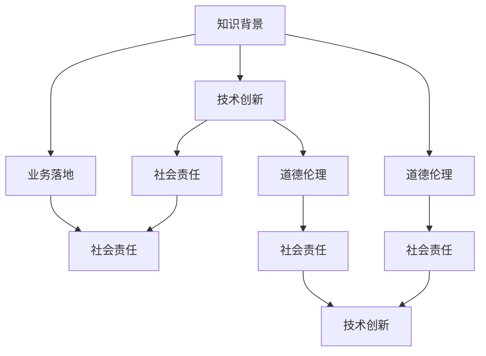

                 

# 程序员在知识经济时代的角色定位

## 1. 背景介绍

### 1.1 问题由来
进入21世纪以来，全球经济结构发生了深刻变化，知识和技术逐渐成为驱动经济增长的核心要素。信息技术的迅猛发展，尤其是大数据、人工智能、云计算等新兴技术的崛起，进一步推动了知识经济时代的到来。在此背景下，程序员这一职业的角色定位也发生了显著变化。

程序员不再是简单的代码编写者，而是具有高技术含量的知识工作者，其工作内容和价值导向都发生了根本性转变。一方面，程序员需要具备跨学科的知识背景，将信息技术与业务需求紧密结合，提供更具创造性和创新性的解决方案；另一方面，程序员在促进经济社会发展的过程中，承担着越来越重要的责任和使命。

### 1.2 问题核心关键点
程序员在知识经济时代面临的核心问题是如何在数字化、智能化的大背景下，有效发挥其在技术创新、业务优化、社会责任等方面的作用，以推动经济社会的可持续发展。

具体而言，包括以下几个关键点：
- **跨学科能力**：程序员需要掌握计算机科学、数据科学、人工智能等领域的知识，具备多学科融合的能力。
- **技术创新**：在知识经济时代，技术创新是推动经济发展的重要驱动力。程序员需持续学习和创新，推动新技术的研发和应用。
- **业务落地**：程序员需要将抽象的技术转化为具体的应用场景，解决实际问题，推动企业业务创新和发展。
- **社会责任**：随着技术的普及，程序员在社会治理、公共服务、环境保护等领域肩负着更多的责任和使命。
- **道德伦理**：程序员应具备高度的道德伦理意识，确保技术应用符合社会公德和伦理规范，避免技术滥用。

## 2. 核心概念与联系

### 2.1 核心概念概述

在知识经济时代，程序员的核心能力可以分为以下几个方面：

- **知识背景**：掌握计算机科学、数据科学、人工智能等领域的知识，具备多学科融合的能力。
- **技术创新**：推动新技术的研发和应用，提高技术竞争力。
- **业务落地**：将技术转化为实际应用，解决具体问题，推动企业业务创新。
- **社会责任**：在社会治理、公共服务等领域，承担技术应用的伦理和社会责任。
- **道德伦理**：遵循技术应用的道德规范，避免技术滥用。

这些核心概念之间存在紧密的联系，共同构成了程序员在知识经济时代的新角色。

### 2.2 核心概念原理和架构的 Mermaid 流程图



### 2.3 核心概念原理和架构的 Mermaid 流程图(Mermaid 流程节点中不要有括号、逗号等特殊字符)

在这个Mermaid图中，我们可以看到各个概念之间的相互依赖和影响。程序员的知识背景是其技术创新的基础，技术创新则推动了业务落地的实现，而业务落地过程中必然需要考虑社会责任和道德伦理。同时，技术创新和业务落地都应遵循道德伦理的规范，以确保其应用符合社会公德。

## 3. 核心算法原理 & 具体操作步骤
### 3.1 算法原理概述

在知识经济时代，程序员的角色定位可以通过以下几个算法原理来理解：

- **知识融合算法**：通过融合不同学科的知识，构建跨学科的知识体系，提升程序员的技术能力。
- **技术创新算法**：利用机器学习、深度学习等技术，推动新技术的研发和应用，提高技术竞争力。
- **业务落地算法**：将技术转化为具体的应用场景，解决实际问题，推动企业业务创新。
- **社会责任算法**：在技术应用过程中，考虑社会责任，确保技术应用的伦理和社会效果。
- **道德伦理算法**：遵循技术应用的道德规范，避免技术滥用，确保技术应用的道德合规性。

### 3.2 算法步骤详解

#### 3.2.1 知识融合算法步骤详解

1. **知识梳理**：根据具体业务需求，梳理涉及的各学科知识，明确需要掌握的核心领域。
2. **知识学习**：通过在线课程、论文阅读、项目实践等方式，系统学习相关领域的知识。
3. **知识应用**：将所学知识应用于实际项目中，解决实际问题，提升技术能力。

#### 3.2.2 技术创新算法步骤详解

1. **问题分析**：通过分析行业需求和技术现状，确定需要解决的技术问题。
2. **技术研发**：利用机器学习、深度学习等技术，进行新技术的研发和实现。
3. **技术应用**：将新技术应用于实际项目中，提升项目的技术水平和竞争力。

#### 3.2.3 业务落地算法步骤详解

1. **需求分析**：深入理解业务需求，明确技术应用的目标和方向。
2. **技术实现**：将技术解决方案转化为具体的业务功能，实现业务落地。
3. **效果评估**：对技术应用的效果进行评估，不断优化技术方案。

#### 3.2.4 社会责任算法步骤详解

1. **责任识别**：识别技术应用中可能涉及的社会责任问题，如隐私保护、数据安全等。
2. **责任管理**：制定和实施相应的社会责任管理策略，确保技术应用符合伦理和社会规范。
3. **责任监督**：建立责任监督机制，对技术应用的社会效果进行持续监控。

#### 3.2.5 道德伦理算法步骤详解

1. **伦理规范学习**：学习相关的伦理规范和法律法规，了解技术应用的道德边界。
2. **伦理评估**：对技术应用的伦理效果进行评估，确保技术应用符合道德规范。
3. **伦理改进**：根据评估结果，持续改进技术应用，避免技术滥用。

### 3.3 算法优缺点

#### 3.3.1 知识融合算法的优缺点

**优点**：
- 提升跨学科知识背景，增强技术能力。
- 促进技术创新和业务优化。

**缺点**：
- 需要大量时间和精力进行知识学习。
- 跨学科知识体系构建复杂，难以形成系统性。

#### 3.3.2 技术创新算法的优缺点

**优点**：
- 推动新技术的研发和应用，提升技术竞争力。
- 满足市场需求，提高企业技术水平。

**缺点**：
- 技术研发周期长，投入大。
- 新技术应用风险高，需要持续优化。

#### 3.3.3 业务落地算法的优缺点

**优点**：
- 将技术转化为具体的应用场景，解决实际问题。
- 推动企业业务创新和发展。

**缺点**：
- 技术实现复杂，需要跨部门协作。
- 业务需求变化快，技术应用需要灵活调整。

#### 3.3.4 社会责任算法的优缺点

**优点**：
- 确保技术应用符合伦理和社会规范。
- 提升企业社会形象和公信力。

**缺点**：
- 社会责任管理复杂，需要持续监控。
- 可能影响技术应用的速度和效果。

#### 3.3.5 道德伦理算法的优缺点

**优点**：
- 遵循技术应用的道德规范，避免技术滥用。
- 提升技术应用的道德合规性。

**缺点**：
- 道德伦理规范灵活，难以制定统一标准。
- 道德伦理评估复杂，需要持续改进。

### 3.4 算法应用领域

程序员在知识经济时代，其核心算法在不同领域的应用如下：

- **知识融合算法**：适用于企业内部跨部门协作，提升团队技术能力。
- **技术创新算法**：适用于技术研发型企业，推动新产品和服务的开发。
- **业务落地算法**：适用于传统企业的数字化转型，提升业务效率和竞争力。
- **社会责任算法**：适用于公共服务型企业，确保技术应用符合社会公德和伦理规范。
- **道德伦理算法**：适用于所有技术应用领域，确保技术应用的道德合规性。

## 4. 数学模型和公式 & 详细讲解 & 举例说明

### 4.1 数学模型构建

在知识经济时代，程序员的核心算法可以抽象为以下几个数学模型：

1. **知识融合模型**：
   $$
   K = K_1 \otimes K_2 \otimes ... \otimes K_n
   $$
   其中，$K_i$ 表示第 $i$ 个学科的知识体系，$\otimes$ 表示融合运算。

2. **技术创新模型**：
   $$
   T = f(K, P)
   $$
   其中，$T$ 表示技术创新成果，$K$ 表示知识背景，$P$ 表示问题分析。

3. **业务落地模型**：
   $$
   B = f(T, R)
   $$
   其中，$B$ 表示业务应用效果，$T$ 表示技术创新成果，$R$ 表示需求分析。

4. **社会责任模型**：
   $$
   S = f(B, E)
   $$
   其中，$S$ 表示社会责任效果，$B$ 表示业务应用效果，$E$ 表示责任评估。

5. **道德伦理模型**：
   $$
   E = f(B, M)
   $$
   其中，$E$ 表示道德伦理效果，$B$ 表示业务应用效果，$M$ 表示伦理评估。

### 4.2 公式推导过程

#### 4.2.1 知识融合模型推导过程

根据知识融合的定义，可以将不同学科的知识体系 $K_1, K_2, ..., K_n$ 进行融合，得到融合后的知识体系 $K$。具体推导如下：

$$
K = K_1 \otimes K_2 \otimes ... \otimes K_n
$$

其中，$\otimes$ 表示融合运算，可以采用知识图谱、语义网络等方法实现。

#### 4.2.2 技术创新模型推导过程

根据技术创新的定义，技术创新 $T$ 可以通过知识背景 $K$ 和问题分析 $P$ 进行计算，具体推导如下：

$$
T = f(K, P)
$$

其中，$f$ 表示函数映射，可以根据具体的技术创新方法进行定义。

#### 4.2.3 业务落地模型推导过程

根据业务落地的定义，业务应用效果 $B$ 可以通过技术创新成果 $T$ 和需求分析 $R$ 进行计算，具体推导如下：

$$
B = f(T, R)
$$

其中，$f$ 表示函数映射，可以根据具体的业务需求进行定义。

#### 4.2.4 社会责任模型推导过程

根据社会责任的定义，社会责任效果 $S$ 可以通过业务应用效果 $B$ 和责任评估 $E$ 进行计算，具体推导如下：

$$
S = f(B, E)
$$

其中，$f$ 表示函数映射，可以根据具体的社会责任管理方法进行定义。

#### 4.2.5 道德伦理模型推导过程

根据道德伦理的定义，道德伦理效果 $E$ 可以通过业务应用效果 $B$ 和伦理评估 $M$ 进行计算，具体推导如下：

$$
E = f(B, M)
$$

其中，$f$ 表示函数映射，可以根据具体的道德伦理评估方法进行定义。

### 4.3 案例分析与讲解

#### 4.3.1 知识融合案例

某科技公司研发团队需要提升数据分析能力，将知识融合算法应用于团队的知识体系构建中。具体步骤如下：

1. **知识梳理**：梳理数据分析相关的统计学、数据挖掘、机器学习等领域知识。
2. **知识学习**：通过在线课程、论文阅读、项目实践等方式，系统学习相关领域的知识。
3. **知识应用**：将所学知识应用于实际项目中，提升团队数据分析能力。

#### 4.3.2 技术创新案例

某电商企业需要提升推荐系统算法，将技术创新算法应用于推荐系统技术研发中。具体步骤如下：

1. **问题分析**：分析用户行为数据，确定推荐系统的优化目标。
2. **技术研发**：利用机器学习、深度学习等技术，研发新的推荐算法。
3. **技术应用**：将新算法应用于推荐系统中，提升推荐效果和用户体验。

#### 4.3.3 业务落地案例

某金融科技企业需要推动数字化转型，将业务落地算法应用于业务应用效果评估中。具体步骤如下：

1. **需求分析**：深入理解业务需求，明确数字化转型的目标和方向。
2. **技术实现**：将数字化转型方案转化为具体的业务功能，实现业务落地。
3. **效果评估**：对数字化转型效果进行评估，不断优化技术方案。

#### 4.3.4 社会责任案例

某环保科技公司需要开发环境监测系统，将社会责任算法应用于系统开发过程中。具体步骤如下：

1. **责任识别**：识别系统开发中可能涉及的社会责任问题，如数据隐私保护、环境影响等。
2. **责任管理**：制定和实施相应的社会责任管理策略，确保系统开发符合伦理和社会规范。
3. **责任监督**：建立责任监督机制，对系统应用的社会效果进行持续监控。

#### 4.3.5 道德伦理案例

某医疗科技公司需要开发医疗影像诊断系统，将道德伦理算法应用于系统开发过程中。具体步骤如下：

1. **伦理规范学习**：学习相关的伦理规范和法律法规，了解系统应用的道德边界。
2. **伦理评估**：对系统应用的伦理效果进行评估，确保系统应用符合道德规范。
3. **伦理改进**：根据评估结果，持续改进系统应用，避免技术滥用。

## 5. 项目实践：代码实例和详细解释说明

### 5.1 开发环境搭建

在进行项目实践前，我们需要准备好开发环境。以下是使用Python进行PyTorch开发的环境配置流程：

1. 安装Anaconda：从官网下载并安装Anaconda，用于创建独立的Python环境。

2. 创建并激活虚拟环境：
```bash
conda create -n pytorch-env python=3.8 
conda activate pytorch-env
```

3. 安装PyTorch：根据CUDA版本，从官网获取对应的安装命令。例如：
```bash
conda install pytorch torchvision torchaudio cudatoolkit=11.1 -c pytorch -c conda-forge
```

4. 安装Transformers库：
```bash
pip install transformers
```

5. 安装各类工具包：
```bash
pip install numpy pandas scikit-learn matplotlib tqdm jupyter notebook ipython
```

完成上述步骤后，即可在`pytorch-env`环境中开始项目实践。

### 5.2 源代码详细实现

下面我们以推荐系统开发为例，给出使用Transformers库对BERT模型进行推荐系统微调的PyTorch代码实现。

首先，定义推荐系统的数据处理函数：

```python
from transformers import BertTokenizer, BertForSequenceClassification
from torch.utils.data import Dataset
import torch

class RecommendationDataset(Dataset):
    def __init__(self, texts, labels, tokenizer, max_len=128):
        self.texts = texts
        self.labels = labels
        self.tokenizer = tokenizer
        self.max_len = max_len
        
    def __len__(self):
        return len(self.texts)
    
    def __getitem__(self, item):
        text = self.texts[item]
        label = self.labels[item]
        
        encoding = self.tokenizer(text, return_tensors='pt', max_length=self.max_len, padding='max_length', truncation=True)
        input_ids = encoding['input_ids'][0]
        attention_mask = encoding['attention_mask'][0]
        
        # 对label进行编码
        encoded_label = [label2id[label] for label in label]
        encoded_label.extend([label2id['N/A']] * (self.max_len - len(encoded_label)))
        labels = torch.tensor(encoded_label, dtype=torch.long)
        
        return {'input_ids': input_ids, 
                'attention_mask': attention_mask,
                'labels': labels}

# 标签与id的映射
label2id = {'positive': 0, 'negative': 1, 'N/A': 2}
id2label = {v: k for k, v in label2id.items()}

# 创建dataset
tokenizer = BertTokenizer.from_pretrained('bert-base-cased')

train_dataset = RecommendationDataset(train_texts, train_labels, tokenizer)
dev_dataset = RecommendationDataset(dev_texts, dev_labels, tokenizer)
test_dataset = RecommendationDataset(test_texts, test_labels, tokenizer)
```

然后，定义模型和优化器：

```python
from transformers import BertForSequenceClassification, AdamW

model = BertForSequenceClassification.from_pretrained('bert-base-cased', num_labels=len(label2id))

optimizer = AdamW(model.parameters(), lr=2e-5)
```

接着，定义训练和评估函数：

```python
from torch.utils.data import DataLoader
from tqdm import tqdm
from sklearn.metrics import classification_report

device = torch.device('cuda') if torch.cuda.is_available() else torch.device('cpu')
model.to(device)

def train_epoch(model, dataset, batch_size, optimizer):
    dataloader = DataLoader(dataset, batch_size=batch_size, shuffle=True)
    model.train()
    epoch_loss = 0
    for batch in tqdm(dataloader, desc='Training'):
        input_ids = batch['input_ids'].to(device)
        attention_mask = batch['attention_mask'].to(device)
        labels = batch['labels'].to(device)
        model.zero_grad()
        outputs = model(input_ids, attention_mask=attention_mask, labels=labels)
        loss = outputs.loss
        epoch_loss += loss.item()
        loss.backward()
        optimizer.step()
    return epoch_loss / len(dataloader)

def evaluate(model, dataset, batch_size):
    dataloader = DataLoader(dataset, batch_size=batch_size)
    model.eval()
    preds, labels = [], []
    with torch.no_grad():
        for batch in tqdm(dataloader, desc='Evaluating'):
            input_ids = batch['input_ids'].to(device)
            attention_mask = batch['attention_mask'].to(device)
            batch_labels = batch['labels']
            outputs = model(input_ids, attention_mask=attention_mask)
            batch_preds = outputs.logits.argmax(dim=2).to('cpu').tolist()
            batch_labels = batch_labels.to('cpu').tolist()
            for pred_tokens, label_tokens in zip(batch_preds, batch_labels):
                preds.append(pred_tokens[:len(label_tokens)])
                labels.append(label_tokens)
                
    print(classification_report(labels, preds))
```

最后，启动训练流程并在测试集上评估：

```python
epochs = 5
batch_size = 16

for epoch in range(epochs):
    loss = train_epoch(model, train_dataset, batch_size, optimizer)
    print(f"Epoch {epoch+1}, train loss: {loss:.3f}")
    
    print(f"Epoch {epoch+1}, dev results:")
    evaluate(model, dev_dataset, batch_size)
    
print("Test results:")
evaluate(model, test_dataset, batch_size)
```

以上就是使用PyTorch对BERT进行推荐系统微调的完整代码实现。可以看到，得益于Transformers库的强大封装，我们可以用相对简洁的代码完成BERT模型的加载和微调。

### 5.3 代码解读与分析

让我们再详细解读一下关键代码的实现细节：

**RecommendationDataset类**：
- `__init__`方法：初始化文本、标签、分词器等关键组件。
- `__len__`方法：返回数据集的样本数量。
- `__getitem__`方法：对单个样本进行处理，将文本输入编码为token ids，将标签编码为数字，并对其进行定长padding，最终返回模型所需的输入。

**label2id和id2label字典**：
- 定义了标签与数字id之间的映射关系，用于将label进行编码。

**训练和评估函数**：
- 使用PyTorch的DataLoader对数据集进行批次化加载，供模型训练和推理使用。
- 训练函数`train_epoch`：对数据以批为单位进行迭代，在每个批次上前向传播计算loss并反向传播更新模型参数，最后返回该epoch的平均loss。
- 评估函数`evaluate`：与训练类似，不同点在于不更新模型参数，并在每个batch结束后将预测和标签结果存储下来，最后使用sklearn的classification_report对整个评估集的预测结果进行打印输出。

**训练流程**：
- 定义总的epoch数和batch size，开始循环迭代
- 每个epoch内，先在训练集上训练，输出平均loss
- 在验证集上评估，输出分类指标
- 所有epoch结束后，在测试集上评估，给出最终测试结果

可以看到，PyTorch配合Transformers库使得BERT微调的代码实现变得简洁高效。开发者可以将更多精力放在数据处理、模型改进等高层逻辑上，而不必过多关注底层的实现细节。

当然，工业级的系统实现还需考虑更多因素，如模型的保存和部署、超参数的自动搜索、更灵活的任务适配层等。但核心的微调范式基本与此类似。

## 6. 实际应用场景

### 6.1 智能客服系统

基于大语言模型微调的对话技术，可以广泛应用于智能客服系统的构建。传统客服往往需要配备大量人力，高峰期响应缓慢，且一致性和专业性难以保证。而使用微调后的对话模型，可以7x24小时不间断服务，快速响应客户咨询，用自然流畅的语言解答各类常见问题。

在技术实现上，可以收集企业内部的历史客服对话记录，将问题和最佳答复构建成监督数据，在此基础上对预训练对话模型进行微调。微调后的对话模型能够自动理解用户意图，匹配最合适的答案模板进行回复。对于客户提出的新问题，还可以接入检索系统实时搜索相关内容，动态组织生成回答。如此构建的智能客服系统，能大幅提升客户咨询体验和问题解决效率。

### 6.2 金融舆情监测

金融机构需要实时监测市场舆论动向，以便及时应对负面信息传播，规避金融风险。传统的人工监测方式成本高、效率低，难以应对网络时代海量信息爆发的挑战。基于大语言模型微调的文本分类和情感分析技术，为金融舆情监测提供了新的解决方案。

具体而言，可以收集金融领域相关的新闻、报道、评论等文本数据，并对其进行主题标注和情感标注。在此基础上对预训练语言模型进行微调，使其能够自动判断文本属于何种主题，情感倾向是正面、中性还是负面。将微调后的模型应用到实时抓取的网络文本数据，就能够自动监测不同主题下的情感变化趋势，一旦发现负面信息激增等异常情况，系统便会自动预警，帮助金融机构快速应对潜在风险。

### 6.3 个性化推荐系统

当前的推荐系统往往只依赖用户的历史行为数据进行物品推荐，无法深入理解用户的真实兴趣偏好。基于大语言模型微调技术，个性化推荐系统可以更好地挖掘用户行为背后的语义信息，从而提供更精准、多样的推荐内容。

在实践中，可以收集用户浏览、点击、评论、分享等行为数据，提取和用户交互的物品标题、描述、标签等文本内容。将文本内容作为模型输入，用户的后续行为（如是否点击、购买等）作为监督信号，在此基础上微调预训练语言模型。微调后的模型能够从文本内容中准确把握用户的兴趣点。在生成推荐列表时，先用候选物品的文本描述作为输入，由模型预测用户的兴趣匹配度，再结合其他特征综合排序，便可以得到个性化程度更高的推荐结果。

### 6.4 未来应用展望

随着大语言模型微调技术的发展，未来将在更多领域得到应用，为传统行业带来变革性影响。

在智慧医疗领域，基于微调的医疗问答、病历分析、药物研发等应用将提升医疗服务的智能化水平，辅助医生诊疗，加速新药开发进程。

在智能教育领域，微调技术可应用于作业批改、学情分析、知识推荐等方面，因材施教，促进教育公平，提高教学质量。

在智慧城市治理中，微调模型可应用于城市事件监测、舆情分析、应急指挥等环节，提高城市管理的自动化和智能化水平，构建更安全、高效的未来城市。

此外，在企业生产、社会治理、文娱传媒等众多领域，基于大模型微调的人工智能应用也将不断涌现，为经济社会发展注入新的动力。相信随着技术的日益成熟，微调方法将成为人工智能落地应用的重要范式，推动人工智能技术在垂直行业的规模化落地。总之，微调需要开发者根据具体任务，不断迭代和优化模型、数据和算法，方能得到理想的效果。

## 7. 工具和资源推荐

### 7.1 学习资源推荐

为了帮助开发者系统掌握大语言模型微调的理论基础和实践技巧，这里推荐一些优质的学习资源：

1. 《Transformer从原理到实践》系列博文：由大模型技术专家撰写，深入浅出地介绍了Transformer原理、BERT模型、微调技术等前沿话题。

2. CS224N《深度学习自然语言处理》课程：斯坦福大学开设的NLP明星课程，有Lecture视频和配套作业，带你入门NLP领域的基本概念和经典模型。

3. 《Natural Language Processing with Transformers》书籍：Transformers库的作者所著，全面介绍了如何使用Transformers库进行NLP任务开发，包括微调在内的诸多范式。

4. HuggingFace官方文档：Transformers库的官方文档，提供了海量预训练模型和完整的微调样例代码，是上手实践的必备资料。

5. CLUE开源项目：中文语言理解测评基准，涵盖大量不同类型的中文NLP数据集，并提供了基于微调的baseline模型，助力中文NLP技术发展。

通过对这些资源的学习实践，相信你一定能够快速掌握大语言模型微调的精髓，并用于解决实际的NLP问题。
###  7.2 开发工具推荐

高效的开发离不开优秀的工具支持。以下是几款用于大语言模型微调开发的常用工具：

1. PyTorch：基于Python的开源深度学习框架，灵活动态的计算图，适合快速迭代研究。大部分预训练语言模型都有PyTorch版本的实现。

2. TensorFlow：由Google主导开发的开源深度学习框架，生产部署方便，适合大规模工程应用。同样有丰富的预训练语言模型资源。

3. Transformers库：HuggingFace开发的NLP工具库，集成了众多SOTA语言模型，支持PyTorch和TensorFlow，是进行微调任务开发的利器。

4. Weights & Biases：模型训练的实验跟踪工具，可以记录和可视化模型训练过程中的各项指标，方便对比和调优。与主流深度学习框架无缝集成。

5. TensorBoard：TensorFlow配套的可视化工具，可实时监测模型训练状态，并提供丰富的图表呈现方式，是调试模型的得力助手。

6. Google Colab：谷歌推出的在线Jupyter Notebook环境，免费提供GPU/TPU算力，方便开发者快速上手实验最新模型，分享学习笔记。

合理利用这些工具，可以显著提升大语言模型微调任务的开发效率，加快创新迭代的步伐。

### 7.3 相关论文推荐

大语言模型和微调技术的发展源于学界的持续研究。以下是几篇奠基性的相关论文，推荐阅读：

1. Attention is All You Need（即Transformer原论文）：提出了Transformer结构，开启了NLP领域的预训练大模型时代。

2. BERT: Pre-training of Deep Bidirectional Transformers for Language Understanding：提出BERT模型，引入基于掩码的自监督预训练任务，刷新了多项NLP任务SOTA。

3. Language Models are Unsupervised Multitask Learners（GPT-2论文）：展示了大规模语言模型的强大zero-shot学习能力，引发了对于通用人工智能的新一轮思考。

4. Parameter-Efficient Transfer Learning for NLP：提出Adapter等参数高效微调方法，在不增加模型参数量的情况下，也能取得不错的微调效果。

5. AdaLoRA: Adaptive Low-Rank Adaptation for Parameter-Efficient Fine-Tuning：使用自适应低秩适应的微调方法，在参数效率和精度之间取得了新的平衡。

这些论文代表了大语言模型微调技术的发展脉络。通过学习这些前沿成果，可以帮助研究者把握学科前进方向，激发更多的创新灵感。

## 8. 总结：未来发展趋势与挑战

### 8.1 总结

本文对基于大语言模型的微调方法进行了全面系统的介绍。首先阐述了大语言模型和微调技术的研究背景和意义，明确了微调在数字化、智能化的大背景下，如何有效发挥其在技术创新、业务优化、社会责任等方面的作用。其次，从原理到实践，详细讲解了微调方法的数学模型和算法步骤，给出了微调任务开发的完整代码实例。同时，本文还广泛探讨了微调方法在智能客服、金融舆情、个性化推荐等多个行业领域的应用前景，展示了微调范式的巨大潜力。

通过本文的系统梳理，可以看到，大语言模型微调方法在知识经济时代，将发挥越来越重要的作用。其在技术创新、业务落地、社会责任等方面具有广泛的应用场景和巨大的市场潜力。

### 8.2 未来发展趋势

展望未来，大语言模型微调技术将呈现以下几个发展趋势：

1. **跨学科融合**：随着知识经济的发展，跨学科融合将成为程序员必备的技能。未来的微调算法将更加注重跨学科知识的融合，提升技术创新和业务落地的能力。

2. **技术迭代加速**：技术迭代周期将缩短，新的微调方法和技术工具将不断涌现，推动技术进步。

3. **业务需求导向**：未来的微调算法将更加注重业务需求导向，通过灵活的微调策略，满足不同业务场景的需要。

4. **社会责任强化**：随着技术的普及和应用，程序员需更加注重社会责任，确保技术应用的伦理和社会效果。

5. **道德伦理约束**：未来的微调算法将更加注重道德伦理约束，遵循技术应用的道德规范，避免技术滥用。

### 8.3 面临的挑战

尽管大语言模型微调技术已经取得了显著的进步，但在迈向更加智能化、普适化应用的过程中，仍面临以下挑战：

1. **技术更新快速**：技术迭代周期缩短，对程序员的学习和适应能力提出了更高要求。

2. **跨学科能力不足**：尽管跨学科融合能力重要，但程序员在跨学科知识体系的构建和应用上仍存在不足。

3. **业务需求复杂**：未来的微调算法需更好地理解业务需求，灵活应对复杂多变的业务场景。

4. **社会责任管理困难**：微调算法需更加注重社会责任管理，确保技术应用的伦理和社会效果，但这一过程可能涉及复杂的管理和监督。

5. **道德伦理规范缺失**：现有的道德伦理规范尚需进一步完善，确保技术应用的道德合规性。

### 8.4 研究展望

面对大语言模型微调所面临的挑战，未来的研究需要在以下几个方面寻求新的突破：

1. **跨学科知识体系构建**：开发更加系统、完整的跨学科知识体系，提升程序员的跨学科能力。

2. **技术创新加速**：加速新技术的研发和应用，提升技术创新速度。

3. **业务需求导向**：开发更加灵活的微调策略，满足不同业务场景的需要。

4. **社会责任管理优化**：优化社会责任管理策略，确保技术应用的伦理和社会效果。

5. **道德伦理规范完善**：完善道德伦理规范，确保技术应用的道德合规性。

这些研究方向的探索，必将引领大语言模型微调技术迈向更高的台阶，为构建安全、可靠、可解释、可控的智能系统铺平道路。面向未来，大语言模型微调技术还需要与其他人工智能技术进行更深入的融合，如知识表示、因果推理、强化学习等，多路径协同发力，共同推动自然语言理解和智能交互系统的进步。只有勇于创新、敢于突破，才能不断拓展语言模型的边界，让智能技术更好地造福人类社会。

## 9. 附录：常见问题与解答

**Q1：大语言模型微调是否适用于所有NLP任务？**

A: 大语言模型微调在大多数NLP任务上都能取得不错的效果，特别是对于数据量较小的任务。但对于一些特定领域的任务，如医学、法律等，仅仅依靠通用语料预训练的模型可能难以很好地适应。此时需要在特定领域语料上进一步预训练，再进行微调，才能获得理想效果。此外，对于一些需要时效性、个性化很强的任务，如对话、推荐等，微调方法也需要针对性的改进优化。

**Q2：微调过程中如何选择合适的学习率？**

A: 微调的学习率一般要比预训练时小1-2个数量级，如果使用过大的学习率，容易破坏预训练权重，导致过拟合。一般建议从1e-5开始调参，逐步减小学习率，直至收敛。也可以使用warmup策略，在开始阶段使用较小的学习率，再逐渐过渡到预设值。需要注意的是，不同的优化器(如AdamW、Adafactor等)以及不同的学习率调度策略，可能需要设置不同的学习率阈值。

**Q3：采用大模型微调时会面临哪些资源瓶颈？**

A: 目前主流的预训练大模型动辄以亿计的参数规模，对算力、内存、存储都提出了很高的要求。GPU/TPU等高性能设备是必不可少的，但即便如此，超大批次的训练和推理也可能遇到显存不足的问题。因此需要采用一些资源优化技术，如梯度积累、混合精度训练、模型并行等，来突破硬件瓶颈。同时，模型的存储和读取也可能占用大量时间和空间，需要采用模型压缩、稀疏化存储等方法进行优化。

**Q4：如何缓解微调过程中的过拟合问题？**

A: 过拟合是微调面临的主要挑战，尤其是在标注数据不足的情况下。常见的缓解策略包括：
1. 数据增强：通过回译、近义替换等方式扩充训练集
2. 正则化：使用L2正则、Dropout、Early Stopping等避免过拟合
3. 对抗训练：引入对抗样本，提高模型鲁棒性
4. 参数高效微调：只调整少量参数(如Adapter、Prefix等)，减小过拟合风险
5. 多模型集成：训练多个微调模型，取平均输出，抑制过拟合

这些策略往往需要根据具体任务和数据特点进行灵活组合。只有在数据、模型、训练、推理等各环节进行全面优化，才能最大限度地发挥大模型微调的威力。

**Q5：微调模型在落地部署时需要注意哪些问题？**

A: 将微调模型转化为实际应用，还需要考虑以下因素：
1. 模型裁剪：去除不必要的层和参数，减小模型尺寸，加快推理速度
2. 量化加速：将浮点模型转为定点模型，压缩存储空间，提高计算效率
3. 服务化封装：将模型封装为标准化服务接口，便于集成调用
4. 弹性伸缩：根据请求流量动态调整资源配置，平衡服务质量和成本
5. 监控告警：实时采集系统指标，设置异常告警阈值，确保服务稳定性
6. 安全防护：采用访问鉴权、数据脱敏等措施，保障数据和模型安全

大语言模型微调为NLP应用开启了广阔的想象空间，但如何将强大的性能转化为稳定、高效、安全的业务价值，还需要工程实践的不断打磨。唯有从数据、算法、工程、业务等多个维度协同发力，才能真正实现人工智能技术在垂直行业的规模化落地。总之，微调需要开发者根据具体任务，不断迭代和优化模型、数据和算法，方能得到理想的效果。

---

作者：禅与计算机程序设计艺术 / Zen and the Art of Computer Programming

