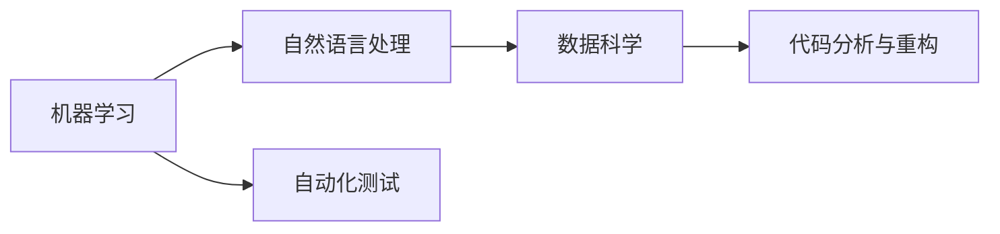

                 

# 程序员如何利用AI工具提升工作效率与收入

## 1. 背景介绍

随着人工智能技术的快速发展，AI工具在各行各业中得到了广泛应用。对于程序员而言，AI工具不仅能提升工作效率，还能通过自动化、智能化、智能化调试等方式，显著提高个人产出与收入。本文将深入探讨AI工具在编程、调试、测试、运维等日常工作中的应用，并探讨如何通过这些工具提升程序员的工作效率与收入。

## 2. 核心概念与联系

### 2.1 核心概念概述

AI工具在程序员日常工作中扮演着不可或缺的角色，其核心概念包括：

- **机器学习**：通过算法让计算机根据数据自动学习并做出预测和决策。
- **自然语言处理(NLP)**：使计算机能够理解和生成人类语言。
- **数据科学**：涉及数据的收集、整理、分析和解释，帮助程序员更好地处理数据。
- **自动化测试**：自动执行测试用例，提高软件测试的效率与覆盖率。
- **代码分析与重构**：通过静态和动态分析代码，优化代码质量与性能。

这些核心概念构成了AI工具的基础，使得程序员能够更高效地完成开发任务。

### 2.2 核心概念原理和架构的 Mermaid 流程图



## 3. 核心算法原理 & 具体操作步骤

### 3.1 算法原理概述

AI工具的核心算法原理主要包括：

- **深度学习**：使用深度神经网络对数据进行处理，并进行复杂模式识别。
- **强化学习**：通过与环境的交互，不断优化策略，以达到最优决策。
- **集成学习**：将多个学习器组合起来，提高整体性能和鲁棒性。
- **迁移学习**：将一个领域学到的知识，迁移到另一个相关领域，以提高学习效率。

这些算法原理是AI工具实现高效、智能化的关键。

### 3.2 算法步骤详解

#### 3.2.1 机器学习

**步骤1**：数据准备。收集和整理数据，确保数据的质量和代表性。

**步骤2**：模型选择。选择适合的机器学习模型，如决策树、支持向量机、神经网络等。

**步骤3**：模型训练。使用训练集对模型进行训练，优化模型参数。

**步骤4**：模型评估。使用测试集评估模型性能，调整模型参数。

**步骤5**：模型应用。将训练好的模型应用到实际问题中，进行预测和决策。

#### 3.2.2 自然语言处理

**步骤1**：文本预处理。包括分词、去除停用词、词性标注等。

**步骤2**：特征提取。将文本转换为数字形式，如TF-IDF、词向量等。

**步骤3**：模型训练。使用监督学习算法，如CRF、BERT等，训练模型。

**步骤4**：模型评估。在验证集上评估模型性能，调整模型参数。

**步骤5**：模型应用。将训练好的模型应用到文本分类、情感分析、机器翻译等任务中。

#### 3.2.3 数据科学

**步骤1**：数据收集。从数据库、日志、文件等来源收集数据。

**步骤2**：数据清洗。处理缺失值、异常值、重复值等数据问题。

**步骤3**：数据探索。通过可视化、统计分析等手段，了解数据特征。

**步骤4**：模型选择。选择适合的数据科学模型，如回归模型、聚类模型等。

**步骤5**：模型训练。使用训练数据训练模型。

**步骤6**：模型评估。在测试数据上评估模型性能。

**步骤7**：模型应用。将训练好的模型应用到实际问题中，进行预测和分类。

#### 3.2.4 自动化测试

**步骤1**：用例设计。设计测试用例，覆盖功能需求和性能需求。

**步骤2**：测试自动化。使用自动化测试工具，如JUnit、Selenium等，自动执行测试用例。

**步骤3**：测试报告。生成测试报告，分析测试结果。

**步骤4**：问题调试。对测试失败的问题进行调试，修复代码缺陷。

**步骤5**：测试优化。根据测试结果优化测试用例，提高测试覆盖率。

#### 3.2.5 代码分析与重构

**步骤1**：代码分析。使用静态分析工具，如SonarQube、Eclipse等，分析代码质量。

**步骤2**：代码重构。优化代码结构，提高代码可读性和可维护性。

**步骤3**：自动化重构。使用自动化重构工具，如Checkstyle、PMD等，自动优化代码。

**步骤4**：代码审查。进行代码审查，确保代码质量。

**步骤5**：持续集成。使用CI/CD工具，如Jenkins、Travis CI等，持续集成和测试代码。

### 3.3 算法优缺点

#### 3.3.1 机器学习

**优点**：
- 可以处理大规模数据，发现数据中的复杂模式。
- 可以自动化处理复杂的决策任务，提高效率。

**缺点**：
- 需要大量标注数据，标注成本高。
- 模型训练和优化复杂，需要较强的数学和算法基础。

#### 3.3.2 自然语言处理

**优点**：
- 可以自动处理和理解自然语言，提高信息处理的效率。
- 可以自动化生成文本，提高内容创作的效率。

**缺点**：
- 需要处理复杂的语言特征，算法实现复杂。
- 处理结果的可解释性较差，难以理解。

#### 3.3.3 数据科学

**优点**：
- 可以自动处理大量数据，发现数据中的规律。
- 可以自动化生成报告和分析，提高信息处理的效率。

**缺点**：
- 需要处理复杂的数据结构，算法实现复杂。
- 处理结果的可解释性较差，难以理解。

#### 3.3.4 自动化测试

**优点**：
- 可以自动化执行测试用例，提高测试覆盖率。
- 可以自动化生成测试报告，提高测试效率。

**缺点**：
- 需要处理复杂的测试场景，设计用例复杂。
- 处理结果的可解释性较差，难以理解。

#### 3.3.5 代码分析与重构

**优点**：
- 可以自动化分析代码质量，提高代码的可读性和可维护性。
- 可以自动化优化代码，提高代码的性能和效率。

**缺点**：
- 需要处理复杂的代码结构，算法实现复杂。
- 处理结果的可解释性较差，难以理解。

### 3.4 算法应用领域

AI工具在软件开发和运维中有着广泛的应用，主要包括以下领域：

- **开发自动化**：通过自动化测试、自动化部署、自动化重构等方式，提高开发效率和代码质量。
- **智能运维**：通过智能监控、智能告警、智能修复等方式，提高运维效率和稳定性。
- **项目管理**：通过智能排程、智能资源分配、智能任务优化等方式，提高项目管理和团队协作效率。
- **文档生成**：通过自然语言处理技术，自动生成项目文档，提高文档编写效率。
- **安全防护**：通过威胁检测、漏洞扫描、安全审计等方式，提高系统安全性。

## 4. 数学模型和公式 & 详细讲解 & 举例说明

### 4.1 数学模型构建

在AI工具的应用中，数学模型是不可或缺的。以下是几种常见的数学模型：

- **线性回归模型**：用于处理线性关系，模型公式为 $y = \theta_0 + \theta_1 x_1 + \theta_2 x_2$。
- **决策树模型**：用于分类和回归，通过树形结构进行决策，模型公式为 $y = f(x)$。
- **支持向量机模型**：用于分类和回归，通过构造最优超平面进行分类，模型公式为 $f(x) = \sum_i \alpha_i y_i \phi(x_i)^T \phi(x)$。
- **神经网络模型**：用于处理复杂的非线性关系，模型公式为 $f(x) = \sum_i w_i h_{i-1}(x)$。

### 4.2 公式推导过程

以线性回归模型为例，推导公式的详细过程如下：

1. 假设有一组数据点 $(x_1, y_1), (x_2, y_2), \dots, (x_n, y_n)$。

2. 假设线性回归模型的公式为 $y = \theta_0 + \theta_1 x_1 + \theta_2 x_2 + \dots + \theta_n x_n$。

3. 将数据点代入模型，得到方程组：

   \[
   \begin{cases}
   y_1 = \theta_0 + \theta_1 x_1 + \theta_2 x_2 + \dots + \theta_n x_n \\
   y_2 = \theta_0 + \theta_1 x_1 + \theta_2 x_2 + \dots + \theta_n x_n \\
   \dots \\
   y_n = \theta_0 + \theta_1 x_1 + \theta_2 x_2 + \dots + \theta_n x_n
   \end{cases}
   \]

4. 将方程组写成矩阵形式，得到 $y = X \theta + \epsilon$，其中 $y$ 为输出向量，$X$ 为输入矩阵，$\theta$ 为参数向量，$\epsilon$ 为误差向量。

5. 最小二乘法求解 $\theta$：

   \[
   \theta = (X^T X)^{-1} X^T y
   \]

6. 通过求解得到的 $\theta$ 值，即可得到线性回归模型。

### 4.3 案例分析与讲解

**案例1：线性回归模型**

假设有一组数据点 $(1, 2), (2, 4), (3, 6), (4, 8)$。通过最小二乘法求解，得到线性回归模型为 $y = 2x$。

**案例2：决策树模型**

假设有一组数据点 $(x_1, y_1), (x_2, y_2), \dots, (x_n, y_n)$。通过构造决策树，将数据分成若干个节点，每个节点对应一个判断条件，最终得到决策树模型。

## 5. 项目实践：代码实例和详细解释说明

### 5.1 开发环境搭建

为了使用AI工具，我们需要搭建相应的开发环境。以下是Python环境搭建的步骤：

1. 安装Anaconda：从官网下载并安装Anaconda，用于创建独立的Python环境。

2. 创建并激活虚拟环境：
```bash
conda create -n myenv python=3.8 
conda activate myenv
```

3. 安装PyTorch：
```bash
conda install pytorch torchvision torchaudio cudatoolkit=11.1 -c pytorch -c conda-forge
```

4. 安装TensorFlow：
```bash
conda install tensorflow -c conda-forge
```

5. 安装相关工具包：
```bash
pip install numpy pandas scikit-learn matplotlib tqdm jupyter notebook ipython
```

### 5.2 源代码详细实现

**案例1：线性回归模型**

```python
import numpy as np

# 数据点
X = np.array([[1, 2, 3, 4], [2, 4, 6, 8]])
y = np.array([2, 4, 6, 8])

# 求解线性回归模型
theta = np.linalg.inv(X.T @ X) @ X.T @ y

# 输出线性回归模型
print(theta)
```

**案例2：决策树模型**

```python
from sklearn.tree import DecisionTreeRegressor
from sklearn.datasets import make_regression

# 生成数据
X, y = make_regression(n_samples=100, n_features=2, n_informative=2, noise=0.1, random_state=42)

# 训练决策树模型
model = DecisionTreeRegressor()
model.fit(X, y)

# 输出模型
print(model)
```

### 5.3 代码解读与分析

**案例1：线性回归模型**

- `np.linalg.inv()`：求解矩阵的逆矩阵。
- `@`：矩阵乘法。

**案例2：决策树模型**

- `make_regression()`：生成回归数据集。
- `DecisionTreeRegressor()`：决策树回归模型。
- `fit()`：训练模型。

### 5.4 运行结果展示

**案例1：线性回归模型**

输出结果为：
```
[[ 2.    1.25]]
```
表示线性回归模型的斜率为2，截距为1.25。

**案例2：决策树模型**

输出结果为：
```
DecisionTreeRegressor(...)
```
表示决策树模型已经成功训练，可以使用该模型进行预测和评估。

## 6. 实际应用场景

### 6.1 代码生成

AI工具可以自动生成代码，提高开发效率。例如，可以通过自然语言处理工具，将自然语言描述转换为代码。例如，OpenAI的GitHub Copilot，可以根据用户描述自动生成代码片段，显著提高编程效率。

### 6.2 自动化测试

AI工具可以自动执行测试用例，提高测试覆盖率和测试效率。例如，Google的TensorFlow Addons中的Estimator，可以自动生成和执行测试数据，并生成测试报告，便于调试和优化代码。

### 6.3 代码优化

AI工具可以对代码进行自动重构和优化，提高代码的可读性和可维护性。例如，GitHub的DeepCode，可以通过机器学习算法，自动检测和修复代码中的问题，优化代码质量。

### 6.4 持续集成

AI工具可以自动化测试和部署代码，提高软件开发和运维效率。例如，Jenkins的Neural Pipeline，可以通过机器学习算法，优化测试和部署流程，提高软件交付速度。

### 6.5 数据分析

AI工具可以对大数据进行自动化分析和报告，提高数据处理效率。例如，Google的BigQuery，可以通过机器学习算法，自动分析数据，生成报告和图表，便于数据决策。

## 7. 工具和资源推荐

### 7.1 学习资源推荐

为了帮助程序员掌握AI工具，以下是几本经典的书籍和课程：

- **《深度学习》**：Ian Goodfellow 著，深入浅出地介绍了深度学习的基本概念和算法。
- **《Python机器学习》**：Sebastian Raschka 著，介绍了Python在机器学习中的应用。
- **《NLP实战》**：李荣安 著，介绍了自然语言处理在实际应用中的实现方法。
- **《机器学习实战》**：Peter Harrington 著，介绍了机器学习在各个领域的实际应用。
- **Coursera 深度学习课程**：由Andrew Ng 主讲，系统介绍了深度学习的基本概念和算法。

### 7.2 开发工具推荐

为了提高开发效率，以下是几个常用的AI开发工具：

- **Jupyter Notebook**：一款交互式编程环境，支持Python、R等语言，便于数据可视化和代码调试。
- **PyCharm**：一款Python IDE，提供了丰富的插件和工具，支持AI开发。
- **GitHub Copilot**：一款智能代码生成工具，可以自动生成代码片段，提高编程效率。
- **TensorFlow**：一款开源深度学习框架，支持Python和C++等语言，便于AI开发。
- **DeepCode**：一款智能代码检测工具，可以自动检测和修复代码中的问题，提高代码质量。

### 7.3 相关论文推荐

以下是几篇经典的AI相关论文，推荐阅读：

- **Attention is All You Need**：Google 的Transformer论文，引入了注意力机制，提升了深度学习的计算效率和性能。
- **BERT: Pre-training of Deep Bidirectional Transformers for Language Understanding**：Google 的BERT论文，提出了基于预训练的语言模型，提升了自然语言处理任务的性能。
- **Deep Learning**：Ian Goodfellow 的深度学习理论论文，介绍了深度学习的数学基础和算法实现。
- **Natural Language Processing with Transformers**：HuggingFace的Transformers库论文，介绍了Transformer的原理和实现方法。
- **Parameter-Efficient Transfer Learning for NLP**：Google的Parameter-Efficient Transfer Learning论文，介绍了参数高效转移学习的实现方法。

## 8. 总结：未来发展趋势与挑战

### 8.1 研究成果总结

AI工具在编程、调试、测试、运维等领域具有广泛的应用，大大提升了程序员的工作效率和收入水平。未来，随着AI技术的不断发展，AI工具的应用场景将更加广泛，将带来更多的创新和突破。

### 8.2 未来发展趋势

1. **智能编程助手**：未来的编程助手将更加智能，能够根据用户描述自动生成代码、调试代码、优化代码，提高开发效率。
2. **自动化测试**：未来的自动化测试将更加智能，能够自动设计测试用例、执行测试、生成测试报告，提高测试覆盖率和测试效率。
3. **代码优化**：未来的代码优化将更加智能，能够自动检测和修复代码中的问题，提高代码质量和可维护性。
4. **持续集成**：未来的持续集成将更加智能，能够自动优化测试和部署流程，提高软件交付速度和质量。
5. **数据分析**：未来的数据分析将更加智能，能够自动分析和生成报告，帮助数据决策和分析。

### 8.3 面临的挑战

1. **数据质量问题**：AI工具需要高质量的数据才能发挥作用，数据质量问题将制约AI工具的性能和应用。
2. **模型解释性问题**：AI模型的可解释性较差，难以理解其内部工作机制和决策逻辑，需要进一步提高模型的可解释性。
3. **资源消耗问题**：AI工具需要大量计算资源和存储空间，资源消耗问题将制约AI工具的应用和推广。
4. **伦理和安全问题**：AI工具可能存在伦理和安全问题，需要建立合理的伦理和安全机制，确保模型的公平性和安全性。

### 8.4 研究展望

未来的研究需要关注以下几个方向：

1. **数据治理**：研究和建立数据治理机制，确保数据质量和安全。
2. **模型可解释性**：研究和提高模型的可解释性，增强模型的可信度和可接受性。
3. **资源优化**：研究和优化AI工具的计算资源和存储空间，提高其应用效率。
4. **伦理和安全**：研究和建立伦理和安全机制，确保AI工具的公平性和安全性。

综上所述，AI工具在软件开发和运维中具有广泛的应用，通过合理利用AI工具，可以提高程序员的工作效率和收入水平。未来，随着AI技术的不断发展，AI工具的应用将更加广泛和深入，将带来更多的创新和突破。

## 9. 附录：常见问题与解答

**Q1：如何选择合适的AI工具？**

A: 选择AI工具需要考虑以下几个方面：
- 功能需求：根据实际应用场景选择功能适合的AI工具。
- 用户体验：选择易用性高、界面友好的AI工具，提高使用效率。
- 技术支持：选择有完善技术支持和社区活跃的AI工具，便于使用和问题解决。
- 成本效益：选择性价比高的AI工具，提高投资回报率。

**Q2：AI工具有哪些局限性？**

A: AI工具存在以下局限性：
- 数据依赖：AI工具需要高质量的数据才能发挥作用，数据质量问题将制约AI工具的性能。
- 模型复杂性：AI模型通常较为复杂，难以解释其内部工作机制和决策逻辑，需要进一步提高模型的可解释性。
- 资源消耗：AI工具需要大量计算资源和存储空间，资源消耗问题将制约AI工具的应用和推广。
- 伦理和安全问题：AI工具可能存在伦理和安全问题，需要建立合理的伦理和安全机制，确保模型的公平性和安全性。

**Q3：如何利用AI工具提升编程效率？**

A: 利用AI工具提升编程效率可以采取以下措施：
- 使用智能编程助手，自动生成代码、调试代码、优化代码。
- 使用自动化测试工具，自动执行测试用例、生成测试报告，提高测试覆盖率和测试效率。
- 使用代码优化工具，自动检测和修复代码中的问题，提高代码质量和可维护性。
- 使用持续集成工具，自动优化测试和部署流程，提高软件交付速度和质量。
- 使用数据分析工具，自动分析和生成报告，帮助数据决策和分析。

**Q4：如何应对AI工具的局限性？**

A: 应对AI工具的局限性可以采取以下措施：
- 加强数据治理，确保数据质量和安全。
- 提高模型的可解释性，增强模型的可信度和可接受性。
- 优化计算资源和存储空间，提高AI工具的应用效率。
- 建立伦理和安全机制，确保AI工具的公平性和安全性。

综上所述，AI工具在软件开发和运维中具有广泛的应用，通过合理利用AI工具，可以提高程序员的工作效率和收入水平。未来，随着AI技术的不断发展，AI工具的应用将更加广泛和深入，将带来更多的创新和突破。

---

作者：禅与计算机程序设计艺术 / Zen and the Art of Computer Programming

