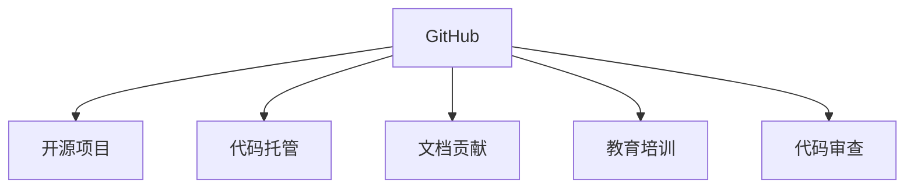

                 

# 程序员如何利用GitHub进行知识变现

在数字化时代，软件开发者的知识与技能成为稀缺资源。如何利用这些优势，通过合法的方式进行变现，是每个开发者都应关注的问题。在这篇博文中，我们将探讨程序员如何利用GitHub进行知识变现的几种常见方式，包括开源项目、代码托管、文档贡献、教育培训等。

## 1. 背景介绍

随着开源运动的兴起，GitHub等代码托管平台已成为程序员分享代码、展示技术的重要场所。无论是简单的代码片段，还是复杂的项目，都能通过GitHub获得曝光和认可。然而，许多程序员并未意识到，GitHub本身就是一个巨大的知识变现渠道。以下是几种利用GitHub进行知识变现的有效方式。

## 2. 核心概念与联系

### 2.1 核心概念概述

为帮助读者理解这些变现方式，我们先定义几个核心概念：

- **GitHub**：全球最大的代码托管平台，支持代码存储、版本控制、协作开发等。
- **开源项目**：开发者将项目代码公开发布，任何人都可以复制、修改和分发。
- **代码托管**：将个人或公司的代码上传到GitHub，方便团队协作和管理。
- **文档贡献**：开发者在GitHub上贡献代码示例、API文档等技术资料，提高项目可读性和可用性。
- **教育培训**：通过GitHub分享技术文章、教学视频、课程资料等，帮助他人学习。
- **代码审查**：为开源项目提供代码审查服务，提升项目质量和社区活跃度。

这些概念之间的联系可以通过以下Mermaid流程图来展示：



该图展示了GitHub的核心功能及其与其他概念的联系。开源项目和代码托管是GitHub的基础功能，而文档贡献、教育培训和代码审查则是在此基础上扩展的应用。这些应用不仅帮助开发者提升自身价值，还能通过知识分享获得额外收入。

## 3. 核心算法原理 & 具体操作步骤

### 3.1 算法原理概述

利用GitHub进行知识变现，主要依赖于平台的开放性和社区的协作性。开发者通过分享优质代码、文档、课程等内容，吸引关注和支持，从而实现变现。以下是几种常见变现方式的算法原理：

- **开源项目**：通过高质量的开源项目吸引社区关注和贡献，提升项目的知名度和使用率。
- **代码托管**：通过管理自己的代码库，展示技术实力，吸引企业或个人合作。
- **文档贡献**：通过提供清晰、实用的技术文档，提高项目的可读性和易用性，吸引更多用户。
- **教育培训**：通过分享技术文章、课程，提供专业知识和技能培训，帮助他人提升技能，从而获得相应的报酬。
- **代码审查**：通过为开源项目提供高质量的代码审查服务，提高项目质量，吸引更多贡献者和用户。

### 3.2 算法步骤详解

以下详细讲解每种变现方式的算法步骤：

#### 3.2.1 开源项目

**步骤1：选择一个合适的项目**
选择一个具有潜在价值和市场需求的开源项目，可以是自己的小项目，也可以是感兴趣的社区项目。

**步骤2：优化项目代码和文档**
编写高质量的代码和详细的文档，使其易于理解和使用。

**步骤3：在GitHub上发布项目**
将项目代码上传到GitHub，并设置适当的许可协议。

**步骤4：宣传项目**
在社交媒体、技术博客等渠道宣传项目，吸引关注和贡献。

**步骤5：收集反馈并改进**
根据社区反馈不断改进项目，提升项目质量和用户体验。

#### 3.2.2 代码托管

**步骤1：创建代码仓库**
在GitHub上创建新的代码仓库，命名应反映项目内容和特色。

**步骤2：编写代码**
按照项目需求编写代码，遵循GitHub的最佳实践。

**步骤3：提交代码**
通过Git提交代码，并编写清晰的提交信息。

**步骤4：设置访问权限**
根据需要设置代码仓库的访问权限，如公开、私有或团队访问。

**步骤5：维护代码**
定期更新代码，修复漏洞，改进功能。

#### 3.2.3 文档贡献

**步骤1：选择项目**
选择一个具有良好社区支持和活跃开发的项目。

**步骤2：编写文档**
编写详细、易懂的文档，包括代码示例、API文档等。

**步骤3：提交文档**
通过Pull Request将文档提交到项目，遵循项目代码审查流程。

**步骤4：持续更新**
定期更新文档，保持与代码库同步。

#### 3.2.4 教育培训

**步骤1：创建教学内容**
编写技术文章、制作教学视频、设计课程等。

**步骤2：上传至GitHub**
将教学内容上传到GitHub，建立专门的仓库。

**步骤3：推广内容**
在社交媒体、博客、论坛等平台推广教学内容，吸引学习者。

**步骤4：接受赞赏**
通过平台提供的支付功能，接受学习者或企业的赞赏。

#### 3.2.5 代码审查

**步骤1：注册GitHub账户**
在GitHub上注册账户，获取访问权限。

**步骤2：选择项目**
选择感兴趣的开源项目，并申请成为协作者。

**步骤3：审查代码**
仔细阅读代码，提供有建设性的审查意见，确保代码质量。

**步骤4：提交审查意见**
通过Pull Request提交审查意见，与项目作者沟通。

**步骤5：维护代码质量**
定期审查代码，提升项目质量。

### 3.3 算法优缺点

每种变现方式都有其优缺点：

**开源项目**
- **优点**：提升开发者知名度，吸引社区贡献，增加项目使用率。
- **缺点**：需要投入大量时间精力，可能遇到社区管理问题。

**代码托管**
- **优点**：展示技术实力，吸引企业合作，获取项目维护资金。
- **缺点**：需要定期更新和维护代码，可能涉及商业机密。

**文档贡献**
- **优点**：提升项目易用性，吸引更多用户，提高开发者影响力。
- **缺点**：需要花费较多时间撰写和维护文档。

**教育培训**
- **优点**：通过知识分享获得额外收入，提升自身价值，帮助他人成长。
- **缺点**：需要不断更新内容，维护教学资料。

**代码审查**
- **优点**：提升项目质量，吸引更多贡献者，增加项目社区活跃度。
- **缺点**：需要投入大量时间进行代码审查，可能与项目开发冲突。

### 3.4 算法应用领域

这些变现方式广泛应用于以下几个领域：

- **软件开发**：开源项目、代码托管、代码审查等。
- **技术教育**：教育培训、文档贡献等。
- **企业合作**：代码托管、开源项目等。
- **个人品牌**：教育培训、开源项目等。

## 4. 数学模型和公式 & 详细讲解 & 举例说明

由于这些变现方式主要依赖于社区互动和资源分享，涉及的数学模型较少。以下仅列举一个简单的公式示例：

假设一个开源项目在GitHub上的关注者数为 $N$，每次提交代码的贡献者数为 $C$，社区活跃度为 $A$，则项目价值的数学模型可以表示为：

$$
V(N, C, A) = k_1 \times N^{0.6} \times C^{0.4} \times A^{0.8}
$$

其中 $k_1$ 为常数，表示初始价值。该模型假设项目价值与关注者数、贡献者数和社区活跃度呈指数关系，体现了社区互动对项目价值的重要影响。

## 5. 项目实践：代码实例和详细解释说明

### 5.1 开发环境搭建

为了进行实际项目实践，需要先搭建好开发环境。以下是一个简单的开发环境搭建步骤：

1. 安装GitHub Desktop或Git命令行工具。
2. 在GitHub上创建一个新的代码仓库，并克隆到本地。
3. 在本地安装Python开发环境，如Anaconda或Miniconda。
4. 安装必要的Python库和依赖包，如Jupyter Notebook、Pandas、Matplotlib等。
5. 使用GitHub Desktop或命令行工具进行代码管理和版本控制。

### 5.2 源代码详细实现

以下是一个简单的开源项目实现示例，演示如何创建一个GitHub仓库并发布代码：

**步骤1：创建仓库**

在GitHub上创建一个新的代码仓库，命名为 `my_project`。

**步骤2：编写代码**

编写一个简单的Python程序，如 `hello_world.py`：

```python
def hello_world():
    print("Hello, World!")

hello_world()
```

**步骤3：提交代码**

使用Git命令将代码提交到仓库：

```bash
git init
git add .
git commit -m "Initial commit"
```

**步骤4：推送代码**

将代码推送到GitHub仓库：

```bash
git remote add origin https://github.com/your_username/my_project.git
git push -u origin master
```

### 5.3 代码解读与分析

该示例演示了如何通过GitHub发布一个简单的Python程序。通过 `git init` 初始化仓库， `git add .` 添加所有文件， `git commit -m "Initial commit"` 提交代码， `git remote add origin ...` 和 `git push -u origin master` 将代码推送到GitHub仓库。

### 5.4 运行结果展示

在GitHub仓库中，可以看到提交的历史记录和代码变更。访问项目页面，可以看到代码和文件展示，以及项目描述和贡献者列表。

## 6. 实际应用场景

### 6.1 开源社区贡献者

小明是一名开源社区的贡献者，他利用GitHub托管自己的项目，并通过发布高质量的开源代码和文档吸引社区关注。他还在GitHub上创建了教育培训仓库，分享编程技巧和技术文章，通过赞赏功能获得收入。

### 6.2 企业开发者

小红是一家企业的开发者，她利用GitHub托管公司的代码库，展示技术实力。她还为公司开源了一个小项目，吸引开源社区的关注和贡献，为公司赢得了更多的曝光和合作机会。

### 6.3 自由职业者

小王是一名自由职业者，他利用GitHub托管自己的项目和代码库，并通过提供高质量的代码审查服务，吸引更多客户合作。他还创建了一个教育培训仓库，分享自己的编程知识和经验，通过赞赏和付费课程获得收入。

### 6.4 未来应用展望

随着GitHub社区的不断壮大，利用平台变现的方式将更加多样化和灵活。未来，我们可以预见更多的开源项目、教育培训、代码托管和文档贡献平台涌现，为开发者提供更广阔的变现空间。

## 7. 工具和资源推荐

### 7.1 学习资源推荐

为了帮助开发者深入理解GitHub和变现技巧，以下是一些推荐的学习资源：

1. **GitHub官方文档**：提供详细的GitHub使用指南，涵盖代码托管、仓库管理、Pull Request等。
2. **GitHub博客**：包含GitHub的最佳实践、社区故事和最新动态。
3. **开源社区教育资源**：如Linux Mastery、O'Reilly Open Source Circle等，提供大量开源项目和教育培训资源。
4. **在线课程平台**：如Udemy、Coursera、edX等，提供丰富的编程和开源项目开发课程。

### 7.2 开发工具推荐

以下是几个常用的GitHub开发工具：

1. **GitHub Desktop**：桌面版的GitHub客户端，方便进行代码管理。
2. **Git**：命令行版本的Git，功能强大，适合终端用户。
3. **Jupyter Notebook**：基于Web的编程环境，适合数据分析和代码演示。
4. **PyCharm**：Python开发环境，提供代码高亮、调试和自动化测试功能。

### 7.3 相关论文推荐

以下是几篇关于GitHub开发和开源项目管理的经典论文：

1. **"The GitHub Repository as a Repository Management Platform"**：研究GitHub作为代码托管平台的管理特性。
2. **"Community Collaboration on GitHub"**：分析开源社区在GitHub上的协作模式。
3. **"Effective Use of GitHub for Open Source Software Development"**：探讨GitHub在开源软件开发中的应用。

## 8. 总结：未来发展趋势与挑战

### 8.1 研究成果总结

本文详细探讨了利用GitHub进行知识变现的几种常见方式，包括开源项目、代码托管、文档贡献、教育培训和代码审查。通过这些方式，开发者可以展示技术实力，吸引社区关注和合作，从而获得额外的收入和职业发展机会。

### 8.2 未来发展趋势

未来，GitHub将更加深入地融入开发者的生活和工作，提供更多的社区互动和知识变现机会。以下是一些可能的趋势：

1. **社区生态的不断扩展**：更多开发者和企业将加入GitHub社区，带来更多的开源项目和教育资源。
2. **开发者变现方式的多样化**：除了传统的开源项目和代码托管，将出现更多创新的变现方式，如社区赞赏、付费课程等。
3. **技术教育的普及**：通过GitHub分享技术知识，提升开发者技能，促进技术普及和产业升级。
4. **自动化工具的提升**：开发更多自动化工具，帮助开发者更高效地管理代码和社区。

### 8.3 面临的挑战

尽管GitHub提供了很多便利和机会，但仍面临一些挑战：

1. **社区管理复杂**：开源项目需要良好的社区管理和维护，管理不当可能影响项目质量和发展。
2. **技术门槛较高**：对于一些新手开发者，GitHub的使用和项目管理可能存在技术门槛。
3. **知识产权风险**：需要谨慎处理代码开源和知识产权问题，避免潜在的法律风险。

### 8.4 研究展望

未来的研究需要解决以下问题：

1. **自动化社区管理**：开发更多自动化工具，帮助开发者更高效地管理社区和开源项目。
2. **社区互动优化**：提高社区互动效率，促进知识共享和合作。
3. **变现方式创新**：探索更多创新的变现方式，提升开发者收益。

总之，利用GitHub进行知识变现是开发者展示技术实力、吸引合作和获得收入的有效途径。通过不断优化管理、提升技能和创新变现方式，开发者可以在GitHub社区中实现更大的价值和影响力。

## 9. 附录：常见问题与解答

**Q1：如何选择合适的开源项目进行贡献？**

A: 选择合适的开源项目，需要考虑项目的活跃度、社区贡献者数量、项目维护者信誉等因素。可以使用GitHub的搜索功能，查找感兴趣的项目和社区。

**Q2：代码托管需要注意哪些问题？**

A: 代码托管需要定期更新和维护，确保代码库的完整性和安全性。需要设置适当的访问权限，避免敏感信息泄露。

**Q3：如何提高文档的易读性和可用性？**

A: 编写清晰、简洁的文档，使用合适的代码示例和图片，并确保文档的易用性和可搜索性。

**Q4：如何通过GitHub获得更多关注？**

A: 定期更新代码和文档，积极参与社区互动，通过博客、社交媒体等渠道宣传项目。

**Q5：如何进行代码审查？**

A: 选择感兴趣的开源项目，申请成为协作者，遵循项目的代码审查流程，提供有建设性的审查意见。

通过回答这些问题，可以帮助开发者更好地理解GitHub上的变现技巧，提升自身技能和职业发展。

---

作者：禅与计算机程序设计艺术 / Zen and the Art of Computer Programming

