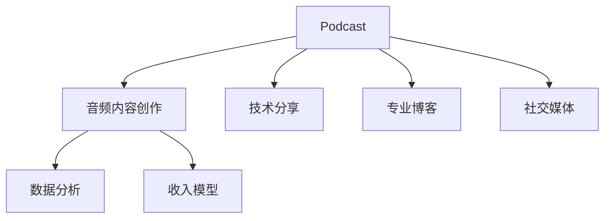

                 

# 程序员如何利用Podcast进行知识变现

> 关键词：Podcast, 知识变现, 音频内容创作, 技术分享, 专业博客, 社交媒体, 数据分析, 收入模型, 内容营销

## 1. 背景介绍

### 1.1 问题由来
在互联网时代，信息传播和获取的方式正在快速演进。传统的书籍、论文等静态内容已经难以满足用户的多元化需求。Podcast作为一种动态、实时的内容形式，正日益受到广大知识工作者和内容创作者的青睐。通过Podcast，程序员不仅可以将自己的技术见解、行业洞察、编程经验等内容分享到公众面前，还能探索更多知识变现的可能性。

### 1.2 问题核心关键点
Podcast作为一种新兴的内容形式，具有灵活多样、易于传播的特点。其核心价值在于能够以音频的形式，将知识、技能、经验等传递给广大的听众。对于程序员而言，利用Podcast进行知识变现的关键点在于内容质量、听众定位、互动交流等。

## 2. 核心概念与联系

### 2.1 核心概念概述

为了更好地理解程序员如何利用Podcast进行知识变现，本节将介绍几个密切相关的核心概念：

- **Podcast**：一种通过音频或视频方式，将内容以连续的系列形式发布到互联网上的形式。可以是访谈、讲解、独白等多种形式。
- **知识变现**：通过提供有价值的内容，获取经济回报的过程。包括广告收入、会员订阅、课程销售等多种模式。
- **音频内容创作**：包括策划、录音、编辑、发布等多个环节，旨在制作高质量的音频内容，吸引并保留听众。
- **技术分享**：通过Podcast分享编程技巧、项目经验、技术趋势等内容，帮助听众提升技术水平。
- **专业博客**：在博客平台发布专业文章、代码实现等内容，并通过SEO优化，提高内容的曝光率和阅读量。
- **社交媒体**：利用社交平台如Twitter、LinkedIn等，推广Podcast和博客内容，扩大受众范围。
- **数据分析**：通过工具如Google Analytics、Podcast Analytics等，分析听众的收听行为、反馈评价，优化内容策略。
- **收入模型**：包括广告分成、付费订阅、课程销售、产品推广等多种盈利方式。

这些核心概念之间的逻辑关系可以通过以下Mermaid流程图来展示：



这个流程图展示了好内容变现的路径和关键环节：

1. 首先，内容创作者通过Podcast创作高质量音频内容。
2. 其次，通过技术分享、专业博客等形式，进一步丰富内容体系。
3. 同时，利用社交媒体进行内容推广，扩大听众范围。
4. 通过数据分析工具优化内容策略，提高互动性。
5. 最后，根据内容互动情况，选择适合的收入模型，实现经济回报。

## 3. 核心算法原理 & 具体操作步骤
### 3.1 算法原理概述

程序员利用Podcast进行知识变现的核心算法原理可以总结为：

1. **音频内容创作**：通过专业工具和技术，创作高质量的音频内容，确保内容具有吸引力和教育性。
2. **数据驱动的内容优化**：利用数据分析工具，评估听众反馈，优化内容策略，提高互动性和吸引力。
3. **多渠道内容分发**：通过Podcast、博客、社交媒体等多渠道分发内容，扩大受众覆盖范围。
4. **多元化的收入模型**：根据内容和听众反馈，选择适合的收入模式，如广告分成、付费订阅等，实现知识变现。

### 3.2 算法步骤详解

基于上述算法原理，程序员进行知识变现的具体操作步骤如下：

**Step 1: 准备音频设备**
- 选择合适的麦克风和录音软件，确保音频质量。
- 测试录音环境，消除噪音干扰。

**Step 2: 策划和录制内容**
- 确定内容主题，如编程技巧、项目经验、技术趋势等。
- 撰写脚本，设计互动环节，确保内容逻辑清晰、易于理解。
- 录音，确保清晰、富有表现力。

**Step 3: 编辑和发布内容**
- 使用音频编辑工具如Audacity、Adobe Audition等，对录音进行剪辑、降噪、混音等处理。
- 上传至Podcast平台如Apple Podcasts、Spotify等，并进行详细设置。

**Step 4: 推广内容**
- 利用社交媒体平台如Twitter、LinkedIn等，发布内容预告和更新，吸引听众。
- 利用博客平台发布相关文章，通过SEO优化提高内容的曝光率。

**Step 5: 数据分析与优化**
- 利用数据分析工具如Google Analytics、Podcast Analytics等，收集听众收听数据、反馈评价。
- 分析数据，优化内容策略，如调整发布频率、改进内容结构等。

**Step 6: 选择收入模型**
- 根据内容互动情况和市场反馈，选择适合的收入模型。如广告分成、付费订阅、课程销售等。

### 3.3 算法优缺点

利用Podcast进行知识变现的方法具有以下优点：

1. **灵活多样**：音频内容易于制作，形式丰富，能够覆盖广泛的听众需求。
2. **易于传播**：音频内容便于在各种平台上传播，不受地域限制。
3. **互动性强**：通过评论区、社交媒体等渠道，能够与听众进行实时互动，提升听众粘性。
4. **反馈及时**：能够快速收集听众反馈，优化内容策略，提升内容质量。

但同时，Podcast变现也存在一些局限性：

1. **制作成本较高**：音频录制、编辑等过程需要一定的技术和设备支持。
2. **盈利模式单一**：目前主要以广告分成、付费订阅为主，其他盈利模式较少。
3. **内容质量要求高**：内容质量直接影响到听众的收听体验和互动性。
4. **内容持续性要求高**：需要定期更新内容，保持听众的持续关注。

尽管存在这些局限性，Podcast仍是大数据时代内容创作和变现的重要手段，程序员可以通过不断提升内容质量和互动性，探索更多变现途径。

### 3.4 算法应用领域

利用Podcast进行知识变现的方法在多个领域都有广泛的应用：

1. **技术培训**：通过Podcast分享编程技巧、框架教程、代码实现等内容，帮助初学者提升技能。
2. **行业洞察**：分享对行业趋势、技术发展、市场动态的独到见解，吸引行业从业者和专业人士的关注。
3. **个人品牌建设**：通过高质量的音频内容，建立个人品牌，扩大影响力，吸引更多的合作和商业机会。
4. **技术咨询**：提供技术支持和咨询服务，帮助听众解决实际问题，提升听众的忠诚度。
5. **开源项目推广**：通过介绍开源项目的背景、实现、应用场景等内容，吸引开发者参与和贡献。

## 4. 数学模型和公式 & 详细讲解  
### 4.1 数学模型构建

本节将使用数学语言对程序员如何利用Podcast进行知识变现的过程进行更加严格的刻画。

设内容创作者在一个月内发布了 $n$ 期音频内容，每期内容吸引的平均收听量为 $L_i$（$i=1,2,\cdots,n$），则一个月内的总收听量为：

$$
T = \sum_{i=1}^n L_i
$$

每期内容通过广告分成获得的收入为 $A_i$（$i=1,2,\cdots,n$），则一个月内通过广告分成获得的总收入为：

$$
\text{Revenue}_{\text{ad}} = \sum_{i=1}^n A_i
$$

每期内容通过付费订阅获得的收入为 $S_i$（$i=1,2,\cdots,n$），则一个月内通过付费订阅获得的总收入为：

$$
\text{Revenue}_{\text{sub}} = \sum_{i=1}^n S_i
$$

综合考虑广告分成和付费订阅，一个月内总获得的收入为：

$$
\text{Total Revenue} = \text{Revenue}_{\text{ad}} + \text{Revenue}_{\text{sub}}
$$

### 4.2 公式推导过程

以下我们以课程销售为例，推导通过Podcast进行知识变现的收入模型。

假设每期课程销售的平均数量为 $N$，课程单价为 $P$，则每期通过课程销售获得的收入为：

$$
S = NP
$$

设课程销售的推广费率为 $r$，则每期通过课程销售实际获得的收入为：

$$
S_{\text{actual}} = S - NP \times r
$$

根据广告分成和课程销售的收入计算公式，一个月内通过广告分成和课程销售获得的总收入为：

$$
\text{Total Revenue} = \sum_{i=1}^n A_i + \sum_{i=1}^n S_{\text{actual}}^i
$$

根据上述公式，可以计算出不同推广费率下的收入变化，从而优化收入策略。

### 4.3 案例分析与讲解

以下我们以GitHub用户Tim的Podcast变现案例进行详细讲解。

Tim是一名经验丰富的软件开发工程师，同时也是一名开源项目的贡献者。他创建了一档名为《编程之旅》的Podcast，每周分享一次自己的编程经验和项目案例。为了吸引听众，Tim在Podcast中穿插了代码片段的讲解和项目背景的介绍。

**Step 1: 准备**
- 购买了专业的录音设备和软件，确保录音质量。
- 在每周五发布新的内容预告，吸引听众。

**Step 2: 内容创作**
- 每次录制前，撰写详细的脚本，明确内容主题和互动环节。
- 通过代码片段和项目案例，逐步深入讲解，提高听众的理解和兴趣。

**Step 3: 编辑和发布**
- 使用Adobe Audition对录音进行剪辑、降噪、混音处理。
- 上传至Apple Podcasts，设置详细的标题、描述和分类。

**Step 4: 推广和互动**
- 在Twitter和LinkedIn上分享内容链接，吸引听众关注。
- 在评论区与听众互动，解答技术问题，提升听众粘性。

**Step 5: 数据分析**
- 使用Google Analytics收集Podcast的下载量和互动数据。
- 分析听众反馈，优化内容策略，如调整话题选择、改进互动环节等。

**Step 6: 收入模型**
- 利用课程销售平台Udemy销售与Podcast内容相关的在线课程，并通过广告分成获得收入。
- 每月总结收入情况，根据数据分析结果调整收入策略。

通过以上步骤，Tim不仅提升了自己在技术社区的影响力，还实现了每月数千美元的收入。

## 5. 项目实践：代码实例和详细解释说明
### 5.1 开发环境搭建

在进行Podcast变现实践前，我们需要准备好开发环境。以下是使用Python进行Podcast内容创作和数据分析的环境配置流程：

1. 安装Python：
```bash
sudo apt-get update
sudo apt-get install python3
```

2. 安装Podcast制作工具
- **Audacity**：免费的开源音频编辑软件，用于录制和编辑音频内容。
- **Adobe Audition**：专业的音频处理工具，支持高级混音、降噪等功能。
- **OBS Studio**：免费的视频录制和直播工具，支持多窗口录制、流媒体直播等。

3. 安装数据分析工具
- **Google Analytics**：用于分析Podcast的下载量和用户行为。
- **Podcast Analytics**：专门用于Podcast内容分析的平台，提供更详细的听众互动数据。

完成上述步骤后，即可在本地搭建Podcast制作和数据分析的开发环境。

### 5.2 源代码详细实现

这里我们以利用Google Analytics进行Podcast数据分析为例，给出Python代码实现。

首先，安装Google Analytics Python客户端库：

```bash
pip install gat
```

然后，使用Python代码进行数据分析：

```python
import gat
import pandas as pd

# 登录Google Analytics并获取数据
ga = gat.GAProperties('YOUR_GA_ACCOUNT_ID', 'PROPERTY_ID', 'VIEW_ID')
ga.refresh()

# 获取听众数据
visitors = ga.get('ga:visitors')
downloads = ga.get('ga:downloads')
listeners = ga.get('ga:active_users')
audience_listeners = ga.get('ga:audience_listeners')

# 将数据转换为Pandas DataFrame
visitors_df = pd.DataFrame(visitors)
downloads_df = pd.DataFrame(downloads)
listeners_df = pd.DataFrame(listeners)
audience_listeners_df = pd.DataFrame(audience_listeners)

# 分析数据
average_listeners = listeners_df['ga:active_users'].mean()
average_downloads = downloads_df['ga:downloads'].mean()
average_audience_listeners = audience_listeners_df['ga:audience_listeners'].mean()

# 打印分析结果
print(f"Average Listeners: {average_listeners}")
print(f"Average Downloads: {average_downloads}")
print(f"Average Audience Listeners: {average_audience_listeners}")
```

这段代码能够帮助开发者通过Google Analytics获取Podcast的听众数量、下载量、活跃听众等关键指标，并计算平均值，从而评估内容的影响力。

### 5.3 代码解读与分析

让我们再详细解读一下关键代码的实现细节：

**GAProperties类**：
- 用于创建Google Analytics的API客户端，需要替换成自己的Google Analytics账号ID、属性ID和视图ID。

**get方法**：
- 根据不同的Google Analytics报告数据类型，调用不同的get方法，获取对应的数据。

**Pandas DataFrame**：
- 将Google Analytics返回的数据转换为Pandas DataFrame，方便进行数据处理和分析。

**平均值计算**：
- 计算听众数量、下载量、活跃听众的平均值，评估内容的影响力。

通过这些代码，开发者能够快速获取Podcast听众和内容表现的关键数据，并进行初步分析，从而指导内容创作和优化策略。

当然，实际的Podcast变现过程可能更加复杂，涉及内容策划、音频录制、社交媒体推广等多个环节，需要综合考虑内容质量、受众需求、互动性等多个因素。

## 6. 实际应用场景
### 6.1 技术培训

利用Podcast进行技术培训，是程序员进行知识变现的重要途径之一。通过Podcast分享编程技巧、框架教程、代码实现等内容，帮助初学者提升技能，同时也可以收集听众的反馈，优化课程内容。

例如，某在线教育平台通过Podcast推出了一系列编程实战课程，由知名程序员主讲，吸引了大量编程初学者注册并付费订阅。平台还通过社交媒体进行推广，进一步提升了课程的曝光率和用户转化率。

### 6.2 行业洞察

利用Podcast分享行业趋势、技术发展、市场动态等内容，吸引行业从业者和专业人士的关注，探索更多的商业合作机会。

例如，某科技博客作者创建了一档名为《科技前沿》的Podcast，每周分享最新的科技资讯和行业趋势，通过社交媒体吸引了大量科技从业者关注。博客作者还与行业内的大公司进行合作，推广Podcast，获得了显著的广告分成和课程销售收入。

### 6.3 个人品牌建设

通过高质量的音频内容，建立个人品牌，扩大影响力，吸引更多的合作和商业机会。

例如，某知名程序员利用Podcast分享自己的技术经验和职业发展历程，逐渐积累了大量忠实听众，并通过课程销售和广告分成实现了可观的收入。他的Podcast甚至成为行业内知名的技术分享平台，吸引了众多知名企业的关注和邀请。

### 6.4 技术咨询

通过Podcast提供技术支持和咨询服务，帮助听众解决实际问题，提升听众的忠诚度。

例如，某技术顾问创建了一档名为《技术难题解答》的Podcast，每周邀请不同的技术专家解答听众的技术问题。听众可以通过评论区提交问题，专家在Podcast中进行解答，并提供相关代码实现和案例分析。这种互动式的解答方式，大大提升了听众的粘性和忠诚度，吸引了大量的付费订阅和广告分成收入。

### 6.5 开源项目推广

通过Podcast介绍开源项目的背景、实现、应用场景等内容，吸引开发者参与和贡献。

例如，某开源项目的维护者创建了一档名为《开源之旅》的Podcast，每周分享项目的最新进展、技术实现和应用案例。通过Podcast的推广，吸引了大量开发者关注和参与，极大地提升了项目的知名度和社区活跃度。

## 7. 工具和资源推荐
### 7.1 学习资源推荐

为了帮助开发者系统掌握Podcast变现的理论基础和实践技巧，这里推荐一些优质的学习资源：

1. **《Podcasting for Programmers》**：由知名技术博主撰写，全面介绍了Podcast制作、发布、营销和变现的各个环节，适合初学者入门。

2. **Coursera的《Podcasting and Storytelling》**：斯坦福大学开设的Podcast制作课程，详细讲解了Podcast的制作、内容策划、营销推广等环节，适合进阶学习。

3. **《Podcasting with Python》**：通过Python实现Podcast的制作、数据分析和自动化，适合对Python有一定基础的开发者学习。

4. **Hacker News的Podcast页面**：聚合了大量优秀的技术Podcast，提供丰富的学习资源和灵感。

5. **The Podcast Blogger**：提供Podcast制作、营销、变现的全面指南，适合Podcast创作者参考。

通过这些资源的学习实践，相信你一定能够快速掌握Podcast变现的精髓，并用于解决实际的商业问题。

### 7.2 开发工具推荐

高效的开发离不开优秀的工具支持。以下是几款用于Podcast变现开发的常用工具：

1. **Audacity**：免费的开源音频编辑软件，支持多轨录音、剪辑、降噪等功能，适合音频内容的创作和编辑。

2. **Adobe Audition**：专业的音频处理工具，支持高级混音、降噪、自动对齐等功能，适合音频内容的高质量制作。

3. **OBS Studio**：免费的视频录制和直播工具，支持多窗口录制、流媒体直播等功能，适合视频内容的创作和分发。

4. **Google Analytics**：强大的数据分析平台，支持丰富的指标和报告，适合Podcast内容的受众分析。

5. **Podcast Analytics**：专门用于Podcast内容分析的平台，提供详细的听众互动数据，适合内容优化和策略调整。

6. **Descript**：语音转文本、文本转语音的智能工具，适合内容创作和快速生成文本。

合理利用这些工具，可以显著提升Podcast变现的开发效率，加快创新迭代的步伐。

### 7.3 相关论文推荐

Podcast变现的研究源于学界的持续研究。以下是几篇奠基性的相关论文，推荐阅读：

1. **《Podcasting for Programmers》**：由知名技术博主撰写，全面介绍了Podcast制作、发布、营销和变现的各个环节，适合初学者入门。

2. **Coursera的《Podcasting and Storytelling》**：斯坦福大学开设的Podcast制作课程，详细讲解了Podcast的制作、内容策划、营销推广等环节，适合进阶学习。

3. **《Podcasting with Python》**：通过Python实现Podcast的制作、数据分析和自动化，适合对Python有一定基础的开发者学习。

4. **《Podcasting and Monetization》**：详细探讨了Podcast变现的多种模式和策略，适合Podcast创作者参考。

这些论文代表了大数据时代内容创作和变现的研究脉络。通过学习这些前沿成果，可以帮助研究者把握学科前进方向，激发更多的创新灵感。

## 8. 总结：未来发展趋势与挑战
### 8.1 总结

本文对程序员如何利用Podcast进行知识变现的方法进行了全面系统的介绍。首先阐述了Podcast变现的重要性和核心关键点，明确了内容创作、数据驱动、多渠道分发和多元化收入模型等变现路径。其次，从原理到实践，详细讲解了Podcast变现的数学模型和详细步骤，给出了Podcast内容创作和数据分析的Python代码实现。同时，本文还广泛探讨了Podcast变现的多个应用场景，展示了其广泛的应用前景。此外，本文精选了Podcast变现的学习资源、开发工具和相关论文，力求为开发者提供全方位的技术指引。

通过本文的系统梳理，可以看到，Podcast变现已经在大数据时代成为内容创作者和知识工作者探索经济回报的重要手段。Podcast的高灵活性、易于传播和互动性强等特性，使其在技术培训、行业洞察、个人品牌建设、技术咨询和开源项目推广等多个领域展现出巨大的应用潜力。未来，伴随技术工具和平台的发展，Podcast变现将有更多可能性，为程序员探索知识变现提供更多的路径。

### 8.2 未来发展趋势

展望未来，Podcast变现技术将呈现以下几个发展趋势：

1. **技术工具不断进步**：音频编辑、数据分析、自动化工具的不断进步，将大大提升内容创作和变现的效率。
2. **多平台分发**：Podcast内容将在更多平台（如YouTube、Bilibili、Spotify等）进行分发，扩大受众范围。
3. **内容形式多样化**：Podcast将不再局限于音频，将融合视频、图文等多种形式，提供更丰富、互动性更强的内容体验。
4. **盈利模式多元化**：除了广告分成、付费订阅，将探索更多盈利模式，如产品推广、知识付费等。
5. **内容个性化**：通过数据分析，实现内容个性化推荐，提升听众的满意度和忠诚度。
6. **用户互动加强**：利用社交媒体、社区平台等渠道，加强与听众的互动，提升听众粘性。

这些趋势将进一步推动Podcast变现技术的发展，带来更多的商业机会和应用场景。

### 8.3 面临的挑战

尽管Podcast变现技术已经取得了瞩目成就，但在迈向更加智能化、普适化应用的过程中，它仍面临着诸多挑战：

1. **内容质量要求高**：内容质量直接影响到听众的收听体验和互动性，需要持续优化和提升。
2. **资源投入较大**：音频录制、编辑等过程需要一定的技术和设备支持，初期投入较大。
3. **盈利模式单一**：目前主要以广告分成、付费订阅为主，其他盈利模式较少，需要进一步探索和优化。
4. **内容持续性要求高**：需要定期更新内容，保持听众的持续关注，内容创作和优化难度较大。
5. **市场竞争激烈**：Podcast领域竞争激烈，需要不断创新和优化内容，保持竞争优势。

尽管存在这些挑战，Podcast变现的广阔前景仍然值得期待。相信随着技术工具的不断进步和内容创作水平的提升，Podcast变现将迎来更加成熟和高效的发展阶段。

### 8.4 研究展望

面对Podcast变现所面临的种种挑战，未来的研究需要在以下几个方面寻求新的突破：

1. **内容自动化生成**：利用人工智能技术，实现音频内容自动生成和优化，降低内容创作成本。
2. **内容个性化推荐**：通过用户行为分析，实现内容个性化推荐，提升用户体验和粘性。
3. **社交媒体优化**：利用社交媒体平台的特性，优化内容推广策略，扩大受众范围。
4. **多元化的盈利模式**：探索更多盈利模式，如产品推广、知识付费等，提升变现能力。
5. **用户互动增强**：通过社区平台、智能客服等手段，加强与听众的互动，提升用户满意度和忠诚度。
6. **内容版权保护**：加强内容版权保护，避免侵权和盗用，保护创作者利益。

这些研究方向的探索，必将引领Podcast变现技术迈向更高的台阶，为内容创作者和知识工作者提供更多的变现途径和发展机会。面向未来，Podcast变现技术还需要与其他人工智能技术进行更深入的融合，如语音识别、自然语言处理等，多路径协同发力，共同推动内容创作和变现技术的进步。只有勇于创新、敢于突破，才能不断拓展内容创作的边界，让知识变现更加便捷、高效。

## 9. 附录：常见问题与解答
**Q1：Podcast变现的收入来源有哪些？**

A: Podcast变现的收入来源主要包括：

1. **广告分成**：通过在Podcast中插入广告，按点击量或播放量获取收入。
2. **付费订阅**：听众通过订阅服务，支付一定的费用，获取特权内容或独家信息。
3. **课程销售**：通过分享与Podcast内容相关的在线课程，获得销售收入。
4. **产品推广**：利用Podcast推广自己的产品或服务，获取销售佣金。

通过综合利用这些收入模式，可以实现多渠道变现，最大化收益。

**Q2：如何提高Podcast的听众互动性？**

A: 提高Podcast的听众互动性，可以从以下几个方面入手：

1. **内容互动环节**：在内容创作过程中，加入听众问答、技术讨论等环节，增加听众参与感。
2. **社交媒体推广**：利用Twitter、LinkedIn等社交媒体平台，分享Podcast内容链接，吸引听众关注。
3. **社区平台建设**：利用社区平台（如Discord、Reddit等），与听众进行实时交流和互动。
4. **定期互动活动**：定期举办听众问答、技术挑战等活动，增强听众粘性。
5. **优化内容策略**：根据听众反馈，优化内容主题和格式，提升内容吸引力。

通过这些方法，可以有效提升Podcast的听众互动性，增强用户粘性，推动变现效果。

**Q3：如何选择适合的盈利模式？**

A: 选择适合的盈利模式需要考虑以下几个因素：

1. **内容类型**：不同类型的Podcast适合的盈利模式不同，例如技术培训适合付费订阅，行业洞察适合广告分成。
2. **听众需求**：了解听众的需求和支付意愿，选择最适合的盈利模式。
3. **市场环境**：根据市场环境，选择适合的市场推广方式和盈利模式。
4. **成本和资源**：评估盈利模式的实施成本和所需资源，选择可行的模式。

通过综合考虑这些因素，选择合适的盈利模式，可以实现最大化的变现效果。

**Q4：如何利用Python进行Podcast数据分析？**

A: 利用Python进行Podcast数据分析，可以通过以下步骤实现：

1. 安装Google Analytics Python客户端库：`pip install gat`。
2. 导入Google Analytics模块，登录Google Analytics并获取数据：
```python
import gat
ga = gat.GAProperties('YOUR_GA_ACCOUNT_ID', 'PROPERTY_ID', 'VIEW_ID')
ga.refresh()
```
3. 获取听众数据和内容数据：
```python
visitors = ga.get('ga:visitors')
downloads = ga.get('ga:downloads')
listeners = ga.get('ga:active_users')
audience_listeners = ga.get('ga:audience_listeners')
```
4. 将数据转换为Pandas DataFrame，并进行数据分析：
```python
visitors_df = pd.DataFrame(visitors)
downloads_df = pd.DataFrame(downloads)
listeners_df = pd.DataFrame(listeners)
audience_listeners_df = pd.DataFrame(audience_listeners)
average_listeners = listeners_df['ga:active_users'].mean()
average_downloads = downloads_df['ga:downloads'].mean()
average_audience_listeners = audience_listeners_df['ga:audience_listeners'].mean()
```

通过这些代码，可以快速获取Podcast听众和内容表现的关键数据，并进行初步分析，从而指导内容创作和优化策略。

---

作者：禅与计算机程序设计艺术 / Zen and the Art of Computer Programming

