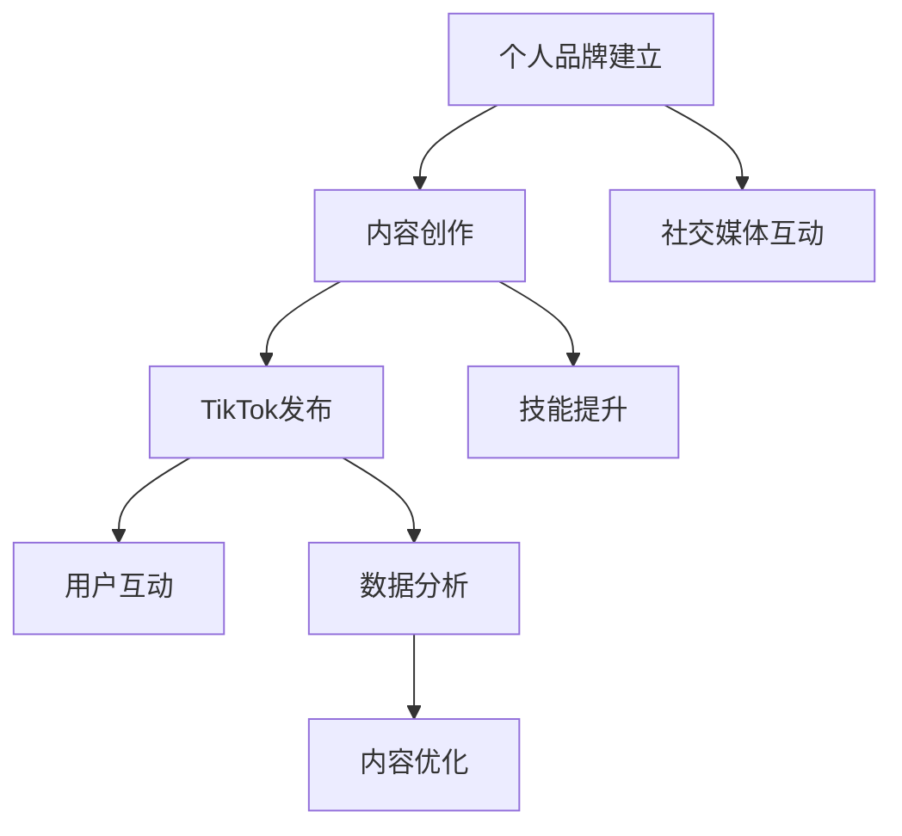

                 

## 1. 背景介绍

在当今快速发展的科技领域中，程序员不仅需要具备卓越的编程能力，还应该具备一定的营销和推广技能，以提升个人品牌影响力，扩大技术影响力，促进技术与市场的结合。TikTok作为全球热门的短视频平台，为程序员提供了一个展示技术才华、分享知识经验的新平台。本文将详细探讨程序员如何利用TikTok进行知识营销，提升个人品牌和影响力的策略与实践。

## 2. 核心概念与联系

### 2.1 核心概念概述

在进行TikTok知识营销之前，我们需要了解几个关键概念：

- **TikTok**：全球领先的短视频社交平台，以其快速成长和庞大的用户基础著称。

- **知识营销**：利用知识和专业技能进行营销活动，而非直接推销产品或服务，以建立长期信任和口碑。

- **程序员个人品牌**：通过展示个人在编程、技术、行业见解等方面的专长，形成独特的个人品牌形象。

### 2.2 核心概念原理和架构的 Mermaid 流程图



## 3. 核心算法原理 & 具体操作步骤

### 3.1 算法原理概述

TikTok知识营销的算法原理主要基于内容推荐和用户互动的机制。通过对用户行为数据的学习，TikTok能够精确推荐适合用户兴趣的视频内容。程序员可以通过高质量的技术视频内容，吸引目标受众的关注和互动，从而提升个人品牌影响力。

### 3.2 算法步骤详解

#### 3.2.1 目标受众定位

确定目标受众群体是成功营销的前提。程序员应该了解目标受众的兴趣、专业背景和需求，以便设计符合受众期望的内容。

#### 3.2.2 内容创作

创作高质量的内容是知识营销的核心。内容应包括以下几个方面：

- **技术讲解**：通过简明扼要的语言和生动的演示，解释复杂的编程概念和算法原理。
- **项目实践**：分享实际项目中的编码实践和解决问题的经验。
- **行业洞察**：分析当前技术趋势、行业热点，提供独到的见解和预测。

#### 3.2.3 发布策略

选择合适的发布时间和频率，以最大化内容曝光率。可以使用TikTok的标签功能，让内容更容易被目标受众发现。

#### 3.2.4 互动优化

积极回复评论和私信，与粉丝互动，提升粉丝粘性。通过数据分析工具，了解粉丝反馈，持续优化内容。

### 3.3 算法优缺点

#### 3.3.1 优点

- **广泛覆盖**：TikTok拥有全球数十亿用户，程序员可以通过短视频快速触达大量潜在受众。
- **高互动性**：短视频形式的互动性更强，有助于建立个人品牌忠诚度。
- **低门槛**：视频制作门槛相对较低，内容创作和发布更加便捷。

#### 3.3.2 缺点

- **内容消耗快**：短视频内容的生命周期较短，需要持续创作新鲜内容。
- **算法不透明**：TikTok推荐算法相对不透明，难以完全控制内容曝光。

### 3.4 算法应用领域

TikTok知识营销不仅适用于程序员，还适用于其他技术领域专家、企业家和教育工作者。通过展示技术能力和专业知识，这些人群也能在TikTok上建立个人品牌，提升行业影响力。

## 4. 数学模型和公式 & 详细讲解 & 举例说明

### 4.1 数学模型构建

设 $C$ 为内容创作，$D$ 为发布后的用户互动数据，$U$ 为用户基础和反馈，$A$ 为算法推荐结果。

模型构建如下：

$$
U = f(C) \times D
$$

$$
A = g(C, U)
$$

其中，$f$ 和 $g$ 分别为内容影响力和算法推荐函数。

### 4.2 公式推导过程

根据模型构建，我们通过内容创作 $C$ 和用户互动 $D$ 计算用户基础 $U$，再结合算法推荐 $A$，优化内容创作策略。

### 4.3 案例分析与讲解

假设某程序员创建了关于Python数据科学的视频，视频时长为1分钟，包含以下步骤：

1. 使用Python的Pandas库进行数据清洗。
2. 应用Scikit-learn进行数据分析。
3. 展示模型评估结果。

通过分析用户互动数据，程序员发现观众对Pandas和Scikit-learn的演示部分反馈良好，但模型评估部分参与度较低。因此，程序员在后续视频中增加了更多关于模型评估的实际案例和代码示例，显著提升了视频观看量和互动率。

## 5. 项目实践：代码实例和详细解释说明

### 5.1 开发环境搭建

1. 安装TikTok应用和编辑器（如VS Code）。
2. 准备所需的编程环境和软件包。

### 5.2 源代码详细实现

下面以Python代码为例，展示如何制作一个TikTok短视频：

```python
import cv2
from tiktok import TikTokClient

# 创建TikTok客户端
client = TikTokClient()

# 录制视频
video = client.create_video("Python数据科学", "Python数据科学", 1)  # 1分钟视频

# 添加字幕和特效
video.add_caption("使用Pandas和Scikit-learn进行数据科学分析")
video.add_effect("慢动作")

# 发布视频
video.publish()
```

### 5.3 代码解读与分析

这段代码利用TikTok的Python SDK，创建了一个时长为1分钟的视频，并添加了字幕和慢动作特效。在实际应用中，开发者可以根据具体需求，自由调整视频时长、内容、特效等参数。

### 5.4 运行结果展示

发布后的视频会出现在个人的TikTok主页上，并通过算法推荐给相关用户。开发者可以通过TikTok的分析工具，实时监控视频的观看量、点赞量、评论量等指标，进一步优化内容创作和发布策略。

## 6. 实际应用场景

### 6.1 技术社区参与

程序员可以在TikTok上分享技术社区中的新项目、最新技术动态，吸引同行关注和讨论，提升个人在技术圈内的影响力。

### 6.2 个人品牌推广

通过持续发布高质量的技术内容，程序员可以逐步建立起个人品牌，吸引更多目标受众，扩大专业影响力。

### 6.3 教育培训

利用TikTok进行编程教学和知识分享，帮助初学者入门编程，提升个人作为教育者的知名度和影响力。

### 6.4 未来应用展望

随着TikTok的全球用户基础不断扩大，程序员可以通过更深入的技术分析和互动，与全球用户进行交流和合作，推动技术知识的全球传播。

## 7. 工具和资源推荐

### 7.1 学习资源推荐

- **《TikTok营销实战指南》**：提供TikTok营销的全面指南，涵盖内容创作、发布策略、互动优化等各个方面。
- **TikTok官方文档**：详细介绍TikTok API和开发工具，帮助开发者高效利用TikTok平台。
- **编程教育课程**：如Coursera、Udacity等平台上的编程课程，可以通过短视频形式进行学习分享。

### 7.2 开发工具推荐

- **VS Code**：轻量级编程编辑器，支持多语言编程和插件扩展。
- **Python SDK**：TikTok官方提供的Python SDK，方便开发者制作和管理TikTok内容。

### 7.3 相关论文推荐

- **《TikTok算法研究》**：分析TikTok推荐算法的原理和优化策略，帮助开发者更好地理解内容曝光机制。
- **《短视频内容优化》**：讨论短视频内容创作和优化的技术方法，提升内容质量和观众互动。

## 8. 总结：未来发展趋势与挑战

### 8.1 研究成果总结

通过本文的系统梳理，程序员可以全面了解TikTok知识营销的理论基础和实践技巧，掌握如何在短视频平台上展示技术才华，分享知识经验，提升个人品牌影响力。

### 8.2 未来发展趋势

未来，TikTok知识营销将进一步拓展，以下几个趋势值得关注：

- **内容形式多样化**：除了短视频，直播、图文、AR/VR内容也将成为主流形式。
- **技术深度增加**：随着AI和VR技术的发展，内容创作将更加生动和互动。
- **全球化推广**：全球用户基础不断扩大，跨文化技术传播将更加便捷。

### 8.3 面临的挑战

尽管TikTok知识营销潜力巨大，但也面临诸多挑战：

- **内容质量控制**：高质量内容创作和维护需要投入大量时间和精力。
- **算法理解**：TikTok推荐算法相对复杂，难以完全控制内容曝光。
- **用户互动**：与用户互动需要持续努力，难以快速提升品牌知名度。

### 8.4 研究展望

未来的研究应集中在以下几个方向：

- **自动化内容创作**：利用AI技术自动化内容创作和优化，提高效率和质量。
- **多平台整合**：将TikTok与Twitter、LinkedIn等社交平台整合，形成完整的品牌推广策略。
- **用户互动分析**：通过数据分析工具，深入理解用户行为和偏好，优化互动策略。

通过不断探索和创新，TikTok知识营销将帮助程序员更好地展示技术才华，分享知识经验，提升个人品牌和影响力，推动技术知识的广泛传播。

## 9. 附录：常见问题与解答

**Q1：程序员如何在TikTok上建立个人品牌？**

A: 程序员可以通过以下步骤在TikTok上建立个人品牌：

1. 确定目标受众。
2. 创作高质量的技术内容。
3. 选择合适的发布时间和频率。
4. 积极回复评论和私信，与粉丝互动。
5. 定期分析数据，优化内容创作策略。

**Q2：TikTok算法推荐如何影响内容曝光？**

A: TikTok算法会根据用户兴趣和行为数据，对视频进行推荐排序。程序员应了解算法的推荐机制，创作符合受众期望的内容，提升曝光率。

**Q3：如何在TikTok上进行技术分享？**

A: 程序员可以通过以下方式在TikTok上进行技术分享：

1. 简明扼要地讲解技术原理和应用场景。
2. 分享实际项目中的编码实践和问题解决方法。
3. 分析当前技术趋势，提供独到见解和预测。

**Q4：如何提升TikTok视频互动率？**

A: 提升TikTok视频互动率的方法包括：

1. 制作生动有趣的短视频，吸引观众注意力。
2. 添加互动性强的特效和字幕。
3. 发布在用户活跃的时间段。
4. 积极回复评论和私信，与观众互动。

**Q5：程序员如何利用TikTok进行知识营销？**

A: 程序员可以通过以下步骤利用TikTok进行知识营销：

1. 确定目标受众和兴趣点。
2. 创作高质量的技术内容。
3. 选择合适的发布时间和频率。
4. 积极回复评论和私信，与粉丝互动。
5. 定期分析数据，优化内容创作策略。

通过本文的系统梳理，程序员可以全面了解TikTok知识营销的理论基础和实践技巧，掌握如何在短视频平台上展示技术才华，分享知识经验，提升个人品牌影响力。

---

作者：禅与计算机程序设计艺术 / Zen and the Art of Computer Programming

