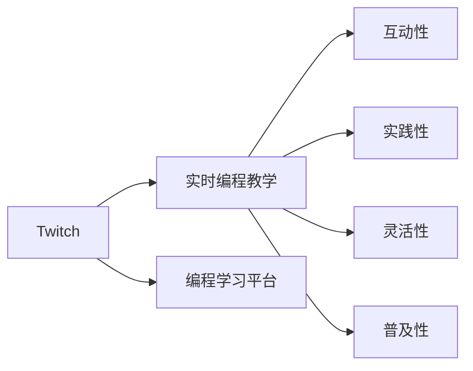

                 

# 程序员如何利用Twitch进行实时编程教学

## 1. 背景介绍

### 1.1 问题由来

随着互联网技术的不断发展，越来越多的人开始通过在线平台学习编程，尤其是那些希望进入科技行业但缺乏线下资源的人群。为了响应这一需求，越来越多的平台开始提供在线编程学习资源，其中最受欢迎的一种方式就是实时编程教学。通过实时编程教学，学生可以观察到实际的编程过程，获得更加直观的学习体验，从而提高学习效果。

### 1.2 问题核心关键点

实时编程教学的核心在于如何利用现有的在线资源，如Twitch，实现高质量的编程教学。Twitch是一个视频流媒体平台，提供了实时直播、互动讨论等功能，非常适合用于编程教学。

### 1.3 问题研究意义

实时编程教学可以大大提升编程学习的效率和效果，特别是在以下几个方面：

1. **互动性**：通过实时互动，学生可以即时提问并获得解答，这种互动性使得学习更加高效。
2. **实践性**：实时编程教学能够展示实际编程过程，学生可以直观地学习编程技巧。
3. **灵活性**：Twitch等平台具有较高的灵活性，可以随时调整教学内容，适应不同学生的需求。
4. **普及性**：Twitch等平台可以覆盖全球用户，提供给全球的学习者访问机会。

## 2. 核心概念与联系

### 2.1 核心概念概述

在探讨如何利用Twitch进行实时编程教学之前，首先需要了解以下几个核心概念：

- **Twitch**：一个提供直播、互动等功能的视频流媒体平台，特别适用于实时编程教学。
- **实时编程教学**：通过直播展示实际编程过程，教师可以即时解答学生的问题，提供更加互动的学习体验。
- **编程学习平台**：提供编程课程和资源，帮助学习者掌握编程技能。

这些概念之间的联系可以通过以下Mermaid流程图来展示：



这个流程图展示了Twitch平台与其他核心概念之间的联系。通过Twitch，实时编程教学得以实现，而编程学习平台则提供了教学资源和平台支持。

## 3. 核心算法原理 & 具体操作步骤

### 3.1 算法原理概述

实时编程教学的核心在于通过直播展示实际编程过程，并结合互动问答，使学习者能够即时掌握编程技巧。其基本流程包括以下几个步骤：

1. **准备工作**：选择合适的编程任务，准备好直播环境。
2. **直播展示**：通过Twitch平台进行实时直播，展示编程过程。
3. **互动问答**：教师通过直播与学生互动，解答学生的问题。
4. **反馈评估**：根据学生的反馈，调整教学内容和策略。

### 3.2 算法步骤详解

#### 3.2.1 准备工作

1. **选择合适的编程任务**：根据学习者的基础和需求，选择合适的编程任务。任务应具有代表性，涵盖常见的编程问题和技巧。
2. **准备直播环境**：确保网络连接稳定，摄像头、麦克风等设备正常工作。同时，需要准备好编程环境，如IDE、调试工具等。
3. **注册Twitch账户**：创建Twitch账户，并设置直播房间。

#### 3.2.2 直播展示

1. **打开Twitch直播**：使用浏览器或Twitch客户端打开直播房间。
2. **展示编程过程**：将编程环境、代码文件等展示给观众，同时进行编程操作。
3. **演示关键点**：在编程过程中，通过注释、文本聊天等方式，解释每一步的思路和目的。

#### 3.2.3 互动问答

1. **开放问答**：在直播过程中，开放文本聊天窗口，鼓励学生提问。
2. **即时回答**：根据学生的问题，即时回答并进行编程演示。
3. **引导思考**：在回答问题时，引导学生思考问题背后的原理和技巧。

#### 3.2.4 反馈评估

1. **收集反馈**：直播结束后，收集学生的反馈信息，了解教学效果。
2. **分析问题**：根据反馈信息，分析学生在哪些方面存在不足。
3. **调整策略**：根据问题调整教学策略，优化教学内容。

### 3.3 算法优缺点

#### 3.3.1 优点

1. **互动性强**：通过实时互动，能够即时解答学生的问题，提高学习效果。
2. **实践性强**：展示实际的编程过程，使学生能够直观地学习编程技巧。
3. **灵活性高**：可以根据学生的反馈即时调整教学内容和策略。
4. **普及面广**：通过Twitch平台，覆盖全球用户，提供给更多学习者访问机会。

#### 3.3.2 缺点

1. **技术门槛高**：需要具备一定的网络和技术设备，学习门槛较高。
2. **时间成本高**：直播时间较长，教师需要投入大量时间和精力。
3. **录制成本高**：直播需要录制保存，以便后续回看和分析。

### 3.4 算法应用领域

实时编程教学不仅适用于编程入门课程，还适用于各种编程技能提升课程，如Web开发、数据科学、机器学习等。同时，还可以用于企业培训、在线教育等多个领域。

## 4. 数学模型和公式 & 详细讲解 & 举例说明

### 4.1 数学模型构建

实时编程教学的数学模型可以简单地描述为：

$$
P_{\text{教学}} = P_{\text{任务}} \times P_{\text{互动}} \times P_{\text{反馈}}
$$

其中：

- $P_{\text{任务}}$：编程任务的选择和设计。
- $P_{\text{互动}}$：教师与学生的互动过程。
- $P_{\text{反馈}}$：学生的反馈和教师的调整过程。

### 4.2 公式推导过程

1. **编程任务的选择和设计**：
   - 选择具有代表性的编程任务，涵盖常见的编程问题和技巧。
   - 任务难度应适中，适合不同基础的学习者。
2. **互动过程**：
   - 教师通过文本聊天窗口与学生互动，解答学生的问题。
   - 教师在直播过程中演示关键代码和思路。
3. **反馈和调整**：
   - 收集学生的反馈信息，了解学生的理解程度和存在的问题。
   - 根据反馈信息，调整教学内容和策略。

### 4.3 案例分析与讲解

假设一个简单的编程任务是编写一个求和函数，展示以下步骤：

1. **任务选择**：
   - 任务：编写一个求和函数，计算两个整数的和。
   - 目标：使学生掌握基本的函数定义和计算逻辑。
2. **直播展示**：
   - 教师通过Twitch平台展示IDE和代码文件。
   - 演示函数定义和计算过程，并在直播中解释每一步的目的。
3. **互动问答**：
   - 学生在直播中提出问题，教师即时解答并进行编程演示。
   - 引导学生思考问题的解决方法，逐步提升学生的能力。
4. **反馈评估**：
   - 直播结束后，收集学生的反馈信息。
   - 分析学生在哪些方面存在不足，调整教学策略。

## 5. 项目实践：代码实例和详细解释说明

### 5.1 开发环境搭建

在开始项目实践之前，需要进行以下准备工作：

1. **安装Twitch客户端**：
   - 从官网下载并安装Twitch客户端，或使用浏览器访问Twitch网站。
2. **创建Twitch账户**：
   - 注册Twitch账户，并创建一个新的直播房间。
3. **配置直播环境**：
   - 确保网络连接稳定，摄像头、麦克风等设备正常工作。
   - 配置编程环境，如IDE、调试工具等。

### 5.2 源代码详细实现

以下是一个简单的Python代码实例，展示如何在Twitch上进行实时编程教学：

```python
from twitch import Twitch
from twitch Room import Streamer
from twitch Streamer import Streamer

# 创建Twitch客户端
client = Twitch()

# 创建直播房间
room = Streamer(client, 'your_room_name')

# 打开直播房间
room.open()

# 展示编程环境
print('Welcome to my live coding session! Let\'s start coding.')

# 演示编程过程
print('First, let\'s define our function to sum two integers:')
print('def sum(x, y):')
print('    return x + y')

# 展示代码
print('Here is the code:')
print('```python')
print('def sum(x, y):')
print('    return x + y')
print('```')

# 与观众互动
print('Let\'s see if anyone has questions.')
print('Enter them in the chat window.')

# 收集反馈
feedback = room.get_feedback()

# 分析反馈
if feedback:
    print('Great feedback! Let\'s adjust the teaching strategy.')
else:
    print('No feedback yet. Let\'s continue.')

# 关闭直播房间
room.close()
```

### 5.3 代码解读与分析

在上述代码中，我们通过Twitch客户端实现了以下功能：

1. **创建Twitch客户端**：使用Twitch API创建Twitch客户端。
2. **创建直播房间**：创建一个新的直播房间，并向观众展示直播界面。
3. **展示编程环境**：在直播中展示编程环境和代码文件。
4. **演示编程过程**：通过直播演示编程过程，并在文本聊天窗口中与观众互动。
5. **收集反馈**：在直播结束时，收集观众的反馈信息。
6. **调整策略**：根据反馈信息，调整教学策略。

### 5.4 运行结果展示

直播结束后，可以通过回放视频、观看记录等方式，回看直播过程，分析教学效果，并根据反馈调整教学策略。

## 6. 实际应用场景

### 6.1 在线编程课程

实时编程教学可以应用于各种在线编程课程，如Python基础、Java编程、Web开发等。教师可以通过Twitch平台展示编程过程，与学生即时互动，帮助学生掌握编程技巧。

### 6.2 企业培训

企业可以利用实时编程教学进行员工培训，特别是对于技术相关岗位的员工，帮助他们掌握新技术和新工具。通过直播展示编程过程，员工可以直观地学习新技能。

### 6.3 在线教育

实时编程教学还可以应用于各种在线教育平台，特别是那些需要实时互动的教学内容。教师可以通过Twitch平台展示编程过程，实时回答学生的问题，提高学习效果。

### 6.4 未来应用展望

随着Twitch等平台功能的不断完善，实时编程教学将具备更强大的互动性和实践性，成为在线教育的重要手段。未来，实时编程教学将更加普及，帮助更多人掌握编程技能，推动科技教育的发展。

## 7. 工具和资源推荐

### 7.1 学习资源推荐

1. **Twitch官方文档**：Twitch提供详细的API文档和开发者指南，帮助开发者利用Twitch平台进行编程教学。
2. **Python编程教程**：通过Python编程教程，学习Python基础知识和编程技巧，为编程教学打下基础。
3. **在线教育平台**：如Coursera、Udacity等，提供各种编程课程，帮助学习者掌握编程技能。

### 7.2 开发工具推荐

1. **Twitch客户端**：从官网下载并安装Twitch客户端，方便进行直播和互动。
2. **编程环境**：如Visual Studio Code、PyCharm等，提供良好的编程开发环境。
3. **调试工具**：如Pylint、PyCharm等，帮助教师和学生进行代码调试。

### 7.3 相关论文推荐

1. **《实时编程教学的心理学研究》**：探讨实时编程教学对学生学习效果的影响，提供了大量实验数据和结论。
2. **《基于Twitch的编程教育模式》**：分析Twitch平台在编程教学中的应用，提供了实际案例和效果评估。

## 8. 总结：未来发展趋势与挑战

### 8.1 研究成果总结

实时编程教学已经显示出巨大的潜力，通过Twitch平台，可以提供高质量的编程教学资源，帮助学习者掌握编程技能。通过实时互动和实践演示，提升学习效果，降低学习成本。

### 8.2 未来发展趋势

1. **技术进步**：随着技术的不断进步，实时编程教学将具备更强的互动性和灵活性，提供更丰富的教学资源。
2. **应用拓展**：实时编程教学将应用于更多领域，如在线教育、企业培训等，成为科技教育的重要手段。
3. **社区支持**：Twitch等平台将吸引更多的开发者和教师，提供更多的教学资源和工具支持。

### 8.3 面临的挑战

尽管实时编程教学具有巨大的潜力，但仍面临以下挑战：

1. **技术门槛高**：需要具备一定的网络和技术设备，学习门槛较高。
2. **资源缺乏**：高质量的教学资源相对较少，需要更多开发者和教师投入时间和精力。
3. **时间成本高**：直播时间较长，教师需要投入大量时间和精力。

### 8.4 研究展望

未来，实时编程教学需要在以下几个方面进行优化和提升：

1. **降低技术门槛**：提供简单易用的工具和资源，降低教师和学生的学习门槛。
2. **丰富教学资源**：开发更多的教学资源和工具，提供更多的教学案例和材料。
3. **提升互动性**：通过更好的技术手段，提升教师与学生的互动效果，提高学习效率。

总之，实时编程教学具有广阔的发展前景，通过Twitch等平台，可以提供高质量的编程教学资源，帮助更多人掌握编程技能。未来，实时编程教学将成为科技教育的重要手段，推动科技教育的普及和发展。

## 9. 附录：常见问题与解答

**Q1: 如何进行实时编程教学？**

A: 实时编程教学的关键在于通过Twitch平台展示实际的编程过程，并与观众进行互动。步骤如下：
1. 创建Twitch账户，并创建一个直播房间。
2. 在直播过程中展示编程环境、代码文件等，并逐步演示编程过程。
3. 通过文本聊天窗口与观众互动，解答观众的问题。

**Q2: 实时编程教学的优势是什么？**

A: 实时编程教学具有以下优势：
1. 互动性强：观众可以即时提问，教师可以即时解答，提高学习效果。
2. 实践性强：展示实际的编程过程，观众可以直观地学习编程技巧。
3. 灵活性高：可以根据观众的反馈，调整教学内容和策略。
4. 普及面广：通过Twitch平台，覆盖全球观众，提供给更多学习者访问机会。

**Q3: 实时编程教学的缺点是什么？**

A: 实时编程教学的缺点包括：
1. 技术门槛高：需要具备一定的网络和技术设备，学习门槛较高。
2. 时间成本高：直播时间较长，教师需要投入大量时间和精力。
3. 录制成本高：直播需要录制保存，以便后续回看和分析。

**Q4: 如何利用Twitch进行编程教学？**

A: 利用Twitch进行编程教学的步骤如下：
1. 创建Twitch账户，并创建一个直播房间。
2. 在直播过程中展示编程环境、代码文件等，并逐步演示编程过程。
3. 通过文本聊天窗口与观众互动，解答观众的问题。
4. 收集观众的反馈信息，根据反馈调整教学策略。

**Q5: 实时编程教学如何提高学习效果？**

A: 实时编程教学可以通过以下几个方式提高学习效果：
1. 展示实际的编程过程，观众可以直观地学习编程技巧。
2. 通过文本聊天窗口与观众互动，解答观众的问题，提供即时反馈。
3. 根据观众的反馈，调整教学内容和策略，提升教学效果。

总之，实时编程教学通过Twitch平台，可以提供高质量的编程教学资源，帮助学习者掌握编程技能。通过实时互动和实践演示，提升学习效果，降低学习成本。未来，实时编程教学将成为科技教育的重要手段，推动科技教育的普及和发展。

---

作者：禅与计算机程序设计艺术 / Zen and the Art of Computer Programming

