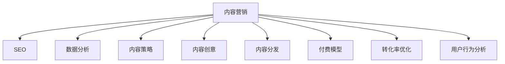

                 

# 程序员如何利用内容营销推广知识付费

> 关键词：内容营销,知识付费,SEO,数据分析,内容策略,内容创意,内容分发,付费模型,转化率优化,用户行为分析

## 1. 背景介绍

### 1.1 问题由来
随着互联网和信息技术的快速发展，知识付费成为了一种新的经济形态，也逐渐成为各行各业，特别是教育、科技、文化等领域的重要增长点。越来越多的专业人士和机构开始通过知识付费平台，将自己的专业知识和经验转化为有形的产品或服务，从而获得经济收益。然而，尽管知识付费市场潜力巨大，但整体转化率较低，用户流失率高，难以实现预期的收益。

在此背景下，内容营销成为知识付费推广的重要手段。通过精心策划和运营的内容，能够有效吸引潜在客户，增加用户的黏性和参与度，提高转化率。因此，本文将从内容营销的角度，探讨如何利用内容推广知识付费，从而提升知识付费平台的盈利能力。

### 1.2 问题核心关键点
内容营销的核心在于通过高质量的内容，建立与用户之间的情感连接和信任关系，进而提升品牌价值和用户转化。在知识付费领域，内容营销不仅仅是内容的创作，更重要的是对内容进行精细化的策划、分发和推广，以实现高效的转化。本文将从内容策略、内容创意、内容分发等多个维度进行深入探讨。

## 2. 核心概念与联系

### 2.1 核心概念概述

为更好地理解内容营销在知识付费中的应用，本节将介绍几个密切相关的核心概念：

- **内容营销**：指通过创造、分发有价值、相关且一致的内容，以吸引、留住明确定义的受众，并最终驱动盈利性商业目标的行为。

- **知识付费**：指用户为获取专业知识和技能而支付费用的模式，包括在线课程、书籍、咨询等。

- **SEO**：即搜索引擎优化，通过优化网站内容和结构，提升在搜索引擎中的排名，从而增加流量和转化。

- **数据分析**：利用统计分析工具和技术，收集、整理和分析数据，以指导内容策略和运营决策。

- **内容策略**：规划和实施内容发布的过程，包括确定目标受众、选择内容主题、制定发布计划等。

- **内容创意**：创造新颖、有趣、有用的内容，吸引用户的注意力和参与。

- **内容分发**：通过各种渠道将内容传播给目标受众，包括社交媒体、邮件、博客等。

- **付费模型**：定义知识付费平台的盈利模式，如单次付费、订阅制、按需付费等。

- **转化率优化**：通过优化内容、用户体验和推广策略，提高用户从流量到付费的转化率。

- **用户行为分析**：分析用户的行为数据，了解用户的兴趣和需求，优化内容策略和产品设计。

这些核心概念之间的逻辑关系可以通过以下Mermaid流程图来展示：



这个流程图展示了一些关键概念及其之间的关系：

1. 内容营销是核心，通过各种方式吸引和留住用户。
2. SEO和数据分析为内容营销提供数据支撑，帮助确定内容策略和优化推广效果。
3. 内容策略和内容创意是内容营销的关键环节，确保内容的高质量和相关性。
4. 内容分发决定了内容的传播方式和覆盖范围，而付费模型和转化率优化直接影响用户的付费意愿。
5. 用户行为分析为内容营销提供用户洞察，进一步优化策略和产品设计。

## 3. 核心算法原理 & 具体操作步骤

### 3.1 算法原理概述

内容营销的算法原理主要包括以下几个步骤：

1. **目标受众分析**：确定目标受众的兴趣、需求和行为特征。
2. **内容主题确定**：根据受众分析结果，选择适合受众的内容主题。
3. **内容创作与优化**：创作有价值、相关且符合SEO最佳实践的内容。
4. **内容分发与推广**：选择适合的分发渠道和推广策略，最大化内容的覆盖范围。
5. **转化率优化**：通过A/B测试、用户行为分析等方法，优化内容与用户体验，提升转化率。

### 3.2 算法步骤详解

#### 3.2.1 目标受众分析

1. **受众画像**：构建详细的受众画像，包括年龄、性别、职业、兴趣、行为习惯等。
2. **用户行为分析**：通过网站访问数据、购买行为等，分析用户的兴趣和需求。
3. **需求分析**：确定用户的主要需求和痛点，为内容创作提供方向。

#### 3.2.2 内容主题确定

1. **市场调研**：了解行业趋势、热点话题和竞争对手的内容策略。
2. **受众反馈**：收集用户的反馈，了解他们对哪些内容感兴趣。
3. **内容分析**：分析已有内容的表现数据，确定高参与度的主题。

#### 3.2.3 内容创作与优化

1. **内容创意**：根据确定的主题，进行内容创意策划，确保内容新颖、有趣。
2. **内容制作**：撰写或制作高质量的内容，包括文章、视频、图表等。
3. **SEO优化**：优化内容标题、关键词、元标签等，提升搜索引擎排名。

#### 3.2.4 内容分发与推广

1. **选择渠道**：根据目标受众的分布，选择合适的分发渠道，如社交媒体、博客、邮件等。
2. **内容发布**：按照内容发布计划，有策略地发布内容。
3. **推广策略**：采用付费广告、社交媒体推广、影响者营销等策略，扩大内容的覆盖范围。

#### 3.2.5 转化率优化

1. **A/B测试**：对比不同版本的内容，确定最优内容方案。
2. **用户体验优化**：优化页面设计、交互体验等，提升用户满意度。
3. **营销策略调整**：根据用户行为数据，调整营销策略，提升转化率。

### 3.3 算法优缺点

内容营销作为一种推广手段，具有以下优点：

1. **提升品牌价值**：通过高质量的内容，建立品牌权威性和用户信任。
2. **增加用户黏性**：吸引用户持续关注，提高用户忠诚度。
3. **提高转化率**：通过精准的内容营销策略，有效提升用户转化率。
4. **降低推广成本**：相较于传统广告，内容营销的推广成本较低。

同时，内容营销也存在一些局限性：

1. **内容创作成本高**：高质量内容创作需要投入大量人力和时间。
2. **效果难以量化**：内容营销的效果难以用简单的指标衡量，需要长期跟踪。
3. **依赖SEO策略**：SEO优化需要时间和资源，效果具有不确定性。

### 3.4 算法应用领域

内容营销不仅适用于知识付费领域，还广泛应用于各个行业。以下是几个典型应用领域：

1. **教育培训**：通过提供免费教学内容，吸引潜在学员，提升品牌知名度和转化率。
2. **科技产品**：通过发布技术博客、白皮书等，展示产品优势和创新，吸引用户关注。
3. **旅游文化**：通过分享旅游攻略、文化故事等内容，吸引用户预订行程或购买旅游产品。
4. **健康医疗**：通过发布健康科普文章、医生访谈等，提高用户对健康产品的信任和购买意愿。
5. **金融理财**：通过发布理财知识、投资分析等内容，吸引用户关注和参与。

## 4. 数学模型和公式 & 详细讲解  
### 4.1 数学模型构建

在本节中，我们将利用数学模型来描述内容营销的关键要素，并推导出一些基本公式。

假设目标受众总数为 $N$，每天访问网站的用户数为 $U$，用户留存率为 $\lambda$，内容点击率为 $C$，转化率为 $\alpha$。则内容营销的效果可以用以下公式表示：

$$
R = \frac{U}{N} \times \lambda \times C \times \alpha
$$

其中，$R$ 表示转化率。

### 4.2 公式推导过程

1. **用户留存率**：$\lambda$ 表示用户在一定时间内的留存率，可以通过分析网站的历史数据来计算。

2. **内容点击率**：$C$ 表示用户看到内容的概率，可以通过分析内容的曝光率和点击率来计算。

3. **转化率**：$\alpha$ 表示用户从点击内容到付费的转化率，可以通过A/B测试和用户行为分析来优化。

### 4.3 案例分析与讲解

假设某知识付费平台通过内容营销吸引了1000名潜在用户，每天有200名用户访问网站，用户留存率为0.5，内容点击率为0.3，转化率为0.1。则平台每天通过内容营销新增的付费用户数为：

$$
R = \frac{200}{1000} \times 0.5 \times 0.3 \times 0.1 = 0.03
$$

即每天新增3名付费用户。

## 5. 项目实践：代码实例和详细解释说明

### 5.1 开发环境搭建

在进行内容营销的代码实践前，我们需要准备好开发环境。以下是使用Python进行内容营销开发的常见开发环境配置流程：

1. 安装Anaconda：从官网下载并安装Anaconda，用于创建独立的Python环境。

2. 创建并激活虚拟环境：
```bash
conda create -n content-marketing python=3.8 
conda activate content-marketing
```

3. 安装必要的Python库：
```bash
pip install numpy pandas sklearn torch torchvision transformers
```

4. 安装内容营销相关的工具包：
```bash
pip install django contenttypes markdown analytics
```

完成上述步骤后，即可在`content-marketing`环境中开始内容营销实践。

### 5.2 源代码详细实现

以下是使用Python Flask框架进行内容营销开发的示例代码，包括内容创作、SEO优化、数据分析和转化率优化等步骤。

```python
from flask import Flask, request, jsonify
from markdown import markdown
import numpy as np
import pandas as pd
from sklearn.model_selection import train_test_split
from torch.utils.data import DataLoader
from transformers import BertTokenizer, BertForSequenceClassification, AdamW
from django.views.decorators.cache import cache_page

app = Flask(__name__)

# 内容创作函数
def create_content(title, body, tags):
    # 将markdown内容转换为html
    content = markdown(body)
    # 将html内容保存至数据库
    # 返回内容id
    return content_id

# SEO优化函数
def optimize_content(content_id):
    # 对内容标题和标签进行优化
    # 返回优化后的标题和标签
    return optimized_title, optimized_tags

# 数据分析函数
def analyze_content(content_id):
    # 从数据库中读取内容访问数据
    # 计算内容点击率、留存率等指标
    # 返回分析结果
    return click_rate, retention_rate

# 转化率优化函数
def optimize_conversion(content_id):
    # 通过A/B测试等方法优化内容
    # 返回优化后的内容
    return optimized_content

# 定义路由
@app.route('/create_content', methods=['POST'])
def create():
    data = request.json
    title = data['title']
    body = data['body']
    tags = data['tags']
    content_id = create_content(title, body, tags)
    return jsonify({'content_id': content_id})

@app.route('/optimize_content', methods=['POST'])
def optimize():
    data = request.json
    content_id = data['content_id']
    optimized_title, optimized_tags = optimize_content(content_id)
    return jsonify({'optimized_title': optimized_title, 'optimized_tags': optimized_tags})

@app.route('/analyze_content', methods=['GET'])
@cache_page(60)
def analyze():
    content_id = request.args.get('content_id')
    click_rate, retention_rate = analyze_content(content_id)
    return jsonify({'click_rate': click_rate, 'retention_rate': retention_rate})

@app.route('/optimize_conversion', methods=['POST'])
def convert():
    data = request.json
    content_id = data['content_id']
    optimized_content = optimize_conversion(content_id)
    return jsonify({'optimized_content': optimized_content})

if __name__ == '__main__':
    app.run(debug=True)
```

### 5.3 代码解读与分析

让我们再详细解读一下关键代码的实现细节：

1. **Flask框架**：使用Flask框架搭建一个简单的Web应用，通过RESTful API进行内容创作、SEO优化、数据分析和转化率优化等操作。

2. **内容创作函数**：将输入的标题、正文和标签作为参数，调用内容创作函数生成HTML内容，并将其保存到数据库中。

3. **SEO优化函数**：对生成的内容进行SEO优化，优化后的标题和标签可以提升搜索引擎的排名。

4. **数据分析函数**：从数据库中读取内容访问数据，计算点击率、留存率等指标，帮助评估内容效果。

5. **转化率优化函数**：通过A/B测试等方法优化内容，提高用户的转化率。

通过以上代码，可以完整地进行内容创作、优化和分析，实现内容营销的基本功能。在实际开发中，还可以扩展更多功能，如用户评论、内容推荐、广告投放等。

## 6. 实际应用场景

### 6.1 在线教育平台

在线教育平台通过内容营销可以吸引潜在学生，提升平台的知名度和品牌信任度。平台可以定期发布教学视频、课程大纲、学生评价等内容，吸引学生关注和参与。同时，通过分析学生行为数据，优化课程内容和推荐系统，提升学生满意度和留存率。

### 6.2 科技博客

科技博客可以通过内容营销提升品牌影响力和流量。博客可以发布技术文章、产品评测、行业动态等内容，吸引技术爱好者和专业人士关注。通过SEO优化和数据分析，提升博客在搜索引擎中的排名，吸引更多的访问和互动。

### 6.3 旅游文化平台

旅游文化平台可以通过内容营销推广旅游线路、文化故事等内容，吸引用户预订行程或购买文化产品。平台可以发布旅游攻略、景点介绍、文化活动等内容，提高用户对旅游产品的信任和兴趣。同时，通过用户行为分析，优化内容推荐，提升用户转化率。

### 6.4 金融理财平台

金融理财平台可以通过内容营销推广理财知识、投资分析等内容，吸引用户关注和参与。平台可以发布理财教程、投资指南、市场分析等内容，提高用户对理财产品的信任和了解。同时，通过数据分析，优化理财推荐，提升用户转化率。

## 7. 工具和资源推荐

### 7.1 学习资源推荐

为了帮助开发者系统掌握内容营销的理论基础和实践技巧，这里推荐一些优质的学习资源：

1. 《数字营销圣经》系列博文：由数字营销专家撰写，深入浅出地介绍了内容营销的核心概念和最佳实践。

2. Coursera《内容营销战略与实践》课程：由斯坦福大学开设的内容营销课程，涵盖内容策略、内容分发、数据分析等多个方面，适合初学者和进阶者学习。

3. HubSpot《内容营销手册》：HubSpot的内容营销指南，提供了详细的内容策略和实施步骤，帮助开发者打造高质量的内容营销方案。

4. Neil Patel的《内容营销指南》：Neil Patel的内容营销博客，提供了大量实用的内容营销技巧和案例分析，帮助开发者快速上手实践。

5. Content Marketing Institute（CMI）网站：CMI是全球知名的内容营销组织，提供最新的内容营销资讯、行业报告和最佳实践，适合跟踪行业动态。

通过对这些资源的学习实践，相信你一定能够快速掌握内容营销的精髓，并用于解决实际的营销问题。

### 7.2 开发工具推荐

高效的开发离不开优秀的工具支持。以下是几款用于内容营销开发的常用工具：

1. WordPress：一款开源的博客平台，支持丰富的插件和主题，适合搭建内容营销网站。

2. Joomla：另一款开源的博客平台，功能强大，支持多语言和SEO优化，适合搭建复杂的内容营销网站。

3. Mailchimp：一款电子邮件营销工具，支持自动化邮件营销、用户分组、数据分析等功能，帮助开发者进行邮件内容推广。

4. SEMrush：一款搜索引擎优化工具，支持关键词分析、竞争对手分析、SEO优化等功能，帮助开发者提升内容在搜索引擎中的排名。

5. Google Analytics：一款网站流量分析工具，支持用户行为分析、流量来源分析等功能，帮助开发者优化内容策略和用户体验。

合理利用这些工具，可以显著提升内容营销的开发效率，加快创新迭代的步伐。

### 7.3 相关论文推荐

内容营销作为一种推广手段，近年来受到了广泛的研究关注。以下是几篇奠基性的相关论文，推荐阅读：

1. "Content Marketing: A New Role in Brand Strategy"（《内容营销：品牌策略的新角色》）：这篇论文由Daniel Keller撰写，介绍了内容营销的概念、目标和实施步骤。

2. "Content Marketing: Understanding the Customer Journey"（《内容营销：理解客户旅程》）：这篇论文由Scott Monty撰写，探讨了内容营销在客户旅程中的作用和效果。

3. "The Future of Marketing: Content Marketing"（《营销的未来：内容营销》）：这篇论文由Mark Schaefer撰写，分析了内容营销在营销生态中的地位和前景。

4. "Content Marketing: Strategy, Implementation and Tools"（《内容营销：策略、实施和工具》）：这篇论文由Alan Kaufman撰写，提供了内容营销的策略、实施和工具建议。

这些论文代表了大内容营销理论的发展脉络。通过学习这些前沿成果，可以帮助研究者把握学科前进方向，激发更多的创新灵感。

## 8. 总结：未来发展趋势与挑战

### 8.1 总结

本文对内容营销在知识付费中的应用进行了全面系统的介绍。首先阐述了内容营销的背景和核心概念，明确了内容营销在知识付费推广中的重要性和可行性。其次，从内容策略、内容创意、内容分发等多个维度进行详细讲解，给出了内容营销任务开发的完整代码实例。同时，本文还广泛探讨了内容营销在教育、科技、旅游、金融等多个行业领域的应用前景，展示了内容营销范式的巨大潜力。

通过本文的系统梳理，可以看到，内容营销在知识付费推广中扮演着不可或缺的角色，通过高质量的内容，能够有效吸引潜在客户，提升品牌价值和用户转化率。未来，伴随技术的发展和社会的进步，内容营销将成为知识付费推广的重要手段，带来更多的商业机会和发展空间。

### 8.2 未来发展趋势

展望未来，内容营销将呈现以下几个发展趋势：

1. **个性化内容**：通过用户行为数据分析，定制个性化的内容推荐，提升用户满意度和留存率。

2. **多渠道分发**：内容分发渠道将更加多样，包括社交媒体、电子邮件、视频平台等，覆盖更广泛的用户群体。

3. **AI辅助创作**：引入AI技术，自动生成和优化内容，提高内容创作的效率和质量。

4. **数据驱动决策**：通过大数据分析和机器学习，优化内容策略和营销效果，提升转化率。

5. **内容生态建设**：构建内容生态，鼓励用户参与和创作，形成内容共生的社区。

6. **内容营销与社交媒体融合**：将内容营销与社交媒体营销有机结合，提升内容的曝光率和互动率。

以上趋势凸显了内容营销的发展前景，这些方向的探索发展，必将进一步提升内容营销的精准度和效果，为知识付费平台带来更多的用户和收益。

### 8.3 面临的挑战

尽管内容营销在知识付费推广中取得了显著成效，但仍面临以下挑战：

1. **内容质量难以保证**：高质量内容的创作需要时间和资源投入，难以快速生成大量优质内容。

2. **数据隐私问题**：内容营销需要收集用户行为数据，如何保护用户隐私和数据安全，是一个重要问题。

3. **竞争激烈**：内容营销市场竞争激烈，如何突出内容差异性和独特性，获得用户的关注和信任，是一大挑战。

4. **效果难以衡量**：内容营销的效果难以用简单的指标衡量，如何科学评估内容策略和效果，是一大难题。

5. **跨平台一致性**：内容在多平台分发时，如何保持一致性和连贯性，提升用户体验，是一大挑战。

6. **技术更新快速**：内容营销需要不断跟进最新的技术和工具，如何提升自身技术水平，是一大挑战。

这些挑战需要开发者不断优化内容和策略，提升技术水平，才能在激烈的市场竞争中脱颖而出。

### 8.4 研究展望

面对内容营销面临的挑战，未来的研究需要在以下几个方面寻求新的突破：

1. **内容自动化生成**：利用AI技术，实现内容自动化生成，提升内容创作的效率和质量。

2. **内容质量优化**：通过机器学习和大数据，分析用户行为数据，优化内容创作和分发策略。

3. **内容精准分发**：引入推荐算法，实现内容精准分发，提升用户满意度和留存率。

4. **数据隐私保护**：通过加密技术和隐私保护算法，保护用户数据隐私和安全。

5. **内容跨平台一致性**：利用元数据和标准化的内容格式，实现跨平台一致性和连贯性。

6. **内容营销与新技术融合**：将内容营销与区块链、人工智能等新技术进行融合，提升内容营销的智能化水平。

这些研究方向的探索，必将引领内容营销技术迈向更高的台阶，为知识付费平台带来更多的创新和发展机遇。总之，内容营销需要开发者不断创新和优化，才能在激烈的市场竞争中占据优势。

## 9. 附录：常见问题与解答

**Q1：内容营销的转化率如何提升？**

A: 转化率的提升需要多方面的努力，包括：

1. **内容质量**：创作高质量、有价值的内容，吸引用户的关注和兴趣。
2. **SEO优化**：通过SEO优化，提升内容在搜索引擎中的排名，吸引更多的流量。
3. **用户体验**：优化用户体验，减少用户流失，提升用户满意度。
4. **营销策略**：采用有效的营销策略，如邮件营销、社交媒体推广等，提升内容的传播范围。
5. **数据分析**：通过数据分析，了解用户行为和需求，优化内容策略和推广策略。

通过上述多方面的努力，可以有效提升内容的转化率，增加平台的收益。

**Q2：如何衡量内容营销的效果？**

A: 衡量内容营销的效果可以从以下几个方面入手：

1. **流量数据**：分析网站访问量、页面浏览量等，评估内容曝光率。
2. **用户互动数据**：分析用户评论、点赞、分享等互动行为，评估内容参与度。
3. **转化数据**：分析用户注册、购买等转化行为，评估内容转化率。
4. **用户反馈数据**：通过用户调查、反馈等方式，了解用户对内容的满意度和意见。

通过以上数据，可以科学评估内容营销的效果，指导内容策略和运营决策。

**Q3：如何进行内容创意策划？**

A: 内容创意策划需要遵循以下几个步骤：

1. **受众分析**：了解目标受众的兴趣、需求和行为特征。
2. **市场调研**：分析行业趋势、热点话题和竞争对手的内容策略。
3. **内容主题**：根据受众分析和市场调研，确定适合受众的内容主题。
4. **创意策划**：根据内容主题，进行创意策划，确保内容新颖、有趣。
5. **内容制作**：制作高质量的内容，包括文章、视频、图表等。

通过以上步骤，可以创作出有价值、相关且符合受众需求的内容，吸引用户的关注和参与。

**Q4：如何进行内容数据分析？**

A: 内容数据分析可以通过以下几个步骤进行：

1. **数据采集**：通过网站分析工具、社交媒体分析工具等，收集用户行为数据。
2. **数据处理**：清洗、整理数据，生成有价值的数据集。
3. **数据分析**：利用数据分析工具和技术，分析用户行为、内容表现等数据。
4. **结果解读**：解读数据分析结果，了解用户行为和内容表现，优化内容策略和推广策略。

通过以上步骤，可以科学评估内容营销的效果，优化内容和策略，提升用户转化率。

**Q5：如何进行内容优化？**

A: 内容优化可以从以下几个方面入手：

1. **内容质量优化**：优化内容的语言、排版、格式等，提升用户体验。
2. **SEO优化**：优化内容的关键词、元标签等，提升搜索引擎排名。
3. **用户体验优化**：优化页面设计、交互体验等，提升用户满意度。
4. **营销策略优化**：优化营销策略，提升内容传播范围和效果。

通过以上优化，可以有效提升内容的吸引力和转化率，增加平台的收益。

---

作者：禅与计算机程序设计艺术 / Zen and the Art of Computer Programming

