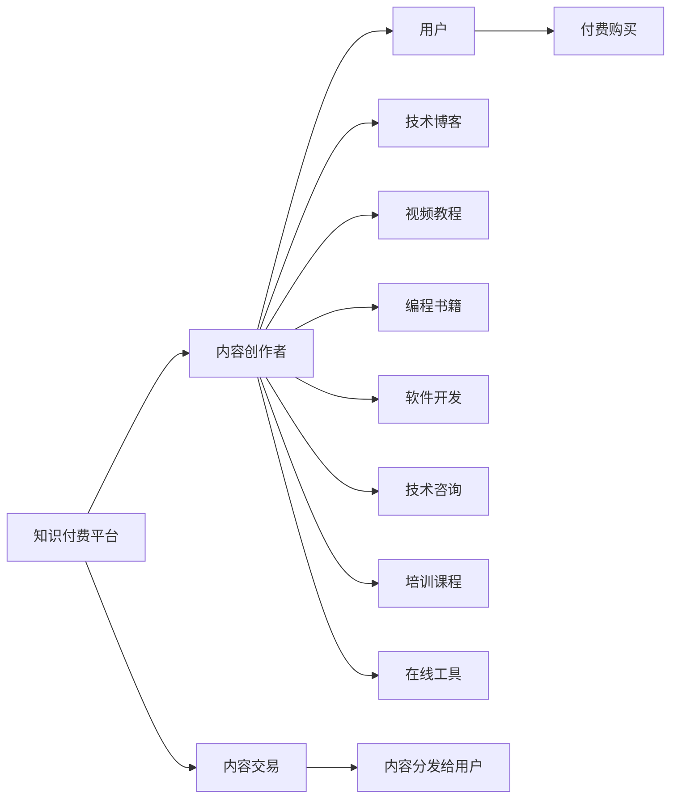

                 

## 1. 背景介绍

在数字化时代，程序员这个群体既面临着机遇，也遭遇着挑战。一方面，随着互联网、大数据、人工智能等技术的飞速发展，程序员的专业技能越来越受到重视，需求旺盛；另一方面，技术的迭代更新速度加快，职业竞争也日益激烈。如何在快速发展中把握机会，持续提升自身的市场竞争力，实现职业生涯的长远发展，成为许多程序员关注的焦点。

知识付费的出现，为程序员提供了一种全新的路径。通过将自己的专业知识转化为有偿知识服务，程序员不仅可以在专业技能上持续精进，还能开辟一条被动收入的渠道。本文将详细探讨程序员如何利用知识付费实现被动收入，介绍其核心策略与方法，希望能为广大的程序员提供有益的参考。

## 2. 核心概念与联系

### 2.1 核心概念概述

在讨论程序员如何利用知识付费实现被动收入之前，我们首先需要明确几个核心概念：

- **知识付费**：指通过付费方式获取他人高价值知识或技能的行为，旨在通过高效率地吸收和应用知识，提高个人或企业的决策、执行能力。

- **程序员的被动收入**：指程序员通过投入一定的时间和精力，将其专业知识转化为有偿服务或产品，从而实现非劳动性收入的获得。

- **知识付费平台**：如Coursera、Udemy、Medium等，提供有偿知识内容的交易平台，使得知识的供需双方能够高效连接。

- **内容创作**：程序员通过撰写技术博客、录制视频教程、编写编程书籍等方式，创造有价值的内容。

- **产品销售**：包括软件开发、技术咨询、培训课程、在线工具等，将专业知识转换为具体的产品或服务，实现商业化运作。

这些概念之间通过知识付费这条纽带紧密联系，共同构建了程序员实现被动收入的生态系统。

### 2.2 核心概念原理和架构的 Mermaid 流程图

## 3. 核心算法原理 & 具体操作步骤

### 3.1 算法原理概述

基于知识付费的程序员被动收入模型，本质上是一种基于内容的付费机制。其核心原理是：

- **价值交换**：知识创作者提供有价值的内容，用户通过付费获得所需知识。
- **供需匹配**：知识付费平台作为中介，高效匹配知识创作者与用户，促进交易发生。
- **激励机制**：平台通过算法优化推荐，确保知识创作者能够持续创作优质内容，维持平台的活跃度和吸引力。

### 3.2 算法步骤详解

程序员实现被动收入的主要操作步骤包括以下几个方面：

**Step 1: 确定专业领域和受众定位**

程序员需要首先确定自己的专业领域（如Web开发、数据科学、人工智能等），并明确目标受众（如初级开发者、企业IT部门、技术爱好者等）。这有助于后续内容创作和营销推广的精准定位。

**Step 2: 创建优质内容**

1. **技术博客**：撰写高质量的技术文章，分享个人经验和见解，解决实际问题。
2. **视频教程**：录制技术讲解、编程实战、项目分享等视频内容，通过视频形式直观展示知识和技能。
3. **编程书籍**：撰写专业书籍，系统整理知识和实践经验，提供深入的学习路径。
4. **软件开发**：开发实用的工具或应用，解决特定问题，提供解决方案。
5. **技术咨询**：提供专业的技术咨询，帮助企业解决实际技术问题。
6. **培训课程**：设计线上或线下培训课程，分层次教学，满足不同水平用户的需求。

**Step 3: 选择合适的知识付费平台**

根据内容和受众定位，选择合适的知识付费平台。常见平台如Udemy、Coursera、Medium、知乎Live等，每个平台的用户群体、内容风格、收费模式均有所不同，程序员需根据自身情况进行选择。

**Step 4: 内容发布和营销推广**

1. **平台注册和认证**：注册成为知识付费平台的创作者，提交相关资质证明。
2. **内容发布**：将创作好的内容上传到平台，填写详细描述和标签，确保内容易检索、易理解。
3. **营销推广**：通过社交媒体、技术社区、个人网站等多种渠道推广内容，吸引用户关注。

**Step 5: 收益分配和持续优化**

1. **收益分配**：平台根据用户购买次数和价格，进行收益分配。程序员需要关注平台的分成比例、支付方式等细节。
2. **持续优化**：根据用户反馈和数据指标，持续优化内容和营销策略，提升内容质量和收益。

### 3.3 算法优缺点

基于知识付费的程序员被动收入模型具有以下优点：

- **高效知识传播**：知识创作者通过平台高效传播知识，覆盖更广泛的受众。
- **持续收入来源**：通过优质内容积累，程序员可以获得持续的被动收入，不受限于短期劳动。
- **专业化服务**：专注于自己擅长的领域，提升专业能力和市场竞争力。

同时，该模型也存在一些局限性：

- **平台竞争**：知识付费市场竞争激烈，需要不断优化内容和营销策略。
- **内容更新**：需要持续更新内容，以保持受众的兴趣和平台的吸引力。
- **技术门槛**：创建优质内容需要较高的专业技术和表达能力，有一定的门槛。
- **用户反馈**：需要关注用户反馈，及时调整内容和策略，满足用户需求。

### 3.4 算法应用领域

基于知识付费的程序员被动收入模型可以应用于各种技术相关的知识和技能传播，如编程教学、软件开发、数据分析、人工智能等。适合于希望通过技术积累实现长期收益的程序员，特别适用于在特定技术领域有深入研究且具备良好表达能力的开发者。

## 4. 数学模型和公式 & 详细讲解 & 举例说明

### 4.1 数学模型构建

为便于理解和分析，本文将通过数学模型来构建基于知识付费的程序员被动收入模型。假设程序员每月的知识创作收入为$R$，其中$C$为内容创作的固定成本，$V$为用户购买内容的价值，$n$为内容的购买次数，$P$为每次购买的平台分成比例。

$$ R = Vn(1-P) $$

### 4.2 公式推导过程

通过推导该模型，可以发现：

- **V（用户购买价值）**：内容的质量和吸引力直接影响到用户购买价值，高质量的内容能够吸引更多的购买。
- **n（购买次数）**：内容传播的广泛度和可见性，以及推广策略的效果，决定了用户购买的次数。
- **P（平台分成比例）**：平台的分成比例决定了程序员的实际收入，低比例能够提高程序员的净收益。

### 4.3 案例分析与讲解

假设一个程序员在知识付费平台上发布了一系列高级Java编程课程，内容质量高，定价为$50，每次购买平台抽成比例为20%。如果一个月内课程被购买了10次，则他实际获得的收入为：

$$ R = 50 \times 10 \times (1 - 0.2) = 400 $$

若内容点击率（展示给用户的概率）为0.5，每篇内容平均被点击100次，则一个月内总点击量为：

$$ n = 100 \times 0.5 \times M $$

其中$M$为每月发布内容的篇数。如果假设每篇内容的点击率相等，则：

$$ R = 50 \times \frac{n}{M} $$

$$ 400 = 50 \times \frac{100 \times 0.5 \times M}{M} $$

由此可以推导出程序员每月发布内容的篇数$M$：

$$ M = 8 $$

因此，为了最大化收入，程序员需要每月发布至少8篇高质量的编程课程。

## 5. 项目实践：代码实例和详细解释说明

### 5.1 开发环境搭建

在进行知识付费内容创作和发布前，需要搭建开发环境，并进行相关技术的学习和工具的配置。

1. **工具安装**：安装Markdown编辑器（如Typora）、视频录制软件（如OBS Studio）、编程书籍编写工具（如Scrivener）等。
2. **平台注册**：注册Udemy、Coursera、Medium等知识付费平台的创作者账号。
3. **内容发布**：使用Markdown编辑器撰写技术博客，录制视频教程，使用编程书籍编写工具撰写书籍。

### 5.2 源代码详细实现

本文将以Udemy平台为例，介绍如何发布高质量的编程课程。

1. **课程创建**：登录Udemy平台，创建新课程，填写课程标题、描述、课程大纲等。

2. **课程内容上传**：将录制的视频教程、撰写的技术博客、编程书籍等上传至Udemy平台，并设置观看顺序和时长。

3. **课程定价和分成比例**：根据市场调研和目标受众，设置课程价格和平台分成比例。

4. **营销推广**：通过社交媒体、技术社区、个人网站等渠道推广课程，吸引潜在用户。

### 5.3 代码解读与分析

Udemy平台的课程创建和上传流程相对简单，主要涉及到与平台的交互和内容的生成。核心技术包括：

- **Markdown格式处理**：使用Markdown编辑器撰写博客和书籍内容，Markdown格式具有轻量级、易读性高的特点，适合于技术内容。
- **视频录制和编辑**：使用OBS Studio录制视频教程，并进行剪辑、导出。
- **课程分发和管理**：在Udemy平台上发布和管理课程，设置价格、课程大纲、观看顺序等。

### 5.4 运行结果展示

创建和发布课程后，可以实时监控课程的观看量和销售情况，并通过Udemy平台提供的分析工具，了解用户行为和购买趋势。

## 6. 实际应用场景

### 6.1 企业IT培训

许多企业IT部门需要定期培训员工，以提升技术水平和技能。通过知识付费平台发布专业IT培训课程，可以高效地满足企业培训需求。程序员可以在企业内部知识库中发布课程，并通过知识付费平台向外部市场推广，实现企业的内外部知识共享。

### 6.2 技术知识普及

许多技术爱好者和初学者对特定技术领域有深入学习的兴趣，但往往找不到系统化的学习路径。程序员可以通过知识付费平台发布技术博客、视频教程、编程书籍等，帮助用户系统学习某一技术领域，并获取持续收入。

### 6.3 在线技术咨询服务

许多企业需要专业的技术咨询服务，但找合适的顾问并不容易。通过知识付费平台发布技术咨询课程或一对一咨询服务，程序员可以为用户提供高质量的解决方案，并通过付费咨询实现被动收入。

### 6.4 未来应用展望

基于知识付费的程序员被动收入模型未来有以下发展趋势：

1. **内容多样化**：除了视频、博客、书籍等，还可以发布互动式编程练习、在线编程工具等，提供更丰富、更互动的学习体验。
2. **平台多样化**：知识付费平台不仅限于Udemy、Coursera等，还可以选择在Bilibili、知乎等平台发布内容。
3. **多元化收入**：除了知识付费，还可以通过课程售卖、书籍销售、开发工具销售等多种方式获取收入。
4. **全球化传播**：利用知识付费平台的全球化优势，发布多语言、多文化的内容，拓展全球市场。
5. **社区互动**：在知识付费平台上建立社区，与用户进行互动，提供答疑解惑、实时交流等额外服务。

## 7. 工具和资源推荐

### 7.1 学习资源推荐

- **《如何利用知识付费变现》书籍**：该书详细介绍了知识付费的概念、平台选择、内容创作、营销推广等，是程序员入门的绝佳资料。
- **Coursera、Udemy、Medium等平台官方教程**：各大知识付费平台的官方教程，涵盖了创建课程、平台交互、内容上传、营销推广等各个环节，适合不同水平的用户。
- **知乎Live、Bilibili Live等直播平台**：适合进行实时互动和答疑，提升用户参与度和课程质量。

### 7.2 开发工具推荐

- **Markdown编辑器**：如Typora、Sublime Text、Atom等，用于撰写技术博客和书籍内容。
- **视频录制和编辑软件**：如OBS Studio、Adobe Premiere、Final Cut Pro等，用于录制和编辑视频教程。
- **在线课程平台**：如Udemy、Coursera、Medium等，便于内容发布和管理。

### 7.3 相关论文推荐

- **《知识付费在教育中的应用研究》**：探讨了知识付费在教育领域的优势和挑战，提供了有效的实践建议。
- **《编程课程的市场分析与优化》**：通过对编程课程市场的数据分析，提出了课程内容优化和定价策略。
- **《在线教育平台的用户行为分析》**：分析了在线教育平台用户的行为和需求，提出了提升用户参与度和满意度的策略。

## 8. 总结：未来发展趋势与挑战

### 8.1 研究成果总结

本文对基于知识付费的程序员被动收入模型进行了系统的介绍，详细讨论了内容创作、平台选择、营销推广等关键环节，并通过数学模型推导出最优的发布策略。通过实例分析，展示了知识付费平台的具体操作流程和收入计算方法。同时，本文也讨论了该模型的优缺点及应用场景，提供了丰富的学习资源和工具推荐。

### 8.2 未来发展趋势

未来基于知识付费的程序员被动收入模型将呈现以下发展趋势：

1. **内容创新**：随着技术的发展和用户需求的升级，内容创作将更加注重互动性、多媒体性和实用性。
2. **平台多元化**：知识付费平台将不断拓展，覆盖更多细分领域和用户群体，提升内容的可见性和传播范围。
3. **全球化布局**：利用平台的技术优势，发布多语言、多文化的内容，拓展国际市场。
4. **社区化互动**：在知识付费平台上建立社区，提升用户参与度和课程质量，形成良好的用户生态。
5. **个性化服务**：通过数据分析和机器学习，提供个性化的推荐和内容定制服务，提升用户体验。

### 8.3 面临的挑战

尽管知识付费为程序员提供了新的收入渠道，但在实现过程中也面临一些挑战：

1. **内容质量控制**：如何确保发布的内容质量高、价值大，避免低质量内容对平台和用户的影响。
2. **市场竞争激烈**：知识付费市场竞争激烈，需要不断优化内容和营销策略，才能脱颖而出。
3. **平台抽成问题**：平台抽成比例较高，如何平衡平台和创作者之间的收益分配。
4. **用户信任和满意度**：如何建立用户信任，提升用户满意度和长期留存率。
5. **技术更新速度**：技术快速迭代，如何保持内容的及时更新和前沿性。

### 8.4 研究展望

未来基于知识付费的程序员被动收入模型的研究将进一步深入，有望在以下几个方面取得突破：

1. **AI辅助创作**：利用AI技术，自动生成高质量的内容，减少人工创作的工作量。
2. **智能推荐系统**：基于用户行为和数据分析，建立智能推荐系统，提升内容的曝光率和用户购买率。
3. **跨平台分发**：通过多个平台分发内容，提高内容的可见性和传播效果。
4. **社区互动和反馈**：在知识付费平台上建立社区，实时收集用户反馈，优化内容和服务。
5. **可持续发展**：通过内容的多样化和市场的多元化，实现持续的收入和用户的增长。

总之，基于知识付费的程序员被动收入模型具有广阔的发展前景，需要不断优化和创新，才能在激烈的市场竞争中脱颖而出，实现长期的收入增长和职业发展。

## 9. 附录：常见问题与解答

**Q1: 如何选择适合自己的知识付费平台？**

A: 选择平台时，需要考虑以下因素：
1. **用户群体**：平台的用户主要集中在哪个领域或年龄段。
2. **内容风格**：平台的内容风格是否符合自己的创作方向和用户需求。
3. **分成比例**：平台的分成比例是否合理，能否保障自己的净收益。
4. **技术支持**：平台是否提供丰富的工具和技术支持，便于内容创作和发布。
5. **用户评价**：查看平台的用户评价和课程反馈，了解平台的用户体验和口碑。

**Q2: 如何提升内容的观看量和购买率？**

A: 提升内容观看量和购买率的策略包括：
1. **高质量内容**：创作高质量、有价值的内容，解决实际问题，吸引用户关注。
2. **有效推广**：通过社交媒体、技术社区、个人网站等渠道，广泛宣传内容。
3. **用户互动**：在内容中设置互动环节，增加用户参与感和粘性。
4. **定期更新**：保持内容的及时更新和前沿性，满足用户的学习需求。
5. **社区反馈**：建立社区，收集用户反馈，持续优化内容和服务。

**Q3: 如何进行有效的知识付费营销？**

A: 知识付费营销的策略包括：
1. **多渠道推广**：利用社交媒体、博客、视频网站等多种渠道进行推广，扩大受众范围。
2. **精准定位**：明确目标受众，定制推广策略，提升推广效果。
3. **内容预览**：提供内容预览，激发用户的好奇心和购买欲望。
4. **用户评价**：展示用户评价和反馈，提升用户信任和购买决策。
5. **优惠活动**：通过限时优惠、组合销售等手段，吸引用户购买。

总之，通过系统地优化内容创作和营销策略，程序员可以在知识付费领域实现被动收入，提升职业竞争力和市场价值。

---

作者：禅与计算机程序设计艺术 / Zen and the Art of Computer Programming

