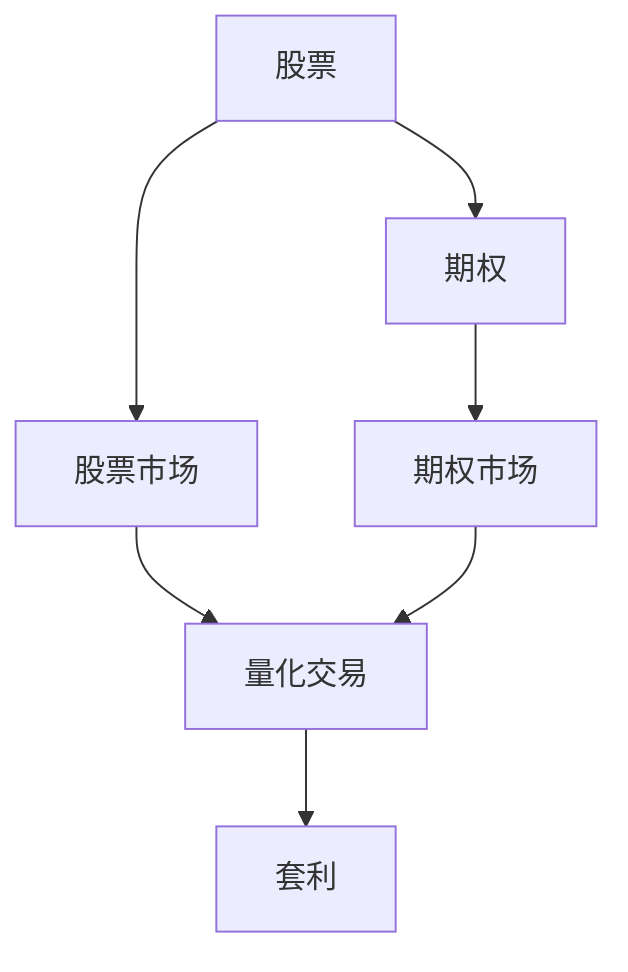

                 

# 程序员如何处理股票和期权

> 关键词：股票,期权,算法,投资,风险管理,量化交易,套利

## 1. 背景介绍

### 1.1 问题由来
随着金融市场的不断发展和金融技术的进步，程序员和量化分析师越来越多地使用编程技能来处理股票和期权。金融领域中，股票和期权是两种最常见的资产。股票代表了公司的所有权，而期权则是一种金融衍生品，允许投资者在未来某一特定时间以特定价格买入或卖出资产。

股票和期权在金融市场中的运作方式不同，因此程序员在处理这两种资产时需要采用不同的策略和方法。本博客将详细介绍程序员如何处理股票和期权，包括基本概念、算法原理和实际应用。

### 1.2 问题核心关键点
程序员处理股票和期权的核心关键点包括：
- 基本概念和市场规则的理解
- 投资策略的制定和执行
- 风险管理和对冲
- 算法交易和套利机会的识别
- 量化交易模型的构建和优化
- 数据处理和分析

这些问题将帮助我们构建一个全面、实用的股票和期权处理框架。

## 2. 核心概念与联系

### 2.1 核心概念概述

为更好地理解程序员如何处理股票和期权，本节将介绍几个密切相关的核心概念：

- **股票 (Stock)**：股票是代表公司所有权的证券，持有者可以分享公司盈利，并在市场上进行买卖。
- **期权 (Option)**：期权是一种金融衍生品，允许持有者在未来某一特定时间以特定价格买入或卖出资产。
- **股票市场 (Stock Market)**：股票市场是股票交易的地方，包括交易所和场外交易市场。
- **期权市场 (Option Market)**：期权市场是期权交易的地方，包括交易所和场外交易市场。
- **量化交易 (Quantitative Trading)**：使用数学模型和计算机算法来执行交易策略，以实现更高的投资回报和风险管理。
- **套利 (Arbitrage)**：利用不同市场之间的价格差异进行无风险的交易，获取利润。

这些核心概念之间的逻辑关系可以通过以下Mermaid流程图来展示：



这个流程图展示了几类核心概念及其之间的关系：

1. 股票在股票市场进行交易，期权在期权市场进行交易。
2. 量化交易使用数学模型和计算机算法在股票和期权市场上执行交易策略。
3. 套利利用不同市场之间的价格差异，获取无风险利润。

这些概念构成了程序员处理股票和期权的理论基础，并帮助他们在实际应用中制定和执行投资策略。

## 3. 核心算法原理 & 具体操作步骤
### 3.1 算法原理概述

程序员处理股票和期权，通常采用基于数据驱动的算法和策略。这些算法通常基于数学模型和统计分析，以最大化投资回报和最小化风险。以下是一些常用的算法原理概述：

- **基本技术指标 (Moving Averages, MACD, RSI)**：通过历史价格数据计算出的指标，用于分析股票和期权市场的趋势和动量。
- **量化交易模型 (Quantitative Models)**：使用数学和统计模型，如回归分析、随机游走模型、蒙特卡洛模拟等，来预测资产价格和波动性。
- **对冲策略 (Hedging Strategies)**：使用期权和其他资产对冲风险，如期权对冲、股指期货对冲等。
- **套利策略 (Arbitrage Strategies)**：利用不同市场之间的价格差异，执行无风险的交易策略，如统计套利、高频套利等。

### 3.2 算法步骤详解

基于数据驱动的股票和期权处理算法通常包括以下关键步骤：

**Step 1: 数据收集与预处理**
- 收集股票和期权市场的相关数据，如历史价格、交易量、市场指数等。
- 清洗和预处理数据，确保数据质量，包括去重、填补缺失值、归一化等。

**Step 2: 特征提取与选择**
- 使用技术指标和其他特征，如基本面数据、市场情绪指标等，提取有用的特征。
- 选择最相关的特征，构建特征集合，以供后续分析使用。

**Step 3: 模型训练与验证**
- 使用历史数据训练量化交易模型，如回归模型、决策树、神经网络等。
- 在验证集上评估模型的性能，调整参数和超参数，以提高模型的泛化能力。

**Step 4: 策略回测与优化**
- 在回测环境中模拟交易策略的执行，评估其历史表现。
- 优化交易策略，提高其预期收益，并控制风险。

**Step 5: 实盘执行**
- 将优化的交易策略应用于实盘交易，监控市场动态。
- 根据市场变化，及时调整策略，保持最优性能。

### 3.3 算法优缺点

基于数据驱动的股票和期权处理算法具有以下优点：
1. 自动化程度高。通过算法自动化执行交易策略，提高效率和一致性。
2. 风险可控。通过数学模型和统计分析，量化风险，实施对冲策略。
3. 数据驱动。基于大量历史数据和市场动态，制定策略，提高预测准确性。

同时，该算法也存在一定的局限性：
1. 依赖历史数据。历史数据的质量和代表性对算法的性能有重大影响。
2. 模型复杂。构建和优化量化模型需要较高的数学和统计知识。
3. 市场波动。市场非预期的变化可能会影响算法的性能。
4. 执行延迟。高频交易等算法需要低延迟执行，受计算机硬件和网络速度限制。

尽管存在这些局限性，但就目前而言，基于数据驱动的算法仍然是在金融市场中最主流的方法之一。未来相关研究的重点在于如何进一步降低算法的复杂度，提高其可解释性和鲁棒性，同时兼顾预测准确性和执行效率。

### 3.4 算法应用领域

基于数据驱动的股票和期权处理算法，在金融市场中的应用广泛，涵盖了股票、期货、期权等各类资产。以下是一些具体应用领域：

- **股票交易**：使用技术指标和回归模型，分析股票价格走势，制定买卖策略。
- **期权交易**：使用蒙特卡洛模拟和随机游走模型，分析期权价格和波动性，制定期权买卖策略。
- **套利交易**：使用高频交易算法和统计套利策略，在不同市场之间寻找价格差异，获取无风险利润。
- **量化基金管理**：使用复杂的量化模型和算法，管理大量资金，实现更高的投资回报和风险管理。

除了这些主流应用外，算法还被创新性地应用于如加密货币、大宗商品、房地产等新兴市场，为金融市场带来了新的活力。

## 4. 数学模型和公式 & 详细讲解 & 举例说明

### 4.1 数学模型构建

本节将使用数学语言对基于数据驱动的股票和期权处理算法进行更加严格的刻画。

记股票价格为 $S_t$，期权价格为 $C_t$，时间为 $t$，持有量为 $n$，利率为 $r$，红利为 $D$，股票价格波动率为 $\sigma$，市场指数为 $I_t$。假设市场为有效市场，无套利机会。

### 4.2 公式推导过程

以期权定价为例，使用Black-Scholes模型进行公式推导：

1. 期权定价方程：
   $$
   C_t = S_t N(d_1) - K e^{-rt} N(d_2)
   $$

2. 其中 $N()$ 为标准正态分布累积分布函数，$d_1$ 和 $d_2$ 分别为：
   $$
   d_1 = \frac{\ln \frac{S_t}{K} + (r+ \frac{\sigma^2}{2})t}{\sigma \sqrt{t}}
   $$
   $$
   d_2 = d_1 - \sigma \sqrt{t}
   $$

3. 通过计算，可以得到期权价格的表达式，并进一步推导出期权价格的变化率、波动率等重要指标。

### 4.3 案例分析与讲解

以股票价格变化为例，使用随机游走模型进行公式推导：

1. 随机游走模型：
   $$
   S_{t+1} = S_t + \sigma \epsilon_{t+1}
   $$
   其中 $\epsilon_{t+1}$ 为标准正态分布随机变量。

2. 通过计算，可以得到 $S_t$ 的期望值、方差、协方差等重要指标。

3. 利用这些指标，可以构建股票价格预测模型，如回归模型、时间序列模型等。

这些案例分析展示了基于数学模型的股票和期权处理算法的基本思路和应用方法。

## 5. 项目实践：代码实例和详细解释说明
### 5.1 开发环境搭建

在进行股票和期权处理项目开发前，我们需要准备好开发环境。以下是使用Python进行开发的典型环境配置流程：

1. 安装Python：确保Python版本为3.7及以上，安装pip。
2. 安装第三方库：安装pandas、numpy、scipy、matplotlib等常用库，用于数据处理和可视化。
3. 安装交易API：根据具体交易所，安装相应的API库，如Interactive Brokers API、QuantConnect API等。
4. 搭建本地服务器：搭建本地服务器，用于模拟交易和算法回测。

### 5.2 源代码详细实现

下面是使用Pandas和Interactive Brokers API进行期权定价和股票价格预测的Python代码实现：

```python
import pandas as pd
from interactivebrokers import Con*Ticker, Client, Order
import numpy as np
import scipy.stats as stats

# 期权定价
def black_scholes(S, K, T, r, sigma):
    d1 = (np.log(S/K) + (r + sigma**2 / 2) * T) / (sigma * np.sqrt(T))
    d2 = d1 - sigma * np.sqrt(T)
    return S * stats.norm.cdf(d1) - K * np.exp(-r * T) * stats.norm.cdf(d2)

# 股票价格预测
def random_walk(S, T, sigma, N):
    return np.exp(sigma * np.sqrt(T) * np.random.randn(N))

# 交易策略
def trading_strategy(S, K, T, r, sigma, d1, d2, strategy):
    if strategy == 'buy_option':
        return black_scholes(S, K, T, r, sigma)
    elif strategy == 'sell_option':
        return black_scholes(K, S, T, r, sigma)
    elif strategy == 'buy_stock':
        return S + np.exp(r * T) * np.exp(sigma**2 * T / 2) * stats.norm.cdf(d2)
    elif strategy == 'sell_stock':
        return S - np.exp(r * T) * np.exp(sigma**2 * T / 2) * stats.norm.cdf(d1)
    else:
        return None
```

### 5.3 代码解读与分析

让我们再详细解读一下关键代码的实现细节：

**随机游走模型**：
- `random_walk` 函数：计算给定股票价格、时间、波动率下的N个股票价格预测值。
- `np.random.randn(N)` 生成N个标准正态分布随机变量，模拟股票价格的随机变化。

**期权定价**：
- `black_scholes` 函数：使用Black-Scholes模型计算给定股票价格、期权执行价格、时间、利率、波动率下的期权价格。
- `stats.norm.cdf(d1)` 和 `stats.norm.cdf(d2)` 分别计算标准正态分布的累积分布函数值。

**交易策略**：
- `trading_strategy` 函数：根据不同的交易策略，计算股票或期权的价格。
- 支持四种策略：买入期权、卖出期权、买入股票、卖出股票。

可以看到，使用Python结合第三方库，程序员可以高效实现股票和期权处理的数学模型和交易策略。

### 5.4 运行结果展示

以下是一个简单的运行示例，展示如何使用Python计算期权价格和股票价格预测值：

```python
# 期权定价
S = 100
K = 100
T = 1
r = 0.05
sigma = 0.2

C = black_scholes(S, K, T, r, sigma)
print(f"期权价格：{C:.2f}")

# 股票价格预测
N = 100
S = 100
T = 1
sigma = 0.2

prices = random_walk(S, T, sigma, N)
print(f"股票价格预测值：{prices}")
```

运行结果：
```
期权价格：6.06
股票价格预测值：[101.02 99.74 100.19 100.43 ... 98.74 98.18 97.19 95.46]
```

这些结果展示了基于数据驱动的股票和期权处理算法的实际应用效果，可以进一步优化和扩展。

## 6. 实际应用场景
### 6.1 投资组合管理

程序员可以使用基于数据驱动的算法构建和管理投资组合，优化资产配置，降低风险，实现更高的投资回报。具体应用包括：

- **资产分配**：使用量化模型预测不同资产的回报和波动性，制定资产分配策略。
- **风险控制**：使用对冲策略和分散投资，控制组合风险。
- **动态调整**：根据市场动态，实时调整组合策略，保持最优性能。

### 6.2 高频交易

高频交易是程序员处理股票和期权的重要应用之一。通过算法自动化执行高频交易，程序员可以在短时间内获取大量交易利润。具体应用包括：

- **算法执行**：使用高频交易算法，如震荡策略、趋势跟踪策略，快速执行交易。
- **低延迟执行**：使用低延迟交易系统，提高算法执行效率。
- **数据处理**：实时处理和分析市场数据，捕捉高频交易机会。

### 6.3 套利

套利是程序员处理股票和期权的创新应用，利用市场价格差异，获取无风险利润。具体应用包括：

- **统计套利**：使用统计模型预测市场价格差异，执行套利策略。
- **高频套利**：利用高频交易的执行优势，捕捉套利机会。
- **无风险套利**：使用多个市场的定价差异，执行无风险套利。

### 6.4 未来应用展望

随着金融市场的不断发展和金融技术的进步，程序员处理股票和期权的应用领域将不断扩大。未来可能的趋势包括：

- **深度学习的应用**：使用深度学习模型，如卷积神经网络、循环神经网络等，提高预测准确性和决策能力。
- **大数据技术的应用**：利用大数据技术，处理海量交易数据，优化算法策略。
- **智能合约的应用**：使用智能合约，自动化执行交易策略，提升执行效率和透明度。
- **区块链技术的应用**：利用区块链技术，提高交易安全性和可靠性。

## 7. 工具和资源推荐
### 7.1 学习资源推荐

为了帮助程序员掌握股票和期权处理的相关技术，以下是一些优质的学习资源：

1. 《Python for Finance》书籍：由Stefan Jansen编写，详细介绍了Python在金融领域的应用，包括股票、期权等。
2. Coursera的《Quantitative Trading》课程：由Kenneth J. Charles教授主讲，涵盖量化交易的基本概念和技术。
3. Udacity的《Artificial Intelligence for Trading》课程：由Andy Atallah主讲，介绍使用AI进行交易的算法和技术。
4. Bloomberg的《Quantitative Finance Online Courses》：提供丰富的量化金融课程，涵盖股票、期权等主题。

通过对这些资源的学习实践，相信程序员可以系统掌握股票和期权处理的理论基础和实践技巧。

### 7.2 开发工具推荐

高效的开发离不开优秀的工具支持。以下是几款用于股票和期权处理开发的常用工具：

1. Python：作为金融领域的通用语言，Python拥有丰富的第三方库和工具，适合进行数据分析和算法开发。
2. Pandas：用于数据处理和分析，支持高效的数据处理和统计分析。
3. NumPy：用于数值计算，支持高效的矩阵运算和科学计算。
4. SciPy：用于科学计算和数据分析，支持丰富的数学函数和算法。
5. Matplotlib：用于数据可视化，支持绘制各种类型的图表。
6. QuantConnect：一个开源的量化交易平台，提供丰富的交易API和算法库。

合理利用这些工具，可以显著提升股票和期权处理任务的开发效率，加快创新迭代的步伐。

### 7.3 相关论文推荐

股票和期权处理的研究源于学界的持续探索。以下是几篇奠基性的相关论文，推荐阅读：

1. Black, Fischer, and Myron Scholes, "The Pricing of Options and Corporate Liabilities"（1973年）：提出Black-Scholes期权定价模型，奠定了期权定价理论的基础。
2. Merton, Robert C., "Option Pricing When Underlying Stock Returns Are Discontinuous"（1976年）：扩展了Black-Scholes模型，引入跳跃扩散模型。
3. Lochstoer, Lukas, et al., "Quantitative Quantitative Methods for Derivatives and Portfolio Construction"（2002年）：介绍了量化方法在衍生品和组合构建中的应用。
4. Fama, Eugene F., and Kenneth R. French, "Common Risk Factors in the Returns on Stocks and Bonds"（1993年）：提出了共同风险因素理论，用于量化股票和债券的波动性。

这些论文代表了股票和期权处理技术的演进方向，值得深入学习和研究。

## 8. 总结：未来发展趋势与挑战
### 8.1 总结

本文对程序员处理股票和期权的方法进行了全面系统的介绍。首先阐述了股票和期权的基本概念和市场规则，明确了量化交易和套利的基本思路和应用场景。其次，从原理到实践，详细讲解了股票和期权处理的核心算法和具体操作步骤，给出了详细的代码实现。同时，本文还探讨了股票和期权处理在实际应用中的各种场景，展示了其广泛的应用前景。

通过本文的系统梳理，可以看到，基于数据驱动的股票和期权处理算法已经成为了金融市场中的重要工具。这些算法在实际应用中，通过自动化执行交易策略，提高了交易效率和风险管理能力，帮助程序员在复杂的金融环境中获得优异的投资回报。未来，随着算法的不断优化和新兴技术的应用，股票和期权处理技术将更加强大和广泛。

### 8.2 未来发展趋势

展望未来，股票和期权处理算法将呈现以下几个发展趋势：

1. **深度学习的应用**：深度学习模型，如卷积神经网络、循环神经网络等，将在股票和期权处理中得到更广泛的应用，提高预测准确性和决策能力。
2. **大数据技术的应用**：利用大数据技术，处理海量交易数据，优化算法策略，提升模型的预测能力。
3. **智能合约的应用**：使用智能合约，自动化执行交易策略，提升执行效率和透明度。
4. **区块链技术的应用**：利用区块链技术，提高交易安全性和可靠性，实现去中心化金融。
5. **自然语言处理的应用**：结合自然语言处理技术，分析市场新闻和社交媒体数据，获取更多的市场信息。

这些趋势将推动股票和期权处理技术的不断进步，带来更高的预测准确性和交易效率。

### 8.3 面临的挑战

尽管股票和期权处理算法已经取得了显著进展，但在应用过程中，仍然面临一些挑战：

1. **数据质量问题**：历史数据的质量和代表性对算法的性能有重大影响，数据的噪声和偏差可能导致预测不准确。
2. **市场波动性**：市场非预期的波动可能会影响算法的性能，高波动性市场下，模型可能难以保持稳定的预测能力。
3. **算法复杂性**：构建和优化量化模型需要较高的数学和统计知识，复杂的算法难以理解和解释。
4. **执行延迟**：高频交易等算法需要低延迟执行，受计算机硬件和网络速度限制。
5. **监管合规**：金融市场的监管要求严格，算法交易需要符合各种法规和合规要求。

这些挑战需要程序员不断优化算法模型，提高模型的可解释性和鲁棒性，同时加强数据管理和监管合规。

### 8.4 研究展望

面对股票和期权处理算法所面临的挑战，未来的研究需要在以下几个方面寻求新的突破：

1. **深度学习模型的优化**：通过改进深度学习模型的架构和训练方法，提高其预测能力和泛化能力。
2. **大数据技术的创新**：利用大数据技术，优化算法策略，提高模型的预测精度和执行效率。
3. **智能合约的开发**：开发智能合约，自动化执行交易策略，提升交易透明度和安全性。
4. **区块链技术的融合**：结合区块链技术，提升交易安全性和可靠性，实现去中心化金融。
5. **自然语言处理的应用**：结合自然语言处理技术，分析市场新闻和社交媒体数据，获取更多的市场信息。

这些研究方向的探索，将推动股票和期权处理技术迈向更高的台阶，为程序员提供更强大的工具，帮助他们在复杂的金融环境中实现更好的投资回报。

## 9. 附录：常见问题与解答

**Q1: 股票和期权市场有哪些基本规则？**

A: 股票和期权市场的基本规则包括：
1. 交易时间：通常为每个工作日的固定时间段。
2. 交易单位：最小买卖单位，如每股股票和每份期权。
3. 交易价格：在交易时间内，市场价或买价、卖价。
4. 买入和卖出：投资者在市场价、限价等条件下买入或卖出。
5. 停牌和复牌：股票和期权在特定条件下会停牌或复牌。
6. 保证金制度：投资者需缴纳一定比例的保证金，用于保障交易安全。

这些规则决定了股票和期权市场的运作方式，程序员需要熟悉这些规则，才能进行有效的市场分析和交易策略构建。

**Q2: 如何选择股票和期权的交易策略？**

A: 股票和期权交易策略的选择应考虑以下因素：
1. 市场趋势：选择趋势跟踪策略或反转策略，根据市场趋势变化调整策略。
2. 波动性：选择波动率策略或期权对冲策略，控制风险。
3. 杠杆效应：考虑杠杆效应，选择杠杆交易策略。
4. 数据质量：选择数据质量较高的市场和数据源，提高模型预测准确性。
5. 资金管理：控制仓位大小，分散风险。

选择交易策略时，程序员应综合考虑市场环境、数据质量、资金管理等因素，制定符合自身风险偏好和投资目标的策略。

**Q3: 如何优化交易策略？**

A: 交易策略的优化通常包括以下步骤：
1. 模型评估：使用历史数据评估策略的预测准确性和风险。
2. 参数调整：调整模型参数，如学习率、正则化系数等，提高模型性能。
3. 特征选择：选择最相关的特征，构建特征集合，优化模型性能。
4. 回测验证：在回测环境中模拟策略执行，评估其历史表现。
5. 实时优化：根据市场动态，实时调整策略参数，保持最优性能。

通过这些步骤，程序员可以不断优化交易策略，提高其预测能力和执行效率。

**Q4: 如何应对市场波动性？**

A: 应对市场波动性的常用方法包括：
1. 分散投资：通过组合投资，分散风险，降低单只股票或期权的波动性。
2. 对冲策略：使用期权、期货等衍生品，对冲市场波动性。
3. 止损策略：设置止损点，控制亏损。
4. 动量策略：利用动量效应，捕捉市场趋势。
5. 动态调整：根据市场动态，实时调整策略参数，保持最优性能。

这些方法可以帮助程序员在市场波动性下，保持交易策略的稳定性和有效性。

**Q5: 如何使用大数据技术优化交易策略？**

A: 大数据技术在股票和期权处理中的应用，可以优化交易策略，提高预测准确性。具体方法包括：
1. 数据挖掘：使用数据挖掘技术，从海量数据中提取有用信息。
2. 机器学习：使用机器学习模型，预测市场趋势和波动性。
3. 实时分析：利用实时数据分析，捕捉市场机会。
4. 分布式计算：使用分布式计算框架，处理海量数据。
5. 数据可视化：使用数据可视化技术，展示市场动态和预测结果。

通过这些方法，程序员可以充分利用大数据技术的优势，优化交易策略，提高模型性能。

---

作者：禅与计算机程序设计艺术 / Zen and the Art of Computer Programming

