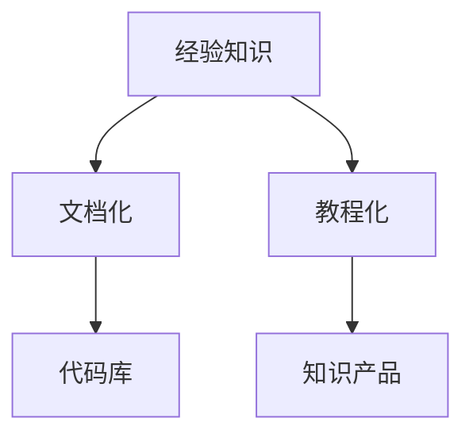

                 

# 程序员如何将工作经验转化为知识产品

## 1. 背景介绍

### 1.1 问题由来

在当今快速发展的技术环境中，程序员不仅需要具备扎实的编程技能，还需要不断学习新的技术、框架和工具。随着经验的积累，许多程序员希望能够将他们的工作经验转化为更有价值的知识产品，以帮助同行提升技能，驱动行业进步。但如何有效地将工作经验转化为知识产品，仍然是一个挑战。

### 1.2 问题核心关键点

将工作经验转化为知识产品的关键在于如何将实际工作中的技术、策略和教训系统化、结构化地呈现出来。这需要程序员不仅要有扎实的基础知识，还需要具备良好的写作和教学能力。关键点包括：

- 梳理工作经验和知识点的能力
- 系统化、结构化的表达能力
- 深入浅出的写作技巧
- 互动性和参与度

## 2. 核心概念与联系

### 2.1 核心概念概述

为了更好地理解如何将工作经验转化为知识产品，本节将介绍几个密切相关的核心概念：

- **经验知识**：在实际工作过程中，程序员积累的专业知识和实践经验，包括技术难点、解决方案、团队协作等。
- **知识产品**：结构化、系统化的文档、教程、代码库等，旨在帮助他人理解和使用技术。
- **文档化**：将个人经验和知识通过文字、代码和图片等方式记录和组织起来的过程。
- **教程化**：将文档化的知识转化为易于理解的教学内容，帮助读者掌握技术和方法。
- **代码库**：通过开源代码库，分享编程技巧和最佳实践，促进技术交流和创新。

这些核心概念之间的逻辑关系可以通过以下Mermaid流程图来展示：



这个流程图展示了几者之间的关系：

1. 经验知识是基础，通过文档化和教程化转化为易于理解的知识产品。
2. 代码库作为实践的展现形式，进一步丰富知识产品内容。

## 3. 核心算法原理 & 具体操作步骤
### 3.1 算法原理概述

将工作经验转化为知识产品的过程，本质上是将非结构化的经验知识进行结构化处理，然后以易于理解的形式呈现给读者的过程。其核心算法原理如下：

1. **梳理**：对个人经验和知识进行分类、筛选和提炼。
2. **结构化**：将提炼出的知识点进行组织和呈现，形成文档或教程。
3. **表达**：以简洁、易懂的方式将知识表达出来，便于读者理解和应用。

### 3.2 算法步骤详解

基于上述原理，下面详细介绍如何将个人经验转化为知识产品的详细步骤：

**Step 1: 梳理经验**
- **识别关键知识点**：回顾自己的工作经历，识别出最具价值、最具共性、最具普遍性的知识点。
- **分类整理**：根据知识点的性质和应用场景，将其分类整理，如技术栈、开发流程、团队管理等。

**Step 2: 结构化表达**
- **构建文档框架**：为每个知识点构建文档框架，包括标题、子标题、列表等。
- **使用清晰的结构**：使用清晰、层次分明的结构，如目录、索引、章节标题等，使文档易于导航。
- **使用图表和示例**：适当使用流程图、架构图、代码示例等，帮助读者更直观地理解知识点。

**Step 3: 教程化**
- **撰写教程内容**：以故事化的方式，撰写教程内容，通过真实的案例和情景，使读者更容易理解。
- **互动性设计**：增加互动元素，如问题、练习、代码挑战等，增加读者的参与度。
- **反馈机制**：设置反馈机制，鼓励读者提出问题和反馈，不断优化教程内容。

**Step 4: 代码库**
- **精选代码片段**：选择具有代表性的代码片段，进行注释和解释。
- **代码库管理**：使用版本控制系统，如Git，管理代码库的更新和分享。
- **代码贡献**：鼓励社区贡献代码，扩大代码库的影响力。

### 3.3 算法优缺点

**优点**：
- **系统化知识**：通过系统化的梳理和结构化表达，使经验知识更加易于理解和应用。
- **分享和复用**：知识产品可以通过网络广泛分享和复用，帮助更多人提升技能。
- **持续更新**：知识产品可以通过迭代更新，保持内容的先进性和实用性。

**缺点**：
- **时间和精力投入**：梳理和结构化经验知识需要大量的时间和精力。
- **写作难度**：将复杂的技术和实践经验转化为易于理解的内容，需要较高的写作技巧。
- **互动性有限**：相比在线课程和直播，知识产品的互动性可能不足，需要更多自学能力。

### 3.4 算法应用领域

知识产品不仅适用于软件开发领域，还广泛应用于其他技术领域，如数据科学、人工智能、网络安全等。以下是一些具体的应用场景：

- **软件开发**：开源代码库、技术博客、技术教程等。
- **数据科学**：数据分析方法、数据可视化教程、机器学习实战等。
- **人工智能**：深度学习框架的使用指南、模型调优技巧、应用案例等。
- **网络安全**：渗透测试手册、安全漏洞分析、防护策略等。

## 4. 数学模型和公式 & 详细讲解 & 举例说明

### 4.1 数学模型构建

在将个人经验转化为知识产品的过程中，虽然涉及的主要是软技能和实践经验，但我们可以借鉴数学模型的思想来构建系统化的知识框架。例如，可以引入“知识图谱”的概念，将个人经验和知识点建模为节点和边，构建知识网络，以便于理解和应用。

### 4.2 公式推导过程

虽然技术类知识产品的构建不直接涉及数学公式，但我们可以类比知识图谱的构建过程，进行类似的推导。例如，我们可以推导出如何通过连接“知识点”和“场景”来构建知识网络，以提高知识的可获取性和可应用性。

### 4.3 案例分析与讲解

以一个具体的技术栈为例，我们可以构建以下知识图谱：

```
知识节点:
  - 语言：Python, Java
  - 框架：Django, Spring
  - 数据库：MySQL, MongoDB
  - 测试：JUnit, Selenium

场景节点:
  - 后端开发
  - 前端开发
  - 数据库设计
  - 自动化测试

连接边:
  - Python -> 后端开发
  - Django -> 后端开发
  - MySQL -> 后端开发
  - JUnit -> 自动化测试
  - Selenium -> 自动化测试
```

通过这样的知识图谱，读者可以更清晰地理解不同技术之间的连接和应用场景，从而更有效地应用这些知识。

## 5. 项目实践：代码实例和详细解释说明
### 5.1 开发环境搭建

在进行知识产品开发前，需要准备合适的开发环境。以下是一些常用工具的推荐：

1. **文本编辑器**：如Visual Studio Code, Atom等，用于编写和编辑文档。
2. **版本控制系统**：如Git, GitLab等，用于管理代码库的更新和协作。
3. **Markdown编辑器**：如Typora, MarkdownPad等，用于编写Markdown格式的文档。
4. **IDE**：如Visual Studio Code, PyCharm等，用于编写代码和运行代码示例。

### 5.2 源代码详细实现

以下是一个简单的代码库示例，展示如何将一个Python函数进行文档化和代码库分享：

**源代码**：

```python
def greet(name):
    """打印欢迎信息"""
    print(f"Hello, {name}! Welcome to the world of programming.")

# 文档化
greet.__doc__ = """
    greet(name)
    
    Prints a welcome message to the user.
    
    Parameters:
        name (str): The name of the user to greet.
    
    Returns:
        None
"""
```

**文档**：

```markdown
# 欢迎函数示例

## 简介

本示例展示如何对一个简单的Python函数进行文档化和代码库分享。

## 代码实现

```python
def greet(name):
    """打印欢迎信息"""
    print(f"Hello, {name}! Welcome to the world of programming.")
```

## 文档化

```python
greet.__doc__ = """
    greet(name)
    
    Prints a welcome message to the user.
    
    Parameters:
        name (str): The name of the user to greet.
    
    Returns:
        None
"""
```

## 代码库分享

```
greet.py
    - 定义了一个greet函数，用于打印欢迎信息。
    - 函数文档化，提供了清晰的函数用途和参数说明。
```

通过这种方式，读者可以方便地理解函数的使用方法，甚至可以在代码库中找到实际的代码示例，进一步学习。

### 5.3 代码解读与分析

在文档化的过程中，重要的是提供清晰的函数描述和使用示例，帮助读者快速理解函数的功能和使用方法。同时，通过代码库分享，读者可以更直观地看到函数的实际应用场景和代码结构，进一步加深理解。

### 5.4 运行结果展示

运行上述代码，将会在控制台输出欢迎信息。例如：

```
Hello, Alice! Welcome to the world of programming.
```

## 6. 实际应用场景

### 6.1 企业内训材料

企业可以采用知识产品来作为内部培训材料，提升员工的技术水平和职业素养。例如，开发一套面向新员工的“技术入门指南”，涵盖公司常用的技术栈和最佳实践，帮助新员工快速适应工作环境。

### 6.2 开源社区贡献

许多程序员通过贡献代码和文档，成为开源社区的重要贡献者。例如，在GitHub上创建自己的代码库，分享最新的技术实现和创新，推动社区技术的发展。

### 6.3 在线教学

许多技术类知识产品可以作为在线教学的辅助材料，帮助学生更好地理解复杂的技术和概念。例如，通过制作“机器学习实战教程”，配合在线视频和练习，帮助学生系统掌握机器学习的理论和方法。

### 6.4 未来应用展望

随着技术的发展，知识产品的应用场景将更加多样和广泛。例如，未来可能出现“AI辅助写作工具”，帮助程序员更高效地构建知识产品。同时，知识产品的形式也将更加多样，如图像、视频、交互式教程等，提供更丰富的学习体验。

## 7. 工具和资源推荐
### 7.1 学习资源推荐

为了帮助开发者系统掌握知识产品的构建技术，这里推荐一些优质的学习资源：

1. **在线课程**：如Coursera, Udemy等，提供系统化的课程学习，涵盖知识产品的构建、文档化和教程化等方面。
2. **博客和社区**：如Medium, Stack Overflow等，分享成功的知识产品案例和构建经验。
3. **开源文档项目**：如GitHub上的Open Source Guides, Rust Guide等，学习如何构建高质量的代码库和文档。
4. **教程和工具**：如GitBook, Jekyll等，提供易于使用的工具和模板，帮助快速构建知识产品。

通过对这些资源的学习实践，相信你一定能够快速掌握知识产品的构建技巧，并将个人经验转化为有价值的知识产品。

### 7.2 开发工具推荐

高效的开发离不开优秀的工具支持。以下是几款用于知识产品开发的常用工具：

1. **Git和GitHub**：版本控制和协作工具，确保代码和文档的及时更新和分享。
2. **Markdown编辑器**：如Typora, MarkdownPad等，用于编写Markdown格式的文档。
3. **IDE和IDEA**：如Visual Studio Code, PyCharm等，用于编写代码和运行代码示例。
4. **云服务**：如AWS, Google Cloud等，提供云存储和协作平台，支持知识产品的在线分享和更新。

合理利用这些工具，可以显著提升知识产品的开发效率，加快创新迭代的步伐。

### 7.3 相关论文推荐

知识产品的发展源于学界的持续研究。以下是几篇奠基性的相关论文，推荐阅读：

1. **知识图谱构建**：D. Milne, A. Jawanpurkar. "Ontology-based knowledge discovery in distributed information systems." 
2. **文档化技术**：M. F. Abrams. "Documentation as a knowledge process." 
3. **教程化方法**：R. H. Clokie. "Making things happen: Teaching mathematics through 'doing' and 'examining'." 

这些论文代表了大语言模型微调技术的发展脉络。通过学习这些前沿成果，可以帮助研究者把握学科前进方向，激发更多的创新灵感。

## 8. 总结：未来发展趋势与挑战

### 8.1 总结

本文对如何将个人经验转化为知识产品进行了全面系统的介绍。首先阐述了知识产品的重要性和构建过程，明确了文档化、教程化、代码库等关键步骤，以及如何将个人经验转化为易于理解的知识产品。其次，从原理到实践，详细讲解了知识产品的构建技术，给出了详细的代码实现和解释。同时，本文还广泛探讨了知识产品在企业内训、开源社区、在线教学等多个行业领域的应用前景，展示了知识产品的巨大潜力。此外，本文精选了知识产品的各类学习资源，力求为读者提供全方位的技术指引。

通过本文的系统梳理，可以看到，将个人经验转化为知识产品不仅能够提升自身的技术水平，还能为社区、企业和社会带来更广泛的价值。相信随着技术的发展和实践的深入，知识产品的构建方法将更加成熟，更多优秀的知识产品将涌现出来，推动技术和行业的进步。

### 8.2 未来发展趋势

展望未来，知识产品的发展将呈现以下几个趋势：

1. **多模态知识产品**：除了文本和代码，未来的知识产品将更多地融入图像、视频等多媒体内容，提供更丰富的学习体验。
2. **个性化推荐**：通过推荐系统，推荐适合用户兴趣和需求的知识产品，提升学习效率和效果。
3. **交互式教程**：使用JavaScript和Web技术，开发交互式教程，增强学习互动性和趣味性。
4. **社区协作**：知识产品的构建将更多地依赖社区协作，开放和共享成为重要特征。
5. **智能化辅助**：使用AI技术，如自然语言处理和机器学习，帮助开发者构建更高效的知识产品。

这些趋势将推动知识产品向更丰富、更智能化、更易用化的方向发展，为技术学习带来新的变革。

### 8.3 面临的挑战

尽管知识产品的发展前景广阔，但在构建和应用过程中，仍面临诸多挑战：

1. **时间和精力投入**：知识产品的构建需要大量的时间和精力，如何平衡工作和学习，是一个重要的问题。
2. **写作和表达能力**：将复杂的技术和实践经验转化为易于理解的内容，需要较高的写作和表达技巧。
3. **互动性和参与度**：相比在线课程和直播，知识产品的互动性可能不足，需要更多自学能力。
4. **版权和授权问题**：如何在分享知识的同时，保护版权和自身权益，是一个需要认真考虑的问题。
5. **技术和工具的更新**：知识产品的技术和工具不断更新，如何保持产品的先进性和实用性，需要持续学习和跟进。

这些挑战需要我们不断探索和克服，才能将知识产品推向更高的水平。

### 8.4 研究展望

面对知识产品构建过程中面临的挑战，未来的研究需要在以下几个方面寻求新的突破：

1. **自动化文档生成**：开发自动化文档生成工具，减少手动编写文档的时间和精力。
2. **交互式学习环境**：构建交互式学习环境，提升知识产品的互动性和学习效果。
3. **多语言支持**：提供多语言支持的知识产品，帮助全球用户更好地理解和应用技术。
4. **社区驱动的贡献平台**：建立社区驱动的知识产品贡献平台，鼓励更多人参与知识产品的构建和分享。
5. **知识图谱和推荐系统**：使用知识图谱和推荐系统，提高知识产品的搜索和推荐效果，提供个性化的学习体验。

这些研究方向将为知识产品的构建提供新的思路和方法，推动知识产品向更高的水平发展。

## 9. 附录：常见问题与解答

**Q1: 如何选择合适的知识产品形式？**

A: 选择合适的知识产品形式需要考虑目标受众和传播渠道。例如，技术博客适合技术分享和教程化，开源代码库适合代码示例和协作，视频教程适合视觉化和互动性。

**Q2: 如何提高知识产品的可获取性？**

A: 提高知识产品的可获取性需要良好的组织结构和清晰的内容分类。例如，使用目录、标签、搜索功能等，方便用户快速找到需要的知识。

**Q3: 如何保持知识产品的最新性？**

A: 定期更新和维护知识产品，及时添加最新的技术和实践经验。例如，定期发布更新日志和变更说明，帮助用户了解知识产品的变化。

**Q4: 如何提高知识产品的互动性？**

A: 增加互动元素，如问题、练习、代码挑战等，鼓励用户参与讨论和反馈。例如，在代码库上增加评论和讨论，在博客文章中设置评论和互动插件。

**Q5: 如何处理版权和授权问题？**

A: 使用合适的版权声明和授权协议，明确知识产品的使用范围和限制。例如，使用CC BY-SA协议，允许非商业用途的自由共享。

**Q6: 如何提高知识产品的可理解性？**

A: 使用清晰的语言和结构，避免复杂的术语和概念。例如，使用图表和示例，帮助读者更直观地理解技术。

通过解决这些常见问题，可以进一步提升知识产品的质量和影响力，让更多人受益于技术分享和知识传播。

---

作者：禅与计算机程序设计艺术 / Zen and the Art of Computer Programming

