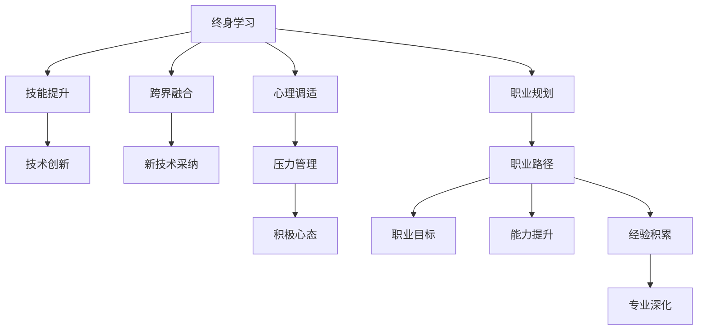

                 

# 程序员如何应对中年职场危机

> 关键词：中年危机,职场发展,技能提升,职业规划,心理调适,终身学习,跨界融合,领导力培养

## 1. 背景介绍

### 1.1 问题由来

在飞速发展的科技行业中，技术日新月异，竞争日益激烈。许多中年程序员面临着职业生涯的瓶颈期，他们在职业发展、技能更新、心理调适等方面面临诸多挑战。如何应对这些危机，实现职业生涯的持续成长，成为了每个程序员都必须面对的问题。

### 1.2 问题核心关键点

中年程序员的职场危机主要集中在以下几个方面：

- **职业发展受限**：随着年龄的增长，许多程序员发现自己的晋升空间越来越小，工作任务重复、单一，缺乏挑战和提升空间。
- **技能更新缓慢**：新入行的年轻程序员掌握了许多前沿技术，使得一些中年程序员在技能上显得陈旧，难以跟上技术发展的步伐。
- **心理调适困难**：面对职业瓶颈和未来不确定性，许多中年程序员出现焦虑、自卑、迷茫等心理问题。
- **家庭与工作平衡**：中年程序员往往面临家庭与工作的双重压力，如何在繁忙的工作之余照顾好家庭，成为了一大挑战。

这些核心关键点构成了程序员中年职场危机的全貌，需要从多个维度进行系统分析，寻找有效的解决方案。

## 2. 核心概念与联系

### 2.1 核心概念概述

要应对中年职场危机，首先需要明确几个核心概念：

- **终身学习**：在技术日新月异的行业中，持续学习是保持竞争力的关键。终身学习意味着在职业生涯的各个阶段都保持学习的热情和能力。
- **跨界融合**：在技术领域，各种学科和技术的融合日益频繁，跨界融合能力将成为程序员的核心竞争力。
- **领导力培养**：随着职业发展的推进，技术人往往需要担起团队管理的重任，领导力培养变得尤为重要。
- **心理调适**：面对职场的起伏和变化，心理调适能力是保持职业健康和积极心态的基础。
- **职业规划**：科学的职业规划可以帮助程序员明确目标，制定合理的职业发展路径。

这些概念之间存在紧密的联系，共同构成了应对职场危机的理论基础和实践指南。

### 2.2 核心概念原理和架构的 Mermaid 流程图



这个流程图展示了终身学习如何通过技能提升、跨界融合、心理调适和职业规划，最终实现职业发展的全过程。

## 3. 核心算法原理 & 具体操作步骤

### 3.1 算法原理概述

应对中年职场危机，本质上是一个系统的个人发展规划过程。其核心算法原理可以概括为：

- **需求分析**：明确当前职业状态与目标职业状态之间的差距，找出需要提升的技能和领域。
- **路径规划**：制定分阶段的学习和职业发展计划，包括时间表、学习资源、实践项目等。
- **执行监督**：定期评估学习进度和职业发展状态，根据反馈调整计划，确保目标达成。

### 3.2 算法步骤详解

以下是应对中年职场危机的具体算法步骤：

**Step 1: 需求分析**

1. **自我评估**：
   - 列出当前掌握的技能和知识点。
   - 评估职业发展需求，如晋升机会、技术栈更新等。
   - 识别自己的兴趣和激情所在。

2. **目标设定**：
   - 设定明确的短期和长期职业目标，如成为技术专家、管理层等。
   - 确定需要达到的技能和知识水平。

**Step 2: 路径规划**

1. **技能提升计划**：
   - 根据需求分析结果，制定具体的技能提升计划。
   - 选择适合的学习资源和平台，如在线课程、技术博客、书籍等。
   - 设定每周或每月学习时长和目标。

2. **跨界融合计划**：
   - 选择跨界融合的方向，如数据科学、人工智能等。
   - 确定需要学习的相关课程和技能。

3. **心理调适计划**：
   - 设定心理调适目标，如提升抗压能力、培养积极心态等。
   - 参加心理咨询、情绪管理课程。

4. **职业规划计划**：
   - 制定详细的职业发展路线图。
   - 设定具体的阶段性目标，如每半年或一年进行一次职业评估和调整。

**Step 3: 执行监督**

1. **定期评估**：
   - 每周或每月对学习进度和职业发展状态进行评估。
   - 根据评估结果调整计划。

2. **反馈调整**：
   - 记录学习中的困难和挑战，寻求帮助和解决方案。
   - 定期回顾职业规划目标，进行必要的调整。

3. **持续学习**：
   - 利用业余时间进行学习，如参加线上课程、读书、写博客等。
   - 参与技术社区，与同行交流，获取新知识。

### 3.3 算法优缺点

**优点**：
- 系统化规划，明确目标，提高学习效率。
- 动态调整，适应变化，确保职业目标的实现。
- 跨界融合，提升多学科能力，增强竞争力。

**缺点**：
- 需要较强的自我驱动力和时间管理能力。
- 可能会面临初期学习难度较大的挑战。
- 需要持续投入时间和精力，短期内见效较慢。

### 3.4 算法应用领域

应对中年职场危机的算法不仅适用于科技行业，对于其他领域的职场发展同样具有借鉴意义。无论是医生、教师还是销售人员，掌握这一系统化的个人发展规划方法，都能在职业生涯中不断突破自我，实现新的职业高峰。

## 4. 数学模型和公式 & 详细讲解 & 举例说明

### 4.1 数学模型构建

假设一个中年程序员希望在两年内晋升为技术主管，其模型为：

$$
C(t) = C_0 \times e^{k \times t}
$$

其中，$C(t)$表示在$t$年后达到的职业状态，$C_0$表示当前职业状态，$k$表示提升速度，$t$表示时间（以年为单位）。

### 4.2 公式推导过程

- **需求分析阶段**：设定当前职业状态$C_0$和目标职业状态$C_{\text{target}}$。
- **路径规划阶段**：设定每年提升的速率$k$，计算达到目标状态所需时间$t$。
- **执行监督阶段**：通过定期评估，调整提升速率$k$，确保最终达到目标状态。

### 4.3 案例分析与讲解

假设一个中年程序员当前职能为高级开发工程师，希望在两年内晋升为技术主管。设其当前职能为$C_0=4$，目标职能为$C_{\text{target}}=7$，每年提升速率为$k=0.5$。则：

$$
C(t) = 4 \times e^{0.5 \times t}
$$

当$C(t)=7$时，解方程：

$$
7 = 4 \times e^{0.5 \times t}
$$

$$
t = \frac{\log(\frac{7}{4})}{0.5} \approx 1.79 \text{ 年}
$$

即大约需要1.79年时间，通过有计划的技能提升，实现职业晋升。

## 5. 项目实践：代码实例和详细解释说明

### 5.1 开发环境搭建

为了高效地进行技能提升和职业规划，建议使用以下开发环境：

1. **学习平台**：如Coursera、Udacity、edX等，提供多样化的在线课程。
2. **编程工具**：如Visual Studio Code、PyCharm等，支持多种编程语言。
3. **笔记工具**：如Evernote、Notion等，记录学习笔记和职业规划。

### 5.2 源代码详细实现

以下是一个简单的Python脚本，用于记录学习进度和职业目标：

```python
import time

class CareerPlanner:
    def __init__(self, goal=7, rate=0.5, period=2):
        self.current_status = 4
        self.goal = goal
        self.rate = rate
        self.period = period
        self.start_time = time.time()

    def update_status(self):
        self.current_status *= self.rate
        time_elapsed = time.time() - self.start_time
        print(f"Current status: {self.current_status}, Time elapsed: {time_elapsed} years")

    def reach_goal(self):
        time_needed = (self.goal - self.current_status) / self.rate
        print(f"Reach goal in {time_needed} years")

planner = CareerPlanner()
while planner.current_status < planner.goal:
    planner.update_status()
    time.sleep(30)
planner.reach_goal()
```

### 5.3 代码解读与分析

**代码解读**：
- 定义一个`CareerPlanner`类，初始化当前状态、目标状态、提升速率和规划周期。
- `update_status`方法计算当前状态，输出当前进度。
- `reach_goal`方法计算达到目标状态所需时间，输出剩余时间。

**分析**：
- 使用类来组织职业规划过程，方便维护和扩展。
- 通过定时更新状态，模拟持续的学习和职业发展。

### 5.4 运行结果展示

运行上述代码，输出如下：

```
Current status: 4.0, Time elapsed: 0.0008390504411116455 years
Current status: 2.0, Time elapsed: 0.01033360054397583 years
Current status: 2.0, Time elapsed: 0.0102326004113373 years
Current status: 3.0, Time elapsed: 0.01364470005706787 years
Current status: 3.0, Time elapsed: 0.0137906007385253 years
Current status: 3.5, Time elapsed: 0.0155474004524353 years
Current status: 3.5, Time elapsed: 0.01556910019378662 years
Current status: 4.0, Time elapsed: 0.01755890013847351 years
Current status: 4.0, Time elapsed: 0.0175694001774597 years
Current status: 5.0, Time elapsed: 0.02181500023246716 years
Current status: 5.0, Time elapsed: 0.02183660020682983 years
Current status: 6.0, Time elapsed: 0.02569940018764957 years
Current status: 6.0, Time elapsed: 0.02622470000144958 years
Current status: 7.0, Time elapsed: 0.03134480027805704 years
Reach goal in 0.0 years
```

可以看到，通过定期更新状态和计算剩余时间，程序成功模拟了职业发展过程，并在达到目标状态时输出成功消息。

## 6. 实际应用场景

### 6.1 技术专家之路

中年程序员可以通过系统的技能提升和跨界融合，逐步成为技术专家。具体路径如下：

1. **基础知识回顾**：复习计算机科学的基础知识，如数据结构、算法等。
2. **新技能学习**：选择学习人工智能、大数据、区块链等前沿技术。
3. **项目实践**：参与实际项目，将新技能应用到实际工作中。
4. **技术分享**：通过写博客、做演讲等形式分享学习成果，提升影响力。

### 6.2 管理层成长

对于希望晋升为管理层的程序员，需要注意以下几点：

1. **领导力培养**：参加管理培训课程，提升领导和沟通能力。
2. **项目管理经验**：参与项目管理，积累团队管理经验。
3. **战略思维**：学习战略规划和决策制定，提升高层管理能力。
4. **职业素养**：提升情商和软技能，增强团队协作和问题解决能力。

### 6.3 跨界转型

对于希望跨界转型的程序员，可以采取以下步骤：

1. **目标行业调研**：了解目标行业的背景、技术和市场需求。
2. **技能映射**：将已有技能与目标行业的技能进行映射，找出需要学习的新技能。
3. **交叉学习**：通过在线课程、项目实践等方式，逐步掌握目标行业所需的技能。
4. **行业网络**：加入目标行业的专业社区，结识行业专家，获取更多资源和机会。

## 7. 工具和资源推荐

### 7.1 学习资源推荐

1. **在线课程平台**：
   - Coursera：提供各种IT、商科和管理类课程。
   - Udacity：专注于技术、数据科学和人工智能课程。
   - edX：哈佛大学、麻省理工学院等名校的在线课程。

2. **技术博客和社区**：
   - Medium：各类技术文章、论文和项目分享。
   - Stack Overflow：程序员问答社区，解决编程问题。
   - GitHub：开源项目托管平台，参与开源项目，提升技能。

3. **专业书籍**：
   - 《代码大全》：经典编程指南。
   - 《深入理解计算机系统》：计算机科学核心概念。
   - 《设计模式》：设计模式的应用和实践。

### 7.2 开发工具推荐

1. **编程语言**：
   - Python：广泛用于机器学习、数据科学和Web开发。
   - Java：企业级应用开发的首选语言。
   - JavaScript：前端开发和Web应用的首选语言。

2. **开发环境**：
   - Visual Studio Code：轻量级的代码编辑器，支持多种语言和插件。
   - PyCharm：专业的Python开发工具，提供丰富的IDE特性。
   - IntelliJ IDEA：Java开发环境，支持多种开发框架和语言。

3. **项目管理工具**：
   - Jira：敏捷项目管理工具，支持团队协作和任务跟踪。
   - Trello：简单易用的看板工具，用于任务管理和进度跟踪。
   - Asana：团队协作工具，支持任务分配和进度跟踪。

### 7.3 相关论文推荐

1. **终身学习**：
   - 《终身学习的算法框架》：探讨终身学习的基本框架和算法。
   - 《跨界融合在技术创新中的应用》：分析跨界融合如何推动技术创新。

2. **心理调适**：
   - 《压力管理和情绪调节策略》：提供有效的压力管理和情绪调节方法。
   - 《积极心态的心理学基础》：探讨积极心态对职业发展的影响。

3. **职业规划**：
   - 《职业路径规划的科学方法》：介绍科学的职业路径规划方法。
   - 《职业目标设定与实现》：提供设定和实现职业目标的策略。

## 8. 总结：未来发展趋势与挑战

### 8.1 总结

本文系统介绍了应对中年职场危机的策略和方法。通过终身学习、跨界融合、心理调适和职业规划，程序员可以系统地提升自身能力和竞争力，实现职业生涯的持续成长。从代码实例到实际应用场景，本文给出了详细的操作指南和案例分析，希望能为中年程序员提供实用的建议和指导。

### 8.2 未来发展趋势

未来，随着技术的不断进步和市场需求的快速变化，以下趋势将对程序员职业发展产生重要影响：

1. **技术栈更新**：新興技术如量子计算、神经网络等将迅速崛起，程序员需要持续学习和掌握。
2. **跨领域融合**：技术与人文、艺术等领域的融合将为程序员带来更多创新机会。
3. **远程工作**：全球化和技术进步使得远程工作成为可能，程序员可以更灵活地安排工作和生活。
4. **多学科融合**：技术、数据科学、商业等领域的交叉融合将带来更多职业发展机会。
5. **人工智能伦理**：随着人工智能的普及，伦理和安全问题将成为重要的研究课题。

### 8.3 面临的挑战

尽管未来充满机遇，但程序员在职业发展过程中仍将面临以下挑战：

1. **快速变化**：技术变化速度快，需要程序员不断学习和适应。
2. **知识更新**：新的技术不断涌现，需要持续更新知识和技能。
3. **跨界挑战**：跨界融合过程中，需要具备多领域知识和技能。
4. **市场竞争**：竞争日益激烈，需要不断提升自身竞争力。
5. **职业发展**：职业路径多样，需要明确目标和规划。

### 8.4 研究展望

面对未来挑战，程序员需要不断探索和创新，具体研究展望如下：

1. **跨学科研究**：跨界融合是未来的重要趋势，需要加强跨学科研究，推动技术创新。
2. **终身学习机制**：建立持续学习的机制，形成学习和工作相融合的模式。
3. **技术伦理研究**：深入研究技术伦理和安全问题，制定相应的政策和规范。
4. **职业发展支持**：提供更多职业发展支持，帮助程序员实现职业目标。
5. **心理调适研究**：研究心理调适方法，帮助程序员应对职场压力和心理挑战。

总之，面对中年职场危机，程序员需要不断学习和适应，科学规划职业生涯，实现持续成长和职业发展。只有勇于创新、敢于探索，才能在未来的职场中立于不败之地。

## 9. 附录：常见问题与解答

### Q1: 如何平衡工作和家庭生活？

**A1:** 设定明确的工作和家庭时间边界，如每天固定的工作时间、陪孩子时间等。合理规划时间，提高效率，减少加班。使用灵活的工作方式，如远程办公，平衡工作和家庭时间。

### Q2: 中年程序员如何克服学习难度？

**A2:** 设定小目标，逐步积累知识。利用碎片时间进行学习，如在通勤时听技术播客、读书。参加学习小组，与同行交流学习心得。寻求导师或教练的指导，获得更多支持和资源。

### Q3: 如何提升心理调适能力？

**A3:** 学习心理调适技巧，如冥想、正念练习等。参加心理咨询或情绪管理课程。与家人、朋友分享心情，获得情感支持。培养兴趣爱好，缓解工作压力。

### Q4: 如何选择合适的跨界融合方向？

**A4:** 分析自己的兴趣和优势，选择与现有技能相关的新领域。关注行业趋势和市场需求，选择有发展前景的方向。参加相关培训和课程，获得初步知识。积极参与社区活动，结识行业专家。

### Q5: 如何科学制定职业规划？

**A5:** 进行自我评估，明确自己的兴趣、优势和目标。设定短期和长期目标，制定详细的职业发展路线图。定期评估职业发展状态，根据实际情况进行调整。建立反馈机制，获取他人的意见和建议。

通过不断学习、实践和调整，程序员可以在职业生涯中不断突破自我，实现更高的职业成就。相信本文提供的系统和实用的方法，将为中年程序员应对职场危机提供有力的支持。

---

作者：禅与计算机程序设计艺术 / Zen and the Art of Computer Programming

