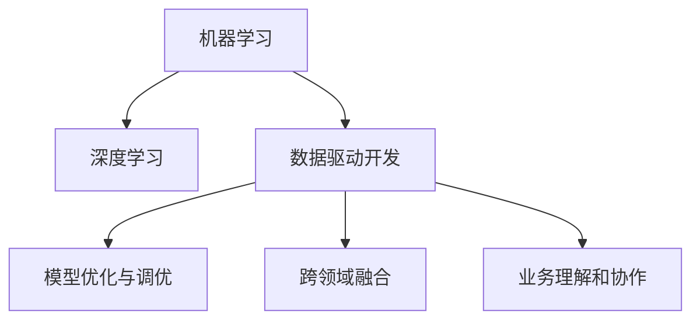

                 

# 程序员如何应对人工智能带来的挑战

## 1. 背景介绍

### 1.1 问题由来

随着人工智能（AI）技术的迅猛发展，其在各行各业的应用不断深化，为程序员带来了前所未有的机遇和挑战。越来越多的工作正在被自动化取代，传统的编程工作模式也正逐步向基于AI和数据驱动的开发方式转变。

从技术层面来看，AI的普及和应用对程序员的技能需求产生了深刻的影响。机器学习和深度学习等技术的广泛应用，使得对大数据处理、模型优化、算法调优等方面的能力要求日益增加。从业务层面来看，AI驱动的商业决策、客户服务、产品推荐等功能的实现，要求程序员不仅要具备编程技能，还需具备业务理解和数据分析能力。

### 1.2 问题核心关键点

AI对程序员带来的挑战主要集中在以下几个方面：

- **技能提升**：AI技术的发展使得程序员需要掌握新的技术和工具，如机器学习库、深度学习框架、数据处理工具等。
- **跨领域融合**：AI的应用已经渗透到诸如自然语言处理、图像识别、推荐系统等多个领域，程序员需要具备跨领域的综合知识。
- **数据驱动开发**：传统软件开发中的测试、调试等环节已经逐渐向基于数据的模式转变，程序员需要能够高效地处理和利用数据。
- **模型优化与调优**：AI模型的训练和调优过程需要程序员具备一定的数学和统计学背景。
- **业务理解和协作**：AI的应用需要与业务部门紧密配合，程序员需要具备良好的业务理解和沟通能力。

## 2. 核心概念与联系

### 2.1 核心概念概述

为更好地理解AI带来的挑战和应对方法，本节将介绍几个密切相关的核心概念：

- **机器学习**：通过算法和模型，从数据中学习规律，并应用这些规律进行预测或决策。
- **深度学习**：一种特殊的机器学习方法，通过构建神经网络模型，处理复杂的数据关系和模式。
- **数据驱动开发（Data-Driven Development, DDD）**：以数据为核心，通过数据分析和机器学习模型指导软件开发和优化。
- **模型优化与调优**：通过调整模型结构和参数，提升模型的精度和泛化能力。
- **跨领域融合**：AI技术在不同领域的应用，需要程序员具备多领域的知识背景。
- **业务理解和协作**：程序员需要与业务部门紧密合作，理解业务需求，并将其转化为技术解决方案。

这些核心概念之间的逻辑关系可以通过以下Mermaid流程图来展示：



这个流程图展示出AI技术的多维度应用场景和程序员所需具备的综合能力：

1. 机器学习和深度学习是AI技术的基础，为数据驱动开发和模型优化提供了技术支持。
2. 数据驱动开发和模型优化是AI应用的实践手段，需要在跨领域融合和业务理解的基础上进行。
3. 跨领域融合和业务理解确保AI技术在实际应用中能够真正解决业务问题。

## 3. 核心算法原理 & 具体操作步骤

### 3.1 算法原理概述

在AI应用中，机器学习和深度学习是常用的技术手段。程序员需要掌握这些算法的原理和应用方式，以应对各种AI挑战。

### 3.2 算法步骤详解

#### 3.2.1 数据预处理

- **数据收集**：收集与业务需求相关的数据，如用户行为数据、交易记录、图像数据等。
- **数据清洗**：去除异常值和噪声，确保数据质量。
- **特征工程**：对数据进行特征提取和处理，生成可用于模型训练的特征集。

#### 3.2.2 模型选择和构建

- **模型选择**：根据任务需求选择合适的模型，如线性回归、逻辑回归、支持向量机、神经网络等。
- **模型构建**：使用机器学习和深度学习框架构建模型，并进行训练和调参。

#### 3.2.3 模型评估和优化

- **模型评估**：使用测试数据集评估模型性能，如准确率、召回率、F1分数等。
- **模型优化**：根据评估结果进行模型优化，包括调整模型结构、更新参数等。

#### 3.2.4 模型部署和监控

- **模型部署**：将优化后的模型部署到生产环境，并集成到应用系统中。
- **模型监控**：实时监控模型性能，及时发现和处理异常情况。

### 3.3 算法优缺点

机器学习和深度学习在解决复杂问题时具有强大的能力，但也存在以下缺点：

- **高数据需求**：需要大量高质量的数据进行训练，数据不足会影响模型效果。
- **模型复杂性**：模型结构复杂，训练和调参过程繁琐。
- **可解释性差**：深度学习模型通常是"黑盒"模型，难以解释其内部工作机制。
- **计算资源消耗高**：需要大量的计算资源进行模型训练和推理。

### 3.4 算法应用领域

AI技术已经在多个领域得到了广泛应用，以下是几个典型的应用场景：

- **自然语言处理**：如文本分类、情感分析、机器翻译、问答系统等。
- **计算机视觉**：如图像识别、物体检测、图像生成等。
- **推荐系统**：如商品推荐、内容推荐、广告推荐等。
- **智能客服**：如自动化客服、智能问答、情感分析等。
- **金融风控**：如信用评分、欺诈检测、投资分析等。
- **医疗健康**：如疾病诊断、治疗方案推荐、健康监测等。

## 4. 数学模型和公式 & 详细讲解 & 举例说明

### 4.1 数学模型构建

在AI应用中，数学模型是重要的基础工具。以下是一些常用的数学模型及其应用场景：

- **线性回归模型**：用于处理线性关系，如预测房价、销售额等。
- **逻辑回归模型**：用于分类问题，如预测用户是否购买产品。
- **支持向量机（SVM）**：用于分类和回归问题，如图像分类、文本分类等。
- **神经网络模型**：用于处理复杂的数据关系，如图像识别、语音识别、自然语言处理等。

### 4.2 公式推导过程

#### 4.2.1 线性回归模型

线性回归模型用于预测连续值，其基本公式为：

$$
y = \theta_0 + \theta_1x_1 + \theta_2x_2 + ... + \theta_nx_n
$$

其中，$\theta_0, \theta_1, \theta_2, ..., \theta_n$ 为模型参数，$x_1, x_2, ..., x_n$ 为特征，$y$ 为目标变量。

#### 4.2.2 逻辑回归模型

逻辑回归模型用于预测二分类问题，其基本公式为：

$$
P(y=1|x) = \frac{1}{1 + e^{-\theta^Tx}}
$$

其中，$\theta$ 为模型参数，$x$ 为特征向量，$y$ 为目标变量。

#### 4.2.3 支持向量机（SVM）

SVM用于处理线性分类问题，其基本公式为：

$$
\min_{\theta} \frac{1}{2} ||\theta||^2_2 + C\sum_{i=1}^n\max(0, 1 - y_ix^T\theta)
$$

其中，$\theta$ 为模型参数，$C$ 为正则化系数，$x$ 和 $y$ 分别为样本和目标变量。

#### 4.2.4 神经网络模型

神经网络模型用于处理复杂的数据关系，其基本公式为：

$$
h_1 = g(\theta_1^Th_0)
$$

$$
h_2 = g(\theta_2^Th_1)
$$

...

$$
h_n = g(\theta_n^Th_{n-1})
$$

$$
y = \theta_n^Th_{n-1}
$$

其中，$h_1, h_2, ..., h_n$ 为隐层神经元，$y$ 为目标变量，$g$ 为激活函数，$\theta_1, \theta_2, ..., \theta_n$ 为模型参数。

### 4.3 案例分析与讲解

#### 4.3.1 图像分类

- **问题描述**：给定一组图像数据，将其分类为不同的类别，如猫、狗、车等。
- **解决方案**：使用卷积神经网络（CNN）模型，将图像转化为特征向量，再使用softmax函数进行分类。
- **代码实现**：

```python
import torch
import torch.nn as nn
import torchvision.transforms as transforms
from torchvision import datasets, models

# 数据预处理
transform = transforms.Compose([
    transforms.Resize(256),
    transforms.CenterCrop(224),
    transforms.ToTensor(),
    transforms.Normalize(mean=[0.485, 0.456, 0.406], std=[0.229, 0.224, 0.225])
])

# 加载数据集
train_dataset = datasets.ImageFolder(root='train', transform=transform)
test_dataset = datasets.ImageFolder(root='test', transform=transform)

# 构建模型
model = models.resnet18(pretrained=False)
num_ftrs = model.fc.in_features
model.fc = nn.Linear(num_ftrs, 2)

# 训练模型
criterion = nn.CrossEntropyLoss()
optimizer = torch.optim.SGD(model.parameters(), lr=0.001, momentum=0.9)
model.train()
for epoch in range(10):
    for i, (inputs, labels) in enumerate(train_loader):
        inputs, labels = inputs.to(device), labels.to(device)
        optimizer.zero_grad()
        outputs = model(inputs)
        loss = criterion(outputs, labels)
        loss.backward()
        optimizer.step()

# 评估模型
model.eval()
with torch.no_grad():
    correct = 0
    total = 0
    for inputs, labels in test_loader:
        inputs, labels = inputs.to(device), labels.to(device)
        outputs = model(inputs)
        _, predicted = torch.max(outputs.data, 1)
        total += labels.size(0)
        correct += (predicted == labels).sum().item()
    print('Accuracy of the network on the test images: %d %%' % (100 * correct / total))
```

#### 4.3.2 自然语言处理

- **问题描述**：给定一段文本，判断其情感倾向（正面或负面）。
- **解决方案**：使用卷积神经网络（CNN）或长短时记忆网络（LSTM）模型，将文本转化为特征向量，再使用softmax函数进行分类。
- **代码实现**：

```python
import torch
import torch.nn as nn
import torch.nn.functional as F
from torchtext.datasets import IMDB

# 数据预处理
TEXT = Field(tokenize='spacy', lower=True, batch_first=True)
LABEL = LabelField(dtype=torch.float)

train_data, test_data = IMDB.splits(TEXT, LABEL)
TEXT.build_vocab(train_data, max_size=10000, vectors='glove.6B.100d')
LABEL.build_vocab(train_data)

# 构建模型
EMBEDDINGS = TEXT.vocab.vectors
class RNN(nn.Module):
    def __init__(self, input_size, hidden_size, output_size):
        super(RNN, self).__init__()
        self.embedding = nn.Embedding(input_size, hidden_size, weight=nn.Parameter(EMBEDDINGS))
        self.rnn = nn.LSTM(hidden_size, hidden_size)
        self.fc = nn.Linear(hidden_size, output_size)

    def forward(self, x):
        embedded = self.embedding(x)
        output, (hidden, cell) = self.rnn(embedded)
        return self.fc(hidden[0])
model = RNN(len(TEXT.vocab), 256, 1)

# 训练模型
criterion = nn.BCEWithLogitsLoss()
optimizer = torch.optim.Adam(model.parameters(), lr=0.001)
model.train()
for epoch in range(10):
    for i, (x, y) in enumerate(train_iterator):
        optimizer.zero_grad()
        y_hat = model(x)
        loss = criterion(y_hat, y)
        loss.backward()
        optimizer.step()

# 评估模型
model.eval()
with torch.no_grad():
    correct = 0
    total = 0
    for x, y in test_iterator:
        y_hat = model(x)
        _, predicted = torch.max(y_hat.data, 1)
        total += y.size(0)
        correct += (predicted == y).sum().item()
    print('Accuracy of the network on the test data: %d %%' % (100 * correct / total))
```

## 5. 项目实践：代码实例和详细解释说明

### 5.1 开发环境搭建

在进行AI应用开发前，我们需要准备好开发环境。以下是使用Python进行TensorFlow开发的环境配置流程：

1. 安装Anaconda：从官网下载并安装Anaconda，用于创建独立的Python环境。

2. 创建并激活虚拟环境：
```bash
conda create -n tf-env python=3.8 
conda activate tf-env
```

3. 安装TensorFlow：根据CUDA版本，从官网获取对应的安装命令。例如：
```bash
conda install tensorflow -c conda-forge
```

4. 安装各类工具包：
```bash
pip install numpy pandas scikit-learn matplotlib tqdm jupyter notebook ipython
```

完成上述步骤后，即可在`tf-env`环境中开始AI应用开发。

### 5.2 源代码详细实现

下面我们以图像分类任务为例，给出使用TensorFlow进行卷积神经网络（CNN）训练的代码实现。

首先，定义数据预处理函数：

```python
import tensorflow as tf
from tensorflow.keras.preprocessing.image import ImageDataGenerator

def preprocess_data(train_path, test_path, batch_size=32):
    train_generator = ImageDataGenerator(rescale=1./255, validation_split=0.2)
    train_generator.fit(train_path)
    train_generator = train_generator.flow_from_directory(
        train_path,
        target_size=(224, 224),
        class_mode='categorical',
        batch_size=batch_size
    )
    test_generator = ImageDataGenerator(rescale=1./255)
    test_generator.fit(test_path)
    test_generator = test_generator.flow_from_directory(
        test_path,
        target_size=(224, 224),
        class_mode='categorical',
        batch_size=batch_size
    )
    return train_generator, test_generator
```

然后，定义模型和优化器：

```python
from tensorflow.keras import layers, models

# 构建模型
model = models.Sequential()
model.add(layers.Conv2D(32, (3, 3), activation='relu', input_shape=(224, 224, 3)))
model.add(layers.MaxPooling2D((2, 2)))
model.add(layers.Conv2D(64, (3, 3), activation='relu'))
model.add(layers.MaxPooling2D((2, 2)))
model.add(layers.Conv2D(128, (3, 3), activation='relu'))
model.add(layers.MaxPooling2D((2, 2)))
model.add(layers.Flatten())
model.add(layers.Dense(64, activation='relu'))
model.add(layers.Dense(2, activation='softmax'))

# 设置优化器和损失函数
optimizer = tf.keras.optimizers.Adam(learning_rate=0.001)
loss_fn = tf.keras.losses.CategoricalCrossentropy()
```

接着，定义训练和评估函数：

```python
def train_epoch(model, train_generator, validation_generator, batch_size=32, epochs=10):
    model.compile(optimizer=optimizer, loss=loss_fn, metrics=['accuracy'])
    history = model.fit(train_generator,
                      validation_data=validation_generator,
                      steps_per_epoch=len(train_generator),
                      epochs=epochs)
    return history
```

最后，启动训练流程并在测试集上评估：

```python
train_path = 'train/'
test_path = 'test/'
batch_size = 32
epochs = 10

history = train_epoch(model, train_path, test_path, batch_size, epochs)
test_loss, test_acc = model.evaluate(test_generator, verbose=2)
print(f'Test accuracy: {test_acc:.2f}')
```

以上就是使用TensorFlow进行CNN训练的完整代码实现。可以看到，TensorFlow提供了方便的高级API，使得模型构建、训练和评估等环节变得简单高效。

### 5.3 代码解读与分析

让我们再详细解读一下关键代码的实现细节：

**preprocess_data函数**：
- 使用ImageDataGenerator对训练和测试数据进行预处理，包括数据增强、标准化等操作。
- 将数据集分割为训练集和验证集，确保模型在验证集上的性能评估不受训练集数据的影响。

**模型构建**：
- 使用Sequential模型，按顺序添加卷积层、池化层和全连接层。
- 使用ReLU激活函数和softmax输出层，确保模型具备非线性变换能力和多分类输出能力。

**train_epoch函数**：
- 使用compile方法配置优化器和损失函数。
- 使用fit方法进行模型训练，并返回训练过程中的损失和精度变化历史。

**训练流程**：
- 定义训练和测试数据路径、批量大小和迭代次数。
- 调用train_epoch函数进行模型训练，并在测试集上评估性能。
- 打印测试集上的精度。

可以看到，TensorFlow提供了丰富的API和工具，使得AI应用的开发变得简单快捷。开发者可以更专注于模型设计、数据处理等核心环节，而不必过多关注底层实现细节。

当然，工业级的系统实现还需考虑更多因素，如模型的保存和部署、超参数的自动搜索、更灵活的数据处理机制等。但核心的AI应用开发流程基本与此类似。

## 6. 实际应用场景

### 6.1 智能客服系统

基于AI的智能客服系统已经广泛应用于各种服务行业，如电商、金融、医疗等。通过AI技术，智能客服可以实时解答用户咨询，提供个性化服务，提高客户满意度。

在技术实现上，可以采用深度学习模型，如基于Transformer的生成模型，进行自然语言理解与生成。在对话过程中，系统能够自动分析用户意图，匹配最合适的回答，并在需要时动态生成文本，实现与用户的自然交互。

### 6.2 金融风控

在金融领域，AI技术被广泛应用于风险评估、欺诈检测、信用评分等环节。通过AI模型，金融机构能够实时监控交易行为，预测风险事件，减少不良贷款和欺诈行为的发生。

具体而言，可以使用深度学习模型，如卷积神经网络（CNN）、循环神经网络（RNN）等，对交易数据进行特征提取和模式识别。结合业务规则和专家知识，系统能够更加精准地识别出异常交易，进行实时预警和处理。

### 6.3 推荐系统

推荐系统是AI在电商、视频、音乐等领域的典型应用之一。通过AI技术，系统能够根据用户的历史行为和偏好，实时推荐个性化的商品、内容或服务。

在推荐算法中，协同过滤、基于内容的推荐和混合推荐等方法被广泛应用。通过多维度的数据融合和模型优化，推荐系统能够更加准确地预测用户需求，提升用户体验和平台收益。

### 6.4 未来应用展望

随着AI技术的不断进步，其在更多领域的应用前景将更加广阔。未来，AI技术将进一步深入到医疗健康、智能家居、自动驾驶等领域，为各行各业带来新的突破。

在医疗领域，AI将广泛应用于疾病诊断、治疗方案推荐、健康监测等环节，提高医疗服务的精准度和效率。

在智能家居领域，AI技术将推动家电、安防、能源管理等系统的智能化，提升用户体验和生活质量。

在自动驾驶领域，AI技术将使得无人驾驶车辆具备更高的自主性和安全性，推动交通运输的智能化和自动化。

## 7. 工具和资源推荐

### 7.1 学习资源推荐

为了帮助程序员系统掌握AI技术，这里推荐一些优质的学习资源：

1. 《深度学习》（Ian Goodfellow, Yoshua Bengio, Aaron Courville）：深入介绍深度学习的原理和应用，是AI领域的经典教材。
2. 《Python机器学习》（Sebastian Raschka）：通过Python语言介绍机器学习的基本概念和算法，适合入门学习。
3. 《TensorFlow实战》（Manning Publications）：详细讲解TensorFlow的使用方法，涵盖模型构建、训练和部署等多个环节。
4. 《自然语言处理综论》（Daniel Jurafsky, James H. Martin）：介绍自然语言处理的基础知识和应用，适合NLP领域的学习。
5. Coursera上的《机器学习》课程：斯坦福大学提供的机器学习课程，由Andrew Ng主讲，内容全面，适合在线学习。

通过对这些资源的学习实践，相信你一定能够快速掌握AI技术的核心内容，并用于解决实际的业务问题。

### 7.2 开发工具推荐

高效的开发离不开优秀的工具支持。以下是几款用于AI应用的常用工具：

1. TensorFlow：Google开源的深度学习框架，提供了丰富的API和工具，支持分布式训练和推理。
2. PyTorch：Facebook开源的深度学习框架，灵活易用，适合研究和原型开发。
3. Keras：高层次的神经网络API，易于上手，支持多种后端引擎，包括TensorFlow和Theano。
4. Jupyter Notebook：交互式开发环境，支持Python、R等多种语言，便于快速迭代和调试。
5. Anaconda：Python和R的集成环境，提供了大量的数据科学工具和库，便于数据分析和模型开发。

合理利用这些工具，可以显著提升AI应用的开发效率，加快创新迭代的步伐。

### 7.3 相关论文推荐

AI技术的发展离不开学界的持续研究。以下是几篇奠基性的相关论文，推荐阅读：

1. AlexNet：ImageNet大规模视觉识别挑战赛的冠军模型，展示了卷积神经网络的强大能力。
2. RNN：长短期记忆网络，解决了循环神经网络中的梯度消失问题，提升了序列建模能力。
3. AlphaGo：通过深度强化学习实现的围棋AI程序，展示了AI在复杂决策问题中的潜力。
4. Transformer：一种新的神经网络架构，提升了自然语言处理模型的性能和效率。
5. GANs：生成对抗网络，展示了生成模型在图像生成和数据分析中的应用。

这些论文代表了大AI技术的发展脉络。通过学习这些前沿成果，可以帮助程序员把握学科前进方向，激发更多的创新灵感。

## 8. 总结：未来发展趋势与挑战

### 8.1 总结

本文对程序员如何应对AI带来的挑战进行了全面系统的介绍。首先阐述了AI技术对程序员技能和能力的需求，明确了AI技术在不同领域的广泛应用。其次，从原理到实践，详细讲解了AI技术的核心算法和操作步骤，给出了AI应用的完整代码实例。最后，探讨了AI技术的未来发展趋势和面临的挑战，提供了一些解决思路和方向。

通过本文的系统梳理，可以看到，AI技术已经深入到各个行业，对程序员提出了新的要求。尽管AI技术带来了诸多挑战，但其在提升工作效率、优化决策过程等方面的优势也显而易见。未来，随着AI技术的不断成熟和普及，程序员需要不断学习和适应新的技术和工具，才能在AI驱动的未来中保持竞争力。

### 8.2 未来发展趋势

展望未来，AI技术将呈现以下几个发展趋势：

1. 多模态融合：AI技术将突破单一模态的限制，融合视觉、听觉、文本等多种模态数据，提升系统的感知能力和理解力。
2. 自适应学习：AI模型将具备自我学习、自我优化的能力，能够在不断变化的环境中保持高性能。
3. 个性化推荐：AI技术将实现更加精准的个性化推荐，提高用户满意度和平台收益。
4. 协同交互：AI技术将促进人机协同交互，提高系统的智能性和用户友好度。
5. 边缘计算：AI技术将与边缘计算技术结合，实现实时数据处理和决策，提升系统的响应速度和效率。

这些趋势凸显了AI技术在各个领域的广泛应用和巨大潜力。未来，AI技术将成为各行各业的重要支撑，推动生产力的大幅提升。

### 8.3 面临的挑战

尽管AI技术在各个领域取得了显著成果，但在应用过程中仍面临一些挑战：

1. 数据隐私和安全：AI系统需要大量的数据进行训练，如何保护用户隐私和数据安全成为重要问题。
2. 模型可解释性：AI模型的决策过程通常是"黑盒"，难以解释其内部工作机制。
3. 伦理和偏见：AI系统可能会引入偏见，产生误导性或不公平的决策。
4. 计算资源消耗：AI模型的训练和推理过程需要大量的计算资源，如何优化资源消耗是重要挑战。
5. 技术普及和培训：AI技术的应用需要技术门槛，如何降低技术门槛，普及AI技术是重要任务。

这些挑战需要在技术、政策、伦理等层面进行多方位的探索和解决。只有通过不断的努力和创新，AI技术才能更好地服务于社会和人类。

### 8.4 研究展望

面对AI技术所面临的挑战，未来的研究需要在以下几个方面寻求新的突破：

1. 数据隐私和安全保护：开发隐私保护算法，确保数据在训练和推理过程中不被滥用。
2. 模型可解释性增强：引入可解释性方法，使AI模型具备更高的透明性和可信度。
3. 伦理和偏见减少：在模型设计和训练过程中引入伦理导向的评估指标，确保系统的公平性和公正性。
4. 计算资源优化：开发高效的计算模型和优化方法，提升AI系统的计算效率和资源利用率。
5. 技术普及和培训：推广AI技术，提供易于上手的开发工具和教程，降低技术门槛。

这些研究方向将引领AI技术走向成熟，为人类社会的智能化和自动化带来新的突破。

## 9. 附录：常见问题与解答

**Q1：AI技术对程序员的技能需求有何变化？**

A: AI技术的发展对程序员的技能需求产生了深刻影响。以下是对程序员技能需求的变化：

- **数学和统计学基础**：深度学习和机器学习算法需要程序员具备扎实的数学和统计学知识，理解算法原理和推导过程。
- **编程语言和框架**：AI开发常用的编程语言包括Python、R等，主流框架包括TensorFlow、PyTorch等，程序员需要熟练掌握这些工具。
- **数据处理和清洗**：AI模型需要大量的数据进行训练，程序员需要具备数据预处理、数据清洗等技能。
- **模型构建和调优**：程序员需要具备模型设计和调优的能力，包括选择合适的模型架构、调整超参数等。
- **跨领域融合**：AI技术在不同领域的应用需要程序员具备多领域的知识背景，理解不同领域的数据和业务需求。
- **业务理解和协作**：AI系统的应用需要与业务部门紧密合作，程序员需要具备良好的业务理解和沟通能力。

**Q2：如何选择合适的AI开发框架？**

A: 选择合适的AI开发框架需要考虑以下几个因素：

- **框架功能和易用性**：不同框架的功能和易用性不同，需要根据具体需求进行选择。例如，TensorFlow功能强大但学习曲线较陡，PyTorch灵活易用但生态系统相对较小。
- **社区和资源**：选择有活跃社区和丰富资源的框架，便于获取技术支持和开发资源。
- **性能和优化**：考虑框架的性能和优化能力，包括模型训练速度、推理效率等。
- **扩展性和兼容性**：框架的扩展性和兼容性对未来的应用升级和跨平台部署非常重要。

**Q3：AI应用开发中如何确保数据隐私和安全？**

A: 确保数据隐私和安全是AI应用开发中的重要任务，以下是一些常见的方法：

- **数据匿名化**：对数据进行去标识化处理，避免泄露个人隐私。
- **差分隐私**：通过加入噪声干扰，确保数据在统计分析过程中不会暴露个人信息。
- **加密传输和存储**：对数据进行加密传输和存储，防止数据泄露和篡改。
- **访问控制和审计**：设置严格的访问控制和审计机制，监控和记录数据的使用情况，防止滥用。

**Q4：AI模型如何进行解释和调试？**

A: AI模型的可解释性是AI应用开发中的重要问题，以下是一些常见的方法：

- **可视化工具**：使用可视化工具展示模型的内部结构和决策过程，帮助理解模型的行为。
- **特征重要性分析**：通过特征重要性分析，了解模型对不同特征的依赖程度。
- **模型可解释性技术**：引入可解释性技术，如LIME、SHAP等，生成模型的局部解释和全局解释。
- **业务规则和专家知识**：结合业务规则和专家知识，解释模型的决策逻辑，确保模型的透明度和可信度。

**Q5：如何降低AI技术的技术门槛？**

A: 降低AI技术的技术门槛需要从以下几个方面进行努力：

- **简化API和工具**：提供简单易用的API和工具，降低技术使用门槛。
- **提供教程和文档**：提供详细的教程和文档，帮助用户快速上手。
- **开源社区支持**：建立活跃的开源社区，提供技术支持和资源共享。
- **跨学科培训**：提供跨学科的培训课程，培养具备多领域知识背景的人才。

通过这些努力，可以降低AI技术的技术门槛，推动AI技术的普及和应用。

---

作者：禅与计算机程序设计艺术 / Zen and the Art of Computer Programming

