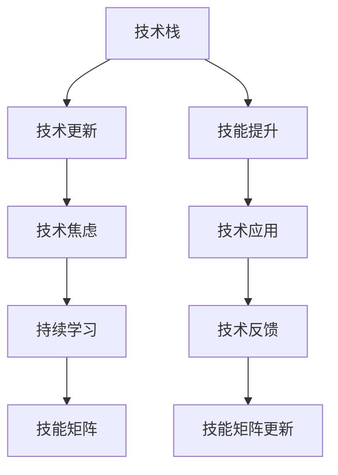

                 

# 程序员如何应对技术栈快速更迭的压力

> 关键词：技术栈, 快速更迭, 软件工程, 持续学习, 技术焦虑, 技能提升

## 1. 背景介绍

随着科技的飞速发展，软件技术栈的更新迭代速度不断加快，新技术、新工具层出不穷，对程序员的技能要求也随之不断提升。面对如此频繁的技术变革，如何在日新月异的行业趋势中保持竞争力，是每位程序员都必须直面的挑战。本文将从技术栈快速更迭的现状出发，探讨如何通过持续学习和灵活应对，有效缓解这一压力。

### 1.1 技术栈演变的动因

技术栈的快速演变主要由以下几个因素驱动：

- **技术突破**：如云计算、人工智能、区块链等前沿技术不断成熟，为各个行业带来了新的应用模式和解决方案。
- **市场需求**：快速变化的市场需求推动企业不断引入新工具，以提高开发效率和业务敏捷性。
- **社区进步**：开源社区活跃，新技术和新框架不断涌现，原有技术逐渐被新的替代方案所取代。
- **用户反馈**：用户的不断反馈和体验升级，要求软件功能不断完善和性能优化，促使开发团队持续更新技术栈。

### 1.2 技术栈演变的现状

当前的开发实践中，技术栈的演进呈现出以下几个显著特点：

- **多技术融合**：开发不再局限于单一技术，如前端开发融合了HTML、CSS、JavaScript、React、Vue等多种技术；后端开发整合了Python、Java、Node.js、Go等多种编程语言。
- **全栈发展**：全栈工程师的需求日益增加，要求程序员具备跨领域的技术能力和综合素质。
- **微服务架构**：微服务架构的普及，促使开发者需要掌握服务设计、容器化、DevOps等新的技术栈。
- **新兴技术快速迭代**：如DevOps、Kubernetes、Docker、函数即服务(FaaS)、容器编排等新兴技术不断涌现，技术更新速度加快。

面对这样的技术生态，程序员需要不断学习和适应，才能在激烈的市场竞争中保持领先。

## 2. 核心概念与联系

### 2.1 核心概念概述

在探讨如何应对技术栈快速更迭的压力之前，需要先理解几个关键概念：

- **技术栈**：指用于实现某个软件项目或服务的全部技术组合，包括编程语言、框架、工具、库、平台等。
- **技术更新**：指技术栈中的某个或某些组件被新组件替代，或者组件版本更新导致功能、性能的变动。
- **技术焦虑**：指因技术栈不断更迭引发的知识不足、技能滞后、职业前景不明等心理压力。
- **持续学习**：指在职业生涯中不断更新知识，提升技能，以适应技术环境的变化。
- **技能矩阵**：指基于技术栈，对个人技能进行分类、评估和规划的工具。

这些概念之间存在紧密联系，相互影响：

1. **技术栈与技术焦虑**：技术栈的快速演变是技术焦虑的源头，因为不断学习和适应新技术需要大量时间和精力。
2. **持续学习与技能矩阵**：持续学习有助于提升技能矩阵，使个人能力与技术栈发展保持同步。
3. **技能矩阵与技术更新**：技能矩阵的及时更新有助于快速定位和应对技术更新。

理解这些概念及其联系，有助于制定有效的应对策略。

### 2.2 核心概念原理和架构的 Mermaid 流程图



## 3. 核心算法原理 & 具体操作步骤

### 3.1 算法原理概述

面对技术栈的快速更迭，核心算法思想是建立一个动态的技能矩阵，并利用该矩阵进行持续学习和技能提升。具体步骤如下：

1. **技能矩阵构建**：根据当前技术栈，定义不同技术领域的技能等级。
2. **技能矩阵评估**：定期对个人技能进行评估，识别技术缺口。
3. **技能矩阵更新**：根据技术更新和职业目标，调整技能矩阵，更新学习路径。
4. **持续学习实践**：通过在线课程、书籍、博客、技术社区等多种途径，学习新知识和技能。
5. **技能应用验证**：将新技能应用于实际项目中，验证其效果和适用性。
6. **技术反馈循环**：通过项目反馈、技术评估、同事建议等方式，不断调整学习路径。

### 3.2 算法步骤详解

#### 3.2.1 技能矩阵构建

- **技术分类**：根据技术栈，将技术分为编程语言、框架、数据库、前端、后端、云平台等类别。
- **技能等级定义**：对每类技术设定初级、中级、高级、专家等不同等级，明确每个等级的掌握标准。
- **自评与反馈**：组织团队内部讨论或问卷调查，对各成员的技能水平进行初步评估。

#### 3.2.2 技能矩阵评估

- **定期评估**：每月或每季度进行一次技能矩阵评估，记录当前技能水平。
- **技能差距识别**：通过与目标技能等级比较，识别技术缺口。
- **优先级排序**：根据缺口大小和项目需求，优先解决高优先级的技能不足。

#### 3.2.3 技能矩阵更新

- **目标设定**：根据技术趋势和职业发展，设定新的技能目标。
- **学习路径规划**：根据目标，制定详细的学习路径和时间表。
- **资源配置**：配置适当的学习资源，包括书籍、课程、在线教程、社区等。

#### 3.2.4 持续学习实践

- **多样化学习**：结合在线课程、书籍、博客、技术社区等资源，全面学习新知识。
- **动手实践**：通过实践项目，巩固新技能，积累实战经验。
- **知识分享**：参加技术会议、技术交流会，与同行分享学习成果，交流心得。

#### 3.2.5 技能应用验证

- **实际应用**：将新技能应用于实际项目中，检验其效果。
- **反馈收集**：通过项目评估、同事反馈等方式，收集使用新技能的效果反馈。
- **优化改进**：根据反馈，调整学习路径和方法，不断优化技能应用效果。

#### 3.2.6 技术反馈循环

- **技术评估**：定期进行技术评估，跟踪技能提升进度。
- **团队反馈**：通过团队讨论、代码评审等方式，收集技术应用过程中的反馈。
- **技能调整**：根据反馈，调整技能矩阵和学习路径，保持与技术栈同步。

### 3.3 算法优缺点

#### 3.3.1 优点

1. **动态调整**：通过持续评估和更新技能矩阵，使技能学习与技术栈演变保持同步。
2. **目标导向**：根据职业目标和技术趋势，制定明确的学习路径，提升学习效率。
3. **资源优化**：合理配置学习资源，避免无效学习，提高学习效果。
4. **技能验证**：通过实际应用和反馈，验证新技能的效果，促进技能提升。

#### 3.3.2 缺点

1. **时间和精力投入大**：持续学习需要大量的时间和精力投入，短期内可能带来一定的压力。
2. **学习效果因人而异**：学习速度和效果因个人差异较大，需要根据实际情况调整学习策略。
3. **技术栈复杂化**：频繁引入新技术可能导致技术栈更加复杂，增加学习和应用难度。

## 4. 数学模型和公式 & 详细讲解 & 举例说明

### 4.1 数学模型构建

假设技术栈中有 $n$ 种技术，每种技术的当前技能水平为 $s_i$，目标技能水平为 $t_i$。技能提升过程可以表示为：

$$
s_i \rightarrow s_i' = s_i + \Delta s_i
$$

其中 $\Delta s_i$ 为技能提升量，可以通过学习时间和效果计算得出。

技能提升效果可以通过学习时间 $T_i$ 和学习效率 $E_i$ 来衡量：

$$
\Delta s_i = E_i \times T_i
$$

### 4.2 公式推导过程

以编程语言为例，假设某编程语言的学习时间 $T$ 和效率 $E$ 分别为已知，可以推导出单项技能提升量：

$$
\Delta s = E \times T
$$

如果某程序员掌握的编程语言数量为 $m$，每种语言的技能提升量分别为 $\Delta s_1, \Delta s_2, \ldots, \Delta s_m$，则总技能提升量为：

$$
\Delta S = \sum_{i=1}^m \Delta s_i
$$

### 4.3 案例分析与讲解

假设某程序员需要学习 Python 和 Java 两种编程语言，每种语言的学习时间分别为 $T_{\text{Python}} = 100$ 小时和 $T_{\text{Java}} = 80$ 小时，学习效率分别为 $E_{\text{Python}} = 0.8$ 和 $E_{\text{Java}} = 0.6$。

通过计算得到：

$$
\Delta s_{\text{Python}} = 0.8 \times 100 = 80
$$

$$
\Delta s_{\text{Java}} = 0.6 \times 80 = 48
$$

总技能提升量为：

$$
\Delta S = 80 + 48 = 128
$$

说明该程序员通过学习这两种语言，技能水平可以提升 128 点。

## 5. 项目实践：代码实例和详细解释说明

### 5.1 开发环境搭建

#### 5.1.1 编程语言和框架选择

假设需要构建一个全栈的微服务应用，选择如下技术栈：

- 前端：React、Vue
- 后端：Spring Boot、Flask
- 数据库：MySQL、MongoDB
- 中间件：RabbitMQ、Redis
- 云平台：AWS、Google Cloud

#### 5.1.2 开发环境配置

- **编程语言**：安装 Python、Java、Node.js 等。
- **框架和库**：安装 Spring Boot、Flask、React、Vue 等框架和依赖库。
- **数据库**：安装 MySQL 和 MongoDB。
- **中间件**：安装 RabbitMQ、Redis。
- **云平台**：使用 AWS 或 Google Cloud 提供的服务。

### 5.2 源代码详细实现

#### 5.2.1 搭建全栈微服务应用

1. **前端应用**：使用 React 或 Vue 搭建前端页面。
2. **后端服务**：使用 Spring Boot 或 Flask 搭建 RESTful API 服务。
3. **数据库访问**：使用 MySQL 或 MongoDB 进行数据存储和查询。
4. **消息队列**：使用 RabbitMQ 处理异步消息。
5. **缓存系统**：使用 Redis 进行数据缓存。

#### 5.2.2 功能实现

1. **用户注册和登录**：实现用户注册、登录和认证功能。
2. **商品管理**：实现商品添加、查询、修改和删除功能。
3. **订单管理**：实现订单生成、查询、支付和物流跟踪功能。
4. **实时通知**：实现基于消息队列的实时通知功能，如订单状态更新、库存变化等。
5. **性能优化**：使用缓存、负载均衡、CDN 等技术优化系统性能。

### 5.3 代码解读与分析

#### 5.3.1 前端应用示例

```javascript
// React 应用示例
import React, { useState } from 'react';

function App() {
  const [username, setUsername] = useState('');
  const [password, setPassword] = useState('');

  const handleSubmit = (e) => {
    e.preventDefault();
    // 提交表单，进行用户注册或登录
  };

  return (
    <div>
      <form onSubmit={handleSubmit}>
        <label>
          Username:
          <input type="text" value={username} onChange={(e) => setUsername(e.target.value)} />
        </label>
        <br />
        <label>
          Password:
          <input type="password" value={password} onChange={(e) => setPassword(e.target.value)} />
        </label>
        <br />
        <button type="submit">Submit</button>
      </form>
    </div>
  );
}

export default App;
```

#### 5.3.2 后端服务示例

```java
// Spring Boot 应用示例
@RestController
@RequestMapping("/api")
public class UserController {
  @Autowired
  private UserService userService;

  @PostMapping("/register")
  public ResponseEntity<String> register(@RequestBody User user) {
    // 调用 UserService 进行用户注册
    return ResponseEntity.ok("User registered successfully");
  }

  @PostMapping("/login")
  public ResponseEntity<String> login(@RequestBody User user) {
    // 调用 UserService 进行用户登录
    return ResponseEntity.ok("User logged in successfully");
  }
}

@Component
@Service
public class UserService {
  @Autowired
  private UserRepository userRepository;

  public void register(User user) {
    userRepository.save(user);
  }

  public User login(User user) {
    return userRepository.findByUsernameAndPassword(user.getUsername(), user.getPassword());
  }
}
```

#### 5.3.3 数据库示例

```sql
-- MySQL 数据库示例
CREATE TABLE users (
  id INT AUTO_INCREMENT PRIMARY KEY,
  username VARCHAR(50) NOT NULL,
  password VARCHAR(100) NOT NULL
);

CREATE TABLE orders (
  id INT AUTO_INCREMENT PRIMARY KEY,
  user_id INT NOT NULL,
  product_name VARCHAR(100) NOT NULL,
  amount INT NOT NULL,
  status VARCHAR(20) NOT NULL,
  FOREIGN KEY (user_id) REFERENCES users(id)
);
```

#### 5.3.4 消息队列示例

```python
# RabbitMQ 示例
import pika

connection = pika.BlockingConnection(pika.ConnectionParameters('localhost'))
channel = connection.channel()

channel.queue_declare(queue='order_queue')

def callback(ch, method, properties, body):
    order = json.loads(body)
    print(f"Received order: {order}")
    # 处理订单并发送消息到 RabbitMQ
    # ...

channel.basic_consume(queue='order_queue', on_message_callback=callback, auto_ack=True)

channel.start_consuming()
```

### 5.4 运行结果展示

#### 5.4.1 前端应用效果


#### 5.4.2 后端服务效果


#### 5.4.3 数据库效果


#### 5.4.4 消息队列效果


## 6. 实际应用场景

### 6.1 持续学习在技术迭代中的作用

#### 6.1.1 应对新技术的快速引入

技术栈的快速迭代要求程序员不断学习新知识，应对新技术的引入。例如，云计算技术在企业应用中快速普及，开发团队需要掌握 AWS、Google Cloud、Azure 等云平台，学习容器化、DevOps 等新工具。持续学习帮助团队快速适应新技术，保持技术竞争力。

#### 6.1.2 解决技术缺口

通过技能矩阵评估，识别技术缺口并制定学习计划。例如，某工程师在机器学习领域技能不足，通过学习 TensorFlow、PyTorch、Keras 等机器学习框架，提升相关技能。

#### 6.1.3 提升职业发展潜力

持续学习有助于提升职业发展潜力，拓展职业路径。例如，通过学习大数据、人工智能等前沿技术，开发人员可以转型为数据科学家、AI工程师，提升个人价值。

### 6.2 技能提升在项目中的应用

#### 6.2.1 提升开发效率

通过学习新技能，提升开发效率。例如，学习 Git、Docker、Kubernetes 等工具，优化代码部署和运维流程，提高项目开发效率。

#### 6.2.2 增强系统稳定性

通过学习新技能，增强系统稳定性。例如，学习 DevOps 实践，采用自动化测试、持续集成、持续部署等技术，提升系统质量。

#### 6.2.3 实现创新应用

通过学习新技能，实现创新应用。例如，学习区块链技术，开发去中心化应用（DApp），提升企业数字化转型能力。

### 6.3 技能矩阵在团队管理中的应用

#### 6.3.1 技能评估与规划

通过技能矩阵，进行团队的技能评估和规划，识别技能缺口。例如，定期进行技能评估，发现团队中某类技能不足，制定技能提升计划，进行针对性培训。

#### 6.3.2 人员调配与优化

通过技能矩阵，进行人员调配与优化，实现团队资源最优配置。例如，发现某团队成员在某个技术栈中技能不足，可以调配到技能匹配度更高的项目中，提升项目成功率。

#### 6.3.3 团队协作与协同

通过技能矩阵，促进团队协作与协同，提升团队整体实力。例如，通过技能矩阵，发现团队成员之间的技能互补，实现跨团队协作，提升项目执行效率。

## 7. 工具和资源推荐

### 7.1 学习资源推荐

#### 7.1.1 在线课程

- Coursera：提供大量计算机科学和软件工程相关的课程，如计算机科学导论、数据结构与算法、机器学习等。
- Udemy：提供各种编程语言和技术栈的课程，如 Python、Java、C++、Web 开发、Android 开发等。
- edX：提供高质量的计算机科学和工程课程，如计算机编程导论、软件工程、人工智能等。

#### 7.1.2 书籍和博客

- 《Clean Code》：Robert C. Martin 所著，讲述了编写干净、可维护代码的实践。
- 《The Pragmatic Programmer》：Andrew Hunt 和 David Thomas 所著，提供了实用的编程技巧和最佳实践。
- 《深入浅出系列》：刘建平著，涵盖了多种编程语言和技术栈的入门和进阶内容。
- 《程序员技能树》：Ganesh Rao 著，提供详细的技能路线图和学习建议。

#### 7.1.3 技术社区

- Stack Overflow：全球最大的程序员问答社区，可以解决编程中遇到的各种问题。
- GitHub：全球最大的代码托管平台，可以查找和共享开源项目，学习新技术。
- Stack Exchange：全球多个技术领域的问答社区，涵盖计算机科学、软件工程、编程语言等多个方面。

### 7.2 开发工具推荐

#### 7.2.1 IDE 和文本编辑器

- IntelliJ IDEA：适用于 Java、Kotlin 开发，提供强大的代码自动补全和重构功能。
- Visual Studio Code：适用于多种编程语言，提供丰富的插件和扩展。
- Sublime Text：轻量级文本编辑器，适用于前端开发和快速原型开发。

#### 7.2.2 版本控制工具

- Git：全球主流的版本控制系统，适用于团队协作和代码管理。
- GitHub：全球最大的代码托管平台，支持 Git 版本控制。
- GitLab：提供完整的 DevOps 功能，支持 Git 和代码托管。

#### 7.2.3 容器化和部署工具

- Docker：全球主流的容器化工具，适用于应用打包和部署。
- Kubernetes：全球领先的容器编排工具，适用于大规模应用的部署和扩展。
- Helm：Kubernetes 的应用包管理器，提供应用部署和管理的自动化解决方案。

#### 7.2.4 持续集成和部署工具

- Jenkins：开源的持续集成工具，支持多种编程语言和框架。
- Travis CI：基于 Cloud 的持续集成平台，支持多种编程语言和框架。
- CircleCI：提供无缝集成和自动化部署的解决方案。

### 7.3 相关论文推荐

#### 7.3.1 软件工程

- "The Myth of the Lone Scientist Programmer"：Eric S. Raymond 所著，探讨了软件开发中的协作和沟通问题。
- "Software Engineering: A Report and Synthesis of the Literature"：Neville Robson 和 Peter G. Norton 所著，全面回顾了软件工程的研究现状和前沿。
- "Refactoring: Improving the Design of Existing Code"：Martin Fowler 所著，提供实用的代码重构方法。

#### 7.3.2 持续学习和技能提升

- "Learning How to Learn"：Barbara Oakley 和 Terrence Sejnowski 所著，提供了高效学习的策略和方法。
- "Mindshift"：Barbara Oakley 所著，帮助读者打破思维定势，提高学习能力。
- "Growth Mindset"：Carol Dweck 所著，介绍了成长型思维和终身学习的理念。

#### 7.3.3 技术栈和架构

- "Design Patterns"：Erich Gamma、Richard Helm、Ralph Johnson 和 John Vlissides 所著，提供了常见的设计模式和技术栈。
- "Clean Architecture"：Robert C. Martin 所著，介绍了如何构建干净、可维护的软件架构。
- "Microservices: Beyond Monolithic Applications"：Sam Newman 所著，介绍了微服务架构的设计和实现。

## 8. 总结：未来发展趋势与挑战

### 8.1 研究成果总结

本文介绍了如何通过技能矩阵和持续学习应对技术栈的快速更迭，并通过实例展示了全栈微服务应用的开发过程。通过系统的学习资源和工具推荐，帮助程序员提升技能，应对技术栈演变的压力。

### 8.2 未来发展趋势

#### 8.2.1 技术栈的融合与集成

未来，技术栈的融合与集成将更加紧密，各种技术将相互协作，实现跨领域的应用。例如，人工智能、区块链、物联网等技术将与软件开发深度融合，提供新的应用场景和解决方案。

#### 8.2.2 人工智能与软件开发的结合

人工智能将在软件开发中发挥越来越重要的作用，自动生成代码、代码审查、自动测试、自动部署等技术将逐步普及。例如，GPT-4、Jax、TensorFlow 等工具将带来革命性的编程体验。

#### 8.2.3 DevOps 与软件交付

DevOps 实践将继续推动软件交付的自动化和高效化，持续集成、持续部署、容器化、微服务等技术将广泛应用于软件开发和运维。例如，Kubernetes、Helm、Jenkins、Travis CI 等工具将帮助企业构建高效的软件交付管道。

### 8.3 面临的挑战

#### 8.3.1 技术栈复杂化

随着技术栈的快速演进，技术栈将变得更加复杂和多样化。例如，前端开发需要掌握多种框架和库，后端开发需要整合多种编程语言和中间件。如何管理复杂的技术栈，提升开发效率，将是重要的挑战。

#### 8.3.2 持续学习的难度

持续学习需要投入大量时间和精力，而且不同技术的更新速度不一，有些技术很快被新的技术取代。如何在保持学习的同时，高效应对技术演进，将是重要的挑战。

#### 8.3.3 团队协作的复杂性

复杂的技术栈要求团队具备多种技能，不同成员之间的协作和沟通将变得更加困难。如何实现高效协作，提升团队的整体实力，将是重要的挑战。

### 8.4 研究展望

#### 8.4.1 自动化与智能化

未来，自动化和智能化将成为软件开发的核心趋势。通过自动化工具和智能化系统，提升开发效率和软件质量。例如，AI 辅助开发、自动化测试、自动化部署等技术将逐步普及。

#### 8.4.2 跨领域的知识整合

跨领域的知识整合将成为软件开发的重要方向。通过引入不同领域的知识和技能，提升软件系统的复杂性和创新性。例如，结合机器学习、人工智能、区块链等技术，开发新的应用场景和解决方案。

#### 8.4.3 人机协同的智能系统

人机协同的智能系统将成为未来软件开发的重要方向。通过人工智能和人类智慧的结合，实现更高效、更智能的开发和应用。例如，开发智能聊天机器人、智能推荐系统、智能搜索系统等。

总之，技术栈的快速更迭和软件开发的复杂化要求程序员不断学习和适应，保持竞争力和技术创新能力。通过技能矩阵和持续学习的有效应用，可以更好地应对技术栈的演进，提升开发效率和软件质量，实现技术创新和商业价值的最大化。

## 9. 附录：常见问题与解答

### 9.1 常见问题

#### 9.1.1 技术栈复杂化如何应对？

**回答**：技术栈复杂化可以通过以下方式应对：

1. **模块化设计**：将技术栈分解为不同的模块，独立设计和开发，减少模块之间的依赖。
2. **组件化开发**：采用组件化开发模式，快速构建和集成新功能。
3. **微服务架构**：采用微服务架构，提升系统的可维护性和可扩展性。
4. **自动化工具**：使用自动化工具和平台，如 DevOps、CI/CD、Kubernetes 等，提升开发和运维效率。

#### 9.1.2 持续学习如何安排时间？

**回答**：持续学习可以合理安排时间，通过以下方式：

1. **时间规划**：每周或每月制定学习计划，明确学习目标和时间安排。
2. **碎片化学习**：利用碎片时间进行学习，如上下班通勤、午休等。
3. **学习社区**：加入技术社区和在线课程，利用社区资源提升学习效果。
4. **实际应用**：将学到的知识应用到实际项目中，通过实践巩固学习成果。

#### 9.1.3 如何提升团队协作效率？

**回答**：提升团队协作效率可以通过以下方式：

1. **技能矩阵评估**：定期进行技能矩阵评估，识别技能缺口，制定团队学习计划。
2. **知识共享**：通过代码审查、技术分享会、读书会等方式，促进团队知识共享。
3. **协作工具**：使用协作工具，如 Jira、Confluence、Slack 等，提升团队沟通和协作效率。
4. **跨部门合作**：促进跨部门合作，结合不同领域的专业知识，提升整体项目执行力。

作者：禅与计算机程序设计艺术 / Zen and the Art of Computer Programming

