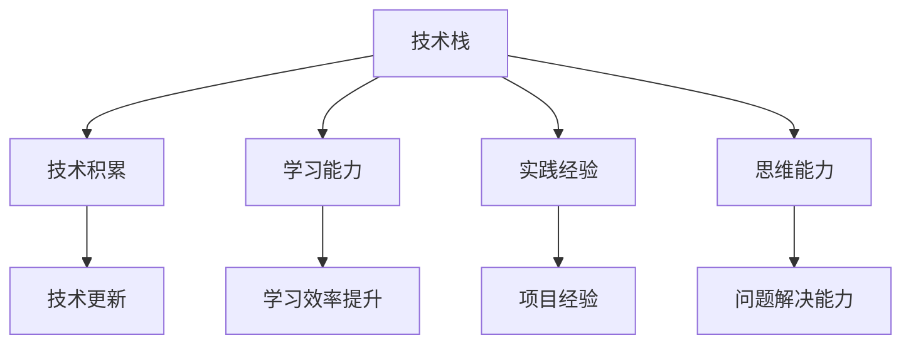

                 

# 程序员如何应对技术栈快速迭代

在当今技术日新月异的时代，技术栈的快速迭代已成常态。无论是前端开发者、后端开发者还是全栈工程师，都面临着如何快速掌握新技术、跟上技术趋势的挑战。本文将从背景介绍、核心概念、核心算法、项目实践、实际应用、工具和资源推荐、总结与展望等多个维度，深入探讨程序员如何应对技术栈的快速迭代。

## 1. 背景介绍

### 1.1 问题由来

技术栈的快速迭代主要源于以下几个方面：

- **新兴技术的涌现**：随着人工智能、云计算、大数据、区块链等新兴技术的不断发展，旧有技术迅速过时，新工具、新框架不断涌现。

- **行业需求的驱动**：各行各业对IT系统的高效、稳定和创新能力提出了更高要求，促使企业快速采用新技术以应对竞争。

- **社区和开源生态的繁荣**：开源社区的活跃和多样化的开源项目，不断推动着技术栈的更新换代。

对于程序员而言，技术栈的快速迭代意味着持续学习、不断更新技能的需求日益迫切。如何在有限的时间内，高效地掌握新技术，并在实际项目中灵活应用，是一个亟待解决的问题。

### 1.2 问题核心关键点

应对技术栈快速迭代的关键在于：

- **技术积累**：构建完备的技术知识体系，随时准备应对新技术的挑战。
- **学习能力**：提升学习效率，能够快速理解新技术的核心概念和应用场景。
- **实践经验**：通过实际项目积累经验，能够在实际应用中灵活运用新技术。
- **思维能力**：培养系统思维和创新思维，能够将不同技术进行有效整合，构建新解决方案。

本文将围绕这些关键点，深入探讨程序员应对技术栈快速迭代的具体策略。

## 2. 核心概念与联系

### 2.1 核心概念概述

为了更好地理解如何应对技术栈快速迭代，本节将介绍几个核心概念：

- **技术栈**：指一个项目或应用所使用的所有技术和工具，包括编程语言、框架、库、平台等。
- **技术积累**：指通过持续学习和实践，掌握和积累广泛的技术知识。
- **学习能力**：指快速掌握新知识、新技能的能力。
- **实践经验**：指通过实际项目和生产环境，应用新技术解决实际问题的经验。
- **思维能力**：指分析和解决问题、创新应用新思路的能力。

### 2.2 核心概念原理和架构的 Mermaid 流程图



这个流程图展示了技术栈、技术积累、学习能力、实践经验和思维能力之间的联系：

1. **技术栈**通过不断更新换代，形成新的**技术积累**。
2. **学习能力**提升，使程序员能够更高效地吸收新技术。
3. **实践经验**丰富，使新技术能够更好地应用到实际项目中。
4. **思维能力**的增强，使程序员能够创新应用新技术，构建新解决方案。

## 3. 核心算法原理 & 具体操作步骤

### 3.1 算法原理概述

应对技术栈快速迭代的核心算法在于构建一个高效的**知识吸收和应用体系**。该体系通过系统化的学习、实践和思维训练，帮助程序员快速掌握新技能，并在实际项目中灵活应用。

### 3.2 算法步骤详解

#### 3.2.1 系统化学习

- **结构化学习路径**：设定明确的学习目标，分解为多个小目标，如基础概念、核心应用、进阶技术等，逐步掌握。
- **多样化学习资源**：利用官方文档、在线课程、博客、论文、书籍等多种资源，获取全面、系统的知识。
- **实践与理论相结合**：通过实践项目或使用虚拟环境进行模拟实验，将理论知识转化为实际应用能力。

#### 3.2.2 高效学习方法

- **主题学习法**：围绕一个主题或技术栈，集中学习相关内容，避免分散精力。
- **任务驱动学习**：通过解决具体任务，驱动学习过程，提升学习动机和效果。
- **主动学习**：通过提问、讨论、实验等方式，积极探索和验证新知识。

#### 3.2.3 实际项目实践

- **项目管理**：选择或构建合适的项目，按阶段性目标进行开发，积累实战经验。
- **代码复审**：通过参与代码复审，学习他人的代码实现和设计思路，提升自身技能。
- **代码重构**：通过重构项目代码，掌握新技术在实际应用中的具体用法。

#### 3.2.4 思维训练

- **问题解决思维**：培养系统化、模块化的思维，能将复杂问题分解为可管理的部分。
- **创新思维**：通过研究新技术，探索新应用场景，实现技术创新和业务创新。

### 3.3 算法优缺点

#### 3.3.1 优点

- **系统性**：通过结构化学习路径，确保每个知识点都能系统掌握。
- **高效性**：多种学习资源结合，提升学习效率。
- **实用性**：通过实际项目和实践，将新知识转化为实际应用能力。
- **创新性**：通过问题解决和创新思维训练，推动新技术的创新应用。

#### 3.3.2 缺点

- **时间和精力的投入**：系统化学习和实践需要大量时间和精力投入。
- **需要持续更新**：新技术不断涌现，知识体系需要持续更新。
- **可能需要技术支持**：某些新技术可能需要额外的工具或平台支持。

### 3.4 算法应用领域

该算法不仅适用于编程语言和技术框架的更新，也适用于其他领域的知识更新，如数据科学、机器学习、人工智能等。在实际应用中，可以根据具体领域和技术栈的特点，进行灵活调整和优化。

## 4. 数学模型和公式 & 详细讲解 & 举例说明

### 4.1 数学模型构建

设 $X$ 为新技术的特征集合，$Y$ 为实际应用中的需求集合。假设 $f$ 为映射函数，将 $X$ 映射到 $Y$ 的解空间。则问题的数学模型可以表示为：

$$
\min_{f} \sum_{i=1}^N \ell(f(x_i), y_i)
$$

其中 $\ell$ 为损失函数，$x_i$ 和 $y_i$ 分别为训练集中的输入和输出，$N$ 为样本数量。

### 4.2 公式推导过程

- **损失函数**：常用的损失函数包括均方误差、交叉熵、对数损失等。以均方误差为例，推导过程如下：

$$
\ell(f(x_i), y_i) = \frac{1}{2} \left(f(x_i) - y_i\right)^2
$$

- **梯度下降**：求解上述最小化问题，常用的优化算法为梯度下降。以均方误差为例，梯度下降的更新规则为：

$$
\theta \leftarrow \theta - \eta \nabla_{\theta} \ell(\theta)
$$

其中 $\theta$ 为模型参数，$\eta$ 为学习率，$\nabla_{\theta} \ell(\theta)$ 为损失函数对模型参数的梯度。

### 4.3 案例分析与讲解

以深度学习框架 TensorFlow 为例，介绍如何通过系统化学习和实践，掌握新技能并应用于实际项目。

**Step 1: 系统化学习**

1. **理论学习**：从官方文档和在线课程学习 TensorFlow 基础概念，包括张量操作、神经网络模型、优化器等。
2. **实践实验**：在虚拟环境（如 Google Colab）中，实现一个简单的神经网络模型，进行初步验证。
3. **深入学习**：阅读 TensorFlow 社区的论文、博客和 GitHub 项目，深入理解模型架构和优化技巧。

**Step 2: 实际项目实践**

1. **项目选择**：选择或构建一个实际应用场景，如图像分类、自然语言处理、推荐系统等。
2. **模型训练**：使用 TensorFlow 构建模型，并在实际数据集上训练和调参。
3. **模型评估**：使用测试集评估模型效果，并进行迭代优化。

**Step 3: 思维训练**

1. **问题解决**：将实际问题抽象为模型训练问题，设计合适的数据预处理、模型架构和训练策略。
2. **创新应用**：探索 TensorFlow 在领域内的新应用，如生成对抗网络（GAN）、强化学习（RL）等。

通过以上步骤，可以系统地掌握 TensorFlow 并应用于实际项目，提升技术栈迭代能力。

## 5. 项目实践：代码实例和详细解释说明

### 5.1 开发环境搭建

**Step 1: 安装 TensorFlow**

- 使用 pip 安装 TensorFlow：

  ```bash
  pip install tensorflow
  ```

- 创建虚拟环境：

  ```bash
  conda create -n tf-env python=3.7
  conda activate tf-env
  ```

**Step 2: 使用 Google Colab**

- 创建 Google Colab 账号并登录。
- 使用 Jupyter Notebook 工具，构建开发环境：

  ```python
  !pip install -q tensorflow-gpu==2.3.0
  ```

**Step 3: 项目启动**

- 在 Google Colab 中创建一个新的 Notebook 文件，编写 TensorFlow 代码：

  ```python
  import tensorflow as tf

  model = tf.keras.Sequential([
      tf.keras.layers.Dense(10, activation='relu'),
      tf.keras.layers.Dense(1)
  ])

  model.compile(optimizer=tf.keras.optimizers.Adam(0.001), loss='mse', metrics=['mae'])
  ```

### 5.2 源代码详细实现

**Step 1: 数据准备**

- 收集和处理实际应用数据，如图像、文本、时间序列等。
- 进行数据清洗和预处理，确保数据质量。

**Step 2: 模型构建**

- 使用 TensorFlow 的高级 API，如 Keras，构建深度学习模型。
- 设计合适的模型架构，选择合适的层和激活函数。

**Step 3: 模型训练**

- 定义损失函数、优化器和评估指标。
- 使用训练数据集进行模型训练，记录训练过程和结果。

**Step 4: 模型评估**

- 使用测试数据集评估模型效果，进行交叉验证和超参数调整。
- 生成模型预测结果，评估模型的实际应用能力。

### 5.3 代码解读与分析

通过实际项目实践，可以更深入地理解 TensorFlow 的应用，并提升项目管理和开发能力。以下是代码实现的关键步骤：

1. **数据处理**：使用 TensorFlow 的 Dataset 和 DataLoader，处理和加载数据集。
2. **模型构建**：使用 Keras 的 Sequential 或 Functional API，定义模型结构。
3. **模型训练**：使用 Keras 的 Model 和 fit() 函数，进行模型训练。
4. **模型评估**：使用 Keras 的 Model 和 evaluate() 函数，评估模型效果。

### 5.4 运行结果展示

通过实际项目的运行结果，可以直观地看到 TensorFlow 模型在实际应用中的表现，并进行迭代优化。

## 6. 实际应用场景

### 6.1 智能推荐系统

智能推荐系统广泛应用在电商、社交媒体、视频平台等场景，通过分析用户行为数据，推荐个性化内容。基于 TensorFlow 的深度学习模型，可以实现高效的推荐算法，提升用户体验。

### 6.2 金融风控系统

金融风控系统用于监测和预防金融风险，保护用户资产安全。通过 TensorFlow 构建的深度学习模型，可以实时分析交易数据，预测潜在风险，提高风险管理能力。

### 6.3 医疗影像诊断

医疗影像诊断系统利用 TensorFlow 构建的深度学习模型，对医学影像进行分析和诊断，辅助医生决策，提升诊疗效率和准确性。

### 6.4 未来应用展望

未来，TensorFlow 在更多领域的深度学习应用将继续扩展，包括自动驾驶、智能家居、工业控制等。通过持续学习和实践，掌握 TensorFlow 将为程序员在技术栈迭代中占据优势。

## 7. 工具和资源推荐

### 7.1 学习资源推荐

- **TensorFlow 官方文档**：提供全面的 TensorFlow 学习资源，涵盖基础概念、高级 API、应用案例等。
- **Google Colab**：提供免费的计算资源，支持 TensorFlow 的虚拟实验环境。
- **Coursera、Udacity**：提供高质量的 TensorFlow 在线课程，涵盖入门到高级内容。

### 7.2 开发工具推荐

- **TensorFlow**：开源的深度学习框架，支持 Python 和 C++ 语言，易于安装和使用。
- **Jupyter Notebook**：强大的代码编辑器和交互环境，支持多种编程语言和工具集成。
- **Google Colab**：基于 Jupyter Notebook 的云平台，提供免费计算资源和代码运行环境。

### 7.3 相关论文推荐

- **深度学习：** 深度学习领域的经典书籍，涵盖基础概念和应用场景。
- **TensorFlow 论文集**：包含大量 TensorFlow 相关论文，提供前沿技术思路和实现方法。
- **TensorFlow 开源项目**：GitHub 上丰富的 TensorFlow 项目，提供大量实际应用案例和代码实现。

## 8. 总结：未来发展趋势与挑战

### 8.1 研究成果总结

本文通过系统化的学习、实践和思维训练，探讨了程序员应对技术栈快速迭代的具体策略。通过系统化的学习路径和高效的学习方法，确保每个知识点都能系统掌握。通过实际项目实践，将新知识转化为实际应用能力。通过思维训练，培养创新应用新技术的能力。

### 8.2 未来发展趋势

未来，技术栈的快速迭代将更加频繁，新技术的应用将更加广泛。为应对这一挑战，程序员需要持续学习和实践，保持技术栈的前沿性。同时，需要更多地关注新兴技术的趋势和应用，积极探索新技术在实际项目中的创新应用。

### 8.3 面临的挑战

尽管 TensorFlow 等深度学习框架提供了强大的技术支持，但技术栈的快速迭代仍面临以下挑战：

- **时间和精力的投入**：新技术的学习和应用需要大量时间和精力。
- **持续更新需求**：新技术不断涌现，知识体系需要持续更新。
- **技术栈庞杂**：多个技术栈的整合和应用，需要系统的规划和管理。

### 8.4 研究展望

未来的研究将关注以下几个方面：

- **自动化学习工具**：开发自动化学习工具，帮助程序员更高效地掌握新技术。
- **多领域应用**：探索 TensorFlow 在更多领域的应用，如自动驾驶、医疗影像等。
- **人工智能融合**：结合人工智能技术，推动 TensorFlow 在智能系统中的应用。

## 9. 附录：常见问题与解答

### Q1: 如何高效学习新技术？

A: 系统化学习新技术的关键在于构建清晰的理论学习路径，通过实践和实验巩固知识点。同时，利用多样化学习资源和主动学习策略，提升学习效率。

### Q2: TensorFlow 在实际项目中的应用有哪些？

A: TensorFlow 广泛应用于智能推荐、金融风控、医疗影像等领域。通过实际项目的实践，掌握 TensorFlow 在实际应用中的具体用法。

### Q3: 如何应对技术栈的快速迭代？

A: 持续学习和实践是应对技术栈快速迭代的关键。构建系统的学习路径，通过实践项目积累经验，并结合创新思维，推动新技术的创新应用。

本文通过系统化的学习、实践和思维训练，深入探讨了程序员如何应对技术栈快速迭代。通过构建完备的技术知识体系，提升学习效率，积累实践经验，并培养创新思维，能够有效应对技术栈的快速迭代。希望本文能为程序员在技术栈迭代中提供有价值的参考和指导。

---

作者：禅与计算机程序设计艺术 / Zen and the Art of Computer Programming

