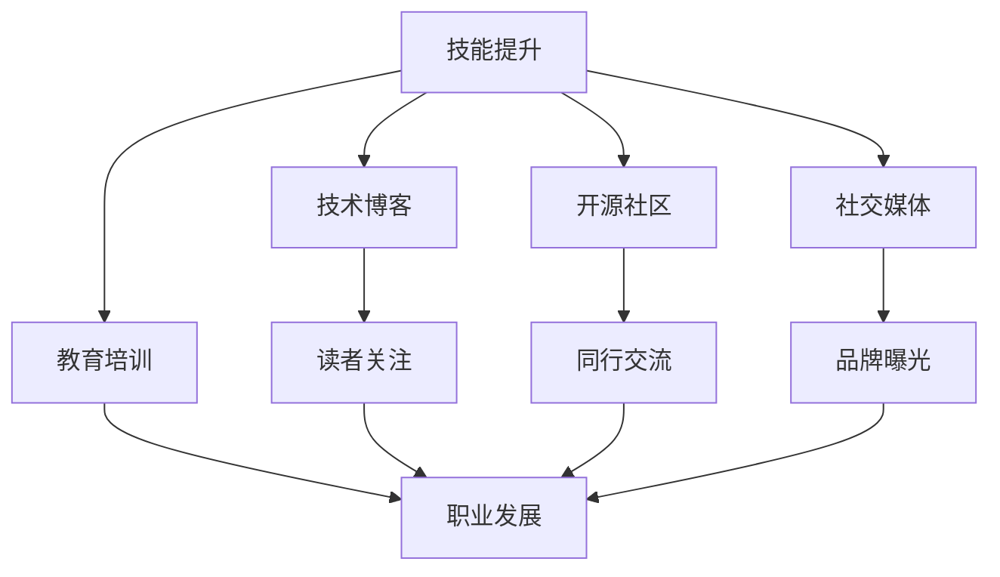

                 

# 程序员如何打造个人品牌IP

> 关键词：程序员,个人品牌,技术博客,开源社区,职业发展,编码技巧,编程实践,教育培训

## 1. 背景介绍

### 1.1 问题由来

在信息时代，技术的快速迭代和知识的大幅膨胀，使得程序员面临前所未有的挑战和机遇。如何在纷繁复杂的职业世界中建立和维护个人品牌，不仅关乎技术能力的展示，更是实现职业发展、拓宽人脉和积累资源的重要途径。

1. **技术快速发展**：新技术、新框架层出不穷，持续学习是程序员的必修课。
2. **知识共享需求**：从业者和学习者之间需要高效的沟通和知识共享渠道。
3. **职业发展需求**：通过个人品牌，程序员可以提升行业地位，获取更多职业机会。

### 1.2 问题核心关键点

建立个人品牌的过程涉及多个关键点：

- **技能提升**：掌握核心技术，保持持续学习。
- **内容创作**：在技术博客、开源项目中分享知识和经验。
- **社区互动**：参与线上线下技术社区，与同行交流互动。
- **教育培训**：通过教学和讲座提升影响力和知名度。
- **品牌传播**：利用社交媒体和个人网站进行品牌推广。

## 2. 核心概念与联系

### 2.1 核心概念概述

为更好地理解程序员如何打造个人品牌，我们首先介绍几个核心概念：

- **个人品牌**：指个人在行业内外建立并维持的形象、声誉和影响力。对于程序员而言，个人品牌不仅是技能水平的展示，更是职业态度、工作方法等多维度的综合体现。

- **技术博客**：指通过撰写技术文章，分享知识、经验和见解，吸引读者和同行关注。技术博客是建立个人品牌的重要渠道之一。

- **开源社区**：指参与开源项目，通过代码贡献、问题解答等形式展示技术实力和团队精神。开源社区是程序员提升影响力、拓宽人脉的重要平台。

- **职业发展**：指通过个人品牌提升职业机会，包括求职面试、晋升加薪、咨询培训等。个人品牌是职业发展的催化剂。

- **社交媒体**：指在社交平台如LinkedIn、Twitter、GitHub等上建立个人账号，分享动态、技术见解，进行品牌推广。社交媒体是提升个人品牌曝光度的重要手段。

### 2.2 核心概念原理和架构的 Mermaid 流程图



## 3. 核心算法原理 & 具体操作步骤

### 3.1 算法原理概述

个人品牌打造涉及多个方面的策略和技巧，核心在于通过技术分享、社区互动和品牌传播，持续提升个人在行业中的影响力和知名度。

### 3.2 算法步骤详解

#### 3.2.1 技能提升

1. **持续学习**：关注技术社区，参加技术会议，阅读权威书籍和论文，保持技术领先。
2. **实践演练**：通过实际项目应用新知识，解决复杂问题，积累实战经验。
3. **知识总结**：定期回顾和总结所学知识，形成系统化认识，便于分享和传播。

#### 3.2.2 内容创作

1. **选择合适的平台**：如GitHub、Medium、CSDN等，根据目标受众选择最合适的平台。
2. **确定主题内容**：确定个人兴趣和技术专长，选择具有实际价值和创新性的主题。
3. **结构化写作**：遵循清晰的逻辑结构和规范的写作风格，使文章易于理解和传播。

#### 3.2.3 社区互动

1. **参与开源项目**：在GitHub等平台上寻找感兴趣的项目，贡献代码或修复Bug。
2. **问题解答**：在技术社区如Stack Overflow、知乎等平台，积极回答问题，分享经验。
3. **建立网络**：参加线下技术沙龙、行业会议，结识行业内同行，拓展人脉。

#### 3.2.4 教育培训

1. **撰写教程和文档**：将技术知识转化为教学材料，形成系统的教程或文档。
2. **举办讲座和研讨会**：在高校、公司或线上平台举办讲座，分享个人见解和技术实践。
3. **教学平台合作**：与教育机构合作，开设在线课程或工作坊，传授专业知识。

#### 3.2.5 品牌传播

1. **社交媒体运营**：在LinkedIn、Twitter等平台上建立个人账号，定期发布技术文章、项目进展和生活动态。
2. **建立个人网站**：创建个人博客或技术站点，展示技术成果和个人项目，吸引访问者。
3. **参与Hackathon**：通过参与编程比赛，展示技术实力，获得业内认可。

### 3.3 算法优缺点

#### 3.3.1 优点

- **知识共享**：通过技术博客和开源项目，分享知识和经验，帮助他人提升技术能力。
- **行业认可**：通过参与技术社区和教育培训，获得同行和雇主的认可，提升职业机会。
- **职业发展**：通过品牌传播，增加曝光度，获得更多职业发展机会。

#### 3.3.2 缺点

- **时间成本**：持续的技术学习、内容创作和社区互动需要大量时间投入。
- **资源需求**：高质量的内容创作和品牌传播需要一定的技术和资源支持。
- **保持动力**：长期坚持个人品牌建设需要强大的动力和自律。

### 3.4 算法应用领域

个人品牌打造不仅限于技术领域，通过科学的方法和持续的努力，适用于各行各业的从业者。例如：

- **市场营销**：通过建立专业形象和推广品牌，吸引客户和业务机会。
- **创业**：通过展示技术能力和商业见解，吸引投资人，推动项目成功。
- **教育**：通过教学和分享，提升教育质量和影响力，成为行业内的名师。

## 4. 数学模型和公式 & 详细讲解 & 举例说明

### 4.1 数学模型构建

假设个人品牌价值由技能水平、内容质量、社交互动和曝光度四个维度组成，记为：

$$
V = S + C + I + E
$$

其中：

- $S$：技能水平，通过技能矩阵 $S=(s_{i,j})$ 表示，第 $i$ 项技能在第 $j$ 项任务中的熟练度。
- $C$：内容质量，通过内容评分 $C=(c_i)$ 表示，第 $i$ 篇内容的吸引力。
- $I$：社交互动，通过互动频率 $I=(i_j)$ 表示，与同行互动的频率。
- $E$：曝光度，通过曝光量 $E=(e_k)$ 表示，在社交平台上的关注度。

### 4.2 公式推导过程

个人品牌价值可以通过加权求和的方式计算，具体公式如下：

$$
V = \sum_{i=1}^n \alpha_i s_{i,j} + \sum_{i=1}^m \beta_i c_i + \sum_{j=1}^p \gamma_j i_j + \sum_{k=1}^q \delta_k e_k
$$

其中，$\alpha_i$、$\beta_i$、$\gamma_j$、$\delta_k$ 为各维度的权重系数，需要通过实际数据和反馈进行调整。

### 4.3 案例分析与讲解

假设某程序员通过以下数据提升了个人品牌价值：

- **技能矩阵**：
  $$
  S = \begin{bmatrix}
  5 & 4 & 3 \\
  4 & 5 & 4 \\
  3 & 4 & 5 
  \end{bmatrix}
  $$
  表示在编程、算法和架构三个领域中，技能熟练度分别为5、4、3。

- **内容评分**：
  $$
  C = [8, 9, 7, 6]
  $$
  表示四篇文章的内容质量评分。

- **互动频率**：
  $$
  I = [3, 2, 4, 1, 5]
  $$
  表示与五名同行的互动频率。

- **曝光量**：
  $$
  E = [10, 5, 15, 8]
  $$
  表示在四个社交平台上的曝光量。

通过公式计算，该程序员的品牌价值 $V$ 为：

$$
V = \alpha_1 \times 5 + \beta_1 \times 8 + \gamma_1 \times 3 + \delta_1 \times 10 + \alpha_2 \times 4 + \beta_2 \times 9 + \gamma_2 \times 2 + \delta_2 \times 5 + \alpha_3 \times 3 + \beta_3 \times 7 + \gamma_3 \times 4 + \delta_3 \times 1 + \alpha_4 \times 4 + \beta_4 \times 6 + \gamma_4 \times 5 + \delta_4 \times 15
$$

通过不断调整权重系数和数据，可以动态地提升个人品牌价值。

## 5. 项目实践：代码实例和详细解释说明

### 5.1 开发环境搭建

搭建个人品牌的开发环境主要包括以下几个步骤：

1. **选择平台**：根据个人兴趣和目标受众，选择GitHub、Medium、CSDN等技术博客平台。
2. **配置工具**：安装和配置Markdown编辑器、Git客户端、IDE等开发工具。
3. **部署网站**：搭建个人博客网站，可以使用静态网站生成器如Jekyll，也可以托管到云平台如GitHub Pages。

### 5.2 源代码详细实现

以下是一个简单的技术博客网站搭建示例，使用Jekyll和GitHub Pages实现。

#### 5.2.1 安装Jekyll

```bash
gem install jekyll
```

#### 5.2.2 创建Jekyll博客

```bash
jekyll new my-blog
cd my-blog
```

#### 5.2.3 编写Markdown文章

在 `_posts` 目录下创建Markdown文件，例如：

```markdown
---
title: "如何使用Jekyll搭建技术博客"
date: 2023-04-01 00:00:00 +0800
permalink: /blog/jekyll-tutorial/
tags: [jekyll, blog, website]
---

# 如何使用Jekyll搭建技术博客

本文介绍如何使用Jekyll搭建一个简单的技术博客。

1. 安装Jekyll
2. 创建博客
3. 编写文章
4. 部署网站
```

#### 5.2.4 配置GitHub Pages

在GitHub上创建一个仓库，将博客代码推送到仓库中，配置域名和CNAME文件：

```bash
git remote add origin https://github.com/username/my-blog.git
git push -u origin master
echo "my-blog.github.io" > CNAME
```

### 5.3 代码解读与分析

Jekyll使用Ruby语言开发，是一个静态网站生成器，通过简单的Markdown语法编写博客文章，并自动生成HTML文件。GitHub Pages则是一个基于GitHub存储的网站托管服务，通过CNAME文件配置域名，可以将博客发布到GitHub上。

### 5.4 运行结果展示

通过访问 `https://my-blog.github.io`，可以看到博客文章的列表，点击文章标题，可以查看详细的技术内容。

## 6. 实际应用场景

### 6.1 个人品牌建设

#### 6.1.1 技能提升

1. **技术栈提升**：定期学习新的技术栈，如大数据、人工智能等，并在博客中分享学习心得。
2. **项目实战经验**：参与开源项目或公司项目，积累实战经验，撰写项目总结。

#### 6.1.2 内容创作

1. **深度文章**：撰写有深度、有见解的技术文章，如原理剖析、案例分析等。
2. **教程和文档**：编写详细的教程和文档，帮助新手快速上手。
3. **即时更新**：持续更新博客内容，跟踪最新的技术趋势和动态。

#### 6.1.3 社区互动

1. **开源贡献**：在GitHub上参与开源项目，贡献代码或优化文档。
2. **问题解答**：在技术社区如Stack Overflow、知乎等平台积极回答问题，分享经验。
3. **技术沙龙**：参加线下或线上技术沙龙，结识行业内同行。

#### 6.1.4 教育培训

1. **在线课程**：与教育机构合作，开设在线课程或工作坊，传授专业知识。
2. **线上讲座**：在高校、公司或线上平台举办讲座，分享技术见解和实践经验。
3. **技术培训**：为公司或社区组织技术培训，提升团队技术水平。

#### 6.1.5 品牌传播

1. **社交媒体**：在LinkedIn、Twitter等平台上建立个人账号，定期发布技术文章、项目进展和生活动态。
2. **个人网站**：创建个人博客或技术站点，展示技术成果和个人项目，吸引访问者。
3. **编程比赛**：参与Hackathon等编程比赛，展示技术实力，获得业内认可。

### 6.2 职业发展

#### 6.2.1 求职面试

1. **个人网站**：展示个人项目和技能，提供简历下载链接。
2. **博客展示**：通过技术博客展示编程技巧和解决问题的能力。
3. **GitHub展示**：在GitHub上展示开源项目，展示技术实力。

#### 6.2.2 晋升加薪

1. **技术报告**：撰写技术报告，总结项目成果和贡献。
2. **技术分享**：在公司内部或技术会议上分享技术经验，提升影响力。
3. **项目管理**：参与公司重要项目，展示领导力和技术能力。

## 7. 工具和资源推荐

### 7.1 学习资源推荐

1. **《技术博客写作指南》**：介绍如何撰写高质量技术文章，提升内容质量和阅读体验。
2. **《程序员职业发展指南》**：涵盖技术学习、职业规划、品牌建设等多方面内容，提供系统的指导。
3. **《开源社区参与指南》**：介绍如何参与开源项目，贡献代码和解决问题，提升社区影响力。
4. **《在线教育平台运营》**：提供在线课程和讲座的运营技巧，提高教育培训的效果。

### 7.2 开发工具推荐

1. **Markdown编辑器**：如Typora、Jekyll等，便于编写和预览Markdown文章。
2. **Git客户端**：如GitHub Desktop、SourceTree等，方便进行代码管理。
3. **IDE集成工具**：如Visual Studio Code、PyCharm等，提高开发效率。
4. **网站生成器**：如Jekyll、WordPress等，快速搭建个人博客网站。

### 7.3 相关论文推荐

1. **《技术博客对职业发展的贡献》**：研究技术博客对个人职业发展的实际影响。
2. **《开源社区与个人品牌建设》**：探讨开源社区参与对建立个人品牌的帮助。
3. **《编程比赛对程序员技能提升的影响》**：分析参与编程比赛对技能提升和品牌建设的作用。

## 8. 总结：未来发展趋势与挑战

### 8.1 研究成果总结

个人品牌建设已成为程序员职业发展的重要组成部分，通过技能提升、内容创作、社区互动和品牌传播，不断提升个人在行业内的影响力和知名度。

### 8.2 未来发展趋势

未来，个人品牌建设将呈现以下几个趋势：

1. **跨平台协作**：技术博客和开源社区将跨平台融合，形成更加集成的技术生态。
2. **实时互动**：通过直播、视频等方式，实时与观众互动，提升品牌影响力。
3. **多元展示**：结合视频、音频、图形等多媒体形式，丰富技术展示的维度。
4. **品牌自动化**：利用AI技术自动化品牌推广和管理，提高效率和效果。

### 8.3 面临的挑战

个人品牌建设过程中，仍面临以下挑战：

1. **时间和资源限制**：技术学习、内容创作和社区互动需要大量时间和精力。
2. **品牌一致性**：如何保持品牌形象的一致性，避免多面化的冲突。
3. **内容质量控制**：如何保证内容的质量和实用性，避免误导读者。
4. **技术迭代**：快速的技术更新要求持续学习和适应，保持技术领先。

### 8.4 研究展望

未来的个人品牌建设需要结合人工智能、大数据等技术，进一步提升效率和效果。以下是一些可能的研究方向：

1. **AI自动化内容创作**：利用AI技术自动生成技术文章和代码示例，提高内容创作效率。
2. **区块链品牌认证**：通过区块链技术，为个人品牌建立可信的认证体系。
3. **多维数据驱动品牌提升**：结合社交媒体、搜索引擎等多维数据，动态调整品牌建设策略。

## 9. 附录：常见问题与解答

**Q1：个人品牌建设是否需要大量时间和资源投入？**

A: 是的，个人品牌建设需要持续的努力和时间投入。但通过合理的策略和方法，可以高效利用时间和资源，达到最佳效果。

**Q2：如何选择合适的内容主题？**

A: 选择与个人兴趣和目标受众相关的主题，同时考虑技术趋势和实际需求，选择有实际价值和创新性的主题。

**Q3：如何平衡职业发展和个人兴趣？**

A: 在个人品牌建设过程中，尽量结合职业发展需求和个人兴趣，通过技术分享和社区互动，提升职业机会和兴趣体验。

**Q4：如何提升内容质量？**

A: 内容质量是品牌建设的核心，需要通过持续学习和实践，不断提升技术深度和广度。同时，进行内容审稿和读者反馈，持续优化。

**Q5：如何保持品牌一致性？**

A: 通过明确的品牌定位和统一的沟通风格，保持品牌形象的一致性。定期进行品牌审计，调整品牌策略。

---

作者：禅与计算机程序设计艺术 / Zen and the Art of Computer Programming

