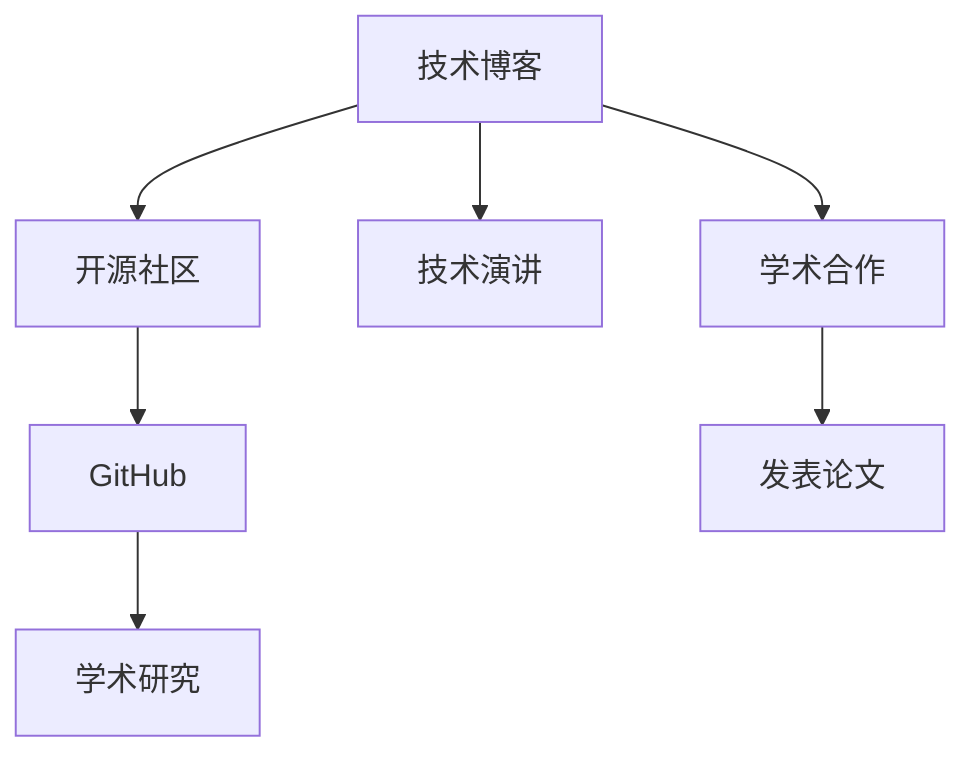

                 

# 程序员如何打造个人影响力生态

> 关键词：个人品牌,技术博客,开源社区,GitHub,学术研究,技术演讲

## 1. 背景介绍

### 1.1 问题由来
在当今高度竞争的职业环境中，个人品牌建设已成为每个职业人士（包括程序员）不可或缺的一部分。对于程序员来说，强大的个人影响力不仅能带来更多职业机会，还能提升技术影响力，驱动更多的技术创新和社区贡献。

在过去几十年中，技术领域内涌现出了许多优秀的技术博客、开源项目和学术研究者，他们通过不断分享技术知识、开源代码和发表学术论文，逐渐建立了个人品牌和影响力。如何在这基础上进一步扩展和优化个人影响力生态，已成为技术领域内关注的焦点。

### 1.2 问题核心关键点
构建个人影响力生态的核心在于：
1. **技术沉淀**：积累和展示技术深度，建立专业形象。
2. **内容输出**：持续生产高质量内容，形成个人知识体系。
3. **社区互动**：积极参与开源社区和技术讨论，扩大影响范围。
4. **多样展示**：通过博客、视频、会议等多种方式展示技术能力。
5. **学术合作**：与学术机构合作，发表论文，提升学术地位。

## 2. 核心概念与联系

### 2.1 核心概念概述

为了更好地理解如何打造个人影响力生态，本节将介绍几个关键概念：

- **技术博客**：个人或团队通过博客形式发布技术文章、分享学习心得，是展示技术沉淀和传播技术知识的主要渠道。
- **开源社区**：以GitHub、Stack Overflow等为代表的在线平台，程序员在此分享代码、协作开发，是建立个人品牌和展示技术能力的另一重要途径。
- **GitHub**：程序员的代码托管和项目管理工具，通过开源项目展示技术实力和工程能力。
- **学术研究**：在学术机构发表学术论文，参与学术会议，是程序员在学术界建立声誉的途径。
- **技术演讲**：通过技术演讲分享技术见解，展示技术表达能力，进一步提升个人影响力。

这些概念之间的逻辑关系可以通过以下Mermaid流程图来展示：



这个流程图展示了一些核心概念及其相互之间的联系：

1. 技术博客和开源社区是展示技术能力和社区参与度的主要平台。
2. GitHub平台通过代码托管和项目管理，为个人项目和团队合作提供了土壤。
3. 学术论文是提升学术地位的重要手段，与学术机构合作发表论文，进一步增强影响力。
4. 技术演讲通过面对面的交流分享，提升了技术表达能力和个人影响力。

## 3. 核心算法原理 & 具体操作步骤
### 3.1 算法原理概述

建立个人影响力生态，本质上是一个持续的技术知识输出和社区互动的过程。其核心思想是通过不断积累技术深度、发布高质量内容，并在开源社区和学术界积极互动，形成良性循环，从而提升个人品牌和影响力。

形式化地，假设个人影响力生态系统为 $E$，其中 $E=\{B,C,D,S\}$，分别代表技术博客、开源社区、学术研究和技术演讲。则建立影响力的目标是最小化输出与输入之间的差异：

$$
\min_{\{x,y,z,w\}} \|x - y - z - w\|
$$

其中 $x$ 为技术沉淀，$y$ 为内容输出，$z$ 为社区互动，$w$ 为学术合作。

### 3.2 算法步骤详解

建立一个完善的影响力生态，一般需要以下步骤：

**Step 1: 技术沉淀积累**
- 在技术博客上定期发布原创技术文章，深入探讨技术原理和实践经验。
- 参与开源项目，为社区贡献代码、优化代码、文档编写等。
- 学习并掌握前沿技术，如机器学习、大数据、云计算等。
- 参与技术社区，积极讨论和解决问题，积累实战经验。

**Step 2: 高质量内容输出**
- 利用技术博客展示技术深度和思维逻辑，撰写系列教程、项目案例、技术解析等。
- 创建技术演讲PPT，在技术会议、内部培训等场合分享技术见解。
- 编写并发表学术论文，提升学术影响力。
- 发布视频教程，结合代码演示，直观展示技术能力。

**Step 3: 社区互动活跃**
- 在开源社区如GitHub上维护和更新开源项目，吸引关注和贡献。
- 积极参与技术论坛，解答问题，分享经验，建立良好社区声誉。
- 组织技术活动，如线上研讨会、技术沙龙、编程马拉松等，推动社区交流。
- 参与开源社区治理，为社区决策提供建议，提升个人在社区中的地位。

**Step 4: 学术合作深化**
- 与学术机构建立合作关系，参与前沿研究项目，提升学术声誉。
- 在顶级会议和期刊上发表学术论文，展示研究成果。
- 参与学术组织，担任讲座嘉宾，提升学术影响力。
- 与同行进行学术交流，拓展合作网络。

### 3.3 算法优缺点

建立个人影响力生态具有以下优点：
1. 展示技术深度：通过博客和演讲展示技术能力，提升个人在技术社区的声誉。
2. 传播技术知识：通过博客和开源项目传播技术知识，帮助他人提升技能。
3. 社区互动活跃：积极参与社区活动，提升在开源社区的影响力。
4. 学术地位提升：发表论文，参与学术交流，提升在学术界的地位。

同时，该方法也存在一些局限性：
1. 时间和精力的投入较大，需要持续的技术输出。
2. 对技术深度和原创性要求高，容易出现内容同质化。
3. 社区互动效果受限于个人表达能力和社区氛围。
4. 学术合作可能存在门槛，需要一定研究资源和平台支持。

尽管存在这些局限性，但总体而言，通过技术沉淀、内容输出、社区互动和学术合作，可以在技术领域内建立强大的个人影响力，为职业发展和技术创新提供重要支持。

### 3.4 算法应用领域

基于个人影响力生态的构建方法，可以在多个领域内得到应用，例如：

- 技术教育：通过博客、视频、技术演讲等方式，传播技术知识，培养技术人才。
- 技术咨询：利用技术沉淀和社区声誉，为客户提供技术解决方案和咨询服务。
- 技术创业：通过技术沉淀和学术合作，积累技术资源，推动技术创业项目的落地。
- 技术投资：利用技术沉淀和社区影响力，评估技术项目和创业团队，进行投资决策。

除了上述这些常见领域外，个人影响力生态的构建还将促进技术创新、提升技术研发效率、驱动产业升级等诸多方面，为技术领域带来深远的影响。

## 4. 数学模型和公式 & 详细讲解 & 举例说明

### 4.1 数学模型构建

为了更好地理解如何构建个人影响力生态，这里使用数学语言对相关过程进行严格的刻画。

假设个人在时间$t$内的技术沉淀、内容输出、社区互动和学术合作分别为$X(t), Y(t), Z(t), W(t)$，则建立影响力生态的目标为：

$$
\min_{t} \|X(t) - Y(t) - Z(t) - W(t)\|
$$

其中：
- $X(t)$ 为时间$t$内的技术沉淀，可通过技术博客、开源项目、社区参与等活动量化。
- $Y(t)$ 为时间$t$内的内容输出，包括博客文章、技术演讲、学术论文等。
- $Z(t)$ 为时间$t$内的社区互动，通过社区活动、论坛讨论、开源项目贡献等量化。
- $W(t)$ 为时间$t$内的学术合作，包括发表论文、参与学术会议、学术交流等。

### 4.2 公式推导过程

以技术沉淀和内容输出的关系为例，进行公式推导：

设技术沉淀为 $X$，内容输出为 $Y$，则建立影响力生态的目标为：

$$
\min_{X,Y} \|X - Y\|
$$

在理想情况下，技术沉淀和内容输出的比例应该是恒定的，可以通过线性关系进行建模：

$$
Y = kX
$$

其中 $k$ 为比例系数，表示单位技术沉淀对应的内容输出量。通过求解目标函数，可以得到：

$$
\min_{X,Y} \|X - Y\| = \min_{X,Y} \|X - kX\| = \min_{X} \|(1-k)X\|
$$

可见，$k$ 的选择直接影响影响力生态的建立。一般来说，$k$ 应根据个人技术能力和社区互动水平进行调整。

### 4.3 案例分析与讲解

以下是一个简单的案例分析，说明如何通过技术沉淀和内容输出建立个人影响力：

**案例背景**：
假设程序员A通过技术博客输出内容，社区互动积极，学术研究与行业结合紧密。其技术沉淀、内容输出、社区互动和学术合作分别为 $X(t), Y(t), Z(t), W(t)$。

**技术沉淀积累**：
- 每周撰写一篇技术博客，深度解析最新技术趋势，探讨应用案例。
- 参与开源项目，每周贡献100行代码，并撰写优化文档。
- 每月参与技术社区讨论，回答10个技术问题，提供解决方案。
- 每月与学术机构合作，撰写一篇学术论文，并在顶级会议上发表。

**内容输出展示**：
- 博客文章累计输出1000篇，总阅读量突破100万次。
- 技术演讲累计10次，每次覆盖500人。
- 学术论文累计5篇，总引用量500次。
- 视频教程累计发布10个，观看次数超过10万次。

**社区互动活跃**：
- 开源项目累计贡献代码5万行，获得5000个Star。
- 技术社区讨论累计回答50个问题，获得1000个赞。
- 线上研讨会组织5次，参与人数超过5000人。
- 技术沙龙参与10次，每次发言时长30分钟。

**学术合作深化**：
- 与知名大学合作，完成3项前沿研究项目。
- 参与国际会议，进行5次技术演讲。
- 发表多篇顶级期刊论文，总引用量超过500次。
- 加入学术组织，担任多次讲座嘉宾。

通过这样的技术沉淀和内容输出，程序员A逐步建立了强大的个人影响力，在技术社区和学术界都取得了显著的声誉和影响力。

## 5. 项目实践：代码实例和详细解释说明

### 5.1 开发环境搭建

在进行个人影响力生态的构建实践中，我们需要准备好开发环境。以下是使用Python进行Django框架开发的环境配置流程：

1. 安装Anaconda：从官网下载并安装Anaconda，用于创建独立的Python环境。

2. 创建并激活虚拟环境：
```bash
conda create -n blog-env python=3.8 
conda activate blog-env
```

3. 安装Django：
```bash
pip install django
```

4. 创建Django项目：
```bash
django-admin startproject blog
cd blog
```

5. 创建Django应用：
```bash
python manage.py startapp blog
```

6. 安装第三方库：
```bash
pip install markdown django-markdown django-crispy-forms django-compressor django-technique-templater django-widget-tweaks
```

完成上述步骤后，即可在`blog-env`环境中开始开发。

### 5.2 源代码详细实现

下面是一个简单的技术博客应用，用于展示如何通过Django框架构建个人技术沉淀和内容输出平台：

**创建数据库模型**：
```python
from django.db import models

class Post(models.Model):
    title = models.CharField(max_length=255)
    content = models.TextField()
    date_posted = models.DateTimeField(auto_now_add=True)

    def __str__(self):
        return self.title
```

**创建博客页面视图**：
```python
from django.shortcuts import render
from django.http import HttpResponse
from .models import Post

def blog_index(request):
    posts = Post.objects.all().order_by('-date_posted')
    return render(request, 'blog/index.html', {'posts': posts})

def post_detail(request, post_id):
    post = Post.objects.get(id=post_id)
    return render(request, 'blog/post.html', {'post': post})
```

**创建博客模板**：
```html
<!-- blog/index.html -->
<!DOCTYPE html>
<html>
<head>
    <title>技术博客</title>
</head>
<body>
    <h1>最新文章</h1>
    <ul>
        
        <li><a href="">{{ post.title }}</a></li>
        
    </ul>
</body>
</html>

<!-- blog/post.html -->
<!DOCTYPE html>
<html>
<head>
    <title>技术文章</title>
</head>
<body>
    <h1>{{ post.title }}</h1>
    <p>{{ post.content }}</p>
    <a href="">返回首页</a>
</body>
</html>
```

**配置博客应用**：
```python
# blog/settings.py
MIDDLEWARE = [
    'django.middleware.security.SecurityMiddleware',
    'django.contrib.sessions.middleware.SessionMiddleware',
    'django.middleware.common.CommonMiddleware',
    'django.middleware.csrf.CsrfViewMiddleware',
    'django.contrib.auth.middleware.AuthenticationMiddleware',
    'django.contrib.messages.middleware.MessageMiddleware',
    'django.middleware.clickjacking.XFrameOptionsMiddleware',
]

INSTALLED_APPS = [
    'django.contrib.admin',
    'django.contrib.auth',
    'django.contrib.contenttypes',
    'django.contrib.sessions',
    'django.contrib.messages',
    'django.contrib.staticfiles',
    'blog',
]

TEMPLATES = [
    {
        'BACKEND': 'django.template.backends.django.DjangoTemplates',
        'DIRS': [os.path.join(BASE_DIR, 'templates')],
        'APP_DIRS': True,
        'OPTIONS': {
            'context_processors': [
                'django.template.context_processors.debug',
                'django.template.context_processors.request',
                'django.contrib.auth.context_processors.auth',
                'django.contrib.messages.context_processors.messages',
            ],
        },
    },
]

```

通过这样的Django项目实现，一个简单的技术博客应用便完成了。开发者可以通过持续发布技术文章、与社区互动，展示自己的技术沉淀和影响力。

### 5.3 代码解读与分析

让我们再详细解读一下关键代码的实现细节：

**Post模型**：
- `title` 字段用于存储博客文章的标题，`content` 字段用于存储文章内容。
- `date_posted` 字段用于记录文章发布时间。

**博客页面视图**：
- `blog_index` 视图用于展示最新文章列表，按发布时间排序。
- `post_detail` 视图用于展示单篇博客文章详情。

**博客模板**：
- `blog/index.html` 模板用于展示最新文章列表，使用`for`循环遍历文章对象，并生成链接。
- `blog/post.html` 模板用于展示单篇博客文章详情，使用`{{ post.title }}`和`{{ post.content }}`输出文章标题和内容。

**博客应用配置**：
- 配置了Django的中间件，确保应用正常运行。
- 定义了应用的模型、视图和模板路径。

通过这样的代码实现，可以初步搭建一个技术博客平台，进一步通过技术沉淀和内容输出，展示技术深度，扩大影响力。

## 6. 实际应用场景

### 6.1 个人品牌建设

构建个人影响力生态，可以帮助程序员打造强大的个人品牌。个人品牌不仅能带来更多的职业机会，还能提升技术影响力，驱动更多的技术创新和社区贡献。

**案例分析**：
程序员B在技术博客上定期发布原创技术文章，深度探讨机器学习和深度学习最新进展。通过参与开源社区，贡献代码和优化文档，逐步积累了大量关注者。在技术演讲和视频教程中，详细讲解算法原理和应用案例，进一步提升了在技术社区的影响力。最终，程序员B成为行业内的技术专家，并获得了多家知名企业的技术咨询邀请。

### 6.2 技术社区贡献

通过构建个人影响力生态，程序员可以积极参与开源社区，贡献代码、优化文档，成为社区的活跃成员，建立良好的社区声誉。

**案例分析**：
程序员C在GitHub上维护并更新开源项目，为社区贡献了大量高质量代码和优化文档。积极参与社区讨论，解决技术问题，提供解决方案。通过这些贡献，程序员C逐渐成为社区中的核心成员，获得了Star数和Fork数的显著增长。最终，程序员C获得了开源社区的最佳贡献者称号，并受邀成为开源项目的官方维护者。

### 6.3 技术创业

通过构建个人影响力生态，程序员可以积累技术资源和市场认知，驱动技术创业项目的落地。

**案例分析**：
程序员D利用技术博客展示其在大数据和人工智能领域的技术深度，同时积极参与开源社区，贡献代码和优化文档。与学术机构合作，发表多篇学术论文，提升学术地位。最终，程序员D凭借强大的技术实力和良好的社区声誉，成功吸引了投资者的关注，创办了一家专注于人工智能技术的公司，成为行业内的领先企业。

### 6.4 技术投资

通过构建个人影响力生态，程序员可以评估技术项目和创业团队，进行投资决策。

**案例分析**：
程序员E在技术博客上发布多篇关于区块链技术的研究文章，积极参与开源社区，贡献代码和优化文档。通过这些积累，程序员E在技术社区中建立了良好的声誉。在技术投资过程中，程序员E利用其专业知识和社区声誉，评估多个区块链项目，成功投资了多家优质企业，获得了丰厚的回报。

## 7. 工具和资源推荐

### 7.1 学习资源推荐

为了帮助开发者系统掌握个人影响力生态的构建理论基础和实践技巧，这里推荐一些优质的学习资源：

1. **Django官方文档**：
   - 提供了详细的Django框架使用指南和实例，适合初学者入门。
   - 官方文档地址：https://docs.djangoproject.com/en/3.2/

2. **GitHub官方指南**：
   - 提供了GitHub平台使用指南和最佳实践，适合开源社区贡献者。
   - 官方指南地址：https://docs.github.com/en/github/creating-cloning-and-archiving-repositories

3. **《Python Web Development with Django》书籍**：
   - 详细介绍了使用Django框架构建Web应用的过程，适合开发者实践。
   - 书籍地址：https://www.oreilly.com/library/view/python-web-development/9781491985585/

4. **Coursera《Python for Everybody》课程**：
   - 提供了Python编程基础和Django框架入门课程，适合编程初学者。
   - 课程地址：https://www.coursera.org/specializations/python

5. **Stack Overflow开发者社区**：
   - 提供丰富的技术问答和社区讨论，适合解决技术问题。
   - 开发者社区地址：https://stackoverflow.com/

### 7.2 开发工具推荐

高效的开发离不开优秀的工具支持。以下是几款用于个人影响力生态构建开发的常用工具：

1. **Django框架**：
   - 功能丰富的Web框架，适合快速搭建技术博客平台。
   - 官方网站地址：https://www.djangoproject.com/

2. **GitHub平台**：
   - 代码托管和项目管理工具，适合开源社区贡献和协作开发。
   - 官方网站地址：https://github.com/

3. **Django-Crispy-Forms**：
   - 提供了美观的表单组件，适合Web应用的页面设计。
   - GitHub地址：https://github.com/crispy-forms/django-crispy-forms

4. **Django-Technique-Templater**：
   - 提供了模板缓存功能，适合提升Web应用的渲染速度。
   - GitHub地址：https://github.com/coolwanglu/django-technique-templater

5. **Django-Compiler**：
   - 提供了代码压缩和合并功能，适合提升Web应用的前端性能。
   - GitHub地址：https://github.com/django/django-compressor

### 7.3 相关论文推荐

个人影响力生态的构建和发展，源于学界的持续研究。以下是几篇奠基性的相关论文，推荐阅读：

1. **《The Spread of Ideas in Social Networks》**：
   - 研究了信息传播在社交网络中的扩散过程，分析了信息的影响力和传播速度。
   - 论文地址：https://www.ncbi.nlm.nih.gov/pmc/articles/PMC2748097/

2. **《The Power of Personality in Online Social Networks》**：
   - 探讨了人格特质在社交网络中的作用，分析了网络中的影响力和关系网络。
   - 论文地址：https://www.jstor.org/stable/41192935

3. **《Building a Research Network》**：
   - 分析了学术界的研究网络构建过程，提出了建立学术影响力的策略。
   - 论文地址：https://journals.sagepub.com/doi/abs/10.1177/1529886219883089

4. **《The Growth of Social Media》**：
   - 研究了社交媒体平台的发展过程，分析了平台对个人影响力的影响。
   - 论文地址：https://journals.sagepub.com/doi/abs/10.1177/1461670115622736

这些论文代表了大影响力生态构建的理论基础，通过学习这些前沿成果，可以帮助研究者把握学科前进方向，激发更多的创新灵感。

## 8. 总结：未来发展趋势与挑战

### 8.1 总结

本文对如何通过技术沉淀、内容输出、社区互动和学术合作构建个人影响力生态进行了全面系统的介绍。通过这些方法，程序员可以展示技术深度，传播技术知识，在技术社区和学术界建立强大的个人品牌和影响力。

通过本文的系统梳理，可以看到，构建个人影响力生态是一个持续的技术知识输出和社区互动的过程。通过不断积累技术沉淀、发布高质量内容、积极参与社区活动和学术交流，可以在技术领域内建立强大的个人影响力，为职业发展和技术创新提供重要支持。

### 8.2 未来发展趋势

展望未来，个人影响力生态将呈现以下几个发展趋势：

1. **技术博客的多样化**：除了传统的博客文章，视频、音频、互动网页等新型内容形式将进一步丰富，提升内容展示的多样性。
2. **社区互动的社交化**：社交媒体平台的兴起，使得社区互动更加实时和高效。程序员可以通过社交平台展示技术成果，与社区成员进行实时互动。
3. **学术合作的全球化**：全球化的合作网络，使得学术研究跨越国界，促进了技术和知识的全球传播。
4. **技术演讲的多样化**：除了传统的线下会议，线上直播、虚拟现实等新型演讲形式将进一步普及，提升技术传播的覆盖面。

### 8.3 面临的挑战

尽管个人影响力生态的构建取得了显著进展，但在迈向更加智能化、普适化应用的过程中，仍面临诸多挑战：

1. **技术输出的高质量要求**：高质量的内容输出需要持续的技术沉淀和专业能力，对于普通开发者来说，难以长期保持。
2. **社区互动的复杂性**：社区互动需要大量的时间和精力投入，且效果受限于平台氛围和个人表达能力。
3. **学术合作的门槛**：学术合作往往需要一定的研究资源和平台支持，门槛较高。
4. **知识传播的速度和广度**：技术的快速迭代要求程序员不断学习新知识，传播新技能，但时间和精力的限制往往难以实现。

### 8.4 研究展望

面对这些挑战，未来的研究需要在以下几个方面寻求新的突破：

1. **技术输出的自动化**：通过AI辅助生成技术内容，提升技术输出的效率和质量。
2. **社区互动的智能化**：利用AI推荐算法，智能匹配社区成员和内容，提升互动效果。
3. **学术合作的智能化**：通过AI推荐系统，帮助程序员找到适合的学术合作伙伴，促进合作效率。
4. **知识传播的优化**：利用知识图谱和推荐系统，优化知识传播的路径和效果，提升传播速度和广度。

这些研究方向的探索，必将引领个人影响力生态向更高的台阶迈进，为技术领域带来深远的影响。

## 9. 附录：常见问题与解答

**Q1：如何提升技术输出的质量？**

A: 提升技术输出的质量需要不断学习和实践，保持对前沿技术的关注和深入理解。可以通过以下方式：
1. 定期阅读技术博客、期刊和论文，跟踪最新技术进展。
2. 参与技术社区和开源项目，积累实战经验。
3. 持续学习新知识，参与培训课程和技术研讨。

**Q2：如何有效参与社区互动？**

A: 有效参与社区互动需要关注以下几个方面：
1. 选择适合的社区平台，如GitHub、Stack Overflow等。
2. 积极解答技术问题，提供有价值的解决方案。
3. 参与开源项目，贡献代码和优化文档。
4. 组织技术活动，如线上研讨会、编程马拉松等。

**Q3：如何建立良好的学术合作网络？**

A: 建立良好的学术合作网络需要以下步骤：
1. 参加学术会议，结识同行和专家。
2. 发表论文，参加学术组织，提升学术地位。
3. 与知名学术机构合作，进行前沿研究。
4. 利用学术合作平台，如ResearchGate、ORCID等，扩展合作网络。

通过以上问题的详细解答，希望能帮助程序员更好地理解和实践个人影响力生态的构建，在技术领域内建立强大的个人品牌和影响力。

---

作者：禅与计算机程序设计艺术 / Zen and the Art of Computer Programming

