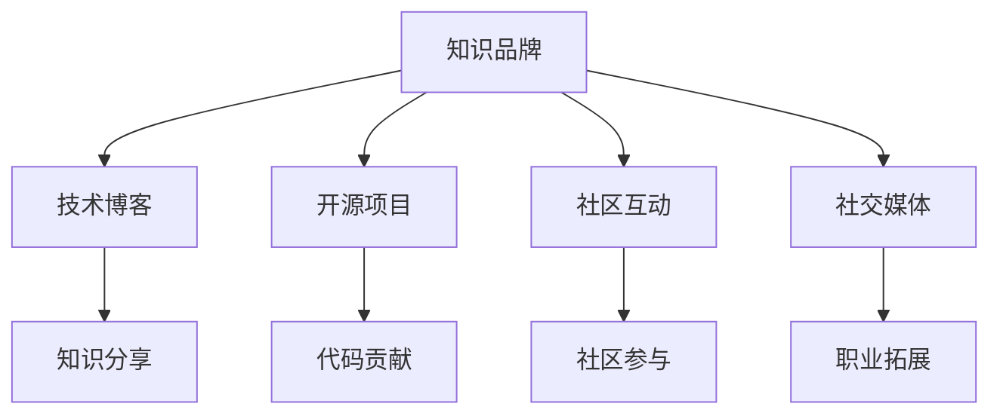

                 

# 程序员如何打造个人知识品牌

> 关键词：知识品牌、个人品牌、程序员、软件开发、知识分享、社区参与、技术博客、开源项目、社交媒体、持续学习

## 1. 背景介绍

在数字经济时代，个人品牌已成为了一种重要的资产。尤其对于程序员，如何将自己塑造成具有影响力的知识品牌，不仅能提升职业竞争力，还能为职业发展开启新的机会。本文将深入探讨程序员如何打造个人知识品牌，涵盖技术写作、开源贡献、社区互动等多个方面，为程序员提供可操作的指南和策略。

## 2. 核心概念与联系

### 2.1 核心概念概述

- **知识品牌（Knowledge Brand）**：指个人或团队在某一专业领域内，通过分享高质量内容，建立起的权威、专业、值得信赖的公众形象。
- **个人品牌（Personal Branding）**：指个人通过特定行为、言论、社交媒体活动等，塑造和推广自身形象的过程。
- **程序员（Programmers）**：使用编程语言编写计算机程序的专业人员，通常专注于软件开发、系统架构、算法优化等领域。
- **技术博客（Technical Blogging）**：程序员通过撰写技术博客，分享编程经验、技术进展、项目案例等，建立专业知识体系，提升行业影响力。
- **开源项目（Open Source Projects）**：程序员通过参与开源项目，贡献代码、文档、测试等，展示技术能力和团队合作精神，扩大社区影响。
- **社区互动（Community Engagement）**：程序员在技术社区中积极参与讨论、解答问题、组织活动等，建立良好的人脉关系和行业声誉。
- **社交媒体（Social Media）**：程序员利用社交平台，如GitHub、Twitter、LinkedIn等，分享技术文章、参与社区讨论、拓展职业机会。

### 2.2 核心概念原理和架构的 Mermaid 流程图



这个流程图展示了个人知识品牌构建的核心活动及其相互关联：

1. **技术博客（A->B）**：通过撰写技术博客，分享专业知识和见解，建立个人知识体系。
2. **开源项目（A->C）**：通过参与开源项目，贡献代码和文档，展示技术能力和团队合作精神。
3. **社区互动（A->D）**：通过在技术社区中积极互动，建立良好的人脉关系和行业声誉。
4. **社交媒体（A->E）**：通过社交媒体平台分享技术文章、参与讨论，拓展职业机会和提升知名度。

## 3. 核心算法原理 & 具体操作步骤

### 3.1 算法原理概述

个人知识品牌的打造是一个持续学习和分享的过程，需要通过高质量内容的输出和积极社区互动，逐步建立专业权威的形象。具体来说，可以将其分为以下几个步骤：

1. **技术学习与实践**：持续学习最新的技术进展，通过项目实践，将新知识融入到自己的技能体系中。
2. **内容创作**：通过撰写技术博客、技术文章，分享个人经验和技术见解，构建个人知识库。
3. **开源贡献**：参与开源项目，通过代码贡献、问题解决等，展示技术能力和合作精神。
4. **社区互动**：在技术社区中积极参与讨论、解答问题、组织活动，建立良好的人脉关系。
5. **社交媒体推广**：利用社交平台分享技术文章、参与讨论，拓展职业机会和提升知名度。

### 3.2 算法步骤详解

#### 3.2.1 技术学习与实践

**步骤1**：选择合适的技术栈和项目，进行深入学习。通过在线课程、官方文档、技术书籍等途径，全面掌握相关技术。

**步骤2**：通过实际项目，将新知识应用到具体场景中，验证和巩固技术能力。

**步骤3**：定期总结和回顾项目经验，形成结构化的技术文档或博客。

#### 3.2.2 内容创作

**步骤1**：选择感兴趣的领域或热门技术，进行深入研究和分析。

**步骤2**：确定文章结构，包括标题、引言、正文、结论等部分。

**步骤3**：撰写技术文章，注重逻辑清晰、内容深度，同时使用通俗易懂的语言，便于读者理解。

**步骤4**：使用Markdown等工具进行格式化，并通过博客平台或社交媒体发布。

#### 3.2.3 开源贡献

**步骤1**：选择感兴趣的开源项目，了解其贡献流程和社区规范。

**步骤2**：阅读相关代码和文档，理解项目架构和技术细节。

**步骤3**：确定贡献方式，如提交代码、修复bug、编写文档等。

**步骤4**：通过GitHub等平台提交贡献，参与项目讨论和反馈。

#### 3.2.4 社区互动

**步骤1**：选择活跃且与你技术领域相关的技术社区，如Stack Overflow、GitHub、Reddit等。

**步骤2**：定期访问社区，浏览热门问题和技术讨论，了解行业动态。

**步骤3**：主动回答问题、提供帮助、分享个人经验，展示你的专业知识和友好态度。

**步骤4**：参与社区组织的活动，如线上研讨会、技术沙龙、技术交流会等，扩大影响力。

#### 3.2.5 社交媒体推广

**步骤1**：选择合适的社交媒体平台，如LinkedIn、Twitter、GitHub等。

**步骤2**：创建专业的个人资料，突出技术背景和专业领域。

**步骤3**：定期发布技术文章、项目进展、行业动态等，保持活跃度。

**步骤4**：参与讨论和互动，与同行建立联系，拓展职业机会。

### 3.3 算法优缺点

**优点**：
- **广泛曝光**：通过技术博客、开源项目、社交媒体等渠道，能够快速扩大个人影响力。
- **持续学习**：不断学习和实践新技术，保持技术领先优势。
- **网络资源**：在社区中积极互动，能获取丰富的行业信息和资源。

**缺点**：
- **时间和精力投入大**：需要持续投入时间学习、实践、创作内容。
- **知识更新快**：技术发展迅速，需要不断更新知识库和技能体系。
- **专业性要求高**：需要具备高水平的技术能力和专业知识。

### 3.4 算法应用领域

个人知识品牌的应用领域广泛，包括但不限于以下几个方面：

- **软件开发**：通过技术博客、开源项目，展示编程技能和项目经验。
- **系统架构**：通过技术分享、社区互动，展示架构设计能力和经验。
- **算法优化**：通过技术文章、代码贡献，展示算法设计和优化能力。
- **数据科学**：通过数据分析、机器学习项目，展示数据处理和建模能力。
- **人工智能**：通过技术博客、开源项目，展示AI理论和实践能力。

## 4. 数学模型和公式 & 详细讲解 & 举例说明

### 4.1 数学模型构建

假设程序员通过技术博客 $B$ 和开源项目 $O$ 建立个人知识品牌 $K$。设技术博客的质量 $Q$ 和开源项目的贡献度 $C$ 为关键指标，则个人知识品牌的价值 $V$ 可以表示为：

$$ V = f(Q, C) $$

其中 $f$ 为一个非线性函数，表示质量与贡献度之间的映射关系。

### 4.2 公式推导过程

**推导过程**：
1. **输入变量**：
   - $Q$：技术博客的质量，包括文章的深度、创新性、可读性等。
   - $C$：开源项目的贡献度，包括代码贡献量、问题解决数、文档完善度等。

2. **映射函数**：
   - $f$：一个非线性函数，映射输入变量 $Q$ 和 $C$ 到输出变量 $V$。

3. **假设**：
   - $f$ 为单调递增函数，即 $Q$ 和 $C$ 的增加会正向影响 $V$。
   - $f$ 为非线性函数，即 $Q$ 和 $C$ 的增加对 $V$ 的影响是非线性的。

### 4.3 案例分析与讲解

**案例分析**：假设某程序员通过撰写高质量的技术博客和贡献开源项目，逐步提升了个人知识品牌价值。

1. **技术博客的质量提升**：通过持续学习、实践和总结，技术博客的质量逐步提高。博客内容更深入、创新，读者反馈更积极。

2. **开源项目的贡献度提升**：通过积极参与开源项目，提交代码、解决问题，成为项目核心贡献者。

3. **个人知识品牌的价值提升**：随着 $Q$ 和 $C$ 的增加，个人知识品牌的价值 $V$ 显著提升，在行业内建立了权威地位。

## 5. 项目实践：代码实例和详细解释说明

### 5.1 开发环境搭建

**环境搭建**：

1. **安装Git**：从官网下载安装Git，配置本地环境。

2. **配置GitHub**：创建GitHub账号，设置代码托管仓库。

3. **搭建本地开发环境**：安装Python、Java、Node.js等开发工具，设置IDE和代码编辑器。

4. **安装依赖库**：通过pip、npm等工具，安装必要的依赖库和框架。

### 5.2 源代码详细实现

**技术博客**：

```python
# 使用Jupyter Notebook创建技术博客
import jupyterlab

# 创建博客内容
with open('blog.md', 'w') as f:
    f.write('# 技术博客标题\n\n这是一篇关于XXX技术的详细讲解，包括代码示例和实际应用场景。')
```

**开源项目**：

```python
# 使用GitHub创建开源项目
import github

# 创建项目仓库
repo = github.create_repo('my-open-source-project')

# 提交代码
with open('my-code.py', 'w') as f:
    f.write('def my_function():\n    # 实现功能\n    pass')

# 提交代码
repo.commit('my-code.py', message='Add my-function.py')
```

### 5.3 代码解读与分析

**代码解读**：

1. **技术博客**：通过Jupyter Notebook创建技术博客，使用Markdown语法编写内容，并保存为MD文件。

2. **开源项目**：通过GitHub API创建项目仓库，提交Python代码文件，并添加提交信息。

**代码分析**：

1. **技术博客**：代码简单，主要实现技术文章的创建和保存。使用Markdown语法，支持标题、段落、代码块等基本功能。

2. **开源项目**：代码使用GitHub API创建项目仓库，并提交代码文件。需要理解Git和API的基本使用方法。

**运行结果展示**：

1. **技术博客**：保存后的MD文件可以在本地打开阅读，或者通过GitHub Page发布到互联网上。

2. **开源项目**：提交的代码文件将保存在GitHub仓库中，并可以通过pull request、issue等机制，与其他开发者协作和讨论。

## 6. 实际应用场景

### 6.1 软件开发

**实际应用**：

1. **技术博客**：撰写关于新项目或技术的文章，分享项目背景、设计思路、开发经验等。

2. **开源项目**：参与开源项目，贡献代码、修复bug、编写文档等。

3. **社区互动**：在Stack Overflow、GitHub等社区，回答问题、提供帮助、参与讨论。

**案例分析**：某程序员通过撰写关于某框架的技术博客，展示项目设计和实现细节，获得了大量关注和点赞。同时，积极参与项目开源，提交代码和文档，成为项目核心贡献者，提升了个人影响力和职业发展机会。

### 6.2 系统架构

**实际应用**：

1. **技术博客**：分享架构设计思路、最佳实践、性能优化方案等。

2. **开源项目**：展示架构图、模块划分、接口设计等，展示架构能力。

3. **社区互动**：在技术社区分享架构案例，参与架构讨论，建立行业影响力。

**案例分析**：某程序员通过撰写系统架构设计博客，分享架构设计思路和最佳实践，获得业内认可。同时，开源架构设计和代码实现，展示架构能力，成为社区中公认的架构专家。

### 6.3 算法优化

**实际应用**：

1. **技术博客**：分享算法优化方案、实验结果、性能对比等。

2. **开源项目**：贡献算法优化代码、实验数据、优化文档等。

3. **社区互动**：在Kaggle等社区分享算法优化经验，参与算法讨论，建立算法能力。

**案例分析**：某程序员通过撰写算法优化博客，分享实验结果和优化方案，获得行业认可。同时，开源算法优化代码，展示算法能力，成为社区中公认的算法专家。

### 6.4 数据科学

**实际应用**：

1. **技术博客**：分享数据分析思路、建模方法、实验结果等。

2. **开源项目**：贡献数据处理、特征工程、模型训练代码等。

3. **社区互动**：在Kaggle等社区分享数据分析经验，参与数据讨论，建立数据科学能力。

**案例分析**：某程序员通过撰写数据分析博客，分享建模思路和实验结果，获得行业认可。同时，开源数据分析和模型代码，展示数据科学能力，成为社区中公认的数据科学家。

### 6.5 人工智能

**实际应用**：

1. **技术博客**：分享AI理论和实践经验，分享最新研究进展。

2. **开源项目**：贡献AI模型实现、实验数据、优化文档等。

3. **社区互动**：在ArXiv等社区分享AI研究成果，参与AI讨论，建立AI能力。

**案例分析**：某程序员通过撰写AI博客，分享最新研究进展和实践经验，获得行业认可。同时，开源AI模型和代码，展示AI能力，成为社区中公认的AI专家。

## 7. 工具和资源推荐

### 7.1 学习资源推荐

**技术博客**：

1. **Stack Overflow**：全球最大的编程问答社区，涵盖各种编程和技术问题。

2. **Medium**：专注于技术写作和知识分享的平台，发布高质量技术文章。

3. **CSDN**：国内知名的技术社区，涵盖软件开发、系统架构、人工智能等领域。

**开源项目**：

1. **GitHub**：全球最大的代码托管平台，支持各种编程语言和框架。

2. **Apache Software Foundation**：Apache基金会支持的多种开源项目，包括Hadoop、Spark等。

3. **Mozilla**：Mozilla基金会支持的多种开源项目，包括Firefox浏览器、Web浏览器引擎等。

**社区互动**：

1. **Stack Overflow**：全球最大的编程问答社区，涵盖各种编程和技术问题。

2. **Reddit**：全球最大的社交新闻网站，涵盖各种话题和讨论。

3. **Kaggle**：数据科学和机器学习竞赛平台，提供丰富的数据集和竞赛机会。

### 7.2 开发工具推荐

**技术博客**：

1. **Jupyter Notebook**：基于Python的交互式计算环境，支持Markdown语法和代码执行。

2. **GitHub Pages**：GitHub提供的静态网站托管服务，支持Markdown和HTML文件。

3. **Github Wiki**：GitHub提供的Wiki功能，支持markdown和Git版本控制。

**开源项目**：

1. **Git**：全球最流行的版本控制系统，支持代码管理和协作。

2. **GitHub**：全球最大的代码托管平台，支持多种编程语言和框架。

3. **GitHub Actions**：GitHub提供的CI/CD平台，支持自动化构建和部署。

**社区互动**：

1. **Stack Overflow**：全球最大的编程问答社区，支持实时问答和讨论。

2. **Reddit**：全球最大的社交新闻网站，支持多种话题和讨论。

3. **Kaggle**：数据科学和机器学习竞赛平台，支持数据集和竞赛。

### 7.3 相关论文推荐

**技术博客**：

1. **《博客写作的艺术》（The Art of Blogging）**：详细介绍了如何撰写高质量技术博客，包括内容选择、结构布局、SEO优化等。

2. **《技术写作指南》（Technical Writing Guide）**：提供了全面的技术写作指南，涵盖技术文档、博客、白皮书等。

3. **《内容营销策略》（Content Marketing Strategy）**：介绍了如何通过内容营销建立个人品牌和提升影响力。

**开源项目**：

1. **《开源项目管理指南》（Open Source Project Management）**：提供了开源项目管理的详细指南，涵盖代码提交、版本控制、社区协作等。

2. **《开源开发最佳实践》（Open Source Development Best Practices）**：提供了开源开发的最佳实践，涵盖代码质量、测试、部署等。

3. **《开源社区运营指南》（Open Source Community Operations）**：提供了开源社区运营的详细指南，涵盖社区管理、用户互动、活动组织等。

**社区互动**：

1. **《社区互动的艺术》（The Art of Community Engagement）**：详细介绍了如何通过社区互动建立良好的人脉关系和行业声誉。

2. **《社交媒体营销指南》（Social Media Marketing Guide）**：提供了社交媒体营销的详细指南，涵盖平台选择、内容创作、用户互动等。

3. **《技术社区运营指南》（Technical Community Operations）**：提供了技术社区运营的详细指南，涵盖社区管理、活动组织、用户互动等。

## 8. 总结：未来发展趋势与挑战

### 8.1 研究成果总结

本文通过系统性地介绍技术学习与实践、内容创作、开源贡献、社区互动和社交媒体推广等步骤，详细讲解了程序员如何打造个人知识品牌。通过技术博客、开源项目和社区互动，提升了程序员在行业内的影响力和知名度。

### 8.2 未来发展趋势

未来，随着技术的不断发展，个人知识品牌的打造将更加多元化。以下趋势值得关注：

1. **内容多样化**：除了技术博客和开源项目，视频、播客、Podcast等多样化的内容形式也将成为重要工具。

2. **社区参与深度化**：在社区中积极参与技术讨论、开源贡献、技术交流会等活动，建立更紧密的行业联系。

3. **技术社交化**：通过社交媒体平台，分享技术文章、参与讨论，拓展职业机会和提升知名度。

### 8.3 面临的挑战

在打造个人知识品牌的过程中，仍面临诸多挑战：

1. **时间和精力投入**：需要持续投入时间学习、实践、创作内容，对时间和精力要求较高。

2. **知识更新快**：技术发展迅速，需要不断更新知识库和技能体系，保持技术领先优势。

3. **专业性要求高**：需要具备高水平的技术能力和专业知识，才能在行业内建立权威地位。

### 8.4 研究展望

未来，对于个人知识品牌的打造，还需要从以下几个方面进行研究：

1. **跨领域融合**：将不同领域的技术知识和经验融合，形成更全面的知识体系。

2. **社会化分享**：利用社交媒体平台，将技术知识和经验分享到更广泛的社会群体中，提升公众影响力。

3. **知识变现**：将技术知识和经验转化为商业价值，如技术咨询、培训课程、技术产品等。

总之，通过系统学习和实践，程序员可以打造个人知识品牌，提升职业竞争力和行业影响力。未来，随着技术的不断发展和市场的变化，个人知识品牌也将不断演进，发挥更大的价值。

## 9. 附录：常见问题与解答

**Q1：如何平衡工作和个人品牌建设？**

A: 需要合理安排时间，确保工作和学习时间充足，同时利用业余时间进行内容创作和社区互动。可以制定详细的计划，确保各项任务有序进行。

**Q2：如何选择技术博客主题？**

A: 选择与自身技术背景和兴趣相关的领域，同时关注行业热点和前沿技术。可以通过阅读相关书籍、论文和开源项目，了解行业动态，找到合适的主题。

**Q3：如何提升技术博客的质量？**

A: 注重内容深度、创新性和可读性，使用清晰的标题和结构布局，适当添加代码示例和图表。可以通过反复修改和优化，提升博客质量。

**Q4：如何选择开源项目？**

A: 选择与自己技术背景和兴趣相关的项目，同时关注项目活跃度和社区规模。可以通过阅读项目文档和贡献指南，了解项目需求和贡献流程。

**Q5：如何提升社区互动效果？**

A: 积极回答问题、提供帮助、分享个人经验，建立良好的社区声誉。可以通过定期参与讨论和活动，与社区成员建立紧密联系。

---

作者：禅与计算机程序设计艺术 / Zen and the Art of Computer Programming

