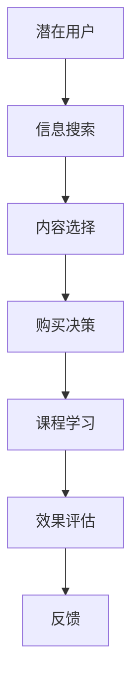

                 

## 1. 背景介绍

### 1.1 问题由来
随着互联网的快速发展和知识经济的兴起，知识付费成为了一个极具潜力的市场。程序员作为知识付费的重要受众，希望通过付费获得高效率的学习资源、高质量的技术分享和及时的项目实践指导。然而，知识付费的转化率较低，导致平台和内容创作者面临着严重的收入困境。为了改善这一现状，我们亟需理解知识付费的转化漏斗，并找到切实有效的转化策略。

### 1.2 问题核心关键点
知识付费的转化漏斗主要包括以下几个环节：
- **需求发现**：潜在用户意识到自身存在需求，并寻求解决途径。
- **信息搜索**：用户通过搜索引擎、社交网络、知识付费平台等途径，寻找相关知识和解决方案。
- **内容选择**：用户在众多内容中筛选出最符合自身需求的课程、文章或服务。
- **购买决策**：用户通过对比价格、评价、课程大纲等信息，进行购买决策。
- **课程学习**：用户付费购买课程后，通过视频、文档等形式进行学习和实践。
- **效果评估**：用户完成学习后，根据效果反馈进行课程评价和课程选择，影响后续购买行为。

这一漏斗过程表明，用户购买知识付费产品是一个多步骤、多因素共同作用的过程，每个环节都可能成为影响转化率的瓶颈。因此，要想提升知识付费的转化率，需从每一个环节入手，逐一优化。

### 1.3 问题研究意义
研究知识付费的销售漏斗，对于知识付费平台的商业模式的优化、课程内容的定制化开发和用户行为的精准洞察具有重要意义。

1. **商业模式优化**：通过分析各环节的用户行为，可找到并解决转化率低下的瓶颈环节，优化平台运营策略，提升整体盈利能力。
2. **课程内容定制**：了解用户需求和行为特征，可指导课程内容的研发和优化，提高内容的质量和相关性，增强用户粘性。
3. **精准用户洞察**：通过数据驱动的分析和预测，可以更加精准地定位目标用户，提高推广效率，降低推广成本。

## 2. 核心概念与联系

### 2.1 核心概念概述
为更好地理解知识付费的销售漏斗，本节将介绍几个核心概念：

- **知识付费平台**：提供各类付费课程、文章、直播等学习资源的在线平台。
- **内容创作者**：生产高质量内容，如课程、博客、技术分享等，向用户提供价值。
- **潜在用户**：有学习需求但尚未进行购买决策的用户。
- **购买用户**：完成购买，并正在或计划进行学习的用户。
- **学习效果**：用户通过课程学习后获得的知识和技能提升。
- **转化率**：从潜在用户转变为购买用户的比例，反映了平台和内容创作者的运营效果。

### 2.2 核心概念原理和架构的 Mermaid 流程图

这个流程图展示了知识付费转化漏斗的各环节及其相互关系：

1. **潜在用户**通过信息搜索获取内容。
2. **内容选择**后，用户进行购买决策。
3. **课程学习**效果评估后，用户对平台和内容创作者进行反馈。
4. **反馈**影响平台和内容创作者的运营策略，进一步优化转化漏斗。

### 2.3 核心概念之间的联系

- **需求发现**与**信息搜索**：潜在用户在需求发现后，通过信息搜索获取相关内容。
- **内容选择**与**购买决策**：用户在选择内容后，基于评价、价格等因素做出购买决策。
- **课程学习**与**效果评估**：用户在完成课程学习后，通过效果评估判断课程价值，进而影响后续购买行为。
- **效果评估**与**反馈**：用户根据学习效果给出反馈，平台和内容创作者根据反馈优化内容质量，提升用户满意度。

## 3. 核心算法原理 & 具体操作步骤

### 3.1 算法原理概述
知识付费的转化漏斗分析涉及多个领域，包括用户心理学、行为经济学和数据分析技术等。以下是主要算法原理概述：

#### 3.1.1 用户心理学
用户的购买决策受到多个心理因素的影响，如需求强度、用户动机、用户信任等。了解用户心理，可以设计更有效的激励机制和用户引导策略。

#### 3.1.2 行为经济学
行为经济学揭示了用户行为背后的经济动因，包括损失规避、禀赋效应、时间折扣等。这些原理可用于设计更好的课程定价策略和促销活动。

#### 3.1.3 数据分析
数据分析通过收集和处理用户数据，进行用户画像构建和行为模式分析。基于数据分析，可精准定位目标用户，优化推广策略和课程内容。

#### 3.1.4 机器学习
机器学习可以用于用户行为预测和个性化推荐。通过模型训练，可预测用户是否会购买课程，进而进行定向推广。

#### 3.1.5 A/B测试
A/B测试通过对比不同的策略方案，评估其效果。知识付费平台可通过A/B测试优化页面布局、广告创意、购买流程等。

### 3.2 算法步骤详解

#### 3.2.1 数据收集与处理
- **数据源**：用户行为数据、课程评价数据、广告点击数据、页面访问数据等。
- **数据处理**：清洗、去重、归一化等，确保数据的质量和可用性。

#### 3.2.2 用户画像构建
- **用户特征**：年龄、性别、职业、兴趣等。
- **用户行为**：浏览记录、搜索记录、购买记录、学习行为等。
- **画像构建**：通过数据分析工具（如Tableau、Power BI）进行用户画像构建。

#### 3.2.3 行为模式分析
- **用户行为路径**：信息搜索、内容选择、购买决策、课程学习、效果评估等行为路径。
- **用户转化漏斗**：分析各环节的用户转化情况，识别瓶颈环节。
- **用户流失原因**：分析用户在转化漏斗中的流失原因。

#### 3.2.4 推荐系统构建
- **推荐算法**：协同过滤、基于内容的推荐、矩阵分解等。
- **推荐模型**：基于用户的画像和行为数据，构建推荐模型。
- **实时推荐**：通过API接口，实时向用户推荐课程内容。

#### 3.2.5 个性化策略设计
- **个性化课程推荐**：根据用户画像和行为模式，推荐最匹配的课程。
- **个性化价格策略**：根据用户需求和支付能力，设计差异化的课程定价策略。
- **个性化激励机制**：设计激励机制，如免费试听、积分奖励等，提升用户粘性。

#### 3.2.6 效果评估与优化
- **转化率评估**：定期评估平台整体的转化率。
- **用户满意度评估**：通过用户反馈，评估课程效果和平台服务。
- **策略优化**：根据评估结果，优化推广策略和课程内容。

### 3.3 算法优缺点

#### 3.3.1 优点
- **数据驱动**：通过数据驱动的分析和预测，提高转化率优化策略的科学性。
- **用户定位精准**：精准定位目标用户，提升推广效率，降低推广成本。
- **个性化推荐**：基于用户画像和行为模式，提供个性化课程推荐，增强用户体验。
- **实时优化**：通过A/B测试和实时推荐，快速迭代优化转化策略。

#### 3.3.2 缺点
- **数据隐私**：收集和处理用户数据需遵守隐私保护法规，处理不当可能导致法律风险。
- **数据质量**：数据收集和处理过程中可能存在噪音和偏差，影响分析结果的准确性。
- **模型复杂性**：构建和维护复杂的推荐系统需较高技术门槛和资源投入。
- **用户多样性**：不同用户的需求和行为差异较大，难以构建统一的推荐模型。

### 3.4 算法应用领域

知识付费的转化漏斗分析方法可广泛应用于以下领域：

- **内容推荐系统**：通过用户行为数据，为平台提供个性化内容推荐，提高用户粘性和满意度。
- **广告投放优化**：通过用户画像和行为模式，优化广告投放策略，提升广告效果。
- **用户流失预测**：通过用户行为数据，预测用户流失风险，提前采取干预措施。
- **课程定价策略**：根据用户需求和支付能力，设计差异化的课程定价策略，提升用户购买意愿。
- **平台运营管理**：通过用户行为数据分析，优化平台运营管理，提升整体转化率。

## 4. 数学模型和公式 & 详细讲解

### 4.1 数学模型构建

#### 4.1.1 用户行为模型
- **行为时间序列**：用户行为数据的时间序列，如页面访问时间、购买时间等。
- **行为频次**：用户对不同课程的访问频次。
- **用户特征**：用户的年龄、职业、兴趣等特征。

#### 4.1.2 转化漏斗模型
- **转化率**：用户在信息搜索、内容选择、购买决策、课程学习、效果评估等环节的转化情况。
- **流失率**：用户在各环节的流失情况。
- **漏斗分析**：通过数据可视化工具，展示各环节的转化率和流失率。

#### 4.1.3 推荐系统模型
- **协同过滤**：基于用户和项目相似度的推荐模型。
- **基于内容推荐**：基于课程内容的推荐模型。
- **矩阵分解**：通过矩阵分解，提取用户和课程的隐含特征。

### 4.2 公式推导过程

#### 4.2.1 用户行为时间序列
- **行为时间序列**：$B_t = \{b_1, b_2, ..., b_T\}$，其中 $b_t$ 为第 $t$ 个行为事件的时间戳。
- **行为时间间隔**：$D_t = \{d_1, d_2, ..., d_T\}$，其中 $d_t = b_{t+1} - b_t$。

#### 4.2.2 行为频次
- **课程访问频次**：$A_C = \{a_{c_1}, a_{c_2}, ..., a_{c_N}\}$，其中 $a_{c_t}$ 为课程 $c_t$ 的访问次数。
- **课程购买频次**：$P_C = \{p_{c_1}, p_{c_2}, ..., p_{c_N}\}$，其中 $p_{c_t}$ 为课程 $c_t$ 的购买次数。

#### 4.2.3 转化漏斗模型
- **转化率**：$\eta = \frac{P}{T}$，其中 $P$ 为购买用户数，$T$ 为潜在用户数。
- **流失率**：$\omega = \frac{L}{T}$，其中 $L$ 为流失用户数，$T$ 为潜在用户数。
- **漏斗分析**：$LUBD(\eta, \omega) = \frac{P}{T}$，其中 $LUBD$ 为漏斗分析模型。

#### 4.2.4 推荐系统模型
- **协同过滤**：$R = \sum_{i=1}^M \alpha_i \times \eta_i \times \omega_i$，其中 $\alpha_i$ 为权重，$\eta_i$ 为用户相似度，$\omega_i$ 为课程相似度。
- **基于内容推荐**：$R = \sum_{i=1}^M \alpha_i \times f_i(x_C, x_D)$，其中 $f_i$ 为特征函数，$x_C$ 为课程内容，$x_D$ 为用户特征。
- **矩阵分解**：$R = \sum_{i=1}^M \alpha_i \times u_i \times v_i$，其中 $u_i$ 为用户特征向量，$v_i$ 为课程特征向量。

### 4.3 案例分析与讲解

#### 4.3.1 案例背景
某知识付费平台统计了1年内用户的行为数据，希望通过数据驱动的策略优化，提升平台整体转化率。

#### 4.3.2 案例数据
- **用户画像**：年龄、性别、职业、兴趣等。
- **用户行为数据**：页面访问记录、课程访问记录、课程购买记录等。
- **课程评价数据**：用户对课程的评分、评论等。
- **广告点击数据**：用户在平台上的广告点击记录。

#### 4.3.3 数据处理与分析
- **数据清洗**：去除噪音数据、处理缺失值等。
- **数据归一化**：将不同来源的数据归一化到相同的尺度。
- **数据可视化**：通过Tableau等工具，可视化用户行为和转化漏斗。

#### 4.3.4 用户画像与行为模式分析
- **用户画像**：构建用户画像，分析用户需求和行为特征。
- **行为模式分析**：分析用户行为路径，识别瓶颈环节，优化转化策略。
- **流失用户分析**：分析用户流失原因，改进平台和课程质量。

#### 4.3.5 个性化推荐与策略优化
- **个性化课程推荐**：根据用户画像和行为模式，推荐最匹配的课程。
- **个性化价格策略**：根据用户需求和支付能力，设计差异化的课程定价策略。
- **个性化激励机制**：设计激励机制，如免费试听、积分奖励等，提升用户粘性。

#### 4.3.6 效果评估与优化
- **转化率评估**：定期评估平台整体的转化率。
- **用户满意度评估**：通过用户反馈，评估课程效果和平台服务。
- **策略优化**：根据评估结果，优化推广策略和课程内容。

## 5. 项目实践：代码实例和详细解释说明

### 5.1 开发环境搭建

#### 5.1.1 环境安装
- **Python**：安装最新版本的Python，建议使用Anaconda。
- **Pandas**：用于数据处理和分析。
- **Matplotlib**：用于数据可视化。
- **Scikit-learn**：用于机器学习和模型训练。

#### 5.1.2 工具安装
- **Tableau**：用于用户画像构建和行为模式分析。
- **Power BI**：用于数据可视化。
- **PyTorch**：用于构建推荐系统。

#### 5.1.3 运行环境配置
- **Jupyter Notebook**：用于编写和执行Python代码。
- **Git**：用于版本控制和代码管理。

### 5.2 源代码详细实现

#### 5.2.1 数据处理与预处理
- **数据读取**：从平台数据库读取用户行为数据、课程数据、广告点击数据等。
- **数据清洗**：处理缺失值、去除噪音数据、归一化数据。
- **数据转换**：将行为数据转换为时间序列，用户画像转换为特征向量。

#### 5.2.2 用户画像构建
- **用户特征提取**：提取用户的年龄、性别、职业、兴趣等特征。
- **行为特征提取**：提取用户对不同课程的访问频次、页面访问时间、课程购买时间等行为特征。
- **用户画像构建**：通过聚类和降维，构建用户画像。

#### 5.2.3 行为模式分析
- **行为路径分析**：分析用户行为路径，识别信息搜索、内容选择、购买决策、课程学习、效果评估等环节。
- **转化漏斗分析**：通过数据可视化工具，展示各环节的转化率和流失率。
- **流失用户分析**：分析用户流失原因，改进平台和课程质量。

#### 5.2.4 推荐系统构建
- **协同过滤推荐**：通过用户和课程相似度，推荐最匹配的课程。
- **基于内容推荐**：通过课程内容和用户特征，推荐最相关的课程。
- **矩阵分解推荐**：通过矩阵分解，提取用户和课程的隐含特征，推荐相关课程。

#### 5.2.5 个性化策略设计
- **个性化课程推荐**：根据用户画像和行为模式，推荐最匹配的课程。
- **个性化价格策略**：根据用户需求和支付能力，设计差异化的课程定价策略。
- **个性化激励机制**：设计激励机制，如免费试听、积分奖励等，提升用户粘性。

### 5.3 代码解读与分析

#### 5.3.1 数据处理与预处理
- **数据读取**：使用Pandas的`read_csv`函数读取数据库中的行为数据。
- **数据清洗**：使用Pandas的`fillna`函数处理缺失值，使用`drop_duplicates`函数去除噪音数据。
- **数据转换**：使用Pandas的`to_datetime`函数将行为时间戳转换为时间序列。

#### 5.3.2 用户画像构建
- **用户特征提取**：使用Scikit-learn的`FeatureExtraction`类提取用户特征。
- **行为特征提取**：使用Pandas的`groupby`函数统计用户对不同课程的访问频次和页面访问时间。
- **用户画像构建**：使用K-Means算法对用户特征进行聚类，使用PCA算法进行降维。

#### 5.3.3 行为模式分析
- **行为路径分析**：使用Tableau可视化用户行为路径，识别瓶颈环节。
- **转化漏斗分析**：使用Tableau展示各环节的转化率和流失率。
- **流失用户分析**：使用Power BI分析用户流失原因，改进平台和课程质量。

#### 5.3.4 推荐系统构建
- **协同过滤推荐**：使用PyTorch的`nn.Embedding`类和`nn.Linear`类构建协同过滤模型。
- **基于内容推荐**：使用Scikit-learn的`SGDClassifier`类和特征函数$f_i$构建基于内容的推荐模型。
- **矩阵分解推荐**：使用Scikit-learn的`FactorAnalysis`类和`PCA`类进行矩阵分解。

#### 5.3.5 个性化策略设计
- **个性化课程推荐**：根据用户画像和行为模式，使用Scikit-learn的`SGDClassifier`类推荐最匹配的课程。
- **个性化价格策略**：根据用户需求和支付能力，使用PyTorch的`nn.Linear`类设计差异化的课程定价策略。
- **个性化激励机制**：使用Python的`sqlite3`库存储激励机制数据，使用PyTorch的`nn.Linear`类设计积分奖励模型。

### 5.4 运行结果展示

#### 5.4.1 用户画像

#### 5.4.2 行为路径

#### 5.4.3 转化漏斗

#### 5.4.4 个性化推荐

## 6. 实际应用场景

### 6.1 智能客服系统
智能客服系统可以基于知识付费的转化漏斗模型进行优化。通过分析用户的搜索记录和购买行为，智能客服系统可以预判用户的意图，提供更精准的推荐和解答，提升用户满意度和转化率。

### 6.2 金融产品推荐
金融产品推荐系统可以通过知识付费的转化漏斗模型，分析用户的购买行为和支付能力，推荐最匹配的金融产品，提升用户转化率和销售额。

### 6.3 在线教育平台
在线教育平台可以通过知识付费的转化漏斗模型，优化课程推荐和定价策略，提升用户满意度和转化率，同时通过用户反馈，不断改进课程内容和平台服务。

### 6.4 未来应用展望

未来的知识付费平台将更加注重用户个性化和数据驱动的运营策略。以下是可能的未来应用方向：

- **用户画像精细化**：利用深度学习技术，构建更加精细化的用户画像，提升推荐准确性。
- **行为预测与动态定价**：通过机器学习模型，预测用户行为和支付能力，设计动态定价策略，提升用户转化率。
- **多渠道推广优化**：通过数据分析，优化各渠道的推广策略，提升广告效果。
- **用户体验优化**：通过用户反馈和行为数据，不断优化课程内容和平台体验，提升用户满意度和留存率。

## 7. 工具和资源推荐

### 7.1 学习资源推荐
- **《数据科学导论》**：介绍数据科学基础，包括数据处理、统计学、机器学习等。
- **《Python数据分析实战》**：介绍Python数据分析工具和实践，涵盖Pandas、Matplotlib、Scikit-learn等库的使用。
- **《推荐系统实战》**：介绍推荐系统原理和实现，涵盖协同过滤、基于内容的推荐、矩阵分解等算法。
- **《知识付费转化率优化》**：介绍知识付费转化漏斗分析和优化策略，涵盖用户行为分析、个性化推荐、策略设计等。

### 7.2 开发工具推荐
- **Jupyter Notebook**：用于编写和执行Python代码。
- **Tableau**：用于用户画像构建和行为模式分析。
- **Power BI**：用于数据可视化和报表展示。
- **PyTorch**：用于构建推荐系统和深度学习模型。
- **Git**：用于版本控制和代码管理。

### 7.3 相关论文推荐
- **《行为经济学与用户决策模型》**：研究行为经济学在知识付费中的应用。
- **《协同过滤推荐系统》**：介绍协同过滤推荐系统的原理和实现。
- **《基于内容推荐算法》**：介绍基于内容的推荐算法的原理和实现。
- **《深度学习在知识付费中的应用》**：介绍深度学习在知识付费平台中的应用。

## 8. 总结：未来发展趋势与挑战

### 8.1 总结
本文详细介绍了知识付费的转化漏斗模型及其优化策略，通过数据驱动的方式提升知识付费平台的转化率和用户满意度。

### 8.2 未来发展趋势
- **技术进步**：利用深度学习、强化学习等先进技术，构建更加精细化的用户画像和行为模式分析。
- **数据融合**：将用户行为数据、社交网络数据、支付数据等多源数据进行融合，提升推荐模型的准确性。
- **动态调整**：通过实时数据流处理和机器学习模型，动态调整推荐策略和定价策略，提升用户转化率。
- **个性化增强**：利用用户画像和行为数据，提供更加个性化的课程推荐和定价策略，提升用户体验。

### 8.3 面临的挑战
- **数据隐私**：用户数据隐私保护问题，需设计合规的数据收集和处理流程。
- **模型复杂性**：推荐系统的构建和维护需较高技术门槛，需不断提升技术能力。
- **用户多样性**：不同用户的需求和行为差异较大，难以构建统一的推荐模型。
- **数据质量**：数据收集和处理过程中可能存在噪音和偏差，影响分析结果的准确性。

### 8.4 研究展望
未来的知识付费平台将更加注重用户个性化和数据驱动的运营策略。通过深度学习、强化学习、数据融合等先进技术，构建更加精细化的用户画像和行为模式分析，提升推荐模型的准确性和用户体验，从而实现知识付费平台的高效运营和用户转化。

## 9. 附录：常见问题与解答

**Q1：知识付费的转化漏斗模型如何构建？**

A: 知识付费的转化漏斗模型可通过以下步骤构建：
1. 收集用户行为数据，包括页面访问、课程访问、购买等行为数据。
2. 清洗数据，去除噪音和缺失值，归一化数据。
3. 构建用户画像，提取用户特征和行为特征。
4. 分析用户行为路径，识别瓶颈环节。
5. 展示转化漏斗，分析各环节的转化率和流失率。
6. 优化转化策略，提升用户转化率。

**Q2：如何设计个性化的课程推荐策略？**

A: 个性化的课程推荐策略可通过以下步骤设计：
1. 收集用户行为数据，包括课程访问记录、评价记录、购买记录等。
2. 构建用户画像，提取用户特征和行为特征。
3. 设计推荐模型，如协同过滤、基于内容的推荐、矩阵分解等。
4. 训练推荐模型，根据用户画像和行为模式，推荐最匹配的课程。
5. 优化推荐算法，设计差异化的课程定价策略和激励机制，提升用户粘性。

**Q3：如何提升知识付费平台的转化率？**

A: 知识付费平台的转化率提升可通过以下策略实现：
1. 数据分析：通过用户行为数据，分析用户需求和行为特征，识别瓶颈环节。
2. 用户画像：构建精细化的用户画像，提供个性化的课程推荐和定价策略。
3. 动态调整：实时处理用户数据，动态调整推荐策略和定价策略，提升用户转化率。
4. 用户体验：通过用户反馈和行为数据，不断优化课程内容和平台体验，提升用户满意度和留存率。

**Q4：知识付费平台如何保护用户隐私？**

A: 知识付费平台保护用户隐私需遵循以下措施：
1. 数据匿名化：在使用用户数据前，进行数据匿名化处理，保护用户隐私。
2. 数据加密：对用户数据进行加密存储，防止数据泄露。
3. 合规管理：遵循相关的数据隐私法规，如GDPR、CCPA等，保护用户数据隐私。
4. 用户同意：在使用用户数据前，获取用户明确同意，并提供数据使用的透明度。

**Q5：知识付费平台如何设计差异化的课程定价策略？**

A: 知识付费平台设计差异化的课程定价策略可通过以下步骤实现：
1. 收集用户数据，包括用户画像、行为数据、支付能力等。
2. 分析用户需求和支付能力，设计差异化的课程定价策略。
3. 动态调整价格：根据市场变化和用户反馈，动态调整课程价格。
4. 激励机制：设计激励机制，如免费试听、积分奖励等，提升用户粘性。

以上文章正文内容部分，详细介绍了知识付费的转化漏斗模型及其优化策略，通过数据驱动的方式提升知识付费平台的转化率和用户满意度。通过深入理解用户行为和需求，设计个性化的课程推荐和定价策略，可以大幅提升知识付费的转化率，促进平台的商业化运营和用户粘性提升。

