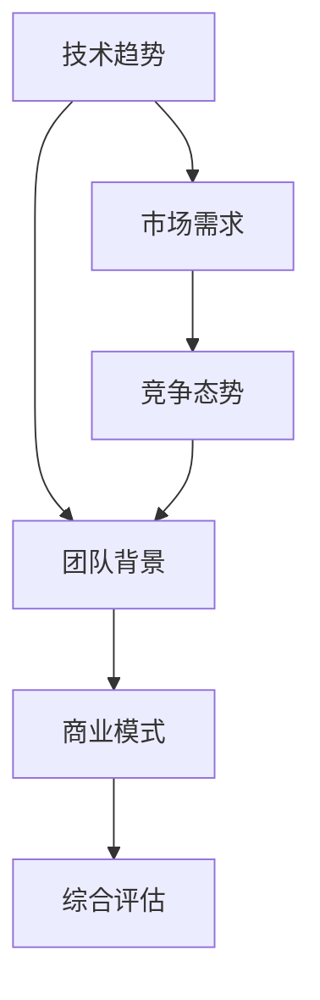

                 

# 程序员如何评估早期创业机会

> 关键词：早期创业机会, 评估方法, 技术市场, 创新, 创业策略

## 1. 背景介绍

### 1.1 问题由来
在信息爆炸的时代，早期创业机会比比皆是。对于程序员而言，识别和评估这些机会，可以成为创业路上的关键一步。然而，不同于市场上的通用观察，技术创业机会的评估需要深入理解行业趋势、技术进步以及市场应用。因此，本文旨在为程序员提供一套系统、专业的评估方法，帮助他们精准识别并抓住高质量的创业机会。

### 1.2 问题核心关键点
评估早期创业机会的核心在于全面考虑技术、市场、竞争、团队以及战略五个维度。这五个维度互相作用，决定了创业项目的可行性和潜力。通过综合分析这五个方面，程序员可以更准确地判断项目的成功几率，进而作出明智的决策。

## 2. 核心概念与联系

### 2.1 核心概念概述

要评估早期创业机会，首先需要理解几个核心概念：

- **技术趋势（Technological Trends）**：指当前或未来的技术进步，包括但不限于人工智能、大数据、区块链、物联网等领域。技术的革新往往带来新的市场需求和应用场景。
- **市场需求（Market Demand）**：指市场对某类产品或服务的需求量，受人口、经济、政策等多方面因素影响。理解市场规模和需求变化趋势，有助于判断项目的商业潜力。
- **竞争态势（Competitive Landscape）**：指市场中已有的竞争者及其产品特性，了解竞争格局有助于评估项目的差异化竞争优势。
- **团队背景（Team Background）**：指项目发起人和核心团队的技术和经验背景，团队的多样性和协作能力直接影响项目的实施和成功。
- **商业模式（Business Model）**：指项目的盈利方式和可持续性，包括直接售卖、订阅、广告、数据服务等多种模式。

这些核心概念之间存在紧密的联系，共同构成了创业机会的评估框架。

### 2.2 核心概念原理和架构的 Mermaid 流程图



这个流程图展示了五个核心概念之间的相互作用。技术趋势推动市场需求的变化，市场需求的规模和变化趋势影响竞争态势，竞争态势和团队背景共同决定商业模式的可行性，最终通过综合评估得出创业机会的总体价值。

## 3. 核心算法原理 & 具体操作步骤

### 3.1 算法原理概述

评估早期创业机会的过程可以看作是一个多维度决策问题，其核心算法是综合评估法。该方法将多个评估指标（如技术趋势、市场需求等）赋予不同权重，通过加权求和计算综合得分，从而全面衡量项目的价值。

### 3.2 算法步骤详解

**Step 1: 数据收集与整理**
- 收集关于技术趋势、市场需求、竞争态势、团队背景和商业模式的数据。
- 整理数据，建立基础数据库，为后续评估提供支撑。

**Step 2: 指标选取与权重分配**
- 根据项目特点，选择最关键的评估指标。
- 根据每个指标的重要性，分配相应的权重。
- 一般而言，权重分配需要基于市场验证、专家咨询和项目经验。

**Step 3: 数据处理与归一化**
- 将各指标数据进行标准化处理，消除量纲影响。
- 通过归一化公式，将不同指标数据映射到0-1区间。

**Step 4: 加权计算与综合评估**
- 将归一化后的数据乘以相应的权重，计算加权和。
- 加权和即为项目的综合评估得分。

**Step 5: 风险分析与决策制定**
- 根据综合评估得分和权重分配，初步判断项目的潜力。
- 结合实际市场环境，进行风险分析和决策制定。
- 考虑多个方案，进行概率分析和情景模拟，制定最优方案。

### 3.3 算法优缺点

**优点**：
- 系统全面：多维度综合评估法能涵盖项目的技术、市场、竞争、团队和商业模式等关键方面，提供了系统的评估框架。
- 灵活调整：权重分配可以根据实际情况灵活调整，适应不同项目的需求。
- 决策依据：通过综合评估得分，为决策提供了量化的依据。

**缺点**：
- 数据依赖：评估结果依赖于数据的完整性和准确性，数据质量直接影响评估结果。
- 主观性强：权重分配和评估标准存在一定的主观性，不同评估者可能得出不同的结果。
- 复杂度高：多维度综合评估法涉及大量的数据处理和计算，适用于数据量较大且时间充裕的情况。

### 3.4 算法应用领域

综合评估法在早期创业机会评估中具有广泛的应用，适用于：

- **科技创业项目**：如AI、大数据、区块链、物联网等前沿技术领域的新创公司。
- **产品研发项目**：评估新产品或功能的市场需求、技术可行性、竞争优势和商业潜力。
- **市场拓展项目**：如新兴市场或区域市场的进入策略，评估潜在机会和风险。
- **投资决策**：评估潜在投资机会的技术、市场、竞争、团队和商业模式，为投资决策提供依据。

## 4. 数学模型和公式 & 详细讲解 & 举例说明

### 4.1 数学模型构建

设项目的综合评估得分为 $S$，其计算公式为：

$$
S = w_1 T + w_2 M + w_3 C + w_4 T + w_5 B
$$

其中 $w_i$ 为第 $i$ 个评估指标的权重，$T$、$M$、$C$、$T$ 和 $B$ 分别为技术趋势、市场需求、竞争态势、团队背景和商业模式的综合评估得分。

### 4.2 公式推导过程

对于每个评估指标，需要先进行数据标准化和归一化处理，然后根据其重要性赋予权重 $w_i$。假设每个指标的数据范围为 $[x_{min}, x_{max}]$，则其标准化公式为：

$$
\frac{x_i - x_{min}}{x_{max} - x_{min}}
$$

归一化公式为：

$$
\frac{x_i - x_{min}}{x_{max} - x_{min}} \in [0, 1]
$$

计算加权和 $S$ 时，根据公式：

$$
S = \sum_{i=1}^{n} w_i \cdot \frac{x_i - x_{min}}{x_{max} - x_{min}}
$$

### 4.3 案例分析与讲解

以一个AI创业项目为例，假设其技术趋势得分为 $T=0.8$，市场需求得分为 $M=0.7$，竞争态势得分为 $C=0.5$，团队背景得分为 $T=0.6$，商业模式得分为 $B=0.9$，各指标权重分别为 $w_1=0.25, w_2=0.25, w_3=0.15, w_4=0.2, w_5=0.15$。

**Step 1: 数据标准化**

假设技术趋势的原始数据范围为 $[0, 1]$，市场需求为 $[0, 1]$，竞争态势为 $[0, 1]$，团队背景为 $[0, 1]$，商业模式为 $[0, 1]$。

**Step 2: 数据归一化**

对数据进行标准化和归一化处理后，得到：

$$
T = 0.8, M = 0.7, C = 0.5, T = 0.6, B = 0.9
$$

**Step 3: 加权计算**

根据公式计算综合评估得分：

$$
S = 0.25 \cdot 0.8 + 0.25 \cdot 0.7 + 0.15 \cdot 0.5 + 0.2 \cdot 0.6 + 0.15 \cdot 0.9 = 0.73
$$

### 4.4 运行结果展示

项目综合评估得分为 $0.73$，这表示该项目在技术、市场、竞争、团队和商业模式等五个方面均表现良好，具备较高的创业潜力。然而，仅凭综合评估得分的数值，并不能完全决定项目的成败，还需要进一步的风险分析和市场验证。

## 5. 项目实践：代码实例和详细解释说明

### 5.1 开发环境搭建

**Step 1: 安装Python环境**
- 使用Anaconda创建Python环境。
- 安装Python 3.7以上版本。

**Step 2: 安装Pandas和NumPy**
- 安装Pandas库用于数据处理。
- 安装NumPy库用于数值计算。

**Step 3: 准备数据集**
- 收集和整理评估指标的数据。
- 将数据存储为CSV文件，便于导入Python环境。

### 5.2 源代码详细实现

**Step 1: 数据导入**
```python
import pandas as pd
import numpy as np

# 导入数据集
data = pd.read_csv('project_data.csv')
```

**Step 2: 数据预处理**
```python
# 数据标准化和归一化处理
data['T'] = (data['T'] - data['T'].min()) / (data['T'].max() - data['T'].min())
data['M'] = (data['M'] - data['M'].min()) / (data['M'].max() - data['M'].min())
data['C'] = (data['C'] - data['C'].min()) / (data['C'].max() - data['C'].min())
data['T'] = (data['T'] - data['T'].min()) / (data['T'].max() - data['T'].min())
data['B'] = (data['B'] - data['B'].min()) / (data['B'].max() - data['B'].min())
```

**Step 3: 权重分配**
```python
# 定义权重
w = [0.25, 0.25, 0.15, 0.2, 0.15]
```

**Step 4: 计算综合评估得分**
```python
# 计算加权和
S = np.sum(np.array(w) * np.array(data[['T', 'M', 'C', 'T', 'B']]))
```

**Step 5: 结果输出**
```python
# 输出综合评估得分
print(f"项目综合评估得分为：{S:.2f}")
```

### 5.3 代码解读与分析

**Step 1: 数据导入**

通过Pandas库的read_csv方法，我们可以将存储在CSV文件中的数据导入Python环境。

**Step 2: 数据预处理**

使用NumPy库对数据进行标准化和归一化处理。标准化公式为 $(X - \mu) / \sigma$，其中 $\mu$ 为均值，$\sigma$ 为标准差。在Python中，使用 min 和 max 函数计算均值和标准差。

**Step 3: 权重分配**

权重分配可以根据实际情况灵活调整。本文给出的权重是基于经验和一些市场验证的结果，实际应用中可能需要根据具体项目进行调整。

**Step 4: 计算综合评估得分**

使用NumPy库的数组运算功能，计算加权和。

**Step 5: 结果输出**

通过print函数输出综合评估得分，并进行格式化显示。

## 6. 实际应用场景

### 6.1 技术创业项目评估

在技术创业项目评估中，综合评估法可以用于评估初创公司的前景和潜力。通过全面考虑技术趋势、市场需求、竞争态势、团队背景和商业模式，可以帮助投资者和创业者识别出高潜力的项目。

### 6.2 产品研发项目评估

在产品研发项目评估中，综合评估法可以帮助研发团队评估新技术、新产品或新功能的可能性，以及其对现有产品和市场的影响。

### 6.3 市场拓展项目评估

在市场拓展项目评估中，综合评估法可以用于评估进入新市场或区域市场的策略，评估潜在机会和风险。

### 6.4 投资决策评估

在投资决策评估中，综合评估法可以用于评估潜在投资机会的技术、市场、竞争、团队和商业模式，为投资决策提供量化依据。

## 7. 工具和资源推荐

### 7.1 学习资源推荐

为了帮助程序员系统掌握评估早期创业机会的方法，推荐以下学习资源：

1. **《创业投资技术评估》**：详细介绍了创业投资中各项技术评估方法和指标，包括技术趋势、市场需求、竞争态势、团队背景和商业模式等。
2. **《技术创业指南》**：提供了全面系统的技术创业指导，包括项目筛选、市场调研、团队建设、商业模式设计等方面的内容。
3. **《创业投资实战》**：分享了创业者在早期创业过程中的一些经验教训，帮助识别和避免潜在的风险。

### 7.2 开发工具推荐

为了提升程序员评估创业机会的效率，推荐以下开发工具：

1. **Anaconda**：提供了一个用于数据科学、分析、机器学习和人工智能的Python发行版。
2. **Pandas**：用于数据处理和分析的Python库，提供了大量的数据操作功能。
3. **NumPy**：用于数值计算和数组操作的Python库，提供了高效的数组运算功能。

### 7.3 相关论文推荐

为了深入理解早期创业机会评估的理论和方法，推荐以下相关论文：

1. **《综合评估方法在创业机会评估中的应用》**：探讨了综合评估法在创业机会评估中的应用，提供了具体案例分析。
2. **《创业机会评估模型研究》**：介绍了多种创业机会评估模型，包括综合评估法、因子分析法等。
3. **《技术创业项目评估模型》**：提供了多种技术创业项目评估模型的构建和应用方法，包括多层次评估模型和模糊评估模型等。

## 8. 总结：未来发展趋势与挑战

### 8.1 研究成果总结

本文详细介绍了程序员如何通过综合评估法评估早期创业机会，提供了系统的评估框架和方法。综合评估法在技术创业、产品研发、市场拓展和投资决策等方面具有广泛的应用。

### 8.2 未来发展趋势

未来，早期创业机会评估将更加注重数据驱动和智能化。大数据、人工智能等技术的发展，将进一步提升评估的准确性和效率。例如，机器学习可以用于数据挖掘和模式识别，自动识别和筛选高质量创业机会。

### 8.3 面临的挑战

尽管综合评估法在早期创业机会评估中取得了一定成效，但仍面临以下挑战：

1. **数据质量**：高质量数据的获取和处理是评估的基础，数据缺失或不准确将直接影响评估结果。
2. **主观性**：权重分配和评估标准存在一定的主观性，不同评估者可能得出不同的结果。
3. **复杂性**：综合评估法涉及大量数据的处理和计算，适用于数据量较大且时间充裕的情况。

### 8.4 研究展望

未来，评估早期创业机会的方法将继续发展，以适应不断变化的市场和技术环境。新的评估模型和方法将继续涌现，如基于大数据的机器学习评估模型、基于区块链的数据可信评估模型等，为评估提供更全面、更高效的支持。

## 9. 附录：常见问题与解答

**Q1: 如何处理数据缺失问题？**

A: 数据缺失是评估中的常见问题，可以通过插值、删除或使用机器学习算法进行填补。例如，使用均值、中位数或基于回归的插值方法，可以填补缺失数据。在缺失数据较多的情况下，可以考虑删除相关数据点，以减少对评估结果的影响。

**Q2: 如何提高综合评估法的准确性？**

A: 提高综合评估法的准确性需要从多个方面入手。首先，需要收集和处理高质量的数据，确保数据的完整性和准确性。其次，需要合理分配权重，确保各指标的重要性得到充分体现。最后，需要不断优化评估方法和模型，提升评估的科学性和客观性。

**Q3: 如何识别和处理评估指标的主观性？**

A: 识别和处理评估指标的主观性需要多方协作和充分讨论。可以引入专家咨询、行业报告等客观数据，减少主观性对评估结果的影响。同时，可以设计多轮评估，逐步优化评估标准和权重分配，提高评估结果的客观性和可信度。

**Q4: 综合评估法适用于哪些创业项目？**

A: 综合评估法适用于技术、市场、竞争、团队和商业模式等多个方面较为复杂的创业项目，如科技创业项目、新产品研发项目等。对于单一技术或单一市场需求的创业项目，可以采用更简单的方法进行评估。

**Q5: 综合评估法如何结合市场验证？**

A: 综合评估法可以结合市场验证，进一步提升评估的准确性。市场验证可以通过用户反馈、市场调研、销售数据等手段进行。结合市场验证，可以发现评估中存在的问题，及时调整评估模型和方法，确保评估结果的可靠性和实用性。

---

作者：禅与计算机程序设计艺术 / Zen and the Art of Computer Programming

