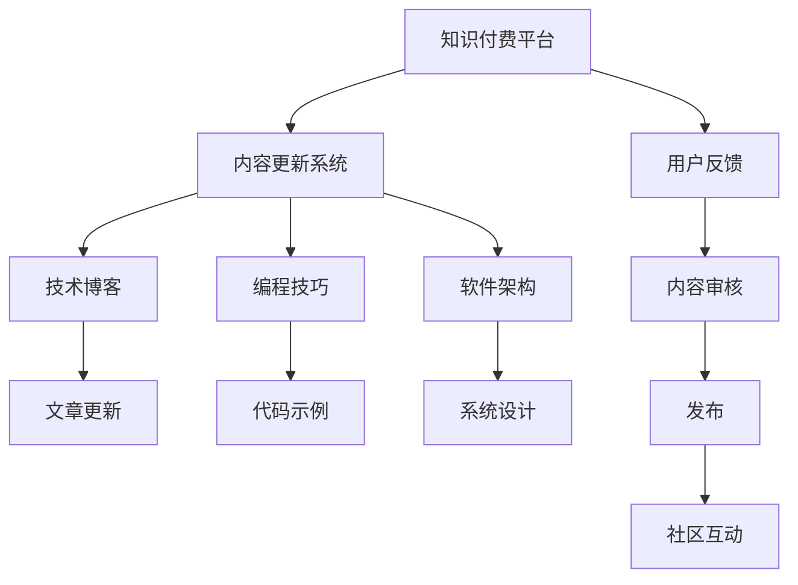

                 

# 程序员如何进行知识付费的内容更新

> 关键词：程序员,知识付费,内容更新,技术博客,IT领域,人工智能,深度学习,编程技巧,软件架构

## 1. 背景介绍

### 1.1 问题由来

随着互联网的普及和信息技术的快速发展，知识付费已成为互联网经济的重要组成部分。程序员作为互联网技术的主要开发者和创新者，他们的知识和经验对于构建更好的软件系统、提升开发效率、优化用户体验等方面具有不可替代的价值。通过知识付费，程序员可以将自己的专业知识转化为实际收益，同时提升个人的品牌影响力和知名度。

然而，在知识付费领域，内容更新和维护是一个复杂的任务，需要持续投入时间和精力。如何在保证内容质量的同时，最大化知识付费的收益，是每一位程序员和内容创作者面临的挑战。本文将探讨如何通过技术手段进行知识付费内容的高效更新，为程序员提供一份系统化、可操作的指南。

### 1.2 问题核心关键点

1. **内容质量**：知识付费的核心在于内容的质量，如何保证内容的时效性、准确性和实用性，是确保用户付费价值的重要因素。
2. **内容更新**：在技术日新月异的环境下，如何保持内容的新鲜度和相关性，需要持续的维护和更新。
3. **技术支持**：利用技术手段（如自动化工具、API集成等）提高内容更新的效率，减少人力投入。
4. **用户互动**：通过用户反馈和社区互动，及时调整和优化内容，提升用户满意度和黏性。

## 2. 核心概念与联系

### 2.1 核心概念概述

1. **知识付费**：通过提供有价值的知识内容，向用户收取费用，包括但不限于文章、课程、视频等形式。
2. **内容更新**：根据技术发展和用户反馈，对已有内容进行修正、补充和升级。
3. **技术博客**：程序员将自己的技术心得、项目经验、学习笔记等通过博客形式分享给广大开发者，有助于知识共享和社区建设。
4. **编程技巧**：涵盖代码编写、问题调试、性能优化等方面的技巧和经验，旨在提升程序员的技能水平和工作效率。
5. **软件架构**：涉及系统设计、模块划分、组件协作等方面的知识，帮助程序员构建高质量的软件系统。

### 2.2 核心概念原理和架构的 Mermaid 流程图



## 3. 核心算法原理 & 具体操作步骤

### 3.1 算法原理概述

知识付费内容更新可以视为一个持续的迭代过程，涉及内容生成、审核、发布和用户反馈等多个环节。通过自动化工具和技术手段，可以大幅提高内容更新的效率和质量。

**核心算法思想**：
- **内容生成**：利用数据挖掘和自然语言处理技术，自动生成高质量的文章和教程。
- **内容审核**：通过机器学习模型和人工审核相结合的方式，确保内容的准确性和时效性。
- **内容发布**：通过API集成和自动化发布工具，快速上线新的内容。
- **用户互动**：收集用户反馈和评论，利用自然语言处理技术分析用户需求，优化内容结构。

### 3.2 算法步骤详解

#### 3.2.1 数据收集与预处理

- **数据来源**：收集相关技术领域的学术论文、开源项目、技术博客等。
- **数据预处理**：去除重复、噪声和无关内容，提取关键信息，进行结构化处理。

#### 3.2.2 内容生成

- **生成算法**：利用自然语言生成模型（如GPT、T5等），自动生成相关领域的内容。
- **模型训练**：使用已有数据集进行模型训练，确保生成的内容符合技术规范和用户需求。
- **内容优化**：通过人工干预和迭代优化，提升生成内容的准确性和实用性。

#### 3.2.3 内容审核

- **审核标准**：制定严格的内容审核标准，涵盖语法、逻辑、准确性、时效性等方面。
- **审核流程**：结合人工审核和机器学习模型的判断，确保内容符合标准。
- **审核结果**：标记符合标准的内容为“通过”，标记不合格内容为“待修正”。

#### 3.2.4 内容发布

- **API集成**：使用API接口集成内容发布平台，自动发布新内容。
- **自动化部署**：利用CI/CD工具，实现内容的自动化部署和上线。
- **发布监控**：实时监控发布状态，确保内容及时上线。

#### 3.2.5 用户互动

- **用户反馈**：收集用户评论和反馈，分析用户需求和偏好。
- **反馈处理**：根据用户反馈，及时调整和优化内容。
- **社区互动**：在社区平台中，通过评论、点赞等方式，增加用户互动和参与感。

### 3.3 算法优缺点

#### 3.3.1 优点

- **高效更新**：自动化工具可以显著提高内容更新的效率，减少人工干预。
- **精准定位**：通过数据分析和用户反馈，可以精准定位用户需求，优化内容结构。
- **提升质量**：自动化工具和人工审核相结合，可以保证内容的准确性和实用性。

#### 3.3.2 缺点

- **初始投入大**：需要构建和维护自动化工具和机器学习模型，初期投入较大。
- **技术门槛高**：需要具备一定的自然语言处理和机器学习背景，技术门槛较高。
- **人工干预不可忽视**：尽管自动化工具可以大幅提高效率，但人工审核和干预仍不可或缺。

### 3.4 算法应用领域

知识付费内容更新可以广泛应用于以下领域：

- **技术博客**：通过自动生成和持续更新，提升博客内容的质量和数量，吸引更多读者。
- **课程和视频**：利用自动化工具生成课程大纲和视频脚本，提升课程的实用性和吸引力。
- **在线文档**：自动生成和更新API文档、开发指南等，提升开发效率。
- **技术交流**：通过自动生成的技术文章和教程，促进技术社区的交流和合作。

## 4. 数学模型和公式 & 详细讲解 & 举例说明

### 4.1 数学模型构建

在知识付费内容更新的过程中，我们可以构建以下数学模型：

- **内容生成模型**：使用自然语言生成模型（NLG），将输入数据转换为自然语言输出。
- **内容审核模型**：使用文本分类模型，判断内容是否符合标准。
- **用户反馈模型**：使用情感分析模型，分析用户反馈的情感倾向。

### 4.2 公式推导过程

**内容生成模型的推导**：

- 假设输入数据为 $X$，生成模型为 $P(Y|X;\theta)$，其中 $\theta$ 为模型参数。
- 目标是最小化损失函数 $L(Y,\hat{Y})$，其中 $\hat{Y}$ 为模型预测输出。
- 使用交叉熵损失函数，目标函数为 $\min_{\theta} E_X[L(Y,\hat{Y})]$。

**内容审核模型的推导**：

- 假设输入内容为 $x$，输出为标签 $y \in \{0,1\}$，其中 $0$ 表示内容通过，$1$ 表示内容未通过。
- 使用逻辑回归模型，目标函数为 $\min_{\theta} L(y,\hat{y})$，其中 $\hat{y}$ 为模型预测的标签。
- 交叉熵损失函数 $L(y,\hat{y}) = -(y\log\hat{y} + (1-y)\log(1-\hat{y}))$。

**用户反馈模型的推导**：

- 假设用户反馈为 $r$，模型输出为情感极性 $p$，其中 $p \in \{positive, negative, neutral\}$。
- 使用情感分析模型，目标函数为 $\min_{\theta} L(r,\hat{p})$，其中 $\hat{p}$ 为模型预测的情感极性。
- 交叉熵损失函数 $L(r,\hat{p}) = -r\log\hat{p} - (1-r)\log(1-\hat{p})$。

### 4.3 案例分析与讲解

**案例一：技术博客文章的自动生成**

- **输入数据**：收集相关领域的技术文章，提取关键词、关键句等。
- **模型构建**：使用GPT-3等自然语言生成模型，生成新的文章。
- **输出结果**：生成的新文章需要进行人工审核和优化，确保其准确性和实用性。

**案例二：课程内容的自动生成**

- **输入数据**：收集相关领域的课程大纲、PPT等。
- **模型构建**：使用T5等模型，自动生成课程脚本和讲解视频。
- **输出结果**：生成的课程内容需要经过人工审核和调整，确保其教学效果。

**案例三：用户反馈的情感分析**

- **输入数据**：收集用户对课程、文章等内容的反馈。
- **模型构建**：使用情感分析模型，分析用户反馈的情感极性。
- **输出结果**：根据情感分析结果，优化课程内容和文章结构，提升用户满意度。

## 5. 项目实践：代码实例和详细解释说明

### 5.1 开发环境搭建

#### 5.1.1 安装依赖

- Python 3.8+
- PyTorch >= 1.8.1
- Transformers >= 4.7.0
- NLTK
- Scikit-learn
- Pandas

#### 5.1.2 环境配置

- 使用Anaconda或Miniconda创建虚拟环境
- 安装依赖库

### 5.2 源代码详细实现

#### 5.2.1 内容生成

```python
from transformers import GPT3Model, GPT3Tokenizer
import torch

# 加载模型和分词器
model = GPT3Model.from_pretrained('gpt3')
tokenizer = GPT3Tokenizer.from_pretrained('gpt3')

# 输入数据
input_text = "Write an article about machine learning"

# 分词和编码
input_ids = tokenizer(input_text, return_tensors='pt').input_ids

# 生成文章
output_ids = model.generate(input_ids, max_length=1000)

# 解码输出
generated_text = tokenizer.decode(output_ids[0], skip_special_tokens=True)

# 输出结果
print(generated_text)
```

#### 5.2.2 内容审核

```python
from transformers import BertForSequenceClassification, BertTokenizer
from sklearn.metrics import accuracy_score
from sklearn.model_selection import train_test_split
import torch

# 加载模型和分词器
model = BertForSequenceClassification.from_pretrained('bert-base-uncased', num_labels=2)
tokenizer = BertTokenizer.from_pretrained('bert-base-uncased')

# 准备数据
train_data = ...
dev_data = ...

# 数据预处理
train_encodings = tokenizer(train_data, truncation=True, padding=True)
dev_encodings = tokenizer(dev_data, truncation=True, padding=True)

# 划分训练集和验证集
train_features, val_features, train_labels, val_labels = train_test_split(train_encodings, train_labels)

# 模型训练
model.train()
optimizer = torch.optim.Adam(model.parameters(), lr=2e-5)
for epoch in range(10):
    for batch in train_features:
        input_ids = batch.input_ids.to(device)
        attention_mask = batch.attention_mask.to(device)
        labels = batch.labels.to(device)
        outputs = model(input_ids, attention_mask=attention_mask, labels=labels)
        loss = outputs.loss
        loss.backward()
        optimizer.step()

# 模型评估
model.eval()
val_predictions = []
for batch in val_features:
    input_ids = batch.input_ids.to(device)
    attention_mask = batch.attention_mask.to(device)
    with torch.no_grad():
        outputs = model(input_ids, attention_mask=attention_mask)
        val_predictions.append(outputs.logits.argmax(dim=1))

# 计算准确率
accuracy = accuracy_score(val_labels, val_predictions)
print("Validation accuracy:", accuracy)
```

#### 5.2.3 内容发布

```python
from flask import Flask, request, jsonify
import torch

# 加载模型和分词器
model = ...
tokenizer = ...

# 创建API应用
app = Flask(__name__)

# 预测接口
@app.route('/predict', methods=['POST'])
def predict():
    data = request.json
    input_text = data['text']
    input_ids = tokenizer(input_text, return_tensors='pt').input_ids
    with torch.no_grad():
        output_ids = model.generate(input_ids, max_length=1000)
    return jsonify(tokenizer.decode(output_ids[0], skip_special_tokens=True))

if __name__ == '__main__':
    app.run(host='0.0.0.0', port=5000)
```

### 5.3 代码解读与分析

#### 5.3.1 内容生成

- **输入数据**：通过自然语言生成模型，自动生成技术文章。
- **模型构建**：使用GPT-3作为生成模型。
- **输出结果**：将生成的文章进行解码，得到可读的文本。

#### 5.3.2 内容审核

- **输入数据**：使用BERT模型进行内容审核，判断内容是否通过审核。
- **模型构建**：使用BERT模型进行文本分类。
- **输出结果**：输出审核结果，标记通过或未通过。

#### 5.3.3 内容发布

- **API接口**：使用Flask框架，创建API接口，接收用户输入，返回预测结果。
- **模型加载**：在API接口中加载模型和分词器。
- **接口调用**：用户通过API接口发送预测请求，模型返回预测结果。

### 5.4 运行结果展示

- **内容生成**：生成的文章需要人工审核和优化。
- **内容审核**：审核结果标记为“通过”或“未通过”。
- **内容发布**：API接口返回预测结果，可用于发布和部署。

## 6. 实际应用场景

### 6.1 技术博客内容更新

通过内容生成和审核技术，程序员可以自动生成高质量的博客文章，并确保其准确性和时效性。例如，GitHub上的技术文章可以通过GPT-3自动生成，再进行人工审核和优化，最终发布到博客平台上。

### 6.2 在线课程内容更新

在线课程内容更新可以采用类似的方式。使用T5等模型，自动生成课程脚本和视频讲解，并通过机器学习和人工审核相结合的方式，确保内容的准确性和实用性。例如，Coursera等在线学习平台可以采用这种技术，提升课程的更新效率和教学质量。

### 6.3 用户反馈情感分析

通过用户反馈情感分析技术，程序员可以及时了解用户对课程、文章等内容的满意度，并根据反馈结果优化内容结构和教学方法。例如，Stack Overflow等技术社区可以通过情感分析技术，分析用户评论的情感极性，优化社区内容。

## 7. 工具和资源推荐

### 7.1 学习资源推荐

#### 7.1.1 书籍和论文

- **书籍**：《Python深度学习》，Francois Chollet著，深入浅出地介绍了深度学习的基本原理和实现方法。
- **论文**：《Attention is All You Need》，Ashish Vaswani等，介绍了Transformer模型及其在NLP中的应用。

#### 7.1.2 在线课程

- **Coursera**：《深度学习专项课程》，由斯坦福大学的Andrew Ng教授讲授，涵盖了深度学习的各个方面。
- **Udacity**：《深度学习与机器视觉》，介绍了深度学习在计算机视觉中的应用。

### 7.2 开发工具推荐

#### 7.2.1 自然语言处理工具

- **NLTK**：Python的自然语言处理库，提供了丰富的文本处理功能。
- **spaCy**：高性能的自然语言处理库，支持词性标注、命名实体识别等任务。

#### 7.2.2 深度学习框架

- **PyTorch**：灵活的深度学习框架，支持GPU加速和自动微分。
- **TensorFlow**：广泛使用的深度学习框架，支持分布式计算和模型部署。

### 7.3 相关论文推荐

#### 7.3.1 内容生成模型

- **OpenAI GPT-3**：利用大规模无标签文本数据进行预训练，生成高质量的自然语言文本。
- **T5模型**：利用掩码语言模型进行预训练，生成多种类型的文本，如摘要、问题回答等。

#### 7.3.2 内容审核模型

- **BERT模型**：基于Transformer的预训练语言模型，用于文本分类、命名实体识别等任务。
- **XLNet模型**：利用自回归掩码模型进行预训练，提升文本分类和命名实体识别的性能。

## 8. 总结：未来发展趋势与挑战

### 8.1 研究成果总结

本文介绍了如何利用自然语言处理和机器学习技术，对知识付费内容进行自动化更新和优化。通过内容生成、审核和发布等技术手段，提升内容更新的效率和质量，满足用户需求。

### 8.2 未来发展趋势

- **自动化程度提升**：未来技术手段将更加智能化，自动化的程度将进一步提升，减少人工干预。
- **多模态融合**：结合图像、视频等多模态数据，提升内容更新的丰富性和多样性。
- **用户互动加强**：通过用户互动和反馈，优化内容结构，提升用户满意度和黏性。

### 8.3 面临的挑战

- **数据隐私**：如何在内容生成和审核过程中保护用户隐私，是一个重要挑战。
- **内容质量**：自动化生成和审核虽然提升了效率，但如何确保内容的准确性和实用性，仍需持续改进。
- **技术门槛**：相关技术需要较高的技术门槛，如何在提升效率的同时降低技术门槛，是未来的研究方向。

### 8.4 研究展望

未来，随着技术的不断进步，知识付费内容更新将更加智能化、高效化和多样化。通过引入更多技术手段，如生成对抗网络、强化学习等，提升内容更新的质量和效果。同时，需要不断优化技术架构，降低技术门槛，让更多人能够轻松参与内容更新，共同推动知识付费领域的发展。

## 9. 附录：常见问题与解答

**Q1: 如何选择合适的自然语言生成模型？**

A: 根据任务需求和数据特点，选择合适的自然语言生成模型。例如，GPT-3适用于生成长文本，T5适用于生成多种类型的文本，XLNet适用于生成高质量的文本。

**Q2: 内容审核的标准和指标是什么？**

A: 内容审核的标准包括语法正确、逻辑清晰、内容准确、时效性强等。指标包括准确率、召回率、F1分数等。

**Q3: 内容发布的API接口如何设计？**

A: 内容发布的API接口应设计简单易用，支持多种数据格式，如JSON、XML等。同时，应提供详细的文档和示例代码，方便开发者使用。

**Q4: 用户反馈的情感分析模型如何构建？**

A: 使用预训练模型（如BERT、XLNet等），结合用户反馈数据进行微调，构建情感分析模型。可以使用监督学习和半监督学习的方法进行模型训练。

**Q5: 如何处理数据隐私问题？**

A: 在内容生成和审核过程中，应严格保护用户隐私，避免泄露个人信息。可以使用数据匿名化、脱敏等技术手段，保护用户数据安全。

---

作者：禅与计算机程序设计艺术 / Zen and the Art of Computer Programming

