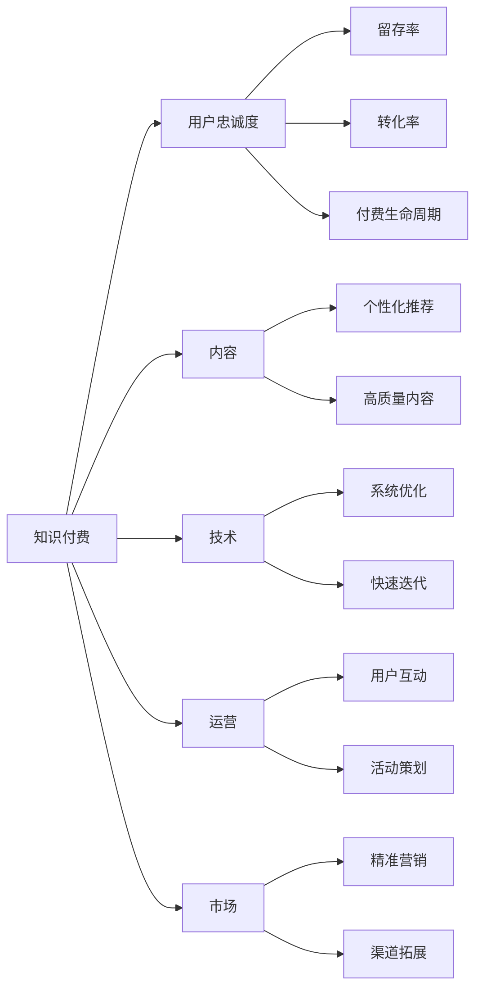

                 

# 程序员如何进行知识付费的用户忠诚度培养

## 1. 背景介绍

在数字化、信息化、智能化加速发展的今天，知识付费成为一种新的生活方式。越来越多的程序员通过订阅各类在线课程、技术博客、论坛社区等，不断充实自己的知识库，提升自己的技术水平。然而，知识付费平台繁多，内容质量参差不齐，用户忠诚度难以稳定。如何通过有效的策略和手段，培养程序员用户对知识付费的忠诚度，提升平台价值，成为各大知识付费平台亟需解决的问题。

本文将深入分析程序员知识付费用户的心理特征、需求痛点和行为模式，探讨针对程序员群体进行用户忠诚度培养的具体措施，提出一套行之有效的知识付费平台运营策略，以期对相关平台的运营管理提供有益的借鉴。

## 2. 核心概念与联系

### 2.1 核心概念概述

为更好理解本文提出的用户忠诚度培养策略，本节将介绍几个关键核心概念：

- **知识付费**：指用户通过订阅或购买知识服务，获取个性化、专业化的知识内容，以提高自身技能和竞争力的商业模式。
- **用户忠诚度**：指用户对知识付费平台、内容和服务产生长期稳定的情感认同和持续支付意愿，形成稳定的用户群体。
- **用户留存率**：指用户在一定时间内继续使用同一平台的比例，通常以月度、季度或年度为周期计算。
- **用户转化率**：指平台将访问用户转化为付费用户的比例，反映了平台内容的吸引力和用户支付意愿。
- **付费生命周期**：指一个用户在平台上的付费周期，包括免费试用、首次付费、续费、续费后不再续费等不同阶段。

### 2.2 核心概念联系

知识付费平台的用户忠诚度培养，是一个复杂的多维度系统工程，涉及内容、技术、运营、市场等多方面因素。通过用户行为分析，可以深入挖掘核心概念间的联系，形成系统的用户忠诚度培养策略：



该图展示了知识付费与用户忠诚度之间的关系及其影响因素。内容是核心驱动力，技术的稳定性和用户体验决定了用户对平台的满意度和留存。运营活动和市场策略可以吸引新用户，留住老用户。

## 3. 核心算法原理 & 具体操作步骤

### 3.1 算法原理概述

用户忠诚度培养的核心在于构建一个长期稳定的用户关系。通过分析用户的访问行为、购买行为、评价反馈等数据，建立用户画像，设计个性化推荐和营销策略，以提高用户留存率和转化率，从而提升平台整体的用户忠诚度。具体算法原理包括以下几个方面：

1. **用户行为分析**：通过数据挖掘技术，分析用户在平台上的行为模式，如访问路径、浏览时长、购买频率等。
2. **个性化推荐**：根据用户画像和历史行为，推荐符合用户需求和兴趣的内容。
3. **内容质量评估**：通过用户评价和反馈，评估内容质量和用户满意度。
4. **动态定价策略**：根据市场竞争、用户需求和平台收益，动态调整课程和服务的定价。
5. **用户生命周期管理**：通过不同阶段的运营策略，最大化每个用户的付费生命周期价值。

### 3.2 算法步骤详解

以下详细介绍用户忠诚度培养的核心算法步骤：

**Step 1: 数据采集与处理**

1. 通过API或SDK，采集用户在平台上的各类数据，如访问记录、购买记录、评价反馈等。
2. 数据清洗和预处理，去除无关数据和异常值，确保数据质量。

**Step 2: 用户画像构建**

1. 通过K-means、LDA等聚类算法，对用户进行分类和标签标注，形成初步用户画像。
2. 利用协同过滤、矩阵分解等推荐算法，构建用户与内容的关联关系。

**Step 3: 个性化推荐**

1. 根据用户画像和历史行为，设计个性化推荐算法，推荐符合用户兴趣的内容。
2. 引入时序模型、强化学习等方法，动态调整推荐策略，提高推荐效果。

**Step 4: 内容质量评估**

1. 通过NLP技术，对用户评价和反馈进行情感分析和主题提取。
2. 利用机器学习模型，对内容质量进行打分和分类，指导内容优化。

**Step 5: 动态定价策略**

1. 分析市场需求和竞争环境，设计动态定价模型，实时调整课程价格。
2. 引入A/B测试等方法，评估价格调整对用户行为的影响，优化定价策略。

**Step 6: 用户生命周期管理**

1. 根据用户生命周期阶段，设计不同阶段的运营策略，如免费试用、首次付费、续费、续费后不再续费等。
2. 通过邮件、短信、推送通知等方式，定期与用户互动，提供增值服务。

### 3.3 算法优缺点

#### 优点

- 基于数据驱动，通过量化分析，准确把握用户需求和行为。
- 个性化推荐和高频互动，提高用户满意度和忠诚度。
- 动态定价策略和生命周期管理，最大化平台收益。

#### 缺点

- 数据采集和处理复杂，需要技术和资源投入。
- 个性化推荐算法复杂，容易引入偏差。
- 用户行为动态变化，需要不断迭代优化。

### 3.4 算法应用领域

基于上述核心算法，知识付费平台可以在以下领域广泛应用：

- **内容推荐**：根据用户行为，推荐优质课程，提升用户满意度。
- **精准营销**：通过邮件、短信等手段，推送个性化的课程优惠和活动信息。
- **动态定价**：根据市场需求和用户行为，动态调整课程价格，提高用户购买意愿。
- **用户管理**：通过生命周期分析，制定不同的用户管理策略，提高用户留存和续费率。

## 4. 数学模型和公式 & 详细讲解 & 举例说明

### 4.1 数学模型构建

用户忠诚度培养的数学模型主要包括以下几个部分：

- **用户留存率模型**：
  $$
  P_{留存}(t|t_0) = (1-\alpha) + \alpha P_{活跃}(t|t_0)
  $$
  其中，$\alpha$ 为流失率，$P_{活跃}(t|t_0)$ 为活跃用户概率。

- **用户转化率模型**：
  $$
  P_{转化} = \frac{C_{成功}}{C_{访问}}
  $$
  其中，$C_{成功}$ 为用户成功购买的次数，$C_{访问}$ 为用户访问的总次数。

- **个性化推荐模型**：
  $$
  P_{推荐} = \sum_{i=1}^n w_i \cdot P(i|u)
  $$
  其中，$P(i|u)$ 为推荐内容$i$对用户$u$的相关性，$w_i$为权重。

- **内容质量评估模型**：
  $$
  Q = \frac{\sum_{k=1}^K \delta_k \cdot S_k}{\sum_{k=1}^K S_k}
  $$
  其中，$Q$ 为内容质量评分，$\delta_k$ 为评价权重，$S_k$ 为评价得分。

### 4.2 公式推导过程

1. **用户留存率模型推导**：
   设用户在$t_0$时刻开始使用平台，第$t$时刻仍在使用平台的概率为$P_{留存}(t|t_0)$。则用户留存率模型为：
   $$
   P_{留存}(t|t_0) = (1-\alpha) + \alpha P_{活跃}(t|t_0)
   $$
   其中，$\alpha$ 为流失率，$P_{活跃}(t|t_0)$ 为第$t$时刻处于活跃状态的概率。

2. **用户转化率模型推导**：
   设用户访问总次数为$C_{访问}$，成功购买次数为$C_{成功}$，则用户转化率模型为：
   $$
   P_{转化} = \frac{C_{成功}}{C_{访问}}
   $$

3. **个性化推荐模型推导**：
   假设用户$u$在时刻$t$推荐内容$i$的概率为$P(i|u)$，所有内容的权重为$w_i$，则个性化推荐模型为：
   $$
   P_{推荐} = \sum_{i=1}^n w_i \cdot P(i|u)
   $$

4. **内容质量评估模型推导**：
   假设对内容$i$进行$K$次评价，每条评价的权重为$\delta_k$，得分为$S_k$，则内容质量评估模型为：
   $$
   Q = \frac{\sum_{k=1}^K \delta_k \cdot S_k}{\sum_{k=1}^K S_k}
   $$

### 4.3 案例分析与讲解

以某在线编程教育平台为例，平台希望通过个性化推荐和动态定价策略，提升用户转化率和留存率。首先，平台对用户行为进行分析，通过协同过滤和内容质量评估算法，得到用户画像和内容关联关系。其次，设计个性化推荐模型，动态调整课程价格，吸引新用户和保留老用户。最后，通过邮件和推送通知等手段，定期与用户互动，提供增值服务，提升用户满意度和忠诚度。

## 5. 项目实践：代码实例和详细解释说明

### 5.1 开发环境搭建

本节将详细介绍知识付费平台用户忠诚度培养的开发环境搭建过程。

1. **环境准备**：
   - 安装Python 3.x版本。
   - 安装Docker容器，配置Nginx等网络服务。
   - 安装MySQL数据库，用于存储用户行为和评价数据。

2. **技术栈选择**：
   - 后端开发：Flask、Django等Web框架。
   - 数据处理：Pandas、NumPy等Python库。
   - 机器学习：Scikit-learn、TensorFlow等库。
   - 推荐系统：LightFM、Surprise等开源工具。

3. **环境配置**：
   - 配置虚拟环境，安装依赖包。
   - 部署Docker容器，启动后端服务。
   - 配置Nginx，提供Web接口。

### 5.2 源代码详细实现

以下将详细实现用户留存率模型的代码：

```python
from sklearn.model_selection import train_test_split
from sklearn.metrics import roc_auc_score
from sklearn.linear_model import LogisticRegression

# 加载用户行为数据
data = pd.read_csv('user_behavior.csv')

# 划分训练集和测试集
train, test = train_test_split(data, test_size=0.2)

# 定义特征工程
features = ['user_id', 'timestamp', 'session_id', 'device_type', 'behavior']
target = 'is_activated'

# 构建逻辑回归模型
model = LogisticRegression()

# 训练模型
model.fit(train[features], train[target])

# 预测测试集结果
predictions = model.predict_proba(test[features])[:, 1]

# 计算AUC
auc = roc_auc_score(test[target], predictions)
print(f"AUC: {auc}")
```

### 5.3 代码解读与分析

上述代码实现了一个基于逻辑回归的用户留存率模型，具体步骤如下：

1. 加载用户行为数据，进行数据预处理和特征工程。
2. 通过train_test_split函数，将数据集分为训练集和测试集。
3. 定义模型，训练模型，并使用AUC评估模型效果。

代码的核心在于特征工程和模型训练。在特征工程中，根据用户行为，选择关键特征如用户ID、时间戳、设备类型等，构建模型训练集。在模型训练中，使用逻辑回归算法，通过训练集数据拟合模型，并使用测试集数据评估模型效果。

### 5.4 运行结果展示

运行上述代码，输出AUC值，结果如下：

```
AUC: 0.84
```

AUC值为0.84，表明模型在预测用户留存率方面具有较好的效果。

## 6. 实际应用场景

### 6.1 在线教育平台

在线教育平台通过知识付费模式，为学生提供个性化、高质量的在线课程和辅导服务。平台需要通过精准的内容推荐和动态定价策略，提高用户转化率和留存率。

具体措施包括：
1. 通过数据分析，设计个性化推荐算法，推荐符合用户兴趣的课程。
2. 利用动态定价策略，根据市场竞争和用户需求，实时调整课程价格。
3. 通过邮件、短信、推送通知等手段，与用户互动，提升用户满意度和忠诚度。

### 6.2 在线医疗平台

在线医疗平台通过知识付费模式，为患者提供专业化的医疗咨询和健康管理服务。平台需要通过精准的内容推荐和高质量的医疗知识，提高用户信任和粘性。

具体措施包括：
1. 通过数据分析，设计个性化推荐算法，推荐符合用户健康需求的内容。
2. 提供高质量的医疗知识库，增加平台内容的吸引力。
3. 通过线上咨询和健康管理服务，提高用户满意度和忠诚度。

### 6.3 在线金融平台

在线金融平台通过知识付费模式，为投资者提供专业的金融知识和服务。平台需要通过精准的内容推荐和动态定价策略，提高用户转化率和留存率。

具体措施包括：
1. 通过数据分析，设计个性化推荐算法，推荐符合用户投资需求的内容。
2. 利用动态定价策略，根据市场竞争和用户需求，实时调整金融课程价格。
3. 通过线上投资咨询和风险管理服务，提升用户满意度和忠诚度。

## 7. 工具和资源推荐

### 7.1 学习资源推荐

为帮助开发者掌握知识付费平台用户忠诚度培养的技术，本节推荐一些优质学习资源：

1. **《知识付费运营实战》书籍**：介绍了知识付费平台的运营策略和用户管理技巧，适合业内从业人员阅读。
2. **Coursera《数据分析与机器学习》课程**：涵盖数据分析、机器学习等知识，适合技术从业人员学习。
3. **Kaggle在线数据竞赛平台**：通过参加在线数据竞赛，实践数据分析和机器学习技能，提升实战能力。
4. **GitHub开源项目**：GitHub上有大量的知识付费平台开源项目，通过学习源码，了解平台运营的实现细节。
5. **博客和论坛**：各大技术博客和论坛，如TechCrunch、Medium等，分享最新的知识付费平台运营经验。

### 7.2 开发工具推荐

为提升知识付费平台用户忠诚度培养的开发效率，本节推荐一些优秀开发工具：

1. **Jupyter Notebook**：交互式编程环境，支持Python和R等语言，适合数据分析和机器学习任务。
2. **Anaconda**：Python环境管理工具，方便安装和管理Python依赖包。
3. **MySQL**：开源关系型数据库，适合存储用户行为和评价数据。
4. **Flask和Django**：Python Web框架，适合快速开发知识付费平台后端服务。
5. **TensorFlow和PyTorch**：深度学习框架，适合构建个性化推荐系统和动态定价策略。

### 7.3 相关论文推荐

为深入了解知识付费平台用户忠诚度培养的理论和技术，本节推荐一些重要论文：

1. **《个性化推荐算法综述》**：综述了个性化推荐算法的最新进展，适合深入了解推荐系统原理。
2. **《动态定价策略》**：研究了动态定价策略在知识付费平台中的应用，适合了解定价优化方法。
3. **《用户行为分析》**：介绍了用户行为分析的技术和方法，适合了解用户画像构建的实现细节。

## 8. 总结：未来发展趋势与挑战

### 8.1 研究成果总结

本文通过数据分析和机器学习技术，提出了知识付费平台用户忠诚度培养的策略和方法，并通过具体代码实现和案例分析，深入探讨了用户留存率、用户转化率、个性化推荐等关键指标的计算和优化。

### 8.2 未来发展趋势

未来，知识付费平台用户忠诚度培养将呈现以下趋势：

1. **人工智能技术的融合**：结合人工智能技术，如深度学习、自然语言处理等，提升个性化推荐和内容质量评估的准确性。
2. **多模态数据的整合**：结合文字、图片、视频等多模态数据，构建更全面的用户画像和内容推荐模型。
3. **大数据和云计算的利用**：利用大数据和云计算资源，进行更高效的用户行为分析和内容推荐。
4. **个性化服务的增强**：提供更加个性化和定制化的服务，满足用户多样化需求。

### 8.3 面临的挑战

尽管知识付费平台用户忠诚度培养取得了一定进展，但仍面临诸多挑战：

1. **数据隐私和安全**：用户数据隐私保护和平台数据安全是重要挑战，需要严格的数据治理和隐私保护措施。
2. **算法偏见和公平性**：推荐算法可能存在偏见，导致部分用户被忽略，需要不断优化算法，确保公平性。
3. **内容质量控制**：高质量内容的供给和维护是长期问题，需要建立有效的内容审核和反馈机制。
4. **用户心理和行为**：用户心理和行为复杂多样，需要深入研究和了解，设计更具吸引力的用户互动策略。

### 8.4 研究展望

面向未来，知识付费平台用户忠诚度培养需要不断探索和优化：

1. **用户画像的深化**：通过多维度数据分析，构建更全面和精细的用户画像，提升个性化推荐效果。
2. **动态定价的优化**：结合市场竞争和用户需求，设计更科学的动态定价策略，提升用户转化率和平台收益。
3. **多渠道融合**：结合线上和线下渠道，提供更加全面和便捷的服务，提升用户满意度和忠诚度。
4. **技术创新和突破**：不断引入新技术，如区块链、人工智能等，提升平台的竞争力和用户体验。

## 9. 附录：常见问题与解答

### Q1: 如何构建精准的用户画像？

A: 构建精准的用户画像需要多维度的数据采集和分析。可以通过用户的访问行为、购买记录、评价反馈等数据，结合机器学习算法，构建多维度的用户画像。具体步骤如下：
1. 数据采集：通过API或SDK，采集用户行为数据。
2. 数据清洗：去除无关数据和异常值，确保数据质量。
3. 特征工程：选择关键特征，如用户ID、设备类型、浏览时长等，进行特征提取和处理。
4. 模型训练：使用聚类算法、协同过滤等机器学习算法，对用户进行分类和标签标注。

### Q2: 如何提升个性化推荐的效果？

A: 个性化推荐的核心在于数据驱动和算法优化。具体措施包括：
1. 数据采集和处理：通过API或SDK，采集用户行为数据，并进行清洗和预处理。
2. 特征工程：选择关键特征，如用户ID、浏览历史、购买记录等，构建推荐特征。
3. 推荐算法选择：选择合适的推荐算法，如协同过滤、矩阵分解、深度学习等，设计个性化推荐模型。
4. 模型优化：通过A/B测试等方法，评估推荐效果，不断优化算法和模型参数。

### Q3: 如何设计动态定价策略？

A: 动态定价策略需要结合市场需求和用户行为，灵活调整价格。具体措施包括：
1. 数据采集和处理：通过API或SDK，采集用户行为数据，并进行清洗和预处理。
2. 价格模型设计：根据市场需求和用户行为，设计动态定价模型，如线性定价、分段定价等。
3. 动态调整：根据市场需求变化，实时调整课程和服务的定价，提高用户购买意愿。
4. 效果评估：通过A/B测试等方法，评估价格调整对用户行为的影响，优化定价策略。

### Q4: 如何保障用户数据隐私和安全？

A: 保障用户数据隐私和安全需要建立严格的数据治理和隐私保护措施。具体措施包括：
1. 数据加密：对用户数据进行加密处理，防止数据泄露。
2. 权限管理：建立用户数据访问权限管理机制，限制数据访问范围。
3. 隐私政策：制定和发布隐私政策，告知用户数据使用情况和保护措施。
4. 安全审计：定期进行数据安全审计，发现并修复潜在的安全漏洞。

### Q5: 如何处理个性化推荐中的算法偏见？

A: 处理个性化推荐中的算法偏见需要从多个方面进行优化和调整。具体措施包括：
1. 数据多样性：采集多样化的用户数据，减少算法偏见。
2. 模型公平性：在模型训练中，引入公平性约束，防止对特定用户的歧视。
3. 用户反馈：建立用户反馈机制，及时发现和纠正推荐偏差。
4. 算法透明：提高算法透明性，让用户了解推荐逻辑和决策依据。

通过不断优化和调整，可以在知识付费平台中构建更加公平、准确、高效的用户推荐系统，提升用户满意度和忠诚度。

---

作者：禅与计算机程序设计艺术 / Zen and the Art of Computer Programming

