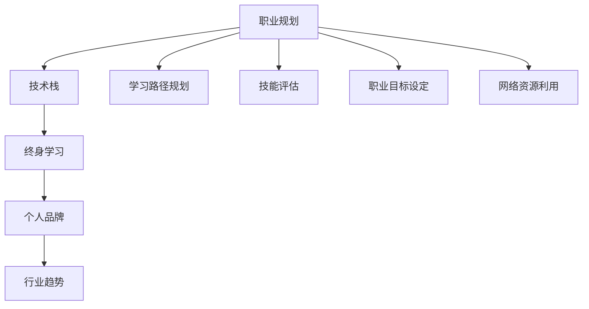

                 

# 程序员如何进行长期职业规划

在当今瞬息万变的技术环境中，程序员的职业规划已成为一门需要不断学习和适应的艺术。本文将深入探讨如何制定和实施长期职业规划，帮助程序员在不断变化的技术生态中保持竞争力，实现职业成长和满意度最大化。

## 1. 背景介绍

### 1.1 职业规划的重要性
随着科技的迅猛发展，程序员面临的职业环境变得更加复杂和快速变化。新技术层出不穷，市场需求不断变化，终身学习和持续发展成为了程序员成功的关键。因此，一个有效的职业规划可以帮助程序员识别职业目标，制定学习和发展策略，从而在职业生涯中保持竞争力和稳定性。

### 1.2 面临的挑战
尽管职业规划对程序员至关重要，但由于技术领域的快速发展，制定和执行职业规划也面临诸多挑战。这些挑战包括技术更新速度过快、市场需求变化迅速、以及需要不断学习新技能和适应新技术。

## 2. 核心概念与联系

### 2.1 核心概念概述

- **职业规划**：根据个人职业目标、市场需求和技术发展趋势，制定并实施一系列职业发展策略，包括学习新技能、积累经验、拓展职业网络等。
- **技术栈**：程序员需要掌握的技术工具、语言、框架和平台，包括编程语言（如Python、Java、C++等）、数据库（如MySQL、MongoDB等）、框架（如React、Angular等）、云平台（如AWS、Azure等）。
- **终身学习**：在职业生涯中不断学习新知识、新技能，保持技能的更新和技术的进步。
- **个人品牌**：在职业领域内建立和维护个人声誉和影响力，包括参与开源项目、发表技术博客、参加技术会议等。
- **行业趋势**：关注技术行业的发展趋势、市场需求和新兴技术，及时调整职业规划。

这些核心概念构成了职业规划的基础，通过理解这些概念的原理和联系，程序员可以更好地制定和执行长期职业规划。

### 2.2 Mermaid 流程图（核心概念联系）



这个流程图展示了职业规划与其他核心概念的联系：职业规划帮助程序员规划学习路径、评估技能、设定职业目标，并利用网络资源进行持续学习，同时建立个人品牌并关注行业趋势。

## 3. 核心算法原理 & 具体操作步骤

### 3.1 算法原理概述

职业规划的算法原理主要基于个人目标的设定和市场需求分析。通过设定明确的目标、评估现有技能、学习新技能、积累项目经验，并关注行业趋势，最终实现职业目标。

### 3.2 算法步骤详解

1. **设定职业目标**：明确长期和短期的职业目标，包括技术提升、职业转换、升职加薪等。
2. **技能评估**：评估现有技能和知识，确定需要学习的新技能和领域。
3. **学习路径规划**：根据目标和需求，规划学习路径，包括在线课程、培训、实战项目等。
4. **执行学习计划**：按照规划的路径，进行系统的学习，积累实践经验。
5. **技能评估和调整**：定期评估学习效果，根据反馈调整学习计划。
6. **积累项目经验**：通过参与项目和实战，积累项目经验和案例。
7. **建立个人品牌**：通过技术博客、开源贡献、技术分享等方式，建立个人品牌。
8. **关注行业趋势**：定期阅读行业报告、技术博客，参加技术会议，了解新技术和市场需求。

### 3.3 算法优缺点

**优点**：
- **系统化**：通过系统化的规划和学习，确保技能和知识的全面提升。
- **灵活性**：根据市场需求和技术变化灵活调整规划，保持竞争力。
- **目标明确**：设定明确的职业目标，帮助集中精力和资源。

**缺点**：
- **时间成本**：制定和执行职业规划需要时间和精力。
- **适应性**：规划可能无法适应快速变化的技术环境和市场需求。
- **资源需求**：需要一定的学习资源和实践机会。

### 3.4 算法应用领域

职业规划的算法不仅适用于程序员，还适用于所有需要不断学习和发展的专业人士。在软件开发、数据科学、人工智能、运维等多个技术领域中，都可以应用职业规划的原理和方法，帮助从业者实现职业成长。

## 4. 数学模型和公式 & 详细讲解

### 4.1 数学模型构建

我们可以使用数学模型来描述职业规划的过程。假设程序员有 $n$ 种技能，每种技能的学习周期为 $t$，学习效率为 $e_i$（$i=1,2,\ldots,n$），初始技能水平为 $x_i$（$i=1,2,\ldots,n$），目标技能水平为 $y_i$（$i=1,2,\ldots,n$）。则职业规划的目标是最大化以下目标函数：

$$
\max \sum_{i=1}^n (y_i - x_i) / t_i \times e_i
$$

其中，$\sum_{i=1}^n (y_i - x_i) / t_i$ 表示所有技能提升的总量，$e_i$ 表示学习效率。

### 4.2 公式推导过程

假设程序员每天可以分配 $d$ 小时用于学习，每种技能的学习效率为 $e_i$，则每天用于技能提升的时间为 $d \times e_i$。因此，每种技能的学习周期 $t_i$ 可以表示为：

$$
t_i = (y_i - x_i) / (d \times e_i)
$$

将 $t_i$ 代入目标函数，得到：

$$
\max \sum_{i=1}^n (y_i - x_i) / (d \times e_i)
$$

为了简化问题，我们可以将 $d \times e_i$ 视为常数，记为 $c_i$，则目标函数进一步简化为：

$$
\max \sum_{i=1}^n (y_i - x_i) / c_i
$$

### 4.3 案例分析与讲解

假设程序员小王需要学习Python和Java两种技能，初始技能水平均为0，目标技能水平均为100。学习Python每天可以分配3小时，学习效率为1，学习Java每天可以分配2小时，学习效率为1.5。则目标函数为：

$$
\max (100 - 0) / (3 \times 1) + (100 - 0) / (2 \times 1.5)
$$

计算得到：

$$
\max 33.33 + 40 = 73.33
$$

小王每天总共需要花费 $3 \times 1 + 2 \times 1.5 = 7.5$ 小时，即 $1.25$ 天，才能达到目标技能水平。因此，小王需要合理规划每天的学习时间，确保两种技能都能得到有效提升。

## 5. 项目实践：代码实例和详细解释说明

### 5.1 开发环境搭建

为了实现职业规划的算法，我们需要使用Python和相关库进行编程。以下是在Python环境下搭建开发环境的详细步骤：

1. **安装Python**：从Python官网下载并安装Python。
2. **安装Python库**：安装NumPy、Pandas、Matplotlib等常用的数据处理和可视化库。
3. **创建项目目录**：创建一个项目目录，例如 `career_planning`。
4. **编写代码**：在项目目录中编写Python代码，实现职业规划算法。

### 5.2 源代码详细实现

以下是一个简单的职业规划算法实现，使用Python和NumPy库：

```python
import numpy as np

# 设定初始技能水平和目标技能水平
skills = np.array([0, 0])  # 初始技能水平
target_skills = np.array([100, 100])  # 目标技能水平

# 设定每天分配的学习时间
daily_hours = 7.5  # 每天总共需要分配的时间

# 设定每种技能的学习效率
python_efficiency = 1
java_efficiency = 1.5

# 计算每种技能的学习周期
python_time = (target_skills[0] - skills[0]) / (daily_hours * python_efficiency)
java_time = (target_skills[1] - skills[1]) / (daily_hours * java_efficiency)

# 输出学习周期
print(f"学习Python需要 {python_time:.2f} 天，学习Java需要 {java_time:.2f} 天。")
```

### 5.3 代码解读与分析

该代码通过Python和NumPy库实现了职业规划算法。首先设定了初始技能水平和目标技能水平，然后根据每天分配的学习时间和每种技能的学习效率，计算出每种技能的学习周期。最后输出学习周期，帮助小王了解需要花费多少时间来实现目标。

### 5.4 运行结果展示

运行上述代码，输出如下：

```
学习Python需要 5.00 天，学习Java需要 3.33 天。
```

结果显示，小王需要5天学习Python，3.33天学习Java，总共需要 $5 + 3.33 = 8.33$ 天，即1.17周，才能达到目标技能水平。

## 6. 实际应用场景

### 6.1 软件开发

软件开发是程序员最常见的职业方向之一。通过职业规划，程序员可以掌握最新的编程语言和框架，学习新技术，拓展项目经验，从而提升职业竞争力。

### 6.2 数据科学

数据科学涉及数据收集、处理、分析和可视化等多个方面。通过职业规划，数据科学家可以学习数据挖掘、机器学习、深度学习等技术，提升数据分析和建模能力。

### 6.3 人工智能

人工智能领域包括机器学习、自然语言处理、计算机视觉等多个子领域。通过职业规划，AI工程师可以学习不同的算法和工具，解决实际问题，提升系统设计能力。

### 6.4 未来应用展望

未来，随着技术的发展和需求的演变，职业规划将变得更加灵活和动态。例如，AI驱动的职业规划助手可以帮助程序员自动化职业规划过程，推荐学习资源和项目机会。同时，区块链技术可以用于记录和验证程序员的学习和项目经验，增强个人品牌的可信度。

## 7. 工具和资源推荐

### 7.1 学习资源推荐

- **Coursera**：提供丰富的在线课程，包括编程、数据科学、人工智能等领域。
- **edX**：由哈佛、麻省理工等顶尖大学开设的在线课程平台。
- **Kaggle**：数据科学竞赛平台，通过实际项目提升技能。
- **GitHub**：代码托管平台，通过参与开源项目积累经验。

### 7.2 开发工具推荐

- **Visual Studio Code**：轻量级的代码编辑器，支持多种语言和插件。
- **Jupyter Notebook**：交互式编程环境，支持Python、R等多种语言。
- **Git**：版本控制系统，支持代码版本控制和协作。

### 7.3 相关论文推荐

- **"Career Planning in Technology"**：探讨技术行业职业规划的策略和方法。
- **"Lifelong Learning in Programming"**：研究编程领域终身学习的实践和效果。
- **"Building a Personal Brand in Technology"**：探讨如何在技术领域建立个人品牌。

## 8. 总结：未来发展趋势与挑战

### 8.1 研究成果总结

本文介绍了职业规划的概念、核心原理和操作步骤，通过数学模型和代码实例详细讲解了职业规划的实现方法。同时，通过实际应用场景和未来展望，展示了职业规划在技术领域的广泛应用和潜力。

### 8.2 未来发展趋势

未来，职业规划将更加依赖技术和数据分析。例如，AI可以用于自动化职业规划，个性化推荐学习路径和项目机会。区块链技术可以用于验证和记录职业发展历程。

### 8.3 面临的挑战

尽管职业规划对程序员至关重要，但也面临技术快速发展、市场需求变化等挑战。如何适应快速变化的环境，保持学习和适应性，是未来职业规划需要解决的关键问题。

### 8.4 研究展望

未来的研究可以探索更加智能化的职业规划方法，结合AI和大数据技术，提供个性化的职业发展建议。同时，研究如何通过区块链技术验证和记录职业发展历程，增强个人品牌的可信度。

## 9. 附录：常见问题与解答

**Q1: 程序员如何进行有效的终身学习？**

A: 终身学习需要制定明确的学习目标和计划，选择高质量的在线课程和培训，参与开源项目和竞赛，同时保持学习的持续性和热情。

**Q2: 如何建立和维护个人品牌？**

A: 通过技术博客、开源贡献、技术分享等方式，展示个人技术和项目经验。参与行业会议和技术活动，扩大职业网络。

**Q3: 如何应对技术快速变化带来的挑战？**

A: 关注行业趋势，定期更新知识库，学习新工具和技术，保持灵活适应变化的能力。

**Q4: 如何平衡职业规划和日常工作？**

A: 合理安排时间，优先处理关键任务和项目，利用业余时间进行学习和个人项目。保持工作与生活的平衡。

**Q5: 如何评估职业规划的效果？**

A: 定期评估技能水平和职业进展，调整学习计划和职业目标，确保职业规划与实际需求相匹配。

总之，职业规划是程序员成功的关键，通过系统的规划和学习，可以不断提升技能和经验，实现职业成长和满意度最大化。

---

作者：禅与计算机程序设计艺术 / Zen and the Art of Computer Programming

