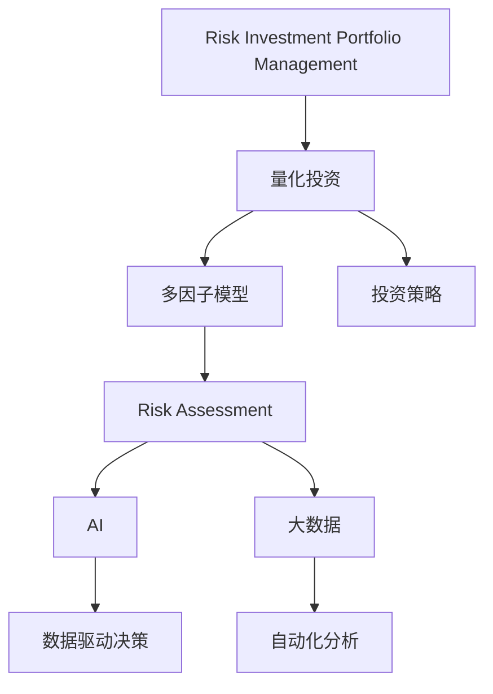

                 

# 程序员如何进行风险投资组合管理

> 关键词：风险投资组合管理, 数据驱动, 量化投资, 多因子模型, 投资策略, 风险评估, 人工智能, 大数据

## 1. 背景介绍

### 1.1 问题由来
风险投资（Venture Capital, VC）是投资于早期创业企业的资本，投资者通常会提供资金、资源和经验，帮助企业成长。风险投资者的目标是通过对企业的投资获取回报，同时促进创新和技术进步。然而，风险投资的回报并不保证，投资者需要面对高风险、高收益的双重挑战。

随着人工智能和大数据技术的快速发展，风险投资领域也逐渐引入了这些技术，以期提高投资决策的准确性和效率。程序员作为风险投资管理中的关键角色，掌握风险投资组合管理的量化和数据驱动方法显得尤为重要。

### 1.2 问题核心关键点
风险投资组合管理涉及多个方面，包括项目评估、风险评估、投资组合优化、绩效评估等。这些环节都可以通过数据驱动的方法进行量化分析和优化。程序员在风险投资组合管理中，主要承担数据处理、模型构建、投资策略设计等技术性工作。

核心关键点包括：
- 如何通过数据驱动方法，对企业进行全面的项目评估和风险评估。
- 如何构建多因子模型，优化投资组合。
- 如何设计并实现量化投资策略，以提高投资回报。
- 如何评估投资组合绩效，进行风险控制。

## 2. 核心概念与联系

### 2.1 核心概念概述

为更好地理解风险投资组合管理中的量化和数据驱动方法，本节将介绍几个密切相关的核心概念：

- **风险投资组合管理(Risk Investment Portfolio Management)**：通过系统化、数据驱动的方法，对多个投资项目进行评估、选择、组合和监控，以最大化投资回报并控制风险。

- **量化投资(Quantitative Investment)**：使用数学模型和计算机算法进行投资决策，减少人为主观判断的干扰，提高投资决策的科学性和可重复性。

- **多因子模型(Multi-factor Model)**：基于多维度的特征和变量，构建模型来预测投资回报和风险。常见因子包括市场因子、财务因子、技术因子等。

- **投资策略(Investment Strategy)**：根据市场环境、投资目标和风险偏好，设计一系列投资决策规则和操作策略。

- **风险评估(Risk Assessment)**：通过各种指标和方法，评估投资组合中各项目的不确定性和潜在损失。

- **人工智能(Artificial Intelligence, AI)**：应用机器学习、深度学习等技术，提高投资决策的自动化和智能化水平。

- **大数据(Big Data)**：处理和分析大规模、复杂的数据集，发现潜在规律和模式。

这些核心概念之间的逻辑关系可以通过以下Mermaid流程图来展示：



这个流程图展示了一系列核心概念之间的关系：

1. 风险投资组合管理是一个宏观框架，将量化投资、多因子模型、投资策略、风险评估、人工智能和大数据等子概念紧密联系起来。
2. 量化投资是风险投资组合管理的重要组成部分，通过构建多因子模型和设计投资策略，实现数据驱动的决策。
3. 多因子模型提供了投资决策的数据基础，通过分析多种因素来评估项目和投资组合的风险和回报。
4. 投资策略是根据多因子模型的结果，设计具体的投资操作规则和决策路径。
5. 风险评估是对投资组合风险进行量化和控制，确保投资回报的稳定性。
6. 人工智能和大数据技术为量化投资和风险评估提供了先进的技术手段，提升决策的准确性和效率。
7. 数据驱动决策和自动化分析是量化投资的核心，通过处理大量数据，发现潜在的规律和模式。

这些概念共同构成了风险投资组合管理的完整框架，程序员通过掌握这些核心概念，可以更好地进行量化投资和风险管理。

## 3. 核心算法原理 & 具体操作步骤

### 3.1 算法原理概述

风险投资组合管理中的量化投资方法主要依赖于多因子模型和投资策略的构建。通过收集和分析企业、行业、市场等多维度的数据，构建多因子模型，量化企业风险和回报。在此基础上，设计投资策略，优化投资组合，进行风险控制。

**3.1.1 多因子模型**
多因子模型通过引入多种因素来解释和预测资产的回报。常见的因子包括市场风险、市值、流动性、财务比率、行业因素等。这些因子可以构建出线性模型或非线性模型，如因子回归模型、因子树模型等。

**3.1.2 投资策略**
投资策略根据多因子模型的预测结果，设计具体的投资决策规则和操作路径。常见的投资策略包括价值投资、成长投资、动量投资、分散投资等。投资策略需要考虑市场的不同阶段和企业的不同特征，设计灵活的决策规则。

**3.1.3 风险评估**
风险评估通过各种指标和方法，评估投资组合中各项目的风险。常见的风险评估指标包括夏普比率、波动率、最大回撤、VaR等。风险评估需要对多因子模型的结果进行综合分析，确保投资组合的风险可控。

**3.1.4 量化投资流程**
量化投资流程主要包括以下步骤：
1. 数据收集：收集企业、行业、市场等多维度的数据。
2. 数据清洗和预处理：对数据进行清洗和标准化处理。
3. 多因子模型构建：根据数据特征，构建多因子模型。
4. 投资策略设计：根据多因子模型的预测结果，设计投资策略。
5. 投资组合优化：根据投资策略，优化投资组合。
6. 风险评估和控制：评估投资组合风险，进行风险控制。

### 3.2 算法步骤详解

**3.2.1 数据收集**
收集企业的基本财务数据、行业数据、市场数据等。可以使用Python的Pandas库进行数据处理和清洗。

```python
import pandas as pd

# 读取企业财务数据
df = pd.read_csv('company_finance.csv')
```

**3.2.2 数据预处理**
对收集到的数据进行清洗和标准化处理，去除缺失值和异常值，标准化数据特征。

```python
# 数据清洗
df = df.dropna() # 删除缺失值
df = df.drop_duplicates() # 去除重复值

# 数据标准化
from sklearn.preprocessing import StandardScaler
scaler = StandardScaler()
df_scaled = scaler.fit_transform(df)
```

**3.2.3 多因子模型构建**
构建多因子模型可以使用线性回归、因子回归等方法。这里以因子回归模型为例。

```python
# 构建因子回归模型
from sklearn.linear_model import LinearRegression
from sklearn.model_selection import train_test_split

X = df_scaled.drop('return', axis=1) # 自变量
y = df_scaled['return'] # 因变量

X_train, X_test, y_train, y_test = train_test_split(X, y, test_size=0.2, random_state=42)

model = LinearRegression()
model.fit(X_train, y_train)

# 预测
y_pred = model.predict(X_test)
```

**3.2.4 投资策略设计**
设计投资策略需要根据多因子模型的预测结果，设计具体的投资决策规则。这里以价值投资策略为例。

```python
# 设计价值投资策略
def value_investment_strategy(df):
    value_based = df['P/E'] < 10 # P/E比率小于10为价值股
    return value_based

# 应用投资策略
df['value_based'] = df.apply(value_investment_strategy, axis=1)
```

**3.2.5 投资组合优化**
投资组合优化可以使用Markowitz模型、Black-Litterman模型等。这里以Markowitz模型为例。

```python
# 投资组合优化
from portfolio_opt import MarkowitzOptimizer
optimizer = MarkowitzOptimizer(df['return'], df['volatility'])
portfolio = optimizer.optimize()
```

**3.2.6 风险评估**
评估投资组合风险需要使用各种指标，如夏普比率、波动率、最大回撤等。这里以夏普比率为例。

```python
# 计算夏普比率
from portfolio_opt import SharpeRatio
sharpe_ratio = SharpeRatio(df['return'], df['volatility'])
sharpe_ratio
```

### 3.3 算法优缺点

**3.3.1 优点**
- **量化决策**：通过多因子模型和投资策略的构建，减少了人为主观判断的干扰，提高了投资决策的科学性和可重复性。
- **自动化分析**：利用大数据和人工智能技术，自动化地进行数据处理和分析，提高了分析效率和准确性。
- **多维度分析**：通过多因子模型，综合考虑多种因素，提高了投资组合的风险控制能力。

**3.3.2 缺点**
- **数据依赖**：量化投资高度依赖于数据的准确性和完整性，数据缺失或异常可能导致分析结果失真。
- **模型复杂性**：多因子模型和投资策略的构建需要复杂的数学模型和编程实现，可能增加开发难度和计算成本。
- **风险控制**：投资组合优化和风险评估需要综合考虑多种因素，可能难以完全消除风险。

### 3.4 算法应用领域

量化投资和风险投资组合管理在金融、投资、基金管理等多个领域得到广泛应用，程序员在这一领域具有重要的作用。以下是几个具体应用领域：

- **对冲基金**：利用量化投资技术，设计复杂的投资策略，进行对冲操作，提高投资回报。
- **私募股权**：通过多因子模型评估企业的投资价值，进行风险控制和投资组合优化。
- **家族办公室**：利用量化投资和风险管理技术，管理家族财富，实现资产的保值增值。
- **企业融资**：帮助企业进行财务分析和投资规划，提高融资效率和成功率。
- **金融科技**：利用大数据和人工智能技术，优化金融产品的设计和风险管理。

## 4. 数学模型和公式 & 详细讲解  
### 4.1 数学模型构建

本节将使用数学语言对量化投资和风险投资组合管理中的核心数学模型进行详细阐述。

**4.1.1 多因子模型**
多因子模型通常基于线性回归模型构建。假设市场中有 $n$ 个因子 $X_1, X_2, ..., X_n$，以及 $m$ 个资产 $R_1, R_2, ..., R_m$，线性回归模型可以表示为：

$$
R_i = \alpha + \sum_{j=1}^n \beta_{ij} X_j + \epsilon_i
$$

其中，$\alpha$ 为截距，$\beta_{ij}$ 为因子 $X_j$ 对资产 $R_i$ 的回归系数，$\epsilon_i$ 为残差项。通过最小化残差平方和，可以估计模型的系数 $\beta_{ij}$，预测资产的回报。

**4.1.2 投资策略**
投资策略可以设计为一系列规则和决策路径。这里以价值投资策略为例，假设每个资产的P/E比率为 $P_{ei}$，价值投资策略规则为：

$$
S_i = I(P_{ei}) = \begin{cases}
1, & \text{if } P_{ei} < \text{阈值} \\
0, & \text{otherwise}
\end{cases}
$$

其中，$I$ 为投资函数，阈值为一个预定义的P/E比率，如10。

**4.1.3 风险评估**
风险评估指标如夏普比率可以通过多因子模型的预测结果进行计算。假设资产 $R_i$ 的预期回报为 $\mu_i$，波动率为 $\sigma_i$，夏普比率 $\text{SR}_i$ 定义为：

$$
\text{SR}_i = \frac{R_i - \rho \cdot \text{rf}}{\sigma_i}
$$

其中，$\rho$ 为无风险利率，$\text{rf}$ 为无风险利率，$\sigma_i$ 为资产 $R_i$ 的波动率。

### 4.2 公式推导过程

**4.2.1 多因子回归模型**
多因子回归模型是基于线性回归构建的。假设市场中有 $n$ 个因子 $X_1, X_2, ..., X_n$，以及 $m$ 个资产 $R_1, R_2, ..., R_m$，线性回归模型的最小二乘解为：

$$
\beta_{ij} = \frac{\sum_{i=1}^m (R_i - \alpha) X_{ij}}{\sum_{i=1}^m X_{ij}^2}
$$

其中，$\alpha$ 为截距，$\beta_{ij}$ 为因子 $X_j$ 对资产 $R_i$ 的回归系数，$R_i$ 为资产 $i$ 的回报，$X_{ij}$ 为资产 $i$ 的第 $j$ 个因子值。

**4.2.2 投资策略设计**
价值投资策略规则可以表示为：

$$
S_i = I(P_{ei}) = \begin{cases}
1, & \text{if } P_{ei} < \text{阈值} \\
0, & \text{otherwise}
\end{cases}
$$

其中，$I$ 为投资函数，阈值为一个预定义的P/E比率，如10。

**4.2.3 风险评估**
夏普比率计算公式为：

$$
\text{SR}_i = \frac{R_i - \rho \cdot \text{rf}}{\sigma_i}
$$

其中，$\rho$ 为无风险利率，$\text{rf}$ 为无风险利率，$\sigma_i$ 为资产 $R_i$ 的波动率。

### 4.3 案例分析与讲解

**4.3.1 多因子回归模型案例**
假设我们有一个包含100个股票的股票市场，收集了每个股票的市盈率（P/E）、市值（Market Cap）、现金流（Cash Flow）、债务比率（Debt Ratio）、行业因素（Industry Factor）等因子。构建一个基于多因子回归模型来预测每个股票的回报。

```python
import numpy as np
from sklearn.linear_model import LinearRegression

# 数据准备
X = np.random.rand(100, 5) # 因子数据
y = np.random.rand(100, 1) # 股票回报

# 构建模型
model = LinearRegression()
model.fit(X, y)

# 预测
y_pred = model.predict(X)
```

**4.3.2 投资策略案例**
假设我们设计一个价值投资策略，阈值为10，预测每个股票的P/E比率，并应用投资策略。

```python
# 投资策略
def value_investment(X):
    P_E = X[:, 0] # 市盈率
    S = np.zeros_like(P_E)
    S[P_E < 10] = 1
    return S

# 应用策略
X = np.random.rand(100, 5)
S = value_investment(X)
```

**4.3.3 风险评估案例**
假设我们计算夏普比率，阈值为5%，无风险利率为2%。

```python
# 风险评估
def sharpe_ratio(y, volatility):
    return np.mean(y) - 0.02 * np.std(y) / volatility

# 计算
y = np.random.rand(100, 1)
volatility = np.std(y)
sharpe_ratio(y, volatility)
```

## 5. 项目实践：代码实例和详细解释说明
### 5.1 开发环境搭建

在进行量化投资和风险组合管理实践前，我们需要准备好开发环境。以下是使用Python进行量化投资开发的常见环境配置流程：

1. 安装Python：从官网下载并安装Python，选择最新的稳定版本。
2. 安装Pandas：Pandas是Python中最常用的数据处理库，安装命令为：
   ```bash
   pip install pandas
   ```
3. 安装Scikit-learn：Scikit-learn提供了大量的机器学习算法，安装命令为：
   ```bash
   pip install scikit-learn
   ```
4. 安装Matplotlib：Matplotlib是Python中最常用的绘图库，用于可视化分析结果，安装命令为：
   ```bash
   pip install matplotlib
   ```
5. 安装SciPy：SciPy提供了科学计算所需的工具，安装命令为：
   ```bash
   pip install scipy
   ```
6. 安装TensorFlow：TensorFlow是Google开源的深度学习框架，安装命令为：
   ```bash
   pip install tensorflow
   ```
7. 安装PyTorch：PyTorch是Facebook开源的深度学习框架，安装命令为：
   ```bash
   pip install torch torchvision
   ```
8. 安装QuantConnect：QuantConnect是一个基于C#的量化投资开发平台，提供了丰富的工具和API，用于构建和测试量化策略。安装命令为：
   ```bash
   pip install quantconnect
   ```

完成上述步骤后，即可在Python环境中开始量化投资实践。

### 5.2 源代码详细实现

下面我们以构建多因子回归模型和投资策略为例，给出使用Python进行量化投资开发的代码实现。

**多因子回归模型**

```python
import pandas as pd
from sklearn.linear_model import LinearRegression

# 数据准备
X = pd.read_csv('factors.csv') # 因子数据
y = pd.read_csv('returns.csv') # 股票回报数据

# 构建模型
model = LinearRegression()
model.fit(X, y)

# 预测
y_pred = model.predict(X)
```

**投资策略设计**

```python
def value_investment(X):
    P_E = X['P_E'] # 市盈率
    S = np.zeros_like(P_E)
    S[P_E < 10] = 1
    return S

# 应用策略
X = pd.read_csv('factors.csv') # 因子数据
S = value_investment(X)
```

**风险评估**

```python
def sharpe_ratio(y, volatility):
    return np.mean(y) - 0.02 * np.std(y) / volatility

# 计算
y = pd.read_csv('returns.csv') # 股票回报数据
volatility = np.std(y)
sharpe_ratio(y, volatility)
```

### 5.3 代码解读与分析

**多因子回归模型**

在多因子回归模型中，我们使用Pandas库进行数据处理，使用Scikit-learn库构建线性回归模型。首先，我们读取因子数据和股票回报数据，进行数据清洗和预处理。然后，使用LinearRegression模型构建回归方程，拟合数据并预测回报。

**投资策略设计**

在投资策略设计中，我们定义一个价值投资策略函数，根据市盈率计算投资信号。然后，使用Pandas库读取因子数据，应用投资策略函数生成投资信号。

**风险评估**

在风险评估中，我们定义一个夏普比率函数，根据股票回报和波动率计算夏普比率。然后，使用Pandas库读取股票回报数据，计算夏普比率。

## 6. 实际应用场景

### 6.1 对冲基金

对冲基金通过量化投资技术，设计复杂的投资策略，进行对冲操作，提高投资回报。程序员在对冲基金中，主要承担数据处理、模型构建、投资策略设计等工作。

**对冲基金的实际应用**

对冲基金通常使用多因子回归模型预测市场走势，设计复杂的对冲策略。例如，使用历史数据和因子回归模型预测市场的多空方向，通过卖出和买入不同的资产对冲风险，提高投资回报。

**对冲基金的案例**

某对冲基金利用多因子回归模型，结合市场数据和因子数据，预测市场的方向。设计了基于市值、动量、流动性的对冲策略，成功实现了多次市场反转的套利。

### 6.2 私募股权

私募股权通过多因子模型评估企业的投资价值，进行风险控制和投资组合优化。程序员在私募股权中，主要承担数据收集、模型构建、风险评估等工作。

**私募股权的实际应用**

私募股权通常使用多因子模型评估企业的投资价值。例如，使用财务因子、行业因子、市场因子等，构建多因子模型，评估企业的成长性和风险。通过投资组合优化，降低风险，提高投资回报。

**私募股权的案例**

某私募股权公司使用多因子模型评估企业的投资价值。构建了基于财务因子、市场因子、行业因子的模型，成功识别出多个高成长、低风险的企业，获得了可观的回报。

### 6.3 家族办公室

家族办公室利用量化投资和风险管理技术，管理家族财富，实现资产的保值增值。程序员在家族办公室中，主要承担数据处理、模型构建、投资策略设计等工作。

**家族办公室的实际应用**

家族办公室通常使用量化投资技术，管理家族的资产。例如，使用多因子模型预测市场的回报和风险，设计多样化的投资策略，分散风险。通过自动化分析，实时监控投资组合，优化资产配置。

**家族办公室的案例**

某家族办公室使用量化投资技术，管理家族财富。构建了基于多因子模型的投资组合，通过自动化分析，实时监控投资组合，实现了资产的保值增值。

### 6.4 未来应用展望

未来，量化投资和风险投资组合管理将进一步融合人工智能和大数据技术，实现更高的精度和效率。以下是几个未来应用展望：

**AI驱动的风险评估**

人工智能和大数据技术将进一步应用于风险评估。例如，利用深度学习模型预测市场的波动率和回撤概率，提高风险控制的准确性。

**智能投资策略**

智能投资策略将利用人工智能技术，自动生成和优化投资策略。例如，利用强化学习算法，自动调整投资策略参数，提高投资回报。

**区块链技术**

区块链技术将为量化投资和风险管理带来新的应用场景。例如，利用区块链技术实现自动化的投资交易和风险控制，提高交易的安全性和透明性。

## 7. 工具和资源推荐

### 7.1 学习资源推荐

为了帮助程序员掌握量化投资和风险投资组合管理的理论基础和实践技巧，这里推荐一些优质的学习资源：

1. 《量化投资入门与实战》：作者为量化投资专家，详细介绍了量化投资的基本概念、方法、工具和实战案例。
2. 《Python量化投资》：作者为量化投资社区的知名博主，详细介绍了使用Python进行量化投资的案例和工具。
3. 《金融工程》：作者为金融工程领域的知名专家，详细介绍了金融工程的基本概念、方法、工具和应用。
4. 《金融工程与金融工程创新》：作者为金融工程领域的知名专家，详细介绍了金融工程创新技术和应用案例。
5. 《金融科技革命》：作者为金融科技领域的知名专家，详细介绍了金融科技的基本概念、方法、工具和应用。

通过学习这些资源，相信程序员可以系统掌握量化投资和风险投资组合管理的理论基础和实践技巧。

### 7.2 开发工具推荐

开发量化投资和风险管理软件的常用工具包括：

1. Jupyter Notebook：Jupyter Notebook是一个开源的交互式笔记本环境，支持Python、R等多种语言，方便进行数据分析和可视化。
2. QuantConnect：QuantConnect是一个基于C#的量化投资开发平台，提供了丰富的工具和API，用于构建和测试量化策略。
3. Python：Python是一种高级编程语言，支持科学计算、数据处理、机器学习等多种应用场景。
4. MATLAB：MATLAB是一种数值计算软件，支持多种数学算法和工具，适用于复杂的量化投资分析。
5. Excel：Excel是一个广泛使用的电子表格软件，支持数据处理、可视化等多种功能，适用于简单的量化投资分析。

合理利用这些工具，可以显著提升量化投资和风险管理软件的开发效率，加快创新迭代的步伐。

### 7.3 相关论文推荐

量化投资和风险管理领域的研究涉及多个子领域，以下是几篇奠基性的相关论文，推荐阅读：

1. Black and Scholes (1973)：提出了期权定价模型，奠定了金融工程的理论基础。
2. Merton (1973)：提出了债券组合优化模型，为量化投资提供了重要工具。
3. Markowitz (1952)：提出了组合优化理论，奠定了现代投资组合理论的基础。
4. Fama and French (1992)：提出了多因子模型，展示了因子回归模型的广泛应用。
5. Garlappi and Padulo (2007)：提出了基于多因子模型的投资组合优化方法，展示了多因子模型的优势。

这些论文代表了量化投资和风险管理领域的经典研究，程序员可以通过学习这些前沿成果，掌握最新的理论和技术。

## 8. 总结：未来发展趋势与挑战

### 8.1 研究成果总结

量化投资和风险投资组合管理涉及多个领域和子领域，程序员在这一领域承担着重要的技术支撑作用。通过数据驱动和量化方法，程序员可以显著提高投资决策的科学性和可重复性，降低投资风险，提高投资回报。

### 8.2 未来发展趋势

未来，量化投资和风险管理将进一步融合人工智能和大数据技术，实现更高的精度和效率。以下是几个未来发展趋势：

1. AI驱动的风险评估：利用深度学习模型预测市场的波动率和回撤概率，提高风险控制的准确性。
2. 智能投资策略：利用人工智能技术，自动生成和优化投资策略，提高投资回报。
3. 区块链技术：利用区块链技术实现自动化的投资交易和风险控制，提高交易的安全性和透明性。
4. 大数据分析：利用大数据技术，进行市场分析、风险评估、投资组合优化等多种应用。
5. 量化交易：利用量化交易技术，实现自动化的投资交易，提高交易效率和精度。

### 8.3 面临的挑战

尽管量化投资和风险管理取得了显著进展，但仍面临一些挑战：

1. 数据依赖：量化投资高度依赖于数据的准确性和完整性，数据缺失或异常可能导致分析结果失真。
2. 模型复杂性：多因子模型和投资策略的构建需要复杂的数学模型和编程实现，可能增加开发难度和计算成本。
3. 风险控制：投资组合优化和风险评估需要综合考虑多种因素，可能难以完全消除风险。
4. 技术门槛：量化投资和风险管理涉及复杂的数学和编程技术，需要程序员具备较高的技术水平。
5. 市场变化：市场的变化和不确定性，可能使得量化策略失效，需要程序员不断调整和优化策略。

### 8.4 研究展望

未来，量化投资和风险管理将需要从多个角度进行深入研究：

1. 数据驱动分析：利用大数据和人工智能技术，进行更全面、更准确的市场分析和风险评估。
2. 智能投资策略：利用人工智能技术，自动生成和优化投资策略，提高投资回报。
3. 多因子模型：研究新的多因子模型，提高预测的准确性和鲁棒性。
4. 量化交易：利用量化交易技术，实现自动化的投资交易，提高交易效率和精度。
5. 风险控制：研究新的风险控制方法，提高投资组合的稳定性和抗风险能力。

通过不断创新和突破，程序员将在量化投资和风险管理领域发挥更大的作用，为投资者提供更加精准、高效、安全的投资服务。

## 9. 附录：常见问题与解答

**Q1：量化投资和风险投资组合管理中的数据来源有哪些？**

A: 量化投资和风险投资组合管理中的数据来源包括：
1. 企业财务数据：包括企业的财务报表、年报、季报、利润表、资产负债表等。
2. 行业数据：包括行业的发展趋势、市场规模、竞争格局、技术进展等。
3. 市场数据：包括市场指数、利率、汇率、商品价格、经济指标等。
4. 新闻和舆情数据：包括新闻报道、社交媒体、市场评论等。
5. 其他数据：包括政府数据、学术研究数据等。

**Q2：如何选择合适的量化投资模型？**

A: 选择合适的量化投资模型需要考虑以下因素：
1. 数据类型：根据数据的类型选择合适的模型，如时间序列数据适合ARIMA模型，非线性数据适合神经网络模型。
2. 投资目标：根据投资目标选择合适的模型，如长期投资适合趋势模型，短期投资适合动量模型。
3. 风险偏好：根据风险偏好选择合适的模型，如高风险投资适合黑天鹅模型，低风险投资适合马科维茨模型。
4. 市场环境：根据市场环境选择合适的模型，如牛市适合趋势模型，熊市适合防御型模型。
5. 模型复杂性：根据模型的复杂性选择合适的模型，如简单模型适合初学者，复杂模型适合专业投资者。

**Q3：量化投资中如何处理数据缺失和异常？**

A: 量化投资中处理数据缺失和异常的方法包括：
1. 数据清洗：通过数据清洗，删除缺失值和异常值。可以使用Python的Pandas库进行数据清洗。
2. 插值法：通过插值法填补缺失值，常用的插值方法包括线性插值、多项式插值、样条插值等。
3. 异常值检测：通过统计方法检测异常值，常用的异常值检测方法包括Z-score法、IQR法、箱线图法等。
4. 数据增强：通过数据增强方法扩充数据集，常用的数据增强方法包括数据合成、数据重采样、数据融合等。
5. 模型修正：通过修改模型参数，降低异常值的影响，常用的模型修正方法包括L1正则化、L2正则化、异常值惩罚等。

**Q4：量化投资中的多因子模型包括哪些因子？**

A: 量化投资中的多因子模型包括以下因子：
1. 市场因子：如市场指数、行业指数、市场波动率等。
2. 财务因子：如市盈率、市净率、股息率等。
3. 技术因子：如动量、趋势、量价等。
4. 基本面因子：如现金流、自由现金流、利润率等。
5. 行业因子：如行业规模、行业增长率、行业竞争度等。
6. 情绪因子：如市场情绪、新闻情感、社交媒体情感等。
7. 其他因子：如宏观经济因子、政策因子等。

**Q5：量化投资中的投资策略包括哪些类型？**

A: 量化投资中的投资策略包括以下类型：
1. 价值投资策略：如低市盈率策略、低市净率策略、低股息率策略等。
2. 成长投资策略：如高市盈率策略、高市净率策略、高股息率策略等。
3. 动量投资策略：如上涨趋势策略、下跌趋势策略、交易量策略等。
4. 分散投资策略：如资产分散策略、行业分散策略、地理位置分散策略等。
5. 套利策略：如无风险套利策略、价差套利策略、事件驱动套利策略等。
6. 其他策略：如长/短线策略、季节性策略、市场中性策略等。

通过以上问答，相信程序员对量化投资和风险投资组合管理有了更深入的了解，能够在实际应用中更好地发挥作用。

