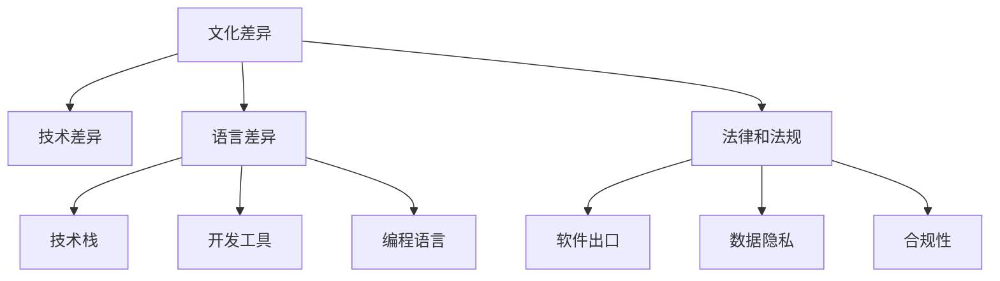

                 

# 程序员的全球化视野：机遇与挑战

## 1. 背景介绍

### 1.1 问题由来

随着互联网和全球化进程的加速，程序员这一职业的全球化趋势日益明显。跨文化、跨地域、跨语言的工作和协作已经成为常态。在这样的背景下，程序员不仅需要掌握技术，还需要具备全球化视野，理解不同文化和市场的需求，适应多样化的开发环境和沟通方式。

### 1.2 问题核心关键点

全球化视野的核心在于如何理解不同市场、文化和技术环境，以及如何在这样的环境中高效协作。这包括但不限于以下几个方面：

1. **文化差异**：不同国家和地区的文化背景、价值观念、工作习惯等差异，可能影响项目开发和团队合作。
2. **技术差异**：各地区技术栈、开发工具、编程语言等差异，可能影响代码的兼容性、维护性和推广性。
3. **语言差异**：不同国家和地区的语言差异，可能影响代码的国际化支持、文档翻译和社区交流。
4. **法律和法规**：不同国家和地区的法律和法规差异，可能影响软件出口、数据隐私和合规性。

### 1.3 问题研究意义

研究全球化视野，对于提升程序员的跨文化适应能力、拓宽技术视野、推动软件产品和服务的全球化部署具有重要意义。同时，全球化视野也能帮助企业在全球市场中获得竞争优势，扩大业务影响力。

## 2. 核心概念与联系

### 2.1 核心概念概述

全球化视野涉及多个核心概念，以下对其中的几个关键概念进行解释：

- **文化差异**：不同国家和地区的文化背景、价值观念、工作习惯等差异。
- **技术差异**：各地区技术栈、开发工具、编程语言等差异。
- **语言差异**：不同国家和地区的语言差异，包括但不限于编程语言、自然语言等。
- **法律和法规**：不同国家和地区的法律和法规差异。

这些概念之间的逻辑关系可以通过以下Mermaid流程图来展示：



这个流程图展示了一些核心概念之间的关系：

1. 文化差异影响技术差异，进而影响编程语言和开发工具的选择。
2. 文化差异和语言差异可能导致法律和法规的差异，影响软件出口和合规性。
3. 技术差异和法律和法规差异影响数据隐私和合规性。

## 3. 核心算法原理 & 具体操作步骤
### 3.1 算法原理概述

全球化视野的构建，涉及到对文化差异、技术差异、语言差异和法律和法规差异的理解和适应。这一过程可以理解为一种多维度、多层次的算法，旨在提高程序员在全球化环境下的适应能力和协作效率。

### 3.2 算法步骤详解

全球化视野的构建包括以下几个关键步骤：

1. **文化调研**：通过问卷调查、访谈等方式，了解目标市场的文化背景、价值观念和工作习惯。
2. **技术调研**：通过技术白皮书、技术社区等资源，了解目标市场的技术栈、开发工具和编程语言。
3. **语言调研**：通过语言学习资源、本地化支持等方式，掌握目标市场的语言差异和编程语言特性。
4. **法律合规**：通过法律咨询、合规性检查等方式，确保软件产品符合目标市场的法律和法规要求。

### 3.3 算法优缺点

全球化视野的构建具有以下优点：

1. **提高适应能力**：帮助程序员更好地适应不同文化和市场需求，提高跨文化协作效率。
2. **拓宽技术视野**：了解不同市场和技术差异，拓宽技术栈选择，提升技术创新能力。
3. **推动全球化部署**：确保软件产品符合各地法律和法规要求，扩大业务影响力。

同时，也存在一些缺点：

1. **成本高**：调研和适应的成本较高，特别是针对多语言、多文化环境的适应。
2. **复杂度高**：跨文化、跨技术栈的适应和协作，增加了项目管理的复杂性。
3. **风险高**：不熟悉目标市场文化和法律，可能导致项目失败或合规风险。

### 3.4 算法应用领域

全球化视野的应用领域包括但不限于以下几个方面：

- **跨国公司软件开发**：帮助软件开发团队适应不同国家和地区的市场需求和文化差异，推动软件产品在全球市场的推广。
- **全球化外包服务**：帮助外包公司理解客户市场的需求和法律环境，提供高质量的开发和测试服务。
- **全球化技术合作**：帮助技术团队跨文化协作，提升技术交流和合作效率。

## 4. 数学模型和公式 & 详细讲解  
### 4.1 数学模型构建

全球化视野的构建，可以通过构建一个多维度、多层次的数学模型来实现。假设有一个目标市场，其文化背景、技术栈、语言和法律环境可以用以下变量表示：

- $C$：文化背景
- $T$：技术栈
- $L$：语言差异
- $L$：法律和法规

### 4.2 公式推导过程

基于以上变量，构建一个综合评估模型，以评估软件产品在目标市场的适应性。模型包括以下几个部分：

1. **文化适应性评估**：评估软件产品在不同文化背景下的适应性，可以用公式表示为：
   $$
   A_C = f(C)
   $$
   其中 $f$ 表示文化适应性评估函数，根据文化差异的大小进行评分。

2. **技术适应性评估**：评估软件产品在目标技术栈上的适应性，可以用公式表示为：
   $$
   A_T = g(T)
   $$
   其中 $g$ 表示技术适应性评估函数，根据技术栈差异的大小进行评分。

3. **语言适应性评估**：评估软件产品在目标语言上的适应性，可以用公式表示为：
   $$
   A_L = h(L)
   $$
   其中 $h$ 表示语言适应性评估函数，根据语言差异的大小进行评分。

4. **法律合规性评估**：评估软件产品是否符合目标市场的法律和法规要求，可以用公式表示为：
   $$
   A_L = i(L)
   $$
   其中 $i$ 表示法律合规性评估函数，根据法律和法规差异的大小进行评分。

### 4.3 案例分析与讲解

以一家跨国软件公司为例，其在进入中国市场时需要进行以下步骤：

1. **文化调研**：通过问卷调查和访谈，了解中国员工的工作习惯和文化背景，评估文化适应性。
2. **技术调研**：通过技术白皮书和社区讨论，了解中国主流的技术栈和开发工具，评估技术适应性。
3. **语言调研**：通过翻译工具和本地化支持，了解中文编程语言和开发环境，评估语言适应性。
4. **法律合规**：通过法律咨询和合规性检查，确保软件产品符合中国的法律法规要求，评估法律合规性。

## 5. 项目实践：代码实例和详细解释说明
### 5.1 开发环境搭建

要构建全球化视野，首先需要搭建一个支持多语言、多文化环境的项目开发环境。以下是具体步骤：

1. **选择编程语言**：根据目标市场和团队技术栈选择支持多语言和国际化支持的编程语言，如Python、Java等。
2. **选择开发工具**：选择支持多语言、跨平台开发和国际化支持的开发工具，如Visual Studio Code、IntelliJ IDEA等。
3. **配置环境变量**：配置语言、区域和编码等环境变量，确保开发环境支持多语言和文化环境。
4. **安装依赖库**：安装支持多语言和国际化支持的依赖库和框架，如Flask、Django等。

### 5.2 源代码详细实现

以下是使用Python和Flask框架构建一个支持多语言和国际化支持的Web应用示例：

```python
from flask import Flask, request, render_template
import os
from jinja2 import Environment, FileSystemLoader

app = Flask(__name__)

# 多语言支持配置
app.config['LANGUAGES'] = ['en', 'zh']
app.config['LOCALE'] = 'zh_CN'
app.config['BCP47'] = 'zh_CN'

# 国际化字符串模板
env = Environment(loader=FileSystemLoader(os.path.dirname(__file__)))
gettext = env.gettext

# 路由配置
@app.route('/')
def index():
    return render_template('index.html', title=gettext('Hello World'))

@app.route('/<lang>/')
def index_lang(lang):
    app.config['LOCALE'] = lang
    app.config['BCP47'] = lang
    return render_template('index.html', title=gettext('Hello World'))

if __name__ == '__main__':
    app.run(debug=True)
```

### 5.3 代码解读与分析

在上述示例中，使用了Flask框架和Jinja2模板引擎，实现了多语言和国际化支持。具体分析如下：

- **多语言支持配置**：通过配置`LANGUAGES`、`LOCALE`和`BCP47`变量，指定支持的语言和当前语言环境。
- **国际化字符串模板**：使用Jinja2的`gettext`函数实现国际化字符串的提取和翻译。
- **路由配置**：通过定义`/`和`/<lang>/`两个路由，支持多语言环境下的Web访问。

## 6. 实际应用场景
### 6.1 跨国公司软件开发

跨国公司软件开发中，全球化视野的构建至关重要。以下是一个典型的应用场景：

**场景**：某跨国公司进入中国市场，开发一个面向中国用户的电商平台。

**步骤**：

1. **文化调研**：了解中国用户的消费习惯、支付方式、文化背景等。
2. **技术调研**：了解中国市场主流的技术栈和开发工具，选择适合的技术解决方案。
3. **语言调研**：使用中文编程语言和开发环境，确保软件产品符合中国市场的需求。
4. **法律合规**：确保软件产品符合中国的法律法规要求，避免合规风险。

### 6.2 全球化外包服务

全球化外包服务中，理解目标市场的需求和法律环境，是成功交付项目的关键。以下是一个典型的应用场景：

**场景**：一家外包公司为一家美国公司开发一个面向全球用户的社交媒体平台。

**步骤**：

1. **文化调研**：了解美国公司对全球化的期望和目标市场的文化背景。
2. **技术调研**：了解全球主流的技术栈和开发工具，选择适合的技术解决方案。
3. **语言调研**：使用多语言编程语言和开发环境，确保软件产品支持全球化。
4. **法律合规**：确保软件产品符合各国法律和法规要求，避免法律风险。

### 6.3 全球化技术合作

全球化技术合作中，跨文化协作和知识共享是提升效率的关键。以下是一个典型的应用场景：

**场景**：一家日本公司与一家美国公司合作开发一款面向全球用户的游戏。

**步骤**：

1. **文化调研**：了解两公司文化背景和沟通习惯，建立跨文化沟通机制。
2. **技术调研**：了解双方技术栈和开发工具，选择适合的技术解决方案。
3. **语言调研**：使用支持多语言的技术框架，确保代码和文档国际化。
4. **法律合规**：确保合作项目符合两国法律和法规要求，避免合规风险。

## 7. 工具和资源推荐
### 7.1 学习资源推荐

为了帮助程序员系统掌握全球化视野的理论基础和实践技巧，以下是一些优质的学习资源：

1. **《程序员的全球化视野》系列博文**：详细介绍了全球化视野的基本概念、技术实现和应用场景。
2. **Coursera《全球化软件开发》课程**：由知名大学教授授课，涵盖全球化软件开发的理论和实践。
3. **Google I/O《全球化开发最佳实践》讲座**：来自Google工程师的分享，提供了全球化开发的实际经验和案例。
4. **《程序员的语言》系列书籍**：介绍了多语言编程和国际化开发的实践技巧。
5. **GitHub《国际化开发》开源项目**：提供了大量国际化开发的代码示例和最佳实践。

通过这些资源的学习实践，相信程序员可以更好地掌握全球化视野，提升跨文化适应能力和协作效率。

### 7.2 开发工具推荐

高效的开发离不开优秀的工具支持。以下是几款用于全球化开发常用的工具：

1. **Visual Studio Code**：支持多语言和跨平台开发，具有丰富的扩展插件和国际化支持。
2. **IntelliJ IDEA**：支持多语言和国际化开发，具有强大的代码分析和重构功能。
3. **Flask**：轻量级的Web框架，支持多语言和国际化字符串模板。
4. **Django**：强大的Web框架，支持多语言和国际化，具有丰富的第三方插件和扩展。
5. **Xcode**：苹果公司的开发工具，支持多语言和跨平台开发，具有丰富的调试和测试功能。

合理利用这些工具，可以显著提升全球化开发任务的开发效率，加快创新迭代的步伐。

### 7.3 相关论文推荐

全球化视野的发展源于学界的持续研究。以下是几篇奠基性的相关论文，推荐阅读：

1. **《全球化软件开发的挑战和机会》**：探讨了全球化软件开发中的挑战和机遇，提供了实用的开发建议。
2. **《跨文化编程团队的管理》**：介绍了跨文化团队协作中的管理策略和实践经验。
3. **《多语言编程的挑战和解决方案》**：分析了多语言编程中的挑战，提出了有效的解决方案。
4. **《国际化开发的最佳实践》**：提供了国际化开发的详细实践指南和代码示例。
5. **《全球化开发的技术栈选择》**：分析了全球化开发中技术栈的选择和优化策略。

这些论文代表了大语言模型微调技术的发展脉络。通过学习这些前沿成果，可以帮助程序员把握学科前进方向，激发更多的创新灵感。

## 8. 总结：未来发展趋势与挑战
### 8.1 总结

本文对程序员的全球化视野进行了全面系统的介绍。首先阐述了全球化视野的重要性，明确了其在提升跨文化适应能力、拓宽技术视野、推动软件产品和服务的全球化部署方面的独特价值。其次，从原理到实践，详细讲解了全球化视野的构建过程，给出了全球化开发项目的完整代码实例。同时，本文还广泛探讨了全球化视野在跨国公司软件开发、全球化外包服务和全球化技术合作等场景中的应用前景，展示了全球化开发范式的巨大潜力。最后，本文精选了全球化开发的学习资源，力求为程序员提供全方位的技术指引。

通过本文的系统梳理，可以看到，全球化视野正在成为程序员职业发展的重要方向，拓展了其跨文化适应能力和协作效率。未来，随着全球化进程的加速，程序员的全球化视野将变得更加重要，能够帮助企业在全球市场中获得竞争优势，提升软件的全球化部署能力。

### 8.2 未来发展趋势

展望未来，程序员的全球化视野将呈现以下几个发展趋势：

1. **跨文化协作常态化**：全球化视野将成为程序员日常工作的一部分，跨文化协作和沟通将成为常态。
2. **多语言编程普及化**：多语言编程和国际化开发将成为主流，开发工具和框架将提供更丰富的支持。
3. **全球化开发平台化**：全球化开发将向平台化方向发展，提供一站式的开发、测试和部署服务。
4. **智能全球化工具**：全球化开发工具将引入AI技术，实现自动化的代码翻译、本地化测试等。
5. **合规性自动化**：全球化开发工具将集成合规性检查，自动化处理合规性问题，提升工作效率。

以上趋势凸显了程序员全球化视野的广阔前景。这些方向的探索发展，必将进一步提升全球化开发任务的开发效率，加快创新迭代的步伐。

### 8.3 面临的挑战

尽管全球化视野正在逐步普及，但在迈向更加智能化、普适化应用的过程中，仍面临诸多挑战：

1. **跨文化沟通障碍**：不同文化背景可能导致沟通不畅，影响项目进度和质量。
2. **技术差异复杂化**：多语言和多文化环境下的技术差异增加了项目管理的复杂性。
3. **语言适应难度高**：多语言编程和国际化开发需要较高的技术门槛。
4. **法律合规风险高**：全球化开发需要了解各国法律和法规，避免合规风险。

### 8.4 研究展望

面对全球化视野面临的这些挑战，未来的研究需要在以下几个方面寻求新的突破：

1. **提升跨文化适应能力**：开发更有效的跨文化沟通工具和培训方法，提高团队协作效率。
2. **优化技术差异解决方案**：研究和推广跨技术栈的技术适配工具和框架。
3. **降低语言适应门槛**：开发更易用的多语言编程工具和自动化翻译工具。
4. **简化法律合规流程**：利用AI和自动化技术，简化法律合规流程，降低合规风险。

这些研究方向的探索，必将引领全球化视野技术迈向更高的台阶，为构建跨文化、跨技术、跨语言的全球化开发系统提供有力支持。

## 9. 附录：常见问题与解答

**Q1：全球化视野是否适用于所有程序员？**

A: 全球化视野的构建需要一定的跨文化适应能力和技术积累。对于刚入行的新手，可能需要通过学习、实践和积累经验来逐步掌握。

**Q2：如何选择合适的全球化开发工具？**

A: 选择全球化开发工具时，应考虑以下因素：
1. 工具的功能和扩展性，是否支持多语言和国际化开发。
2. 工具的用户体验和易用性，是否易于上手和操作。
3. 工具的社区支持和维护，是否有丰富的文档和教程。

**Q3：如何避免跨文化沟通障碍？**

A: 避免跨文化沟通障碍的方法包括：
1. 加强跨文化培训，提升团队成员的文化适应能力。
2. 使用多语言沟通工具，如Slack、Microsoft Teams等。
3. 明确沟通流程和规范，建立有效的沟通机制。

**Q4：如何处理技术差异带来的复杂性？**

A: 处理技术差异的方法包括：
1. 进行技术调研和评估，选择合适的技术栈和工具。
2. 采用模块化设计和解耦技术，降低技术差异的影响。
3. 引入自动化工具和自动化测试，减少技术差异带来的风险。

**Q5：如何降低语言适应难度？**

A: 降低语言适应难度的方法包括：
1. 使用多语言编程框架，如Flask、Django等。
2. 利用自动化翻译工具，如Google Translate API等。
3. 编写易于维护和扩展的代码，降低语言适应的复杂性。

**Q6：如何简化法律合规流程？**

A: 简化法律合规流程的方法包括：
1. 利用AI和自动化技术，自动检查和处理合规性问题。
2. 建立合规性管理团队，负责审核和监控合规性问题。
3. 定期更新合规性知识库，提供最新的法规信息和指导。

通过本文的系统梳理，可以看到，程序员的全球化视野正在成为职业发展的重要方向，拓展了其跨文化适应能力和协作效率。未来，随着全球化进程的加速，程序员的全球化视野将变得更加重要，能够帮助企业在全球市场中获得竞争优势，提升软件的全球化部署能力。

---

作者：禅与计算机程序设计艺术 / Zen and the Art of Computer Programming

