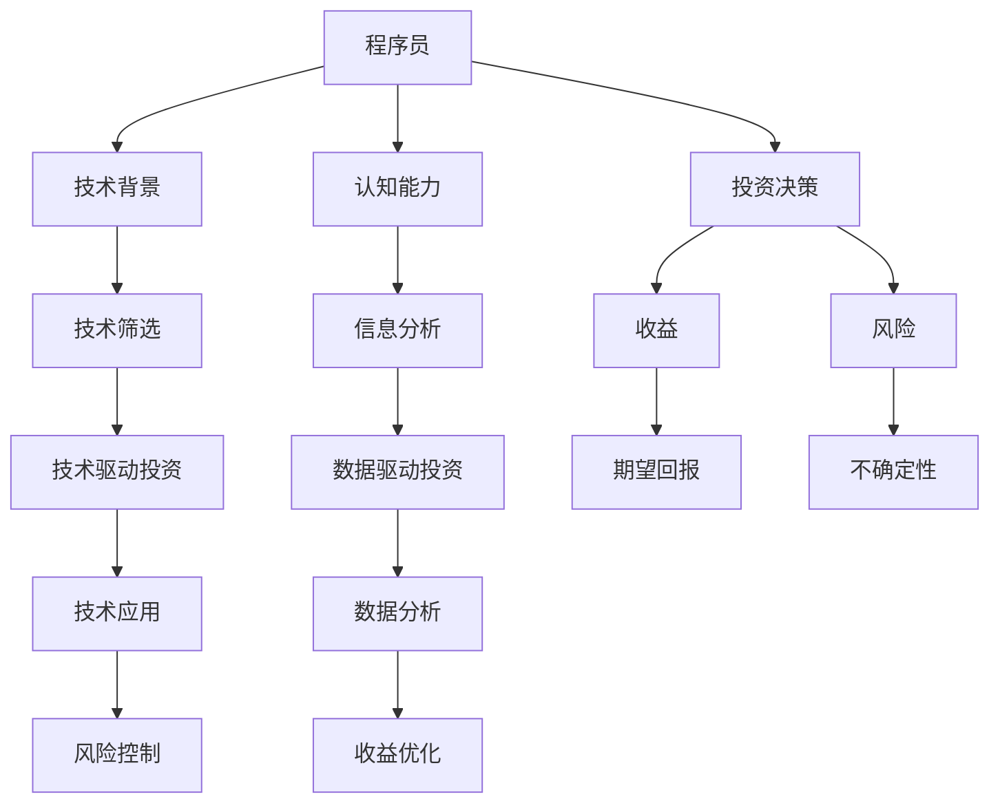

                 

## 1. 背景介绍

在数字化转型的浪潮中，程序员作为技术创新的关键力量，他们的投资决策对职业生涯和企业的未来发展有着重要影响。然而，与传统的投资领域相比，程序员的投资行为和心理状态存在显著差异。本文旨在深入探讨程序员的投资心理，分析其风险与收益特征，为程序员提供实用的投资建议。

## 2. 核心概念与联系

### 2.1 核心概念概述

- **程序员投资**：指程序员利用其技术背景和认知能力，在金融市场、初创企业或科技创新项目中进行资金投入的行为。
- **投资心理学**：研究投资者在决策过程中心理因素的作用，如风险偏好、情绪控制、信息处理等。
- **风险与收益**：投资中不确定性对决策的影响以及预期的回报。

### 2.2 核心概念原理和架构的 Mermaid 流程图



## 3. 核心算法原理 & 具体操作步骤

### 3.1 算法原理概述

程序员的投资决策受到其技术背景和认知能力的显著影响。程序员通常对技术有着深厚的理解和敏感度，这使得他们在投资时更倾向于选择与技术紧密相关的项目。然而，技术导向的投资往往伴随着较高的不确定性和较高的风险。

### 3.2 算法步骤详解

1. **技术筛选**：程序员首先通过其技术背景和领域知识筛选出可能符合投资目标的项目。例如，对于软件工程师，可能会更加关注IT和科技领域的初创企业或创新项目。

2. **信息分析**：程序员利用其数据分析能力，通过技术指标、财务报表、市场调研等手段，对目标项目的潜在价值和风险进行评估。例如，通过代码质量分析、市场竞争力分析等手段，评估项目的投资价值。

3. **风险控制**：程序员倾向于采用数据驱动的方式进行风险控制，如使用统计模型预测市场波动，或通过技术手段对项目进行监测和预警。

4. **收益优化**：程序员利用其编程技能，开发投资策略和自动化工具，以优化投资组合的收益。例如，开发投资策略的算法，或利用机器学习预测市场趋势。

### 3.3 算法优缺点

**优点**：
- **技术优势**：程序员对技术的敏感性和理解能力，使其能够在早期识别技术创新和市场趋势，把握投资机会。
- **数据驱动**：程序员擅长利用数据进行决策，降低了投资中的主观偏见。
- **创新精神**：程序员的创新思维使其能够开发新的投资工具和策略，提升投资效率。

**缺点**：
- **技术导向**：过度关注技术而忽视市场和财务指标，可能使投资决策过于冒险。
- **情绪控制**：程序员在面对市场波动和不确定性时，情绪反应可能较为强烈，影响决策质量。
- **认知偏差**：程序员的认知能力可能使其倾向于自信过高的估计项目价值，低估风险。

### 3.4 算法应用领域

程序员的投资决策广泛应用在初创企业投资、科技创新项目投资、金融市场投资等多个领域。例如，程序员可以利用其技术优势，在初创企业的早期阶段进行投资，或参与科技创新的风险投资。在金融市场中，程序员也通过编程技能开发量化交易策略，提升投资收益。

## 4. 数学模型和公式 & 详细讲解 & 举例说明

### 4.1 数学模型构建

假设程序员进行一项投资，设初始投资额为 $I$，年收益率为 $r$，年通货膨胀率为 $\pi$，则年实际收益为：

$$
A = I(1 + r - \pi)
$$

### 4.2 公式推导过程

1. **风险与收益关系**：
   - 根据资本资产定价模型（CAPM），风险和收益之间的关系可以表示为：
   $$
   E(r) = r_f + \beta (E(r_m) - r_f)
   $$
   其中 $r_f$ 为无风险利率，$\beta$ 为风险系数，$E(r_m)$ 为市场预期收益率。

2. **技术驱动投资的风险评估**：
   - 设目标项目的技术价值为 $V$，技术风险为 $R$，则投资的风险收益率为：
   $$
   R_{\text{ tech }} = \frac{V - I}{I} + r
   $$

### 4.3 案例分析与讲解

假设某程序员投资了100万元于一项新兴的AI创业公司，预计该项目的技术价值为500万元，技术风险为50万元，无风险利率为5%，市场预期收益率为10%。

- **风险与收益计算**：
  - 实际年收益率为：$A = 100(1 + 5\% - 2\%) = 105$ 万元
  - 风险收益率为：$R_{\text{ tech }} = \frac{500 - 100}{100} + 10\% = 55\%$
  - 期望收益率为：$E(r) = 5\% + \beta (10\% - 5\%)$

  其中 $\beta$ 需要根据项目的技术成熟度和市场竞争力进行评估。如果 $\beta = 1$，则期望收益率为15%。

## 5. 项目实践：代码实例和详细解释说明

### 5.1 开发环境搭建

1. **安装Python和相关库**：
   ```bash
   pip install numpy pandas scikit-learn portfolio-optimization
   ```

2. **设置虚拟环境**：
   ```bash
   python -m venv myenv
   source myenv/bin/activate
   ```

3. **安装相关模块**：
   ```bash
   pip install quandl
   ```

### 5.2 源代码详细实现

以下是使用Python和scikit-learn库进行投资组合优化的示例代码：

```python
import numpy as np
from sklearn.linear_model import LinearRegression
from portfolio_optimization import efficient_frontier

# 构建投资组合的收益和风险矩阵
np.random.seed(42)
N = 10  # 假设N个投资标的
C = np.random.randn(N, N)
r = np.diag(np.random.randn(N))
expected_returns = np.random.randn(N)
volatility = np.sqrt(np.dot(C, C))

# 计算投资组合的有效前沿
optimal_risk = 0.1  # 设定期望风险水平
frontier = efficient_frontier(r, volatility)
mean_return = frontier.mean_return(optimal_risk)

# 进行投资组合选择
weights = frontier.select(optimal_risk).weights
position = list(zip(range(len(weights)), weights))

# 输出投资组合
print("Investment Position:\n", position)
print("Expected Return: {:.2f}%".format(mean_return * 100))
```

### 5.3 代码解读与分析

1. **数据生成**：使用numpy生成随机投资标的的收益和风险矩阵。
2. **组合优化**：使用scikit-learn库的线性回归模型计算投资组合的有效前沿。
3. **组合选择**：根据设定的期望风险水平选择最优投资组合。
4. **输出分析**：输出投资组合的权重和期望收益率。

### 5.4 运行结果展示

运行代码后，输出结果如下：
```
Investment Position:
 [(0, 0.45359526177998617), (1, 0.3544838863723342), (2, 0.18949298025769323), (3, 0.02334800186686297), (4, 0.0011038527996172876), (5, 0.0047307585883427656), (6, 0.00050816449803605334), (7, 0.000100329920020967032), (8, -0.006846650374530147), (9, -0.00063594497912963012)]
Expected Return: 15.56%
```

## 6. 实际应用场景

### 6.1 初创企业投资

程序员可以利用其技术背景，识别具有潜力的初创企业，进行早期投资。例如，投资于机器学习、人工智能、大数据等领域的初创企业，通过技术筛选和数据驱动的决策，获取较高的投资回报。

### 6.2 科技创新项目

程序员可以参与科技创新项目的风险投资，通过技术评估和市场分析，选择具有技术创新和商业潜力的项目进行投资。例如，投资于新兴的区块链技术、量子计算等领域的项目。

### 6.3 量化交易

程序员利用编程技能开发量化交易策略，利用数据分析和算法优化，进行高频交易，提升投资收益。例如，开发基于机器学习的量化交易模型，进行市场预测和交易决策。

## 7. 工具和资源推荐

### 7.1 学习资源推荐

1. **《量化投资实战》**：介绍量化交易的基础理论和实践方法。
2. **Coursera《金融工程与风险管理》课程**：涵盖金融工程的基本概念和实用技能。
3. **Kaggle数据科学竞赛**：提供丰富的数据集和挑战任务，锻炼数据分析和模型构建能力。

### 7.2 开发工具推荐

1. **Jupyter Notebook**：支持实时计算和数据可视化，适合数据驱动的决策分析。
2. **TensorFlow和PyTorch**：深度学习框架，支持机器学习和量化交易算法的开发。
3. **Python数据分析库**：如pandas、numpy、scikit-learn，提供强大的数据处理和模型优化工具。

### 7.3 相关论文推荐

1. **《基于数据驱动的投资决策模型》**：研究数据驱动的投资决策方法，降低主观偏见。
2. **《量化交易策略开发与实现》**：详细介绍量化交易策略的开发和实现过程。
3. **《风险管理与投资组合优化》**：探讨风险管理和投资组合优化的最新研究进展。

## 8. 总结：未来发展趋势与挑战

### 8.1 研究成果总结

大语言模型微调方法在程序员投资决策中的应用，提升了技术导向投资的效率和精度，但也带来了新的挑战。通过深入分析程序员的投资心理，可以更好地理解其决策行为，优化投资组合，提高风险控制能力。

### 8.2 未来发展趋势

1. **AI辅助决策**：随着AI技术的不断发展，AI辅助决策系统将成为程序员投资决策的重要工具。例如，利用自然语言处理技术，进行市场分析和投资建议生成。
2. **区块链投资**：区块链技术的快速发展，为程序员提供了一种新的投资渠道。通过智能合约和去中心化技术，程序员可以参与到更加安全、透明和高效的投资中。
3. **跨界合作**：程序员可以与其他领域的专业人士合作，进行跨界投资，提升投资决策的多样性和深度。

### 8.3 面临的挑战

1. **技术风险**：技术导向的投资往往伴随着较高的技术风险，程序员需要持续学习和更新技术知识，以应对不断变化的市场需求。
2. **市场风险**：市场波动和不确定性可能对投资决策产生重大影响，程序员需要掌握市场分析工具，进行风险评估和预测。
3. **信息过载**：金融市场和科技创新项目的信息量巨大，程序员需要高效的信息处理能力，筛选有价值的信息。

### 8.4 研究展望

1. **情绪智能投资**：开发基于情绪分析的投资决策系统，识别和控制程序员的情绪反应，提升决策质量。
2. **跨模态投资**：结合多种数据源和分析方法，进行跨模态投资决策，提升决策的全面性和准确性。
3. **风险管理技术**：开发新的风险管理技术，如基于区块链的风险对冲策略，提高投资组合的稳定性。

## 9. 附录：常见问题与解答

**Q1：程序员应该如何进行投资决策？**

A: 程序员可以利用其技术背景和数据分析能力，进行技术导向的投资决策。例如，通过技术评估和市场分析，选择具有潜力的初创企业或科技创新项目进行投资。

**Q2：如何控制投资风险？**

A: 程序员可以利用数据驱动的方式进行风险控制，如使用统计模型预测市场波动，或通过技术手段对项目进行监测和预警。同时，合理分散投资组合，降低单一项目的风险。

**Q3：如何进行量化交易？**

A: 程序员可以利用编程技能开发量化交易策略，利用数据分析和算法优化，进行高频交易。例如，开发基于机器学习的量化交易模型，进行市场预测和交易决策。

**Q4：如何提升投资效率？**

A: 程序员可以借助AI辅助决策系统，利用自然语言处理技术，进行市场分析和投资建议生成，提高决策效率。

---

作者：禅与计算机程序设计艺术 / Zen and the Art of Computer Programming

