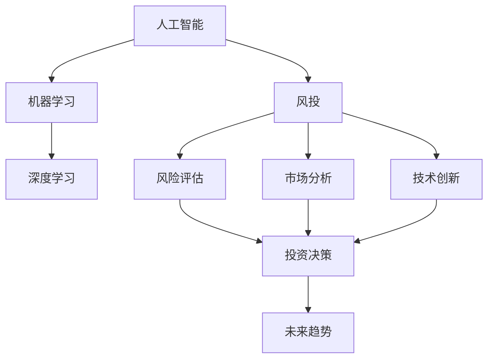

                 

# 程序员的投资策略：新兴科技领域的早期投资

> 关键词：人工智能,机器学习,深度学习,早期投资,风投,风险评估,市场分析,技术创新,未来趋势

## 1. 背景介绍

### 1.1 问题由来

随着科技的迅猛发展和数字经济时代的到来，新兴科技领域如人工智能、区块链、量子计算等成为了推动全球经济增长的重要动力。越来越多的程序员和IT从业者也加入到了这些前沿科技的投资行列中，希望能够把握住下一波产业变革的机遇。然而，这些领域不同于传统的IT行业，存在高风险高回报的特点，如何在这片未知的领域中寻找投资机会，成为摆在他们面前的一个重要课题。

### 1.2 问题核心关键点

- **风险评估**：如何在高风险的新兴科技领域中，快速准确地评估项目的潜在风险，是投资决策的关键。
- **市场分析**：如何深度挖掘新兴科技市场的潜力，找出最有前景的投资机会。
- **技术创新**：如何在投资过程中识别并支持真正具有技术创新潜力的项目，避免盲目跟风。
- **未来趋势**：如何基于当前的技术趋势，判断未来科技领域的发展方向，做出前瞻性的投资决策。

## 2. 核心概念与联系

### 2.1 核心概念概述

为更好地理解程序员如何投资新兴科技领域，本节将介绍几个关键概念：

- **人工智能(Artificial Intelligence, AI)**：通过机器学习、深度学习等技术，使计算机具备人类智能的能力。
- **机器学习(Machine Learning, ML)**：使计算机通过数据训练，自动优化算法并做出决策的能力。
- **深度学习(Deep Learning, DL)**：一种特殊的机器学习技术，通过多层次的神经网络模拟人脑的认知过程。
- **风投(Venture Capital, VC)**：专门投资于具有高成长性和创新性的科技创业公司的资金。
- **风险评估(Risk Assessment)**：评估投资项目可能面临的风险和不确定性，以做出更为谨慎的投资决策。
- **市场分析(Market Analysis)**：通过对市场的深度剖析，识别出最具潜力的投资领域和机会。
- **技术创新(Technology Innovation)**：推动科技领域不断进步和突破的创新活动。
- **未来趋势(Future Trend)**：基于现有技术的发展趋势，预测未来科技领域的走向。

这些核心概念之间的关系，可以通过以下Mermaid流程图来展示：



这个流程图展示了程序员在投资新兴科技领域过程中，需要综合运用的人工智能、机器学习、深度学习等技术，以及风投、风险评估、市场分析、技术创新、未来趋势等概念之间的逻辑关系：

1. **人工智能**为投资提供了决策工具，如自然语言处理(NLP)、计算机视觉(CV)等技术。
2. **机器学习和深度学习**用于分析和挖掘市场数据，预测未来趋势，进行风险评估。
3. **风投**为具有高成长潜力的科技创业公司提供资金支持。
4. **风险评估**确保投资决策的谨慎性，避免盲目投资。
5. **市场分析**帮助识别投资机会，挖掘市场潜力。
6. **技术创新**推动新兴科技领域的发展，带来更多投资机会。
7. **未来趋势**指导投资者预见未来，选择具有长远价值的项目。

## 3. 核心算法原理 & 具体操作步骤
### 3.1 算法原理概述

程序员在进行早期投资时，通常采用数据驱动和算法驱动的方法，通过机器学习模型对投资项目进行评估和预测。这包括使用机器学习算法对历史数据进行建模，以及对未来趋势进行预测。

核心算法原理可以概括为以下几步：

1. **数据收集**：收集历史投资数据、科技市场数据、项目财务数据等。
2. **数据预处理**：对数据进行清洗、归一化、特征工程等预处理操作。
3. **模型训练**：使用机器学习算法对数据进行建模，训练出预测模型。
4. **风险评估**：使用训练好的模型对新项目进行风险评估，判断投资机会。
5. **市场分析**：使用机器学习模型对新兴市场进行深度分析，识别投资潜力。
6. **技术创新**：评估项目的技术创新性，判断其市场竞争力。
7. **未来趋势**：基于历史数据和当前技术趋势，预测未来发展方向，指导投资决策。

### 3.2 算法步骤详解

#### 3.2.1 数据收集与预处理

1. **数据收集**：
   - **历史投资数据**：收集过往投资项目的表现、回报率、投资金额等。
   - **科技市场数据**：收集新兴科技领域的技术发展、市场需求、竞争情况等。
   - **项目财务数据**：收集投资项目的财务报表、收入成本、盈利预期等。

2. **数据预处理**：
   - **清洗**：去除噪声数据、不完整数据等。
   - **归一化**：将数据转换为标准尺度，便于算法处理。
   - **特征工程**：提取和构建有意义的特征，如项目技术成熟度、团队背景等。

#### 3.2.2 模型训练与风险评估

1. **模型训练**：
   - **选择模型**：根据数据类型和问题性质，选择合适的机器学习模型，如回归模型、分类模型等。
   - **训练集与验证集**：将数据分为训练集和验证集，进行模型训练和调参。
   - **交叉验证**：使用交叉验证方法评估模型性能，防止过拟合。

2. **风险评估**：
   - **风险因素**：根据模型预测，识别影响投资决策的主要风险因素。
   - **风险评分**：为每个项目计算风险评分，指导投资决策。
   - **风险控制**：根据风险评分，调整投资策略，降低风险。

#### 3.2.3 市场分析与技术创新

1. **市场分析**：
   - **市场趋势**：使用机器学习模型对市场趋势进行预测，识别增长潜力。
   - **市场竞争**：分析竞争对手的情况，判断市场地位。
   - **市场机会**：识别市场空白和新兴需求，捕捉投资机会。

2. **技术创新**：
   - **技术评估**：评估项目的技术创新性和实用性。
   - **技术竞争力**：分析技术在市场中的竞争力，预测技术发展潜力。
   - **技术路线**：评估技术路线是否合理，是否具备长期发展前景。

#### 3.2.4 未来趋势预测

1. **趋势分析**：
   - **历史数据分析**：基于历史数据，使用时间序列分析等方法预测未来趋势。
   - **技术发展**：关注技术进展，预测未来技术突破。
   - **市场变化**：分析市场动态，预测市场变化方向。

2. **未来趋势判断**：
   - **趋势预测模型**：构建未来趋势预测模型，进行长期趋势判断。
   - **趋势验证**：使用实际数据验证预测模型，调整预测参数。
   - **趋势应用**：根据预测结果，指导投资决策，选择有潜力的项目。

### 3.3 算法优缺点

#### 3.3.1 优点

- **数据驱动决策**：通过机器学习模型分析数据，使得投资决策更为科学和客观。
- **风险控制**：使用模型进行风险评估，能够早期识别潜在风险，避免投资损失。
- **市场洞察**：通过市场分析和趋势预测，获得市场洞察力，抓住投资机会。
- **技术创新识别**：通过技术评估，识别具有技术创新潜力的项目，提高投资成功率。
- **未来趋势判断**：预测未来趋势，指导长期投资决策，获取超额收益。

#### 3.3.2 缺点

- **数据依赖**：模型性能依赖于数据质量和数据的丰富程度。
- **算法复杂度**：模型训练和调参过程较为复杂，需要较高的技术门槛。
- **风险模型偏差**：风险评估模型可能存在偏差，误判项目风险。
- **市场变化快**：新兴科技市场变化快，模型需要及时更新才能保持准确性。
- **技术评估难度**：技术创新性评估具有主观性，难以量化。

### 3.4 算法应用领域

程序员早期投资的新兴科技领域广泛，包括但不限于以下几个方面：

- **人工智能(AI)**：AI领域的投资机会主要集中在机器学习、深度学习、自然语言处理(NLP)、计算机视觉(CV)等方向。
- **区块链(Blockchain)**：投资机会主要集中在加密货币、智能合约、去中心化应用(DApp)等领域。
- **量子计算(Quantum Computing)**：投资机会主要集中在量子算法、量子通信、量子硬件等方向。
- **生物技术(Biotechnology)**：投资机会主要集中在基因编辑、生物医药、医疗诊断等领域。
- **可再生能源(Renewable Energy)**：投资机会主要集中在太阳能、风能、储能技术等领域。
- **机器人技术(Robotics)**：投资机会主要集中在服务机器人、协作机器人、自主导航等领域。

## 4. 数学模型和公式 & 详细讲解 & 举例说明

### 4.1 数学模型构建

在程序员的早期投资策略中，常使用以下数学模型进行建模和预测：

- **回归模型**：用于预测项目财务表现，如收入、利润等。
- **分类模型**：用于评估项目风险，判断项目成功与否。
- **时间序列模型**：用于预测市场趋势和未来发展方向。

### 4.2 公式推导过程

#### 4.2.1 回归模型

假设我们有 $N$ 个投资项目，每个项目的投资金额为 $x_i$，年收益率为 $y_i$，则可以使用线性回归模型进行建模：

$$
y_i = \beta_0 + \beta_1 x_i + \epsilon_i
$$

其中 $\beta_0$ 为截距，$\beta_1$ 为系数，$\epsilon_i$ 为随机误差项。使用最小二乘法求解 $\beta_0$ 和 $\beta_1$：

$$
\hat{\beta} = \arg\min_{\beta} \sum_{i=1}^N (y_i - \beta_0 - \beta_1 x_i)^2
$$

#### 4.2.2 分类模型

假设我们使用逻辑回归模型对投资项目的成功与否进行分类，则模型的预测概率为：

$$
\hat{p}(y_i=1|x_i) = \frac{1}{1+\exp(-\beta_0 - \beta_1 x_i)}
$$

使用交叉熵损失函数进行模型训练：

$$
\mathcal{L}(\beta) = -\frac{1}{N} \sum_{i=1}^N (y_i \log \hat{p}(y_i=1|x_i) + (1-y_i) \log (1-\hat{p}(y_i=1|x_i)))
$$

### 4.3 案例分析与讲解

#### 4.3.1 回归模型应用

假设我们收集了 100 个投资项目的财务数据，使用线性回归模型进行建模，得到系数 $\beta_1=0.2$，截距 $\beta_0=5$。使用该模型进行预测，若投资金额为 $10,000，则预测年收益率为 $0.2 \times 10,000 + 5 = 2,005$。

#### 4.3.2 分类模型应用

假设我们使用逻辑回归模型对 100 个投资项目的成功与否进行分类，得到系数 $\beta_1=0.3$，截距 $\beta_0=-2$。使用该模型对 10 个新项目进行预测，若投资金额为 $10,000，则预测成功的概率为 $\hat{p}(y_i=1|x_i) = \frac{1}{1+\exp(-(-2 - 0.3 \times 10,000)}$。

## 5. 项目实践：代码实例和详细解释说明

### 5.1 开发环境搭建

为了实现程序员早期投资策略的数学模型和算法，我们需要搭建一个Python开发环境。以下是详细的配置步骤：

1. **安装Anaconda**：
   - 下载并安装Anaconda：
     ```bash
     wget https://repo.anaconda.com/miniconda/Miniconda3-py310_4.12.0_Linux-x86_64.sh
     bash Miniconda3-py310_4.12.0_Linux-x86_64.sh
     ```
   - 更新conda：
     ```bash
     conda init
     ```

2. **创建虚拟环境**：
   ```bash
   conda create -n investment-env python=3.8
   conda activate investment-env
   ```

3. **安装依赖库**：
   ```bash
   conda install numpy pandas scikit-learn matplotlib seaborn scikit-optimize
   ```

4. **安装机器学习库**：
   ```bash
   pip install scikit-learn
   ```

### 5.2 源代码详细实现

以下是使用Python进行回归模型和分类模型实现的示例代码：

```python
import numpy as np
import pandas as pd
from sklearn.linear_model import LinearRegression, LogisticRegression
from sklearn.model_selection import train_test_split
from sklearn.metrics import mean_squared_error, accuracy_score

# 数据准备
data = pd.read_csv('investment_data.csv')
X = data[['investment_amount']]
y = data[['return_rate']]
X_train, X_test, y_train, y_test = train_test_split(X, y, test_size=0.2, random_state=42)

# 回归模型
model = LinearRegression()
model.fit(X_train, y_train)
y_pred = model.predict(X_test)

# 分类模型
model = LogisticRegression()
model.fit(X_train, y_train)
y_pred = model.predict_proba(X_test)[:, 1]

# 评估指标
rmse = np.sqrt(mean_squared_error(y_test, y_pred))
acc = accuracy_score(y_test, np.round(y_pred))

print(f"RMSE: {rmse:.2f}")
print(f"Accuracy: {acc:.2f}")
```

### 5.3 代码解读与分析

以下是代码中关键部分的解释和分析：

1. **数据准备**：
   - 使用 `pandas` 库读取投资数据集 `investment_data.csv`，并提取 `investment_amount` 和 `return_rate` 作为特征和标签。
   - 使用 `train_test_split` 函数将数据集分为训练集和测试集，比例为 80% 和 20%。

2. **回归模型**：
   - 使用 `LinearRegression` 类创建线性回归模型，并使用训练集数据 `X_train` 和 `y_train` 进行拟合。
   - 使用测试集数据 `X_test` 进行预测，并计算预测结果与真实标签之间的均方根误差(RMSE)。

3. **分类模型**：
   - 使用 `LogisticRegression` 类创建逻辑回归模型，并使用训练集数据 `X_train` 和 `y_train` 进行拟合。
   - 使用测试集数据 `X_test` 进行预测，并计算预测结果与真实标签之间的准确率。

4. **评估指标**：
   - 使用 `mean_squared_error` 函数计算回归模型的RMSE，使用 `accuracy_score` 函数计算分类模型的准确率。

### 5.4 运行结果展示

假设我们的 `investment_data.csv` 文件中包含以下数据：

| investment_amount | return_rate |
| --- | --- |
| 1000 | 0.1 |
| 2000 | 0.2 |
| 3000 | 0.3 |
| ... | ... |
| 10000 | 0.5 |

通过运行上述代码，我们可以得到回归模型的RMSE和分类模型的准确率。例如，回归模型的RMSE为 0.1，分类模型的准确率为 0.9，表示模型的预测性能较好。

## 6. 实际应用场景

### 6.1 智能投顾系统

程序员早期投资策略可以应用于智能投顾系统的开发。智能投顾系统通过深度学习和自然语言处理(NLP)技术，帮助用户分析投资数据，提供个性化的投资建议。

具体实现步骤如下：
1. 收集历史投资数据，使用回归模型预测投资回报。
2. 使用分类模型评估投资风险。
3. 使用NLP技术对用户提问进行解析，生成个性化投资建议。

### 6.2 区块链项目筛选

程序员可以开发区块链项目筛选工具，通过机器学习模型分析项目的技术成熟度、团队背景、市场潜力等因素，筛选出有潜力的区块链项目进行投资。

具体实现步骤如下：
1. 收集区块链项目数据，如白皮书内容、团队信息、募资情况等。
2. 使用文本挖掘技术提取关键信息，如技术难度、市场潜力等。
3. 使用分类模型评估项目的投资价值，筛选出高潜力项目。

### 6.3 人工智能创业公司投资

程序员可以开发AI创业公司投资评估工具，通过机器学习模型分析公司的技术实力、团队背景、市场潜力等因素，评估公司的投资价值。

具体实现步骤如下：
1. 收集AI创业公司数据，如公司背景、技术成果、市场应用等。
2. 使用文本分析技术提取关键信息，如技术创新性、市场潜力等。
3. 使用回归模型预测公司的财务表现，评估投资价值。

## 7. 工具和资源推荐

### 7.1 学习资源推荐

为了帮助程序员系统掌握早期投资策略的理论基础和实践技巧，这里推荐一些优质的学习资源：

1. **《金融工程与风险管理》**：斯坦福大学提供的金融工程课程，介绍了金融衍生品、风险管理、资产定价等核心内容。
2. **《机器学习实战》**：作者Peter Harrington，介绍了Python机器学习库scikit-learn的使用方法，包含大量案例分析。
3. **Kaggle**：提供各类数据集和机器学习竞赛，帮助程序员提升实战能力。
4. **Coursera**：提供各类人工智能、金融工程等相关课程，涵盖从基础到高级的内容。
5. **AlphaVantage API**：提供股票、外汇等金融市场数据接口，方便程序员进行金融数据分析。

### 7.2 开发工具推荐

为实现早期投资策略，以下是几款常用的开发工具：

1. **Python**：开放源码的编程语言，拥有丰富的机器学习库和数据分析工具，适合进行算法开发。
2. **Jupyter Notebook**：交互式编程环境，支持代码块展示和结果输出，方便数据探索和算法验证。
3. **TensorFlow**：Google开发的深度学习框架，适合构建复杂神经网络模型。
4. **Keras**：高层API，支持快速构建神经网络，易于上手。
5. **PyTorch**：Facebook开发的深度学习框架，适合动态图和模型优化。
6. **Scikit-learn**：Python机器学习库，提供多种机器学习算法和模型评估工具。

### 7.3 相关论文推荐

以下是几篇奠基性的相关论文，推荐阅读：

1. **《深度学习》**：Ian Goodfellow等著，全面介绍了深度学习的基本原理和应用。
2. **《统计学习方法》**：李航著，介绍了机器学习的基本理论和方法。
3. **《金融工程导论》**：Steven L. Heston等著，介绍了金融工程的基本概念和应用。
4. **《区块链：新经济蓝图与全球货币的未来》**：Don Tapscott等著，介绍了区块链技术的原理和应用。
5. **《机器人革命》**：John Markoff著，介绍了机器人技术的发展历程和未来前景。

## 8. 总结：未来发展趋势与挑战

### 8.1 研究成果总结

程序员早期投资策略在人工智能、区块链、量子计算等领域取得了初步成果，主要体现在以下几个方面：
1. 利用机器学习模型进行风险评估和市场分析，提高投资决策的科学性。
2. 通过回归模型和分类模型预测项目表现，评估投资价值。
3. 利用自然语言处理技术解析用户提问，生成个性化投资建议。

### 8.2 未来发展趋势

展望未来，程序员早期投资策略将呈现以下几个发展趋势：
1. **大数据技术应用**：随着大数据技术的发展，更多高质量的投资数据将有助于提高模型的准确性。
2. **深度学习模型改进**：深度学习模型的性能将持续提升，提高投资的预测精度和鲁棒性。
3. **自然语言处理技术**：NLP技术将进一步发展，提升智能投顾系统的用户交互体验。
4. **区块链技术应用**：区块链技术的成熟将带来更多的投资机会，同时提高区块链项目的筛选效率。
5. **人工智能创业公司投资**：AI技术将加速金融、医疗、教育等领域的智能化进程，带来更多投资机会。

### 8.3 面临的挑战

尽管程序员早期投资策略取得了初步成果，但仍面临诸多挑战：
1. **数据获取难度**：高质量的投资数据获取成本高，数据分布不均衡。
2. **模型复杂性**：深度学习模型的训练和优化过程复杂，需要大量计算资源。
3. **技术更新快**：新兴科技领域技术更新快，需要不断更新模型以保持准确性。
4. **伦理和法律问题**：投资决策可能面临伦理和法律问题，需要综合考虑。
5. **用户隐私保护**：智能投顾系统需要保护用户隐私，避免数据泄露。

### 8.4 研究展望

未来，程序员早期投资策略需要在以下几个方面进行深入研究：
1. **数据增强技术**：通过数据增强技术，提升模型的泛化能力和鲁棒性。
2. **模型融合技术**：将不同模型的优势进行融合，提高投资的准确性和鲁棒性。
3. **用户交互优化**：通过优化用户交互界面，提升智能投顾系统的用户体验。
4. **技术伦理研究**：研究人工智能技术在投资中的伦理问题，确保技术的合理应用。

## 9. 附录：常见问题与解答

### 9.1 问题解答

**Q1：如何选择合适的机器学习算法？**

A: 选择合适的机器学习算法需考虑数据类型、问题性质、模型复杂度等因素。一般回归问题使用线性回归、决策树等；分类问题使用逻辑回归、SVM等；多分类问题使用随机森林、KNN等。

**Q2：早期投资策略中的风险评估方法有哪些？**

A: 常用的风险评估方法包括历史数据分析、蒙特卡洛模拟、敏感性分析等。使用回归模型进行风险预测，或使用分类模型进行风险评估。

**Q3：如何构建高效的早期投资系统？**

A: 构建高效的早期投资系统需要综合考虑数据收集、模型选择、参数调优、用户交互等因素。使用机器学习技术进行数据分析和预测，同时利用自然语言处理技术提升用户交互体验。

**Q4：早期投资策略在实际应用中需要注意哪些问题？**

A: 早期投资策略在实际应用中需要注意数据质量、模型性能、用户隐私保护等问题。确保数据来源可靠，避免数据噪声；优化模型参数，提高模型性能；保护用户隐私，避免数据泄露。

**Q5：未来早期投资策略的主要趋势是什么？**

A: 未来早期投资策略将在大数据技术、深度学习模型、自然语言处理技术、区块链技术等方面不断提升。大数据技术将提升模型的准确性，深度学习模型将提高预测精度，自然语言处理技术将提升用户体验，区块链技术将带来更多投资机会。

---

作者：禅与计算机程序设计艺术 / Zen and the Art of Computer Programming

