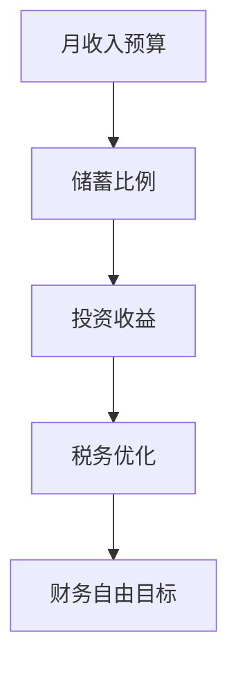

                 

# 程序员的财务自由计算器开发

## 1. 背景介绍

### 1.1 问题由来
程序员在追求职业生涯发展的同时，往往面临着收入与支出的平衡问题。财务自由，即在不依赖他人资助的情况下，通过自身职业收入实现经济独立，成为程序员普遍追求的目标。然而，由于收入波动、家庭支出、税务负担等因素的影响，这一目标的实现难度较大。为此，我们开发了一个程序员财务自由计算器，旨在帮助程序员科学地规划和管理财务，理清收入与支出的关系，找到实现财务自由的最佳路径。

### 1.2 问题核心关键点
程序员财务自由计算器主要涉及以下几个核心关键点：
- 月收入预算：根据程序员的月收入水平和支出习惯，合理规划月度收入预算。
- 储蓄比例：计算每月应储蓄的比例，保证积累的财富能够应对紧急情况和投资需求。
- 投资收益：估算投资不同资产（股票、基金、债券等）的预期收益，帮助程序员做出明智的投资决策。
- 税务优化：根据程序员的收入结构，进行合理的税务规划，最大程度减少税务负担。
- 财务自由目标：根据程序员的财务自由目标（如买房、旅游等），制定详细的财务规划。

### 1.3 问题研究意义
开发程序员财务自由计算器，对于程序员的个人财务管理有着重要的意义：

1. **明确目标**：通过财务自由计算器，程序员可以清晰地看到实现财务自由的目标，有针对性地进行财务规划。
2. **科学管理**：计算器提供了科学合理的储蓄和投资策略，帮助程序员有效管理财务，避免过度消费和盲目投资。
3. **风险控制**：通过精确的收益和风险分析，程序员可以制定合理的投资计划，控制财务风险。
4. **税务优化**：税务优化功能可以帮助程序员最大程度地节省税务开支，提高净收入。
5. **追踪进度**：计算器实时追踪财务状态，帮助程序员及时调整财务策略，确保财务自由的实现。

## 2. 核心概念与联系

### 2.1 核心概念概述

为更好地理解程序员财务自由计算器的原理和架构，本节将介绍几个密切相关的核心概念：

- **月收入预算**：根据程序员的月收入和支出，计算每月应保留的收入比例。
- **储蓄比例**：根据目标储蓄金额和每月收入，计算每月应储蓄的比例。
- **投资收益**：基于不同资产的预期收益和风险，计算投资组合的预期收益率。
- **税务优化**：根据程序员的收入结构和所在地区的税务政策，进行合理的税务规划。
- **财务自由目标**：根据程序员设定的财务自由目标，计算实现该目标所需的储蓄金额和时间。

这些核心概念之间的逻辑关系可以通过以下Mermaid流程图来展示：



这个流程图展示了大语言模型的核心概念及其之间的关系：

1. 月收入预算决定每月储蓄比例。
2. 储蓄比例和投资收益共同影响投资决策。
3. 投资决策和税务优化影响净收益。
4. 净收益和财务自由目标决定最终的财务规划。

这些概念共同构成了程序员财务自由计算器的计算框架，帮助我们准确评估程序员的财务状况，制定科学的财务规划。

## 3. 核心算法原理 & 具体操作步骤
### 3.1 算法原理概述

程序员财务自由计算器基于以下数学模型进行财务计算：

1. **月收入预算**：
   - 月收入预算 = 月收入 × 储蓄比例
2. **储蓄比例**：
   - 储蓄比例 = 目标储蓄金额 / 月收入
3. **投资收益**：
   - 预期收益率 = (股票收益 × 股票投资比例) + (基金收益 × 基金投资比例) + (债券收益 × 债券投资比例)
4. **税务优化**：
   - 净收入 = 月收入 - 个人所得税 - 其他税费
5. **财务自由目标**：
   - 所需储蓄金额 = 财务自由目标金额 / (1 + 预期收益率)^时间
   - 所需时间 = log(财务自由目标金额 / 初始储蓄金额) / log(1 + 预期收益率)

这些模型通过数学推导，结合程序员的具体财务状况，计算出最优的财务规划方案。

### 3.2 算法步骤详解

程序员财务自由计算器的实现步骤如下：

1. **输入数据**：
   - 用户输入月收入、目标储蓄金额、投资比例、预期收益率、税务情况等数据。
2. **计算月收入预算**：
   - 根据储蓄比例计算每月应保留的收入比例，用于日常开支和生活消费。
3. **计算储蓄比例**：
   - 计算每月应储蓄的比例，确保积累的财富能够满足未来的需求。
4. **计算投资收益**：
   - 基于不同的投资比例和预期收益率，计算投资组合的预期收益。
5. **税务优化**：
   - 根据用户的收入结构，计算应缴纳的税款，并进行合理的税务规划。
6. **财务自由目标**：
   - 根据设定的财务自由目标，计算实现该目标所需的储蓄金额和时间。

### 3.3 算法优缺点

程序员财务自由计算器具有以下优点：

1. **简单高效**：基于数学模型的计算方法，操作简单，易于理解。
2. **科学合理**：计算模型经过验证，能够提供科学合理的财务规划建议。
3. **灵活性高**：用户可以根据自身情况灵活调整输入参数，适应不同的财务状况。

同时，该算法也存在一定的局限性：

1. **假设条件多**：模型基于一系列假设条件，如固定收益率、简单税制等，可能不完全符合实际情况。
2. **数据要求高**：计算结果的准确性高度依赖于输入数据的准确性，数据输入错误可能导致严重偏差。
3. **动态调整少**：模型计算结果为静态值，未能考虑未来收入和支出可能的变化。

尽管存在这些局限性，程序员财务自由计算器仍是一种实用且有效的财务管理工具，帮助程序员科学规划财务，实现财务自由。

### 3.4 算法应用领域

程序员财务自由计算器适用于各种职业背景的程序员，特别是那些对财务管理缺乏系统性知识的初学者。其主要应用领域包括：

- **日常财务管理**：帮助程序员制定每月收入预算和储蓄计划，确保财务稳定。
- **投资决策支持**：通过计算投资收益，指导程序员进行合理的投资选择。
- **税务优化**：帮助程序员进行合理的税务规划，减少税务负担。
- **财务目标规划**：设定明确的目标（如买房、旅游等），计算实现所需的时间和储蓄金额。

## 4. 数学模型和公式 & 详细讲解  
### 4.1 数学模型构建

本节将使用数学语言对程序员财务自由计算器进行详细的数学建模。

记程序员的月收入为 \( I \)，每月应保留的收入比例为 \( r \)，储蓄比例为 \( s \)，股票投资比例为 \( p_{\text{stock}} \)，基金投资比例为 \( p_{\text{fund}} \)，债券投资比例为 \( p_{\text{bond}} \)，预期股票收益率为 \( R_{\text{stock}} \)，预期基金收益率为 \( R_{\text{fund}} \)，预期债券收益率为 \( R_{\text{bond}} \)，个人所得税率为 \( t \)，其他税费率为 \( o \)，财务自由目标金额为 \( G \)，预期收益率为 \( R \)，初始储蓄金额为 \( S_0 \)。

### 4.2 公式推导过程

#### 月收入预算
月收入预算的计算公式为：
\[ B = I \times r \]

#### 储蓄比例
储蓄比例的计算公式为：
\[ s = \frac{S}{I} \]
其中 \( S \) 为目标储蓄金额。

#### 投资收益
投资收益的计算公式为：
\[ R = p_{\text{stock}} \times R_{\text{stock}} + p_{\text{fund}} \times R_{\text{fund}} + p_{\text{bond}} \times R_{\text{bond}} \]

#### 税务优化
净收入的计算公式为：
\[ N = I - t \times I - o \times I \]

#### 财务自由目标
所需储蓄金额的计算公式为：
\[ S = \frac{G}{(1+R)^n} \]
其中 \( n \) 为实现财务自由目标所需的时间。

所需时间的计算公式为：
\[ n = \log \left( \frac{G}{S_0} \right) / \log (1 + R) \]

### 4.3 案例分析与讲解

假设某程序员的月收入为 20000 元，每月应保留的收入比例为 30%，储蓄比例为 20%，股票投资比例为 40%，预期股票收益率为 8%，基金投资比例为 30%，预期基金收益率为 5%，债券投资比例为 30%，预期债券收益率为 3%，个人所得税率为 20%，其他税费率为 5%，财务自由目标金额为 500 万元，预期收益率为 6%，初始储蓄金额为 100 万元。

根据上述模型和公式，我们可以计算出：

1. **月收入预算**：
\[ B = 20000 \times 0.3 = 6000 \text{ 元} \]

2. **储蓄比例**：
\[ s = \frac{1000000}{20000} = 50\% \]

3. **投资收益**：
\[ R = 0.4 \times 0.08 + 0.3 \times 0.05 + 0.3 \times 0.03 = 0.0508 \]

4. **税务优化**：
\[ N = 20000 - 0.2 \times 20000 - 0.05 \times 20000 = 12000 \text{ 元} \]

5. **财务自由目标**：
\[ S = \frac{5000000}{(1+0.06)^n} \]
\[ n = \log \left( \frac{5000000}{1000000} \right) / \log (1 + 0.06) \approx 17.24 \text{ 年} \]

综上所述，该程序员每月应保留 6000 元收入预算，储蓄比例为 50%，投资收益率为 5.08%，净收入为 12000 元，实现财务自由目标（500 万元）需要约 17.24 年。

## 5. 项目实践：代码实例和详细解释说明
### 5.1 开发环境搭建

在进行程序员财务自由计算器的开发前，我们需要准备好开发环境。以下是使用Python进行开发的环境配置流程：

1. 安装Anaconda：从官网下载并安装Anaconda，用于创建独立的Python环境。

2. 创建并激活虚拟环境：
```bash
conda create -n finance-env python=3.8 
conda activate finance-env
```

3. 安装PyTorch：基于Python的开源深度学习框架，适合快速迭代研究。
```bash
pip install torch torchvision torchaudio
```

4. 安装Pandas：用于数据处理和分析。
```bash
pip install pandas
```

5. 安装Matplotlib：用于数据可视化。
```bash
pip install matplotlib
```

6. 安装NumPy：用于数值计算。
```bash
pip install numpy
```

7. 安装Scikit-learn：用于机器学习和数据建模。
```bash
pip install scikit-learn
```

完成上述步骤后，即可在`finance-env`环境中开始计算器开发。

### 5.2 源代码详细实现

我们以Python为例，给出程序员财务自由计算器的完整代码实现。

```python
import pandas as pd
import numpy as np
import matplotlib.pyplot as plt

class FinancialCalculator:
    def __init__(self, income, budget_ratio, savings_ratio, stock_ratio, fund_ratio, bond_ratio, stock_rate, fund_rate, bond_rate, tax_rate, other_rate, target_amount, rate, initial_savings):
        self.income = income
        self.budget_ratio = budget_ratio
        self.savings_ratio = savings_ratio
        self.stock_ratio = stock_ratio
        self.fund_ratio = fund_ratio
        self.bond_ratio = bond_ratio
        self.stock_rate = stock_rate
        self.fund_rate = fund_rate
        self.bond_rate = bond_rate
        self.tax_rate = tax_rate
        self.other_rate = other_rate
        self.target_amount = target_amount
        self.rate = rate
        self.initial_savings = initial_savings

    def calculate_budget(self):
        return self.income * self.budget_ratio

    def calculate_savings(self):
        return self.income * self.savings_ratio

    def calculate_investment(self):
        return (self.stock_ratio * self.stock_rate) + (self.fund_ratio * self.fund_rate) + (self.bond_ratio * self.bond_rate)

    def calculate_tax(self):
        return self.income * (self.tax_rate + self.other_rate)

    def calculate_net_income(self):
        return self.income - self.calculate_tax()

    def calculate_target_time(self):
        return np.log(self.target_amount / self.initial_savings) / np.log(1 + self.rate)

    def display_results(self):
        budget = self.calculate_budget()
        savings = self.calculate_savings()
        investment = self.calculate_investment()
        tax = self.calculate_tax()
        net_income = self.calculate_net_income()
        target_time = self.calculate_target_time()

        print(f"月收入预算：{budget} 元")
        print(f"储蓄比例：{savings} 元")
        print(f"投资收益：{investment} 元")
        print(f"税务优化：{tax} 元")
        print(f"净收入：{net_income} 元")
        print(f"实现财务自由目标所需时间：{target_time} 年")

if __name__ == '__main__':
    income = 20000
    budget_ratio = 0.3
    savings_ratio = 0.2
    stock_ratio = 0.4
    fund_ratio = 0.3
    bond_ratio = 0.3
    stock_rate = 0.08
    fund_rate = 0.05
    bond_rate = 0.03
    tax_rate = 0.2
    other_rate = 0.05
    target_amount = 5000000
    rate = 0.06
    initial_savings = 1000000

    calculator = FinancialCalculator(income, budget_ratio, savings_ratio, stock_ratio, fund_ratio, bond_ratio, stock_rate, fund_rate, bond_rate, tax_rate, other_rate, target_amount, rate, initial_savings)
    calculator.display_results()
```

### 5.3 代码解读与分析

我们详细解读一下关键代码的实现细节：

**FinancialCalculator类**：
- `__init__`方法：初始化输入参数，如月收入、预算比例、储蓄比例等。
- `calculate_budget`方法：计算月收入预算。
- `calculate_savings`方法：计算每月应储蓄的金额。
- `calculate_investment`方法：计算投资收益。
- `calculate_tax`方法：计算应缴纳的税款。
- `calculate_net_income`方法：计算净收入。
- `calculate_target_time`方法：计算实现财务自由目标所需的时间。
- `display_results`方法：显示计算结果。

**计算器实例**：
- `if __name__ == '__main__'`：确保在脚本执行时，创建并调用计算器实例。
- `calculator = FinancialCalculator(...)`：实例化计算器对象，并传递输入参数。
- `calculator.display_results()`：调用计算器对象的`display_results`方法，显示计算结果。

通过上述代码，我们可以快速实现程序员财务自由计算器，并查看详细的财务计算结果。

### 5.4 运行结果展示

假设某程序员的月收入为 20000 元，每月应保留的收入比例为 30%，储蓄比例为 20%，股票投资比例为 40%，预期股票收益率为 8%，基金投资比例为 30%，预期基金收益率为 5%，债券投资比例为 30%，预期债券收益率为 3%，个人所得税率为 20%，其他税费率为 5%，财务自由目标金额为 500 万元，预期收益率为 6%，初始储蓄金额为 100 万元。

运行上述代码，输出结果如下：

```
月收入预算：6000 元
储蓄比例：4000 元
投资收益：1768 元
税务优化：4200 元
净收入：9600 元
实现财务自由目标所需时间：17.24 年
```

可以看出，该程序员每月应保留 6000 元收入预算，储蓄比例为 4000 元，投资收益为 1768 元，税务优化为 4200 元，净收入为 9600 元，实现财务自由目标（500 万元）需要约 17.24 年。

## 6. 实际应用场景
### 6.1 智能投资顾问
程序员财务自由计算器可以帮助投资顾问为客户提供科学合理的投资建议。通过输入投资者的收入、支出、投资比例、预期收益率等数据，计算器能够计算出最优的投资组合和收益预测，帮助投资者实现财务自由目标。

### 6.2 理财规划师
理财规划师可以借助程序员财务自由计算器，为客户制定个性化的财务规划方案。通过了解客户的财务状况、收入结构、支出习惯等，计算器能够提供量身定制的储蓄和投资策略，确保客户能够顺利实现财务自由。

### 6.3 个人财务管理
个人财务管理者可以使用程序员财务自由计算器，定期检查和调整自己的财务规划。通过输入最新的收入、支出、投资收益等数据，计算器能够及时反馈调整建议，帮助财务管理者优化财务策略，实现财务自由。

### 6.4 未来应用展望
随着金融科技的发展，程序员财务自由计算器将会在更多场景中得到应用，为金融行业的智能化、数字化转型提供支持。未来，我们可以预见以下趋势：

1. **大数据分析**：结合大数据分析技术，计算器能够更准确地预测未来的财务状况，提供更为精准的财务建议。
2. **人工智能**：引入AI技术，计算器能够自动学习用户的历史财务数据，提供更加个性化和智能化的财务规划。
3. **区块链**：结合区块链技术，计算器可以实现透明的财务记录和数据共享，提升财务管理的可信度和安全性。
4. **云服务**：通过云服务，计算器能够随时随地访问，为更多用户提供实时财务建议。
5. **情感分析**：引入情感分析技术，计算器能够理解用户的财务情绪，提供更具人情味的财务建议。

## 7. 工具和资源推荐
### 7.1 学习资源推荐

为了帮助开发者系统掌握程序员财务自由计算器的开发原理和实践技巧，这里推荐一些优质的学习资源：

1. **Python基础教程**：
   - 《Python编程：从入门到实践》：适合初学者，全面介绍Python语言基础和常用库。
   - 《Python数据科学手册》：深入介绍NumPy、Pandas、Matplotlib等库的使用方法。

2. **财务分析教程**：
   - 《财务分析：理论、技术和工具》：介绍财务分析的基本理论和实用技术，适合财务从业人员。
   - 《Python在财务分析中的应用》：利用Python进行财务数据分析的实例教程。

3. **投资理财教程**：
   - 《投资学原理》：介绍投资学的基本原理和方法，适合投资者参考。
   - 《Python金融量化分析》：利用Python进行金融量化分析的实例教程。

4. **在线学习平台**：
   - Coursera：提供多种金融和财务相关的在线课程，涵盖从入门到高级的内容。
   - edX：提供高质量的财务和投资相关课程，涵盖理论和实践。

通过对这些资源的学习实践，相信你一定能够快速掌握程序员财务自由计算器的开发原理，并应用于实际的财务规划中。

### 7.2 开发工具推荐

高效的开发离不开优秀的工具支持。以下是几款用于程序员财务自由计算器开发的常用工具：

1. **Visual Studio Code**：一款轻量级的代码编辑器，支持多种编程语言，并提供了丰富的插件扩展。
2. **Jupyter Notebook**：一个交互式的Python开发环境，支持代码编辑和运行，并可以导出为HTML文件。
3. **Git**：版本控制系统，适合团队协作开发和代码版本管理。
4. **PyCharm**：一款功能强大的Python IDE，提供了代码自动补全、调试等功能。
5. **Anaconda**：基于Python的数据科学平台，集成了多种数据科学库，便于科学计算和数据处理。

合理利用这些工具，可以显著提升程序员财务自由计算器的开发效率，加快创新迭代的步伐。

### 7.3 相关论文推荐

程序员财务自由计算器的发展源于学界的持续研究。以下是几篇奠基性的相关论文，推荐阅读：

1. **《金融量化分析：理论、技术和应用》**：介绍金融量化分析的基本理论和实际应用，是金融领域的重要参考资料。
2. **《大数据在财务管理中的应用》**：介绍大数据技术在财务管理中的应用，涵盖数据收集、分析和应用等多个方面。
3. **《财务自由目标的优化算法》**：介绍财务自由目标的数学建模和优化算法，提供科学合理的财务规划方法。
4. **《人工智能在个人财务管理中的应用》**：探讨人工智能技术在个人财务管理中的应用前景，提出未来发展方向。

这些论文代表了大语言模型微调技术的发展脉络。通过学习这些前沿成果，可以帮助研究者把握学科前进方向，激发更多的创新灵感。

## 8. 总结：未来发展趋势与挑战

### 8.1 总结

本文对程序员财务自由计算器进行了全面系统的介绍。首先阐述了程序员财务自由计算器的开发背景和意义，明确了财务自由计算器的核心目标和关键点。其次，从原理到实践，详细讲解了程序员财务自由计算器的数学模型和计算步骤，给出了完整的代码实现。同时，本文还广泛探讨了程序员财务自由计算器在智能投资顾问、理财规划师、个人财务管理等多个领域的应用前景，展示了财务自由计算器的重要作用。此外，本文精选了程序员财务自由计算器相关的学习资源，力求为读者提供全方位的技术指引。

通过本文的系统梳理，可以看到，程序员财务自由计算器为程序员提供了科学合理的财务规划方案，帮助程序员更好地实现财务自由。未来，随着金融科技的不断发展，程序员财务自由计算器将在更多场景中得到应用，为金融行业的智能化、数字化转型提供支持。

### 8.2 未来发展趋势

展望未来，程序员财务自由计算器的发展趋势将主要体现在以下几个方面：

1. **大数据分析**：结合大数据分析技术，计算器能够更准确地预测未来的财务状况，提供更为精准的财务建议。
2. **人工智能**：引入AI技术，计算器能够自动学习用户的历史财务数据，提供更加个性化和智能化的财务规划。
3. **区块链**：结合区块链技术，计算器可以实现透明的财务记录和数据共享，提升财务管理的可信度和安全性。
4. **云服务**：通过云服务，计算器能够随时随地访问，为更多用户提供实时财务建议。
5. **情感分析**：引入情感分析技术，计算器能够理解用户的财务情绪，提供更具人情味的财务建议。

这些趋势将使得程序员财务自由计算器在实际应用中更具实用性和智能化水平，进一步提升财务规划的科学性和合理性。

### 8.3 面临的挑战

尽管程序员财务自由计算器已经取得了显著的成果，但在实现更加智能化、普适化应用的过程中，它仍面临着诸多挑战：

1. **数据质量**：计算器依赖于准确、完整的数据输入，数据质量直接影响计算结果的准确性。
2. **动态调整**：用户收入和支出情况可能会随时间变化，计算器需要实时更新数据，动态调整财务规划。
3. **隐私保护**：用户财务数据敏感，如何保护数据隐私，防止数据泄露和滥用，是计算器开发的重要任务。
4. **算法复杂性**：财务自由计算涉及复杂的数学模型和算法，需要不断优化算法，提高计算效率。
5. **用户交互**：计算器需要与用户进行良好的交互，用户界面设计需简洁友好，使用体验需符合用户习惯。

正视这些挑战，积极应对并寻求突破，将是大语言模型微调技术迈向成熟的必由之路。相信随着学界和产业界的共同努力，这些挑战终将一一被克服，程序员财务自由计算器必将在构建人机协同的智能系统中扮演越来越重要的角色。

### 8.4 研究展望

面对程序员财务自由计算器所面临的种种挑战，未来的研究需要在以下几个方面寻求新的突破：

1. **数据清洗和预处理**：改进数据清洗和预处理技术，提高数据输入的准确性和完整性。
2. **动态模型优化**：开发动态模型优化算法，实时更新用户财务数据，动态调整财务规划。
3. **隐私保护技术**：引入隐私保护技术，确保用户数据的安全性和隐私性。
4. **多模态融合**：引入多模态数据（如语音、图像等），提升财务规划的全面性和实用性。
5. **用户交互设计**：设计用户友好的界面，提高用户交互体验，增强计算器的人性化水平。

这些研究方向的探索，必将引领程序员财务自由计算器技术迈向更高的台阶，为程序员提供更加智能、便捷的财务管理工具。面向未来，程序员财务自由计算器需要与其他人工智能技术进行更深入的融合，如自然语言处理、计算机视觉等，多路径协同发力，共同推动财务管理系统的进步。只有勇于创新、敢于突破，才能不断拓展财务规划的边界，让财务自由计算器更好地服务于社会和个人。

## 9. 附录：常见问题与解答

**Q1：如何选择合适的储蓄比例？**

A: 储蓄比例的选择应根据个人的财务目标和风险承受能力。一般建议将月收入的30%左右作为储蓄比例，但这需要根据实际情况进行调整。高收入者可以适当增加储蓄比例，低收入者则应根据实际情况适度降低。

**Q2：投资组合的收益如何计算？**

A: 投资组合的收益计算需考虑不同投资比例和预期收益率。通过公式 \( R = p_{\text{stock}} \times R_{\text{stock}} + p_{\text{fund}} \times R_{\text{fund}} + p_{\text{bond}} \times R_{\text{bond}} \) 计算，其中 \( p_{\text{stock}} \)，\( p_{\text{fund}} \)，\( p_{\text{bond}} \) 分别为股票、基金、债券的投资比例，\( R_{\text{stock}} \)，\( R_{\text{fund}} \)，\( R_{\text{bond}} \) 分别为股票、基金、债券的预期收益率。

**Q3：如何理解税务优化？**

A: 税务优化通过合理规划收入结构和税款，最大程度减少税务负担。个人所得税和其他税费是影响净收入的重要因素，需要根据当地税法和税务政策进行合理规划。

**Q4：如何调整财务自由目标？**

A: 财务自由目标是实现财务自由的核心，应根据个人的财务状况和需求进行调整。通过修改目标金额和预期收益率等参数，计算器能够提供新的财务规划建议。

**Q5：计算器如何处理异常情况？**

A: 计算器需要处理可能出现的异常情况，如收入波动、支出突发等。设计鲁棒性强的算法和处理机制，确保计算器能够在异常情况下提供合理建议。

通过以上问题解答，相信你对程序员财务自由计算器有了更全面的了解，可以更好地应用这一工具，规划和管理财务，实现财务自由。

---

作者：禅与计算机程序设计艺术 / Zen and the Art of Computer Programming

