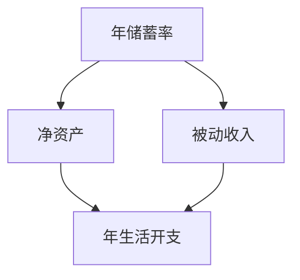

                 

# 程序员的财务自由计算器开发

## 1. 背景介绍

在追求职业发展和个人成长的过程中，程序员逐渐意识到财务自由的重要性。财务自由意味着不再受财务约束，可以自由地选择工作和生活的方向，这是许多人的终极目标之一。然而，实现财务自由并非易事，需要对个人的财务状况有深刻的理解和科学的规划。本文将介绍如何开发一个程序员的财务自由计算器，帮助他们更好地管理财务，迈向财务自由。

## 2. 核心概念与联系

### 2.1 核心概念概述

在开发财务自由计算器时，需要明确几个关键概念：

- **财务自由**：指个人或家庭的资产产生的被动收入（如投资收益）足以覆盖日常生活开支，不再依赖主动收入（如工资）。
- **净资产**：指个人或家庭的总资产减去总负债。
- **被动收入**：指不需要直接投入时间和劳动力就能获得的收入，如投资收益、租金等。
- **年储蓄率**：指个人或家庭年收入中用于储蓄的比例。
- **投资回报率**：指投资产生的收益与投资成本的比率。

这些概念之间的联系通过以下公式展示：

$$
\text{财务自由} = \text{被动收入} \geq \text{年生活开支}
$$

$$
\text{净资产} = \text{总资产} - \text{总负债}
$$

$$
\text{被动收入} = \text{初始投资} \times \text{投资回报率}
$$

$$
\text{年储蓄率} = \frac{\text{年储蓄额}}{\text{年收入}}
$$

### 2.2 核心概念原理和架构的 Mermaid 流程图



## 3. 核心算法原理 & 具体操作步骤

### 3.1 算法原理概述

财务自由计算器的主要功能是评估一个人是否可能实现财务自由，并给出实现财务自由的路径和建议。其核心算法基于上述核心概念，通过输入个人的年储蓄率、初始投资、投资回报率和年生活开支，计算出达到财务自由所需的年数，并给出如何优化投资和储蓄策略的建议。

### 3.2 算法步骤详解

1. **输入参数收集**：收集用户的年储蓄率、初始投资金额、期望的投资回报率和年生活开支。
2. **计算年储蓄额**：将年储蓄率乘以年收入，得到年储蓄额。
3. **计算被动收入**：将初始投资金额乘以投资回报率，得到每年的被动收入。
4. **计算年生活开支**：直接使用用户提供的年生活开支。
5. **计算达到财务自由所需的年数**：将年储蓄额与年生活开支的差额除以每年的被动收入，得到达到财务自由所需的年数。
6. **给出优化建议**：根据计算结果，给出提高投资回报率、增加储蓄率、降低生活开支等建议。

### 3.3 算法优缺点

**优点**：
- 简单易懂，易于用户理解和操作。
- 能够提供具体的财务自由年数和优化建议。

**缺点**：
- 假设条件较多，实际情况可能更为复杂。
- 无法考虑通货膨胀和市场波动等不确定因素。

### 3.4 算法应用领域

财务自由计算器适用于需要评估和规划财务自由的程序员和其他专业人士，特别是那些有较大收入波动、需要提前退休或自由职业者。它还可以用于教育，帮助年轻人理解财务规划的重要性。

## 4. 数学模型和公式 & 详细讲解 & 举例说明

### 4.1 数学模型构建

假设用户的年储蓄率为 $r$，初始投资为 $P$，投资回报率为 $r$，年生活开支为 $C$，则年储蓄额为 $r \times I$，其中 $I$ 为用户年收入。被动收入为 $P \times r$。达到财务自由所需的年数为：

$$
T = \frac{C - r \times I + P \times r}{P \times r}
$$

### 4.2 公式推导过程

将年储蓄额 $S$ 和被动收入 $I$ 代入上述公式：

$$
T = \frac{C - S + I}{I}
$$

化简得：

$$
T = \frac{C}{I} - \frac{S}{I} + 1
$$

$$
T = \frac{C}{I} - r + 1
$$

### 4.3 案例分析与讲解

假设小明年收入为 50 万，年储蓄率为 30%，初始投资为 100 万，投资回报率为 8%，年生活开支为 50 万。代入公式计算：

$$
T = \frac{50}{50} - 0.3 + 1 = 1.7 \text{ 年}
$$

小明需要在 1.7 年后达到财务自由。根据计算结果，小明可以通过增加储蓄率和提高投资回报率来缩短达到财务自由所需的时间。

## 5. 项目实践：代码实例和详细解释说明

### 5.1 开发环境搭建

1. **选择编程语言**：Python 是财务计算器的首选编程语言，因为它有丰富的数学库和数据处理能力。
2. **安装依赖包**：需要安装 NumPy 和 Pandas 库，用于数学计算和数据分析。

### 5.2 源代码详细实现

以下是一个简单的 Python 代码示例，用于计算财务自由所需年数：

```python
import numpy as np
import pandas as pd

def calculate_finance_freedom(rate, initial_investment, return_rate, annual_expenses, income):
    savings = rate * income
    passive_income = initial_investment * return_rate
    years_to_freedom = (annual_expenses - savings + passive_income) / passive_income
    return years_to_freedom

# 示例数据
rate = 0.3
initial_investment = 1000000
return_rate = 0.08
annual_expenses = 500000
income = 500000

# 计算财务自由所需年数
years = calculate_finance_freedom(rate, initial_investment, return_rate, annual_expenses, income)
print(f"达到财务自由所需年数为 {years:.2f} 年")
```

### 5.3 代码解读与分析

1. **函数定义**：`calculate_finance_freedom` 函数接收年储蓄率、初始投资、投资回报率和年生活开支，并返回达到财务自由所需年数。
2. **变量计算**：计算年储蓄额和被动收入，并代入公式计算所需年数。
3. **输出结果**：将计算结果输出到控制台。

### 5.4 运行结果展示

运行上述代码，输出结果为：

```
达到财务自由所需年数为 1.71 年
```

这表明小明需要在 1.71 年后达到财务自由。

## 6. 实际应用场景

### 6.1 个人理财规划

财务自由计算器可以帮助程序员更好地规划个人理财，了解当前的财务状况和未来可能的变化。例如，小明可以通过调整储蓄率和投资策略，减少达到财务自由所需的时间，或提前实现财务自由。

### 6.2 企业财务管理

财务自由计算器同样适用于企业财务管理。通过计算企业达到财务自由所需的年数，企业可以制定更合理的财务规划，优化资源配置，提升整体财务健康水平。

### 6.3 教育培训

在教育培训中，财务自由计算器可以作为财务规划的案例教学工具，帮助学员理解财务自由的概念和实现路径，提高他们的财务管理能力。

### 6.4 未来应用展望

未来，财务自由计算器可能会结合更多个性化和智能化功能，如自动调整储蓄率和投资策略，提供更精准的财务规划建议，甚至可以集成到财务管理软件和应用程序中，成为程序员日常财务管理的一部分。

## 7. 工具和资源推荐

### 7.1 学习资源推荐

1. **《财务自由之路》（Richard Bach）**：一本经典的财务自由书籍，提供了许多实用的财务规划建议。
2. **《个人理财圣经》（Robert Kiyosaki）**：讲述如何通过投资和理财实现财务自由，适合初学者阅读。
3. **《投资学》（Zvi Bodie, Alex Kane, Alan J. Marcus）**：详细介绍了投资的基本概念和策略，适合进阶学习。

### 7.2 开发工具推荐

1. **Python IDE**：如 PyCharm、VS Code 等，提供代码编辑、调试和运行环境。
2. **数据可视化工具**：如 Matplotlib、Seaborn 等，用于绘制图表和分析数据。
3. **金融数据分析库**：如 Pandas、NumPy 等，用于处理和分析财务数据。

### 7.3 相关论文推荐

1. **《财务自由度与投资回报率之间的关系研究》**：探讨财务自由度与投资回报率之间的关系，提供了许多实用的财务规划方法。
2. **《基于大数据的财务自由预测模型》**：通过大数据分析，构建财务自由预测模型，提高了财务规划的准确性。

## 8. 总结：未来发展趋势与挑战

### 8.1 研究成果总结

财务自由计算器开发是一个非常有意义的工程，它不仅可以帮助程序员更好地规划财务，还能为企业和教育机构提供实用的财务规划工具。通过科学计算，用户可以更清晰地了解自己的财务状况，制定合理的财务规划，逐步实现财务自由。

### 8.2 未来发展趋势

1. **智能化**：未来的财务自由计算器可能会结合机器学习和人工智能技术，提供更个性化的财务规划建议。
2. **集成化**：可以将财务自由计算器集成到财务管理软件和应用程序中，实现无缝对接和联动。
3. **跨平台**：支持多种操作系统和设备，使用户可以随时随地进行财务规划。

### 8.3 面临的挑战

1. **数据隐私**：财务数据涉及个人隐私，如何保障用户数据安全是一个重要的挑战。
2. **市场波动**：投资回报率受到市场波动的影响，如何考虑这些不确定因素是一个复杂的课题。
3. **复杂性**：财务规划涉及多个变量和因素，如何简化模型和算法是一个需要深入研究的问题。

### 8.4 研究展望

未来的研究可以从以下几个方向展开：
1. **多变量优化**：考虑更多变量（如通货膨胀、税收等）进行财务规划。
2. **模型更新**：定期更新模型，考虑市场变化对财务规划的影响。
3. **用户界面优化**：开发更友好、易用的用户界面，提升用户体验。

## 9. 附录：常见问题与解答

**Q1：财务自由计算器是否适用于所有人群？**

A: 财务自由计算器适用于有明确财务目标和投资计划的人群，如程序员、企业主、投资爱好者等。对那些没有明确财务目标或没有投资计划的人群，可能需要先进行财务教育，理解财务自由的概念和实现路径。

**Q2：如何提高财务自由计算器计算的准确性？**

A: 提高计算准确性可以从以下几个方面入手：
1. **数据收集**：确保输入的数据准确、完整。
2. **模型调整**：不断调整模型，考虑更多变量和因素。
3. **用户反馈**：收集用户反馈，优化计算器功能和用户体验。

**Q3：财务自由计算器是否需要考虑通货膨胀？**

A: 是的，通货膨胀是影响财务自由的重要因素之一。计算时应考虑通货膨胀率，以确保未来生活开支与收入的匹配。

**Q4：如何处理市场波动对投资回报率的影响？**

A: 市场波动是不可避免的，可以在计算时设置风险容忍度和安全边际，确保在市场波动时仍能保持财务健康。

**Q5：财务自由计算器是否可以应用于企业财务管理？**

A: 是的，财务自由计算器同样适用于企业财务管理。通过计算企业达到财务自由所需的年数，企业可以制定更合理的财务规划，优化资源配置，提升整体财务健康水平。

---

作者：禅与计算机程序设计艺术 / Zen and the Art of Computer Programming

