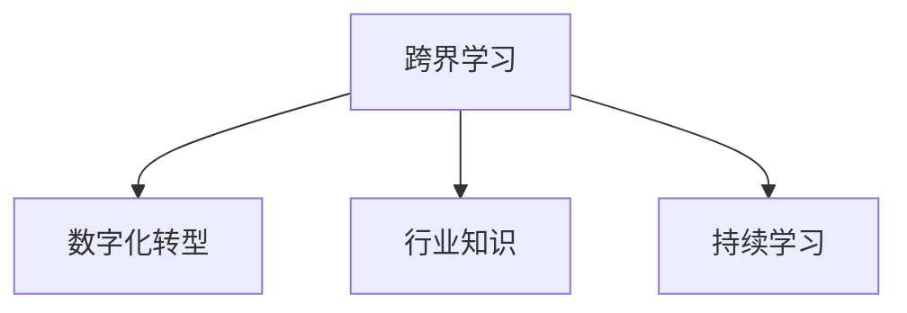

                 

## 1. 背景介绍

### 1.1 问题由来

在快速发展的数字化时代，计算机技术已经深刻渗透到各行各业，几乎每一个领域都在寻求数字化转型的机会。程序员，作为推动技术创新的主力军，面临着前所未有的机遇和挑战。

一方面，随着人工智能、大数据、区块链等前沿技术逐渐成熟并落地应用，程序员们的技能边界不断拓宽，机会也随之增多。但另一方面，技术的更新迭代速度之快，对程序员的学习能力和跨界适应能力提出了更高的要求。如何在有限的职业生涯中不断充实自己，提升技能，拓展职业发展，成为每个程序员都需要深思的问题。

### 1.2 问题核心关键点

本文旨在探讨程序员如何通过跨界学习拓宽职业发展的途径。我们将从以下几个核心概念入手：

- **跨界学习**：指程序员通过学习并掌握其他领域的知识和技能，实现技能拓展和职业转型。
- **数字化转型**：指传统行业通过引入和应用新技术，实现业务流程的优化和升级，从而提升企业竞争力的过程。
- **行业知识**：程序员需要掌握特定行业的应用场景、业务需求和技术栈，才能在跨界学习中更高效地解决问题。
- **持续学习**：在技术快速演变的今天，持续学习是程序员保持竞争力的关键。

通过深入理解这些核心概念，程序员可以更好地规划自己的职业路径，抓住数字化转型的机遇，实现职业发展的跨越。

### 1.3 问题研究意义

跨界学习不仅有助于程序员提升综合素质，增强竞争力，还可以帮助他们在不同领域找到更多的职业机会，实现自我价值。

- **技能提升**：通过学习新的技术和方法，程序员可以掌握更多工具，提升工作效率和质量。
- **职业转型**：跨界学习为程序员提供了更多职业发展的方向，如数据科学、产品管理、区块链等，拓宽了职业选择。
- **行业应用**：程序员可以将自己的技术能力应用于各行各业，解决实际问题，推动数字化转型。
- **跨学科创新**：跨界学习促进了技术与人文、艺术、科学等多学科的交叉，为创新提供更多可能性。

本文将详细探讨跨界学习的各个方面，帮助程序员在数字化时代中更好地发展和适应。

## 2. 核心概念与联系

### 2.1 核心概念概述

为更好地理解跨界学习及其与数字化转型的联系，本节将介绍几个密切相关的核心概念：

- **跨界学习**：指程序员通过学习其他领域的知识和技能，拓宽自己的知识面和技能树，从而提升综合素质和职业竞争力。
- **数字化转型**：指传统行业通过引入新技术、新方法，优化业务流程，提升运营效率和竞争力的过程。
- **行业知识**：指程序员需要具备特定行业的背景知识和技能，才能在跨界学习中更高效地应用技术解决实际问题。
- **持续学习**：指程序员需要保持学习的习惯，不断更新自己的知识和技能，以适应技术发展的需要。

这些概念之间的联系可以通过以下Mermaid流程图来展示：



这个流程图展示了大语言模型的核心概念及其之间的关系：

1. 跨界学习是推动数字化转型的重要手段。
2. 掌握行业知识是跨界学习的基础，只有在理解行业需求和痛点后，才能有效应用技术解决问题。
3. 持续学习是跨界学习的保障，只有不断更新知识，才能保持竞争力和创造力。

## 3. 核心算法原理 & 具体操作步骤

### 3.1 算法原理概述

跨界学习的过程本质上是知识的迁移和融合。程序员通过学习新的领域知识，将其与原有的编程技能相结合，形成新的能力，从而拓宽职业发展路径。这一过程涉及到以下关键算法和原理：

- **知识迁移**：指将一个领域内的知识和技能迁移到另一个领域。
- **技术融合**：指将新技术与原有技术相结合，形成更高效、更灵活的解决方案。
- **多领域整合**：指将多个领域的知识进行整合，形成跨学科的创新能力。

这些原理和算法为程序员提供了跨界学习的框架，帮助他们在数字化转型中寻找新的职业机会。

### 3.2 算法步骤详解

跨界学习的具体步骤包括以下几个关键环节：

**Step 1: 确定学习目标**
- 明确自己希望通过跨界学习掌握的新技能和知识领域。
- 选择与自己现有技能和兴趣相符合的跨界方向。

**Step 2: 获取基础知识**
- 学习新领域的入门知识，包括基础概念、常用工具和技术栈。
- 通过在线课程、书籍、论坛等途径获取知识，逐步构建知识体系。

**Step 3: 实践应用**
- 将新知识应用到实际项目中，巩固理解。
- 尝试解决实际问题，提升技能。

**Step 4: 跨领域整合**
- 将新知识与原有编程技能相结合，形成新的解决方案。
- 参加跨学科项目，与其他领域的专家合作，提升综合素质。

**Step 5: 持续学习**
- 定期更新知识，保持学习的热情和动力。
- 关注新技术的发展，不断提升自己的竞争力。

### 3.3 算法优缺点

跨界学习具有以下优点：

1. **提升综合素质**：通过跨界学习，程序员可以拓宽知识面，提升综合素质，增强职业竞争力。
2. **拓展职业机会**：跨界学习为程序员提供了更多的职业发展方向，拓宽了职业选择。
3. **推动创新**：跨界学习促进了技术与人文、艺术、科学等多学科的交叉，为创新提供更多可能性。

同时，跨界学习也存在一定的局限性：

1. **时间成本高**：跨界学习需要投入大量时间精力，短期内可能难以看到明显效果。
2. **知识体系复杂**：跨界学习的知识体系往往比较复杂，需要较强的自学能力。
3. **应用场景有限**：不是所有的跨界学习都适用于所有的行业，需要根据实际情况选择。

尽管存在这些局限性，但就目前而言，跨界学习仍然是程序员拓宽职业发展的有效手段。未来相关研究的重点在于如何进一步降低跨界学习的门槛，提高学习的效率和效果，同时兼顾跨界学习对已有工作的干扰。

### 3.4 算法应用领域

跨界学习的应用领域非常广泛，几乎涵盖了所有行业。以下是几个典型的应用场景：

- **数据科学**：程序员可以通过学习数据分析、统计学等知识，提升数据处理和建模能力，推动企业决策科学化。
- **产品管理**：程序员可以学习产品设计和用户体验设计，提升产品竞争力。
- **区块链**：程序员可以学习区块链技术和智能合约编程，参与去中心化应用开发。
- **人工智能**：程序员可以学习机器学习、深度学习等知识，提升人工智能应用开发能力。
- **自动化测试**：程序员可以学习自动化测试工具和技术，提升软件质量和开发效率。

除了上述这些领域，跨界学习还可以应用于健康医疗、金融科技、教育科技等更多行业，为程序员职业发展提供了广阔的空间。

## 4. 数学模型和公式 & 详细讲解

### 4.1 数学模型构建

在跨界学习的过程中，数学模型可以帮助程序员系统化地理解新知识，并构建更高效的学习框架。

假设程序员学习新领域 $X$ 需要掌握的知识量为 $K_X$，原有编程技能 $Y$ 的知识量为 $K_Y$。跨界学习的过程可以表示为：

$$
K_{XY} = K_X + K_Y + \epsilon
$$

其中 $\epsilon$ 为学习过程中的误差项，代表跨界学习可能遇到的困难和挑战。

### 4.2 公式推导过程

根据上述模型，我们可以推导出跨界学习的关键步骤：

1. **获取基础知识**：通过学习，获取新领域 $X$ 的基础知识 $K_X$。
2. **实践应用**：将 $K_X$ 应用于实际项目中，提升应用能力 $K_{XY}$。
3. **跨领域整合**：将 $K_X$ 与 $Y$ 整合，形成新的知识 $K_{XY}$。
4. **持续学习**：通过持续学习，不断更新 $K_X$ 和 $K_Y$，优化 $K_{XY}$。

### 4.3 案例分析与讲解

以下是一个简单的案例，展示程序员如何通过跨界学习拓展职业发展的路径：

**案例背景**：
小张是一名前端工程师，擅长 JavaScript 和 React。他希望拓展职业发展，考虑学习机器学习领域。

**步骤 1: 确定学习目标**
- 学习目标：掌握机器学习算法，并应用到前端开发中，提升数据驱动的开发能力。

**步骤 2: 获取基础知识**
- 学习 Python 和 TensorFlow。
- 参加在线课程，掌握基本的机器学习算法和模型。

**步骤 3: 实践应用**
- 开发一个基于机器学习的前端应用，如推荐系统或图像识别应用。
- 使用 TensorFlow 实现算法，并通过 React 构建用户界面。

**步骤 4: 跨领域整合**
- 将机器学习技术与前端开发技术结合，形成新的解决方案。
- 参加相关项目，与其他领域的专家合作，提升综合素质。

**步骤 5: 持续学习**
- 定期更新知识，关注新技术发展，不断提升自己的竞争力。

通过这个案例，我们可以看到跨界学习的过程如何帮助程序员在多个领域中实现技能的整合和提升。

## 5. 项目实践：代码实例和详细解释说明

### 5.1 开发环境搭建

在进行跨界学习项目实践前，我们需要准备好开发环境。以下是使用Python进行机器学习和前端开发的开发环境配置流程：

1. 安装Anaconda：从官网下载并安装Anaconda，用于创建独立的Python环境。

2. 创建并激活虚拟环境：
```bash
conda create -n ml-env python=3.8 
conda activate ml-env
```

3. 安装必要的Python包：
```bash
conda install numpy scipy matplotlib pandas scikit-learn torch
```

4. 安装Node.js 和 npm：
```bash
sudo apt-get install nodejs
npm install -g npm
```

5. 安装React环境：
```bash
npx create-react-app project-name
cd project-name
npm install
```

完成上述步骤后，即可在`ml-env`环境中开始跨界学习项目实践。

### 5.2 源代码详细实现

下面我们以一个简单的机器学习在前端应用的实例，展示如何使用Python和React实现跨界学习项目。

**项目名称**：基于机器学习的推荐系统

**项目描述**：
开发一个简单的推荐系统，通过学习用户的历史行为数据，推荐用户可能感兴趣的商品。

**步骤 1: 数据准备**
- 准备商品数据和用户行为数据，用于训练模型和展示推荐结果。

**步骤 2: 模型训练**
- 使用TensorFlow和Keras库，训练基于协同过滤的推荐模型。

**步骤 3: 前端展示**
- 使用React框架，构建用户界面，展示推荐结果。

**源代码实现**：

```python
import tensorflow as tf
from tensorflow.keras.layers import Input, Embedding, Dense, Flatten, Concatenate
from tensorflow.keras.models import Model

# 定义模型
def recommendation_model():
    user_input = Input(shape=(1,), name='user')
    item_input = Input(shape=(1,), name='item')
    user_embedding = Embedding(100, 32, name='user_embedding')(user_input)
    item_embedding = Embedding(100, 32, name='item_embedding')(item_input)
    concat = Concatenate()([user_embedding, item_embedding])
    prediction = Dense(1, activation='sigmoid', name='prediction')(concat)
    model = Model(inputs=[user_input, item_input], outputs=prediction)
    return model

# 编译模型
model = recommendation_model()
model.compile(loss='binary_crossentropy', optimizer='adam', metrics=['accuracy'])

# 训练模型
model.fit(x_train, y_train, epochs=10, batch_size=32)

# 使用模型进行推荐
def recommend(user_id, item_ids):
    user_input = np.array([user_id])
    item_input = np.array(item_ids)
    prediction = model.predict([user_input, item_input])
    return prediction[0]

# 前端展示推荐结果
import React, { useState } from 'react';

function RecommendationSystem() {
    const [user_id, setUser_id] = useState(0);
    const [item_ids, setItem_ids] = useState([]);
    const [predictions, setPredictions] = useState([]);

    const handleUserInput = (event) => {
        setUser_id(parseInt(event.target.value));
    };

    const handleItemInput = (event) => {
        const item_ids = event.target.value.split(',');
        setItem_ids(item_ids);
    };

    const handlePredict = () => {
        const predictions = recommendation_model.predict([user_id, item_ids]);
        setPredictions(predictions);
    };

    return (
        <div>
            <label>User ID:</label>
            <input type="number" onChange={handleUserInput} />

            <label>Item IDs (comma-separated):</label>
            <input type="text" onChange={handleItemInput} />

            <button onClick={handlePredict}>Predict</button>

            <h2>Recommendation:</h2>
            <p>{predictions[0].toFixed(2)}</p>
        </div>
    );
}

export default RecommendationSystem;
```

### 5.3 代码解读与分析

让我们再详细解读一下关键代码的实现细节：

**数据准备**：
- 使用Pandas库，读取商品数据和用户行为数据，进行数据清洗和预处理。

**模型训练**：
- 使用TensorFlow和Keras库，构建基于协同过滤的推荐模型。
- 通过fit方法训练模型，并保存模型到磁盘。

**前端展示**：
- 使用React框架，构建用户界面，展示推荐结果。
- 通过组件状态管理，实现用户输入、模型预测和结果展示的动态更新。

通过这个简单的项目，可以看到跨界学习在实际应用中的实现过程。虽然这个项目只是跨界学习的一个雏形，但通过这个案例，程序员可以更好地理解跨界学习的思路和实践方法。

## 6. 实际应用场景

### 6.1 智能客服系统

跨界学习在智能客服系统中的应用，可以显著提升客服系统的智能化水平。传统的客服系统依赖于规则和脚本，难以应对复杂多变的用户需求。通过跨界学习，客服系统可以借助自然语言处理(NLP)技术，实现更加智能化的客户交互。

**具体实现**：
- 学习NLP相关的知识，掌握自然语言处理的基本技能。
- 结合NLP技术，构建智能客服系统，实现自动化应答、情感分析等功能。
- 定期更新系统，保持对新知识的吸收和适应能力。

通过跨界学习，客服系统可以更高效地处理用户请求，提升客户满意度，降低人力成本。

### 6.2 金融科技

金融科技是跨界学习的重要应用领域之一。通过学习金融领域的相关知识，程序员可以构建智能化的金融产品，提升金融服务的智能化水平。

**具体实现**：
- 学习金融学、统计学、数据分析等知识。
- 结合机器学习技术，构建智能推荐系统、信用评分系统等应用。
- 应用区块链技术，构建去中心化的金融应用。

通过跨界学习，金融科技可以更有效地防范金融风险，提升金融服务的效率和质量。

### 6.3 医疗健康

医疗健康是另一个跨界学习的重点领域。通过学习医疗领域的知识，程序员可以开发出智能化的医疗应用，提升医疗服务的水平。

**具体实现**：
- 学习医疗数据处理、医学知识、数据分析等知识。
- 结合机器学习技术，构建智能诊断系统、药物推荐系统等应用。
- 应用区块链技术，构建医疗数据的共享和存储平台。

通过跨界学习，医疗健康可以实现更精准的诊断和治疗，提升医疗服务的可及性和效率。

### 6.4 未来应用展望

随着技术的发展，跨界学习的应用领域将会更加广泛。未来，跨界学习将成为程序员拓宽职业发展的重要手段，带来更多的机遇和挑战。

**未来趋势**：
1. **跨学科融合**：跨界学习将促进不同学科之间的融合，推动更多创新应用的出现。
2. **技术发展**：新技术的发展将为跨界学习提供更多可能，如人工智能、大数据、物联网等。
3. **跨领域合作**：跨界学习需要不同领域的专业知识，合作将更加重要。
4. **持续学习**：持续学习将成为跨界学习的基础，保持学习热情和动力。

## 7. 工具和资源推荐

### 7.1 学习资源推荐

为了帮助程序员系统掌握跨界学习的理论和实践方法，以下是一些优质的学习资源：

1. **《机器学习实战》**：由Wesley Chun撰写，通过实践项目，帮助读者深入理解机器学习的基本原理和应用。
2. **Coursera**：提供来自全球顶尖大学和机构的在线课程，覆盖机器学习、数据科学、计算机科学等多个领域。
3. **Kaggle**：数据科学竞赛平台，提供丰富的数据集和挑战，帮助程序员提升实战能力。
4. **GitHub**：开源代码托管平台，汇集了大量高质量的跨界学习项目，供程序员学习和参考。
5. **Medium**：技术博客平台，收录了大量关于跨界学习的高质量文章，帮助程序员了解行业动态和技术趋势。

通过学习这些资源，程序员可以更好地理解跨界学习的核心概念和实践方法，提升跨界学习的效率和效果。

### 7.2 开发工具推荐

高效的开发离不开优秀的工具支持。以下是几款用于跨界学习开发的常用工具：

1. **Python**：Python是跨界学习中最为常用的编程语言，支持丰富的第三方库和框架，如TensorFlow、PyTorch、NumPy等。
2. **Jupyter Notebook**：交互式编程环境，适合数据分析和机器学习项目开发。
3. **Git**：版本控制系统，帮助程序员管理代码版本，促进协作开发。
4. **Docker**：容器化技术，帮助程序员构建可移植、可复制的应用环境。
5. **IDEA**：智能代码编辑器，支持代码自动补全、错误提示等功能，提升编程效率。

合理利用这些工具，可以显著提升跨界学习项目的开发效率，加快创新迭代的步伐。

### 7.3 相关论文推荐

跨界学习的研究源于学界的持续探索。以下是几篇奠基性的相关论文，推荐阅读：

1. **《机器学习实战》**：作者Wesley Chun，通过实践项目，帮助读者深入理解机器学习的基本原理和应用。
2. **Coursera**：提供来自全球顶尖大学和机构的在线课程，覆盖机器学习、数据科学、计算机科学等多个领域。
3. **Kaggle**：数据科学竞赛平台，提供丰富的数据集和挑战，帮助程序员提升实战能力。
4. **GitHub**：开源代码托管平台，汇集了大量高质量的跨界学习项目，供程序员学习和参考。
5. **Medium**：技术博客平台，收录了大量关于跨界学习的高质量文章，帮助程序员了解行业动态和技术趋势。

这些论文代表了大语言模型微调技术的发展脉络。通过学习这些前沿成果，可以帮助研究者把握学科前进方向，激发更多的创新灵感。

## 8. 总结：未来发展趋势与挑战

### 8.1 总结

本文对跨界学习的背景、核心概念和实践方法进行了全面系统的介绍。首先阐述了跨界学习的意义和应用，明确了跨界学习在推动数字化转型、拓宽职业发展路径中的独特价值。其次，从原理到实践，详细讲解了跨界学习的数学模型和操作步骤，给出了跨界学习任务开发的完整代码实例。同时，本文还广泛探讨了跨界学习在智能客服、金融科技、医疗健康等多个行业领域的应用前景，展示了跨界学习范式的巨大潜力。最后，精选了跨界学习的各类学习资源，力求为读者提供全方位的技术指引。

通过本文的系统梳理，可以看到，跨界学习是程序员拓宽职业发展的有效手段，不仅能提升综合素质，还能开拓更多的职业机会。未来，伴随技术的发展和应用的深化，跨界学习必将在数字化转型中发挥更大的作用，为程序员的职业发展带来更多机遇和挑战。

### 8.2 未来发展趋势

展望未来，跨界学习技术将呈现以下几个发展趋势：

1. **技术融合**：跨界学习将促进更多技术的融合，如人工智能、大数据、区块链等，推动跨界学习的深入发展。
2. **应用扩展**：跨界学习的应用领域将进一步扩展，涵盖更多行业，为程序员提供更多的职业发展机会。
3. **持续学习**：持续学习将成为跨界学习的常态，帮助程序员保持竞争力和创造力。
4. **多领域整合**：跨界学习将促进不同领域的整合，推动跨学科的创新应用。

以上趋势凸显了跨界学习的广阔前景。这些方向的探索发展，必将进一步提升跨界学习的效果和应用，为程序员职业发展提供更多可能。

### 8.3 面临的挑战

尽管跨界学习技术已经取得了显著成果，但在迈向更加智能化、普适化应用的过程中，仍面临诸多挑战：

1. **时间成本高**：跨界学习需要投入大量时间精力，短期内可能难以看到明显效果。
2. **知识体系复杂**：跨界学习的知识体系往往比较复杂，需要较强的自学能力。
3. **应用场景有限**：不是所有的跨界学习都适用于所有的行业，需要根据实际情况选择。
4. **技术更新快**：跨界学习领域技术更新速度快，需要持续学习和更新知识。

尽管存在这些挑战，但就目前而言，跨界学习仍然是程序员拓宽职业发展的有效手段。未来相关研究的重点在于如何进一步降低跨界学习的门槛，提高学习的效率和效果，同时兼顾跨界学习对已有工作的干扰。

### 8.4 研究展望

面对跨界学习面临的种种挑战，未来的研究需要在以下几个方面寻求新的突破：

1. **教育与培训**：开发更多高质量的在线课程和实战项目，帮助程序员系统学习跨界知识，提升学习效率。
2. **工具和平台**：开发更加智能化的开发工具和平台，提升跨界学习的效率和效果。
3. **行业应用**：推动跨界学习在更多行业的应用，探索更多创新应用场景。
4. **持续学习**：建立持续学习的机制，帮助程序员保持学习热情和动力。

这些研究方向的探索，必将引领跨界学习技术迈向更高的台阶，为程序员职业发展提供更多机遇和挑战。总之，跨界学习需要程序员不断学习、实践、创新，才能在数字化时代中保持竞争力，拓展职业发展空间。

## 9. 附录：常见问题与解答

**Q1：跨界学习是否适用于所有程序员？**

A: 跨界学习对程序员的学习能力、时间安排和职业规划有较高要求。一般来说，跨界学习适合已经有一定编程基础和项目经验的程序员，他们能够快速上手新领域的知识，并应用于实际项目中。但对于初学者或缺乏编程基础的程序员，跨界学习需要更多时间和精力。

**Q2：如何选择合适的跨界学习方向？**

A: 选择跨界学习方向时，需要考虑自己的兴趣、技能和市场需求。可以通过以下几个步骤进行选择：
1. 评估自己的现有技能和知识储备。
2. 分析行业趋势和需求，选择有前景的方向。
3. 参加相关培训和课程，了解新领域的基本知识。
4. 选择适合自己的项目进行实践，逐步提升技能。

**Q3：跨界学习过程中如何保持学习动力？**

A: 保持学习动力是跨界学习的关键。以下是一些建议：
1. 设定明确的学习目标，并逐步实现。
2. 参加在线社区和论坛，与同行交流经验。
3. 加入学习小组或跨界学习项目，互相支持和鼓励。
4. 定期总结和反思，调整学习策略和计划。

通过这些方法，程序员可以更好地保持学习动力，持续提升跨界学习的效果。

---

作者：禅与计算机程序设计艺术 / Zen and the Art of Computer Programming

