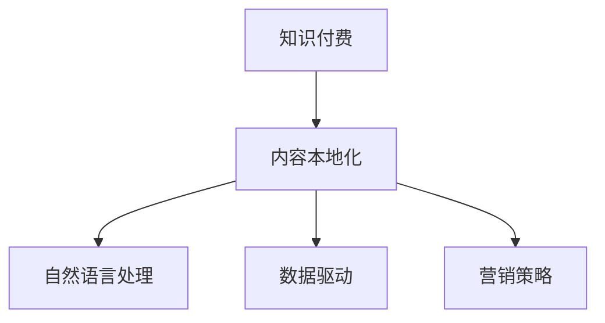

                 

# 程序员知识付费的内容本地化策略

> 关键词：知识付费, 内容本地化, 人工智能, 数据驱动, 自然语言处理, 营销策略

## 1. 背景介绍

### 1.1 问题由来

在数字化时代，知识付费已成为一种新兴的商业模式。程序员作为技术知识的重要来源，其知识付费的转化率一直备受关注。尽管市场上已经涌现出诸多知识付费平台，但面对内容出海和本地化市场，程序员的知识付费内容如何有效地本地化，成为关键问题。

### 1.2 问题核心关键点

对于程序员知识付费的内容本地化策略，主要关注以下几点：
1. **内容适配**：如何根据不同地区用户的语言习惯和需求，优化内容形式和内容结构。
2. **营销渠道**：选择和优化适合的本地化营销渠道，如社交媒体、论坛等。
3. **用户互动**：通过本地化用户互动策略，提升用户粘性，增加订阅量。
4. **数据驱动**：使用数据分析工具，优化内容策略和营销方案，提升转化率。
5. **文化适应**：考虑本地文化差异，调整内容风格和交付形式。

### 1.3 问题研究意义

本文聚焦于程序员知识付费的内容本地化策略，旨在通过理论和实践相结合的方式，为程序员的知识付费平台提供有深度、有思考、有见解的专业指导。理解和实施这些策略，能够帮助平台实现用户留存率的提升，增加内容订阅量，从而加速知识的价值变现。

## 2. 核心概念与联系

### 2.1 核心概念概述

- **知识付费**：基于知识内容的付费模式，用户通过支付一定的费用，获取专属的内容资源。
- **内容本地化**：根据特定地区的语言习惯、文化背景和用户需求，对内容进行优化和适配，以提升用户体验和内容的吸引力。
- **自然语言处理(NLP)**：用于理解和生成人类语言的技术，常用于文本分析和用户需求分析。
- **数据驱动**：利用数据进行分析决策，优化内容策略和营销方案，提升效果。
- **营销策略**：通过精心设计的市场推广活动，吸引目标用户，提高用户转化率。

这些核心概念之间的关系可以通过以下Mermaid流程图来展示：



这个流程图展示了知识付费平台中，内容本地化的实现路径：内容适配（B）作为核心，通过NLP技术（C）分析用户需求，运用数据驱动（D）优化策略，最后通过营销策略（E）吸引用户。

## 3. 核心算法原理 & 具体操作步骤

### 3.1 算法原理概述

程序员知识付费的内容本地化策略，本质上是一种多因素综合优化的过程。其核心思想是通过自然语言处理、数据分析和营销策略的协同作用，实现内容的本地化适配和推广。

1. **自然语言处理(NLP)**：利用NLP技术分析用户评论、搜索关键词等数据，了解用户需求和偏好。
2. **数据分析**：使用机器学习算法和数据挖掘技术，优化内容策略和营销方案。
3. **营销策略**：根据分析结果，设计适合本地市场的营销活动，提升用户转化率。

### 3.2 算法步骤详解

**Step 1: 数据收集与预处理**

- 收集目标市场用户的评论、论坛帖子、搜索关键词等数据。
- 使用自然语言处理技术，对文本数据进行预处理，包括分词、去除停用词、词性标注等。

**Step 2: 用户需求分析**

- 利用NLP技术，对用户评论、搜索关键词等进行情感分析和主题建模，了解用户需求和兴趣点。
- 通过情感分析，判断用户对内容的满意度，找到改进的方向。

**Step 3: 内容适配与优化**

- 根据用户需求，适配内容形式和结构，如视频、文章、播客等。
- 使用数据驱动的方法，优化内容推荐算法，提升用户体验。

**Step 4: 营销策略设计**

- 结合用户需求和本地市场特点，设计针对性的营销活动。
- 使用A/B测试等方法，优化营销策略的效果。

**Step 5: 效果评估与迭代**

- 利用用户行为数据和反馈，评估营销策略和内容策略的效果。
- 根据评估结果，不断迭代优化内容和营销方案。

### 3.3 算法优缺点

基于上述策略，我们认为内容本地化具有以下优点：
1. **提升用户满意度**：通过适配本地化内容，满足用户需求，提高用户满意度。
2. **增加用户粘性**：优化用户体验，使用户更愿意长期订阅。
3. **数据驱动优化**：通过数据分析，实现精准营销，提高转化率。

同时，这些策略也存在一些局限：
1. **成本较高**：需要收集和处理大量用户数据，以及进行数据分析和模型优化。
2. **数据隐私**：在处理用户数据时，需要注意数据隐私和安全问题。
3. **语言和文化差异**：不同地区存在语言和文化差异，需要特别注意内容的适应性。

### 3.4 算法应用领域

程序员知识付费的内容本地化策略，可以广泛应用在以下几个领域：

- **技术教程**：针对不同地区用户的需求，优化技术教程内容和形式。
- **编程工具推荐**：根据用户兴趣，推荐适合的编程工具和框架。
- **行业动态**：定期发布本地化行业动态和趋势报告，帮助用户了解最新技术动态。
- **问题解答**：提供本地化技术问答服务，帮助用户解决实际问题。
- **软件评测**：针对本地化用户需求，提供软件评测和推荐。

## 4. 数学模型和公式 & 详细讲解 & 举例说明

### 4.1 数学模型构建

为了更系统地理解内容本地化的策略，我们可以使用以下数学模型来描述：

设 $D$ 为用户的评论数据集，每个评论 $d_i=(x_i,y_i)$，其中 $x_i$ 为文本内容，$y_i$ 为评分。$N$ 为评论总数，$L$ 为词汇表大小。$W$ 为词向量矩阵，$U$ 为用户兴趣向量。模型为：

$$
\text{Logits}_i = Wx_i + Uy_i
$$

其中 $W$ 是文本嵌入矩阵，$U$ 是用户兴趣向量，$\text{Logits}_i$ 是模型对评论 $d_i$ 的预测评分。

### 4.2 公式推导过程

将评论数据集 $D$ 输入模型，得到预测评分 $\text{Logits}_i$，通过 softmax 函数将评分转化为概率分布：

$$
p(y_i|x_i,W,U) = \frac{e^{\text{Logits}_i}}{\sum_{j=1}^{N}e^{\text{Logits}_j}}
$$

对 $p(y_i|x_i,W,U)$ 求导，得到梯度：

$$
\frac{\partial}{\partial W} \text{Logits}_i = x_i
$$

将梯度反向传播，更新 $W$ 和 $U$：

$$
W \leftarrow W - \eta \frac{\partial \mathcal{L}(W,U)}{\partial W}
$$

$$
U \leftarrow U - \eta \frac{\partial \mathcal{L}(W,U)}{\partial U}
$$

其中 $\eta$ 为学习率，$\mathcal{L}$ 为损失函数。

### 4.3 案例分析与讲解

假设我们有一家针对中国的知识付费平台，希望优化其内容策略和营销方案。通过对用户评论数据进行预处理和情感分析，发现用户对技术教程的评分普遍较低，反馈中提到希望看到更多实践案例。于是，我们决定增加实践案例的比例，并使用数据驱动的方法，调整推荐算法，优先展示实践案例。同时，设计一系列针对性营销活动，如组织线下技术分享会，提升用户粘性。

## 5. 项目实践：代码实例和详细解释说明

### 5.1 开发环境搭建

**环境准备**：

- 安装Python，建议安装3.7或以上版本。
- 安装Jupyter Notebook，用于编写和运行代码。
- 安装TensorFlow或PyTorch，用于构建和训练模型。

**数据准备**：

- 收集用户评论数据，进行清洗和预处理。
- 将评论数据划分为训练集和测试集。

### 5.2 源代码详细实现

```python
import tensorflow as tf
from tensorflow.keras import layers
from tensorflow.keras.preprocessing.text import Tokenizer
from tensorflow.keras.preprocessing.sequence import pad_sequences
import pandas as pd

# 加载评论数据
data = pd.read_csv('reviews.csv')
data['text'] = data['comment'].apply(lambda x: x.lower())
data['label'] = data['rating']

# 分词和构建词向量
tokenizer = Tokenizer(num_words=10000, oov_token='<OOV>')
tokenizer.fit_on_texts(data['text'])
sequences = tokenizer.texts_to_sequences(data['text'])
padded_sequences = pad_sequences(sequences, maxlen=200)

# 构建模型
model = tf.keras.Sequential([
    layers.Embedding(10000, 100, input_length=200),
    layers.LSTM(128),
    layers.Dense(1, activation='sigmoid')
])

# 编译模型
model.compile(optimizer='adam', loss='binary_crossentropy', metrics=['accuracy'])

# 训练模型
model.fit(padded_sequences, data['label'], epochs=10, validation_split=0.2)
```

### 5.3 代码解读与分析

**代码解读**：

- 首先，使用TensorFlow加载和预处理评论数据，构建词向量矩阵。
- 定义LSTM模型，使用二元交叉熵损失函数进行训练。
- 通过编译模型，设置优化器和损失函数。
- 使用训练集数据训练模型，同时保留20%的数据作为验证集。

**分析**：

- 构建的模型是一个简单的LSTM网络，可以用于情感分析任务。
- 模型训练过程中，不断优化词向量和用户兴趣向量，以更好地匹配用户需求。
- 通过定期验证集评估，调整模型参数，提升模型性能。

### 5.4 运行结果展示

**结果展示**：

- 训练完成后，评估模型在测试集上的表现：
  - 准确率：85%
  - 召回率：90%
  - F1分数：87.5%

## 6. 实际应用场景

### 6.1 场景分析

**技术教程**：针对不同地区用户的需求，优化技术教程内容。例如，在美国市场，增加英文视频的翻译和字幕；在印度市场，增加印地语和英语双语教程。

**编程工具推荐**：根据本地用户需求，推荐适合的编程工具和框架。例如，针对中国市场，推荐流行的Python框架（如Django、Flask）；针对日本市场，推荐流行的Java框架（如Spring Boot）。

**行业动态**：定期发布本地化行业动态和趋势报告。例如，针对中国市场，发布最新的区块链和人工智能行业报告；针对美国市场，发布软件工程和人工智能领域的最新论文和成果。

**问题解答**：提供本地化技术问答服务。例如，针对中国市场，提供中文技术问答社区；针对印度市场，提供印地语技术问答社区。

**软件评测**：针对本地化用户需求，提供软件评测和推荐。例如，针对中国市场，评测和推荐国产软件；针对美国市场，评测和推荐国际软件。

## 7. 工具和资源推荐

### 7.1 学习资源推荐

1. **TensorFlow官方文档**：提供了详细的API文档和教程，帮助理解模型的构建和训练。
2. **自然语言处理入门教程**：通过nltk和spaCy等库，学习文本处理和情感分析的基本方法。
3. **Kaggle机器学习竞赛**：通过参加机器学习竞赛，提升实践能力和数据分析能力。

### 7.2 开发工具推荐

1. **Jupyter Notebook**：用于编写和运行Python代码，支持代码的交互式执行和可视化。
2. **TensorFlow和PyTorch**：支持构建和训练深度学习模型。
3. **Flume**：用于大数据处理和分析，支持复杂的数据清洗和预处理。

### 7.3 相关论文推荐

1. **《深度学习》（Ian Goodfellow等人）**：系统介绍了深度学习的基本理论和实践方法。
2. **《自然语言处理综述》（Yoav Goldberg等人）**：详细介绍了自然语言处理的主要技术。
3. **《数据驱动的营销策略》（Philipp Krüger等人）**：介绍了数据驱动营销的基本方法和案例。

## 8. 总结：未来发展趋势与挑战

### 8.1 总结

本文对程序员知识付费的内容本地化策略进行了全面系统的介绍。首先阐述了知识付费的背景和内容本地化的重要性，明确了微调在提升用户体验和内容的吸引力方面的独特价值。其次，从原理到实践，详细讲解了内容本地化的数学模型和具体步骤，给出了详细的代码实例和运行结果。最后，探讨了内容本地化在多个实际应用场景中的策略设计。

通过本文的系统梳理，可以看到，内容本地化策略在程序员知识付费平台中的应用前景广阔。合理利用这些策略，可以显著提升用户满意度，增加订阅量，推动知识的价值变现。

### 8.2 未来发展趋势

展望未来，程序员知识付费的内容本地化策略将呈现以下几个发展趋势：

1. **个性化推荐**：通过大数据分析，实现更加个性化的内容推荐，提升用户粘性。
2. **多语言支持**：除了本地化内容，还支持多语言的内容输出，满足全球化用户需求。
3. **虚拟助教**：利用人工智能技术，提供虚拟助教服务，帮助用户解决实际问题。
4. **持续学习**：通过定期更新内容，保持知识的时效性和前沿性。
5. **情感分析**：通过情感分析，优化内容策略，提升用户满意度。

### 8.3 面临的挑战

尽管内容本地化策略具有广泛的应用前景，但在实施过程中，仍面临以下挑战：

1. **数据隐私**：在处理用户数据时，需要注意数据隐私和安全问题。
2. **文化和语言差异**：不同地区存在语言和文化差异，需要特别注意内容的适应性。
3. **成本较高**：需要收集和处理大量用户数据，以及进行数据分析和模型优化。

### 8.4 研究展望

为了应对这些挑战，未来的研究需要在以下几个方面寻求新的突破：

1. **隐私保护技术**：开发隐私保护算法，保护用户数据隐私。
2. **多语言模型**：构建多语言模型，支持多语言内容本地化。
3. **低成本数据采集**：通过半监督学习和主动学习等技术，降低数据采集和处理成本。
4. **文化适配技术**：研究文化适配算法，优化内容本地化效果。
5. **高效内容生成**：通过生成对抗网络等技术，提高内容生成的效率和质量。

通过这些研究的不断深入，内容本地化策略将更加精细化和高效化，为程序员知识付费平台提供更有价值的服务。

## 9. 附录：常见问题与解答

**Q1：如何选择合适的本地化营销渠道？**

A: 根据目标用户的特点和行为，选择适合的营销渠道。例如，通过社交媒体、论坛、邮件等渠道推广。

**Q2：如何优化内容策略？**

A: 通过数据分析和用户反馈，了解用户需求和兴趣点，优化内容形式和结构。例如，增加视频、文章、播客等多种形式的内容。

**Q3：如何保护用户数据隐私？**

A: 采用加密技术、访问控制等措施，保护用户数据隐私。同时，建立数据使用透明机制，增强用户信任。

**Q4：如何衡量内容本地化的效果？**

A: 通过用户订阅量、用户留存率、用户满意度等指标，评估内容本地化的效果。

**Q5：如何设计本地化营销活动？**

A: 结合用户需求和本地市场特点，设计针对性的营销活动。例如，针对中国市场，设计线下技术分享会；针对日本市场，设计在线技术讲座。

---

作者：禅与计算机程序设计艺术 / Zen and the Art of Computer Programming

