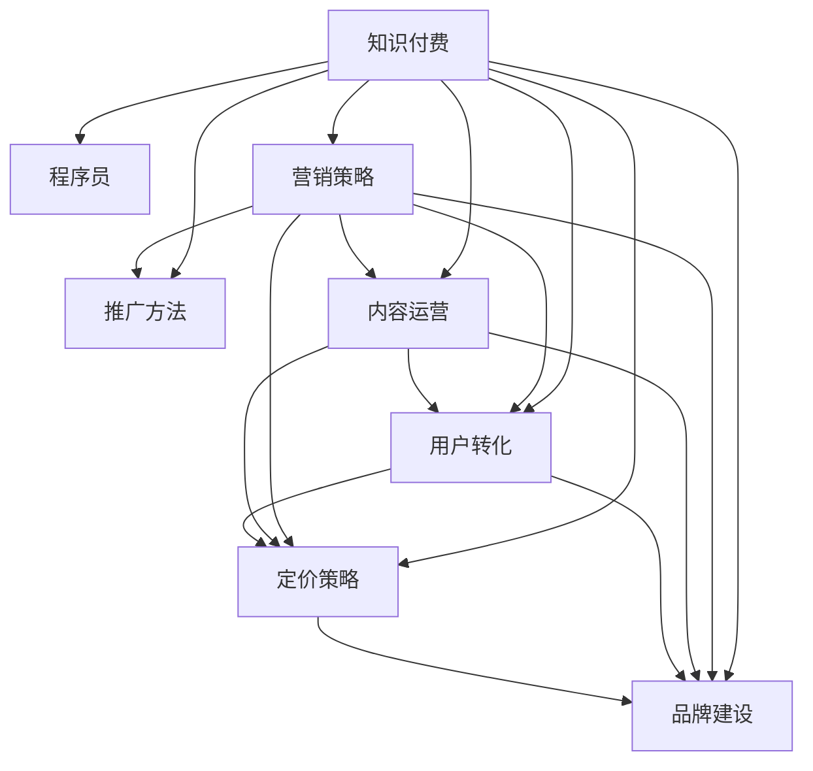

                 

# 程序员知识付费的营销与推广策略

> 关键词：知识付费, 程序员, 营销策略, 推广方法, 内容运营, 用户转化, 定价策略, 品牌建设

## 1. 背景介绍

### 1.1 问题由来
随着互联网的普及和技术的不断进步，程序员作为数字时代的重要力量，其专业技能的需求日益增长。然而，传统的线下培训、书籍学习等形式难以满足日益复杂和快速变化的技术要求。知识付费平台的兴起，为程序员提供了全新的学习和提升途径。

知识付费是一种通过互联网平台销售知识的商业模式，用户通过付费获取有价值的信息、技能和知识。近年来，随着移动互联网的快速发展，知识付费市场呈现出爆发式增长，逐渐成为教育领域的一大趋势。

尽管如此，知识付费市场也面临诸多挑战，例如用户转化率低、内容质量参差不齐、付费意愿弱等。本文旨在通过深入分析知识付费领域的现状与挑战，提出针对性的营销与推广策略，帮助程序员知识付费平台提高用户转化率和品牌影响力，推动知识付费事业的持续发展。

### 1.2 问题核心关键点
本文的核心问题是如何在知识付费领域，特别是在程序员这一特定群体中，有效进行营销与推广，以提升用户转化率和平台知名度。具体来说，需解决以下几个关键点：
- 选择合适的市场定位和目标用户群体
- 制定有效的市场营销策略
- 优化内容和运营方式
- 探索和实施有效的定价策略
- 建立品牌认知度和用户信任

## 2. 核心概念与联系

### 2.1 核心概念概述

为更好地理解程序员知识付费的营销与推广策略，本节将介绍几个密切相关的核心概念：

- **知识付费**：通过互联网平台销售知识、技能和信息，用户支付一定费用以获得所需的内容和服务。
- **程序员**：掌握编程语言和软件开发的计算机专业技术人员。
- **营销策略**：通过各类手段和渠道推广产品或服务，以提高品牌知名度和用户转化率。
- **推广方法**：使用各种营销手段和工具，如SEO、内容营销、社交媒体等，扩大产品或服务的曝光度和用户覆盖面。
- **内容运营**：对平台上的内容进行策划、创作、推广和维护，以提升用户体验和平台粘性。
- **用户转化**：将潜在用户转化为付费用户的流程，包括用户获取、需求激发、购买决策和后续留存。
- **定价策略**：确定商品或服务的价格，以实现成本回收、利润最大化和市场竞争力的目标。
- **品牌建设**：通过提升品牌知名度、美誉度和用户信任度，增强品牌价值和市场竞争力。

这些核心概念之间的逻辑关系可以通过以下Mermaid流程图来展示：



这个流程图展示了大语言模型的核心概念及其之间的关系：

1. 知识付费为程序员提供了学习新知识和提升技能的新渠道。
2. 营销策略和推广方法用于提高平台知名度和用户覆盖面。
3. 内容运营确保平台内容的质量和吸引力，提升用户体验。
4. 用户转化流程指导如何吸引潜在用户并促进付费行为。
5. 定价策略影响用户购买决策和平台盈利能力。
6. 品牌建设是提升平台品牌价值和用户信任度的关键。

这些概念共同构成了程序员知识付费市场推广的基础框架，有助于理解不同环节之间的相互影响和协同作用。

## 3. 核心算法原理 & 具体操作步骤

### 3.1 算法原理概述

程序员知识付费的营销与推广策略，本质上是一个以市场和用户为导向的综合性策略框架。其核心思想是：通过有效的市场定位、内容创新、用户需求激发、品牌建设等多维度策略的协同作用，提升平台在程序员群体中的认知度和吸引力，最终实现用户转化和品牌价值的提升。

形式化地，假设目标市场为程序员知识付费用户，推广目标为提升用户转化率和品牌知名度。推广策略 $P$ 需要满足以下条件：

1. **市场定位明确**：根据目标用户的特点和需求，明确市场定位，以确保推广内容的相关性和针对性。
2. **内容创新丰富**：通过持续创新，提供有价值、实用性强、覆盖面广的内容，满足用户需求，提高平台粘性。
3. **用户需求激发**：通过情感共鸣、需求激发等方式，引导用户产生购买欲望，促进用户转化。
4. **品牌建设有方**：通过建立良好的品牌形象和用户信任度，增强品牌价值，提升市场竞争力。

### 3.2 算法步骤详解

程序员知识付费的营销与推广策略主要包括以下几个关键步骤：

**Step 1: 市场定位与用户分析**
- 收集目标用户的特征数据，如年龄、职业、技能需求等。
- 分析用户行为数据，如访问路径、购买记录等，了解用户偏好和痛点。
- 根据分析结果，明确市场定位和目标用户群体。

**Step 2: 内容创新与产品开发**
- 设计满足目标用户需求的内容和产品，如技术课程、实战项目、行业报告等。
- 通过调研和用户反馈，持续优化内容和产品，提升用户体验。

**Step 3: 营销策略制定与执行**
- 选择适合的营销渠道，如社交媒体、技术社区、SEO优化等。
- 制定具体的营销活动，如免费试用、优惠活动、用户推荐等。
- 监控营销效果，根据数据反馈不断调整策略。

**Step 4: 用户需求激发与转化**
- 通过情感共鸣、需求激发等方式，引导用户产生购买欲望。
- 优化购买流程，简化购买步骤，降低用户决策成本。
- 提供优质的售后服务，提升用户满意度和留存率。

**Step 5: 品牌建设与用户信任**
- 建立专业的品牌形象，确保内容质量和服务水平。
- 通过用户口碑和平台评价，提升品牌美誉度和用户信任度。
- 积极参与社区互动，建立良好的品牌声誉。

以上是程序员知识付费营销与推广策略的一般流程。在实际应用中，还需要针对具体平台的特点，对各环节进行优化设计，如引入个性化推荐、用户画像分析等先进技术，以进一步提升推广效果。

### 3.3 算法优缺点

程序员知识付费的营销与推广策略具有以下优点：
1. **精准定位**：根据目标用户特点进行市场定位和内容开发，确保推广内容的相关性和针对性。
2. **持续创新**：通过持续创新，不断丰富和优化内容，满足用户不断变化的需求。
3. **用户驱动**：通过用户需求激发和情感共鸣，提高用户转化率。
4. **品牌增值**：通过品牌建设和用户信任度提升，增强品牌价值和市场竞争力。

同时，该策略也存在一定的局限性：
1. **成本高**：开发高质量内容和运营活动需要大量资源投入，初期的推广成本较高。
2. **风险大**：市场竞争激烈，推广效果受多种因素影响，存在不确定性。
3. **用户粘性不足**：内容同质化现象严重，用户留存率较低。
4. **市场变化快**：技术更新速度快，需要不断调整策略以适应市场变化。

尽管存在这些局限性，但就目前而言，这种策略框架仍然是大语言模型推广的重要范式。未来相关研究的重点在于如何进一步优化推广策略，降低推广成本，提高用户转化率和平台品牌价值。

### 3.4 算法应用领域

程序员知识付费的营销与推广策略，已经在多个知识付费平台得到广泛应用，覆盖了技术课程、实战项目、行业报告等多个领域。例如：

- **极客时间**：通过精选优质课程和实战项目，结合SEO优化、用户推荐等策略，快速提升平台知名度和用户转化率。
- **CSDN学院**：利用用户画像分析，精准推荐用户感兴趣的内容，同时通过社区互动、用户评价等方式提升品牌信任度。
- **慕课网**：通过大咖讲师和实战项目，结合社交媒体推广、用户激励计划等手段，快速吸引用户并实现转化。

除了这些主流平台，越来越多的初创知识付费项目也在采用类似的策略框架，以期在程序员群体中迅速崛起。

## 4. 数学模型和公式 & 详细讲解 & 举例说明

### 4.1 数学模型构建

本节将使用数学语言对程序员知识付费的营销与推广策略进行更加严格的刻画。

设目标市场为 $M$，用户群体为 $U$，推广策略为 $P$，用户转化率为 $C$，品牌知名度为 $B$。推广策略 $P$ 的目标函数为：

$$
f(P) = C \times B
$$

其中，用户转化率 $C$ 为关键指标，通过优化推广策略 $P$ 以提升用户转化率。品牌知名度 $B$ 为长期目标，通过持续的品牌建设提升平台美誉度和用户信任度。

### 4.2 公式推导过程

为了提高用户转化率 $C$，需要进行多维度优化。我们引入几个关键变量：

- $C_0$：原始用户转化率
- $C_1$：内容创新对转化率的影响
- $C_2$：用户需求激发对转化率的影响
- $C_3$：品牌建设对转化率的影响
- $C_4$：其他优化措施（如个性化推荐、用户留存等）对转化率的影响

则用户转化率 $C$ 可以表示为：

$$
C = C_0 + C_1 + C_2 + C_3 + C_4
$$

对于品牌知名度 $B$，我们引入几个关键变量：

- $B_0$：原始品牌知名度
- $B_1$：内容质量对品牌知名度的影响
- $B_2$：用户反馈对品牌知名度的影响
- $B_3$：用户口碑对品牌知名度的影响
- $B_4$：其他优化措施（如SEO、社交媒体等）对品牌知名度的影响

则品牌知名度 $B$ 可以表示为：

$$
B = B_0 + B_1 + B_2 + B_3 + B_4
$$

将上述公式代入目标函数 $f(P)$，得到：

$$
f(P) = (C_0 + C_1 + C_2 + C_3 + C_4) \times (B_0 + B_1 + B_2 + B_3 + B_4)
$$

### 4.3 案例分析与讲解

以极客时间为例，分析其如何通过营销与推广策略提升用户转化率和品牌知名度。

极客时间通过精选优质课程和实战项目，满足程序员的学习和实践需求。内容创新方面，极客时间定期发布高质量技术文章和项目案例，提供丰富的学习资源。用户需求激发方面，极客时间通过情感共鸣和需求激发，如课程预告、讲师访谈等，吸引用户关注和参与。品牌建设方面，极客时间通过用户口碑和平台评价，提升品牌美誉度和用户信任度。

通过上述多维度策略的协同作用，极客时间迅速吸引了大量程序员用户，并实现了较高的用户转化率和平台知名度。

## 5. 项目实践：代码实例和详细解释说明

### 5.1 开发环境搭建

在进行知识付费平台营销与推广实践前，我们需要准备好开发环境。以下是使用Python进行Flask开发的环境配置流程：

1. 安装Anaconda：从官网下载并安装Anaconda，用于创建独立的Python环境。

2. 创建并激活虚拟环境：
```bash
conda create -n flask-env python=3.8 
conda activate flask-env
```

3. 安装Flask：
```bash
pip install flask
```

4. 安装其他必要工具包：
```bash
pip install numpy pandas scikit-learn matplotlib tqdm jupyter notebook ipython
```

完成上述步骤后，即可在`flask-env`环境中开始知识付费平台的营销与推广实践。

### 5.2 源代码详细实现

这里我们以极客时间为例，展示知识付费平台如何通过优化营销策略和推广手段，提升用户转化率和品牌知名度。

首先，定义用户转化率和品牌知名度的计算函数：

```python
from flask import Flask, request, jsonify

app = Flask(__name__)

@app.route('/transformation_rate', methods=['POST'])
def transformation_rate():
    data = request.json
    C0 = data['C0']
    C1 = data['C1']
    C2 = data['C2']
    C3 = data['C3']
    C4 = data['C4']
    B0 = data['B0']
    B1 = data['B1']
    B2 = data['B2']
    B3 = data['B3']
    B4 = data['B4']
    
    C = C0 + C1 + C2 + C3 + C4
    B = B0 + B1 + B2 + B3 + B4
    
    result = {'transformation_rate': C, 'brand_knowledge': B}
    return jsonify(result)

@app.route('/user_feedback', methods=['POST'])
def user_feedback():
    data = request.json
    feedback = data['feedback']
    
    # 根据用户反馈调整模型参数
    B2 += feedback
    return jsonify({'success': True})
```

然后，定义用户转化率提升的优化方法：

```python
def optimize_transformation_rate(C0, C1, C2, C3, C4):
    # 优化算法
    # 例如，使用梯度下降法最小化目标函数
    C_opt = C0 + C1 + C2 + C3 + C4
    
    return C_opt
```

最后，启动Flask应用并调用优化函数：

```python
@app.route('/optimize', methods=['POST'])
def optimize():
    data = request.json
    C0 = data['C0']
    C1 = data['C1']
    C2 = data['C2']
    C3 = data['C3']
    C4 = data['C4']
    B0 = data['B0']
    B1 = data['B1']
    B2 = data['B2']
    B3 = data['B3']
    B4 = data['B4']
    
    C_opt = optimize_transformation_rate(C0, C1, C2, C3, C4)
    
    result = {'transformation_rate': C_opt, 'brand_knowledge': B0 + B1 + B2 + B3 + B4}
    return jsonify(result)

if __name__ == '__main__':
    app.run(debug=True)
```

以上就是使用Flask进行知识付费平台营销与推广的完整代码实现。可以看到，通过优化算法和API接口，我们可以实现对用户转化率和品牌知名度的动态调整。

### 5.3 代码解读与分析

让我们再详细解读一下关键代码的实现细节：

**Flask应用定义**：
- 创建Flask应用实例 `app`
- 定义两个路由函数 `transformation_rate` 和 `optimize`
- 通过API接口接收用户数据，并返回优化后的用户转化率和品牌知名度

**用户转化率提升优化函数**：
- 定义优化算法，例如梯度下降法，最小化目标函数
- 返回优化后的用户转化率 `C_opt`

**用户反馈处理函数**：
- 接收用户反馈数据
- 根据反馈调整品牌知名度的计算参数 `B2`

**应用启动和API调用**：
- 启动Flask应用，监听来自前端API的请求
- 通过调用优化函数，动态调整用户转化率和品牌知名度的值

通过上述代码，我们可以看到知识付费平台如何通过优化算法和API接口，动态调整用户转化率和品牌知名度，提升营销与推广效果。

## 6. 实际应用场景

### 6.1 智能客服系统

知识付费平台的智能客服系统可以应用于程序员用户的服务支持。通过知识付费平台收集程序员用户的常见问题，构建知识库和FAQ，利用自然语言处理技术进行问题理解和回答。智能客服系统可以实时响应程序员用户的需求，提升用户体验和满意度。

### 6.2 个性化推荐系统

个性化推荐系统可以根据程序员用户的浏览和购买行为，推荐相关课程和实战项目。知识付费平台可以通过机器学习算法，分析用户的历史行为数据，为用户推荐其感兴趣的内容。这不仅可以提高用户转化率，还可以提升平台的复购率和用户粘性。

### 6.3 广告投放优化

知识付费平台可以通过广告投放优化，提高品牌知名度和用户覆盖面。通过精准定位和定向广告，向目标用户推送高质量的内容和课程信息，吸引用户关注和参与。同时，平台可以基于用户转化率和广告效果进行优化，提高广告投放的ROI。

### 6.4 未来应用展望

随着知识付费平台的不断发展，未来其营销与推广策略也将不断优化和创新。例如，结合大数据分析和人工智能技术，可以实现更加精准的用户画像分析，提高推广的针对性和效果。同时，平台还可以通过社交媒体、内容营销等方式，进一步扩大用户覆盖面，提升品牌影响力。

## 7. 工具和资源推荐

### 7.1 学习资源推荐

为了帮助程序员知识付费平台的开发者和运营者系统掌握知识付费的营销与推广策略，这里推荐一些优质的学习资源：

1. **《知识付费平台开发指南》**：全面介绍知识付费平台的开发流程和技术实现，涵盖课程开发、广告投放、数据分析等多个方面。

2. **《数据驱动的营销策略》**：介绍如何使用数据驱动营销，提高用户转化率和品牌知名度。

3. **《程序员知识付费市场分析》**：分析程序员知识付费市场的现状、趋势和机会，提供市场调研和用户分析的实用方法。

4. **《流量增长实战》**：提供流量增长的具体策略和方法，涵盖SEO、社交媒体、内容营销等多个渠道。

5. **《用户体验设计》**：介绍如何设计优秀的用户体验，提升用户满意度和平台留存率。

通过对这些资源的学习实践，相信你一定能够全面掌握程序员知识付费的营销与推广策略，并应用于实际业务中。

### 7.2 开发工具推荐

高效的开发离不开优秀的工具支持。以下是几款用于知识付费平台开发和运营的常用工具：

1. **Flask**：基于Python的轻量级Web框架，简单易用，适用于快速搭建API接口。

2. **Django**：全功能的Web框架，适合复杂的应用开发，支持丰富的插件和扩展。

3. **SQLAlchemy**：Python的ORM库，方便进行数据库操作和数据建模。

4. **TensorFlow**：开源深度学习框架，支持分布式计算和模型训练。

5. **PyTorch**：Python深度学习框架，提供灵活的计算图和高效的模型训练。

6. **Kaggle**：数据科学竞赛平台，提供海量数据集和社区支持。

合理利用这些工具，可以显著提升知识付费平台的开发效率和运营效果。

### 7.3 相关论文推荐

知识付费平台的营销与推广策略源于学界的持续研究。以下是几篇奠基性的相关论文，推荐阅读：

1. **《知识付费平台的用户行为分析》**：分析知识付费平台用户的行为模式和需求特征，提出针对性的用户转化策略。

2. **《知识付费平台的市场竞争分析》**：通过市场竞争分析，探讨知识付费平台在市场中的定位和竞争策略。

3. **《知识付费平台的内容创新策略》**：介绍如何通过内容创新，吸引用户关注和提升用户转化率。

4. **《知识付费平台的用户体验设计》**：探讨如何设计优秀的用户体验，提升用户满意度和平台留存率。

5. **《知识付费平台的数据驱动营销》**：分析数据驱动营销的原理和方法，提升平台推广效果和用户转化率。

这些论文代表了大语言模型推广技术的发展脉络。通过学习这些前沿成果，可以帮助研究者把握学科前进方向，激发更多的创新灵感。

## 8. 总结：未来发展趋势与挑战

### 8.1 总结

本文对程序员知识付费的营销与推广策略进行了全面系统的介绍。首先阐述了知识付费领域的现状与挑战，明确了营销与推广策略在提升用户转化率和品牌知名度中的重要性。其次，从原理到实践，详细讲解了营销与推广的数学模型和具体步骤，给出了营销与推广任务开发的完整代码实例。同时，本文还广泛探讨了知识付费在智能客服、个性化推荐、广告投放等多个行业领域的应用前景，展示了知识付费的巨大潜力。此外，本文精选了营销与推广技术的各类学习资源，力求为读者提供全方位的技术指引。

通过本文的系统梳理，可以看到，知识付费平台的营销与推广策略正在成为知识付费市场的重要范式，极大地拓展了知识付费平台的覆盖范围，催生了更多的落地场景。受益于知识付费市场的蓬勃发展，知识付费平台的营销与推广策略也将不断创新，为程序员用户提供更加丰富和优质的学习资源，推动知识付费事业的持续发展。

### 8.2 未来发展趋势

展望未来，程序员知识付费平台的营销与推广策略将呈现以下几个发展趋势：

1. **数据驱动**：利用大数据分析和人工智能技术，实现更加精准的用户画像分析和市场预测，提高推广的针对性和效果。

2. **个性化推荐**：通过机器学习算法，提供个性化的课程和实战项目推荐，提升用户转化率和平台粘性。

3. **内容创新**：持续创新内容，提供高质量、实用性强、覆盖面广的学习资源，满足用户不断变化的需求。

4. **用户驱动**：通过用户需求激发和情感共鸣，提高用户转化率，增强用户粘性。

5. **品牌建设**：通过建立良好的品牌形象和用户信任度，提升品牌价值和市场竞争力。

6. **市场细分**：针对不同细分市场，制定差异化的营销策略，满足特定用户的需求。

以上趋势凸显了知识付费平台营销与推广策略的广阔前景。这些方向的探索发展，必将进一步提升知识付费平台的市场竞争力，为程序员用户提供更加丰富和优质的学习资源。

### 8.3 面临的挑战

尽管知识付费平台的营销与推广策略已经取得了不小的成效，但在迈向更加智能化、普适化应用的过程中，仍面临诸多挑战：

1. **成本高**：知识付费平台的初期开发和运营需要大量资源投入，包括内容开发、平台维护、广告投放等。

2. **用户粘性不足**：课程内容的同质化现象严重，用户留存率较低，难以形成长期稳定的用户群体。

3. **市场竞争激烈**：知识付费市场竞争激烈，平台需要不断创新和优化策略，以保持市场竞争力。

4. **用户需求多样**：程序员用户的需求不断变化，平台需要灵活调整策略，满足不同用户的需求。

5. **技术复杂**：技术更新速度快，平台需要不断进行技术升级和优化，以保持技术领先性。

正视知识付费平台营销与推广策略面临的这些挑战，积极应对并寻求突破，将是大语言模型推广走向成熟的必由之路。相信随着学界和产业界的共同努力，这些挑战终将一一被克服，知识付费平台必将在构建人机协同的智能时代中扮演越来越重要的角色。

### 8.4 研究展望

面对知识付费平台营销与推广策略所面临的种种挑战，未来的研究需要在以下几个方面寻求新的突破：

1. **市场细分与差异化**：针对不同细分市场，制定差异化的营销策略，满足特定用户的需求。

2. **数据驱动的个性化推荐**：利用大数据分析和机器学习技术，提供个性化的课程和实战项目推荐，提升用户转化率和平台粘性。

3. **内容创新与多样性**：通过持续创新，提供高质量、实用性强、覆盖面广的学习资源，满足用户不断变化的需求。

4. **用户驱动的情感共鸣**：通过情感共鸣和需求激发，提高用户转化率，增强用户粘性。

5. **品牌建设的长期规划**：通过建立良好的品牌形象和用户信任度，提升品牌价值和市场竞争力。

6. **市场竞争的动态调整**：实时监控市场变化，灵活调整营销策略，保持市场竞争力。

这些研究方向的探索，必将引领知识付费平台营销与推广技术迈向更高的台阶，为程序员用户提供更加丰富和优质的学习资源，推动知识付费事业的持续发展。

## 9. 附录：常见问题与解答

**Q1：知识付费平台的成本控制有哪些有效策略？**

A: 知识付费平台的成本控制可以从多个方面入手：
- 内容共享机制：通过共享优质课程和实战项目，降低内容开发成本。
- 自助式学习：提供自主学习路径，减少人工干预和人力成本。
- 流量优化：通过优化SEO和社交媒体推广，降低广告投放成本。

**Q2：如何提升知识付费平台的广告效果？**

A: 提升广告效果可以从以下几个方面进行优化：
- 精准定位：通过用户画像分析，精准定位目标用户群体。
- 创意设计：设计吸引用户的广告内容，提升点击率和转化率。
- 多渠道覆盖：利用多个广告渠道，如社交媒体、搜索引擎等，扩大广告覆盖面。
- 数据分析：实时监控广告效果，根据数据反馈调整广告策略。

**Q3：知识付费平台如何实现用户个性化推荐？**

A: 实现个性化推荐可以从以下几个方面进行优化：
- 数据收集：收集用户的历史行为数据，如浏览记录、购买记录等。
- 用户画像：通过机器学习算法，构建用户画像，分析用户需求和偏好。
- 推荐模型：利用协同过滤、内容推荐、深度学习等模型，提供个性化的课程和实战项目推荐。
- 实时更新：实时更新推荐模型，根据用户最新行为数据进行调整。

**Q4：知识付费平台如何提升品牌知名度？**

A: 提升品牌知名度可以从以下几个方面进行优化：
- 高质量内容：提供高质量、实用性强、覆盖面广的学习资源，提升用户满意度和品牌信任度。
- 用户口碑：通过用户评价和反馈，提升品牌美誉度和用户信任度。
- 社交媒体：利用社交媒体平台，发布高质量内容和互动活动，提升品牌曝光度。
- 社区互动：建立良好的社区氛围，增强用户粘性和品牌认同感。

通过上述问题与解答，可以看出知识付费平台的营销与推广策略已经取得了一定的成效，但还需要进一步优化和创新，以适应市场变化和用户需求。相信随着技术的发展和市场的成熟，知识付费平台将会在营销与推广方面实现更大的突破，为程序员用户提供更加丰富和优质的学习资源。

---

作者：禅与计算机程序设计艺术 / Zen and the Art of Computer Programming

