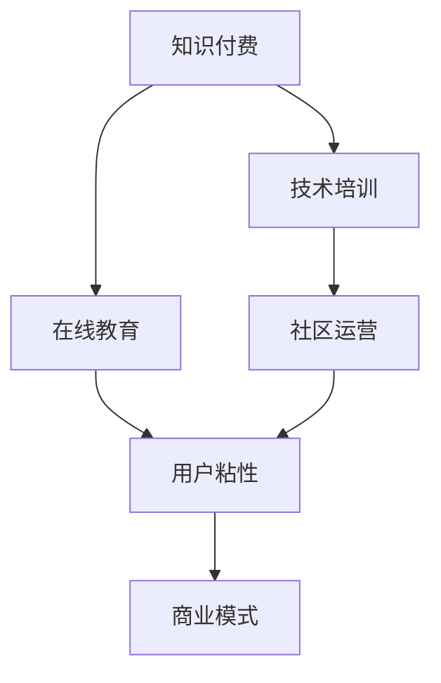

                 

# 程序员知识付费：打造付费社群

> 关键词：程序员,知识付费,付费社群,技术分享,技术培训,在线教育,社区运营,用户粘性,商业模式

## 1. 背景介绍

### 1.1 问题由来

在数字化时代，知识付费成为了一种新的商业模式，利用互联网技术，提供有价值的知识服务，满足用户的学习需求。对于程序员而言，知识付费更加重要，因为技术日新月异，不断学习新知识是程序员职业发展的必要条件。然而，传统的技术书籍、培训课程和社区论坛已不能完全满足程序员的成长需求，用户获取优质技术知识变得更加困难。

### 1.2 问题核心关键点

在程序员知识付费领域，以下几个关键点值得关注：
1. 需求多样性：程序员的知识需求涉及广泛的技术栈和应用场景，单一的知识产品难以满足多样化的需求。
2. 价值稀缺性：高质量的技术内容往往需要花费大量时间和精力生产，获取难度较大。
3. 社区互动性：在线知识社区提供了高效互动的平台，通过社区交流可以加速知识吸收和创新。
4. 内容持续性：程序员知识付费市场需要持续产生高质量内容，维持社群活跃度和用户粘性。
5. 商业可持续性：知识付费平台需要设计合理的商业模式，实现经济和用户价值的双赢。

## 2. 核心概念与联系

### 2.1 核心概念概述

为更好地理解程序员知识付费及其背后的原理，本节将介绍几个关键概念及其相互关系：

- 知识付费(Knowledge Paywalls)：通过付费方式获取有价值的知识产品或服务，以提高知识获取效率和效果。
- 技术培训(technical training)：有计划、有组织地提升编程技术水平和软技能。
- 在线教育(online education)：利用互联网平台提供教育服务，包括直播课、录播课、在线问答等形式。
- 社区运营(community operations)：通过有效管理在线社区，提升用户互动和留存率。
- 用户粘性(user engagement)：通过优质内容和服务，增强用户对平台的依赖和忠诚度。
- 商业模式(commercial model)：知识付费平台实现盈利的方式，如订阅模式、按需模式等。

这些概念之间的逻辑关系可以通过以下Mermaid流程图来展示：



这个流程图展示了知识付费、技术培训、在线教育、社区运营、用户粘性和商业模式之间的相互关系：

1. 知识付费是平台的核心盈利模式，为技术培训和在线教育提供了商业基础。
2. 技术培训通过提供有价值的学习内容，增强用户粘性，提升社区活跃度。
3. 在线教育利用互联网技术，提供多样化的学习方式，满足用户不同需求。
4. 社区运营通过优化用户互动体验，进一步提高用户粘性。
5. 用户粘性是社区和商业模式稳定的基础，良好的用户体验能提升平台价值。
6. 商业模式为平台提供了可持续的经济支持，驱动高质量内容的生产和社区运营。

## 3. 核心算法原理 & 具体操作步骤
### 3.1 算法原理概述

基于知识付费的程序员社群建设，本质上是一个面向技术社区的商业模式设计过程。其核心思想是通过高效的在线教育、多样化的技术培训和活跃的社区运营，为用户提供优质的技术内容，并从中获得经济收益。

形式化地，假设社区拥有 $N$ 名用户，每个用户每年愿意为技术内容支付的订阅费用为 $C$。社区订阅用户数为 $U$，单次课程订阅费用为 $P$，总课程数为 $M$，则社区年收入为：

$$
\text{Annual Revenue} = U \times C + P \times M
$$

其中，$U$ 和 $C$ 受到社区质量、用户体验和课程内容的影响。平台需要设计合适的价格模型，并通过高质量的课程内容和优质的服务，吸引和保持订阅用户，最大化年收入。

### 3.2 算法步骤详解

基于知识付费的程序员社群建设一般包括以下几个关键步骤：

**Step 1: 确定目标用户群**

- 通过市场调研和数据分析，明确目标用户群体的需求和偏好。
- 设计符合目标用户需求的知识产品，如课程、文档、技术讲座等。
- 用户群体可以细分为不同阶段和领域，如初级开发者、中高级开发者、前端开发者等。

**Step 2: 设计课程内容和培训体系**

- 邀请专家和高级开发者设计课程内容，覆盖从基础到进阶的技术栈。
- 设计系统化的培训体系，包括入门课程、进阶课程、实战训练等。
- 引入在线互动和评估工具，提升学习效果。

**Step 3: 开发和部署课程平台**

- 选择合适的技术栈和开发工具，如React、Node.js、Django等。
- 开发前端和后端功能，包括课程展示、购买、学习进度管理、社区交流等。
- 集成第三方支付和课程发布平台，如Alipay、微信、Coursera等。

**Step 4: 运营和维护社群**

- 设计社区规则，确保用户互动的良性秩序。
- 定期更新和发布高质量内容，保持社区活跃度。
- 进行用户反馈收集和分析，持续优化产品和服务。

**Step 5: 市场推广和用户留存**

- 利用SEO、社交媒体、广告投放等方式进行市场推广。
- 通过举办技术沙龙、线上研讨会等活动，提升用户粘性。
- 设计优惠策略，如首次订阅折扣、好友推荐奖励等，吸引新用户。

### 3.3 算法优缺点

基于知识付费的程序员社群建设具有以下优点：
1. 高效匹配用户需求：知识付费平台能够根据用户行为和反馈，提供个性化的内容推荐，满足多样化需求。
2. 高质量内容保障：平台能够吸引有影响力的技术专家，产出高质量的知识产品。
3. 互动性强：在线社区为程序员提供了高效交流的平台，促进知识共享和技术创新。
4. 用户粘性强：高质量内容和优质服务能够增强用户粘性，提高留存率。
5. 商业可持续：合理的商业模式能够实现经济和用户价值的双赢。

同时，该方法也存在一定的局限性：
1. 内容质量依赖专家：平台的课程和内容质量高度依赖于专家的水平和参与度。
2. 用户需求动态变化：程序员知识需求多样且快速变化，需要平台持续优化内容。
3. 技术栈广度限制：社区难以全面覆盖所有技术栈，部分开发者可能会感到资源不足。
4. 用户获取成本高：高质量技术内容生产难度大，获取成本高。
5. 竞争激烈：知识付费市场竞争激烈，需要持续创新以保持竞争力。

尽管存在这些局限性，但基于知识付费的程序员社群建设仍然是当前最有效的技术知识传播和共享方式之一，对提升程序员的职业能力和技术创新具有重要意义。

### 3.4 算法应用领域

基于知识付费的程序员社群建设在多个领域已取得了成功应用：

- **企业培训**：企业通过搭建内部知识付费平台，为员工提供技能培训，提升团队整体技术水平。
- **个人职业发展**：程序员通过订阅技术课程，进行自我提升，拓宽职业发展空间。
- **技术交流社区**：开发者社区平台如Stack Overflow、GitHub等，利用知识付费模式，提供技术支持和经验分享。
- **在线教育市场**：如Udemy、Coursera等平台，通过知识付费模式，提供系统化的编程课程，覆盖全栈技术栈。
- **开发者学习助手**：如LeetCode、HackerRank等，提供实战编程练习，并通过付费订阅获得额外的课程和技术资料。

## 4. 数学模型和公式 & 详细讲解  
### 4.1 数学模型构建

本节将使用数学语言对程序员知识付费社群的设计进行严格的刻画。

假设社区拥有 $N$ 名用户，订阅用户数为 $U$，单次课程订阅费用为 $P$，社区收入为 $I$，平均每位用户年消费为 $C$，社区年活跃天数为 $D$，则社区年收入可表示为：

$$
I = U \times P \times D + C \times D
$$

其中，$U$ 和 $P$ 受到课程质量和用户粘性的影响。设计合理的订阅价格和课程内容，提升用户体验，增加用户订阅率和消费频率，是最大化年收入的关键。

### 4.2 公式推导过程

以单次课程订阅费用 $P$ 为例，推导其对年收入的影响。假设课程数为 $M$，单次课程订阅次数为 $N$，则：

$$
N = U \times D
$$

年课程订阅总收入为：

$$
\text{Yearly Course Revenue} = P \times M \times U \times D
$$

将 $N$ 代入，得：

$$
\text{Yearly Course Revenue} = P \times M \times (U \times D) = P \times M \times U \times D
$$

因此，增加课程数量 $M$、订阅用户数 $U$ 和平均活跃天数 $D$，均可提升年课程总收入。

### 4.3 案例分析与讲解

**案例分析：**
某程序员知识付费平台拥有 5 万用户，订阅用户 2 万，每用户平均消费 1000 元/年，社区课程数为 1000 门，单次订阅费用为 300 元。根据模型：

$$
I = U \times P \times D + C \times D = 20000 \times 300 \times 1 + 50000 \times 1000 \times 1 = 17000000 + 50000000 = 67000000
$$

年收入为 6700 万元。

**讲解：**
通过分析该案例，可以看出，订阅用户数和单次订阅费用对社区年收入有直接的影响。平台可以通过提升课程质量和用户体验，吸引更多高质量用户，实现更高的收入。

## 5. 项目实践：代码实例和详细解释说明
### 5.1 开发环境搭建

在进行知识付费社群开发前，我们需要准备好开发环境。以下是使用Python进行Flask开发的环境配置流程：

1. 安装Anaconda：从官网下载并安装Anaconda，用于创建独立的Python环境。

2. 创建并激活虚拟环境：
```bash
conda create -n myproject python=3.8 
conda activate myproject
```

3. 安装Flask：
```bash
pip install flask
```

4. 安装SQLAlchemy和Flask-RESTful：
```bash
pip install sqlalchemy flask-restful
```

5. 安装Flask-SocketIO：
```bash
pip install flask-socketio
```

6. 安装Flask-WTF和WTForms：
```bash
pip install flask-wtf wtforms
```

完成上述步骤后，即可在`myproject`环境中开始知识付费社群的开发。

### 5.2 源代码详细实现

下面以一个简单的知识付费平台为例，给出使用Flask开发的Python代码实现。

首先，定义课程模型和数据库迁移：

```python
from flask_sqlalchemy import SQLAlchemy
from flask import Flask
from flask_marshmallow import Marshmallow

app = Flask(__name__)
app.config['SQLALCHEMY_DATABASE_URI'] = 'sqlite:///data.db'
app.config['SQLALCHEMY_TRACK_MODIFICATIONS'] = False

db = SQLAlchemy(app)
ma = Marshmallow(app)

class Course(db.Model):
    id = db.Column(db.Integer, primary_key=True)
    title = db.Column(db.String(100), nullable=False)
    description = db.Column(db.String(500), nullable=False)
    price = db.Column(db.Float, nullable=False)
    published_at = db.Column(db.DateTime, nullable=False)

class CourseSchema(ma.SQLAlchemyAutoSchema):
    class Meta:
        model = Course
```

然后，定义API接口和数据处理：

```python
from flask_restful import Resource, reqparse

class CoursesResource(Resource):
    def get(self):
        courses = Course.query.all()
        schema = CourseSchema(many=True)
        return schema.dump(courses)

    def post(self):
        parser = reqparse.RequestParser()
        parser.add_argument('title', type=str, required=True)
        parser.add_argument('description', type=str, required=True)
        parser.add_argument('price', type=float, required=True)
        args = parser.parse_args()
        course = Course(title=args['title'], description=args['description'], price=args['price'], published_at=datetime.now())
        db.session.add(course)
        db.session.commit()
        return {"message": "Course added successfully"}, 201

class CourseSchema(ma.SQLAlchemyAutoSchema):
    class Meta:
        model = Course
```

最后，启动Flask应用：

```python
from flask import jsonify

@app.route('/')
def index():
    return jsonify({'message': 'Welcome to the knowledge payment platform'})

if __name__ == '__main__':
    app.run(debug=True)
```

以上就是一个简单的知识付费平台的后端实现。通过SQLAlchemy实现数据库操作，使用Flask-RESTful实现API接口，可以方便地处理课程数据的增删改查操作。

### 5.3 代码解读与分析

让我们再详细解读一下关键代码的实现细节：

**CoursesResource类**：
- `get`方法：查询所有课程，并使用CourseSchema进行数据序列化，返回给前端。
- `post`方法：接受POST请求，解析请求参数，创建新的课程记录，并存入数据库。

**CourseSchema类**：
- 使用Marshmallow库实现模型的自动序列化和反序列化，方便API接口的开发。
- 定义了模型的字段和类型，包括ID、标题、描述、价格和发布时间。

**SQLAlchemy操作**：
- 通过Flask-SQLAlchemy库，创建SQLite数据库连接，并定义了课程模型。
- 使用SQLAlchemy的查询API，实现了对课程数据的增删改查操作。

## 6. 实际应用场景
### 6.1 技术培训

知识付费平台可以与知名技术培训机构合作，推出系统化的编程课程，涵盖前端、后端、数据科学等全栈技术栈。通过平台的高效运营，让学员能够快速获取最新技术知识，提升实战能力。

在技术培训方面，常见的应用场景包括：
- 企业内部培训：企业通过定制课程，提升员工技术水平，支持团队创新。
- 在线编程培训：提供实战编程课程，培养高水平开发者。
- 技能认证：通过课程学习，获得官方认证，提升个人职业竞争力。

### 6.2 在线教育

知识付费平台利用互联网技术，提供在线教育服务，让用户能够随时随地学习新知识。常见的在线教育应用场景包括：

- 高质量课程：平台邀请业界专家授课，提供高水平课程，满足不同用户的学习需求。
- 实时互动：通过在线课堂、直播互动等方式，提升用户的学习体验。
- 课程推荐：通过用户行为分析，推荐符合用户兴趣的课程，提高课程完成率。

### 6.3 社区交流

知识付费平台为用户提供高效的社区交流环境，促进用户之间的互动和知识共享。常见的社区交流应用场景包括：

- 技术问答：平台提供问答功能，用户可以发布技术问题，邀请其他用户解答。
- 经验分享：用户可以在社区分享自己的技术心得和实战经验，提升社区活跃度。
- 项目合作：平台提供项目展示和合作机会，促进用户之间的协同创新。

### 6.4 未来应用展望

随着知识付费市场的不断发展，程序员知识付费平台将面临更多的机遇和挑战：

- 技术迭代加快：技术更新速度加快，平台需要持续优化课程内容和社区交流机制，保持内容的创新性。
- 用户需求多样化：用户需求多样化，平台需要提供更多样化的课程和服务，满足用户个性化的学习需求。
- 市场竞争激烈：知识付费市场竞争激烈，平台需要不断创新，提升用户体验，保持竞争力。
- 用户粘性提升：通过高质量内容和优质服务，增强用户粘性，提升平台的用户留存率和转化率。

未来，知识付费平台将在更多垂直领域应用，为程序员的职业发展和技术创新提供更多可能性。

## 7. 工具和资源推荐
### 7.1 学习资源推荐

为了帮助开发者系统掌握程序员知识付费的理论基础和实践技巧，这里推荐一些优质的学习资源：

1. **《知识付费模式研究》书籍**：深入讲解知识付费市场的原理和运营策略，涵盖付费模式设计、用户行为分析、商业模型等内容。
2. **《在线教育技术》课程**：讲解在线教育的技术基础和实现细节，包括课程设计、内容管理系统、在线互动工具等。
3. **《社区运营指南》书籍**：提供社区管理的高效方法和最佳实践，涵盖用户互动、内容审核、社区规则设计等。
4. **《程序员知识付费实战》博文**：通过案例分享和代码实践，深入剖析知识付费平台的开发和运营过程。
5. **《在线教育市场分析报告》**：通过市场调研和数据统计，提供深入的在线教育市场分析，帮助开发者了解市场需求和用户行为。

通过对这些资源的学习实践，相信你一定能够快速掌握程序员知识付费的精髓，并用于解决实际的NLP问题。

### 7.2 开发工具推荐

高效的开发离不开优秀的工具支持。以下是几款用于程序员知识付费开发的常用工具：

1. **Flask**：轻量级Web框架，易于上手，适合快速迭代研究。
2. **SQLAlchemy**：优秀的ORM库，支持多种数据库，提供便捷的数据操作API。
3. **Marshmallow**：优秀的序列化库，提供数据模型和API接口之间的转换功能。
4. **Flask-RESTful**：扩展Flask的RESTful API接口，支持高效的数据交换。
5. **Flask-SocketIO**：支持实时通信，适合开发在线互动功能。
6. **Jupyter Notebook**：强大的交互式开发环境，支持Python代码的快速迭代和调试。

合理利用这些工具，可以显著提升程序员知识付费平台的开发效率，加快创新迭代的步伐。

### 7.3 相关论文推荐

程序员知识付费平台的发展源于学界的持续研究。以下是几篇奠基性的相关论文，推荐阅读：

1. **《知识付费平台设计及实现》**：介绍知识付费平台的整体设计和实现细节，涵盖课程管理、用户互动、支付系统等。
2. **《在线教育系统架构设计》**：讲解在线教育系统的架构设计，涵盖前端、后端、数据库等技术栈。
3. **《社区运营系统设计》**：提供社区运营系统的高效设计和实现方法，涵盖用户互动、内容审核、社区规则等。
4. **《程序员知识付费平台案例分析》**：通过案例分析，深入剖析知识付费平台的运营策略和技术实现。
5. **《在线教育市场分析》**：通过市场调研和数据统计，提供深入的在线教育市场分析，帮助开发者了解市场需求和用户行为。

这些论文代表了大语言模型微调技术的发展脉络。通过学习这些前沿成果，可以帮助研究者把握学科前进方向，激发更多的创新灵感。

## 8. 总结：未来发展趋势与挑战
### 8.1 总结

本文对程序员知识付费及其背后的原理进行了全面系统的介绍。首先阐述了程序员知识付费的背景和意义，明确了知识付费在提升程序员技术水平和职业发展中的独特价值。其次，从原理到实践，详细讲解了知识付费的数学模型和关键步骤，给出了知识付费平台开发的完整代码实例。同时，本文还广泛探讨了知识付费在技术培训、在线教育、社区交流等多个行业领域的应用前景，展示了知识付费范式的巨大潜力。此外，本文精选了知识付费技术的各类学习资源，力求为读者提供全方位的技术指引。

通过本文的系统梳理，可以看到，程序员知识付费技术正在成为程序员职业发展的重要工具，极大地拓展了程序员获取知识的方式，提升了技术学习的效率和效果。未来，伴随知识付费市场的持续发展，知识付费平台必将带来更多创新和变革，进一步推动程序员的职业发展和技术创新。

### 8.2 未来发展趋势

展望未来，程序员知识付费技术将呈现以下几个发展趋势：

1. **内容质量提升**：平台将持续提升课程和内容质量，吸引更多高水平专家参与，产出更多高质量的在线教育产品。
2. **用户体验优化**：通过技术手段优化用户体验，提升用户粘性和满意度。
3. **个性化推荐**：通过大数据和AI技术，为用户提供个性化的课程推荐和服务，满足多样化需求。
4. **跨平台整合**：知识付费平台将与更多的第三方平台整合，提供更丰富的学习场景和应用体验。
5. **生态系统建设**：通过构建完整的生态系统，涵盖课程生产、内容分发、用户互动等多个环节，提升平台整体价值。

以上趋势凸显了程序员知识付费技术的广阔前景。这些方向的探索发展，必将进一步提升程序员的知识获取效率和质量，为技术创新和社会进步注入新的动力。

### 8.3 面临的挑战

尽管程序员知识付费技术已经取得了瞩目成就，但在迈向更加智能化、普适化应用的过程中，它仍面临着诸多挑战：

1. **内容质量依赖专家**：平台的课程和内容质量高度依赖于专家的水平和参与度，难以保证高质量内容的持续产出。
2. **用户需求动态变化**：程序员知识需求多样且快速变化，需要平台持续优化内容和服务。
3. **用户获取成本高**：高质量技术内容生产难度大，获取成本高，难以快速积累用户基础。
4. **技术栈广度限制**：社区难以全面覆盖所有技术栈，部分开发者可能会感到资源不足。
5. **市场竞争激烈**：知识付费市场竞争激烈，需要平台不断创新，提升用户体验，保持竞争力。

尽管存在这些挑战，但基于知识付费的程序员知识付费平台仍然是当前最有效的技术知识传播和共享方式之一，对提升程序员的职业能力和技术创新具有重要意义。

### 8.4 研究展望

面对程序员知识付费所面临的种种挑战，未来的研究需要在以下几个方面寻求新的突破：

1. **内容自动生成**：利用AI技术，自动生成高质量的课程内容，降低专家依赖，提高内容产出效率。
2. **用户需求预测**：通过大数据和机器学习技术，预测程序员的学习需求，提前布局课程设计。
3. **平台社区运营**：引入社区运营和用户互动机制，提升用户粘性和满意度，增强平台价值。
4. **生态系统建设**：构建完整的生态系统，涵盖课程生产、内容分发、用户互动等多个环节，提升平台整体价值。
5. **技术创新与实践**：推动新技术的应用和实践，如区块链技术、虚拟现实等，提升平台的用户体验和服务质量。

这些研究方向将引领程序员知识付费技术迈向更高的台阶，为程序员的职业发展和技术创新提供更多可能性。相信随着学界和产业界的共同努力，程序员知识付费技术必将在构建人机协同的智能时代中扮演越来越重要的角色。

## 9. 附录：常见问题与解答
----------------------------------------------------------------

**Q1：如何构建高效的程序员知识付费平台？**

A: 构建高效的程序员知识付费平台需要考虑以下几个关键因素：
1. **用户需求分析**：通过市场调研和数据分析，明确目标用户群体的需求和偏好。
2. **课程内容设计**：邀请专家和高级开发者设计课程内容，覆盖从基础到进阶的技术栈。
3. **平台技术架构**：选择合适的技术栈和开发工具，如Flask、SQLAlchemy等，构建稳定可靠的系统架构。
4. **社区互动机制**：设计社区规则，确保用户互动的良性秩序，提升用户粘性和留存率。
5. **市场推广策略**：利用SEO、社交媒体、广告投放等方式进行市场推广，吸引新用户。
6. **用户反馈机制**：通过用户反馈收集和分析，持续优化产品和服务。

**Q2：程序员知识付费平台如何提高用户粘性？**

A: 提高用户粘性是程序员知识付费平台成功的关键。以下是几种有效的方法：
1. **高质量内容**：提供高质量的课程和内容，满足用户的学习需求。
2. **实时互动**：通过在线课堂、直播互动等方式，提升用户的学习体验。
3. **社区交流**：提供技术问答、经验分享、项目合作等功能，增强用户互动。
4. **个性化推荐**：通过大数据和AI技术，提供个性化的课程推荐，提高课程完成率。
5. **持续更新**：定期更新和发布高质量内容，保持社区活跃度。

**Q3：程序员知识付费平台如何获取高质量内容？**

A: 获取高质量内容是程序员知识付费平台的核心挑战。以下是几种有效的方法：
1. **邀请专家**：邀请知名技术专家和高级开发者，提供高质量的课程内容。
2. **自产内容**：平台自身投入资源，通过内部技术团队开发课程内容。
3. **内容合作**：与知名的技术培训机构和教育平台合作，获取优质内容。
4. **用户生成内容**：鼓励用户生成内容，如技术博客、项目分享等，提升平台多样性。

**Q4：程序员知识付费平台如何提升课程质量？**

A: 提升课程质量是程序员知识付费平台的关键。以下是几种有效的方法：
1. **专家评审**：邀请行业专家评审课程内容，确保课程质量。
2. **用户反馈**：通过用户反馈收集和分析，持续优化课程内容。
3. **课程更新**：定期更新课程内容，补充最新技术和知识。
4. **技术手段**：利用AI和大数据技术，提升课程内容的质量和覆盖面。

**Q5：程序员知识付费平台如何实现商业可持续？**

A: 实现商业可持续是程序员知识付费平台的重要目标。以下是几种有效的方法：
1. **多元化收费**：除了课程订阅费，还可以引入按需付费、单次购买等收费模式。
2. **会员制**：设计会员制模式，提供更多增值服务，如个性化推荐、专属课程等。
3. **平台合作**：与第三方平台合作，提供更多的学习场景和应用体验，扩大用户基础。
4. **广告和赞助**：通过广告和赞助等方式，增加平台的盈利渠道。

这些问题的解答为程序员知识付费平台的建设和运营提供了实用的参考和指导，希望对开发者和读者有所帮助。

---

作者：禅与计算机程序设计艺术 / Zen and the Art of Computer Programming

