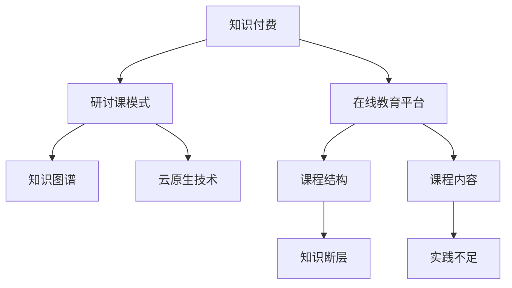

                 

# 程序员知识付费：打造研讨课模式

## 1. 背景介绍

### 1.1 问题由来
在数字化转型的时代背景下，知识付费已经成为教育行业的新潮流。程序员作为科技创新的主力军，面对快速变化的行业和技术，需要不断学习新知识，以保持竞争力。然而，传统的学习方式存在诸多局限性，如学习效率低、内容更新慢、缺乏互动等。随着互联网和移动设备的普及，程序员知识付费成为可能。

近年来，在线教育平台不断涌现，如Coursera、Udemy、慕课网等，提供了丰富的课程内容，满足了程序员多样化的学习需求。这些平台以视频、文章、代码示例等多种形式，为程序员提供了便捷的学习资源。

但这些平台仍存在一些问题：
1. **知识断层**：大部分课程聚焦于具体技术栈，缺乏体系化的知识结构。
2. **实践不足**：课程主要以理论为主，实践环节相对薄弱。
3. **互动不足**：大部分课程为单向知识传输，缺乏师生互动和同行交流。

针对这些问题，本文提出了一种新的知识付费模式——程序员研讨课模式。这种模式结合了线上学习和线下研讨的特点，通过课程结构设计、内容创新和互动增强，能够更好地满足程序员的学习需求。

## 2. 核心概念与联系

### 2.1 核心概念概述

为更好地理解程序员研讨课模式，本节将介绍几个关键概念：

- **知识付费**：指通过付费方式获取高质量学习资源的商业模式。知识付费模式推动了教育资源的商品化和专业化，促进了教育领域的创新和升级。

- **在线教育平台**：指利用互联网技术，提供远程教育服务的学习平台。在线教育平台以课程内容为核心，结合视频、文本、代码等多种形式，提供灵活的学习方式。

- **研讨课模式**：指在传统在线课程基础上，引入线上讨论、线下研讨、互动问答等环节，增强学习效果和互动体验的教学模式。

- **知识图谱**：指将知识以图谱的形式组织和呈现，帮助用户建立知识间的联系和理解。知识图谱能够有效地组织课程内容，增强学习的连贯性和系统性。

- **云原生技术**：指基于云平台构建和部署应用程序的技术栈，包括容器化、微服务、DevOps等。云原生技术能够实现资源的按需扩展和弹性部署，提高应用程序的可伸缩性和可用性。

这些核心概念之间的逻辑关系可以通过以下Mermaid流程图来展示：



这个流程图展示了几大核心概念及其之间的关系：

1. **知识付费**：在线教育平台的基础模式。
2. **在线教育平台**：提供课程结构和内容的载体。
3. **研讨课模式**：增强课程互动性和知识连贯性的创新模式。
4. **知识图谱**：优化课程结构和内容的工具。
5. **云原生技术**：提升课程部署和运营效率的基础设施。

这些概念共同构成了程序员研讨课模式的理论基础，使得在线教育平台能够更好地服务程序员的学习需求。

## 3. 核心算法原理 & 具体操作步骤
### 3.1 算法原理概述

程序员研讨课模式的算法原理主要包括课程结构设计、知识图谱构建、云原生技术应用等。其核心思想是通过知识图谱优化课程结构，增强知识连贯性；通过云原生技术实现课程的弹性部署和按需扩展，提高课程的灵活性和可扩展性；通过研讨课模式增强课程互动性和实践环节，提升学习效果。

具体来说，程序员研讨课模式包括以下几个关键步骤：

1. **课程结构设计**：通过知识图谱技术，构建完整的课程结构，涵盖基础知识、进阶技术、项目实战等各个环节。
2. **知识图谱构建**：利用知识图谱技术，将课程内容以图谱的形式呈现，帮助用户理解知识间的联系和层次关系。
3. **云原生技术应用**：利用云原生技术，实现课程内容的弹性部署和按需扩展，提高课程的灵活性和可扩展性。
4. **研讨课模式引入**：通过线上讨论、线下研讨、互动问答等方式，增强课程的互动性和实践环节，提升学习效果。

### 3.2 算法步骤详解

#### 3.2.1 课程结构设计

课程结构设计是程序员研讨课模式的基础环节。通过知识图谱技术，可以构建完整的课程结构，涵盖基础知识、进阶技术、项目实战等各个环节。具体步骤如下：

1. **定义课程目标**：明确课程旨在解决的问题和达成的目标，确保课程内容能够满足学员的学习需求。

2. **划分课程模块**：将课程内容划分为多个模块，如基础知识、进阶技术、项目实战等。每个模块之间有清晰的逻辑关系和层次结构。

3. **构建知识图谱**：利用知识图谱技术，将课程内容以图谱的形式呈现。知识图谱可以帮助学员理解知识间的联系和层次关系，增强学习效果。

4. **设计课程路径**：根据课程目标和模块划分，设计一条从基础知识到项目实战的课程路径。学员可以根据自身水平和需求，选择不同的路径进行学习。

#### 3.2.2 知识图谱构建

知识图谱是程序员研讨课模式的关键工具。通过知识图谱技术，可以将课程内容以图谱的形式呈现，帮助学员理解知识间的联系和层次关系。具体步骤如下：

1. **收集课程内容**：收集课程中的知识点、概念、技术栈等相关信息。

2. **构建知识节点**：将课程内容抽象为知识节点，每个节点代表一个知识点或概念。

3. **定义节点关系**：定义知识节点之间的关系，如父子关系、兄弟关系等。

4. **绘制知识图谱**：利用知识图谱工具，将知识节点和关系绘制成图谱。图谱可以采用树状结构、网络结构等形式呈现。

#### 3.2.3 云原生技术应用

云原生技术是程序员研讨课模式的重要基础设施。通过云原生技术，可以实现课程内容的弹性部署和按需扩展，提高课程的灵活性和可扩展性。具体步骤如下：

1. **选择云平台**：选择合适的云平台，如AWS、Azure、Google Cloud等，确保课程内容的可靠性和可用性。

2. **容器化部署**：将课程内容容器化，使用Docker等工具构建镜像，确保课程内容的可移植性和一致性。

3. **微服务架构**：将课程内容划分为多个微服务，每个微服务代表一个模块或功能。使用Spring Boot、Flask等框架构建微服务，确保课程内容的灵活性和可扩展性。

4. **DevOps实践**：引入DevOps工具链，如Jenkins、GitLab等，实现课程内容的持续集成和持续交付。通过自动化测试和部署，确保课程内容的稳定性和可靠性。

#### 3.2.4 研讨课模式引入

研讨课模式是程序员研讨课模式的核心环节。通过线上讨论、线下研讨、互动问答等方式，增强课程的互动性和实践环节，提升学习效果。具体步骤如下：

1. **设计线上讨论**：利用视频会议工具，如Zoom、Teams等，组织线上讨论。鼓励学员积极参与，提出问题，分享心得。

2. **组织线下研讨**：利用线下空间，如企业会议室、培训机构等，组织线下研讨。通过面对面交流，增强学习效果。

3. **互动问答环节**：在课程结束前，设置互动问答环节。鼓励学员提问，教师解答，帮助学员解决问题，巩固知识。

### 3.3 算法优缺点

#### 3.3.1 优点

程序员研讨课模式具有以下优点：

1. **知识连贯性**：通过知识图谱技术，构建完整的课程结构，帮助学员理解知识间的联系和层次关系，增强学习效果。

2. **互动性强**：通过线上讨论、线下研讨、互动问答等方式，增强课程的互动性和实践环节，提升学习效果。

3. **灵活性强**：利用云原生技术，实现课程内容的弹性部署和按需扩展，提高课程的灵活性和可扩展性。

4. **实践性强**：通过项目实战环节，增强学员的实践能力，提升学习效果。

#### 3.3.2 缺点

程序员研讨课模式也存在一些缺点：

1. **资源投入大**：构建知识图谱、部署云原生平台等需要较大的资源投入，初期成本较高。

2. **技术要求高**：需要掌握知识图谱、云原生技术等先进技术，技术门槛较高。

3. **组织难度大**：组织线下研讨需要协调场地、时间、人员等资源，组织难度较大。

## 4. 数学模型和公式 & 详细讲解 & 举例说明

### 4.1 数学模型构建

本节将使用数学语言对程序员研讨课模式进行更加严格的刻画。

假设课程内容为 $C=\{c_1, c_2, ..., c_n\}$，每个内容 $c_i$ 对应一个知识节点 $n_i$，内容之间的关系为 $R=\{(r_1, r_2), (r_2, r_3), ..., (r_{n-1}, r_n)\}$。

定义知识图谱 $G=(N,E)$，其中 $N=\{n_1, n_2, ..., n_n\}$ 为知识节点集合，$E=\{(r_1, r_2), (r_2, r_3), ..., (r_{n-1}, r_n)\}$ 为知识边集合。

定义课程路径 $P=\{p_1, p_2, ..., p_m\}$，其中每个路径 $p_i$ 对应一个学习阶段，包含多个知识点 $c_j$。

### 4.2 公式推导过程

知识图谱 $G=(N,E)$ 可以通过以下步骤构建：

1. **收集课程内容**：收集课程中的知识点、概念、技术栈等相关信息。

2. **构建知识节点**：将课程内容抽象为知识节点，每个节点代表一个知识点或概念。

3. **定义节点关系**：定义知识节点之间的关系，如父子关系、兄弟关系等。

4. **绘制知识图谱**：利用知识图谱工具，将知识节点和关系绘制成图谱。

课程路径 $P=\{p_1, p_2, ..., p_m\}$ 可以通过以下步骤设计：

1. **定义课程目标**：明确课程旨在解决的问题和达成的目标，确保课程内容能够满足学员的学习需求。

2. **划分课程模块**：将课程内容划分为多个模块，如基础知识、进阶技术、项目实战等。每个模块之间有清晰的逻辑关系和层次结构。

3. **设计课程路径**：根据课程目标和模块划分，设计一条从基础知识到项目实战的课程路径。学员可以根据自身水平和需求，选择不同的路径进行学习。

### 4.3 案例分析与讲解

#### 案例一：Java后端开发课程

假设某Java后端开发课程包含以下内容：

- 课程目标：掌握Java后端开发的核心技术和架构设计。

- 课程模块：基础知识、框架技术、实战项目等。

- 知识图谱：构建知识图谱，如下所示：

```
    Java基础
    ├── 面向对象编程
    ├── 数据结构与算法
    ├── 数据库设计
    └── 设计模式
```

- 课程路径：设计课程路径，如下所示：

```
    Java基础 -> 框架技术 -> 实战项目
```

通过知识图谱和课程路径，学员可以清晰地理解课程内容的结构和层次关系，确保学习的连贯性和系统性。

## 5. 项目实践：代码实例和详细解释说明
### 5.1 开发环境搭建

在进行研讨课模式开发前，我们需要准备好开发环境。以下是使用Python进行Flask开发的环境配置流程：

1. 安装Anaconda：从官网下载并安装Anaconda，用于创建独立的Python环境。

2. 创建并激活虚拟环境：
```bash
conda create -n flask-env python=3.8 
conda activate flask-env
```

3. 安装Flask：
```bash
pip install flask
```

4. 安装其他依赖：
```bash
pip install requests flask-git flask-cors
```

完成上述步骤后，即可在`flask-env`环境中开始开发实践。

### 5.2 源代码详细实现

下面我们以Java后端开发课程为例，给出使用Flask实现研讨课模式的PyTorch代码实现。

首先，定义Flask应用程序：

```python
from flask import Flask, render_template, request

app = Flask(__name__)

@app.route('/')
def index():
    return render_template('index.html')

@app.route('/lesson')
def lesson():
    lesson = request.args.get('lesson')
    return render_template('lesson.html', lesson=lesson)

@app.route('/discussion')
def discussion():
    discussion = request.args.get('discussion')
    return render_template('discussion.html', discussion=discussion)

@app.route('/project')
def project():
    project = request.args.get('project')
    return render_template('project.html', project=project)
```

然后，定义课程内容和知识图谱：

```python
lessons = [
    {
        'title': 'Java基础',
        'content': '面向对象编程、数据结构与算法、数据库设计、设计模式',
        'path': 'Java基础'
    },
    {
        'title': '框架技术',
        'content': 'Spring Boot、MyBatis、Redis、Docker',
        'path': '框架技术'
    },
    {
        'title': '实战项目',
        'content': '电商网站、金融系统、CRM系统',
        'path': '实战项目'
    }
]

edges = [
    ('Java基础', '面向对象编程'),
    ('Java基础', '数据结构与算法'),
    ('Java基础', '数据库设计'),
    ('Java基础', '设计模式'),
    ('框架技术', 'Spring Boot'),
    ('框架技术', 'MyBatis'),
    ('框架技术', 'Redis'),
    ('框架技术', 'Docker'),
    ('实战项目', '电商网站'),
    ('实战项目', '金融系统'),
    ('实战项目', 'CRM系统')
]

graph = {'nodes': [], 'links': []}
for node in lessons:
    graph['nodes'].append({'id': node['path'], 'title': node['title']})
for link in edges:
    graph['links'].append({'id': f'{link[0]}_{link[1]}', 'source': link[0], 'target': link[1]})

@app.route('/graph')
def graph():
    return render_template('graph.html', graph=graph)
```

最后，启动Flask服务：

```python
if __name__ == '__main__':
    app.run(debug=True)
```

以上就是使用Flask实现研讨课模式的完整代码实现。可以看到，Flask框架提供了灵活的路由机制和模板渲染功能，使得课程内容和知识图谱的展示变得简单高效。

### 5.3 代码解读与分析

让我们再详细解读一下关键代码的实现细节：

**Flask应用程序定义**：
- `@app.route('/')`：定义主路由，渲染课程主页。
- `@app.route('/lesson')`：定义课程内容路由，渲染课程内容页面。
- `@app.route('/discussion')`：定义讨论区路由，渲染讨论区页面。
- `@app.route('/project')`：定义项目实战路由，渲染项目实战页面。

**课程内容和知识图谱定义**：
- `lessons`：定义课程内容列表，包含标题、内容和路径等信息。
- `edges`：定义知识边列表，表示内容之间的关系。
- `graph`：定义知识图谱字典，包含节点和链接等信息。

**Flask路由处理**：
- `index()`：渲染课程主页，展示课程路径和知识图谱。
- `lesson()`：渲染课程内容页面，展示具体的知识点。
- `discussion()`：渲染讨论区页面，展示讨论内容。
- `project()`：渲染项目实战页面，展示项目实战内容。

可以看到，Flask框架的路由机制和模板渲染功能，使得课程内容和知识图谱的展示变得简单高效。开发者可以根据实际需求，灵活扩展和定制页面内容。

## 6. 实际应用场景
### 6.1 智能客服系统

智能客服系统是程序员研讨课模式的重要应用场景之一。传统的客服系统依赖人力，高峰期响应缓慢，且一致性和专业性难以保证。利用程序员研讨课模式，可以构建智能客服系统，提升客户咨询体验和问题解决效率。

具体来说，可以通过课程内容和知识图谱构建智能客服系统，包含基础知识、常用问题、解决方案等。通过线上讨论和线下研讨，不断优化系统功能，增强系统互动性和实用性。最终，智能客服系统能够提供7x24小时不间断服务，快速响应客户咨询，用自然流畅的语言解答各类常见问题。

### 6.2 金融舆情监测

金融舆情监测是程序员研讨课模式的另一重要应用场景。金融机构需要实时监测市场舆论动向，以便及时应对负面信息传播，规避金融风险。利用程序员研讨课模式，可以构建金融舆情监测系统，包含基础知识、市场趋势、舆情分析等课程内容。通过线上讨论和线下研讨，不断优化系统功能，增强系统鲁棒性和准确性。最终，金融舆情监测系统能够自动监测不同主题下的情感变化趋势，一旦发现负面信息激增等异常情况，系统便会自动预警，帮助金融机构快速应对潜在风险。

### 6.3 个性化推荐系统

个性化推荐系统是程序员研讨课模式的又一重要应用场景。当前的推荐系统往往只依赖用户的历史行为数据进行物品推荐，无法深入理解用户的真实兴趣偏好。利用程序员研讨课模式，可以构建个性化推荐系统，包含基础知识、用户画像、推荐算法等课程内容。通过线上讨论和线下研讨，不断优化系统功能，增强系统个性化和实用性。最终，个性化推荐系统能够根据用户浏览、点击、评论、分享等行为，动态生成个性化推荐列表，提升用户体验。

### 6.4 未来应用展望

随着程序员研讨课模式的不断成熟，其在更多领域的应用前景将更加广阔。

在智慧医疗领域，可以构建智慧医疗系统，包含基础知识、医疗流程、数据处理等课程内容。通过线上讨论和线下研讨，不断优化系统功能，增强系统智能性和实用性。最终，智慧医疗系统能够辅助医生诊疗，加速新药开发进程。

在智能教育领域，可以构建智能教育平台，包含基础知识、学习策略、互动问答等课程内容。通过线上讨论和线下研讨，不断优化系统功能，增强系统互动性和实用性。最终，智能教育平台能够因材施教，促进教育公平，提高教学质量。

在智慧城市治理中，可以构建智慧城市管理系统，包含基础知识、城市事件、数据分析等课程内容。通过线上讨论和线下研讨，不断优化系统功能，增强系统智能性和实用性。最终，智慧城市管理系统能够提高城市管理的自动化和智能化水平，构建更安全、高效的未来城市。

## 7. 工具和资源推荐
### 7.1 学习资源推荐

为了帮助开发者系统掌握程序员研讨课模式的知识和技能，这里推荐一些优质的学习资源：

1. Coursera《深度学习与人工智能》课程：涵盖深度学习、机器学习、自然语言处理等领域的经典课程，提供丰富的学习资源和实践机会。

2. Udemy《Python编程与数据科学》课程：以Python编程和数据科学为主题，提供深入浅出的理论知识和实践案例。

3. GitHub《Python编程指南》教程：提供Python编程的详细教程，涵盖语法、库函数、常用框架等知识。

4. Stack Overflow技术社区：提供丰富的技术问答和代码示例，帮助开发者解决实际问题。

5. Kaggle数据科学竞赛平台：提供大量的数据集和竞赛机会，帮助开发者提升数据科学技能和实战经验。

通过对这些资源的学习实践，相信你一定能够快速掌握程序员研讨课模式的精髓，并用于解决实际的IT问题。

### 7.2 开发工具推荐

高效的开发离不开优秀的工具支持。以下是几款用于程序员研讨课模式开发的常用工具：

1. Flask：轻量级的Python Web框架，提供灵活的路由机制和模板渲染功能，适合构建互动性强的课程内容。

2. Docker：容器化技术，提供应用运行的环境隔离和版本管理，适合构建弹性部署的课程平台。

3. GitLab：开源代码托管平台，提供持续集成和持续交付功能，适合管理课程内容和代码库。

4. Jenkins：自动化工具链，提供持续集成和持续部署功能，适合构建自动化测试和部署的课程平台。

5. Kubernetes：容器编排工具，提供资源管理和调度功能，适合构建可扩展的课程平台。

合理利用这些工具，可以显著提升程序员研讨课模式的开发效率，加快创新迭代的步伐。

### 7.3 相关论文推荐

程序员研讨课模式的研究源于学界的持续研究。以下是几篇奠基性的相关论文，推荐阅读：

1. 《深度学习与人工智能》教材：由斯坦福大学教授编写，系统介绍了深度学习、机器学习、自然语言处理等领域的理论知识和实践案例。

2. 《Python编程与数据科学》教材：由知名数据科学家编写，提供Python编程和数据科学的深入学习路径和实践机会。

3. 《Kaggle数据科学竞赛指南》书籍：涵盖Kaggle数据科学竞赛的详细指南和实战案例，提供丰富的学习资源和实战经验。

这些论文代表了大语言模型微调技术的发展脉络。通过学习这些前沿成果，可以帮助研究者把握学科前进方向，激发更多的创新灵感。

## 8. 总结：未来发展趋势与挑战
### 8.1 总结

本文对程序员研讨课模式进行了全面系统的介绍。首先阐述了程序员研讨课模式的背景和意义，明确了研讨课模式在提升学习效果和互动体验方面的独特价值。其次，从原理到实践，详细讲解了研讨课模式的核心步骤和实现细节，给出了研讨课模式开发的完整代码实例。同时，本文还广泛探讨了研讨课模式在智能客服、金融舆情、个性化推荐等多个行业领域的应用前景，展示了研讨课模式的巨大潜力。此外，本文精选了研讨课模式的各类学习资源，力求为读者提供全方位的技术指引。

通过本文的系统梳理，可以看到，程序员研讨课模式正在成为教育行业的新潮流，极大地提升了程序员的学习效果和互动体验。相信随着研讨课模式的不断成熟，程序员的学习方式将迎来根本性的变革，推动人工智能技术在垂直行业的规模化落地。

### 8.2 未来发展趋势

展望未来，程序员研讨课模式将呈现以下几个发展趋势：

1. **技术融合**：程序员研讨课模式将与更多先进技术进行融合，如区块链、物联网、人工智能等，形成跨学科的综合学习平台。

2. **个性化学习**：基于大数据和人工智能技术，实现个性化学习路径的定制，满足不同学员的学习需求。

3. **社会化学习**：通过线上社区、线下沙龙等形式，促进学员之间的交流和互动，形成社会化的学习生态。

4. **泛在化学习**：利用移动设备、智能穿戴设备等技术，实现泛在化的学习方式，提升学习的便捷性和灵活性。

5. **国际化学习**：通过多语言支持和学习内容本地化，实现国际化的学习体验，扩大知识传播的范围。

以上趋势凸显了程序员研讨课模式的广阔前景。这些方向的探索发展，必将进一步提升程序员的学习效果和互动体验，推动人工智能技术的创新和应用。

### 8.3 面临的挑战

尽管程序员研讨课模式已经取得了瞩目成就，但在迈向更加智能化、普适化应用的过程中，它仍面临诸多挑战：

1. **资源投入大**：构建研讨课平台需要较大的资源投入，如课程内容构建、知识图谱绘制等，初期成本较高。

2. **技术门槛高**：需要掌握知识图谱、云原生技术等先进技术，技术门槛较高。

3. **组织难度大**：组织线上讨论和线下研讨需要协调场地、时间、人员等资源，组织难度较大。

4. **内容更新慢**：课程内容的更新和迭代需要较多时间和资源，难以快速响应技术变化和市场需求。

5. **质量控制难**：课程内容的审核和质量控制需要专业团队，难以保证内容的准确性和实用性。

正视研讨课模式面临的这些挑战，积极应对并寻求突破，将是大语言模型微调走向成熟的必由之路。相信随着学界和产业界的共同努力，这些挑战终将一一被克服，研讨课模式必将在构建人机协同的智能时代中扮演越来越重要的角色。

### 8.4 研究展望

面向未来，程序员研讨课模式的研究需要在以下几个方面寻求新的突破：

1. **知识图谱优化**：进一步优化知识图谱的构建和展示方式，增强课程内容的连贯性和系统性。

2. **云原生平台扩展**：进一步扩展云原生平台的部署和应用场景，提高课程的灵活性和可扩展性。

3. **互动体验提升**：进一步提升课程的互动性和实用性，增强学员的学习效果和体验。

4. **个性化学习定制**：进一步实现个性化学习路径的定制，满足不同学员的学习需求。

5. **社会化学习生态**：进一步促进学员之间的交流和互动，形成社会化的学习生态。

这些研究方向的探索，必将引领程序员研讨课模式技术迈向更高的台阶，为构建安全、可靠、可解释、可控的智能系统铺平道路。面向未来，程序员研讨课模式还需要与其他人工智能技术进行更深入的融合，如知识表示、因果推理、强化学习等，多路径协同发力，共同推动自然语言理解和智能交互系统的进步。只有勇于创新、敢于突破，才能不断拓展知识图谱的边界，让智能技术更好地造福人类社会。

## 9. 附录：常见问题与解答

**Q1：程序员研讨课模式是否适用于所有IT课程？**

A: 程序员研讨课模式在大多数IT课程上都能取得不错的效果，特别是对于数据量较小的课程。但对于一些特定领域的课程，如网络安全、人工智能等，仅仅依靠通用语料预训练的课程可能难以很好地适应。此时需要在特定领域语料上进一步预训练，再进行研讨课模式构建，才能获得理想效果。此外，对于一些需要时效性、个性化很强的课程，如软件开发、项目管理等，研讨课模式也需要针对性的改进优化。

**Q2：如何选择合适的线上讨论工具？**

A: 选择合适的线上讨论工具需要考虑以下因素：

1. **功能丰富**：工具应具备视频会议、聊天室、白板等功能，支持多种互动形式。

2. **稳定可靠**：工具应具备高可用性和稳定性，确保讨论过程中不中断。

3. **易用性强**：工具应界面友好，操作简单，方便学员使用。

4. **社区支持**：工具应具备活跃的社区支持，提供丰富的学习资源和交流机会。

常见的线上讨论工具包括Zoom、Teams、Slack等，开发者可以根据实际需求选择合适的工具。

**Q3：如何设计课程内容？**

A: 设计课程内容需要考虑以下步骤：

1. **定义课程目标**：明确课程旨在解决的问题和达成的目标，确保课程内容能够满足学员的学习需求。

2. **划分课程模块**：将课程内容划分为多个模块，如基础知识、进阶技术、实战项目等。每个模块之间有清晰的逻辑关系和层次结构。

3. **确定课程内容**：根据课程模块，确定具体的课程内容，如知识点的讲解、代码示例、项目实战等。

4. **设计互动环节**：在课程内容中设计互动环节，如在线讨论、项目展示、实践练习等，增强学员的参与度和实践能力。

5. **定期更新课程**：根据技术变化和市场需求，定期更新课程内容，保持课程的时效性和实用性。

通过以上步骤，可以设计出结构合理、内容丰富、互动性强的课程内容。

**Q4：如何评估研讨课模式的效果？**

A: 评估研讨课模式的效果需要考虑以下指标：

1. **学员满意度**：通过问卷调查、反馈表等方式，评估学员对课程的满意度和学习体验。

2. **知识掌握度**：通过测验、考试等方式，评估学员对课程内容的掌握程度和实际应用能力。

3. **互动活跃度**：通过讨论次数、互动频率等方式，评估学员在课程中的互动活跃度。

4. **项目完成度**：通过项目实战和项目展示等方式，评估学员的实践能力和项目完成情况。

通过以上指标，可以全面评估研讨课模式的效果，不断优化课程内容和教学方式。

总之，程序员研讨课模式是一种创新的知识付费模式，通过知识图谱、云原生技术和研讨课模式相结合，能够更好地满足程序员的学习需求，提升学习效果和互动体验。相信随着技术的不断成熟和优化，研讨课模式必将在教育领域大放异彩，推动人工智能技术的普及和应用。

