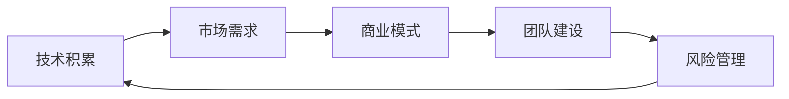

                 

# 程序员转型知识创业者的心路历程

## 1. 背景介绍

### 1.1 问题由来
随着人工智能、大数据、云计算等技术的迅猛发展，越来越多的程序员开始关注其技术积累如何转化为商业价值，即如何从技术专家转型为知识创业者。这一过程不仅涉及技术创新，更关乎市场洞察、商业模式构建和团队管理。本文旨在通过分享作者自身的经验，探讨程序员转型知识创业者的心路历程，并提出实用的建议和见解。

### 1.2 问题核心关键点
转型知识创业者的核心关键点包括：
- 技术积累的商业化：如何将技术转化为产品或服务，满足市场需求。
- 市场洞察力：识别潜在商业机会，准确把握市场需求。
- 商业模式构建：设计灵活高效的商业模型，实现技术变现。
- 团队建设与领导力：招募合适的人才，打造高效团队，并具备领导力。
- 资金筹措与风险管理：获取投资，合理分配资源，并有效管理风险。

这些关键点构成了程序员转型知识创业者的基本框架，帮助读者从技术人到商业领袖的跨越。

### 1.3 问题研究意义
通过探索程序员转型知识创业者的心路历程，本文旨在帮助读者：
- 提升技术积累的商业化能力，开拓新的业务领域。
- 强化市场洞察力，精准把握商业机会。
- 构建灵活高效的商业模式，提高产品或服务的竞争力。
- 增强团队建设和管理能力，打造有战斗力的创业团队。
- 提高风险管理意识和能力，保障项目的顺利推进。

## 2. 核心概念与联系

### 2.1 核心概念概述

为更好地理解程序员转型知识创业者的过程，本节将介绍几个关键概念及其相互关系：

- **技术积累**：程序员在职业生涯中积累的技术知识、项目经验、算法模型等。
- **市场需求**：市场中客户对于产品或服务的实际需求，包括功能、性能、价格等方面的要求。
- **商业模式**：基于市场需求和技术积累，设计出能够实现技术变现的商业模型。
- **团队建设**：根据项目需求和企业文化，招募、培养和管理团队成员。
- **风险管理**：识别和评估项目潜在的风险，并制定应对策略，确保项目顺利推进。

这些核心概念之间存在紧密的联系：技术积累是基础，市场需求是导向，商业模式是目标，团队建设是保障，风险管理是护航。

### 2.2 核心概念原理和架构的 Mermaid 流程图



这个流程图展示了各个核心概念之间的逻辑关系：技术积累通过对市场需求进行分析，形成商业模式；团队建设则支撑商业模式的具体实施；风险管理在项目推进过程中起到重要保障作用。通过不断的技术积累和迭代，逐步形成有效的商业模式和团队建设策略，降低风险，确保项目的成功。

## 3. 核心算法原理 & 具体操作步骤

### 3.1 算法原理概述

程序员转型知识创业者的过程，本质上是一个从技术人向商业领导者的转型的复杂算法。该算法融合了技术积累、市场分析、商业模式构建、团队管理和风险管理等多个环节，需要综合运用各种技术和策略，最终实现技术到商业的转化。

### 3.2 算法步骤详解

基于以上理解，以下将详细介绍程序员转型知识创业者的具体步骤：

**Step 1: 明确技术优势和市场需求**
- 评估自身技术积累，识别核心技术优势和特色。
- 分析市场需求，识别潜在客户和竞争对手。

**Step 2: 识别商业机会和潜在价值**
- 通过市场调研、用户访谈等手段，深入了解用户需求和痛点。
- 分析技术优势和市场需求，识别商业机会。

**Step 3: 设计商业模式**
- 确定目标客户和市场定位，设计定价策略。
- 选择合适的盈利模式，如订阅、广告、交易佣金等。

**Step 4: 构建团队和管理体系**
- 招募具备相关技术背景和业务经验的人才。
- 构建高效的团队协作和管理体系，如OKR、KPI等。

**Step 5: 制定风险管理策略**
- 识别项目潜在的风险点，如技术风险、市场风险、资金风险等。
- 制定相应的风险管理策略，如预留风险预算、建立应急预案等。

**Step 6: 实现技术到商业的转化**
- 将技术优势转化为实际的产品或服务。
- 通过市场推广，不断优化产品，提高客户满意度。

**Step 7: 持续迭代和优化**
- 收集用户反馈，持续改进产品和服务。
- 定期进行市场调研，保持对市场动态的敏感度。

### 3.3 算法优缺点

程序员转型知识创业者的算法具有以下优点：
- 整合性强：综合考虑技术、市场、团队、风险等多个方面，形成完整的商业模式。
- 灵活性高：根据市场需求和技术变化，快速调整商业模式和团队策略。
- 风险控制：通过风险管理，降低项目失败的可能性。

同时，该算法也存在一些缺点：
- 转换成本高：从技术专家转型为商业领袖需要大量的时间和资源投入。
- 市场不确定性：市场需求和技术趋势具有不确定性，可能带来高风险。
- 管理复杂度：团队建设和管理需要大量的时间和精力，需要具备较强的领导力。

### 3.4 算法应用领域

基于程序员转型知识创业者的算法，已经在多个领域得到成功应用，例如：

- **技术咨询与研发外包**：利用技术优势，为不同行业提供定制化解决方案。
- **SaaS软件平台**：开发面向特定行业或需求的软件平台，通过订阅或授权收费。
- **创业公司**：利用技术优势，创立全新的创业公司，探索新的商业模式。
- **技术服务提供**：提供API、云服务等技术服务，实现技术变现。

这些应用场景展示了程序员转型知识创业者的算法在实际中的广泛适用性。

## 4. 数学模型和公式 & 详细讲解 & 举例说明

### 4.1 数学模型构建

在此，我们将构建一个简化的数学模型来描述程序员转型知识创业者的过程。

设 $T$ 为技术积累，$M$ 为市场需求，$B$ 为商业模式，$T$ 为团队建设，$R$ 为风险管理。则整个转型过程可以表示为：

$$
T \rightarrow M \rightarrow B \rightarrow T \rightarrow R \rightarrow T
$$

其中，箭头表示因果关系，每个环节都需要输入输出，以确保整个转型的成功。

### 4.2 公式推导过程

我们将上述过程进一步细化，推导出各个环节的具体公式。

**技术积累**：
- 设 $T_1$ 为技术积累的投入，$T_2$ 为技术积累的效果。则有 $T_2 = f(T_1)$。

**市场需求**：
- 设 $M_1$ 为市场调研的投入，$M_2$ 为市场调研的效果。则有 $M_2 = g(M_1)$。

**商业模式**：
- 设 $B_1$ 为商业模式设计的投入，$B_2$ 为商业模式的效果。则有 $B_2 = h(B_1)$。

**团队建设**：
- 设 $T_3$ 为团队建设的投入，$T_4$ 为团队建设的效果。则有 $T_4 = i(T_3)$。

**风险管理**：
- 设 $R_1$ 为风险管理的投入，$R_2$ 为风险管理的效果。则有 $R_2 = j(R_1)$。

整个转型的效果 $T_{\text{total}}$ 可以表示为：

$$
T_{\text{total}} = k(T_2, M_2, B_2, T_4, R_2)
$$

其中 $k$ 为整体转型的函数。

### 4.3 案例分析与讲解

以某技术公司在市场推广阶段为例，分析各环节的投入与效果。

**案例背景**：
- 技术积累：开发了一款智能客服系统。
- 市场需求：通过市场调研，发现智能客服需求旺盛，但市场尚未成熟。
- 商业模式：决定采取SaaS模式，提供按需订阅服务。
- 团队建设：组建了一支包含技术、市场、运营等多个领域的专业团队。
- 风险管理：制定了市场拓展、资金使用等方面的应急预案。

**过程分析**：
- 技术积累 $T_1$：投入大量研发资源，提升系统性能和功能。
- 市场需求 $M_1$：进行市场调研，分析潜在客户和竞争对手。
- 商业模式 $B_1$：设计订阅模式，定价策略，选择市场定位。
- 团队建设 $T_3$：招聘市场、销售、客服等岗位人员，建立OKR体系。
- 风险管理 $R_1$：评估市场拓展的风险，制定相应的应急预案。

**效果分析**：
- 技术积累 $T_2$：系统性能和功能得到大幅提升，吸引了更多客户。
- 市场需求 $M_2$：市场调研得到准确数据，明确了目标客户和市场策略。
- 商业模式 $B_2$：按需订阅模式获得客户认可，市场份额逐步扩大。
- 团队建设 $T_4$：团队协作高效，快速响应市场需求。
- 风险管理 $R_2$：风险管理策略有效，项目顺利推进。

通过以上案例分析，可以看出，程序员转型知识创业者的算法是一个多环节相互作用的过程，每个环节的投入和效果都需要合理评估和管理。

## 5. 项目实践：代码实例和详细解释说明

### 5.1 开发环境搭建

在进行项目实践前，需要准备好开发环境。以下是使用Python进行Django开发的详细环境配置流程：

1. 安装Python：从官网下载并安装Python 3.9及以上版本。
2. 安装Django：使用pip安装Django框架，并创建新项目。
   ```bash
   pip install django
   django-admin startproject project_name
   ```
3. 配置数据库：修改项目配置文件，设置数据库连接信息。
   ```python
   DATABASES = {
       'default': {
           'ENGINE': 'django.db.backends.mysql',
           'NAME': 'your_database_name',
           'USER': 'your_username',
           'PASSWORD': 'your_password',
           'HOST': 'your_host',
           'PORT': 'your_port',
       }
   }
   ```
4. 安装第三方库：使用pip安装需要的第三方库，如requests、Pillow等。
   ```bash
   pip install requests Pillow
   ```
5. 创建应用：创建新的Django应用，编写app目录下的views、models、urls等文件。
   ```bash
   python manage.py startapp app_name
   ```

### 5.2 源代码详细实现

以下是使用Django框架开发智能客服系统的代码实现。

首先，定义模型的数据结构：

```python
from django.db import models

class User(models.Model):
    name = models.CharField(max_length=100)
    email = models.EmailField(unique=True)

class Ticket(models.Model):
    user = models.ForeignKey(User, on_delete=models.CASCADE)
    title = models.CharField(max_length=200)
    content = models.TextField()
    status = models.CharField(max_length=20, default='pending')
    created_at = models.DateTimeField(auto_now_add=True)
```

接着，定义视图函数，处理用户请求：

```python
from django.shortcuts import render, redirect
from django.http import HttpResponse

def home(request):
    if request.method == 'POST':
        name = request.POST['name']
        email = request.POST['email']
        content = request.POST['content']
        user = User(name=name, email=email)
        user.save()
        ticket = Ticket(user=user, title='New Ticket', content=content, status='pending')
        ticket.save()
        return redirect('ticket_detail', ticket_id=ticket.id)
    else:
        return render(request, 'home.html')
```

然后，定义URL路由，映射到相应的视图函数：

```python
from django.urls import path

urlpatterns = [
    path('', home, name='home'),
    path('ticket/<int:ticket_id>/', ticket_detail, name='ticket_detail'),
]
```

最后，创建HTML模板，呈现系统界面：

```html
<!-- home.html -->
<!DOCTYPE html>
<html lang="en">
<head>
    <meta charset="UTF-8">
    <title>Intelligent Customer Service</title>
</head>
<body>
    <h1>Contact Us</h1>
    <form method="post">
        
        <label>Name:</label>
        <input type="text" name="name"><br>
        <label>Email:</label>
        <input type="email" name="email"><br>
        <label>Content:</label>
        <textarea name="content"></textarea><br>
        <input type="submit" value="Submit">
    </form>
</body>
</html>
```

以上就是使用Django开发智能客服系统的完整代码实现。可以看到，Django框架提供了丰富的功能和工具，可以帮助开发者快速构建Web应用。

### 5.3 代码解读与分析

让我们再详细解读一下关键代码的实现细节：

**User和Ticket模型**：
- 定义了用户和工单的基本信息，如姓名、邮箱、工单标题、内容、状态和时间戳。
- 使用Django的ORM（对象关系映射），自动生成数据库表和查询语句。

**视图函数**：
- 处理用户提交的工单，保存用户信息到数据库，创建新的工单记录，并重定向到工单详情页。
- 如果请求方式为POST，则从表单数据中提取用户信息，创建新的工单记录，否则渲染HTML表单。

**URL路由**：
- 将视图函数映射到URL，实现了用户提交工单和查看工单详情的功能。

**HTML模板**：
- 使用HTML和Django模板语言，呈现用户提交工单的界面，包括姓名、邮箱、内容和提交按钮。

**结果展示**：
- 成功提交工单后，页面跳转到工单详情页，展示工单信息，包括创建时间和状态。

通过以上代码实现，可以看出Django框架的便捷性和高效性，可以帮助程序员快速开发出完整的功能。

## 6. 实际应用场景

### 6.1 智能客服系统

智能客服系统是程序员转型知识创业者的经典应用场景之一。通过开发智能客服系统，可以大幅提升客户咨询体验和问题解决效率，降低企业成本。

### 6.2 金融风险评估

金融领域需要对客户的信用风险进行评估。智能客服系统可以自动收集和分析客户数据，提供实时风险评估报告，辅助金融决策。

### 6.3 在线教育平台

在线教育平台需要具备智能推荐和答疑功能。程序员可以开发智能推荐系统，根据学生学习行为数据推荐课程，同时提供智能答疑服务，提升教育效果。

### 6.4 未来应用展望

随着技术的不断发展，程序员转型知识创业者的应用领域将不断扩大。未来，以下领域可能成为新的热点：

- **智慧医疗**：开发智能医疗咨询、疾病诊断、药物推荐等系统，提升医疗服务质量。
- **智能物流**：开发智能配送、库存管理、路线规划等系统，提高物流效率和准确性。
- **智慧农业**：开发智能种植、病虫害预测、农产品质量检测等系统，推动农业现代化。

## 7. 工具和资源推荐

### 7.1 学习资源推荐

为了帮助程序员转型知识创业者系统掌握相关知识和技能，以下推荐一些优质的学习资源：

1. **《Python Web开发实战》**：讲解如何使用Django、Flask等框架进行Web应用开发，适合初学者和进阶开发者。
2. **《软件设计模式》**：介绍经典的软件设计模式，帮助开发者构建高质量的代码结构。
3. **《机器学习实战》**：讲解机器学习的基础理论和实际应用，适合对数据和算法有初步了解的开发者。
4. **《创业之路：从0到1》**：讲述创业公司的建立和成长过程，提供实用的创业指导和经验分享。

### 7.2 开发工具推荐

工具的合理使用可以显著提高开发效率，以下是一些推荐的开发工具：

1. **Visual Studio Code**：功能强大、开源且免费，支持多种语言和框架的开发。
2. **JIRA**：项目管理工具，帮助团队高效协作和管理。
3. **Slack**：团队沟通工具，提供丰富的通信功能和集成功能。
4. **GitLab**：版本控制和持续集成平台，支持代码托管、CI/CD等功能。

### 7.3 相关论文推荐

以下推荐几篇与程序员转型知识创业者相关的经典论文：

1. **《The Lean Startup》**：作者Eric Ries提出了精益创业的方法论，通过快速验证假设、快速迭代优化，加速产品开发和市场验证。
2. **《Designing Growth: A Practical Playbook for Scaling Your Business》**：作者Alistair Croll和Jessica Livingston分享了公司增长的关键策略，提供了实用的增长框架和案例分析。
3. **《What Makes a Startup Stick? A Longitudinal Study of Product Growth》**：作者Andreessen和Dorsey通过案例研究，揭示了成功创业的关键因素，提供了宝贵的借鉴。

## 8. 总结：未来发展趋势与挑战

### 8.1 研究成果总结

本文通过深入分析程序员转型知识创业者的过程，提出了一套系统的转型方法论，帮助开发者从技术人到商业领袖的转变。核心内容包括技术积累的商业化、市场洞察力、商业模式构建、团队建设和风险管理等关键环节。

### 8.2 未来发展趋势

未来，程序员转型知识创业者的发展趋势将呈现以下几个方向：

1. **跨领域融合**：程序员将越来越多地融合技术、市场、设计等多个领域的知识，提升综合竞争力。
2. **自动化与智能化**：利用AI技术，提高开发效率和管理智能化水平，降低运营成本。
3. **云计算与大数据**：将云计算和大数据技术与业务深度结合，提升系统可靠性和可扩展性。
4. **区块链与隐私保护**：利用区块链技术，增强数据安全和隐私保护，提升系统安全性。

### 8.3 面临的挑战

尽管程序员转型知识创业者的前景广阔，但仍然面临以下挑战：

1. **技术和业务鸿沟**：技术人需要跨越技术和业务的鸿沟，提升市场洞察力和商业思维。
2. **人才匮乏**：具有跨领域知识和技能的人才相对稀缺，需要长期培养和积累。
3. **市场竞争**：新进入市场，面临激烈的市场竞争和客户获取的挑战。
4. **资金不足**：创业初期往往面临资金短缺问题，需要有效的资金筹措和资源管理。
5. **技术迭代**：快速变化的技术环境需要持续学习和适应，保持技术领先性。

### 8.4 研究展望

面对挑战，未来的研究需要从以下几个方面进行探索：

1. **跨领域人才培养**：加强跨学科教育和培训，提升技术人综合素质和商业思维。
2. **开源社区建设**：利用开源社区资源，促进知识共享和协作，降低创业门槛。
3. **创业平台建设**：建立创业孵化器和加速器，提供全方位的创业支持和服务。
4. **政策支持**：政府和企业应提供更多的创业政策支持和资金资助，促进创业环境的优化。

## 9. 附录：常见问题与解答

**Q1: 如何评估自身技术积累和市场需求？**

A: 评估技术积累时，可以通过以下几个步骤：
1. 梳理职业生涯中涉及的技术项目和任务，列出技术栈和关键技术点。
2. 对每个项目进行价值评估，识别核心技术优势和特色。
3. 根据市场需求，分析目标客户和竞品，识别潜在的商业机会。

**Q2: 如何设计合适的商业模式？**

A: 设计商业模式时，可以参考以下几个步骤：
1. 明确目标客户和市场定位。
2. 选择合适的盈利模式，如订阅、广告、交易佣金等。
3. 制定定价策略，考虑客户价值和市场竞争。
4. 设计用户界面和用户体验，提升客户满意度。

**Q3: 如何招募和培养团队成员？**

A: 招募团队成员时，可以从以下几个方面入手：
1. 明确岗位需求和技能要求。
2. 通过招聘网站和社交媒体，寻找合适的候选人。
3. 进行面试和背景调查，筛选最合适的候选人。
4. 建立培训和发展计划，帮助团队成员成长。

**Q4: 如何管理风险？**

A: 管理风险时，可以从以下几个方面入手：
1. 进行风险评估，识别潜在的风险点。
2. 制定应急预案，提前准备应对措施。
3. 实时监控项目进展，及时发现和解决问题。
4. 定期进行风险评估和调整，确保项目顺利推进。

**Q5: 如何实现技术到商业的转化？**

A: 实现技术到商业的转化时，可以遵循以下步骤：
1. 确定技术优势和市场需求。
2. 设计商业模式，明确盈利方式和目标客户。
3. 开发产品或服务，提供实际的价值。
4. 进行市场推广，不断优化产品和服务。

---

作者：禅与计算机程序设计艺术 / Zen and the Art of Computer Programming

