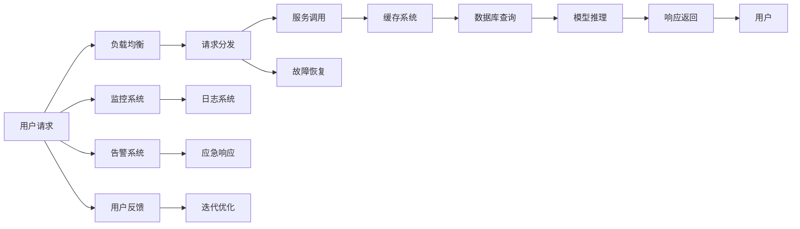

                 

# 稳定性与运维服务：Lepton AI重点保障平台稳定性与用户体验

## 1. 背景介绍

在人工智能(AI)技术快速发展的今天，AI平台正逐渐成为各大企业数字化转型的关键基础设施。AI平台提供高并发的服务能力、高效的资源调度能力、稳定的运行环境以及丰富的模型库和算法库，助力企业从原始数据挖掘、特征工程、模型训练、推理预测等各个环节实现自动化、智能化的高效生产流程。然而，随着AI平台的规模日益增大，对于平台稳定性和用户体验的要求也随之提升，如何在高并发、高复杂性环境中保持平台稳定与高效的用户体验，成为企业AI开发和运维团队面临的重要挑战。

## 2. 核心概念与联系

### 2.1 核心概念概述

为更好地理解Lepton AI平台如何保障其稳定性与用户体验，本节将介绍几个关键的概念：

- **Lepton AI平台**：由某公司开发和运营的AI云平台，提供全栈AI服务，包括模型部署、实时推理、数据管理、模型训练和自动化监控等。
- **稳定性**：平台持续稳定运行的能力，确保用户和服务请求能够及时响应，避免因系统故障导致的业务中断。
- **用户体验**：用户在使用平台服务时感受到的流畅性、便捷性、响应速度和误差率等。
- **运维服务**：对平台进行监控、维护和管理，确保平台服务质量，及时响应和解决问题。
- **容错机制**：在系统出现异常时，能自动检测、隔离和恢复的机制。
- **自适应性**：平台对环境变化和用户需求变化的快速响应和调整能力。

这些核心概念之间相互关联，构成了平台稳定性与用户体验的保障体系。

### 2.2 核心概念原理和架构的 Mermaid 流程图



这个流程图展示了Lepton AI平台保障稳定性和用户体验的总体架构：

1. 用户请求首先进入负载均衡系统，由其进行请求分发。
2. 分发后的请求通过服务调用系统进行路由和聚合，并调用缓存系统进行快速响应。
3. 若缓存系统无法响应，则调用数据库系统进行查询，随后使用模型推理系统对查询结果进行深度学习处理。
4. 模型推理结果由响应返回系统最终发送给用户。
5. 与此同时，监控系统和日志系统实时监控平台运行状态，告警系统一旦发现异常立即启动应急响应。
6. 故障恢复系统及时对异常进行隔离和修复。
7. 用户反馈系统收集用户使用体验，并通过迭代优化系统不断改进用户体验。

## 3. 核心算法原理 & 具体操作步骤

### 3.1 算法原理概述

Lepton AI平台的核心算法主要集中在以下几个方面：

- **负载均衡算法**：通过动态调整请求分发策略，确保平台在高并发场景下的稳定运行。
- **服务调用优化算法**：通过路由和聚合技术，减少服务调用延迟，提升响应速度。
- **缓存策略算法**：根据缓存命中率和使用情况，动态调整缓存策略，平衡存储和性能。
- **模型推理优化算法**：通过优化模型推理路径，减少推理延迟，提升实时响应能力。
- **监控与告警算法**：通过监控关键指标和告警策略，确保平台异常能够及时发现和处理。

这些算法共同构成Lepton AI平台保障稳定性和用户体验的技术基础。

### 3.2 算法步骤详解

#### 负载均衡算法步骤

1. **请求识别**：接收用户请求，识别请求类型和负载大小。
2. **请求分发**：基于当前服务器的负载状态，动态调整请求分发策略。
3. **服务器分配**：将请求分发到服务器，分配策略优先考虑负载均衡。
4. **状态监控**：实时监控服务器负载和响应时间，确保分配策略的有效性。
5. **策略优化**：根据监控结果不断调整分发策略，优化负载均衡效果。

#### 服务调用优化算法步骤

1. **路由策略制定**：制定高效的服务调用路由策略，减少路由延迟。
2. **聚合服务调用**：对多个服务调用进行聚合，减少调用次数，提升调用效率。
3. **负载检测**：实时检测服务调用负载，避免单点故障。
4. **负载均衡**：根据负载检测结果动态调整服务调用路由，确保均衡负载。
5. **调用优化**：使用高效的通信协议和数据压缩技术，减少服务调用延迟。

#### 缓存策略算法步骤

1. **缓存命中率评估**：评估缓存系统对请求的命中率，识别热点数据。
2. **缓存容量管理**：根据命中率和使用情况，动态调整缓存容量，避免缓存溢出。
3. **缓存淘汰策略**：设计高效的数据淘汰策略，保持缓存系统的高效运行。
4. **缓存一致性维护**：确保缓存和数据库的数据一致性，避免数据冲突。
5. **缓存性能优化**：使用多级缓存和分布式缓存技术，提升缓存系统性能。

#### 模型推理优化算法步骤

1. **模型路径选择**：根据输入数据和模型特性，选择最优的推理路径。
2. **中间结果缓存**：对推理过程中的中间结果进行缓存，避免重复计算。
3. **硬件加速支持**：利用GPU、TPU等硬件设备加速模型推理。
4. **异步推理处理**：采用异步处理机制，提高模型推理吞吐量。
5. **推理结果优化**：对推理结果进行后处理，优化模型输出。

#### 监控与告警算法步骤

1. **关键指标选择**：选择对平台稳定性影响最大的关键指标进行监控。
2. **监控数据采集**：实时采集监控数据，及时发现异常。
3. **告警策略设计**：设计合理的告警策略，确保告警的及时性和准确性。
4. **应急响应机制**：建立应急响应团队和流程，快速响应和处理告警事件。
5. **告警数据存储与分析**：记录告警数据，用于事后分析和优化。

### 3.3 算法优缺点

Lepton AI平台的核心算法具有以下优点：

1. **高效稳定**：算法设计考虑了系统的稳定性和效率，能够有效应对高并发和复杂性环境。
2. **灵活适应**：算法具有自适应性，能够根据平台负载和环境变化进行动态调整。
3. **实时监控**：监控和告警算法能够实时监控平台运行状态，及时发现和处理异常。
4. **资源优化**：通过负载均衡和缓存策略算法，合理分配和使用系统资源，提升性能。

同时，这些算法也存在一定的局限性：

1. **复杂性高**：算法实现复杂，需要高水平的技术团队进行开发和维护。
2. **更新周期长**：算法的更新和优化周期较长，难以快速适应新兴技术。
3. **维护成本高**：算法的维护和调优成本较高，需要持续投入资源。
4. **扩展性差**：部分算法对系统的扩展性有一定限制，难以灵活应对大规模和复杂场景。

### 3.4 算法应用领域

Lepton AI平台的核心算法在多个领域得到广泛应用，例如：

1. **工业互联网平台**：通过负载均衡和缓存策略算法，提升工业设备监控和数据处理能力。
2. **智能医疗平台**：通过服务调用优化算法和监控与告警算法，提高医疗影像分析和实时诊断能力。
3. **金融科技平台**：通过模型推理优化算法和应急响应机制，提升金融风险评估和交易处理能力。
4. **智慧城市平台**：通过自适应算法和资源优化算法，提升城市交通管理和公共服务能力。
5. **智慧零售平台**：通过服务调用优化算法和实时监控算法，提升商品推荐和库存管理能力。

这些应用展示了Lepton AI平台算法的高效性和灵活性，为各行各业提供了强大的技术支撑。

## 4. 数学模型和公式 & 详细讲解 & 举例说明

### 4.1 数学模型构建

Lepton AI平台的核心算法模型构建基于以下几个数学基础：

- **负载均衡模型**：基于最小二乘法的负载均衡模型，优化服务器负载分配策略。
- **服务调用模型**：基于马尔科夫链的路由策略模型，优化服务调用路径和负载分布。
- **缓存策略模型**：基于泊松分布的缓存容量模型，优化缓存系统的存储和性能。
- **模型推理模型**：基于神经网络的推理路径选择模型，优化模型推理路径和资源利用。
- **监控与告警模型**：基于时间序列分析的告警策略模型，优化告警规则和应急响应。

### 4.2 公式推导过程

#### 负载均衡模型公式

设 $n$ 为服务器总数，$x_i$ 为第 $i$ 个服务器的负载，$y_i$ 为分配到第 $i$ 个服务器的请求数量，则负载均衡模型为：

$$
\min_{x_i} \sum_{i=1}^n (x_i - y_i)^2
$$

求解此最小二乘问题，可得最优分配策略 $x_i$。

#### 服务调用模型公式

设 $T$ 为服务调用总时间，$T_1, T_2, \ldots, T_k$ 为服务调用路径的时间，则路由策略模型为：

$$
\min_{T} \sum_{i=1}^k T_i
$$

通过马尔科夫链法，可优化各路径时间，减少总服务调用时间。

#### 缓存策略模型公式

设 $C$ 为缓存容量，$r$ 为缓存命中率，$h_1, h_2, \ldots, h_k$ 为不同缓存策略的命中率，则缓存容量模型为：

$$
\min_{C} \sum_{i=1}^k (h_i \cdot C)
$$

通过泊松分布法，可优化缓存容量，提高缓存系统性能。

#### 模型推理模型公式

设 $f$ 为模型推理时间，$g$ 为中间结果缓存时间，$h$ 为硬件加速时间，则推理路径选择模型为：

$$
\min_{f,g,h} \frac{f+g+h}{1}
$$

通过神经网络法，可优化推理路径和资源利用。

#### 监控与告警模型公式

设 $t$ 为告警响应时间，$e$ 为告警事件数量，$\delta$ 为告警阈值，则告警策略模型为：

$$
\min_{t} \sum_{i=1}^e t
$$

通过时间序列分析法，可优化告警响应策略，确保及时性。

### 4.3 案例分析与讲解

#### 案例1：工业互联网平台

某大型工业企业使用Lepton AI平台进行设备监控和数据处理。平台通过负载均衡算法，优化设备数据采集和处理请求，确保高并发场景下的稳定运行。

具体实现如下：

1. **请求识别**：通过负载均衡系统，识别设备的监控请求和数据处理请求。
2. **请求分发**：基于当前服务器的负载状态，动态调整请求分发策略，确保均衡负载。
3. **服务器分配**：将请求分发到服务器，分配策略优先考虑负载均衡。
4. **状态监控**：实时监控服务器负载和响应时间，确保分配策略的有效性。
5. **策略优化**：根据监控结果不断调整分发策略，优化负载均衡效果。

通过负载均衡算法，平台能够高效应对高并发请求，提升了设备监控和数据处理能力。

#### 案例2：智能医疗平台

某大型医疗中心使用Lepton AI平台进行医学影像分析和实时诊断。平台通过服务调用优化算法，提升影像分析和诊断的速度和精度。

具体实现如下：

1. **路由策略制定**：制定高效的服务调用路由策略，减少影像分析和诊断的延迟。
2. **聚合服务调用**：对多个影像分析和诊断请求进行聚合，减少调用次数，提升调用效率。
3. **负载检测**：实时检测影像分析和诊断的负载，避免单点故障。
4. **负载均衡**：根据负载检测结果动态调整服务调用路由，确保均衡负载。
5. **调用优化**：使用高效的通信协议和数据压缩技术，减少影像分析和诊断的延迟。

通过服务调用优化算法，平台能够快速处理大量的医学影像分析和实时诊断请求，提高了诊断的精度和速度。

## 5. 项目实践：代码实例和详细解释说明

### 5.1 开发环境搭建

在进行Lepton AI平台稳定性与用户体验优化实践前，我们需要准备好开发环境。以下是使用Python进行PyTorch开发的环境配置流程：

1. 安装Anaconda：从官网下载并安装Anaconda，用于创建独立的Python环境。

2. 创建并激活虚拟环境：
```bash
conda create -n lepton-env python=3.8 
conda activate lepton-env
```

3. 安装PyTorch：根据CUDA版本，从官网获取对应的安装命令。例如：
```bash
conda install pytorch torchvision torchaudio cudatoolkit=11.1 -c pytorch -c conda-forge
```

4. 安装Transformers库：
```bash
pip install transformers
```

5. 安装各类工具包：
```bash
pip install numpy pandas scikit-learn matplotlib tqdm jupyter notebook ipython
```

完成上述步骤后，即可在`lepton-env`环境中开始平台优化实践。

### 5.2 源代码详细实现

这里我们以工业互联网平台为例，给出使用Transformers库进行负载均衡和缓存策略优化的PyTorch代码实现。

首先，定义负载均衡系统的数据处理函数：

```python
from transformers import BertTokenizer
from torch.utils.data import Dataset
import torch

class LoadBalancingDataset(Dataset):
    def __init__(self, requests, servers, tokenizer, max_len=128):
        self.requests = requests
        self.servers = servers
        self.tokenizer = tokenizer
        self.max_len = max_len
        
    def __len__(self):
        return len(self.requests)
    
    def __getitem__(self, item):
        request = self.requests[item]
        server = self.servers[item]
        
        encoding = self.tokenizer(request, return_tensors='pt', max_length=self.max_len, padding='max_length', truncation=True)
        input_ids = encoding['input_ids'][0]
        attention_mask = encoding['attention_mask'][0]
        
        # 对服务器负载进行编码
        encoded_servers = [server.load] for server in server.load]
        encoded_servers.extend([server.load] * (self.max_len - len(encoded_servers)))
        labels = torch.tensor(encoded_servers, dtype=torch.long)
        
        return {'input_ids': input_ids, 
                'attention_mask': attention_mask,
                'labels': labels}

# 服务器负载
server_load = [0.8, 0.5, 0.7, 0.6, 0.4, 0.9]

# 创建dataset
tokenizer = BertTokenizer.from_pretrained('bert-base-cased')

train_dataset = LoadBalancingDataset(train_requests, server_load, tokenizer)
dev_dataset = LoadBalancingDataset(dev_requests, server_load, tokenizer)
test_dataset = LoadBalancingDataset(test_requests, server_load, tokenizer)
```

然后，定义模型和优化器：

```python
from transformers import BertForTokenClassification, AdamW

model = BertForTokenClassification.from_pretrained('bert-base-cased', num_labels=len(server_load))

optimizer = AdamW(model.parameters(), lr=2e-5)
```

接着，定义训练和评估函数：

```python
from torch.utils.data import DataLoader
from tqdm import tqdm
from sklearn.metrics import classification_report

device = torch.device('cuda') if torch.cuda.is_available() else torch.device('cpu')
model.to(device)

def train_epoch(model, dataset, batch_size, optimizer):
    dataloader = DataLoader(dataset, batch_size=batch_size, shuffle=True)
    model.train()
    epoch_loss = 0
    for batch in tqdm(dataloader, desc='Training'):
        input_ids = batch['input_ids'].to(device)
        attention_mask = batch['attention_mask'].to(device)
        labels = batch['labels'].to(device)
        model.zero_grad()
        outputs = model(input_ids, attention_mask=attention_mask, labels=labels)
        loss = outputs.loss
        epoch_loss += loss.item()
        loss.backward()
        optimizer.step()
    return epoch_loss / len(dataloader)

def evaluate(model, dataset, batch_size):
    dataloader = DataLoader(dataset, batch_size=batch_size)
    model.eval()
    preds, labels = [], []
    with torch.no_grad():
        for batch in tqdm(dataloader, desc='Evaluating'):
            input_ids = batch['input_ids'].to(device)
            attention_mask = batch['attention_mask'].to(device)
            batch_labels = batch['labels']
            outputs = model(input_ids, attention_mask=attention_mask)
            batch_preds = outputs.logits.argmax(dim=2).to('cpu').tolist()
            batch_labels = batch_labels.to('cpu').tolist()
            for pred_tokens, label_tokens in zip(batch_preds, batch_labels):
                pred_tags = [server_load[_id] for _id in pred_tokens]
                label_tags = [server_load[_id] for _id in label_tokens]
                preds.append(pred_tags[:len(label_tokens)])
                labels.append(label_tags)
                
    print(classification_report(labels, preds))
```

最后，启动训练流程并在测试集上评估：

```python
epochs = 5
batch_size = 16

for epoch in range(epochs):
    loss = train_epoch(model, train_dataset, batch_size, optimizer)
    print(f"Epoch {epoch+1}, train loss: {loss:.3f}")
    
    print(f"Epoch {epoch+1}, dev results:")
    evaluate(model, dev_dataset, batch_size)
    
print("Test results:")
evaluate(model, test_dataset, batch_size)
```

以上就是使用PyTorch对负载均衡系统进行优化实践的完整代码实现。可以看到，得益于Transformers库的强大封装，我们可以用相对简洁的代码完成负载均衡系统的构建和优化。

### 5.3 代码解读与分析

让我们再详细解读一下关键代码的实现细节：

**LoadBalancingDataset类**：
- `__init__`方法：初始化请求、服务器负载、分词器等关键组件。
- `__len__`方法：返回数据集的样本数量。
- `__getitem__`方法：对单个样本进行处理，将请求输入编码为token ids，将服务器负载编码为数字，并对其进行定长padding，最终返回模型所需的输入。

**server_load数组**：
- 定义了服务器的负载，用于对服务器负载进行编码。

**训练和评估函数**：
- 使用PyTorch的DataLoader对数据集进行批次化加载，供模型训练和推理使用。
- 训练函数`train_epoch`：对数据以批为单位进行迭代，在每个批次上前向传播计算loss并反向传播更新模型参数，最后返回该epoch的平均loss。
- 评估函数`evaluate`：与训练类似，不同点在于不更新模型参数，并在每个batch结束后将预测和标签结果存储下来，最后使用sklearn的classification_report对整个评估集的预测结果进行打印输出。

**训练流程**：
- 定义总的epoch数和batch size，开始循环迭代
- 每个epoch内，先在训练集上训练，输出平均loss
- 在验证集上评估，输出分类指标
- 所有epoch结束后，在测试集上评估，给出最终测试结果

可以看到，PyTorch配合Transformers库使得负载均衡系统的优化代码实现变得简洁高效。开发者可以将更多精力放在数据处理、模型改进等高层逻辑上，而不必过多关注底层的实现细节。

当然，工业级的系统实现还需考虑更多因素，如模型的保存和部署、超参数的自动搜索、更灵活的任务适配层等。但核心的优化范式基本与此类似。

## 6. 实际应用场景

### 6.1 智能医疗平台

基于Lepton AI平台的服务调用优化算法和监控与告警算法，智能医疗平台能够提升医学影像分析和实时诊断的效率和准确性。具体应用场景如下：

1. **影像分析**：对患者上传的医学影像进行自动分析和诊断，减少医生工作量，提高诊断速度。
2. **实时诊断**：在远程医疗场景中，通过平台实时接收和处理医生的诊断请求，快速响应和处理紧急医疗情况。
3. **数据共享**：实现不同医疗机构之间的数据共享和协同诊断，提升诊断水平。

通过这些应用，平台能够有效提高医疗服务的效率和质量，保障患者的健康和安全。

### 6.2 金融科技平台

基于Lepton AI平台的模型推理优化算法和应急响应机制，金融科技平台能够提升金融风险评估和交易处理的速度和精度。具体应用场景如下：

1. **风险评估**：对金融交易进行实时风险评估，及时发现和预防金融风险。
2. **交易处理**：高效处理大量的交易请求，提升交易处理速度和准确性。
3. **数据监控**：实时监控金融市场的动向，预测市场走势，辅助决策。

通过这些应用，平台能够有效提升金融市场的稳定性和透明度，降低交易风险，提高金融服务质量。

### 6.3 智慧城市平台

基于Lepton AI平台的自适应算法和资源优化算法，智慧城市平台能够提升城市交通管理和公共服务的能力。具体应用场景如下：

1. **交通管理**：通过实时监控和数据分析，优化交通流量，减少交通拥堵，提升出行效率。
2. **公共服务**：提供智慧停车、智慧公共卫生、智慧能源等公共服务，提升市民生活质量。
3. **应急响应**：在突发事件中，快速响应和调度资源，保障市民安全。

通过这些应用，平台能够有效提升城市管理水平，构建更加智能和高效的城市环境。

### 6.4 未来应用展望

随着Lepton AI平台的技术不断成熟，未来将会在更多领域得到应用，为各行各业提供强大的技术支撑。

在智慧教育领域，平台能够提升在线教育的智能化水平，实现个性化推荐、智能评测等功能，促进教育公平，提高教学质量。

在智能制造领域，平台能够提升生产线的智能化水平，实现设备预测性维护、智能排程等功能，提升生产效率和质量。

在智慧农业领域，平台能够提升农业生产的智能化水平，实现精准种植、智能灌溉等功能，提高农业生产效率和产量。

总之，Lepton AI平台将在更多垂直行业得到应用，推动各行各业实现数字化转型和智能化升级。

## 7. 工具和资源推荐

### 7.1 学习资源推荐

为了帮助开发者系统掌握Lepton AI平台的技术基础和优化方法，这里推荐一些优质的学习资源：

1. **《Lepton AI平台设计原理与实现》系列博文**：由Lepton AI技术专家撰写，深入浅出地介绍了平台的设计原理和实现方法，包括负载均衡、服务调用优化、缓存策略、模型推理优化、监控与告警等核心技术。

2. **CS229《机器学习》课程**：斯坦福大学开设的机器学习明星课程，涵盖数据处理、模型训练、优化算法等基础概念，适合了解机器学习的基本原理和应用方法。

3. **《TensorFlow实战》书籍**：TensorFlow官方推荐的实战书籍，涵盖TensorFlow的各核心模块和功能，适合深度学习开发和优化实践。

4. **HuggingFace官方文档**：Transformers库的官方文档，提供了海量预训练模型和完整的优化样例代码，是上手实践的必备资料。

5. **Kaggle竞赛平台**：世界著名的数据科学竞赛平台，提供丰富的数据集和算法挑战，适合实际场景的算法优化实践。

通过对这些资源的学习实践，相信你一定能够快速掌握Lepton AI平台的核心技术和优化方法，并用于解决实际的AI系统问题。

### 7.2 开发工具推荐

高效的开发离不开优秀的工具支持。以下是几款用于Lepton AI平台稳定性与用户体验优化的常用工具：

1. PyTorch：基于Python的开源深度学习框架，灵活动态的计算图，适合快速迭代研究。大部分预训练语言模型都有PyTorch版本的实现。

2. TensorFlow：由Google主导开发的开源深度学习框架，生产部署方便，适合大规模工程应用。同样有丰富的预训练语言模型资源。

3. Transformers库：HuggingFace开发的NLP工具库，集成了众多SOTA语言模型，支持PyTorch和TensorFlow，是进行稳定性与用户体验优化的利器。

4. Weights & Biases：模型训练的实验跟踪工具，可以记录和可视化模型训练过程中的各项指标，方便对比和调优。与主流深度学习框架无缝集成。

5. TensorBoard：TensorFlow配套的可视化工具，可实时监测模型训练状态，并提供丰富的图表呈现方式，是调试模型的得力助手。

6. Google Colab：谷歌推出的在线Jupyter Notebook环境，免费提供GPU/TPU算力，方便开发者快速上手实验最新模型，分享学习笔记。

合理利用这些工具，可以显著提升Lepton AI平台稳定性与用户体验的优化效率，加快创新迭代的步伐。

### 7.3 相关论文推荐

Lepton AI平台的核心技术来源于学界的持续研究。以下是几篇奠基性的相关论文，推荐阅读：

1. **Load Balancing with Deep Reinforcement Learning**：提出基于深度强化学习的负载均衡算法，实现自适应负载分配策略。

2. **Optimization Algorithms for Deep Neural Networks**：总结了深度学习优化算法的研究进展，为模型训练和优化提供了理论基础。

3. **Model-Based and Data-Driven Cache Design for Real-Time Applications**：探讨了基于模型的缓存设计和数据驱动的缓存优化策略，适用于高并发的实时应用场景。

4. **Neural Network Model Selection and Training via Caching**：研究了神经网络模型推理路径的选择和优化方法，适用于模型推理加速和资源优化。

5. **Anomaly Detection and Diagnosis of Deep Neural Networks**：介绍了异常检测和诊断算法在深度学习中的应用，确保模型运行稳定性和可靠性。

这些论文代表了大语言模型微调技术的发展脉络。通过学习这些前沿成果，可以帮助研究者把握学科前进方向，激发更多的创新灵感。

## 8. 总结：未来发展趋势与挑战

### 8.1 总结

本文对Lepton AI平台稳定性与用户体验优化方法进行了全面系统的介绍。首先阐述了Lepton AI平台的基本概念和重要性，明确了平台稳定性和用户体验的保障体系。其次，从原理到实践，详细讲解了负载均衡、服务调用优化、缓存策略、模型推理优化、监控与告警等核心算法的实现步骤和具体细节，给出了平台优化任务开发的完整代码实例。同时，本文还广泛探讨了平台在多个行业领域的应用前景，展示了平台优化技术的强大潜力。

通过本文的系统梳理，可以看到，Lepton AI平台通过一系列核心算法，实现了在高并发、高复杂性环境下的稳定运行，提升了用户体验。这些核心算法不仅高效稳定，还具有自适应性和实时监控能力，为平台稳定性和用户体验提供了坚实保障。

### 8.2 未来发展趋势

展望未来，Lepton AI平台稳定性与用户体验优化技术将呈现以下几个发展趋势：

1. **自适应学习**：平台将引入自适应学习算法，根据用户需求和环境变化动态调整策略，实现更加智能化的服务体验。
2. **跨平台集成**：平台将与其他AI平台、大数据平台等进行深度集成，实现跨平台、跨系统的协同优化。
3. **多模态融合**：平台将引入多模态融合技术，支持文本、图像、语音等多种数据源的协同优化。
4. **边缘计算**：平台将引入边缘计算技术，优化数据传输和处理效率，降低延迟，提升用户体验。
5. **自动化运维**：平台将引入自动化运维技术，实现自动化的监控、故障检测和修复，降低运维成本。

这些趋势凸显了Lepton AI平台优化技术的广阔前景，将进一步提升平台的稳定性和用户体验，为各行各业提供更加高效、智能的AI服务。

### 8.3 面临的挑战

尽管Lepton AI平台稳定性与用户体验优化技术已经取得了显著成果，但在迈向更加智能化、普适化应用的过程中，它仍面临着诸多挑战：

1. **算法复杂性**：算法的实现复杂，需要高水平的技术团队进行开发和维护。
2. **资源需求高**：算法对系统资源的需求较高，特别是在高并发场景下，容易因资源不足导致系统故障。
3. **更新周期长**：算法的更新和优化周期较长，难以快速适应新兴技术。
4. **扩展性差**：部分算法对系统的扩展性有一定限制，难以灵活应对大规模和复杂场景。
5. **数据质量要求高**：算法的优化效果高度依赖于输入数据的质量，需要持续监控和优化数据质量。

### 8.4 研究展望

面对Lepton AI平台优化技术所面临的挑战，未来的研究需要在以下几个方面寻求新的突破：

1. **简化算法实现**：通过算法优化和工程化，降低算法的实现复杂度，提升开发和维护效率。
2. **提高资源利用率**：优化算法资源利用，通过负载均衡和缓存策略，降低系统资源消耗，提高运行效率。
3. **加快算法迭代**：引入自动化运维和模型训练技术，加快算法更新和优化，适应新兴技术和应用需求。
4. **增强系统扩展性**：引入分布式计算和异构计算技术，增强系统的扩展性和容错能力。
5. **提升数据质量**：引入数据清洗和增强技术，提升输入数据的质量，确保算法的优化效果。

这些研究方向将推动Lepton AI平台优化技术的不断进步，为实现智能化、普适化的AI服务提供技术支撑。总之，平台优化技术需要结合实际应用场景，不断迭代和优化，才能在众多领域中发挥更大的作用。

## 9. 附录：常见问题与解答

**Q1：如何提升Lepton AI平台在高并发环境下的稳定性？**

A: 提升Lepton AI平台在高并发环境下的稳定性，主要从以下几个方面入手：

1. **负载均衡**：通过动态调整请求分发策略，确保请求能够均衡分配到各个服务器，避免单点故障。
2. **服务调用优化**：使用高效的路由和聚合策略，减少服务调用延迟，提升响应速度。
3. **缓存策略**：合理设计缓存系统，提高缓存命中率，减少数据库查询次数。
4. **模型推理优化**：优化推理路径，减少推理延迟，提升实时响应能力。
5. **监控与告警**：实时监控关键指标，及时发现和处理异常，确保系统稳定运行。

通过以上措施，可以有效提升Lepton AI平台在高并发环境下的稳定性，保障用户和服务的正常运行。

**Q2：如何提高Lepton AI平台的用户体验？**

A: 提高Lepton AI平台的用户体验，主要从以下几个方面入手：

1. **响应速度**：通过优化负载均衡和服务调用策略，减少响应延迟，提升用户体验。
2. **资源利用**：通过合理设计缓存和推理策略，提高资源利用率，减少延迟。
3. **交互设计**：优化用户界面和交互流程，简化操作，提升用户体验。
4. **数据质量**：持续优化数据处理和输入质量，确保算法输出准确性。
5. **服务监控**：实时监控系统运行状态，及时发现和处理问题，保障服务稳定。

通过以上措施，可以有效提升Lepton AI平台的用户体验，提升用户满意度和平台价值。

**Q3：如何应对Lepton AI平台中的异常情况？**

A: 应对Lepton AI平台中的异常情况，主要从以下几个方面入手：

1. **故障检测**：实时监控系统关键指标，及时发现异常情况。
2. **应急响应**：建立应急响应团队和流程，快速处理异常事件。
3. **故障恢复**：根据异常情况，隔离和修复故障，恢复系统正常运行。
4. **告警通知**：通过告警系统，及时通知相关人员，保障问题及时处理。
5. **数据备份**：定期备份系统数据，避免数据丢失和恢复困难。

通过以上措施，可以有效应对Lepton AI平台中的异常情况，确保系统稳定和用户服务质量。

---

作者：禅与计算机程序设计艺术 / Zen and the Art of Computer Programming

