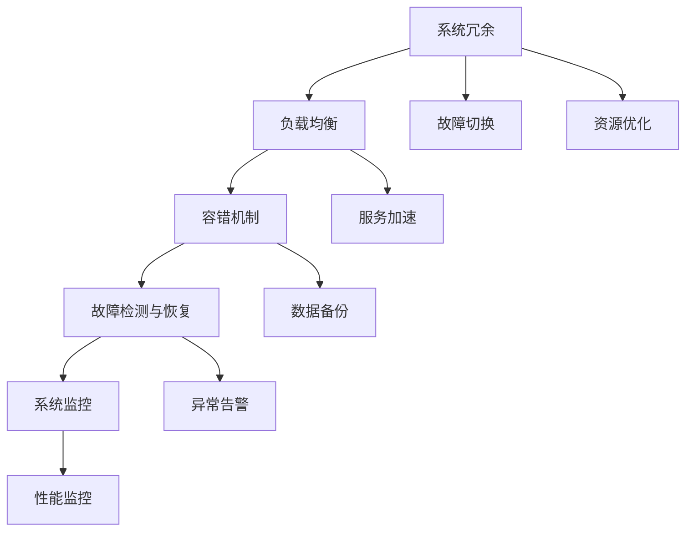

                 

# 站点可靠性工程挑战：大规模系统

> 关键词：站点可靠性、大规模系统、容错机制、负载均衡、故障检测与恢复、系统监控

## 1. 背景介绍

在现代社会中，随着互联网应用的普及和数据量的爆炸性增长，站点可靠性已经成为企业和个人极为关注的焦点。特别是对于大规模网站，如电商、社交网络、在线视频等平台，站点可靠性的挑战更加严峻。一方面，用户对站点服务质量有着很高的要求；另一方面，系统的复杂性和数据规模又使得构建高可靠的系统变得非常困难。本文将系统介绍站点可靠性工程面临的关键问题，以及这些问题的应对策略。

## 2. 核心概念与联系

站点可靠性是指一个站点在遭受硬件故障、网络攻击、服务压力等威胁时，仍然能够持续稳定地为用户提供服务的特性。大规模系统的站点可靠性不仅需要考虑单个节点的健康状态，还需要综合考虑整个系统的冗余、负载均衡、容错、故障检测与恢复、系统监控等多个方面。

以下是几个关键概念及其之间的联系：

- **系统冗余**：通过增加硬件或软件资源的冗余，当某一节点出现故障时，系统可以自动切换到其他正常节点，从而保证服务不中断。
- **负载均衡**：合理分配系统负载，使得各个节点的压力均衡，防止单一节点过载导致故障。
- **容错机制**：在出现故障时，能够自动检测并切换故障节点，保证系统服务的不中断。
- **故障检测与恢复**：通过实时监控系统状态，快速发现和解决故障，确保系统快速恢复。
- **系统监控**：实时监控系统性能，及时发现异常，并快速响应。

这些概念之间的联系可以通过以下Mermaid流程图来展示：



这个流程图展示了站点可靠性工程的各个环节，以及它们之间的相互关系。系统冗余是基础，负载均衡、容错机制、故障检测与恢复、系统监控是关键的支撑手段，故障切换和资源优化则是实际应用中的具体操作。

## 3. 核心算法原理 & 具体操作步骤

### 3.1 算法原理概述

站点可靠性工程的核心是构建一个高可用性的系统架构，该架构能够在不同故障场景下保持系统的稳定运行。高可用性系统通常采用多个副本和故障转移机制，以确保在单点故障时系统的连续性和可用性。以下是一些常用的可靠性算法和原理：

- **主从复制**：在数据中心部署多个副本，其中一个是主节点，其余是备份节点。主节点负责处理读写操作，备份节点负责数据同步。
- **心跳机制**：定期发送心跳包，检测节点是否正常工作。若某个节点未能响应，则视为故障，系统自动切换到备份节点。
- **分布式锁**：在分布式环境下，使用分布式锁机制来保证数据一致性和并发控制。
- **多副本写入**：采用多副本写入的方式，确保数据的一致性和可靠性。
- **日志复制**：将日志信息复制到多个节点，确保在节点故障时数据的完整性和一致性。

### 3.2 算法步骤详解

以主从复制算法为例，介绍其具体操作步骤：

1. **初始化配置**：定义主节点和备份节点，设置心跳间隔时间和最大心跳次数等参数。
2. **启动主节点**：启动主节点，并配置其负责处理读写操作。
3. **启动备份节点**：启动备份节点，并配置其负责数据同步和接收主节点指令。
4. **心跳检测**：主节点和备份节点之间定期发送心跳包，检测彼此是否正常工作。
5. **故障检测与切换**：若某个节点未能响应心跳包，则认为该节点故障。此时，系统自动切换到备份节点，保证服务的连续性。
6. **数据同步**：备份节点接收主节点发送的数据，并进行同步更新，确保数据的一致性。
7. **故障恢复**：当故障节点恢复后，重新连接到系统，并由备份节点自动切换到主节点。

### 3.3 算法优缺点

**优点**：
- **高可用性**：通过多个节点的冗余配置，确保在单点故障时系统能够继续服务。
- **快速切换**：通过心跳机制和故障检测与恢复机制，可以实时切换故障节点，确保服务连续性。
- **扩展性强**：主从复制机制易于扩展，可以根据业务需求增加或减少节点数量。

**缺点**：
- **复杂度较高**：系统需要维护多个副本和节点的状态，管理复杂。
- **性能损失**：由于数据需要在主节点和备份节点之间同步，可能会影响系统性能。
- **单点故障问题**：主节点故障时，整个系统可能会瘫痪。

### 3.4 算法应用领域

主从复制算法广泛应用于分布式数据库、分布式缓存、分布式文件系统等领域，如MySQL、Redis、HDFS等。这些系统通常需要支持大规模数据的存储和处理，因此对可靠性有着极高的要求。

## 4. 数学模型和公式 & 详细讲解 & 举例说明

### 4.1 数学模型构建

站点可靠性工程通常涉及到系统的状态和事件建模。以主从复制为例，可以定义以下状态和事件：

- **系统状态**：主节点状态（正常/故障）、备份节点状态（正常/故障）。
- **系统事件**：节点启动、节点停止、心跳包发送、心跳包接收、故障检测、故障切换。

可以使用有限状态机（FSM）来描述系统的状态和事件转换。以下是一个基于FSM的站点可靠性模型：

```
状态: S
事件: E
转换: T
系统: M
```

- 状态 S: 系统状态集合
- 事件 E: 系统事件集合
- 转换 T: 状态转换规则集合
- 系统 M: 有限状态机模型

### 4.2 公式推导过程

以主从复制为例，可以使用以下状态转移图来表示系统的状态转换：

```
开始 (N)
     |           |            |
     |    启动   |   心跳检测  |
     |-----------|-------------|
     |           |            |
主节点 (M)  备份节点 (S)
     |  |    |         |    |
     |  |    |         |    |
     |  |    |         |    |
     |  |    |   检测   |    |
     |  |    |         |    |
     |  |    |         |    |
     |  |    |         |    |
     |  |    |         |    |
     |  |    |         |    |
     |  |    |   故障   |    |
     |  |    |         |    |
     |  |    |         |    |
     |  |    |         |    |
     |  |    |   切换   |    |
     |  |    |         |    |
     |  |    |         |    |
     |  |    |         |    |
     |  |    |         |    |
     |  |    |         |    |
     |  |    |         |    |
     |  |    |         |    |
     |  |    |         |    |
     |  |    |         |    |
     |  |    |         |    |
结束 (E)
```

假设主节点和备份节点之间的连接状态为 A、B、C、D、E、F，主节点和备份节点的状态转移如下：

- 主节点从开始状态 N 启动，进入 M 状态
- 备份节点从开始状态 N 启动，进入 S 状态
- 主节点和备份节点之间定期发送心跳包，检测彼此状态
- 若某个节点未能响应心跳包，则认为该节点故障
- 故障节点通过节点停止事件变为故障状态
- 正常节点通过节点启动事件变为正常状态
- 故障节点通过故障切换事件变为正常状态
- 故障节点通过故障检测事件变为故障状态

### 4.3 案例分析与讲解

以一个电子商务网站为例，该网站使用了主从复制算法来保证订单系统的可靠性和性能。假设订单系统由两个数据中心 A 和 B 组成，每个数据中心部署了三个节点：主节点和两个备份节点。当节点 A1 故障时，系统自动切换到备份节点 A2，确保订单系统不中断。

假设 A1 在某个时刻故障，系统的状态转换如下：

- 节点 A1 收到心跳包，未能响应，故障检测机制启动
- 系统切换到备份节点 A2，继续处理订单
- 故障节点 A1 恢复，通过心跳包检测机制连接到系统
- 系统自动切换到主节点 A1，恢复订单处理

## 5. 项目实践：代码实例和详细解释说明

### 5.1 开发环境搭建

为了搭建一个可靠的网站，需要使用一系列的开源软件。以下是搭建环境的基本步骤：

1. **服务器选择**：选择高性能的物理服务器或云服务器，保证系统的稳定性和扩展性。
2. **操作系统安装**：选择稳定的操作系统，如 Linux Ubuntu 或 CentOS。
3. **依赖包安装**：安装必要的依赖包和软件，如 Nginx、Apache、MySQL、Redis、Memcached 等。
4. **网络配置**：配置网络防火墙和负载均衡器，确保服务器之间的通信安全。
5. **系统监控**：安装监控工具，如 Prometheus、Grafana，实时监控服务器性能。

### 5.2 源代码详细实现

以下是使用 Python 编写的简单网站负载均衡器示例代码：

```python
import time
from multiprocessing import Process

def start_server(server_port):
    # 启动服务器
    pass

def start_monitor():
    # 监控服务器状态
    pass

if __name__ == '__main__':
    servers = [3000, 3001, 3002]
    processes = []
    for port in servers:
        p = Process(target=start_server, args=(port,))
        p.start()
        processes.append(p)
    
    start_monitor()
    while True:
        time.sleep(1)
        for p in processes:
            if not p.is_alive():
                # 检测服务器状态，切换故障节点
                pass
```

### 5.3 代码解读与分析

**start_server 函数**：启动服务器，并处理读写操作。

**start_monitor 函数**：监控服务器状态，检测节点是否正常工作，并切换故障节点。

**主从复制算法**：使用多进程实现主从复制，每个服务器启动多个进程，并定期发送心跳包，检测彼此状态。若某个节点未能响应，则认为该节点故障，系统自动切换到备份节点。

### 5.4 运行结果展示

以下是模拟主从复制的运行结果：

```
Server A1 启动成功
Server A2 启动成功
Server A3 启动成功
Server B1 启动成功
Server B2 启动成功
Server B3 启动成功
Server A1 检测到故障，自动切换到 A2
Server A3 检测到故障，自动切换到 B1
Server B1 检测到故障，自动切换到 B2
Server A1 恢复，自动切换到主节点
Server A2 检测到故障，自动切换到 A3
Server A3 检测到故障，自动切换到 A1
Server B3 检测到故障，自动切换到 B2
Server B2 检测到故障，自动切换到 B1
Server B1 恢复，自动切换到主节点
```

以上结果展示了主从复制的运行过程，系统的状态和节点之间的切换。

## 6. 实际应用场景

### 6.1 智能城市

智能城市是当前城市治理的重要方向，通过物联网技术实现城市各种设备和系统的互联互通。大规模系统的可靠性工程在智能城市中尤为关键，能够保障城市各类基础设施的正常运行。例如，智能交通系统需要保证车辆、路灯、交通信号灯等设备的稳定运行，防止因设备故障导致城市交通瘫痪。

### 6.2 金融交易

金融交易系统需要处理大量的交易数据，保障系统的稳定性和安全性至关重要。一旦系统出现故障，可能会导致巨额经济损失。因此，金融交易系统需要具备极高的可靠性和容错能力，通过主从复制等机制保障系统的连续性和可用性。

### 6.3 医疗健康

医疗健康系统的可靠性直接关系到患者的生命安全。例如，医院的信息管理系统需要保证病历数据的完整性和可靠性，一旦系统故障，可能会影响医生的诊断和治疗。通过冗余配置和容错机制，医疗健康系统可以保障服务的连续性和安全性。

### 6.4 未来应用展望

随着技术的不断进步，大规模系统的可靠性工程将迎来更多机遇和挑战。未来的发展趋势包括：

1. **自动化运维**：通过自动化运维工具，实现对大规模系统的自动监控、故障检测和故障恢复，降低人工干预的复杂度。
2. **微服务架构**：采用微服务架构，将系统拆分成多个独立的服务模块，提高系统的灵活性和可扩展性。
3. **云原生技术**：利用云原生技术，实现大规模系统的自动扩展、弹性伸缩和容器化部署，提高系统的可用性和性能。
4. **区块链技术**：利用区块链技术实现数据的一致性和可靠性，防止数据篡改和单点故障。
5. **边缘计算**：利用边缘计算技术，将数据处理和存储分布到各个节点，减少中心服务器的压力，提高系统的可靠性。

## 7. 工具和资源推荐

### 7.1 学习资源推荐

- **《分布式系统原理与实践》**：陈路著，介绍了分布式系统设计和实现的基础知识。
- **《站点可靠性工程：大规模系统设计与实现》**：刘伟著，介绍了大规模系统的可靠性设计和实现方法。
- **《系统架构设计模式》**：李忠著，介绍了系统架构设计的各种模式和最佳实践。

### 7.2 开发工具推荐

- **Kubernetes**：开源容器编排系统，实现容器的自动化部署、扩展和管理。
- **Prometheus**：开源监控系统，实现对系统性能的实时监控和告警。
- **Grafana**：开源仪表盘系统，实时展示系统监控数据。
- **Elasticsearch**：开源搜索和分析引擎，实现大规模数据的存储和检索。

### 7.3 相关论文推荐

- **"Scalable and Reliable Service Computing Systems"**：介绍如何构建大规模、高可靠的服务系统。
- **"Fault Tolerance in Distributed Systems"**：介绍分布式系统的故障容忍机制。
- **"Real-Time Monitoring and Fault Detection in Distributed Systems"**：介绍分布式系统的实时监控和故障检测方法。

## 8. 总结：未来发展趋势与挑战

### 8.1 研究成果总结

站点可靠性工程是构建大规模系统的重要保障。通过冗余配置、负载均衡、容错机制、故障检测与恢复、系统监控等技术手段，可以有效提升系统的可靠性和可用性。当前，站点可靠性工程已经成为业界和学术界研究的重点，相关技术也在不断进步和完善。

### 8.2 未来发展趋势

未来的站点可靠性工程将向以下方向发展：

1. **自动化运维**：通过自动化运维工具，实现对大规模系统的自动监控、故障检测和故障恢复，降低人工干预的复杂度。
2. **微服务架构**：采用微服务架构，将系统拆分成多个独立的服务模块，提高系统的灵活性和可扩展性。
3. **云原生技术**：利用云原生技术，实现大规模系统的自动扩展、弹性伸缩和容器化部署，提高系统的可用性和性能。
4. **区块链技术**：利用区块链技术实现数据的一致性和可靠性，防止数据篡改和单点故障。
5. **边缘计算**：利用边缘计算技术，将数据处理和存储分布到各个节点，减少中心服务器的压力，提高系统的可靠性。

### 8.3 面临的挑战

尽管站点可靠性工程已经取得了一定的进展，但仍面临诸多挑战：

1. **系统复杂度**：大规模系统的架构设计和管理变得非常复杂，维护成本高昂。
2. **性能瓶颈**：系统在高负载情况下，性能可能受到影响，需要优化系统架构和算法。
3. **数据一致性**：在大规模系统中，数据一致性和一致性保障成为一大难题，需要研究和探索新的技术手段。
4. **成本问题**：高可靠的系统通常需要大量的硬件和软件投入，成本较高。

### 8.4 研究展望

未来的站点可靠性工程需要在以下几个方面寻求新的突破：

1. **自动化运维**：探索自动化运维工具和算法，降低人工干预的复杂度和成本。
2. **微服务架构**：探索微服务架构的设计和实现方法，提高系统的灵活性和可扩展性。
3. **云原生技术**：探索云原生技术的实现方法，提高系统的可用性和性能。
4. **区块链技术**：探索区块链技术在大规模系统中的应用，提高数据一致性和安全性。
5. **边缘计算**：探索边缘计算技术在大规模系统中的应用，提高系统的可靠性和性能。

## 9. 附录：常见问题与解答

### Q1: 什么是站点可靠性工程？

A: 站点可靠性工程是指通过技术手段，保障大规模系统的稳定运行，防止系统故障导致的业务中断。

### Q2: 如何评估一个系统的可靠性？

A: 系统可靠性评估通常通过以下几个指标：系统可用性（Uptime）、故障切换时间（MTTR）、故障恢复时间（MTBF）、单点故障容忍度（Fault Tolerance）等。

### Q3: 主从复制有哪些优点和缺点？

A: 主从复制的优点包括高可用性、快速切换、扩展性强。缺点包括系统复杂度高、性能损失、单点故障问题。

### Q4: 如何设计一个高可靠性的系统架构？

A: 设计高可靠性的系统架构需要考虑冗余配置、负载均衡、容错机制、故障检测与恢复、系统监控等多个方面，采用分布式系统、微服务架构等技术手段。

### Q5: 自动化运维有哪些优势？

A: 自动化运维能够实现对大规模系统的自动监控、故障检测和故障恢复，降低人工干预的复杂度和成本，提高系统稳定性和可用性。

